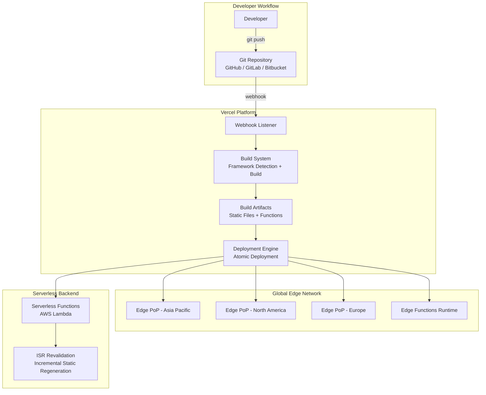

> **Production Environment Security Notice**
>
> This documentation contains directly executable operations commands. Before execution, ensure: the current target cluster and namespace are correct; you have sufficient RBAC permissions; and the commands have been verified in a non-production environment. Command risk levels are marked as: 🔴 High Risk (may cause data loss or service interruption), 🟡 Medium Risk (modifies cluster state but usually reversible), 🟢 Low Risk/Read-Only (information gathering, no side effects).

# Vercel Frontend Deployment Platform In-Depth Guide

> **Domain**: Platform Engineering | [[concepts/platform-engineering-sre.md|Platform Engineering]]  
> **Difficulty**: Beginner to Intermediate  
> **Reading Time**: ~45 minutes  
> **Last Updated**: 2026-04-03

---

## Table of Contents

1. [Vercel Overview and Positioning](#1-vercel-overview-and-positioning)
2. [Core Architecture Analysis](#2-core-architecture-analysis)
3. [Quick Start Guide](#3-quick-start-guide)
4. [Project Deployment Hands-On](#4-project-deployment-hands-on)
5. [Serverless Functions](#5-serverless-functions)
6. [Edge Functions and Edge Middleware](#6-edge-functions-and-edge-middleware)
7. [Custom Domains and DNS Configuration](#7-custom-domains-and-dns-configuration)
8. [Environment Variables and Secret Management](#8-environment-variables-and-secret-management)
9. [Preview [[Deployments|Deployments]] Collaboration Workflow](#9-preview-deployments-collaboration-workflow)
10. [Performance Optimization and Web Analytics](#10-performance-optimization-and-web-analytics)
11. [Frontend Framework Selection: Next.js and Major Frameworks Comparison](#11-frontend-framework-selection-nextjs-and-major-frameworks-comparison)
12. [Relationship with [[Kubernetes|Kubernetes]]/Cloud Native Ecosystem](#12-relationship-with-kubernetescloud-native-ecosystem)
13. [Enterprise Features and Security](#13-enterprise-features-and-security)
14. [Common Questions and Troubleshooting](#14-common-questions-and-troubleshooting)
15. [Best Practices Summary](#15-best-practices-summary)

---

## 1. Vercel Overview and Positioning

## 1.1 What is Vercel?

**Vercel** is a cloud platform (PaaS) for frontend developers, founded by Guillermo Rauch, the creator of Next.js, dedicated to providing Web applications with zero-configuration deployment, global edge network acceleration, and Serverless computing capabilities.

> **Core Philosophy**: "Develop. Preview. Ship."  
> Development → Preview → Launch, greatly simplifying the entire process from code to production.

```
Traditional Deployment Model
┌─────────────────────────────────────────────────────────────────┐
│ Dev → Build → Server Setup → Nginx → SSL → CDN → Deploy         │
│                     Time: Hours to Days                            │
└─────────────────────────────────────────────────────────────────┘

Vercel Deployment Model
┌─────────────────────────────────────────────────────────────────┐
│ Dev → git push → Auto Build + Global CDN + HTTPS → Live          │
│                     Time: Tens of Seconds to Minutes              │
└─────────────────────────────────────────────────────────────────┘
```

## 1.2 Vercel's Position in the Developer Platform Ecosystem

```
Developer Platform Layer View
┌──────────────────────────────────────────────────┐
│              Application Layer                    │
│  ┌────────┐ ┌────────┐ ┌────────┐ ┌───────────┐  │
│  │ Vercel │ │Netlify │ │Render  │ │Cloudflare │  │
│  │ Pages  │ │        │ │        │ │  Pages    │  │
│  └────────┘ └────────┘ └────────┘ └───────────┘  │
├──────────────────────────────────────────────────┤
│           Serverless Layer (Compute Layer)        │
│  ┌────────┐ ┌────────┐ ┌────────┐ ┌───────────┐  │
│  │Vercel  │ │AWS     │ │GCP     │ │Cloudflare │  │
│  │Funcs   │ │Lambda  │ │Cloud   │ │Workers    │  │
│  │        │ │        │ │Funcs   │ │           │  │
│  └────────┘ └────────┘ └────────┘ └───────────┘  │
├──────────────────────────────────────────────────┤
│          Infrastructure Layer                     │
│  ┌────────┐ ┌────────┐ ┌────────┐ ┌───────────┐  │
│  │  AWS   │ │  GCP   │ │ Azure  │ │ Alibaba   │  │
│  │        │ │        │ │        │ │  Cloud    │  │
│  └────────┘ └────────┘ └────────┘ └───────────┘  │
├──────────────────────────────────────────────────┤
│        Container Orchestration Layer              │
│  ┌────────────────────────────────────────────┐   │
│  │              Kubernetes                     │   │
│  └────────────────────────────────────────────┘   │
└──────────────────────────────────────────────────┘
```

## 1.3 Core Feature Matrix

| Feature | Description | Use Cases |
|---------|-------------|-----------|
| **Zero-Configuration Deployment** | Git push automatically triggers build and deployment | All frontend projects |
| **Global Edge Network** | Global CDN nodes automatically distribute by proximity | User-facing applications requiring low latency |
| **Preview Deployments** | Each PR/branch automatically generates unique preview URL | Team collaboration, code review |
| **Serverless Functions** | Node.js/Go/Python/Ruby backend functions | Lightweight APIs, BFF layer |
| **Edge Functions** | Lightweight functions executing on edge nodes | Authentication, A/B testing, geo-routing |
| **Custom Domains + HTTPS** | Automatic SSL/TLS certificate configuration | Production environments |
| **Web Analytics** | Built-in Core Web Vitals performance analysis | Performance optimization, user experience monitoring |
| **AI SDK** | Toolkit for building AI-powered Web applications | LLM applications, AI Chatbot |

## 1.4 Supported Frameworks

```yaml
First-Class Support:
  - Next.js          # Vercel's native framework, deep integration
  - SvelteKit        # Svelte's official full-stack framework

Full Support:
  - React (Vite/CRA) # Pure frontend SPA
  - Vue.js / Nuxt    # Vue ecosystem
  - Astro            # Content-driven sites
  - Remix            # React full-stack framework
  - Angular          # Enterprise frontend
  - Solid / SolidStart

Static Sites:
  - Hugo             # Go template engine
  - Gatsby           # React static generation
  - Hexo             # Node.js blog framework
  - Jekyll           # Ruby static site generator
  - VitePress / VuePress
  - Docusaurus       # Documentation sites
```

---

## 2. Core Architecture Analysis

## 2.1 Deployment Architecture



## 2.2 Request Processing Flow

```
User Request Processing Flow

User Browser
    │
    ▼
Vercel Edge Network (Nearest PoP Node)
    │
    ├── Static Resources → Edge Cache Hit → Direct Return (< 50ms)
    │
    ├── Edge Function → Execute at Edge (< 100ms Cold Start)
    │   └── Authentication Check, Geo-routing, A/B Testing, Request Rewrite
    │
    ├── SSR/API Route → Serverless Function Execution
    │   └── On-demand Computing, Auto-scaling
    │
    └── ISR Page → Check Cache Validity
        ├── Cache Valid → Direct Return
        └── Cache Expired → Return Old Page + Background Regeneration
```

## 2.3 Key Technical Concepts

| Concept | Abbreviation | Description |
|---------|--------------|-------------|
| Static Generation | SSG | Pre-render HTML at build time, suitable for pages with infrequent content changes |
| Server-Side Rendering | SSR | Render on server each request, suitable for dynamic personalized content |
| Incremental Static Regeneration | ISR | SSG + On-demand regeneration, balancing performance and freshness |
| Edge Middleware | - | Lightweight logic running on CDN edge, minimal latency |
| Atomic Deployments | - | Deployment atomicity, either fully succeeds or no changes |
| Immutable Deployments | - | Each deployment generates unique URL, never overwritten |

---

## 3. Quick Start Guide

## 3.1 Prerequisites

```bash
# 1. Confirm Node.js version (recommended 18.x or 20.x)
node --version
# Expected output: v20.x.x

# 2. Confirm package manager (npm/yarn/pnpm all work)
npm --version
# Expected output: 10.x.x

# 3. Install Vercel CLI
npm install -g vercel

# 4. Verify installation
vercel --version
# Expected output: Vercel CLI 3x.x.x
```

## 3.2 Method One: Create from Template (Recommended for Beginners)

```bash
# Create project using Next.js template
npx create-next-app@latest my-app
cd my-app

# Local development
npm run dev
# Expected output:
#   ▲ Next.js 14.x.x
#   - Local:        http://localhost:3000
#   - Environments: .env.local

# After confirming local operation is normal, deploy to Vercel
vercel

# First execution will guide you through login and configuration:
# ? Set up and deploy "~/my-app"? [Y/n] y
# ? Which scope do you want to deploy to? → Select your account
# ? Link to existing project? [y/N] n
# ? What's your project's name? → my-app
# ? In which directory is your code located? → ./
# ✅ Production: https://my-app-xxxx.vercel.app
```

## 3.3 Method Two: Import Existing Git Repository

```bash
# Step 1: Login to Vercel
vercel login
# Choose login method: GitHub / GitLab / Bitbucket / Email
# Browser will automatically open to complete authentication

# Step 2: Navigate to existing project directory
cd /path/to/your-existing-project

# Step 3: Link to Vercel
vercel link
# ? What's your project's name? → your-project
# ? In which directory is your code located? → ./
# ✅ Linked to your-account/your-project

# Step 4: Deploy
vercel --prod
# Expected output:
# 🔍 Inspect: https://vercel.com/your-account/your-project/xxxx
# ✅ Production: https://your-project.vercel.app
```

## 3.4 Method Three: Import via Web Interface

```
Operation Steps:
1. Visit https://vercel.com/new
2. Click "Import Git Repository"
3. Select GitHub/GitLab/Bitbucket and authorize
4. Select repository to import
5. Vercel automatically detects framework and configures build command
6. Click "Deploy" → Wait for build completion
7. Get production URL: https://your-project.vercel.app
```

## 3.5 CLI Common Commands Quick Reference

```bash
# === Deployment Related ===
vercel                     # Deploy to Preview environment
vercel --prod              # Deploy to Production environment
vercel --prebuilt          # Deploy using pre-built artifacts

# === Development Related ===
vercel dev                 # Run local Vercel environment simulation
vercel build               # Build locally (no deployment)

# === Environment Variables ===
vercel env add             # Add environment variable
vercel env ls              # List environment variables
vercel env pull .env.local # Pull environment variables to local file

# === Project Management ===
vercel link                # Link local directory to Vercel project
vercel inspect <url>       # View deployment details
vercel logs <url>          # View deployment logs
vercel rollback            # Rollback to previous production deployment

# === Domain Management ===
vercel domains add <domain>    # Add custom domain
vercel domains ls              # List all domains
vercel certs ls                # List SSL certificates
```

---

## 4. Project Deployment Hands-On

## 4.1 Next.js Project (Full-Stack)

```bash
# Create Next.js project
npx create-next-app@latest my-nextjs-app --typescript --tailwind --app
cd my-nextjs-app
```

**Project Structure**:

```
my-nextjs-app/
├── app/
│   ├── layout.tsx          # Root layout
│   ├── page.tsx            # Home page
│   ├── api/
│   │   └── hello/
│   │       └── route.ts    # API Route → Auto-deployed as Serverless Function
│   └── blog/
│       └── [slug]/
│           └── page.tsx    # Dynamic route
├── public/                 # Static assets → Auto-deployed to Edge CDN
├── next.config.js
├── package.json
└── vercel.json             # Vercel configuration (optional)
```

**vercel.json Configuration Example**:

```json
{
  "framework": "nextjs",
  "buildCommand": "npm run build",
  "outputDirectory": ".next",
  "regions": ["hnd1", "sfo1"],
  "headers": [
    {
      "source": "/api/(.*)",
      "headers": [
        { "key": "Cache-Control", "value": "no-store" },
        { "key": "Access-Control-Allow-Origin", "value": "*" }
      ]
    },
    {
      "source": "/(.*)",
      "headers": [
        { "key": "X-Frame-Options", "value": "DENY" },
        { "key": "X-Content-Type-Options", "value": "nosniff" }
      ]
    }
  ],
  "rewrites": [
    { "source": "/api/proxy/:path*", "destination": "https://backend.example.com/:path*" }
  ],
  "redirects": [
    { "source": "/old-page", "destination": "/new-page", "permanent": true }
  ]
}
```

## 4.2 Pure Static Site (VitePress / Hugo)

```bash
# VitePress documentation site
npm init vitepress@latest my-docs
cd my-docs

# vercel.json configuration
cat > vercel.json << 'EOF'
{
  "buildCommand": "npm run docs:build",
  "outputDirectory": ".vitepress/dist",
  "cleanUrls": true
}
EOF

# Deploy
vercel --prod
```

## 4.3 Monorepo Deployment

```json
{
  "buildCommand": "cd packages/web && npm run build",
  "outputDirectory": "packages/web/dist",
  "installCommand": "npm install --workspace=packages/web",
  "rootDirectory": "packages/web"
}
```

---

## 5. Serverless Functions

## 5.1 Basic Usage

```
File Path Mapping:
api/hello.ts          →  GET/POST https://your-app.vercel.app/api/hello
api/users/[id].ts     →  GET/POST https://your-app.vercel.app/api/users/123
api/data/index.ts     →  GET/POST https://your-app.vercel.app/api/data
```

**TypeScript Example**:

```typescript
// api/hello.ts
import type { VercelRequest, VercelResponse } from '@vercel/node';

export default function handler(req: VercelRequest, res: VercelResponse) {
  const { name = 'World' } = req.query;
  res.status(200).json({ message: `Hello, ${name}!` });
}
```

**Next.js App Router Example**:

```typescript
// app/api/users/route.ts
import { NextResponse } from 'next/server';

export async function GET(request: Request) {
  const { searchParams } = new URL(request.url);
  const page = searchParams.get('page') || '1';

  const users = await fetchUsersFromDB(Number(page));
  return NextResponse.json({ users, page });
}

export async function POST(request: Request) {
  const body = await request.json();
  const user = await createUser(body);
  return NextResponse.json(user, { status: 201 });
}
```

## 5.2 Serverless Function Configuration

```json
{
  "functions": {
    "api/heavy-task.ts": {
      "memory": 1024,
      "maxDuration": 30
    },
    "api/quick-response.ts": {
      "memory": 128,
      "maxDuration": 5
    }
  }
}
```

**Configuration Parameters**:

| Parameter | Default | Range | Description |
|-----------|---------|-------|-------------|
| `memory` | 1024 MB | 128 - 3008 MB | Function runtime memory |
| `maxDuration` | 10s (Hobby) / 60s (Pro) | 1 - 300s | Maximum execution time |
| `regions` | `iad1` | See region list | Function deployment regions |

---

## 6. Edge Functions and Edge Middleware

## 6.1 Edge Middleware

Edge Middleware executes before requests reach the application, running on all global edge nodes with minimal latency.

```typescript
// middleware.ts (project root directory)
import { NextResponse } from 'next/server';
import type { NextRequest } from 'next/server';

export function middleware(request: NextRequest) {
  // Example 1: Geo-location routing
  const country = request.geo?.country || 'US';
  if (country === 'CN') {
    return NextResponse.redirect(new URL('/zh', request.url));
  }

  // Example 2: Authentication check
  const token = request.cookies.get('auth-token');
  if (!token && request.nextUrl.pathname.startsWith('/dashboard')) {
    return NextResponse.redirect(new URL('/login', request.url));
  }

  // Example 3: A/B testing
  const bucket = request.cookies.get('ab-bucket')?.value || 
    (Math.random() > 0.5 ? 'a' : 'b');
  const response = NextResponse.next();
  response.cookies.set('ab-bucket', bucket);
  
  if (bucket === 'b') {
    return NextResponse.rewrite(new URL('/experiment-b' + request.nextUrl.pathname, request.url));
  }

  return response;
}

export const config = {
  matcher: ['/((?!api|_next/static|favicon.ico).*)'],
};
```

## 6.2 Edge Functions vs Serverless Functions

| Dimension | Edge Functions | Serverless Functions |
|-----------|----------------|----------------------|
| Execution Location | All global edge nodes | Specified region (e.g., `iad1`) |
| Cold Start | < 100ms | 250ms - 1s |
| Runtime | V8 Isolate (lightweight) | Node.js / Go / Python |
| Maximum Execution Time | 30s | 10s - 300s |
| Memory | 128 MB | 128 - 3008 MB |
| Supported APIs | Web Standard APIs | Full Node.js API |
| Use Cases | Authentication, routing, A/B testing | Database operations, complex logic |

---

## 7. Custom Domains and DNS Configuration

## 7.1 Add Custom Domain

```bash
# CLI method
vercel domains add example.com

# Domain ownership verification (add TXT record)
# Expected output:
# > Verification required. Add the following TXT record:
# > Name:  _vercel.example.com
# > Value: vc-domain-verify=xxxxxxxxxxxx
```

## 7.2 DNS Configuration

```
Configuration Method One: Vercel DNS (Recommended)
Point domain Nameservers to Vercel:
  ns1.vercel-dns.com
  ns2.vercel-dns.com

Configuration Method Two: External DNS
Add the following records:
  Type    Name    Value
  A       @       76.76.21.21
  CNAME   www     cname.vercel-dns.com
```

## 7.3 HTTPS/SSL Certificate

```
Automated Certificate Management Flow:
1. Add domain → Vercel automatically initiates Let's Encrypt certificate request
2. DNS verification passes → Certificate automatically issued
3. Before certificate expiration → Automatic renewal
4. No manual intervention required throughout
```

---

## 8. Environment Variables and Secret Management

## 8.1 Environment Variable Types

```bash
# Add environment variable (interactive)
vercel env add DATABASE_URL

# Select environments:
# ? Which Environments? (select multiple)
#   ● Production    → Production environment
#   ● Preview       → Preview deployments
#   ● Development   → vercel dev local development

# Pull environment variables to local
vercel env pull .env.local
```

## 8.2 Sensitive Information Handling

```
Environment Variable Security Best Practices:
✅ Database passwords, API Keys → Use Vercel Environment Variables (encrypted storage)
✅ Non-sensitive configuration → Can be placed in vercel.json or code
❌ Never commit secrets to Git repository
❌ Do not use environment variables without NEXT_PUBLIC_ prefix in client code

Next.js Environment Variable Prefix Rules:
  NEXT_PUBLIC_*  → Exposed to browser (bundled into JS)
  Others         → Server-side only (Serverless Functions / SSR)
```

---

## 9. Preview Deployments Collaboration Workflow

## 9.1 Workflow

```
Preview Deployment Workflow:

1. Developer creates feature branch
   └── git checkout -b feature/new-header

2. Push to remote repository
   └── git push origin feature/new-header

3. Vercel automatically triggers Preview deployment
   └── Generate unique URL: https://project-git-feature-new-header-team.vercel.app

4. Create Pull Request
   └── Vercel Bot automatically comments PR with preview link and build status

5. Team members click preview link to review
   └── Can comment directly on page via Vercel Toolbar

6. PR merged to main branch
   └── Automatically trigger Production deployment

7. Preview deployment retained as historical snapshot
   └── Can review any version anytime
```

## 9.2 Vercel Bot Integration in PR

```
Vercel Bot Auto-comment Content in GitHub PR:

✅ Deploy Preview ready!

🔗 Preview: https://project-xxxx.vercel.app
📝 Inspect: https://vercel.com/team/project/xxxx

┌──────────────────────┬─────────────┐
│ Build Logs           │ View Logs   │
│ Bundle Size          │ 156 kB      │
│ First Load JS        │ 89 kB       │
│ Pages                │ 12          │
│ Serverless Functions │ 3           │
│ Edge Functions       │ 1           │
└──────────────────────┴─────────────┘
```

---

## 10. Performance Optimization and Web Analytics

## 10.1 Vercel Speed Insights

```
Core Web Vitals Monitoring Metrics:

┌────────────────┬────────────┬──────────────────────────┐
│ Metric         │ Target     │ Meaning                  │
├────────────────┼────────────┼──────────────────────────┤
│ LCP            │ < 2.5s     │ Largest Contentful Paint │
│ FID            │ < 100ms    │ First Input Delay        │
│ CLS            │ < 0.1      │ Cumulative Layout Shift  │
│ INP            │ < 200ms    │ Interaction to Next Paint│
│ TTFB           │ < 800ms    │ Time to First Byte       │
└────────────────┴────────────┴──────────────────────────┘
```

## 10.2 Performance Optimization Checklist

```yaml
Static Asset Optimization:
  - Use next/image for automatic image optimization (WebP/AVIF conversion, lazy loading)
  - Enable gzip/brotli compression (Vercel enabled by default)
  - Set Cache-Control headers appropriately

Rendering Strategy Selection:
  - Infrequent content changes → SSG (generate at build time)
  - Regularly updated content → ISR (incremental regeneration, set revalidate)
  - Highly personalized → SSR + Edge Cache
  - Pure client-side interaction → CSR (Client-Side Rendering)

Code Splitting:
  - Use dynamic import for lazy loading
  - Analyze Bundle Size: vercel inspect <deployment-url>
  - Use @next/bundle-analyzer for visual analysis
```

---

## 11. Frontend Framework Selection: Next.js and Major Frameworks Comparison

Framework selection is critical when deploying projects on Vercel. Next.js, as Vercel's "native framework," has the deepest integration, but not all scenarios are suitable. This section helps you make the right choice.

## 11.1 Rendering Mode Comparison

| Framework | Default Rendering | Server-Side Rendering (SSR) | Static Generation (SSG) | Incremental Regeneration (ISR) |
|-----------|------------------|----------------------------|------------------------|---------------------------------|
| **Next.js** | Server-first (RSC) | ✅ Native | ✅ Native | ✅ Exclusive |
| **React (Vite/CRA)** | Pure Client (CSR) | ❌ Need to Build | ❌ | ❌ |
| **Vue (Vite)** | Pure Client (CSR) | ❌ Need to Build | ❌ | ❌ |
| **Nuxt** | Server-first | ✅ Native | ✅ Native | ✅ |
| **Astro** | Static-first (Zero JS) | ✅ Optional | ✅ Native | ❌ |
| **Remix** | Server-first | ✅ Native | ❌ | ❌ |
| **SvelteKit** | Server-first | ✅ Native | ✅ Native | ❌ |

## 11.2 Next.js vs Pure Frontend Frameworks Core Differences

```
┌─────────────────┬──────────────────┬──────────────────┐
│                 │ React/Vue (Pure SPA) │ Next.js (Full-Stack) │
├─────────────────┼──────────────────┼──────────────────┤
│ Initial Load    │ Blank→Load JS→Render│ Server Direct HTML  │
│ SEO             │ ❌ Search engines cannot see │ ✅ Full HTML indexable │
│ Routing         │ Need react-router │ File system auto-routing │
│ API Backend     │ Need separate service │ Built-in API Routes │
│ Image Optimization │ Manual handling   │ next/image auto-optimize │
│ Code Splitting  │ Manual lazy import │ Auto split by page │
│ Deployment      │ Pure static files │ Need Node.js or Vercel │
└─────────────────┴──────────────────┴──────────────────┘

One-liner summary: React is the engine, Next.js is the complete car.
```

## 11.3 Next.js Exclusive Killer Features

| Feature | Description |
|---------|-------------|
| **App Router + RSC** | React Server Components, components execute on server, no JS sent to browser |
| **ISR** | Incremental Static Regeneration — static pages can refresh on-demand in background, balancing speed and freshness |
| **Middleware** | Intercept requests at Edge layer for authentication/routing/A/B testing |
| **next/image** | Automatic WebP/AVIF conversion, responsive sizes, lazy loading |
| **next/font** | Zero CLS (layout shift), automatic self-host Google Fonts |
| **Server Actions** | Forms directly call server functions, no need to write APIs |

## 11.4 Framework Selection Decision Guide

```yaml
Choose Next.js:
  - Need SEO (official website, blog, e-commerce, documentation)
  - Need fast initial load (SSR/SSG)
  - Want full-stack in one project (frontend + API)
  - Team uses React ecosystem
  - Deploy to Vercel (naturally optimal)

Choose Pure React (Vite):
  - Pure admin dashboard (no SEO needed)
  - Embedded in WebView / Electron application
  - Project is minimal, no server-side logic needed
  - Team has no SSR requirements

Choose Vue / Nuxt:
  - Team more familiar with Vue syntax (templates vs JSX)
  - Nuxt is roughly Vue ecosystem's Next.js

Choose Astro:
  - Content-driven sites (blogs/documentation)
  - Pursuing extreme lightness (zero JS sent to browser by default)
  - Can mix React/Vue/Svelte components
```

## 11.5 Deployment Experience for Frameworks on Vercel

| Framework | Vercel Integration | Zero-Configuration Deployment | Special Optimizations |
|-----------|------------------|--------------------------------|--------------------------|
| **Next.js** | ⭐⭐⭐⭐⭐ | ✅ | ISR, Edge Runtime, Image Optimization, PPR |
| **Nuxt** | ⭐⭐⭐⭐ | ✅ | Nitro server auto-adapt |
| **SvelteKit** | ⭐⭐⭐⭐ | ✅ | adapter-vercel officially maintained |
| **Astro** | ⭐⭐⭐⭐ | ✅ | @astrojs/vercel official adapter |
| **Remix** | ⭐⭐⭐ | ✅ | @vercel/remix adapter |
| **React (Vite)** | ⭐⭐⭐ | ✅ | Pure static, CDN distribution |
| **Vue (Vite)** | ⭐⭐⭐ | ✅ | Pure static, CDN distribution |
| **Angular** | ⭐⭐ | ✅ | Basic support |

> **Conclusion**: If you choose Vercel as your deployment platform, Next.js can get the most platform-level optimizations (ISR, Edge Middleware, Image Optimization, etc.). However, other frameworks deploy smoothly too, just with fewer advanced features.

---

## 12. Relationship with Kubernetes/Cloud Native Ecosystem

## 12.1 Positioning Comparison

```
# 🟢 Low Risk: Read-only/Information gathering, usually no side effects
Vercel vs Kubernetes: Different abstraction layers

Vercel (Frontend PaaS Layer)
├── Developers only care about: Code + Configuration
├── No need to manage: Servers, containers, networking, auto-scaling
├── Suitable for: Frontend applications, JAMstack, lightweight full-stack
└── Underlying: AWS Lambda + CloudFront (managed by Vercel)

Kubernetes (Container Orchestration Layer)
├── Operations need to manage: Pods, Services, Ingress, HPA, PV...
├── Fully controllable: Network policies, resource quotas, security policies
├── Suitable for: Microservices architecture, stateful services, complex backends
└── Underlying: Cloud provider VMs / bare metal
```

## 12.2 Hybrid Architecture Pattern

In enterprises, Vercel and Kubernetes often complement each other:

```
Enterprise-Level Hybrid Architecture Example:

┌─────────────────────────────────────────────────────┐
│                     User Request                    │
│                        │                             │
│                    ┌───▼───┐                         │
│                    │  CDN  │                         │
│                    └───┬───┘                         │
│               ┌────────┴────────┐                    │
│               ▼                 ▼                    │
│     ┌─────────────────┐  ┌──────────────────┐       │
│     │  Vercel          │  │  Kubernetes       │       │
│     │  ─────           │  │  ──────────       │       │
│     │  • Marketing Site│  │  • Core API       │       │
│     │  • Documentation │  │  • Microservices  │       │
│     │  • Admin Frontend│  │  • Databases      │       │
│     │  • Landing Pages │  │  • Message Queue  │       │
│     │  • AI Chatbot UI │  │  • ML Inference   │       │
│     └────────┬────────┘  └────────┬─────────┘       │
│              │                    │                   │
│              └────────┬───────────┘                   │
│                       │                               │
│              ┌────────▼──────────┐                    │
│              │ Shared Infrastructure│                 │
│              │ • Auth Service (SSO)│                  │
│              │ • Object Storage (S3)│                 │
│              │ • Monitoring & Alerts│                 │
│              └───────────────────┘                    │
└─────────────────────────────────────────────────────┘
```

## 12.3 When to Use Vercel, When to Use Kubernetes

| Scenario | Recommended Solution | Reason |
|----------|----------------------|--------|
| Company Website / Marketing Pages | Vercel | Zero operations, global CDN, SEO friendly |
| Documentation Site | Vercel | Static generation, auto-deployment |
| Admin Dashboard Frontend | Vercel | Fast iteration, Preview deployment |
| Core Business API | Kubernetes | Requires persistent connections, complex orchestration |
| Microservices Cluster | Kubernetes | Service discovery, load balancing, elasticity |
| Stateful Service (Database, etc.) | Kubernetes | Persistent storage, stateful set management |
| AI/ML Inference Service | Kubernetes | GPU scheduling, custom runtime |
| Lightweight BFF / API Gateway | Vercel Serverless | On-demand scaling, serverless management |

---

## 13. Enterprise Features and Security

## 13.1 Vercel Plan Comparison

| Feature | Hobby (Free) | Pro ($20/month) | Enterprise |
|---------|-------------|-----------------|-----------|
| Deployments | Unlimited | Unlimited | Unlimited |
| Bandwidth | 100 GB | 1 TB | Custom |
| Serverless Execution Time | 10s | 60s | 300s |
| Team Members | 1 | Unlimited | Unlimited |
| Preview Deployments | ✅ | ✅ | ✅ |
| Custom Domains | ✅ | ✅ | ✅ |
| DDoS Protection | Basic | Advanced | Enterprise |
| SSO/SAML | ❌ | ❌ | ✅ |
| SLA | ❌ | 99.99% | Custom |
| Audit Logs | ❌ | ❌ | ✅ |
| IP Whitelist | ❌ | ❌ | ✅ |

## 13.2 Security Best Practices

```yaml
Deployment Security:
  - Enable Deployment Protection: Only authorized users can access Preview deployments
  - Enable Git Authentication: Ensure only trusted repositories trigger deployments
  - Regularly rotate secrets in environment variables

Network Security:
  - Configure secure response headers (CSP, HSTS, X-Frame-Options)
  - Use Vercel Firewall (Enterprise) to configure WAF rules
  - Enable DDoS Protection

Code Security:
  - Don't expose sensitive environment variables on client-side
  - Use Vercel's Secret management functionality
  - Enable dependency security scanning
```

---

## 14. Common Questions and Troubleshooting

## 14.1 Build Failures

```bash
# View build logs
vercel logs <deployment-url>

# Common build errors and solutions:

# Error: Module not found
# Cause: Dependency not installed correctly
# Solution: Ensure all dependencies in package.json, check if .gitignore accidentally ignored files

# Error: Build exceeded maximum duration
# Cause: Build timeout (Hobby: 45min, Pro: 45min)
# Solution: Optimize build process, reduce unnecessary build steps

# Error: Function size too large (> 50MB)
# Cause: Serverless Function package size exceeds limit
# Solution: Check dependencies, use tree-shaking, exclude unnecessary packages
```

## 14.2 Deployment Success but Page Abnormal

```bash
# Troubleshooting steps:
# 1. Confirm if local vercel dev is normal
vercel dev

# 2. Check if environment variables are configured in all environments
vercel env ls

# 3. Check vercel.json configuration
# Common issue: rewrites/redirects rules conflict

# 4. View Function logs
vercel logs <deployment-url> --follow

# 5. Use Inspect to view deployment details
vercel inspect <deployment-url>
```

## 14.3 Performance Issues

```
Performance Troubleshooting Checklist:

1. TTFB Too High
   ├── Check Serverless Function cold start → Consider using Edge Functions
   ├── Check database query latency → Ensure database and Function in same region
   └── Check Function region configuration → vercel.json regions field

2. LCP Too High
   ├── Check if images use next/image optimization
   ├── Check font loading strategy → Use next/font
   └── Check if initial page has unnecessary client-side rendering

3. Bundle Size Too Large
   ├── Use @next/bundle-analyzer for analysis
   ├── Check if libraries are properly tree-shaked
   └── Consider using dynamic import for code splitting
```

---

## 15. Best Practices Summary

## 15.1 Project Configuration Best Practices

```yaml
Recommended Project Configuration:
  Framework Selection:
    - Full-Stack Application: Next.js (App Router)
    - Documentation Site: VitePress / Docusaurus
    - Static Blog: Astro
    - Lightweight SPA: React + Vite

  Deployment Configuration:
    - Always declare configuration using vercel.json
    - Set reasonable memory and maxDuration for Serverless Functions
    - Configure secure response headers
    - Use regions to specify nearest region

  Team Collaboration:
    - Fully leverage Preview Deployments for code review
    - Use Vercel Comments for direct feedback on preview pages
    - Separate environment variables by environment (Production / Preview / Development)

  Performance Optimization:
    - Prioritize SSG/ISR over SSR
    - Use Edge Middleware for authentication and routing
    - Use next/image and next/font to optimize resource loading
    - Monitor Core Web Vitals, keep Performance Score > 90
```

## 15.2 Vercel Learning Resources

| Resource | Link | Description |
|----------|------|-------------|
| Vercel Official Documentation | https://vercel.com/docs | Authoritative technical documentation |
| Next.js Official Documentation | https://nextjs.org/docs | Next.js framework documentation |
| Vercel Templates | https://vercel.com/templates | Ready-to-use project templates |
| Vercel Blog | https://vercel.com/blog | Technical blog and best practices |
| AI SDK Documentation | https://sdk.vercel.ai | Toolkit for building AI applications |
| Next.js Learn | https://nextjs.org/learn | Official interactive tutorials |

---

## Reference Links

- [Vercel Official Website](https://vercel.com)
- [Vercel CLI Documentation](https://vercel.com/docs/cli)
- [Next.js on Vercel](https://vercel.com/docs/frameworks/nextjs)
- [Vercel Edge Functions](https://vercel.com/docs/functions/edge-functions)
- [Vercel AI SDK](https://sdk.vercel.ai)

---

*This documentation is maintained by the cloud-native technology expert team, content based on Vercel's latest platform features in 2026.*

---

## Obsidian Related Documentation

- domain-07-platform-engineering KUDIG Database — Global MOC
- [[domain-07-platform-engineering/README.md|Domain 07: Platform Engineering]]
- Domain-36 Platform Engineering — Open Source Project Index
- Platform Engineering Overview and Maturity Model
- Internal Developer Platform Design Principles
- Backstage Deployment and Configuration
- Backstage Software Catalog and TechDocs
- Backstage Scaffolder and Template System
- Kratix Platform as Code
- Crossplane Platform Composition
- Golden Paths Design Patterns
- Developer Experience Metrics

## See Also

- 09-developer-experience-metrics
- 10-platform-team-topology
- 99-backstage-idp-guide
- 01-platform-engineering-overview