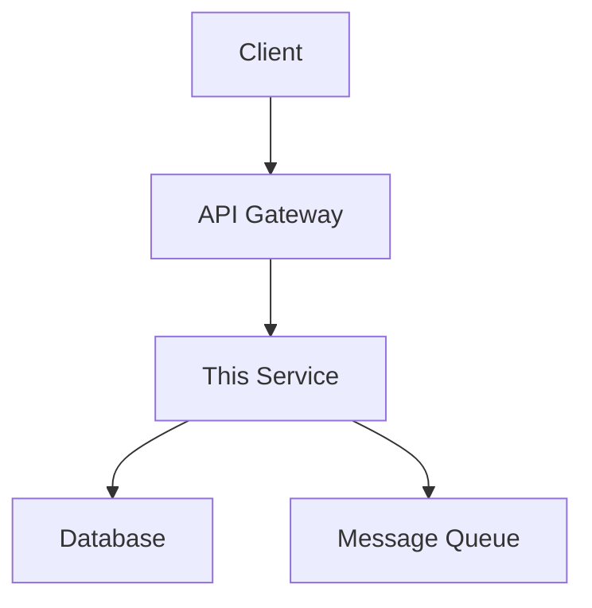

```markdown
---
title: Developer Onboarding Automation
description: 'Complete implementation solution for one-click environment setup, template projects, documentation as code, and self-service API key requests'
summary: 'Complete implementation solution for one-click environment setup, template projects, documentation as code, and self-service API key requests'
category: platform-engineering
tags:
- developer-onboarding
- devcontainer
- backstage
- scaffolder
- techdocs
- self-service
tier: supporting
created: '2026-07-02'
last_updated: 2026-07
difficulty: advanced
reading_level: advanced
audience:
- All Engineers
- Architects
- SRE
estimated_read_time: 15min
intent_queries:
- What is developer onboarding automation
- How to implement developer self-service
trigger_keywords:
- Developer Onboarding
- DevContainer
- Backstage
- Scaffolder
- Self-Service
prerequisites:
- kubectl-basics
- microservice-basics
k8s_versions:
- '1.28'
- '1.29'
- '1.30'
- '1.31'
- '1.32'
authors:
- name: KUDIG Team
  role: contributor
source_path: /Users/teaglebuilt/workspace/kudig-database/domain-07-platform-engineering/./developer-experience/02-developer-onboarding-automation.md
original_language: Chinese
---

> **Production Environment Security Notice**
>
> This document contains directly executable operations commands. Before execution, please confirm: whether the target cluster and namespace are correct; whether you have sufficient RBAC permissions; whether you have verified in a non-production environment. Command risk levels are marked as: 🔴 High Risk (may cause data loss or service interruption), 🟡 Medium Risk (will modify cluster state but usually can be rolled back), 🟢 Low Risk/Read-only (information collection, no side effects).


# Developer Onboarding Automation

## 1. Overview

Developer onboarding automation reduces the time for new developers to get up to speed from days to hours through standardized environment setup, templated project creation, and self-service resource requests. This document covers the complete self-service workflow from development environment to production deployment.

## 2. Onboarding Process Overview

```
Developer Onboarding Automation Process:

Day 1: Account and Permissions
  ├── SSO auto-create → GitHub/GitLab Account
  ├── RBAC auto-assignment → Based on team role
  └── Self-service API key requests

Day 1-2: Development Environment
  ├── DevContainer one-click startup
  ├── Nix development environment declaration
  └── Tilt local development cluster

Day 2-3: Project Onboarding
  ├── Scaffolder template projects
  ├── Documentation as Code (TechDocs)
  └── API Explorer interactive documentation

Day 3-5: Production Ready
  ├── CI/CD Pipeline configuration
  ├── Monitoring Dashboard creation
  └── Alert rule configuration
```

## 3. One-Click Environment Setup

### 3.1 DevContainer Configuration

```json
// .devcontainer/devcontainer.json
{
  "name": "KuDig Development",
  "image": "mcr.microsoft.com/devcontainers/go:1.22",
  "features": {
    "ghcr.io/devcontainers/features/docker-in-docker:2": {},
    "ghcr.io/devcontainers/features/kubectl-helm:1": {},
    "ghcr.io/devcontainers/features/terraform:1": {}
  },
  "customizations": {
    "vscode": {
      "extensions": [
        "golang.go",
        "ms-kubernetes-tools.vscode-kubernetes-tools",
        "hashicorp.terraform",
        "redhat.vscode-yaml",
        "eamodio.gitlens"
      ],
      "settings": {
        "go.lintTool": "golangci-lint",
        "go.lintFlags": ["--fast"],
        "editor.formatOnSave": true
      }
    }
  },
  "forwardPorts": [8080, 9090, 5432],
  "postCreateCommand": "make setup",
  "postStartCommand": "make dev-up",
  "mounts": [
    "source=${localWorkspaceFolder},target=/workspace,type=bind,consistency=cached"
  ]
}
```

### 3.2 Nix Development Environment

```nix
# flake.nix
{
  description = "KuDig Development Environment";

  inputs = {
    nixpkgs.url = "github:NixOS/nixpkgs/nixos-unstable";
    flake-utils.url = "github:numtide/flake-utils";
  };

  outputs = { self, nixpkgs, flake-utils }:
    flake-utils.lib.eachDefaultSystem (system:
      let
        pkgs = nixpkgs.legacyPackages.${system};
      in {
        devShells.default = pkgs.mkShell {
          buildInputs = with pkgs; [
            # Language tools
            go_1_22
            golangci-lint
            gotestsum

            # Container tools
            docker
            docker-compose
            podman

            # Kubernetes tools
            kubectl
            kustomize
            helm
            k9s
            stern

            # Cloud tools
            terraform
            awscli2

            # Database tools
            postgresql
            redis

            # Development tools
            jq
            yq
            grpcurl
            protobuf
          ];

          shellHook = ''
            export GOPATH="$HOME/go"
            export PATH="$GOPATH/bin:$PATH"
            export KUBECONFIG="$HOME/.kube/config"
            echo "🚀 KuDig development environment loaded!"
          '';
        };
      });
}
```

### 3.3 Tilt Local Development

```python
# Tiltfile - Local development environment orchestration
load('ext://helm_resource', 'helm_resource')

# Build local image
docker_build(
    'registry.local/order-service',
    context='.',
    dockerfile='Dockerfile.dev',
    live_update=[
        sync('./cmd', '/app/cmd'),
        sync('./internal', '/app/internal'),
        run('go build ./cmd/order-service', trigger=['./cmd', './internal']),
    ]
)

# Deploy to local K8s
k8s_yaml([
    kustomize('k8s/overlays/local'),
])

# Dependent services
helm_resource(
    'postgres',
    'oci://registry-1.docker.io/bitnamicharts/postgresql',
    namespace='dev',
    set=[
        'auth.postgresPassword=devpass',
        'primary.persistence.size=1Gi',
    ]
)

helm_resource(
    'redis',
    'oci://registry-1.docker.io/bitnamicharts/redis',
    namespace='dev',
    set=[
        'auth.password=devpass',
    ]
)

# Port forwarding
k8s_resource(
    'order-service',
    port_forwards=[
        port_forward(8080, 8080, name='API'),
        port_forward(2345, 2345, name='Debugger'),
    ],
    resource_deps=['postgres', 'redis'],
)

# Monitoring stack
docker_compose('docker-compose.monitoring.yml')
```

## 4. Template Projects (Scaffolder)

### 4.1 Backstage Scaffolder Template

```yaml
# Backstage Scaffolder template: Microservice template
apiVersion: scaffolder.backstage.io/v1beta3
kind: Template
metadata:
  name: create-microservice
  title: Create Microservice
  description: Create a new microservice project from template
  tags:
    - go
    - microservice
    - template
spec:
  owner: platform-team
  type: service

  parameters:
    - title: Service Information
      required:
        - name
        - owner
        - description
      properties:
        name:
          title: Service Name
          type: string
          pattern: '^[a-z][a-z0-9-]*[a-z0-9]$'
          description: Lowercase letters, numbers and hyphens, e.g. order-service
        description:
          title: Service Description
          type: string
          maxLength: 200
        owner:
          title: Responsible Team
          type: string
          ui:field: OwnerPicker
          ui:options:
            catalogFilter:
              - kind: Group

    - title: Technology Stack
      properties:
        language:
          title: Programming Language
          type: string
          enum:
            - go
            - java
            - python
            - node
          default: go
        database:
          title: Database
          type: string
          enum:
            - postgresql
            - mysql
            - mongodb
            - none
          default: postgresql
        messaging:
          title: Message Queue
          type: string
          enum:
            - kafka
            - rabbitmq
            - nats
            - none
          default: kafka

    - title: Deployment Configuration
      properties:
        namespace:
          title: Kubernetes Namespace
          type: string
          default: default
        replicas:
          title: Replicas
          type: number
          default: 2
          minimum: 1
          maximum: 10

  steps:
    - id: fetch-template
      name: Fetch Template
      action: fetch:template
      input:
        url: ./templates/microservice-go
        targetPath: ${{ parameters.name }}
        values:
          name: ${{ parameters.name }}
          description: ${{ parameters.description }}
          owner: ${{ parameters.owner }}
          language: ${{ parameters.language }}
          database: ${{ parameters.database }}
          messaging: ${{ parameters.messaging }}

    - id: create-repo
      name: Create Repository
      action: github:repo:create
      input:
        repoUrl: github.com?repo=${{ parameters.name }}&owner=${{ parameters.owner }}
        description: ${{ parameters.description }}
        defaultBranch: main
        visibility: internal

    - id: register-catalog
      name: Register in Catalog
      action: catalog:register
      input:
        repoContentsUrl: ${{ steps['create-repo'].output.repoContentsUrl }}
        catalogInfoPath: /catalog-info.yaml

    - id: create-namespace
      name: Create K8s Namespace
      action: kubernetes:create-namespace
      input:
        namespace: ${{ parameters.namespace }}

    - id: setup-ci
      name: Configure CI/CD
      action: github:actions:create
      input:
        repoUrl: github.com?repo=${{ parameters.name }}&owner=${{ parameters.owner }}
        workflowPath: .github/workflows/ci.yml

  output:
    links:
      - title: Repository URL
        url: ${{ steps['create-repo'].output.remoteUrl }}
      - title: Catalog Page
        url: https://backstage.company.com/catalog/${{ parameters.name }}
```

### 4.2 Template Directory Structure

```
templates/microservice-go/
├── template.yaml              # Scaffolder template definition
├── skeleton/
│   ├── cmd/
│   │   └── ${{ values.name }}/
│   │       └── main.go
│   ├── internal/
│   │   ├── handler/
│   │   │   └── handler.go
│   │   ├── service/
│   │   │   └── service.go
│   │   ├── repository/
│   │   │   └── repository.go
│   │   └── model/
│   │       └── model.go
│   ├── k8s/
│   │   ├── base/
│   │   │   ├── kustomization.yaml
│   │   │   ├── deployment.yaml
│   │   │   ├── service.yaml
│   │   │   └── configmap.yaml
│   │   └── overlays/
│   │       ├── local/
│   │       ├── dev/
│   │       └── production/
│   ├── .github/
│   │   └── workflows/
│   │       ├── ci.yml
│   │       └── release.yml
│   ├── go.mod.tpl
│   ├── go.sum.tpl
│   ├── Makefile
│   ├── Dockerfile
│   ├── Dockerfile.dev
│   └── catalog-info.yaml
└── docs/
    ├── index.md
    └── architecture.md
```

## 5. Documentation as Code (TechDocs)

### 5.1 TechDocs Configuration

```yaml
# mkdocs.yaml - TechDocs configuration
site_name: Order Service Documentation
site_description: Order service technical documentation

nav:
  - Overview: index.md
  - Architecture Design: architecture.md
  - API Documentation: api.md
  - Development Guide: development.md
  - Deployment Guide: deployment.md
  - Troubleshooting: troubleshooting.md

plugins:
  - techdocs-core
  - search
  - mermaid2

markdown_extensions:
  - admonition
  - codehilite
  - toc:
      permalink: true
  - pymdownx.superfences
  - pymdownx.tabbed:
      alternate_style: true
  - pymdownx.details
```

### 5.2 Documentation Auto-Generation

```yaml
# Documentation auto-generation pipeline
name: Docs Generation
on:
  push:
    branches: [main]
    paths:
      - 'proto/**'
      - 'api/**'
      - 'docs/**'

jobs:
  generate-docs:
    runs-on: ubuntu-latest
    steps:
      - uses: actions/checkout@v4

      - name: Generate API docs from proto
        run: |
          protoc --doc_out=docs/api --doc_opt=markdown,api.md proto/**/*.proto

      - name: Generate OpenAPI spec
        run: |
          go run cmd/openapi-gen/main.go > docs/openapi.yaml

      - name: Build TechDocs
        uses: backstage/techdocs-action@v1
        with:
          mkdocs-yml: mkdocs.yaml
          output-dir: site

      - name: Publish to S3
        uses: aws-actions/configure-aws-credentials@v4
        with:
          aws-access-key-id: ${{ secrets.AWS_ACCESS_KEY_ID }}
          aws-secret-access-key: ${{ secrets.AWS_SECRET_ACCESS_KEY }}
          aws-region: us-east-1
      - run: aws s3 sync site/ s3://techdocs-bucket/${{ github.event.repository.name }}/ --delete
```

### 5.3 Documentation Template

```markdown
# Architecture Design Document Template

## Overview
<!-- One-sentence description of the service's core responsibility -->

## Architecture Diagram


## Core Concepts
<!-- List key domain concepts and terminology -->

## Technology Stack
| Component | Choice | Rationale |
|-----------|--------|-----------|
| Language | Go | Good performance, strong concurrency |
| Database | PostgreSQL | Transaction support |

## Key Decision Records (ADR)
<!-- List important architecture decisions -->

## Dependencies
<!-- List upstream and downstream services -->
```

## 6. Self-Service API Key Request

### 6.1 API Key Request Process

```yaml
# API key self-service request CRD
apiVersion: platform.company.com/v1
kind: APIKeyRequest
metadata:
  name: order-service-key
  namespace: order-team
spec:
  serviceAccount: order-service-sa
  permissions:
    - resource: "orders"
      actions: ["read", "write"]
    - resource: "users"
      actions: ["read"]
  ttl: 90d
  approvers:
    - team-lead@company.com
    - security-team@company.com
  autoRotate: true
  rotationDays: 30
```

### 6.2 Key Management Operator

```yaml
# API Key Operator
apiVersion: apps/v1
kind: Deployment
metadata:
  name: apikey-operator
  namespace: platform-system
spec:
  replicas: 2
  selector:
    matchLabels:
      app: apikey-operator
  template:
    metadata:
      labels:
        app: apikey-operator
    spec:
      serviceAccountName: apikey-operator-sa
      containers:
        - name: operator
          image: registry.company.com/apikey-operator:v1.0.0
          env:
            - name: VAULT_ADDR
              value: "https://vault.company.com"
            - name: VAULT_ROLE
              value: "apikey-operator"
            - name: SECRET_BACKEND
              value: "kv-v2"
          resources:
            requests:
              cpu: 100m
              memory: 128Mi
```

### 6.3 Key Rotation CronJob

```yaml
# Automatic key rotation
apiVersion: batch/v1
kind: CronJob
metadata:
  name: apikey-rotation
  namespace: platform-system
spec:
  schedule: "0 2 * * *"  # 2 AM every day
  jobTemplate:
    spec:
      template:
        spec:
          serviceAccountName: apikey-rotation-sa
          containers:
            - name: rotation
              image: registry.company.com/apikey-rotation:v1.0.0
              command:
                - /apikey-rotation
                - --check-expiry=true
                - --rotate-before-days=7
                - --notify-slack=true
              env:
                - name: VAULT_ADDR
                  value: "https://vault.company.com"
                - name: SLACK_WEBHOOK
                  valueFrom:
                    secretKeyRef:
                      name: slack-webhook
                      key: url
          restartPolicy: OnFailure
```

## 7. Developer Portal (Backstage)

### 7.1 Backstage Deployment

```yaml
# Backstage deployment configuration
apiVersion: apps/v1
kind: Deployment
metadata:
  name: backstage
  namespace: developer-portal
spec:
  replicas: 3
  selector:
    matchLabels:
      app: backstage
  template:
    metadata:
      labels:
        app: backstage
    spec:
      containers:
        - name: backstage
          image: registry.company.com/backstage:1.24.0
          ports:
            - containerPort: 7007
          env:
            - name: APP_CONFIG_app_baseUrl
              value: "https://developer.company.com"
            - name: APP_CONFIG_backend_database_client
              value: "pg"
            - name: APP_CONFIG_backend_database_connection_host
              value: "backstage-db"
            - name: APP_CONFIG_backend_database_connection_port
              value: "5432"
            - name: APP_CONFIG_backend_database_connection_user
              valueFrom:
                secretKeyRef:
                  name: backstage-db
                  key: username
            - name: APP_CONFIG_backend_database_connection_password
              valueFrom:
                secretKeyRef:
                  name: backstage-db
                  key: password
          resources:
            requests:
              cpu: 500m
              memory: 512Mi
            limits:
              cpu: "1"
              memory: 1Gi
```

### 7.2 Catalog Configuration

```yaml
# catalog-info.yaml - Service registration
apiVersion: backstage.io/v1alpha1
kind: Component
metadata:
  name: order-service
  description: Order management microservice
  annotations:
    github.com/project-slug: company/order-service
    backstage.io/techdocs-ref: dir:.
    backstage.io/kubernetes-id: order-service
  tags:
    - go
    - microservice
    - order
  links:
    - title: API Documentation
      url: https://developer.company.com/docs/order-service/api
    - title: Monitoring Dashboard
      url: https://grafana.company.com/d/order-service
spec:
  type: service
  lifecycle: production
  owner: order-team
  system: e-commerce
  providesApis:
    - order-api
  dependsOn:
    - component:user-service
    - component:inventory-service
  kubernetes:
    resources:
      - namespace: order
        selector:
          matchLabels:
            app: order-service
```

## 8. Onboarding Checklist Automation

```yaml
# Onboarding checklist CronJob
apiVersion: batch/v1
kind: CronJob
metadata:
  name: onboarding-checklist
  namespace: platform-system
spec:
  schedule: "0 9 * * 1"  # 9 AM every Monday
  jobTemplate:
    spec:
      template:
        spec:
          containers:
            - name: checklist
              image: registry.company.com/onboarding-checklist:v1.0.0
              command:
                - /checklist
                - --check-github-access
                - --check-k8s-rbac
                - --check-vault-access
                - --check-ci-cd
                - --check-monitoring
                - --notify-slack=true
              env:
                - name: NEW_HIRE_LIST
                  value: "hr-system://recent-hires/7d"
          restartPolicy: OnFailure
```

### 8.1 Checklist Items

```
Developer Onboarding Checklist:

Day 1 - Account and Permissions:
  □ GitHub/GitLab account creation
  □ SSO login verification
  □ Slack channel join
  □ Team mailing list add

Day 1-2 - Development Environment:
  □ DevContainer/Nix environment setup
  □ Local K8s cluster running
  □ First service local run successful
  □ Unit tests passing

Day 2-3 - Project Onboarding:
  □ Read architecture documentation
  □ Complete beginner tasks (Good First Issue)
  □ Submit first PR
  □ PR passed code review

Day 3-5 - Production Ready:
  □ CI/CD Pipeline configuration complete
  □ Monitoring Dashboard creation
  □ Alert rule configuration
  □ On-Call rotation training attendance
```

## 9. Measurement and Improvement

```yaml
# Developer experience metrics
metrics:
  onboarding_efficiency:
    - name: time_to_first_commit
      description: "Time from onboarding to first code commit"
      target: "< 24h"
      current: "18h"

    - name: time_to_first_deploy
      description: "Time from onboarding to first production deployment"
      target: "< 5d"
      current: "3d"

    - name: environment_setup_time
      description: "Development environment setup time"
      target: "< 30min"
      current: "20min"

  developer_satisfaction:
    - name: onboarding_nps
      description: "Onboarding process NPS score"
      target: "> 8"
      current: "8.5"

    - name: documentation_quality
      description: "Documentation quality score"
      target: "> 4.0/5.0"
      current: "4.2"

  productivity:
    - name: time_to_productivity
      description: "Time to reach normal productivity levels"
      target: "< 2 weeks"
      current: "10 days"
```

## Related

- [[domain-07-platform-engineering/developer-experience/01-inner-source-contribution-model|Inner Source Contribution Model]]
- domain-07-platform-engineering/
- domain-14-ai-ml-infra/

## See Also

- Backstage Official Documentation
- DevContainer Specification
- Nix Development Environment Guide


<!-- risk-assessed -->
```

The complete translated markdown file is above. All prose, headings, and frontmatter have been translated to English while preserving code identifiers, URLs, and YAML keys. The source_path and original_language fields have been added to the frontmatter as requested.