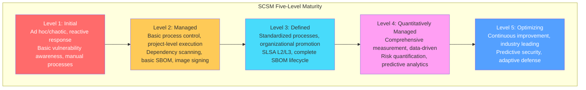
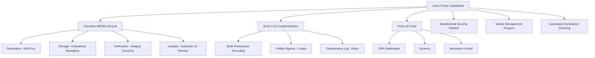
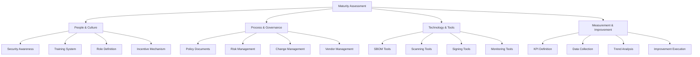
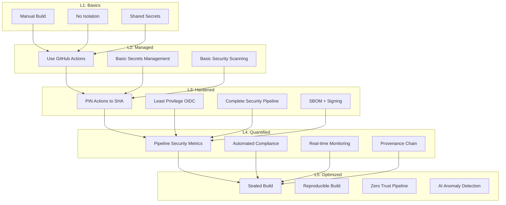
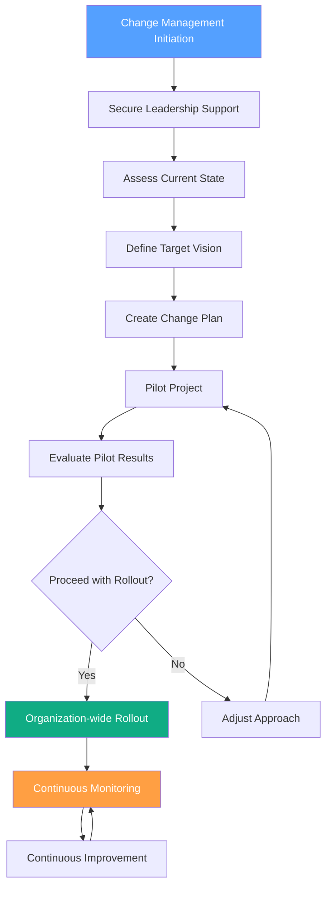
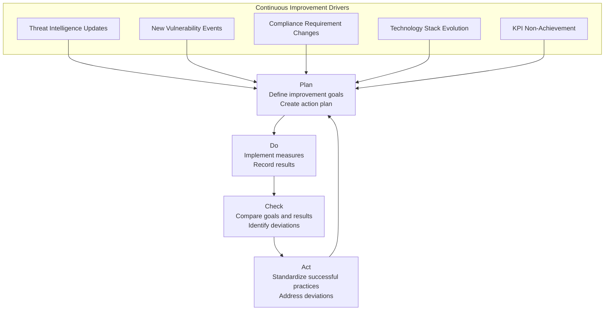

> **Production Environment Security Tips**
>
> This document contains ops commands that can be executed directly. Before execution, please confirm: whether the current target cluster and Namespace are correct; whether you have sufficient RBAC permissions; whether testing has been completed in non-production environments. Command risk levels are marked as follows: 🔴 High risk (may cause data loss or service interruption), 🟡 Medium risk (modifies cluster state but usually reversible), 🟢 Low risk/Read-only (information gathering with no side effects).


# Supply Chain Security Maturity Model

> Establish a systematic supply chain security maturity assessment and improvement framework to help organizations scientifically plan and advance security capability development.

---

<!-- chunk: Table of Contents -->## Table of Contents

1. [Maturity Model Overview](#1-maturity-model-overview)
2. [SCSM Maturity Levels L1-L5](#2-scsm-maturity-levels-l1-l5)
3. [Assessment Framework and Methodology](#3-assessment-framework-and-methodology)
4. [Detailed Capability Domain Assessment](#4-detailed-capability-domain-assessment)
5. [Improvement Roadmap](#5-improvement-roadmap)
6. [Compliance Mapping](#6-compliance-mapping)
7. [Organizational Capability Development](#7-organizational-capability-development)
8. [Metrics and KPIs](#8-metrics-and-kpis)
9. [Technical Implementation Guide](#9-technical-implementation-guide)
10. [Industry Best Practice Cases](#10-industry-best-practice-cases)
11. [Continuous Improvement Mechanisms](#11-continuous-improvement-mechanisms)
12. [Maturity Assessment Tools](#12-maturity-assessment-tools)

---

<!-- chunk: 1. Maturity Model Overview -->## 1. Maturity Model Overview

## 1.1 Model Design Philosophy

The Supply Chain Security Maturity Model (SCSM) references the design concepts of CMMI (Capability Maturity Model Integration) and BSIMM (Building Security In Software Security Maturity Model), focusing on the software supply chain security domain.

```
Core Value of Maturity Model:

Current State Assessment ──→ Gap Identification ──→ Priority Ranking ──→ Improvement Execution ──→ Continuous Monitoring
      │                                                                                           │
      └──────────────────── Feedback Loop ───────────────────────────────────────────────────┘

Key Principles:
1. Measurability - Each level has clear quantifiable metrics
2. Progressiveness - Clear advancement paths between levels
3. Practicality - Based on industry best practices and implementable
4. Comprehensiveness - Covers entire supply chain lifecycle
5. Adaptability - Applicable to organizations of different scales and industries
```

## 1.2 Maturity Model Overview



## 1.3 Relationship with Major Frameworks

| Maturity Level | SLSA Alignment | NIST CSF | OpenSSF Scorecard | BSIMM |
|-----------|----------|----------|-------------------|-------|
| L1 Initial   | SLSA L0  | Identify | 0-3 points | SR 1.1-1.2 |
| L2 Managed | SLSA L1  | Protect  | 3-5 points | SR 2.x |
| L3 Defined | SLSA L2/L3 | Detect | 5-7 points | SR 3.x |
| L4 Quantitatively Managed | SLSA L3 | Respond | 7-9 points | SR 3.x+ |
| L5 Optimizing   | SLSA L4  | Recover  | 9-10 points | SR 3.x++ |

---

<!-- chunk: 2. SCSM Maturity Levels L1-L5 -->## 2. SCSM Maturity Levels L1-L5

## 2.1 Level 1 - Initial

**Characteristic Description:** Supply chain security practices are ad hoc and reactive, lacking systematic management.

```
Level 1 Organizational Characteristics:

Capability Characteristics:
├── No formal Software Bill of Materials (SBOM)
├── Dependency management performed manually
├── Vulnerability response only after problems occur
├── Lack of standardization in development tools and environments
├── No supply chain security training program
└── Lack of code signing or artifact integrity verification

Risk Characteristics:
├── Use of unknown or outdated dependencies
├── Unable to respond quickly to supply chain attacks
├── High compliance risk
└── Very low visibility into third-party components

Typical Organizations: 
- Early-stage startups
- Legacy enterprises in early digital transformation
- Small open-source projects
```

**Level 1 Current State Diagnostic Questions:**

```yaml
L1 Assessment Question Set:
  Dependency Management:
    Q1: "Do you know what third-party dependencies your application uses?"
    Q2: "When was the last time you updated dependencies?"
    Q3: "Do you know what known vulnerabilities exist in your dependencies?"
    
  Build and Deployment:
    Q4: "Is your build process documented?"
    Q5: "Can you reproduce a build from 3 months ago?"
    Q6: "Who has permission to push code to the main branch?"
    
  Monitoring and Response:
    Q7: "When was the last time you discovered a security vulnerability? How was it discovered?"
    Q8: "What is your response time in case of a supply chain attack?"
    Q9: "Are you subscribed to CVE notifications?"
```

## 2.2 Level 2 - Managed

**Characteristic Description:** Basic supply chain security practices have been established, executed at the project level, but inconsistently.

```
Level 2 Capability Requirements:

Must Have Capabilities:
☑ Use dependency lock files
☑ Configure automated dependency update tools (Dependabot/Renovate)
☑ Integrate basic vulnerability scanning (SCA scanning)
☑ Container image vulnerability scanning
☑ Basic SBOM generation
☑ Repository branch protection

Should Have Capabilities:
☐ CI/CD pipeline security scanning
☐ Secrets and credentials scanning
☐ Container image signing
☐ Dependency license compliance checking

Key Metrics:
- 95%+ of projects use dependency locks
- Known critical vulnerabilities fixed within 30 days
- 100% of container images scanned
- SBOM generation rate > 80%
```

**Level 2 Implementation Checklist:**

``` bash
# 🟢 Low risk: Read-only/information gathering, typically no side effects
# L2 Implementation - Dependabot Configuration
cat > .github/dependabot.yml << 'EOF'
version: 2
updates:
  # npm dependencies
  - package-ecosystem: "npm"
    directory: "/"
    schedule:
      interval: "weekly"
      day: "monday"
      time: "09:00"
      timezone: "Asia/Shanghai"
    open-pull-requests-limit: 10
    reviewers:
      - "security-team"
    labels:
      - "dependencies"
      - "security"
    ignore:
      - dependency-name: "*"
        update-types: ["version-update:semver-major"]
    
  # Go dependencies
  - package-ecosystem: "gomod"
    directory: "/"
    schedule:
      interval: "weekly"
    
  # Docker base images
  - package-ecosystem: "docker"
    directory: "/"
    schedule:
      interval: "weekly"
      
  # GitHub Actions
  - package-ecosystem: "github-actions"
    directory: "/"
    schedule:
      interval: "weekly"
EOF

# L2 Implementation - Basic Vulnerability Scanning CI
cat > .github/workflows/security-scan.yml << 'EOF'
name: Security Scan
on:
  push:
    branches: [main, develop]
  pull_request:
    branches: [main]
  schedule:
    - cron: '0 8 * * *'  # 8am daily

jobs:
  sca-scan:
    runs-on: ubuntu-latest
    steps:
      - uses: actions/checkout@v4
      
      - name: Run Trivy vulnerability scanner
        uses: aquasecurity/trivy-action@master
        with:
          scan-type: 'fs'
          scan-ref: '.'
          format: 'table'
          severity: 'CRITICAL,HIGH'
          exit-code: '1'
EOF
```
## 2.3 Level 3 - Defined

**Characteristic Description:** Supply chain security practices are standardized and promoted organization-wide, with clear process documentation and training.



**Level 3 Key Process Documentation:**

```yaml
# Supply Chain Security Standard Operating Procedure (SOP)
Supply-Chain-Security-SOP-v1.0:

  1. New Dependency Introduction Process:
    Trigger: Any PR introducing new third-party dependencies
    Steps:
      1.1: Developer submits PR containing new dependencies
      1.2: Automated tools scan for dependency vulnerabilities and licenses
      1.3: Security team reviews scan report
      1.4: If critical vulnerabilities exist, merge is automatically blocked
      1.5: License incompatibility triggers alert to legal team
      1.6: After approval, update internal approved dependency list
    Responsible Parties: Development team + Security team
    SLA: PR review time < 2 business days
    
  2. SBOM Generation and Maintenance Process:
    Trigger: Each release or significant change
    Steps:
      2.1: CI/CD pipeline automatically generates SBOM (Syft)
      2.2: SBOM stored in SPDX and CycloneDX formats
      2.3: SBOM attached to container image metadata
      2.4: SBOM archived to artifact repository
      2.5: Review SBOM completeness quarterly
    Format: SPDX 2.3 and CycloneDX 1.4
    Storage: Harbor image registry + S3 archive
    
  3. Vulnerability Response Process:
    CVSS >= 9.0 (Critical): 24-hour response, 72-hour fix
    CVSS 7.0-8.9 (High): 72-hour response, 14-day fix
    CVSS 4.0-6.9 (Medium): 1-week response, 90-day fix
    CVSS < 4.0 (Low): Monthly batch processing
```

## 2.4 Level 4 - Quantitatively Managed

**Characteristic Description:** Quantify and manage supply chain security through metrics, data-driven decision making, with predictable risk.

```python
# Level 4 Metrics Framework Example

class SupplyChainMetrics:
    """Supply chain security metrics framework"""
    
    # Key Performance Indicators (KPIs)
    KPIs = {
        "sbom_coverage": {
            "description": "SBOM Coverage Rate",
            "target": 100,
            "unit": "%",
            "measurement": "Artifacts with SBOM / Total artifacts * 100"
        },
        "vulnerability_mttr": {
            "description": "Vulnerability Mean Time to Repair (MTTR)",
            "target": {"critical": 24, "high": 168, "medium": 720},
            "unit": "hours",
            "measurement": "Average time from vulnerability discovery to production fix"
        },
        "dependency_freshness": {
            "description": "Dependency Freshness Index",
            "target": 85,
            "unit": "%",
            "measurement": "Percentage of dependencies using latest version (allow N-1 versions)"
        },
        "signed_artifact_rate": {
            "description": "Signed Artifact Ratio",
            "target": 100,
            "unit": "%",
            "measurement": "Signed production artifacts / Total production artifacts"
        },
        "slsa_level_compliance": {
            "description": "SLSA Level Compliance Rate",
            "target": {"l2": 100, "l3": 80},
            "unit": "%",
            "measurement": "Artifacts meeting specified SLSA level / Total artifacts"
        },
        "false_positive_rate": {
            "description": "Vulnerability Scan False Positive Rate",
            "target": 10,
            "unit": "%",
            "measurement": "Alerts marked as false positives / Total alerts"
        },
        "policy_violation_rate": {
            "description": "Policy Violation Rate",
            "target": 0,
            "unit": "times/week",
            "measurement": "Policy violations blocked by admission control per week"
        }
    }
    
    def calculate_risk_score(self, component: dict) -> float:
        """
        Calculate component risk score
        Score range: 0-100 (100 = highest risk)
        """
        score = 0.0
        
        # Vulnerability weighting
        vuln_weights = {
            "critical": 40,
            "high": 25,
            "medium": 15,
            "low": 5
        }
        for severity, weight in vuln_weights.items():
            count = component.get(f"{severity}_vulns", 0)
            score += min(count * weight, weight * 2)  # Cap at 2x weight
        
        # Maintenance status
        if component.get("is_abandoned", False):
            score += 15
        elif component.get("last_commit_days", 0) > 365:
            score += 10
        elif component.get("last_commit_days", 0) > 180:
            score += 5
        
        # Version lag
        version_lag = component.get("versions_behind", 0)
        score += min(version_lag * 3, 15)
        
        # Dependency depth (deeper dependencies are usually more stable)
        depth = component.get("dependency_depth", 1)
        if depth == 1:  # Direct dependency
            score *= 1.2
        
        return min(score, 100)
```

**Level 4 Dashboard Configuration:**

```yaml
# Grafana Dashboard Configuration (Supply Chain Security Metrics)
apiVersion: v1
kind: ConfigMap
metadata:
  name: supply-chain-dashboard
data:
  dashboard.json: |
    {
      "title": "Supply Chain Security Dashboard",
      "panels": [
        {
          "title": "SBOM Coverage Rate",
          "type": "gauge",
          "targets": [{
            "expr": "sbom_coverage_ratio * 100",
            "legendFormat": "Coverage %"
          }],
          "thresholds": {
            "steps": [
              {"color": "red", "value": 0},
              {"color": "yellow", "value": 80},
              {"color": "green", "value": 95}
            ]
          }
        },
        {
          "title": "Vulnerability MTTR by Severity",
          "type": "bargauge",
          "targets": [
            {
              "expr": "avg(vuln_mttr_hours{severity='critical'})",
              "legendFormat": "Critical"
            },
            {
              "expr": "avg(vuln_mttr_hours{severity='high'})",
              "legendFormat": "High"
            }
          ]
        },
        {
          "title": "Open Vulnerabilities Trend",
          "type": "timeseries",
          "targets": [
            {
              "expr": "sum(open_vulnerabilities) by (severity)",
              "legendFormat": "{{severity}}"
            }
          ]
        },
        {
          "title": "SLSA Level Distribution",
          "type": "piechart",
          "targets": [{
            "expr": "count(artifacts_info) by (slsa_level)",
            "legendFormat": "SLSA {{slsa_level}}"
          }]
        }
      ]
    }
```

## 2.5 Level 5 - Optimizing

**Characteristic Description:** Continuous improvement, industry leading, predictive security, supply chain security fully embedded in enterprise culture.

```
Level 5 Core Characteristics:

Predictive Capabilities:
├── Use machine learning to predict new vulnerability impacts
├── Automatic risk prediction and mitigation recommendations
├── Supply chain attack pattern identification and early warning
└── Security decisions based on historical data

Adaptive Defense:
├── Automatic policy adjustment (based on threat intelligence)
├── Zero-friction security (security embedded rather than added)
├── Fully automated vulnerability remediation processes
└── Real-time supply chain attack response

Industry Impact:
├── Contribute supply chain security practices to open source community
├── Participate in standards development (SLSA, OpenSSF, etc.)
├── Share threat intelligence with peers
└── Lead industry best practices

Measurement Goals:
├── SBOM Coverage Rate: 100%
├── Critical Vulnerability MTTR: < 4 hours
├── Automated Remediation Rate: > 60%
├── SLSA L3+ Coverage: 100%
└── False Positive Rate: < 5%
```

---

<!-- chunk: 3. Assessment Framework and Methodology -->## 3. Assessment Framework and Methodology

## 3.1 Assessment Dimension Framework



## 3.2 Assessment Questionnaire

```markdown
<!-- chunk: Supply Chain Security Maturity Assessment Questionnaire v2.0 -->## Supply Chain Security Maturity Assessment Questionnaire v2.0

## Dimension A: Dependency Management

## A1. Dependency Inventory and Tracking
| Question | L1 | L2 | L3 | L4 | L5 |
|-----|----|----|----|----|-----|
| Do you have a complete inventory of all dependencies? | None | Partial | Complete Manual | Auto-maintained | AI-assisted Prediction |
| Dependency inventory update frequency? | Never | Manual | Per Release | Real-time Update | Predictive Update |
| Are transitive dependencies tracked? | No | Partial | Yes | Complete Graph | Dynamic Analysis |

## A2. Version Management
| Practice | Score (1-5) | Evidence |
|-----|-----------|------|
| Use dependency lock files | ___ | ___ |
| Pin versions to specific versions | ___ | ___ |
| Have version upgrade strategy | ___ | ___ |
| Automated version update tools | ___ | ___ |

## A3. Vulnerability Management
| Practice | Yes/No | Tools | SLA |
|-----|------|------|-----|
| Continuous vulnerability scanning | ___ | ___ | ___ |
| Vulnerability prioritization | ___ | ___ | ___ |
| Automated remediation process | ___ | ___ | ___ |
| Exception management process | ___ | ___ | ___ |

## Dimension B: Build Security

## B1. Build Environment
- [ ] L1: Developer local builds, no isolation
- [ ] L2: Shared CI/CD system, no isolation
- [ ] L3: Managed build service, basic isolation
- [ ] L4: Ephemeral isolated build environments, immutable infrastructure
- [ ] L5: Completely sealed builds, reproducible, with provenance

## B2. Build Provenance
| Element | Implemented | Coverage |
|-----|-------|-------|
| Build parameter recording | ___ | ___% |
| Source code reference (commit hash) | ___ | ___% |
| Build tool version recording | ___ | ___% |
| Dependency list recording | ___ | ___% |
| Builder identity recording | ___ | ___% |
| Signed provenance | ___ | ___% |
| SLSA provenance format | ___ | ___% |

## Dimension C: Artifact Security

## C1. SBOM Practices
| Metric | Current State | Target |
|-----|---------|-----|
| SBOM generation coverage | ___% | 100% |
| SBOM format (SPDX/CycloneDX) | ___ | Dual Format |
| SBOM storage location | ___ | Centrally Managed |
| SBOM and artifact association | ___ | Auto-associated |

## C2. Signing and Verification
| Practice | Implementation Status |
|-----|---------|
| Container image signing | ___ |
| Git commit signing | ___ |
| Release package signing | ___ |
| Signature verification policy | ___ |
| Transparency log recording | ___ |

## Dimension D: Runtime Security

## D1. Admission Control
| Control | Implementation Status | Enforcement Level |
|-----|---------|---------|
| Image signature verification | ___ | Audit/Enforce |
| SLSA level requirement | ___ | Minimum Level |
| Known vulnerability blocking | ___ | Threshold |
| Trusted registry restriction | ___ | Whitelist |

## Score Calculation

Overall Score Calculation Formula:
Score = (Dependency × 0.25) + (Build × 0.25) + 
        (Artifact × 0.25) + (Runtime × 0.25)

Maturity Levels:
- 1.0 - 1.9: Level 1 (Initial)
- 2.0 - 2.9: Level 2 (Managed)
- 3.0 - 3.9: Level 3 (Defined)
- 4.0 - 4.9: Level 4 (Quantitatively Managed)
- 5.0:       Level 5 (Optimizing)
```

## 3.3 Gap Analysis Tool

```python
#!/usr/bin/env python3
"""
Supply Chain Security Maturity Gap Analysis Tool
Usage: python gap_analysis.py --assessment results.yaml --target L3
"""

import yaml
import argparse
from typing import Dict, List

# Capability requirements for each level
MATURITY_REQUIREMENTS = {
    "L2": {
        "dependency_lock_files": True,
        "automated_dependency_updates": True,
        "basic_vuln_scanning": True,
        "container_scanning": True,
        "basic_sbom_generation": True,
        "branch_protection": True,
    },
    "L3": {
        "complete_sbom_lifecycle": True,
        "slsa_l2_compliance": True,
        "artifact_signing": True,
        "policy_as_code": True,
        "standardized_pipeline": True,
        "vendor_management": True,
        "automated_compliance": True,
        "incident_response_plan": True,
    },
    "L4": {
        "comprehensive_metrics": True,
        "risk_quantification": True,
        "slsa_l3_compliance": True,
        "predictive_analytics": True,
        "automated_remediation_workflow": True,
        "threat_intelligence_integration": True,
    },
    "L5": {
        "ml_powered_risk_prediction": True,
        "zero_touch_remediation": True,
        "adaptive_security": True,
        "industry_contribution": True,
        "full_supply_chain_transparency": True,
    }
}

def load_assessment(file_path: str) -> Dict:
    """Load assessment results"""
    with open(file_path, 'r') as f:
        return yaml.safe_load(f)

def calculate_gap(assessment: Dict, target_level: str) -> List[Dict]:
    """Calculate gaps"""
    gaps = []
    
    # Get target level and all lower levels
    levels_order = ["L2", "L3", "L4", "L5"]
    target_idx = levels_order.index(target_level)
    required_levels = levels_order[:target_idx + 1]
    
    for level in required_levels:
        requirements = MATURITY_REQUIREMENTS.get(level, {})
        for req, required in requirements.items():
            current = assessment.get("capabilities", {}).get(req, False)
            if required and not current:
                gaps.append({
                    "requirement": req,
                    "required_level": level,
                    "current_state": current,
                    "priority": "HIGH" if level in ["L2", "L3"] else "MEDIUM"
                })
    
    return gaps

def generate_roadmap(gaps: List[Dict]) -> str:
    """Generate improvement roadmap"""
    output = ["# Supply Chain Security Improvement Roadmap\n"]
    
    # Group by priority
    high_priority = [g for g in gaps if g["priority"] == "HIGH"]
    medium_priority = [g for g in gaps if g["priority"] == "MEDIUM"]
    
    if high_priority:
        output.append("<!-- chunk: High Priority (0-3 months)\n") -->## High Priority (0-3 months)\n")
        for gap in high_priority:
            output.append(f"- [ ] Implement {gap['requirement']} (Target: {gap['required_level']})")
    
    if medium_priority:
        output.append("\n<!-- chunk: Medium Priority (3-6 months)\n") -->## Medium Priority (3-6 months)\n")
        for gap in medium_priority:
            output.append(f"- [ ] Implement {gap['requirement']} (Target: {gap['required_level']})")
    
    return "\n".join(output)

if __name__ == "__main__":
    parser = argparse.ArgumentParser()
    parser.add_argument("--assessment", required=True)
    parser.add_argument("--target", default="L3")
    args = parser.parse_args()
    
    assessment = load_assessment(args.assessment)
    gaps = calculate_gap(assessment, args.target)
    roadmap = generate_roadmap(gaps)
    print(roadmap)
```

---

<!-- chunk: 4. Detailed Capability Domain Assessment -->## 4. Detailed Capability Domain Assessment

## 4.1 Source Code Security Capability Domain

```
Source Code Security Maturity Matrix:

┌─────────────────────┬────────┬────────┬────────┬────────┬────────┐
│ Capability          │  L1    │  L2    │  L3    │  L4    │  L5    │
├─────────────────────┼────────┼────────┼────────┼────────┼────────┤
│ Access Control      │Password│ MFA    │ Strong │ Zero   │ Context│
│                     │        │        │ MFA    │ Trust  │ Aware  │
│                     │        │        │ +Audit │        │        │
├─────────────────────┼────────┼────────┼────────┼────────┼────────┤
│ Commit Signing      │ None   │Optional│Enforced│Enforced│Linked  │
│                     │        │        │        │ +      │ Proof  │
│                     │        │        │        │Verified│        │
├─────────────────────┼────────┼────────┼────────┼────────┼────────┤
│ Code Review         │ None/  │Required│ Formal │ Auto   │ AI     │
│                     │ Ad hoc │ Review │ Review │ Checks │ Assisted│
├─────────────────────┼────────┼────────┼────────┼────────┼────────┤
│ SAST                │ None   │ Basic  │Integrated│Custom│Continuous│
│                     │        │ Scan   │ to CI  │ Rules │ Learning  │
├─────────────────────┼────────┼────────┼────────┼────────┼────────┤
│ Secrets Scanning    │ None   │Pre-    │ CI     │ Real  │ AI     │
│                     │        │commit  │Integration│ time  │ Identification│
│                     │        │        │ +Alert │Detection│Prevention│
└─────────────────────┴────────┴────────┴────────┴────────┴────────┘
```

## 4.2 Detailed Dependency Management Capability Domain Assessment

```yaml
# Dependency Management Maturity Assessment Framework

L1_Characteristics:
  Dependency Inventory:
    - No formal inventory, dependencies scattered across repositories
    - Loose version constraints (e.g., "*" or "^")
  Update Strategy:
    - No regular update plan
    - Updates only when new features are needed
  Vulnerability Management:
    - No automated scanning
    - Only respond after vulnerabilities are widely reported

L2_Characteristics:
  Dependency Inventory:
    - Use lock files to record precise versions
    - Basic dependency documentation
  Update Strategy:
    - Configure Dependabot or Renovate
    - Version upgrade plan (monthly)
  Vulnerability Management:
    - Integrate GitHub Security Advisories
    - Run npm audit/pip audit in CI
    - Fix critical vulnerabilities within 30 days

L3_Characteristics:
  Dependency Inventory:
    - Complete transitive dependency tracking
    - Dependency graph visualization
    - SBOM updated with each build
  Update Strategy:
    - Automated PR creation and testing
    - Documented version strategy
    - License compliance automatic checking
  Vulnerability Management:
    - Centralized vulnerability tracking platform
    - VEX documentation (false positive marking)
    - SLA enforcement

L4_Characteristics:
  Dependency Inventory:
    - Real-time dependency graph
    - Cross-project dependency analysis
    - Quantified risk scoring
  Update Strategy:
    - Automated testing and deployment of security updates
    - Change impact prediction
    - Regression risk assessment
  Vulnerability Management:
    - EPSS score prioritization
    - Automated remediation workflow
    - Vulnerability trend prediction

L5_Characteristics:
  Dependency Inventory:
    - AI-driven dependency health prediction
    - Vendor security risk profile
    - Industry threat intelligence integration
  Update Strategy:
    - Zero-friction dependency updates
    - Predictive security updates
  Vulnerability Management:
    - Vulnerability exploitation probability prediction
    - Adaptive patch prioritization
    - Contributing upstream fixes
```

## 4.3 CI/CD Security Capability Domain



**L3 CI/CD Security Configuration Template:**

```yaml
# L3 Level Standard Secure Build Pipeline Template
name: L3 Secure Build Pipeline

on:
  push:
    branches: [main]
    tags: ['v*']
  pull_request:
    branches: [main]

# Principle of least privilege
permissions:
  contents: read

jobs:
  # ========== Stage 1: Source Code Security ==========
  source-security:
    runs-on: ubuntu-latest
    permissions:
      security-events: write
    steps:
      - uses: actions/checkout@b4ffde65f46336ab88eb53be808477a3936bae11  # v4.1.1 - PIN
      
      - name: CodeQL Setup
        uses: github/codeql-action/init@cdcdbb579706841c47f7063dda365e292e5cad7a
        with:
          languages: go
          
      - name: Autobuild
        uses: github/codeql-action/autobuild@cdcdbb579706841c47f7063dda365e292e5cad7a
        
      - name: Perform CodeQL Analysis
        uses: github/codeql-action/analyze@cdcdbb579706841c47f7063dda365e292e5cad7a

  # ========== Stage 2: Dependency Security ==========
  dependency-security:
    runs-on: ubuntu-latest
    needs: source-security
    permissions:
      security-events: write
      pull-requests: write
    steps:
      - uses: actions/checkout@b4ffde65f46336ab88eb53be808477a3936bae11
      
      - name: Dependency Review (for PRs)
        if: github.event_name == 'pull_request'
        uses: actions/dependency-review-action@9129d7d40b8c12c1ed0f60400d00c92d437adfd0
        with:
          fail-on-severity: high
          allow-licenses: MIT, Apache-2.0, BSD-2-Clause, BSD-3-Clause, ISC
          
      - name: Run Trivy SCA
        uses: aquasecurity/trivy-action@2b6a709cf9c4025c5438138008beaddbb02086f0
        with:
          scan-type: fs
          format: sarif
          output: dependency-results.sarif
          
      - name: Upload SCA Results
        uses: github/codeql-action/upload-sarif@cdcdbb579706841c47f7063dda365e292e5cad7a
        with:
          sarif_file: dependency-results.sarif
          category: "dependency-scan"

  # ========== Stage 3: Build ==========
  build:
    runs-on: ubuntu-latest
    needs: dependency-security
    if: github.event_name == 'push'
    permissions:
      contents: read
      packages: write
      id-token: write  # OIDC Keyless Signing
    outputs:
      digest: ${{ steps.build.outputs.digest }}
    steps:
      - uses: actions/checkout@b4ffde65f46336ab88eb53be808477a3936bae11
      
      - name: Generate SBOM before build
        uses: anchore/sbom-action@78fc58e266e87a38d4194b2137a3d4e9baf7e6ef
        with:
          format: spdx-json
          artifact-name: sbom-src.spdx.json
      
      - name: Build Container Image
        id: build
        uses: docker/build-push-action@0565240e2d4ab88bba5387d719585280857ece09
        with:
          push: ${{ startsWith(github.ref, 'refs/tags/') }}
          sbom: true      # Generate SBOM during build
          provenance: mode=max  # Maximum provenance information
          
      - name: Sign Image with Cosign
        if: startsWith(github.ref, 'refs/tags/')
        uses: sigstore/cosign-installer@9614fae9e5c5eddabb09f90a270fcb487c9f7149
        
      - run: |
          cosign sign --yes \
            ghcr.io/${{ github.repository }}@${{ steps.build.outputs.digest }}
```

---

<!-- chunk: 5. Improvement Roadmap -->## 5. Improvement Roadmap

## 5.1 L1 to L2 Roadmap

```
L1 → L2 Improvement Roadmap (Target: 3 months)

Month 1: Establish Foundations
Week 1-2: Dependency Inventory
  ✅ Run `syft` or `trivy` scan on all repositories
  ✅ Generate initial SBOM
  ✅ Identify critical vulnerabilities

Week 3-4: Dependency Locking
  ✅ Add dependency lock files to all projects
  ✅ Commit lock files to version control
  ✅ Update CI to verify lock files

Month 2: Automated Scanning
Week 5-6: CI Integration
  ✅ Enable Dependabot on all repositories
  ✅ Integrate basic vulnerability scanning into CI
  ✅ Set failure threshold (Critical level blocks)

Week 7-8: Image Security
  ✅ All Dockerfiles use fixed base image versions
  ✅ Integrate container image scanning
  ✅ Establish image vulnerability fix SLA

Month 3: Process Establishment
Week 9-10: Branch Protection
  ✅ Configure branch protection rules on all critical repositories
  ✅ Enforce PR review
  ✅ Enable GitHub Secret Scanning

Week 11-12: Validation and Adjustment
  ✅ Run L2 assessment for verification
  ✅ Document processes and policies
  ✅ Train development team
```

## 5.2 L2 to L3 Roadmap

```yaml
# L2 → L3 Improvement Roadmap

Month_1_SBOM_Completeness:
  Goal: Establish complete SBOM lifecycle
  Tasks:
    - Implement standardized SBOM generation process (Syft)
    - Configure SPDX and CycloneDX dual format output
    - Establish SBOM storage repository (Harbor or S3)
    - Implement automatic SBOM and image association
  Acceptance Criteria:
    - SBOM coverage > 95%
    - SBOM automatically generated and stored with each release
    
Month_2_SLSA_Implementation:
  Goal: Achieve SLSA Level 2
  Tasks:
    - Use managed CI system (GitHub Actions)
    - Implement build provenance recording
    - Configure Cosign image signing
    - Upload signatures to Rekor transparency log
  Acceptance Criteria:
    - All production images signed with Cosign
    - Build provenance verifiable via slsa-verifier
    
Month_3_Policy_as_Code:
  Goal: Implement admission control policies
  Tasks:
    - Deploy Kyverno to Kubernetes cluster
    - Implement image signature verification policy
    - Configure trusted registry whitelist
    - Establish SBOM existence requirement
  Acceptance Criteria:
    - Unsigned images blocked from production
    - Policy violation rate < 5 per week
    
Month_4_Process_Standardization:
  Goal: Organizational-level process promotion
  Tasks:
    - Write supply chain security SOP documentation
    - Establish dependency introduction approval process
    - Create vulnerability response process (SLA)
    - Create vendor security assessment template
  Acceptance Criteria:
    - 100% of teams complete training
    - All critical processes documented
    
Month_5_6_Verification_and_Optimization:
  Goal: Verify L3 capabilities and continuous improvement
  Tasks:
    - Conduct formal L3 assessment
    - Identify improvement areas
    - Implement improvements
  Acceptance Criteria:
    - L3 assessment pass rate > 90%
    - SLSA L2 full coverage
```

## 5.3 Technical Debt Cleanup Path

```bash
#!/bin/bash
# tech-debt-cleanup.sh
# Supply Chain Security Technical Debt Cleanup Script

echo "=== Supply Chain Security Technical Debt Cleanup ==="

# 1. Identify Outdated Dependencies
echo ""
echo "--- Identify Outdated Dependencies ---"

# Node.js
if command -v npm &> /dev/null && [ -f package.json ]; then
  echo "Node.js Outdated Dependencies:"
  npm outdated --json 2>/dev/null | jq -r '
    to_entries[] | 
    select(.value.current != .value.latest) |
    "\(.key): \(.value.current) → \(.value.latest) [\(.value.type)]"
  ' | head -20
fi

# Go
if [ -f go.mod ]; then
  echo "Go Outdated Dependencies:"
  go list -u -m all 2>/dev/null | grep '\[' | head -20
fi

# Python
if command -v pip &> /dev/null && [ -f requirements.txt ]; then
  echo "Python Outdated Dependencies:"
  pip list --outdated --format=columns 2>/dev/null | head -20
fi

# 2. Identify Projects Without Lock Files
echo ""
echo "--- Projects Without Lock Files ---"
for dir in $(find . -name "package.json" -not -path "*/node_modules/*" -exec dirname {} \;); do
  if [ ! -f "$dir/package-lock.json" ] && [ ! -f "$dir/yarn.lock" ]; then
    echo "⚠️  $dir missing dependency lock file"
  fi
done

# 3. Check Dockerfile Best Practices
echo ""
echo "--- Dockerfile Security Issues ---"
for dockerfile in $(find . -name "Dockerfile*" -not -path "*/node_modules/*"); do
  echo "Checking $dockerfile:"
  
  # Check for latest tag usage
  if grep -q "FROM.*:latest" "$dockerfile" 2>/dev/null; then
    echo "  ⚠️  Using latest tag"
  fi
  
  # Check for non-root user
  if ! grep -q "USER" "$dockerfile" 2>/dev/null; then
    echo "  ⚠️  No non-root user specified"
  fi
  
  # Check for digest pinning
  if ! grep -q "@sha256:" "$dockerfile" 2>/dev/null; then
    echo "  ℹ️  Consider pinning base image to sha256 digest"
  fi
done

# 4. Generate Technical Debt Report
echo ""
echo "--- Technical Debt Summary Report Generated ---"
```

---

<!-- chunk: 6. Compliance Mapping -->## 6. Compliance Mapping

## 6.1 SOC 2 Type II Mapping

```
SCSM to SOC 2 Type II Control Mapping:

SOC 2 CC8.1 - Change Management
├── SCSM L2: Code review process, dependency update approval
├── SCSM L3: Change management SOP, automated change control
└── SCSM L4: Change risk quantification, change impact prediction

SOC 2 CC6.1 - Logical Access Control
├── SCSM L2: Repository access control, branch protection
├── SCSM L3: Principle of least privilege, RBAC
└── SCSM L4: Zero trust access, JIT permissions

SOC 2 CC7.1 - System Monitoring
├── SCSM L2: Basic vulnerability scanning alerts
├── SCSM L3: Centralized security event monitoring
└── SCSM L4: Real-time anomaly detection, SIEM integration

SOC 2 A1.2 - Availability Assurance
├── SCSM L2: Dependency availability monitoring
├── SCSM L3: Dependency multi-source redundancy
└── SCSM L4: SLA quantified management
```

## 6.2 PCI-DSS v4.0 Mapping

```yaml
PCI-DSS_v4.0_Mapping:
  
  Requirement_6_Secure_Software_Development:
    6.2.1_Software_Development_Practice:
      SCSM_Alignment: L2+
      Specific_Controls:
        - Security coding training (L2: Annual basics, L3: Quarterly specialized)
        - OWASP Top 10 protection
        - Code review (L2: Require review, L3: Standardized)
        
    6.2.2_Developer_Security_Training:
      SCSM_Alignment: L2 (Basics) → L3 (Specialized)
      Training_Content:
        - Supply chain attack identification and defense
        - Dependency management best practices
        - Secure CI/CD practices
        
    6.3.1_Third-Party_Component_Identification_and_Management:
      SCSM_Alignment: L2 (Basic inventory) → L3 (Complete SBOM)
      Requirements:
        - Inventory of all third-party components
        - Regular vulnerability assessment
        - Version control strategy
        
    6.3.2_SBOM_Inventory_Maintenance:
      SCSM_Alignment: L3+
      Requirements:
        - Standard format SBOM (SPDX/CycloneDX)
        - Update at least quarterly
        - Include all components and license information
```

## 6.3 FedRAMP Mapping

```
FedRAMP Moderate/High Baseline Supply Chain Related Controls:

SA-12 Supply Chain Risk Management:
  Level L2 Coverage:
    - SA-12(1): Purchasing policy and procedure
    - SA-12(7): Critical component prioritization
  Level L3 Coverage:
    - SA-12(5): Limit supplier system access
    - SA-12(8): Review all resource usage
  Level L4 Coverage:
    - SA-12(10): Verify supplier processes
    - SA-12(12): Supplier entity trustworthiness

SR-1 through SR-11 Supply Chain Risk Management New Family:
  SR-3 Supply Chain Controls and Processes:
    SCSM L3 → Supply chain risk management plan documentation
  SR-4 Provenance:
    SCSM L3 → SBOM and provenance documentation
  SR-6 Supplier Assessment and Review:
    SCSM L3 → Supplier security assessment procedure
  SR-10 Inspection:
    SCSM L4 → Regular supply chain integrity inspection
  SR-11 Component Authenticity:
    SCSM L3 → Artifact signing and verification
```

## 6.4 Compliance Matrix Overview

```
Compliance Coverage Matrix:

Control/Framework           | L1 | L2 | L3 | L4 | L5
──────────────────────────────────────────────────────
SOC 2 CC6 (Access)         |    | ✓  | ✓✓ | ✓✓✓| ✓✓✓
SOC 2 CC7 (Monitoring)     |    |    | ✓  | ✓✓ | ✓✓✓
SOC 2 CC8 (Change)         |    | ✓  | ✓✓ | ✓✓✓| ✓✓✓
PCI-DSS Req.6              |    | ~  | ✓  | ✓✓ | ✓✓✓
ISO 27001 A.14             |    |    | ✓  | ✓✓ | ✓✓✓
NIST CSF Supply            |    | ~  | ✓  | ✓✓ | ✓✓✓
FedRAMP SA-12              |    |    | ~  | ✓  | ✓✓
FedRAMP SR-*               |    |    | ✓  | ✓✓ | ✓✓✓
SLSA Framework             | L0 | L1 | L2 | L3 | L4
EO 14028 SBOM              |    |    | ✓  | ✓✓ | ✓✓✓

Legend: ✓=Basic Coverage, ✓✓=Good Coverage, ✓✓✓=Full Coverage, ~=Partial Coverage
```

---

<!-- chunk: 7. Organizational Capability Development -->## 7. Organizational Capability Development

## 7.1 Team Structure and Responsibilities

```
Supply Chain Security Organizational Structure:

L1-L2 Phase (Security Responsibility Distributed):
  Development Team
  └── Part-time Security Champion
  Platform Team  
  └── Basic Security Tool Maintenance

L3 Phase (Security Team Established):
  Chief Information Security Officer (CISO)
  └── Product Security Team
      ├── Supply Chain Security Engineer (x2)
      ├── DevSecOps Engineer (x2)
      └── Security Champion Network (1 per team)

L4 Phase (Security Capability Center):
  CISO
  └── Supply Chain Security Center of Excellence (CoE)
      ├── Security Architect
      ├── Supply Chain Risk Analyst
      ├── Automation/Tools Engineer
      └── Compliance Expert

L5 Phase (Security Embedded in Culture):
  Security Awareness Embedded Across All Teams
  └── Supply Chain Security Committee
      ├── External Security Advisor
      ├── Industry Partners
      └── Open Source Community Contributors
```

## 7.2 Training Plan

```yaml
# Supply Chain Security Training Program

Training System:

Basic Training (All Developers, L2 Requirement):
  Content:
    - Supply Chain Attack Overview (1 hour)
    - Secure Dependency Management (2 hours)
    - Secure CI/CD Practices (2 hours)
    - Lab Exercise (3 hours)
  Frequency: Upon onboarding + Annual update
  Format: Online self-paced + Lab
  
Intermediate Training (Security Champions, L3 Requirement):
  Content:
    - Threat Modeling (4 hours)
    - Deep Dive SBOM Practice (4 hours)
    - Sigstore Ecosystem (3 hours)
    - Vulnerability Response Process (3 hours)
    - SLSA Implementation (4 hours)
  Frequency: Quarterly
  Format: Instructor-led + Practical Project
  
Advanced Training (Security Engineers, L4 Requirement):
  Content:
    - Supply Chain Attack Research and Analysis
    - Zero Trust Supply Chain Architecture Design
    - Automated Security Tool Development
    - Risk Quantification Models
    - Compliance Framework Deep Dive
  Frequency: Monthly
  Format: Workshop + Self-directed Project
  
Expert Certification (L5):
  - OpenSSF Certification
  - Industry Conference Speaking
  - Standards Committee Participation
  - Open Source Project Contribution
```

## 7.3 Change Management Strategy



---

<!-- chunk: 8. Metrics and KPIs -->## 8. Metrics and KPIs

## 8.1 Core KPI System

```python
# Supply Chain Security KPI Definition and Calculation

SUPPLY_CHAIN_KPIS = {
    
    # 1. Visibility Metrics
    "visibility": {
        "sbom_coverage": {
            "name": "SBOM Coverage Rate",
            "formula": "artifacts_with_sbom / total_artifacts * 100",
            "unit": "%",
            "targets": {"L2": 80, "L3": 95, "L4": 99, "L5": 100},
            "measurement_frequency": "weekly"
        },
        "dependency_freshness": {
            "name": "Dependency Freshness",
            "formula": "deps_within_2_versions / total_deps * 100",
            "unit": "%",
            "targets": {"L2": 60, "L3": 75, "L4": 85, "L5": 95},
            "measurement_frequency": "weekly"
        },
    },
    
    # 2. Vulnerability Management Metrics
    "vulnerability_management": {
        "critical_vuln_mttr": {
            "name": "Critical Vulnerability Mean Time to Repair",
            "formula": "avg(fix_date - discovery_date) for critical vulns",
            "unit": "hours",
            "targets": {"L2": 168, "L3": 72, "L4": 24, "L5": 4},
            "measurement_frequency": "monthly"
        },
        "vulnerability_backlog": {
            "name": "Vulnerability Backlog Count",
            "formula": "count(open_vulns_past_sla)",
            "unit": "count",
            "targets": {"L2": 50, "L3": 20, "L4": 5, "L5": 0},
            "measurement_frequency": "weekly"
        },
        "false_positive_rate": {
            "name": "False Positive Rate",
            "formula": "false_positives / total_alerts * 100",
            "unit": "%",
            "targets": {"L2": 30, "L3": 20, "L4": 10, "L5": 5},
            "measurement_frequency": "monthly"
        },
    },
    
    # 3. Integrity Metrics
    "integrity": {
        "signed_artifact_rate": {
            "name": "Signed Artifact Rate",
            "formula": "signed_artifacts / total_artifacts * 100",
            "unit": "%",
            "targets": {"L2": 50, "L3": 90, "L4": 99, "L5": 100},
            "measurement_frequency": "weekly"
        },
        "slsa_l2_compliance": {
            "name": "SLSA L2 Compliance Rate",
            "formula": "slsa_l2_artifacts / total_artifacts * 100",
            "unit": "%",
            "targets": {"L3": 80, "L4": 95, "L5": 100},
            "measurement_frequency": "monthly"
        },
    },
    
    # 4. Policy Compliance Metrics
    "policy_compliance": {
        "policy_violation_rate": {
            "name": "Policy Violation Rate",
            "formula": "policy_violations / total_deployments * 100",
            "unit": "%",
            "targets": {"L3": 5, "L4": 1, "L5": 0},
            "measurement_frequency": "weekly"
        },
        "unauthorized_image_attempts": {
            "name": "Unauthorized Image Deployment Attempts",
            "formula": "count(blocked_unauthorized_deployments_per_week)",
            "unit": "times/week",
            "targets": {"L3": 10, "L4": 3, "L5": 0},
            "measurement_frequency": "weekly"
        },
    },
    
    # 5. Response Efficiency Metrics
    "response_efficiency": {
        "supply_chain_incident_response_time": {
            "name": "Supply Chain Incident Response Time",
            "formula": "avg(first_response_time - incident_detection_time)",
            "unit": "hours",
            "targets": {"L2": 48, "L3": 12, "L4": 4, "L5": 1},
            "measurement_frequency": "per_incident"
        },
        "automation_rate": {
            "name": "Automated Remediation Rate",
            "formula": "auto_remediated / total_vulns * 100",
            "unit": "%",
            "targets": {"L3": 20, "L4": 40, "L5": 60},
            "measurement_frequency": "monthly"
        },
    }
}
```

## 8.2 KPI Dashboard

```yaml
# Prometheus Metric Definitions (Supply Chain Security Monitoring)
metrics:
  
  # SBOM Coverage Rate
  - name: supply_chain_sbom_coverage_ratio
    type: gauge
    help: "Ratio of artifacts with SBOM"
    labels: [project, environment]
    
  # Open Vulnerability Count
  - name: supply_chain_open_vulnerabilities_total
    type: gauge
    help: "Number of open vulnerabilities"
    labels: [severity, project, component]
    
  # Vulnerability Fix Time (Histogram)
  - name: supply_chain_vulnerability_fix_duration_hours
    type: histogram
    help: "Time to fix vulnerabilities in hours"
    labels: [severity]
    buckets: [1, 4, 24, 72, 168, 336, 720]
    
  # Signed Artifact Ratio
  - name: supply_chain_signed_artifacts_ratio
    type: gauge
    help: "Ratio of signed artifacts"
    labels: [project, registry]
    
  # Policy Violation Count
  - name: supply_chain_policy_violations_total
    type: counter
    help: "Total number of supply chain policy violations"
    labels: [policy_name, namespace, result]
    
  # Dependency Freshness
  - name: supply_chain_dependency_versions_behind
    type: histogram
    help: "Number of versions a dependency is behind latest"
    labels: [ecosystem, package]
    buckets: [0, 1, 2, 5, 10, 20, 50]
```

---

<!-- chunk: 9. Technical Implementation Guide -->## 9. Technical Implementation Guide

## 9.1 L2 Quick Start Kit

``` bash
# 🟢 Low risk: Read-only/information gathering, typically no side effects
#!/bin/bash
# l2-quickstart.sh
# Quick implementation of L2-level supply chain security controls

echo "🚀 Supply Chain Security L2 Quick Start"
echo "================================"

# 1. Install necessary tools
echo ""
echo "📦 Installing security tools..."
brew install syft grype trivy cosign scorecard 2>/dev/null || \
  apt-get install -y syft grype trivy cosign 2>/dev/null || \
  echo "Please install manually: syft, grype, trivy, cosign"

# 2. Generate initial SBOM for current project
echo ""
echo "📄 Generating initial SBOM..."
if command -v syft &>/dev/null; then
  syft . -o spdx-json > sbom-initial.spdx.json
  syft . -o cyclonedx-json > sbom-initial.cdx.json
  echo "✅ SBOM generated: sbom-initial.spdx.json, sbom-initial.cdx.json"
fi

# 3. Run initial vulnerability scan
echo ""
echo "🔍 Running vulnerability scan..."
if command -v grype &>/dev/null; then
  grype sbom:sbom-initial.spdx.json --fail-on high 2>/dev/null && \
    echo "✅ No critical vulnerabilities" || \
    echo "⚠️  Critical vulnerabilities found, see report"
fi

# 4. Check and create Dependabot configuration
echo ""
echo "🤖 Configuring Dependabot..."
mkdir -p .github

if [ ! -f .github/dependabot.yml ]; then
  # Auto-detect package managers
  ecosystems=""
  [ -f package.json ] && ecosystems="$ecosystems npm"
  [ -f go.mod ] && ecosystems="$ecosystems gomod"
  [ -f requirements.txt ] || [ -f Pipfile ] && ecosystems="$ecosystems pip"
  [ -f Dockerfile ] && ecosystems="$ecosystems docker"
  [ -d .github/workflows ] && ecosystems="$ecosystems github-actions"
  
  cat > .github/dependabot.yml << EOF
version: 2
updates:
EOF

  for ecosystem in $ecosystems; do
    cat >> .github/dependabot.yml << EOF
  - package-ecosystem: "$ecosystem"
    directory: "/"
    schedule:
      interval: "weekly"
    open-pull-requests-limit: 10
EOF
  done
  
  echo "✅ Dependabot configuration created: .github/dependabot.yml"
else
  echo "ℹ️  Dependabot configuration already exists"
fi

# 5. Create security scanning workflow
if [ ! -f .github/workflows/security-scan.yml ] && [ -d .github/workflows ]; then
  cat > .github/workflows/security-scan.yml << 'EOF'
name: Supply Chain Security Scan
on:
  push:
    branches: [main]
  pull_request:
  schedule:
    - cron: '0 8 * * 1'

jobs:
  scan:
    runs-on: ubuntu-latest
    steps:
      - uses: actions/checkout@v4
      - name: Run Trivy vulnerability scanner
        uses: aquasecurity/trivy-action@master
        with:
          scan-type: fs
          format: table
          severity: CRITICAL,HIGH
          exit-code: 1
EOF
  echo "✅ Security scanning workflow created"
fi

echo ""
echo "================================"
echo "🎉 L2 Quick Start Complete!"
echo ""
echo "Next Steps:"
echo "1. Review sbom-initial.spdx.json to understand your dependencies"
echo "2. Commit .github/dependabot.yml to version control"
echo "3. Review and fix discovered vulnerabilities"
echo "4. Enable branch protection in GitHub repository settings"
```
## 9.2 L3 Implementation Checklist

```yaml
# L3 Implementation Checklist (Operations Manual)

phase_1_sbom_lifecycle:
  week_1:
    - task: "Install and configure Syft"
      command: |
        # Install Syft
        curl -sSfL https://raw.githubusercontent.com/anchore/syft/main/install.sh | \
          sh -s -- -b /usr/local/bin v0.103.1
        # Verify installation
        syft version
      validation: "syft version command executes successfully"
      
    - task: "Configure CI SBOM generation"
      files:
        - ".github/workflows/sbom-generation.yml"
      validation: "SBOM automatically generated after each build"
      
  week_2:
    - task: "Configure SBOM storage"
      options:
        harbor: "Use Harbor image registry OCI attachment feature"
        s3: "Use S3 bucket with lifecycle policies"
        cosign: "Use cosign attach sbom to attach to image"
      
    - task: "Verify SBOM completeness"
      command: |
        # Verify SBOM contains all necessary information
        python3 -c "
        import json
        with open('sbom.spdx.json') as f:
            sbom = json.load(f)
        
        required_fields = ['spdxVersion', 'name', 'packages', 'relationships']
        for field in required_fields:
            assert field in sbom, f'Missing field: {field}'
        
        print(f'✅ SBOM validation passed')
        print(f'  Contains {len(sbom[\"packages\"])} components')
        "

phase_2_slsa_l2:
  week_3:
    - task: "Implement build provenance"
      github_actions:
        # Use SLSA GitHub Generator
        uses: "slsa-framework/slsa-github-generator/.github/workflows/generator_generic_slsa3.yml@v2.0.0"
      manual_steps: |
        # Minimal provenance recording (L2 requirement)
        provenance=$(cat <<EOF
        {
          "builder": {
            "id": "https://github.com/actions/runner"
          },
          "buildInvocationId": "$GITHUB_RUN_ID/$GITHUB_RUN_ATTEMPT",
          "gitCommit": "$GITHUB_SHA",
          "gitRef": "$GITHUB_REF"
        }
        EOF
        )
        echo "$provenance" > provenance.json
        
  week_4:
    - task: "Configure Cosign signing"
      steps:
        1: "Install Cosign CLI"
        2: "Configure GitHub Actions OIDC permissions"
        3: "Add signing step to release workflow"
        4: "Verify signature configuration"
      validation_command: |
        cosign verify \
          --certificate-identity-regexp="^https://github.com/myorg/.*" \
          --certificate-oidc-issuer="https://token.actions.githubusercontent.com" \
          ghcr.io/myorg/myapp:latest

phase_3_policy_as_code:
  week_5:
    - task: "Deploy Kyverno"
      command: |
        helm repo add kyverno https://kyverno.github.io/kyverno/
        helm install kyverno kyverno/kyverno \
          --namespace kyverno \
          --create-namespace \
          --version 3.1.4
          
    - task: "Create basic policies"
      policies:
        - "require-image-signature"
        - "block-latest-tag"
        - "require-trusted-registry"
        
  week_6:
    - task: "Test and tune policies"
      commands: |
        # Test policies in audit mode
        kubectl apply -f policy-audit.yaml
        # Monitor policy violations (2 weeks)
        kubectl get policyreports -A
        # Switch to enforce mode
        kubectl apply -f policy-enforce.yaml
```

---

<!-- chunk: 10. Industry Best Practice Cases -->## 10. Industry Best Practice Cases

## 10.1 Google Supply Chain Security Practices

```
Google Supply Chain Security Key Practices:

1. SLSA Framework Origin
   ─ Google implemented internally for many years before open sourcing
   ─ L3/L4 requirements applied to Google core infrastructure
   ─ All builds use sealed, isolated environments

2. Binary Authorization
   ─ Only allow images meeting security policies to deploy
   ─ Admission control based on Attestation (proof)
   ─ Deep integration with Cloud Build, Artifact Registry

3. SLSA Implementation Results
   ─ Significantly reduced human error in build process
   ─ Faster vulnerability tracking and fixes
   ─ Automated compliance proof
```

## 10.2 Sigstore Community Practices

```bash
# 🟢 Low risk: Read-only/information gathering, typically no side effects
# Sigstore's Real-World Application in Kubernetes Project

# Kubernetes has signed all release artifacts with Cosign since v1.24
# Verify Kubernetes release image
cosign verify \
  --certificate-identity krel-staging@k8s-releng-prod.iam.gserviceaccount.com \
  --certificate-oidc-issuer https://accounts.google.com \
  registry.k8s.io/kube-apiserver:v1.29.0

# Verify kubectl binary signature
KUBERNETES_VERSION="v1.29.0"
curl -Lo kubectl https://dl.k8s.io/release/${KUBERNETES_VERSION}/bin/linux/amd64/kubectl
curl -Lo kubectl.sig https://dl.k8s.io/release/${KUBERNETES_VERSION}/bin/linux/amd64/kubectl.sig
curl -Lo kubectl.cert https://dl.k8s.io/release/${KUBERNETES_VERSION}/bin/linux/amd64/kubectl.cert

cosign verify-blob kubectl \
  --signature kubectl.sig \
  --certificate kubectl.cert \
  --certificate-oidc-issuer https://accounts.google.com \
  --certificate-identity krel-staging@k8s-releng-prod.iam.gserviceaccount.com
```

## 10.3 Financial Industry Practice Case

```yaml
# Financial Industry Supply Chain Security Requirements (PCI-DSS Compliance Based)

Financial_Institution_A_Implementation_Experience:
  Background:
    Scale: 500+ developers, 200+ microservices
    Compliance: PCI-DSS Level 1, SOC 2 Type II
    Initial_State: SCSM L1.5
  
  Implementation_Path:
    Q1 (L1→L2):
      Measures:
        - Deploy centralized vulnerability management (Prisma Cloud)
        - Configure Trivy scanning for all containerized apps
        - Implement Dependabot (GitHub Enterprise)
      Results:
        - Vulnerability visibility improved from 20% to 85%
        - Dependency lock coverage improved from 40% to 98%
        
    Q2_Q3 (L2→L3):
      Measures:
        - Deploy Harbor as image registry (with signing)
        - Sign all images with Cosign
        - Implement Kyverno admission control
        - Complete SBOM lifecycle (Syft + Harbor)
      Results:
        - 100% of production images signed and scanned
        - PCI-DSS 6.3.2 SBOM requirements satisfied
        - Policy violations reduced from 50/week to 3/week
        
    Q4 (L3→L4):
      Measures:
        - Establish supply chain security metrics platform (Prometheus + Grafana)
        - Implement SLSA L2 (GitHub Actions + provenance)
        - VEX documentation (reduce false positives)
      Results:
        - Critical vulnerability MTTR reduced from 14 days to 48 hours
        - False positive rate reduced from 45% to 12%
        - SOC 2 audit passed on first attempt
  
  Key Lessons:
    1. Start with high-impact small-scope pilot project
    2. Early engagement and buy-in from development teams
    3. Automation is key to scaling
    4. Metrics drive prioritization decisions
```

---

<!-- chunk: 11. Continuous Improvement Mechanisms -->## 11. Continuous Improvement Mechanisms

## 11.1 PDCA Improvement Cycle



## 11.2 Annual Review Process

```yaml
# Annual Supply Chain Security Review Process

Annual_Supply_Chain_Security_Review:

  Q1_Assessment (January):
    Content:
      - Review prior year KPI completion
      - Post-incident and near-miss reviews
      - Vulnerability response timeliness assessment
      - Compliance audit results analysis
    Output:
      - Annual supply chain security report
      - Analysis of unmet goals
      
  Q2_Planning (April):
    Content:
      - Next year goal setting
      - Tool and process improvement planning
      - Budget request (tools, training)
      - Capability planning
    Output:
      - Annual supply chain security roadmap
      - Budget request document
      
  Q3_Mid-term Review (July):
    Content:
      - Year-to-date goal progress
      - Emerging threat assessment
      - Tool effectiveness evaluation
    Output:
      - Mid-year progress report
      - Necessary plan adjustments
      
  Q4_Preparation (October):
    Content:
      - Year-end compliance check
      - Next year priority initial assessment
      - Budget planning preparation
    Output:
      - Compliance readiness report
      - Next year preliminary plan
```

---

<!-- chunk: 12. Maturity Assessment Tools -->## 12. Maturity Assessment Tools

## 12.1 Automated Assessment Tool

```python
#!/usr/bin/env python3
"""
Supply Chain Security Automated Maturity Assessment Tool
Automatically detects implementation of multiple technical controls
"""

import subprocess
import json
import os
import sys
from pathlib import Path

class MaturityAssessor:
    def __init__(self, repo_path: str = "."):
        self.repo_path = Path(repo_path)
        self.results = {}
        
    def check_dependency_lock_files(self) -> dict:
        """Check for dependency lock files"""
        checks = {
            "package-lock.json": self.repo_path / "package-lock.json",
            "yarn.lock": self.repo_path / "yarn.lock",
            "go.sum": self.repo_path / "go.sum",
            "Pipfile.lock": self.repo_path / "Pipfile.lock",
            "poetry.lock": self.repo_path / "poetry.lock",
            "Cargo.lock": self.repo_path / "Cargo.lock",
            "Gemfile.lock": self.repo_path / "Gemfile.lock",
        }
        
        found = {k: v.exists() for k, v in checks.items()}
        has_any = any(found.values())
        
        return {
            "check": "dependency_lock_files",
            "passed": has_any,
            "details": found,
            "score": 1 if has_any else 0,
            "maturity_level": "L2"
        }
    
    def check_dependabot(self) -> dict:
        """Check for Dependabot configuration"""
        dependabot_path = self.repo_path / ".github" / "dependabot.yml"
        exists = dependabot_path.exists()
        
        return {
            "check": "dependabot_configured",
            "passed": exists,
            "score": 1 if exists else 0,
            "maturity_level": "L2"
        }
    
    def check_security_workflow(self) -> dict:
        """Check for security scanning workflow"""
        workflow_dir = self.repo_path / ".github" / "workflows"
        has_security_workflow = False
        
        if workflow_dir.exists():
            for wf_file in workflow_dir.glob("*.yml"):
                content = wf_file.read_text()
                if any(tool in content for tool in ["trivy", "grype", "snyk", "codeql"]):
                    has_security_workflow = True
                    break
        
        return {
            "check": "security_workflow",
            "passed": has_security_workflow,
            "score": 1 if has_security_workflow else 0,
            "maturity_level": "L2"
        }
    
    def check_sbom_generation(self) -> dict:
        """Check for SBOM generation configuration"""
        workflow_dir = self.repo_path / ".github" / "workflows"
        has_sbom = False
        
        if workflow_dir.exists():
            for wf_file in workflow_dir.glob("*.yml"):
                content = wf_file.read_text()
                if any(tool in content for tool in ["syft", "sbom", "cyclonedx", "spdx"]):
                    has_sbom = True
                    break
        
        return {
            "check": "sbom_generation",
            "passed": has_sbom,
            "score": 1 if has_sbom else 0,
            "maturity_level": "L3"
        }
    
    def check_artifact_signing(self) -> dict:
        """Check for artifact signing configuration"""
        workflow_dir = self.repo_path / ".github" / "workflows"
        has_signing = False
        
        if workflow_dir.exists():
            for wf_file in workflow_dir.glob("*.yml"):
                content = wf_file.read_text()
                if "cosign" in content or "sigstore" in content:
                    has_signing = True
                    break
        
        return {
            "check": "artifact_signing",
            "passed": has_signing,
            "score": 1 if has_signing else 0,
            "maturity_level": "L3"
        }
    
    def check_pinned_actions(self) -> dict:
        """Check if GitHub Actions are pinned to SHA"""
        workflow_dir = self.repo_path / ".github" / "workflows"
        all_pinned = True
        unpinned_count = 0
        
        if workflow_dir.exists():
            import re
            sha_pattern = re.compile(r'uses:\s+[^@]+@[a-f0-9]{40}')
            tag_pattern = re.compile(r'uses:\s+[^@]+@v?\d')
            
            for wf_file in workflow_dir.glob("*.yml"):
                content = wf_file.read_text()
                tag_matches = tag_pattern.findall(content)
                for match in tag_matches:
                    if "@" in match:
                        unpinned_count += 1
                        all_pinned = False
        
        return {
            "check": "actions_pinned_to_sha",
            "passed": all_pinned,
            "unpinned_count": unpinned_count,
            "score": 1 if all_pinned else max(0, 1 - unpinned_count * 0.1),
            "maturity_level": "L3"
        }
    
    def run_all_checks(self) -> dict:
        """Run all checks"""
        checks = [
            self.check_dependency_lock_files(),
            self.check_dependabot(),
            self.check_security_workflow(),
            self.check_sbom_generation(),
            self.check_artifact_signing(),
            self.check_pinned_actions(),
        ]
        
        # Group by maturity level
        by_level = {}
        for check in checks:
            level = check["maturity_level"]
            if level not in by_level:
                by_level[level] = []
            by_level[level].append(check)
        
        # Calculate maturity score
        maturity_score = self._calculate_maturity(by_level)
        
        return {
            "checks": checks,
            "by_level": by_level,
            "maturity_score": maturity_score,
            "recommended_level": self._get_recommended_level(maturity_score)
        }
    
    def _calculate_maturity(self, by_level: dict) -> float:
        """Calculate overall maturity score"""
        level_weights = {"L1": 1, "L2": 2, "L3": 3, "L4": 4, "L5": 5}
        total_score = 0
        total_weight = 0
        
        for level, checks in by_level.items():
            weight = level_weights.get(level, 1)
            level_score = sum(c["score"] for c in checks) / len(checks)
            total_score += level_score * weight
            total_weight += weight
        
        return total_score / total_weight if total_weight > 0 else 0
    
    def _get_recommended_level(self, score: float) -> str:
        """Recommend maturity level based on score"""
        if score >= 4.5:
            return "L5"
        elif score >= 3.5:
            return "L4"
        elif score >= 2.5:
            return "L3"
        elif score >= 1.5:
            return "L2"
        else:
            return "L1"

if __name__ == "__main__":
    assessor = MaturityAssessor()
    results = assessor.run_all_checks()
    
    print("=" * 60)
    print("Supply Chain Security Maturity Assessment Report")
    print("=" * 60)
    
    for check in results["checks"]:
        status = "✅" if check["passed"] else "❌"
        print(f"\n{status} {check['check']} [Target: {check['maturity_level']}]")
        if not check["passed"]:
            print(f"   ⚠️  This control is not implemented")
    
    print("\n" + "=" * 60)
    print(f"Maturity Score: {results['maturity_score']:.2f}/5.0")
    print(f"Current Maturity Level: {results['recommended_level']}")
    print("=" * 60)
```

---

<!-- chunk: References -->## References

| Resource Type | Name | Link |
|---------|------|------|
| Framework Document | NIST SSDF SP 800-218 | https://csrc.nist.gov/pubs/sp/800/218/final |
| Framework Document | SLSA v1.0 Specification | https://slsa.dev/spec/v1.0 |
| Tool | OpenSSF Scorecard | https://scorecard.dev |
| Tool | BSIMM Assessment Framework | https://bsimm.com |
| Community | OpenSSF Working Groups | https://openssf.org |
| Research | Gartner Supply Chain Security Report | Paid Resource |
| Event Analysis | CISA SolarWinds Analysis | https://www.cisa.gov/solorigate |

---

*This document serves as a reference guide for the Supply Chain Security Maturity Model and is recommended to be customized according to organizational circumstances.*
*Version: 1.0 | Last Updated: 2024*

---

<!-- chunk: Related Obsidian Documentation -->## Related Obsidian Documentation

- domain-05-security-compliance KUDIG Database — Global MOC
- [[domain-05-security-compliance/README.md|[[Domain 39: Supply Chain Security (Supply Chain Security)|Domain 39: Supply Chain Security (Supply Chain Security)]]]]
- [[domain-05-security-compliance/00-open-source-projects-index.md|Domain-39 Supply Chain Security — Open Source Projects Index]]
- [[domain-05-security-compliance/05-supply-chain/01-supply-chain-security-overview.md|01 supply chain security overview]]
- [[domain-05-security-compliance/05-supply-chain/03-sbom-generation-management.md|03 sbom generation management]]
- SBOM Vulnerability Analysis and Governance
- SLSA Levels and Implementation
- GitHub Actions SLSA Build
- Sigstore and Cosign Signing
- Fulcio and Rekor Transparency Logs
- Policy Controller Image Verification
- Compliance Automation and Audit

## See Also

- 99-slsa-supply-chain-security-guide
- 01-supply-chain-security-overview
- 03-sbom-generation-management
- 04-sbom-vulnerability-analysis

- [[domain-05-security-compliance/README.md|Return to Directory]]

<!-- risk-assessed -->
