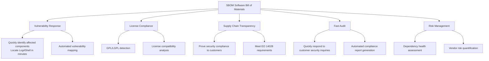
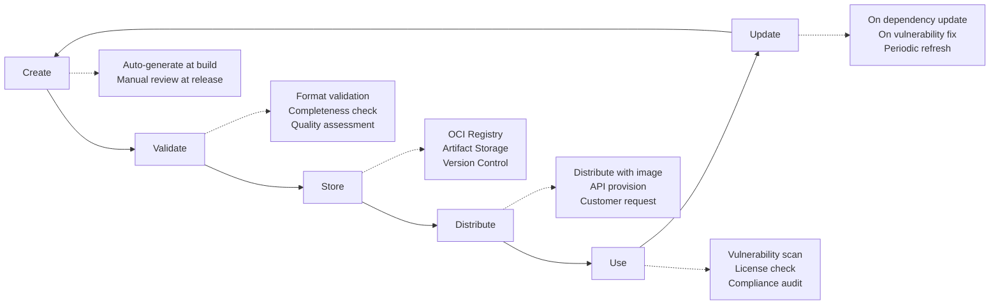
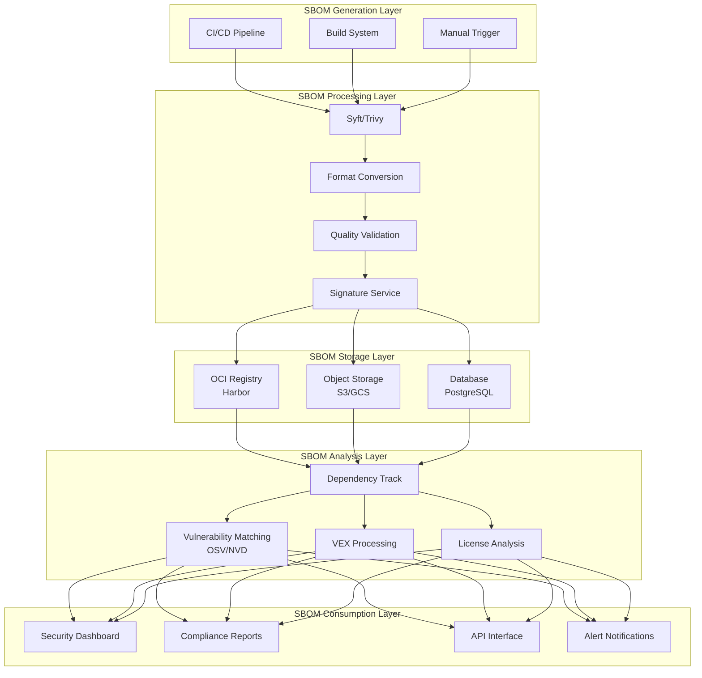

> **Production Environment Security Notice**
>
> This document contains directly executable operations commands. Before executing, please confirm: whether the target cluster and Namespace are correct; whether you have sufficient RBAC permissions; whether verification in non-production environments has been completed. Command risk levels are marked as: 🔴 High risk (may cause data loss or service interruption), 🟡 Medium risk (modifies cluster state, but usually reversible), 🟢 Low risk/read-only (information gathering, no side effects).


# SBOM Generation and Management

> Software Bill of Materials (SBOM) is the foundation of modern supply chain security, providing complete transparency of software composition, enabling rapid vulnerability response and compliance verification.

---

<!-- chunk: Table of Contents -->## Table of Contents

1. [SBOM Fundamentals](#1-sbom-fundamentals)
2. [SBOM Standard Format Comparison](#2-sbom-standard-format-comparison)
3. [Syft CLI Complete Guide](#3-syft-cli-complete-guide)
4. [[entities/trivy.md|Trivy]] SBOM Generation](#4-trivy-sbom-generation)
5. [Other SBOM Generation Tools](#5-other-sbom-generation-tools)
6. [SBOM Lifecycle Management](#6-sbom-lifecycle-management)
7. [CI/CD Integration Practices](#7-cicd-integration-practices)
8. [SBOM Storage and Distribution](#8-sbom-storage-and-distribution)
9. [Dependency Graph Analysis](#9-dependency-graph-analysis)
10. [SBOM Quality Assessment](#10-sbom-quality-assessment)
11. [SBOM Automation Workflow](#11-sbom-automation-workflow)
12. [Enterprise-level SBOM Management Platform](#12-enterprise-level-sbom-management-platform)

---

<!-- chunk: 1. SBOM Fundamentals -->## 1. SBOM Fundamentals

## 1.1 What is SBOM

A Software Bill of Materials (SBOM) is a formal machine-readable inventory of software components and dependencies, analogous to a Bill of Materials (BOM) in manufacturing.

```
SBOM Analogy:

Manufacturing BOM               Software SBOM
───────────────────             ─────────────────
Raw materials list       →      Direct dependency list
Component supplier info  →      Package maintainer info
Component version/model  →      Package name and version
Quality certification    →      License and compliance info
Manufacturing date       →      Build timestamp
Product specification    →      Package hash/digest
```

**Three Core Questions of SBOM:**

```
1. What is this software?
   ─ Package name, version, ecosystem
   ─ Unique identifiers (PURL, CPE)

2. Who developed/maintains it?
   ─ Vendor/author information
   ─ License information

3. What relationships does it have with other components?
   ─ Direct dependencies
   ─ Transitive dependencies
   ─ Dependency graph
```

## 1.2 Value of SBOM



## 1.3 Minimum Data Elements of SBOM

According to NTIA (National Telecommunications and Information Administration) definition, a minimal SBOM should include:

| Data Field | Description | Example |
|---------|------|------|
| Vendor Name | Entity that creates the component | Apache Software Foundation |
| Component Name | Unit name | log4j-core |
| Version | Component version string | 2.17.1 |
| Other Unique Identifiers | PURL, CPE, SWID | pkg:maven/org.apache.logging.log4j/log4j-core@2.17.1 |
| Dependency Relationship | Relationships to upstream dependencies | DEPENDS_ON log4j-api@2.17.1 |
| SBOM Author | Entity that created the SBOM | security@company.com |
| Timestamp | Creation or last update time | 2024-01-15T10:30:00Z |

## 1.4 PURL (Package URL) Specification

``` bash
# 🟢 Low risk: read-only/information gathering, usually no side effects
# PURL format: scheme:type/namespace/name@version?qualifiers#subpath

# npm package
pkg:npm/%40angular/core@14.2.0

# Maven (Java)
pkg:maven/org.springframework/spring-core@6.0.9

# PyPI (Python)
pkg:pypi/django@4.2.7

# Go module
pkg:golang/github.com/gin-gonic/gin@v1.9.1

# Alpine Linux package
pkg:apk/alpine/busybox@1.35.0-r17

# Docker image
pkg:docker/library/nginx@1.25.3

# GitHub repository
pkg:github/kubernetes/kubernetes@v1.29.0

# Validate PURL format
pip install packageurl-python
python3 -c "
from packageurl import PackageURL
purl = PackageURL.from_string('pkg:npm/lodash@4.17.21')
print(f'Type: {purl.type}')
print(f'Name: {purl.name}')
print(f'Version: {purl.version}')
"
```
---

<!-- chunk: 2. SBOM Standard Format Comparison -->## 2. SBOM Standard Format Comparison

## 2.1 SPDX vs CycloneDX

```
Format Comparison Overview:

┌──────────────────────────────────────────────────────────┐
│                    Format Comparison Matrix              │
├────────────────┬──────────────────┬─────────────────────┤
│ Feature        │ SPDX             │ CycloneDX           │
├────────────────┼──────────────────┼─────────────────────┤
│ Lead Org       │ Linux Foundation │ OWASP               │
│ Current Ver    │ SPDX 2.3/3.0     │ CycloneDX 1.5       │
│ Supported Fmt  │ TV, JSON, YAML   │ XML, JSON, Protobuf │
│ License Focus  │ Very Strong      │ Moderate            │
│ Vuln Association│ Limited         │ Strong (VEX support)│
│ Service Trace  │ Yes              │ Strong (Services)   │
│ Tool Support   │ Broad            │ Broad               │
│ Industrial IoT │ Limited          │ Strong              │
│ Compliance     │ License Compliance│ Security Compliance │
│ Recommended    │ OSS License Track│ Security Vuln Mgmt  │
└────────────────┴──────────────────┴─────────────────────┘
```

## 2.2 SPDX Format Details

```json
// SPDX 2.3 JSON format example (simplified)
{
  "SPDXID": "SPDXRef-DOCUMENT",
  "spdxVersion": "SPDX-2.3",
  "creationInfo": {
    "created": "2024-01-15T10:30:00Z",
    "creators": [
      "Tool: syft-0.103.0",
      "Organization: MyCompany"
    ],
    "licenseListVersion": "3.22"
  },
  "name": "myapp-v1.2.3",
  "dataLicense": "CC0-1.0",
  "documentNamespace": "https://spdx.org/spdxdocs/myapp-v1.2.3-abc123",
  
  "packages": [
    {
      "SPDXID": "SPDXRef-Package-gin",
      "name": "github.com/gin-gonic/gin",
      "version": "v1.9.1",
      "supplier": "Organization: gin-gonic",
      "originator": "Organization: gin-gonic",
      "downloadLocation": "https://github.com/gin-gonic/gin",
      "filesAnalyzed": false,
      "externalRefs": [
        {
          "referenceCategory": "PACKAGE-MANAGER",
          "referenceType": "purl",
          "referenceLocator": "pkg:golang/github.com/gin-gonic/gin@v1.9.1"
        }
      ],
      "licenseConcluded": "MIT",
      "licenseDeclared": "MIT",
      "copyrightText": "NOASSERTION",
      "primaryPackagePurpose": "LIBRARY"
    }
  ],
  
  "relationships": [
    {
      "spdxElementId": "SPDXRef-DOCUMENT",
      "relationshipType": "DESCRIBES",
      "relatedSpdxElement": "SPDXRef-Package-myapp"
    },
    {
      "spdxElementId": "SPDXRef-Package-myapp",
      "relationshipType": "DEPENDS_ON",
      "relatedSpdxElement": "SPDXRef-Package-gin"
    }
  ]
}
```

## 2.3 CycloneDX Format Details

```json
// CycloneDX 1.5 JSON format example
{
  "bomFormat": "CycloneDX",
  "specVersion": "1.5",
  "serialNumber": "urn:uuid:3e671687-395b-41f5-a30f-a58921a69b79",
  "version": 1,
  "metadata": {
    "timestamp": "2024-01-15T10:30:00Z",
    "tools": [
      {
        "vendor": "Anchore, Inc.",
        "name": "syft",
        "version": "0.103.0"
      }
    ],
    "authors": [
      {
        "name": "Security Team",
        "email": "security@mycompany.com"
      }
    ],
    "component": {
      "type": "container",
      "name": "myapp",
      "version": "1.2.3",
      "purl": "pkg:docker/myorg/myapp@1.2.3"
    }
  },
  
  "components": [
    {
      "type": "library",
      "name": "gin",
      "version": "v1.9.1",
      "purl": "pkg:golang/github.com/gin-gonic/gin@v1.9.1",
      "licenses": [
        {
          "license": {
            "id": "MIT"
          }
        }
      ],
      "hashes": [
        {
          "alg": "SHA-256",
          "content": "9f86d081884c7d659a2feaa0c55ad015a3bf4f1b2b0b822cd15d6c15b0f00a08"
        }
      ],
      "externalReferences": [
        {
          "type": "vcs",
          "url": "https://github.com/gin-gonic/gin"
        }
      ]
    }
  ],
  
  "dependencies": [
    {
      "ref": "pkg:docker/myorg/myapp@1.2.3",
      "dependsOn": [
        "pkg:golang/github.com/gin-gonic/gin@v1.9.1"
      ]
    }
  ],
  
  "vulnerabilities": [
    {
      "id": "CVE-2023-12345",
      "source": {
        "name": "NVD",
        "url": "https://nvd.nist.gov/vuln/detail/CVE-2023-12345"
      },
      "ratings": [
        {
          "source": {"name": "NVD"},
          "score": 9.8,
          "severity": "critical",
          "method": "CVSSv3"
        }
      ],
      "affects": [
        {
          "ref": "pkg:golang/github.com/gin-gonic/gin@v1.9.1"
        }
      ]
    }
  ]
}
```

## 2.4 Format Selection Guide

```
Format Selection Decision Tree:

Do you need to comply with FDA medical device requirements?
├── Yes → Use CycloneDX (FDA preference)
└── No → Continue...

Is the primary focus on license compliance?
├── Yes → Use SPDX (more complete license information)
└── No → Continue...

Do you need vulnerability information (VEX) integration?
├── Yes → Use CycloneDX (native VEX support)
└── No → Continue...

Do you need to submit to US federal agencies?
├── Yes → SPDX or CycloneDX both acceptable (EO 14028)
└── No → Choose based on toolchain

Best practice recommendation: Generate both formats!
```

---

<!-- chunk: 3. Syft CLI Complete Guide -->## 3. Syft CLI Complete Guide

## 3.1 Installation and Configuration

```bash
# Install Syft - Method 1: Official script
curl -sSfL https://raw.githubusercontent.com/anchore/syft/main/install.sh | \
  sh -s -- -b /usr/local/bin

# Install Syft - Method 2: Go installation
go install github.com/anchore/syft/cmd/syft@latest

# Install Syft - Method 3: Homebrew (macOS)
brew install syft

# Install Syft - Method 4: Binary download
VERSION="v0.103.1"
curl -Lo syft.tar.gz \
  https://github.com/anchore/syft/releases/download/${VERSION}/syft_${VERSION}_linux_amd64.tar.gz
tar -xzf syft.tar.gz
sudo mv syft /usr/local/bin/
chmod +x /usr/local/bin/syft

# Verify installation
syft version
# Output:
# syft: 0.103.1
# jsonSchemaVersion: 15.0.1
# dbSchemaVersion: 5

# Syft configuration file
cat > ~/.syft/config.yaml << 'EOF'
# ~/.syft/config.yaml
log:
  level: warn
  
output:
  - format: spdx-json
    file: ""
    
catalogers:
  default-catalogers:
    enabled: true
  package-catalogers:
    enabled: true

# Exclude unnecessary paths
file-metadata:
  digests:
    - sha1
    - sha256
    
exclude:
  - "**/.git/**"
  - "**/node_modules/.cache/**"
  - "**/vendor/**"
EOF
```

## 3.2 Scanning Target Types

``` bash
# 🟢 Low risk: read-only/information gathering, usually no side effects
# ============ Container Image Scanning ============

# Scan local Docker image
syft nginx:latest

# Scan and output SPDX JSON
syft nginx:latest -o spdx-json

# Scan and output CycloneDX JSON
syft nginx:latest -o cyclonedx-json

# Scan OCI image layout (no Docker daemon needed)
syft oci-layout:./my-image-dir

# Scan Docker tar archive
syft docker-archive:./my-image.tar

# Scan private registry image (requires authentication)
docker login myregistry.company.com
syft myregistry.company.com/myapp:v1.0.0

# ============ Filesystem Scanning ============

# Scan current directory
syft .

# Scan specific directory
syft dir:/path/to/project

# Scan project with Go modules
syft dir:/path/to/go-project

# Scan Python project
syft dir:/path/to/python-project

# ============ Artifact File Scanning ============

# Scan JAR file
syft file:./app.jar

# Scan ZIP package
syft file:./dependencies.zip

# Scan RPM package
syft file:./package.rpm

# Scan Debian package
syft file:./package.deb
```
## 3.3 Output Format Details

```bash
# All output formats supported by Syft

# 1. Table format (human readable)
syft myapp:latest -o table
# Example output:
# NAME                    VERSION      TYPE
# alpine-baselayout       3.4.3-r1     apk
# alpine-keys             2.4-r1       apk
# libc-utils              0.7.5-r4     apk
# openssl                 3.1.4-r1     apk

# 2. JSON format (Syft native)
syft myapp:latest -o json > sbom.syft.json

# 3. SPDX tag-value format (most concise)
syft myapp:latest -o spdx > sbom.spdx

# 4. SPDX JSON format
syft myapp:latest -o spdx-json > sbom.spdx.json

# 5. SPDX RDF format
syft myapp:latest -o spdx-rdf > sbom.spdx.rdf

# 6. CycloneDX XML format
syft myapp:latest -o cyclonedx > sbom.cyclonedx.xml

# 7. CycloneDX JSON format
syft myapp:latest -o cyclonedx-json > sbom.cyclonedx.json

# 8. CycloneDX Protobuf format
syft myapp:latest -o cyclonedx-protobuf > sbom.cyclonedx.pb

# 9. Output multiple formats simultaneously
syft myapp:latest \
  -o spdx-json=sbom.spdx.json \
  -o cyclonedx-json=sbom.cdx.json \
  -o table

# 10. Template format (custom output)
syft myapp:latest -o template -t custom-template.tmpl
```

## 3.4 Advanced Scanning Options

```bash
# Deep scan configuration

# 1. Control scanning depth
# Scan only installed packages (don't scan uninstalled files)
syft myapp:latest --scope squashed

# Scan all layers (including deleted files, image-only)
syft myapp:latest --scope all-layers

# 2. Include/exclude specific directories
syft dir:/myproject \
  --exclude "**/test/**" \
  --exclude "**/docs/**" \
  --exclude "**/*.test.go"

# 3. Configure directory search strategy
syft dir:/myproject \
  --platform linux/amd64

# 4. Output all components (including dev dependencies)
syft dir:/myproject --catalogers "+dev" 2>/dev/null || \
syft dir:/myproject  # Default includes all dependencies

# 5. Verbose logging
syft myapp:latest -v

# 6. Private certificate-based repository
syft registry://myregistry.internal/myapp:latest \
  --registry-cert=/path/to/ca.crt

# 7. Set output metadata
syft myapp:latest \
  -o spdx-json \
  --metadata="document-name=myapp-v1.0.0" \
  --metadata="document-namespace=https://mycompany.com/sbom/myapp-v1.0.0"
```

## 3.5 Syft Results Parsing

```python
#!/usr/bin/env python3
"""Syft SBOM results parsing and statistics"""

import json
from collections import defaultdict
from typing import List, Dict

def analyze_syft_sbom(sbom_file: str) -> None:
    """Analyze Syft-generated SBOM"""
    with open(sbom_file) as f:
        sbom = json.load(f)
    
    artifacts = sbom.get("artifacts", [])
    
    # Count by type
    type_counts = defaultdict(int)
    for artifact in artifacts:
        type_counts[artifact.get("type", "unknown")] += 1
    
    # Count by license
    license_counts = defaultdict(int)
    for artifact in artifacts:
        licenses = artifact.get("licenses", [])
        if licenses:
            for lic in licenses:
                license_id = lic.get("value", "UNKNOWN")
                license_counts[license_id] += 1
        else:
            license_counts["NO_LICENSE"] += 1
    
    # Count packages without PURL (identifier completeness)
    no_purl = [a["name"] for a in artifacts 
               if not any(r.get("type") == "purl" 
                         for r in a.get("cpes", []))]
    
    print(f"\n{'='*60}")
    print(f"SBOM Analysis Report: {sbom_file}")
    print(f"{'='*60}")
    print(f"\nTotal Components: {len(artifacts)}")
    
    print(f"\nDistribution by Type:")
    for pkg_type, count in sorted(type_counts.items(), key=lambda x: -x[1]):
        print(f"  {pkg_type:30s} {count:5d}")
    
    print(f"\nTop Licenses (Top 10):")
    for lic, count in sorted(license_counts.items(), key=lambda x: -x[1])[:10]:
        print(f"  {lic:40s} {count:5d}")
    
    # Identify licenses requiring attention
    copyleft = ["GPL-2.0", "GPL-3.0", "LGPL-2.1", "LGPL-3.0", "AGPL-3.0"]
    copyleft_found = {k: v for k, v in license_counts.items() 
                      if any(c in k for c in copyleft)}
    if copyleft_found:
        print(f"\n⚠️  Copyleft licenses found (requires legal review):")
        for lic, count in copyleft_found.items():
            print(f"  {lic}: {count} components")
    
    print(f"\nCompleteness Check:")
    print(f"  Components with PURL: {len(artifacts) - len(no_purl)}/{len(artifacts)}")

if __name__ == "__main__":
    import sys
    analyze_syft_sbom(sys.argv[1] if len(sys.argv) > 1 else "sbom.syft.json")
```

---

<!-- chunk: 4. Trivy SBOM Generation -->## 4. Trivy SBOM Generation

## 4.1 Trivy Installation and Configuration

```bash
# Install Trivy - macOS
brew install aquasecurity/trivy/trivy

# Install Trivy - Linux
sudo apt-get install -y wget apt-transport-https gnupg lsb-release
wget -qO - https://aquasecurity.github.io/trivy-repo/deb/public.key | \
  gpg --dearmor | sudo tee /usr/share/keyrings/trivy.gpg > /dev/null
echo "deb [signed-by=/usr/share/keyrings/trivy.gpg] https://aquasecurity.github.io/trivy-repo/deb \
  $(lsb_release -sc) main" | sudo tee -a /etc/apt/sources.list.d/trivy.list
sudo apt-get update && sudo apt-get install -y trivy

# Install Trivy - Binary
VERSION="v0.49.1"
curl -Lo trivy.tar.gz \
  https://github.com/aquasecurity/trivy/releases/download/${VERSION}/trivy_${VERSION}_Linux-64bit.tar.gz
tar -xzf trivy.tar.gz trivy
sudo mv trivy /usr/local/bin/

# Update vulnerability database
trivy image --download-db-only

# Verify installation
trivy version
```

## 4.2 Trivy SBOM Generation Commands

```bash
# ============ Image SBOM Generation ============

# Generate CycloneDX SBOM
trivy image \
  --format cyclonedx \
  --output sbom.cdx.json \
  nginx:latest

# Generate SPDX SBOM
trivy image \
  --format spdx-json \
  --output sbom.spdx.json \
  nginx:latest

# Generate SBOM only (no vulnerability scan)
trivy image \
  --scanners sbom \
  --format cyclonedx \
  nginx:latest

# ============ Filesystem SBOM Generation ============

# Scan current directory
trivy fs \
  --format cyclonedx \
  --output fs-sbom.cdx.json \
  .

# Scan project for specific language
trivy fs \
  --scanners vuln,config,secret,license \
  --format spdx-json \
  --output project-sbom.spdx.json \
  /path/to/project

# ============ Git Repository SBOM Generation ============

# Scan remote Git repository
trivy repo \
  --format cyclonedx \
  --output repo-sbom.cdx.json \
  https://github.com/myorg/myapp

# Scan local repository specific branch
trivy repo \
  --branch main \
  --format cyclonedx \
  .

# ============ OCI Artifact SBOM Generation ============

# Generate and attach SBOM to image
trivy image \
  --format cyclonedx \
  --output sbom.cdx.json \
  myregistry.io/myapp:v1.0.0

# Extract embedded SBOM
trivy image \
  --extract-oci-sbom \
  --output extracted-sbom.json \
  myregistry.io/myapp:v1.0.0
```

## 4.3 Trivy Comprehensive Scan (SBOM + Vulnerabilities)

```bash
# Generate SBOM and scan for vulnerabilities simultaneously

# Complete image analysis
trivy image \
  --format table \
  --scanners vuln,config,secret,license \
  --severity CRITICAL,HIGH \
  myapp:latest

# Output structured JSON (includes SBOM and vulnerabilities)
trivy image \
  --format json \
  --output full-analysis.json \
  --scanners vuln \
  myapp:latest

# Two-step vulnerability scanning based on SBOM
# Step 1: Generate SBOM
syft myapp:latest -o cyclonedx-json > sbom.cdx.json

# Step 2: Scan vulnerabilities based on SBOM
trivy sbom \
  --severity CRITICAL,HIGH \
  --format table \
  sbom.cdx.json

# Step 2 Alternative: Using Grype
grype sbom:sbom.cdx.json

# Complete CI flow
trivy image \
  --format sarif \
  --output trivy-results.sarif \
  --severity CRITICAL,HIGH \
  --exit-code 1 \
  myapp:latest
```

## 4.4 Trivy Configuration File

```yaml
# trivy.yaml - Trivy configuration file
---
# Scanning options
scan:
  scanners:
    - vuln
    - config
    - secret
    - license
  
  # Skip directories
  skip-dirs:
    - "**/.git"
    - "**/node_modules"
    - "**/vendor"
  
  # Skip files
  skip-files:
    - "**/*.test.go"

# Vulnerability filtering
severity:
  - CRITICAL
  - HIGH

# Ignore specific CVEs (VEX alternative)
ignorefile: .trivyignore

# Output configuration
format: cyclonedx
output: sbom.cdx.json

# Cache configuration
cache:
  dir: ~/.cache/trivy
  clear: false

# Database
db:
  skip-update: false
  download-java-db: true

# Java-related
java-db:
  repository:
    - ghcr.io/aquasecurity/trivy-java-db

# License scanning
license:
  full: true
  ignored:
    - MIT
    - Apache-2.0
  forbidden:
    - GPL-3.0
    - AGPL-3.0

# Report configuration  
report:
  exit-code: 1
  exit-on-eol: false
```

```bash
# .trivyignore file example (vulnerability exemption)
# Format: CVE-ID [until date] [reason]

# False positive - our version is not affected
CVE-2023-12345

# Accepted risk - no available fix, low priority
CVE-2022-98765 until:2024-06-30

# Vulnerability exemption for specific package
CVE-2021-44228 openssl@1.1.1t-r4 # Not applicable to this use case
```

---

<!-- chunk: 5. Other SBOM Generation Tools -->## 5. Other SBOM Generation Tools

## 5.1 Tool Ecosystem Comparison

```
SBOM Tool Ecosystem:

┌──────────────────────────────────────────────────────┐
│ Tool         │ Primary Capability    │ Best Use Case       │
├──────────────┼───────────────────────┼───────────────────┤
│ Syft         │ Generate, multi-format│ General SBOM Gen   │
│ Trivy        │ Generate + scan       │ Comprehensive Sec  │
│ CycloneDX CLI│ Generate, CycloneDX   │ CycloneDX projects │
│ SPDX Tools   │ Generate, validate    │ SPDX workflows     │
│ cdxgen       │ Generate, multi-lang  │ Multi-lang projects│
│ Tern         │ Container layer an.   │ Container clarity  │
│ Dependency-  │ Generate, scan        │ Java/JavaScript    │
│ Track        │                       │ project mgmt       │
│ OSS Review   │ Generate, license rev │ Open source compl. │
│ Toolkit      │                       │                    │
└──────────────┴───────────────────────┴───────────────────┘
```

## 5.2 CycloneDX CLI

```bash
# Install CycloneDX CLI
npm install -g @cyclonedx/cyclonedx-npm

# Generate SBOM for Node.js project
cdx-npm \
  --output-format JSON \
  --output-file sbom.cdx.json \
  --package-lock-only

# Generate from package-lock.json
cdx-npm \
  --package-lock-only \
  --output-format JSON \
  --output-file sbom.cdx.json

# Maven (Java)
pip install cyclonedx-bom
cyclonedx-py --requirements requirements.txt -o sbom.cdx.json

# Gradle
./gradlew cyclonedxBom

# Validate CycloneDX SBOM
npm install -g @cyclonedx/cyclonedx-library
cyclonedx validate sbom.cdx.json --spec-version 1.5
```

## 5.3 cdxgen

``` bash
# 🟢 Low risk: read-only/information gathering, usually no side effects
# Install cdxgen - supports 40+ languages/frameworks
npm install -g @cyclonedx/cdxgen

# Go project
cdxgen -t go -o sbom.cdx.json /path/to/go/project

# Java Maven project
cdxgen -t maven -o sbom.cdx.json /path/to/java/project

# Python project
cdxgen -t python -o sbom.cdx.json /path/to/python/project

# Rust project
cdxgen -t rust -o sbom.cdx.json /path/to/rust/project

# Multi-language project (auto-detect)
cdxgen -o sbom.cdx.json /path/to/project

# Container image
cdxgen -t docker -o sbom.cdx.json nginx:latest

# Kubernetes deployment files
cdxgen -t k8s -o sbom.cdx.json /path/to/k8s/manifests

# Output detailed information (includes hierarchy)
cdxgen -t go \
  --include-formulation \
  -o sbom-with-build.cdx.json \
  /path/to/project
```
## 5.4 SBOM Format Conversion

```bash
# SPDX Tools - SBOM format conversion
pip install spdx-tools

# SPDX TV to JSON
pyspdxtools convert \
  --input sbom.spdx \
  --output sbom.spdx.json

# SPDX JSON to RDF
pyspdxtools convert \
  --input sbom.spdx.json \
  --output sbom.spdx.rdf

# Validate SPDX file
pyspdxtools validate sbom.spdx.json

# Use CycloneDX Utilities for conversion
# CycloneDX JSON to XML
cyclonedx convert \
  --input sbom.cdx.json \
  --output sbom.cdx.xml

# SPDX to CycloneDX (via Syft)
syft convert sbom.spdx.json -o cyclonedx-json > sbom.cdx.json

# CycloneDX to SPDX (via Syft)
syft convert sbom.cdx.json -o spdx-json > sbom.spdx.json
```

---

<!-- chunk: 6. SBOM Lifecycle Management -->## 6. SBOM Lifecycle Management

## 6.1 SBOM Lifecycle Overview



## 6.2 SBOM Version Management Strategy

``` bash
# 🟢 Low risk: read-only/information gathering, usually no side effects
# SBOM version naming convention
# Format: {product}-{version}-{build_date}-{commit_sha}.{format}.{extension}

# Examples:
# myapp-v1.2.3-20240115-abc1234.spdx.json
# myapp-v1.2.3-20240115-abc1234.cdx.json

# SBOM storage directory structure
sbom-storage/
├── by-version/
│   ├── v1.2.0/
│   │   ├── myapp-v1.2.0.spdx.json
│   │   └── myapp-v1.2.0.cdx.json
│   └── v1.2.1/
│       ├── myapp-v1.2.1.spdx.json
│       └── myapp-v1.2.1.cdx.json
├── by-image-digest/
│   └── sha256-abc123.../
│       ├── sbom.spdx.json
│       └── sbom.cdx.json
└── latest/
    ├── myapp.spdx.json  -> ../by-version/v1.2.1/myapp-v1.2.1.spdx.json
    └── myapp.cdx.json   -> ../by-version/v1.2.1/myapp-v1.2.1.cdx.json

# Automated storage script
#!/bin/bash
store_sbom() {
  local IMAGE="$1"
  local SBOM_FILE="$2"
  local FORMAT="$3"  # spdx-json or cyclonedx-json
  
  DIGEST=$(docker inspect --format='{{index .RepoDigests 0}}' "$IMAGE" | \
    cut -d@ -f2 | tr ':' '-')
  VERSION=$(docker inspect --format='{{index .Config.Labels "version"}}' "$IMAGE")
  DATE=$(date +%Y%m%d)
  
  DEST_DIR="sbom-storage/by-digest/${DIGEST}"
  mkdir -p "$DEST_DIR"
  
  EXT=$([ "$FORMAT" = "spdx-json" ] && echo "spdx.json" || echo "cdx.json")
  cp "$SBOM_FILE" "$DEST_DIR/sbom.${EXT}"
  
  echo "SBOM stored: $DEST_DIR/sbom.${EXT}"
}
```
## 6.3 SBOM Integrity Protection

```bash
# SBOM signing and verification

# Method 1: Sign SBOM using Cosign
# Generate SBOM
syft myapp:latest -o cyclonedx-json > sbom.cdx.json

# Sign SBOM file
cosign sign-blob \
  --bundle sbom.cdx.json.bundle \
  sbom.cdx.json

# Verify SBOM signature
cosign verify-blob \
  --bundle sbom.cdx.json.bundle \
  --certificate-identity="https://github.com/myorg/myapp/.github/workflows/release.yml@refs/tags/v1.0.0" \
  --certificate-oidc-issuer="https://token.actions.githubusercontent.com" \
  sbom.cdx.json

# Method 2: Attach SBOM to image
cosign attach sbom \
  --sbom sbom.cdx.json \
  --type cyclonedx \
  ghcr.io/myorg/myapp:v1.0.0

# Download and verify attached SBOM
cosign download sbom ghcr.io/myorg/myapp:v1.0.0 > sbom-from-registry.json

# Method 3: Cosign attestation (most secure)
cosign attest \
  --predicate sbom.cdx.json \
  --type cyclonedx \
  ghcr.io/myorg/myapp:v1.0.0

# Verify attestation
cosign verify-attestation \
  --type cyclonedx \
  --certificate-identity="..." \
  --certificate-oidc-issuer="..." \
  ghcr.io/myorg/myapp:v1.0.0

# Method 4: GPG signature (traditional approach)
gpg --armor --detach-sign sbom.cdx.json
# Generates sbom.cdx.json.asc

gpg --verify sbom.cdx.json.asc sbom.cdx.json
```

## 6.4 SBOM Difference Analysis

```python
#!/usr/bin/env python3
"""SBOM Difference Analysis Tool - Compare component changes between versions"""

import json
import sys
from dataclasses import dataclass
from typing import Dict, List, Set, Optional

@dataclass
class Component:
    name: str
    version: str
    purl: str
    
    def __hash__(self):
        return hash(self.purl or f"{self.name}@{self.version}")
    
    def __eq__(self, other):
        return self.purl == other.purl if self.purl and other.purl else \
               (self.name == other.name and self.version == other.version)

def parse_cyclonedx(sbom_file: str) -> Dict[str, Component]:
    """Parse CycloneDX SBOM"""
    with open(sbom_file) as f:
        sbom = json.load(f)
    
    components = {}
    for comp in sbom.get("components", []):
        purl = comp.get("purl", "")
        name = comp.get("name", "")
        version = comp.get("version", "")
        c = Component(name=name, version=version, purl=purl)
        components[purl or f"{name}@{version}"] = c
    
    return components

def diff_sboms(old_file: str, new_file: str) -> None:
    """Compare differences between two SBOMs"""
    old_components = parse_cyclonedx(old_file)
    new_components = parse_cyclonedx(new_file)
    
    old_keys = set(old_components.keys())
    new_keys = set(new_components.keys())
    
    added = new_keys - old_keys
    removed = old_keys - new_keys
    
    # Detect version changes (same name but different version)
    old_by_name = {c.name: c for c in old_components.values()}
    new_by_name = {c.name: c for c in new_components.values()}
    
    upgraded = {}
    downgraded = {}
    
    for name in set(old_by_name.keys()) & set(new_by_name.keys()):
        old_ver = old_by_name[name].version
        new_ver = new_by_name[name].version
        if old_ver != new_ver:
            key = f"{name}: {old_ver} → {new_ver}"
            # Simple comparison (full version comparison requires semantic versioning library)
            upgraded[name] = (old_ver, new_ver)
    
    print(f"\n{'='*60}")
    print(f"SBOM Difference Analysis Report")
    print(f"{'='*60}")
    print(f"Comparison: {old_file} → {new_file}")
    print(f"\nSummary:")
    print(f"  Total component count change: {len(old_keys)} → {len(new_keys)}")
    print(f"  Components added: {len(added)}")
    print(f"  Components removed: {len(removed)}")
    print(f"  Version changes: {len(upgraded)}")
    
    if added:
        print(f"\n✅ Components Added ({len(added)}):")
        for key in sorted(added)[:20]:
            comp = new_components[key]
            print(f"  + {comp.name}@{comp.version}")
    
    if removed:
        print(f"\n❌ Components Removed ({len(removed)}):")
        for key in sorted(removed)[:20]:
            comp = old_components[key]
            print(f"  - {comp.name}@{comp.version}")
    
    if upgraded:
        print(f"\n🔄 Version Changes ({len(upgraded)}):")
        for name, (old_ver, new_ver) in sorted(upgraded.items())[:20]:
            print(f"  ~ {name}: {old_ver} → {new_ver}")

if __name__ == "__main__":
    if len(sys.argv) != 3:
        print("Usage: diff_sboms.py old-sbom.cdx.json new-sbom.cdx.json")
        sys.exit(1)
    diff_sboms(sys.argv[1], sys.argv[2])
```

---

<!-- chunk: 7. CI/CD Integration Practices -->## 7. CI/CD Integration Practices

## 7.1 GitHub Actions SBOM Workflow

```yaml
# .github/workflows/sbom-generation.yml
name: SBOM Generation and Management

on:
  push:
    branches: [main]
    tags: ['v*']
  pull_request:
    branches: [main]

permissions:
  contents: read
  packages: write
  id-token: write

jobs:
  generate-sbom:
    runs-on: ubuntu-latest
    outputs:
      sbom-spdx: ${{ steps.upload-sbom.outputs.spdx-artifact }}
      sbom-cdx: ${{ steps.upload-sbom.outputs.cdx-artifact }}
    
    steps:
      - name: Checkout code
        uses: actions/checkout@b4ffde65f46336ab88eb53be808477a3936bae11
      
      # Method 1: Using Anchore SBOM Action (recommended)
      - name: Generate SBOM with Syft
        uses: anchore/sbom-action@78fc58e266e87a38d4194b2137a3d4e9baf7e6ef
        id: sbom-syft
        with:
          format: spdx-json
          artifact-name: sbom-${{ github.sha }}.spdx.json
          output-file: sbom.spdx.json
      
      # Generate CycloneDX format simultaneously
      - name: Generate CycloneDX SBOM
        uses: anchore/sbom-action@78fc58e266e87a38d4194b2137a3d4e9baf7e6ef
        with:
          format: cyclonedx-json
          artifact-name: sbom-${{ github.sha }}.cdx.json
          output-file: sbom.cdx.json
      
      # SBOM quality checks
      - name: Validate SBOM
        run: |
          # Check SBOM is not empty
          COMPONENTS=$(cat sbom.cdx.json | jq '.components | length')
          echo "Found $COMPONENTS components in SBOM"
          if [ "$COMPONENTS" -lt 1 ]; then
            echo "ERROR: Empty SBOM generated!"
            exit 1
          fi
          
          # Check SBOM format validity
          cat sbom.cdx.json | jq 'has("bomFormat") and has("specVersion") and has("components")' | \
            grep -q "true" || (echo "ERROR: Invalid CycloneDX format!" && exit 1)
          
          echo "✅ SBOM validation passed ($COMPONENTS components)"
      
      # Upload SBOM as workflow artifacts
      - name: Upload SBOM artifacts
        id: upload-sbom
        uses: actions/upload-artifact@c7d193f32edcb7bfad88892161225aeda64e9392
        with:
          name: sbom-files-${{ github.sha }}
          path: |
            sbom.spdx.json
            sbom.cdx.json
          retention-days: 90
      
      # Attach SBOM to Release at release time
      - name: Attach SBOM to release
        if: startsWith(github.ref, 'refs/tags/')
        uses: softprops/action-gh-release@9d7c94cfd0a1f3ed45544c887983e9fa900f0564
        with:
          files: |
            sbom.spdx.json
            sbom.cdx.json

  # SBOM-driven vulnerability scanning
  scan-from-sbom:
    runs-on: ubuntu-latest
    needs: generate-sbom
    steps:
      - name: Download SBOM
        uses: actions/download-artifact@7a1cd3216ca9260cd8022db641d960b1db4d1be4
        with:
          name: sbom-files-${{ github.sha }}
      
      - name: Scan SBOM for vulnerabilities
        uses: anchore/scan-action@3343887d815d7b07465f6fdcd395bd66508d486a
        id: scan
        with:
          sbom: sbom.cdx.json
          fail-build: true
          severity-cutoff: high
          
      - name: Upload vulnerability report
        uses: github/codeql-action/upload-sarif@cdcdbb579706841c47f7063dda365e292e5cad7a
        if: always()
        with:
          sarif_file: ${{ steps.scan.outputs.sarif }}
          category: "sbom-vulnerability-scan"
```

## 7.2 GitLab CI SBOM Configuration

```yaml
# .gitlab-ci.yml SBOM generation configuration
stages:
  - build
  - sbom
  - scan
  - publish

variables:
  IMAGE_TAG: ${CI_REGISTRY_IMAGE}:${CI_COMMIT_TAG:-${CI_COMMIT_SHORT_SHA}}

generate-sbom:
  stage: sbom
  image: anchore/syft:latest
  script:
    # Generate SBOM in both formats
    - syft ${IMAGE_TAG} -o spdx-json > sbom-${CI_COMMIT_SHA}.spdx.json
    - syft ${IMAGE_TAG} -o cyclonedx-json > sbom-${CI_COMMIT_SHA}.cdx.json
    
    # Validate SBOM
    - |
      COMPONENT_COUNT=$(jq '.components | length' sbom-${CI_COMMIT_SHA}.cdx.json)
      echo "Generated SBOM with $COMPONENT_COUNT components"
      [ "$COMPONENT_COUNT" -gt 0 ] || exit 1
  
  artifacts:
    name: "sbom-${CI_COMMIT_SHA}"
    paths:
      - "sbom-*.spdx.json"
      - "sbom-*.cdx.json"
    expire_in: 1 year
    reports:
      cyclonedx: sbom-${CI_COMMIT_SHA}.cdx.json

scan-sbom:
  stage: scan
  image: anchore/grype:latest
  dependencies:
    - generate-sbom
  script:
    - |
      grype sbom:sbom-${CI_COMMIT_SHA}.cdx.json \
        --fail-on high \
        -o sarif > vulnerability-report.sarif
  
  artifacts:
    reports:
      sast: vulnerability-report.sarif
    when: always
```

## 7.3 Tekton Pipelines SBOM Task

```yaml
# tekton-sbom-task.yaml
apiVersion: tekton.dev/v1
kind: Task
metadata:
  name: generate-sbom
  labels:
    app.kubernetes.io/version: "0.1"
  annotations:
    tekton.dev/categories: Security
    tekton.dev/pipelines.minVersion: "0.41.0"
    tekton.dev/tags: sbom, security, supply-chain
spec:
  description: |
    Generate SBOM for a container image using Syft.
    Produces both SPDX and CycloneDX format SBOMs.
  
  params:
    - name: IMAGE
      description: Container image reference (with digest)
      type: string
    - name: OUTPUT_DIR
      description: Directory to write SBOM files
      default: "/workspace/sbom"
    - name: SYFT_VERSION
      description: Syft version to use
      default: "v0.103.1"
  
  workspaces:
    - name: output
      description: Workspace to store generated SBOMs
  
  results:
    - name: SPDX_SBOM
      description: Path to SPDX SBOM file
    - name: CDX_SBOM
      description: Path to CycloneDX SBOM file
    - name: COMPONENT_COUNT
      description: Number of components found
  
  steps:
    - name: install-syft
      image: alpine:3.19
      script: |
        #!/bin/sh
        set -e
        
        apk add --no-cache curl
        
        curl -sSfL https://raw.githubusercontent.com/anchore/syft/main/install.sh | \
          sh -s -- -b /workspace/tools $(params.SYFT_VERSION)
        
        /workspace/tools/syft version
    
    - name: generate-sbom
      image: alpine:3.19
      script: |
        #!/bin/sh
        set -e
        
        IMAGE="$(params.IMAGE)"
        OUTPUT="$(workspaces.output.path)"
        
        mkdir -p "${OUTPUT}"
        
        echo "Generating SPDX SBOM for ${IMAGE}..."
        /workspace/tools/syft "${IMAGE}" \
          -o spdx-json \
          > "${OUTPUT}/sbom.spdx.json"
        
        echo "Generating CycloneDX SBOM for ${IMAGE}..."
        /workspace/tools/syft "${IMAGE}" \
          -o cyclonedx-json \
          > "${OUTPUT}/sbom.cdx.json"
        
        # Count components
        COUNT=$(cat "${OUTPUT}/sbom.cdx.json" | \
          grep -o '"name"' | wc -l)
        
        echo -n "${OUTPUT}/sbom.spdx.json" > $(results.SPDX_SBOM.path)
        echo -n "${OUTPUT}/sbom.cdx.json" > $(results.CDX_SBOM.path)
        echo -n "${COUNT}" > $(results.COMPONENT_COUNT.path)
        
        echo "Generated SBOM with ${COUNT} components"
    
    - name: validate-sbom
      image: python:3.11-alpine
      script: |
        #!/bin/sh
        set -e
        
        pip install -q spdx-tools
        
        # Validate SPDX SBOM
        OUTPUT="$(workspaces.output.path)"
        pyspdxtools validate "${OUTPUT}/sbom.spdx.json"
        echo "✅ SPDX SBOM validation passed"
```

---

<!-- chunk: 8. SBOM Storage and Distribution -->## 8. SBOM Storage and Distribution

## 8.1 OCI Registry Storage

```bash
# Store SBOM using OCI registry

# Method 1: Attach SBOM to image using Cosign
IMAGE="ghcr.io/myorg/myapp:v1.0.0"
SBOM_FILE="sbom.cdx.json"

# Attach SBOM
cosign attach sbom \
  --sbom "$SBOM_FILE" \
  --type cyclonedx \
  "$IMAGE"

# Verify SBOM attachment
cosign download sbom "$IMAGE"

# Method 2: Store SBOM as OCI artifact using ORAS
# Install ORAS
brew install oras

# Push SBOM as OCI artifact
oras push \
  ghcr.io/myorg/myapp:v1.0.0-sbom \
  --artifact-type "application/vnd.cyclonedx+json" \
  sbom.cdx.json:application/vnd.cyclonedx+json

# Download SBOM
oras pull \
  ghcr.io/myorg/myapp:v1.0.0-sbom \
  -o ./downloaded-sbom/

# Method 3: Harbor image registry native SBOM support
# Harbor 2.x supports OCI artifacts with native SBOM storage
# Associate SBOM to image via Harbor UI or API
```

## 8.2 Dependency Track Platform

``` bash
# 🟢 Low risk: read-only/information gathering, usually no side effects
# Dependency Track - Open source SBOM management platform
# Installation (using Docker Compose)

cat > dependency-track-compose.yaml << 'EOF'
version: '3.9'

volumes:
  dependency-track:

services:
  dtrack-apiserver:
    image: dependencytrack/apiserver:4.10.1
    environment:
      ALPINE_SECRET_KEY: "very-secret-key-change-in-production"
      ALPINE_DATABASE_MODE: "internal"
    volumes:
      - 'dependency-track:/data'
    ports:
      - "8081:8080"
    restart: unless-stopped
    
  dtrack-frontend:
    image: dependencytrack/frontend:4.10.1
    depends_on:
      - dtrack-apiserver
    environment:
      API_BASE_URL: "http://localhost:8081"
    ports:
      - "8080:8080"
    restart: unless-stopped
EOF

docker-compose -f dependency-track-compose.yaml up -d

# Upload SBOM to Dependency Track
# Get API Key first (generate in UI)
DT_API_URL="http://localhost:8081"
DT_API_KEY="your-api-key"
PROJECT_UUID="your-project-uuid"

# Create project
curl -X PUT "$DT_API_URL/api/v1/project" \
  -H "X-Api-Key: $DT_API_KEY" \
  -H "Content-Type: application/json" \
  -d '{
    "name": "myapp",
    "version": "1.0.0",
    "classifier": "APPLICATION",
    "active": true
  }'

# Upload SBOM
curl -X POST "$DT_API_URL/api/v1/bom" \
  -H "X-Api-Key: $DT_API_KEY" \
  -F "project=${PROJECT_UUID}" \
  -F "bom=@sbom.cdx.json"

# View analysis results
curl -s "$DT_API_URL/api/v1/vulnerability/project/${PROJECT_UUID}" \
  -H "X-Api-Key: $DT_API_KEY" | \
  jq '[.[] | select(.severity == "CRITICAL")] | length'
```
## 8.3 S3 SBOM Archival Strategy

``` bash
# 🟢 Low risk: read-only/information gathering, usually no side effects
#!/bin/bash
# sbom-archival.sh - SBOM S3 archive management

S3_BUCKET="s3://company-sbom-archive"
KMS_KEY_ID="arn:aws:kms:us-east-1:123456789:key/mrk-abc123"

# Upload SBOM to S3 (encrypted storage)
upload_sbom() {
  local IMAGE_NAME="$1"
  local IMAGE_VERSION="$2"
  local SBOM_FILE="$3"
  local FORMAT="$4"  # spdx or cdx
  
  local DATE=$(date +%Y/%m/%d)
  local S3_PATH="${S3_BUCKET}/${IMAGE_NAME}/${DATE}/${IMAGE_VERSION}"
  
  # Upload and encrypt
  aws s3 cp "$SBOM_FILE" \
    "${S3_PATH}/sbom.${FORMAT}.json" \
    --sse aws:kms \
    --sse-kms-key-id "$KMS_KEY_ID" \
    --metadata "image=${IMAGE_NAME},version=${IMAGE_VERSION},date=$(date -u +%Y-%m-%dT%H:%M:%SZ)"
  
  echo "Uploaded SBOM to: ${S3_PATH}/sbom.${FORMAT}.json"
  
  # Update latest index
  echo "${IMAGE_VERSION}" | aws s3 cp - \
    "${S3_BUCKET}/${IMAGE_NAME}/latest" \
    --content-type "text/plain"
}

# Retrieve SBOM
retrieve_sbom() {
  local IMAGE_NAME="$1"
  local VERSION="${2:-latest}"
  local FORMAT="${3:-cdx}"
  
  if [ "$VERSION" = "latest" ]; then
    VERSION=$(aws s3 cp "s3://company-sbom-archive/${IMAGE_NAME}/latest" -)
  fi
  
  # List all date directories for version, get the latest
  LATEST_DATE=$(aws s3 ls "${S3_BUCKET}/${IMAGE_NAME}/" | \
    grep -E "[0-9]{4}/[0-9]{2}/[0-9]{2}/" | \
    sort -r | head -1 | awk '{print $2}')
  
  aws s3 cp \
    "${S3_BUCKET}/${IMAGE_NAME}/${LATEST_DATE}${VERSION}/sbom.${FORMAT}.json" \
    "sbom-${IMAGE_NAME}-${VERSION}.${FORMAT}.json"
  
  echo "Retrieved SBOM for ${IMAGE_NAME}:${VERSION}"
}

# S3 lifecycle policy configuration
configure_lifecycle() {
  cat > sbom-lifecycle-policy.json << 'EOF'
{
  "Rules": [
    {
      "ID": "SBOM-Tiering",
      "Status": "Enabled",
      "Transitions": [
        {
          "Days": 90,
          "StorageClass": "STANDARD_IA"
        },
        {
          "Days": 365,
          "StorageClass": "GLACIER"
        }
      ],
      "Expiration": {
        "Days": 2555
      }
    }
  ]
}
EOF
  
  aws s3api put-bucket-lifecycle-configuration \
    --bucket "company-sbom-archive" \
    --lifecycle-configuration file://sbom-lifecycle-policy.json
}
```
---

<!-- chunk: 9. Dependency Graph Analysis -->## 9. Dependency Graph Analysis

## 9.1 Dependency Graph Visualization

```python
#!/usr/bin/env python3
"""Dependency graph analysis and visualization"""

import json
import sys
from collections import defaultdict, deque
from typing import Dict, List, Set, Tuple

class DependencyGraph:
    """Software dependency graph analyzer"""
    
    def __init__(self, sbom_file: str):
        with open(sbom_file) as f:
            self.sbom = json.load(f)
        self.components = self._index_components()
        self.graph = self._build_graph()
        self.reverse_graph = self._build_reverse_graph()
    
    def _index_components(self) -> Dict[str, dict]:
        """Index all components"""
        index = {}
        for comp in self.sbom.get("components", []):
            purl = comp.get("purl", "")
            if purl:
                index[purl] = comp
        return index
    
    def _build_graph(self) -> Dict[str, Set[str]]:
        """Build dependency graph (A depends on B)"""
        graph = defaultdict(set)
        for dep in self.sbom.get("dependencies", []):
            ref = dep.get("ref", "")
            for d in dep.get("dependsOn", []):
                graph[ref].add(d)
        return dict(graph)
    
    def _build_reverse_graph(self) -> Dict[str, Set[str]]:
        """Build reverse dependency graph (B is required by A)"""
        reverse = defaultdict(set)
        for source, targets in self.graph.items():
            for target in targets:
                reverse[target].add(source)
        return dict(reverse)
    
    def get_dependency_depth(self, component_purl: str) -> int:
        """Get maximum depth of component in dependency tree"""
        visited = set()
        max_depth = [0]
        
        def dfs(node, depth):
            if node in visited:
                return
            visited.add(node)
            max_depth[0] = max(max_depth[0], depth)
            for dep in self.graph.get(node, []):
                dfs(dep, depth + 1)
        
        dfs(component_purl, 0)
        return max_depth[0]
    
    def get_impacted_by(self, vulnerable_purl: str) -> List[str]:
        """Get upstream components affected by vulnerability (who depends on this package)"""
        impacted = set()
        queue = deque([vulnerable_purl])
        
        while queue:
            current = queue.popleft()
            dependents = self.reverse_graph.get(current, set())
            for dep in dependents:
                if dep not in impacted:
                    impacted.add(dep)
                    queue.append(dep)
        
        return list(impacted)
    
    def get_critical_paths(self, 
                           source_purl: str, 
                           target_purl: str) -> List[List[str]]:
        """Find all dependency paths from source to target"""
        all_paths = []
        
        def find_paths(current, target, path, visited):
            if current == target:
                all_paths.append(path[:])
                return
            if current in visited:
                return
            visited.add(current)
            path.append(current)
            
            for next_node in self.graph.get(current, []):
                find_paths(next_node, target, path, visited)
            
            path.pop()
            visited.discard(current)
        
        find_paths(source_purl, target_purl, [], set())
        return all_paths
    
    def analyze_risk_profile(self) -> dict:
        """Analyze overall risk profile"""
        total = len(self.components)
        
        # Calculate transitive dependency count for each component
        transitive_counts = {}
        for purl in self.components:
            deps = set()
            queue = deque([purl])
            while queue:
                current = queue.popleft()
                for dep in self.graph.get(current, []):
                    if dep not in deps:
                        deps.add(dep)
                        queue.append(dep)
            transitive_counts[purl] = len(deps)
        
        # Find highest-risk nodes (most depended on)
        most_critical = sorted(
            self.reverse_graph.items(),
            key=lambda x: len(x[1]),
            reverse=True
        )[:10]
        
        return {
            "total_components": total,
            "total_dependencies": sum(len(deps) for deps in self.graph.values()),
            "most_critical_components": [
                {
                    "purl": purl,
                    "name": self.components.get(purl, {}).get("name", "unknown"),
                    "dependent_count": len(deps)
                }
                for purl, deps in most_critical
                if purl in self.components
            ]
        }
    
    def export_dot_graph(self, output_file: str, max_nodes: int = 50):
        """Export dependency graph in Graphviz DOT format"""
        lines = ["digraph DependencyGraph {"]
        lines.append("  rankdir=LR;")
        lines.append("  node [shape=box];")
        
        # Take first N nodes
        nodes = list(self.components.keys())[:max_nodes]
        
        for purl in nodes:
            comp = self.components[purl]
            name = comp.get("name", purl)
            version = comp.get("version", "")
            node_id = purl.replace(":", "_").replace("/", "_").replace("@", "_")
            lines.append(f'  {node_id} [label="{name}\\n{version}"];')
        
        for source in nodes:
            src_id = source.replace(":", "_").replace("/", "_").replace("@", "_")
            for target in self.graph.get(source, []):
                if target in nodes:
                    tgt_id = target.replace(":", "_").replace("/", "_").replace("@", "_")
                    lines.append(f"  {src_id} -> {tgt_id};")
        
        lines.append("}")
        
        with open(output_file, 'w') as f:
            f.write("\n".join(lines))
        
        print(f"DOT graph exported to: {output_file}")
        print(f"Visualize with: dot -Tsvg {output_file} -o dependency-graph.svg")


# Usage example
if __name__ == "__main__":
    dg = DependencyGraph("sbom.cdx.json")
    
    # Analyze risk profile
    risk = dg.analyze_risk_profile()
    print(f"\nDependency Graph Analysis:")
    print(f"  Total components: {risk['total_components']}")
    print(f"  Total dependencies: {risk['total_dependencies']}")
    
    print(f"\nMost critical components (most depended on):")
    for comp in risk["most_critical_components"][:5]:
        print(f"  {comp['name']}: {comp['dependent_count']} components depend on it")
    
    # Export graph
    dg.export_dot_graph("dependency-graph.dot")
```

---

<!-- chunk: 10. SBOM Quality Assessment -->## 10. SBOM Quality Assessment

## 10.1 SBOM Quality Metrics

```python
#!/usr/bin/env python3
"""SBOM Quality Assessment Framework - Based on NTIA SBOM minimum element requirements"""

import json
from dataclasses import dataclass, field
from typing import List, Dict

@dataclass
class QualityScore:
    """SBOM quality assessment result"""
    total_components: int = 0
    components_with_purl: int = 0
    components_with_version: int = 0
    components_with_name: int = 0
    components_with_license: int = 0
    components_with_hash: int = 0
    has_metadata: bool = False
    has_timestamp: bool = False
    has_author: bool = False
    has_relationships: bool = False
    format_valid: bool = False
    
    issues: List[str] = field(default_factory=list)
    
    @property
    def purl_coverage(self) -> float:
        if self.total_components == 0:
            return 0
        return self.components_with_purl / self.total_components * 100
    
    @property
    def overall_score(self) -> float:
        """Calculate overall quality score (0-100)"""
        score = 0
        
        # Format validity (20 points)
        if self.format_valid:
            score += 20
        
        # PURL coverage (25 points)
        score += self.purl_coverage * 0.25
        
        # Version completeness (15 points)
        if self.total_components > 0:
            score += (self.components_with_version / self.total_components) * 15
        
        # Metadata completeness (20 points)
        if self.has_metadata:
            score += 7
        if self.has_timestamp:
            score += 7
        if self.has_author:
            score += 6
        
        # Relationship information (10 points)
        if self.has_relationships:
            score += 10
        
        # License information (10 points)
        if self.total_components > 0:
            score += (self.components_with_license / self.total_components) * 10
        
        return min(score, 100)
    
    @property
    def grade(self) -> str:
        """Quality grade"""
        s = self.overall_score
        if s >= 90:
            return "A"
        elif s >= 80:
            return "B"
        elif s >= 70:
            return "C"
        elif s >= 60:
            return "D"
        else:
            return "F"


def evaluate_cyclonedx_sbom(sbom_file: str) -> QualityScore:
    """Evaluate CycloneDX SBOM quality"""
    with open(sbom_file) as f:
        sbom = json.load(f)
    
    score = QualityScore()
    
    # Format validation
    required_fields = ["bomFormat", "specVersion", "components"]
    score.format_valid = all(f in sbom for f in required_fields)
    if not score.format_valid:
        score.issues.append("Missing required CycloneDX fields")
    
    # Metadata check
    metadata = sbom.get("metadata", {})
    score.has_metadata = bool(metadata)
    score.has_timestamp = bool(metadata.get("timestamp"))
    score.has_author = bool(metadata.get("authors") or metadata.get("tools"))
    
    if not score.has_timestamp:
        score.issues.append("Missing timestamp in metadata")
    if not score.has_author:
        score.issues.append("Missing author/tool information in metadata")
    
    # Component analysis
    components = sbom.get("components", [])
    score.total_components = len(components)
    
    for comp in components:
        if comp.get("purl"):
            score.components_with_purl += 1
        else:
            score.issues.append(f"Missing PURL for component: {comp.get('name', 'unknown')}")
        
        if comp.get("version"):
            score.components_with_version += 1
        
        if comp.get("name"):
            score.components_with_name += 1
        
        if comp.get("licenses"):
            score.components_with_license += 1
        
        if comp.get("hashes"):
            score.components_with_hash += 1
    
    # Relationship check
    score.has_relationships = bool(sbom.get("dependencies"))
    if not score.has_relationships:
        score.issues.append("Missing dependency relationships")
    
    return score


def print_quality_report(sbom_file: str) -> None:
    """Print SBOM quality report"""
    score = evaluate_cyclonedx_sbom(sbom_file)
    
    print(f"\n{'='*60}")
    print(f"SBOM Quality Assessment Report")
    print(f"{'='*60}")
    print(f"File: {sbom_file}")
    print(f"\nOverall Score: {score.overall_score:.1f}/100 (Grade: {score.grade})")
    
    print(f"\nDetailed Metrics:")
    print(f"  Format Validity:      {'✅' if score.format_valid else '❌'}")
    print(f"  Metadata Completeness: {'✅' if score.has_metadata else '❌'}")
    print(f"  Timestamp:            {'✅' if score.has_timestamp else '❌'}")
    print(f"  Author/Tool Info:     {'✅' if score.has_author else '❌'}")
    print(f"  Dependencies:         {'✅' if score.has_relationships else '❌'}")
    print(f"  Total Components:     {score.total_components}")
    print(f"  PURL Coverage:        {score.purl_coverage:.1f}% ({score.components_with_purl}/{score.total_components})")
    print(f"  Version Completeness: {score.components_with_version}/{score.total_components}")
    print(f"  License Coverage:     {score.components_with_license}/{score.total_components}")
    print(f"  Hash Coverage:        {score.components_with_hash}/{score.total_components}")
    
    if score.issues:
        print(f"\nIssues Found ({len(score.issues)}):")
        for issue in score.issues[:10]:
            print(f"  ⚠️  {issue}")


if __name__ == "__main__":
    import sys
    print_quality_report(sys.argv[1] if len(sys.argv) > 1 else "sbom.cdx.json")
```

---

<!-- chunk: 11. SBOM Automation Workflow -->## 11. SBOM Automation Workflow

## 11.1 Complete Automation Flow

```bash
#!/bin/bash
# full-sbom-workflow.sh
# Complete SBOM generation, signing, storage, and analysis workflow

set -euo pipefail

IMAGE="${1:?Usage: $0 <image> <version>}"
VERSION="${2:?Usage: $0 <image> <version>}"
REGISTRY="${REGISTRY:-ghcr.io/myorg}"
FULL_IMAGE="${REGISTRY}/${IMAGE}:${VERSION}"

echo "🚀 SBOM Automation Workflow"
echo "================================"
echo "Image: ${FULL_IMAGE}"
echo ""

# ============ Phase 1: Generate SBOM ============
echo "📄 Phase 1: Generate SBOM..."

# Generate CycloneDX SBOM
syft "${FULL_IMAGE}" \
  -o cyclonedx-json \
  > "sbom-${IMAGE}-${VERSION}.cdx.json"

# Generate SPDX SBOM
syft "${FULL_IMAGE}" \
  -o spdx-json \
  > "sbom-${IMAGE}-${VERSION}.spdx.json"

echo "✅ SBOM generation complete"

# ============ Phase 2: Quality Validation ============
echo ""
echo "🔍 Phase 2: SBOM Quality Validation..."

COMPONENT_COUNT=$(jq '.components | length' "sbom-${IMAGE}-${VERSION}.cdx.json")
echo "  Component Count: ${COMPONENT_COUNT}"

if [ "${COMPONENT_COUNT}" -lt 1 ]; then
  echo "❌ Empty SBOM! Aborting."
  exit 1
fi

PURL_COUNT=$(jq '[.components[] | select(.purl != null)] | length' "sbom-${IMAGE}-${VERSION}.cdx.json")
PURL_RATE=$(echo "scale=1; ${PURL_COUNT} * 100 / ${COMPONENT_COUNT}" | bc)
echo "  PURL Coverage: ${PURL_RATE}%"

if (( $(echo "${PURL_RATE} < 50" | bc -l) )); then
  echo "⚠️  PURL coverage below 50%, SBOM quality may be insufficient"
fi

echo "✅ Quality validation passed"

# ============ Phase 3: Vulnerability Scanning ============
echo ""
echo "🛡️ Phase 3: Vulnerability Scanning..."

VULN_REPORT="vuln-${IMAGE}-${VERSION}.json"

grype "sbom:sbom-${IMAGE}-${VERSION}.cdx.json" \
  -o json \
  > "${VULN_REPORT}" 2>/dev/null || true

CRITICAL_COUNT=$(jq '[.matches[] | select(.vulnerability.severity == "Critical")] | length' "${VULN_REPORT}" 2>/dev/null || echo "0")
HIGH_COUNT=$(jq '[.matches[] | select(.vulnerability.severity == "High")] | length' "${VULN_REPORT}" 2>/dev/null || echo "0")

echo "  Critical Vulnerabilities: ${CRITICAL_COUNT}"
echo "  High Vulnerabilities: ${HIGH_COUNT}"

if [ "${CRITICAL_COUNT}" -gt 0 ]; then
  echo "❌ ${CRITICAL_COUNT} critical vulnerabilities found!"
  jq -r '.matches[] | select(.vulnerability.severity == "Critical") | "  - \(.vulnerability.id): \(.artifact.name)@\(.artifact.version)"' "${VULN_REPORT}"
  exit 1
fi

echo "✅ Vulnerability scan passed"

# ============ Phase 4: Signing ============
echo ""
echo "✍️ Phase 4: SBOM Signing..."

if command -v cosign &>/dev/null; then
  # Sign SBOM file
  cosign sign-blob \
    --bundle "sbom-${IMAGE}-${VERSION}.cdx.json.bundle" \
    "sbom-${IMAGE}-${VERSION}.cdx.json" 2>/dev/null || \
    echo "⚠️  Cosign signing skipped (OIDC not configured)"
  
  # Attach SBOM to image
  cosign attach sbom \
    --sbom "sbom-${IMAGE}-${VERSION}.cdx.json" \
    --type cyclonedx \
    "${FULL_IMAGE}" 2>/dev/null || \
    echo "⚠️  SBOM attachment skipped"
fi

echo "✅ Signing phase complete"

# ============ Phase 5: Storage ============
echo ""
echo "💾 Phase 5: Store SBOM..."

# Local archive
ARCHIVE_DIR="sbom-archive/${IMAGE}/${VERSION}"
mkdir -p "${ARCHIVE_DIR}"
cp "sbom-${IMAGE}-${VERSION}.cdx.json" "${ARCHIVE_DIR}/sbom.cdx.json"
cp "sbom-${IMAGE}-${VERSION}.spdx.json" "${ARCHIVE_DIR}/sbom.spdx.json"
cp "${VULN_REPORT}" "${ARCHIVE_DIR}/vulnerabilities.json"

# Generate summary file
cat > "${ARCHIVE_DIR}/summary.json" << EOF
{
  "image": "${FULL_IMAGE}",
  "version": "${VERSION}",
  "generated_at": "$(date -u +%Y-%m-%dT%H:%M:%SZ)",
  "component_count": ${COMPONENT_COUNT},
  "purl_coverage": "${PURL_RATE}%",
  "vulnerabilities": {
    "critical": ${CRITICAL_COUNT},
    "high": ${HIGH_COUNT}
  }
}
EOF

echo "✅ Storage complete: ${ARCHIVE_DIR}"

# ============ Complete ============
echo ""
echo "================================"
echo "🎉 SBOM workflow complete!"
echo ""
echo "Generated files:"
ls -lh "${ARCHIVE_DIR}/"
```

---

<!-- chunk: 12. Enterprise-level SBOM Management Platform -->## 12. Enterprise-level SBOM Management Platform

## 12.1 Platform Architecture Design



## 12.2 SBOM API Service

```python
#!/usr/bin/env python3
"""SBOM Management API Service (FastAPI implementation)"""

from fastapi import FastAPI, UploadFile, File, HTTPException, Depends
from fastapi.middleware.cors import CORSMiddleware
import json
import hashlib
import uuid
from datetime import datetime
from typing import List, Optional
import boto3

app = FastAPI(
    title="SBOM Management API",
    description="Enterprise-level SBOM lifecycle management service",
    version="1.0.0"
)

# ============ SBOM Storage Operations ============

@app.post("/api/v1/sbom/upload")
async def upload_sbom(
    sbom_file: UploadFile = File(...),
    product_name: str = None,
    product_version: str = None,
    format: str = "cyclonedx"
):
    """Upload SBOM file"""
    content = await sbom_file.read()
    
    # Parse and validate SBOM
    try:
        sbom_data = json.loads(content)
    except json.JSONDecodeError:
        raise HTTPException(status_code=400, detail="Invalid JSON format")
    
    # Generate SBOM ID and hash
    sbom_id = str(uuid.uuid4())
    sbom_hash = hashlib.sha256(content).hexdigest()
    
    # Extract metadata
    if format == "cyclonedx":
        metadata = sbom_data.get("metadata", {})
        component_count = len(sbom_data.get("components", []))
        spec_version = sbom_data.get("specVersion", "unknown")
    else:  # spdx
        metadata = {}
        component_count = len(sbom_data.get("packages", []))
        spec_version = sbom_data.get("spdxVersion", "unknown")
    
    # Store SBOM (actual implementation needs database/S3 connection)
    sbom_record = {
        "id": sbom_id,
        "product_name": product_name,
        "product_version": product_version,
        "format": format,
        "spec_version": spec_version,
        "sha256": sbom_hash,
        "component_count": component_count,
        "uploaded_at": datetime.utcnow().isoformat() + "Z",
        "file_size": len(content)
    }
    
    return {
        "sbom_id": sbom_id,
        "message": "SBOM uploaded successfully",
        "metadata": sbom_record
    }


@app.get("/api/v1/sbom/{sbom_id}")
async def get_sbom(sbom_id: str):
    """Get SBOM details"""
    # Actual implementation needs database query
    return {"sbom_id": sbom_id, "status": "found"}


@app.get("/api/v1/sbom/{sbom_id}/vulnerabilities")
async def get_sbom_vulnerabilities(
    sbom_id: str,
    severity: Optional[str] = None
):
    """Get vulnerabilities associated with SBOM"""
    # Actual implementation needs vulnerability database query
    return {
        "sbom_id": sbom_id,
        "vulnerabilities": [],
        "summary": {
            "critical": 0,
            "high": 0,
            "medium": 0,
            "low": 0
        }
    }


@app.get("/api/v1/sbom/{sbom_id}/licenses")
async def get_sbom_licenses(sbom_id: str):
    """Get license summary from SBOM"""
    return {
        "sbom_id": sbom_id,
        "licenses": {},
        "copyleft_detected": False
    }


@app.post("/api/v1/sbom/diff")
async def diff_sboms(
    sbom_id_old: str,
    sbom_id_new: str
):
    """Compare differences between two SBOMs"""
    return {
        "added_components": [],
        "removed_components": [],
        "version_changed": [],
        "summary": {
            "total_added": 0,
            "total_removed": 0,
            "total_changed": 0
        }
    }


@app.get("/api/v1/products/{product}/sbom/latest")
async def get_latest_sbom(product: str):
    """Get latest SBOM version for product"""
    return {"product": product, "latest_sbom_id": None}


if __name__ == "__main__":
    import uvicorn
    uvicorn.run(app, host="0.0.0.0", port=8080)
```

---

<!-- chunk: References -->## References

| Resource | Type | Link |
|------|------|------|
| Syft Documentation | Tool Docs | https://github.com/anchore/syft |
| Trivy Documentation | Tool Docs | https://aquasecurity.github.io/trivy |
| SPDX Specification | Standard | https://spdx.github.io/spdx-spec |
| CycloneDX Specification | Standard | https://cyclonedx.org/specification |
| NTIA SBOM | Government Guide | https://www.ntia.gov/SBOM |
| CISA SBOM | Government Guide | https://www.cisa.gov/sbom |
| Dependency Track | Open Source Platform | https://dependencytrack.org |
| PURL Specification | Standard | https://github.com/package-url/purl-spec |
| OSV Vulnerability Database | Data Source | https://osv.dev |

---

*This document covers the complete technical stack for SBOM generation and management, from tool selection to enterprise-level platform architecture.*
*Version: 1.0 | Last Updated: 2024*

---

<!-- chunk: Obsidian-related Documentation -->## Obsidian-related Documentation

- domain-05-security-compliance KUDIG Database — Global MOC
- [[domain-05-security-compliance/README.md|[[Domain 39: Supply Chain Security|Domain 39: Supply Chain Security]] Security]])]]
- [[domain-05-security-compliance/00-open-source-projects-index.md|Domain-39 Supply Chain Security — Open Source Projects Index]]
- Supply Chain Security Overview
- Supply Chain Security Maturity Model
- SBOM Vulnerability Analysis and Governance
- SLSA Levels and Implementation
- GitHub Actions SLSA Build
- Sigstore and Cosign Signing
- Fulcio and Rekor Transparency Logs
- Policy Controller Image Verification...
- Compliance Automation and Audit

## See Also

- 01-supply-chain-security-overview
- 02-supply-chain-maturity-model
- 04-sbom-vulnerability-analysis
- 05-slsa-levels-implementation

- [[domain-05-security-compliance/README.md|Return to Directory]]

<!-- risk-assessed -->
