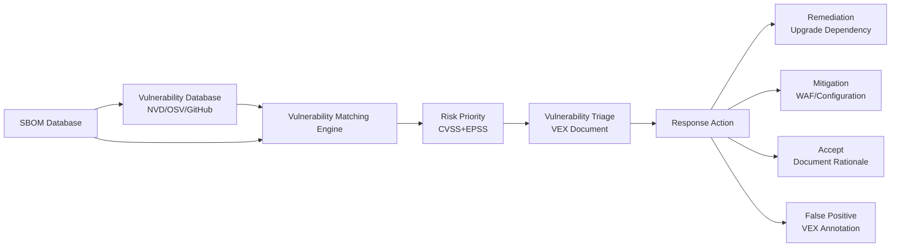
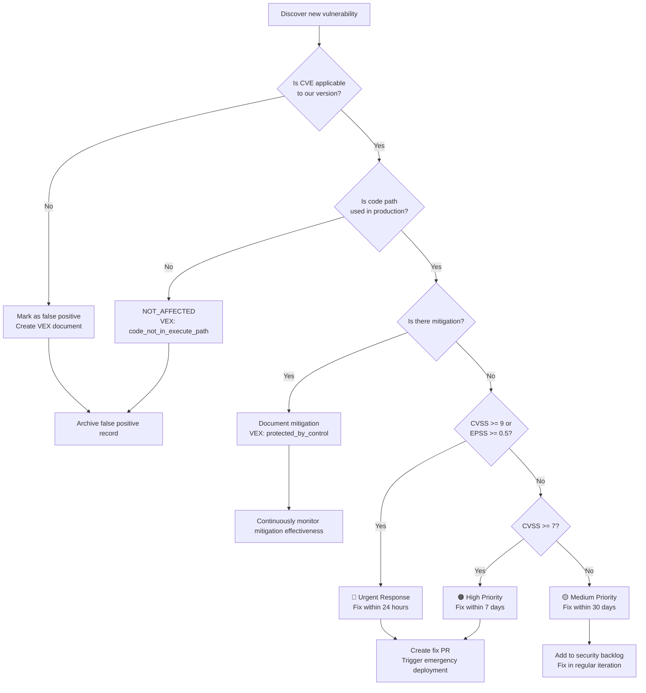
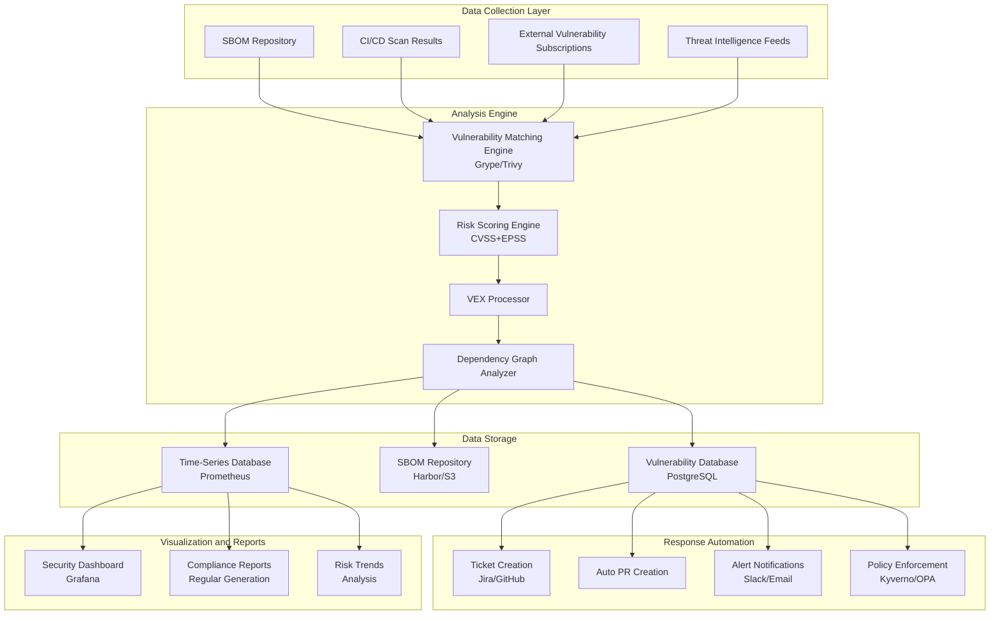

> **Production Environment Security Notice**
>
> This document contains directly executable operational commands. Before execution, please confirm: whether the current target cluster and Namespace are correct; whether you have sufficient RBAC permissions; whether you have verified in non-production environments. Command risk levels are marked as: 🔴 High risk (may cause data loss or service interruption), 🟡 Medium risk (will modify cluster state but usually reversible), 🟢 Low risk/read-only (information gathering with no side effects).


# SBOM Vulnerability Analysis and Governance

> SBOM-based vulnerability analysis is the cornerstone of modern supply chain security governance, achieving proactive security posture management through systematic vulnerability discovery, assessment, response, and tracking.

---

<!-- chunk: Table of Contents -->## Table of Contents

1. [SBOM-Driven Vulnerability Analysis Fundamentals](#1-sbom-driven-vulnerability-analysis-fundamentals)
2. [Complete Grype Vulnerability Scanning Guide](#2-complete-grype-vulnerability-scanning-guide)
3. [VEX Vulnerability Exploitability Exchange](#3-vex-vulnerability-exploitability-exchange)
4. [CVSS Risk Scoring System](#4-cvss-risk-scoring-system)
5. [EPSS Exploit Prediction](#5-epss-exploit-prediction)
6. [Dependency Graph Vulnerability Propagation Analysis](#6-dependency-graph-vulnerability-propagation-analysis)
7. [Vulnerability Governance Framework](#7-vulnerability-governance-framework)
8. [Automated Remediation Workflow](#8-automated-remediation-workflow)
9. [Vulnerability Data Sources and Intelligence](#9-vulnerability-data-sources-and-intelligence)
10. [Compliance Vulnerability Reporting](#10-compliance-vulnerability-reporting)
11. [Vulnerability Metrics and KPIs](#11-vulnerability-metrics-and-kpis)
12. [Enterprise Vulnerability Governance Platform](#12-enterprise-vulnerability-governance-platform)

---

<!-- chunk: 1. SBOM-Driven Vulnerability Analysis Fundamentals -->## 1. SBOM-Driven Vulnerability Analysis Fundamentals

## 1.1 Relationship Between SBOM and Vulnerability Analysis

```
Traditional vulnerability management vs SBOM-driven vulnerability management:

Traditional approach:
Discover vulnerability → Manually audit affected systems → Time-consuming days/weeks → Delayed response

SBOM-driven:
Discover vulnerability → Query SBOM database → Second-level identification of affected components → Rapid response

Log4Shell response time comparison:
- With SBOM: Average response time < 2 hours
- Without SBOM: Average response time > 5 days
```



## 1.2 Vulnerability Matching Principles

```
Vulnerability matching process:

1. SBOM component identification
   ─ Package name + version
   ─ PURL (Package URL)
   ─ CPE (Common Platform Enumeration)

2. Vulnerability database queries
   NVD matching: Based on CPE 2.3 pattern matching
   OSV matching: Based on version range matching
   GitHub matching: Based on GHSA ID matching

3. Match confidence grading
   HIGH   - Exact PURL + version match
   MEDIUM - Package name + version range match
   LOW    - Package name match only (no version)

4. Deduplication and correlation
   ─ The same vulnerability may have multiple CVE/GHSA IDs
   ─ Merge duplicate matches
   ─ Associate CVSS scores
```

## 1.3 Vulnerability Database Coverage

```bash
# Major vulnerability database comparison

# Database                Coverage           Update Frequency    PURL Support
# ─────────────────────────────────────────────────────────────
# NVD (NIST)           All CVEs            Hourly              CPE Mapping
# OSV (Google)         Open Source Ecosystem Real-time           PURL Native
# GitHub Advisory (GHSA) GitHub Hosted Packages Real-time       PURL Native
# VulnDB               Commercial, More Comprehensive Real-time  Partial
# RHSA/ALAS/DSA        Linux Distributions Real-time            Package Name
# RustSec              Rust Ecosystem      Real-time            cargo PURL

# View Grype database coverage
grype db status
grype db list
```

---

<!-- chunk: 2. Complete Grype Vulnerability Scanning Guide -->## 2. Complete Grype Vulnerability Scanning Guide

## 2.1 Installation and Initialization

```bash
# Install Grype

# Method 1: Official script
curl -sSfL https://raw.githubusercontent.com/anchore/grype/main/install.sh | \
  sh -s -- -b /usr/local/bin

# Method 2: Homebrew
brew install grype

# Method 3: Go installation
go install github.com/anchore/grype/cmd/grype@latest

# Method 4: Binary download (fixed version)
VERSION="v0.74.1"
curl -Lo grype.tar.gz \
  https://github.com/anchore/grype/releases/download/${VERSION}/grype_${VERSION}_linux_amd64.tar.gz
tar -xzf grype.tar.gz grype
sudo mv grype /usr/local/bin/

# Initialize vulnerability database
grype db update
grype db status

# Verify installation
grype version
# grype 0.74.1
#  BuildDate: 2024-01-01T00:00:00Z
#  GitCommit: abc123
#  DBSchemaVersion: 5
#  Platform: linux/amd64
```

## 2.2 Scan Target Types

``` bash
# 🟢 Low risk: read-only/information gathering, usually no side effects
# ============ Container Image Scanning ============

# Scan Docker image
grype nginx:latest

# Scan and output JSON format
grype nginx:latest -o json

# Scan private image
grype myregistry.io/myapp:v1.0.0

# Scan local tar image
docker save nginx:latest -o nginx.tar
grype docker-archive:./nginx.tar

# Scan OCI layout
grype oci-layout:./my-oci-image/

# ============ SBOM Scanning (Recommended) ============

# Scan CycloneDX SBOM
grype sbom:./sbom.cdx.json

# Scan SPDX SBOM
grype sbom:./sbom.spdx.json

# Scan remote SBOM
grype sbom:https://example.com/sbom.cdx.json

# ============ Filesystem Scanning ============

# Scan directory
grype dir:./my-project

# Scan JAR/WAR files
grype file:./app.jar

# ============ Scan Options ============

# Set failure threshold
grype myapp:latest --fail-on critical  # Return non-zero when Critical found
grype myapp:latest --fail-on high

# Display only specific severity levels
grype myapp:latest \
  --only-fixed \  # Show only vulnerabilities with known fixes
  -o table

# Exclude specific directories
grype dir:. \
  --exclude "**/test/**" \
  --exclude "**/docs/**"

# Verbose mode
grype myapp:latest -v

# Quiet mode (output results only)
grype myapp:latest -q -o json
```
## 2.3 Output Formats and Reports

```bash
# Grype output formats

# Table format (default, human-readable)
grype myapp:latest -o table
# NAME          INSTALLED  FIXED-IN  TYPE  VULNERABILITY  SEVERITY
# openssl       1.1.1n     1.1.1t    apk   CVE-2023-0286  High
# ...

# JSON format (machine-readable)
grype myapp:latest -o json > vulnerabilities.json

# SARIF format (IDE/GitHub integration)
grype myapp:latest -o sarif > results.sarif

# CycloneDX format (SBOM with vulnerabilities)
grype myapp:latest -o cyclonedx > enriched-sbom.cdx.xml
grype myapp:latest -o cyclonedx-json > enriched-sbom.cdx.json

# SPDX format
grype myapp:latest -o spdx-json > enriched-sbom.spdx.json

# JUnit XML format (CI test reports)
grype myapp:latest -o junit > test-results.xml

# Template format (custom reports)
cat > vuln-report.tmpl << 'EOF'
# Vulnerability Report
Generated: {{ now }}

<!-- chunk: Summary -->## Summary
Total: {{ len .Matches }}

<!-- chunk: Critical/High Vulnerabilities -->## Critical/High Vulnerabilities
{{ range .Matches }}{{ if or (eq .Vulnerability.Severity "Critical") (eq .Vulnerability.Severity "High") }}
- **{{ .Vulnerability.ID }}** ({{ .Vulnerability.Severity }})
  Package: {{ .Artifact.Name }} {{ .Artifact.Version }}
  Fixed in: {{ .Vulnerability.Fix.State }}
{{ end }}{{ end }}
EOF

grype myapp:latest -o template -t vuln-report.tmpl > report.md
```

## 2.4 Grype Configuration File

```yaml
# ~/.grype/config.yaml
---

# Scan options
fail-on-severity: high

# Output options
output:
  - format: table
  - format: json
    file: grype-results.json

# Display only vulnerabilities with fixes
only-fixed: false

# Ignore specific vulnerabilities
ignore:
  - vulnerability: CVE-2022-1234
    reason: "Not applicable - we don't use the vulnerable feature"
  - vulnerability: CVE-2021-5678
    fix-state: not-fixed  # Ignore unfixed vulnerabilities
  - package:
      name: openssl
      version: 1.1.1t
      type: apk
    vulnerability: CVE-2023-0286

# Database options
db:
  auto-update: true
  validate-by-hash-on-start: true
  
# Logging options
log:
  level: warn
  
# Parallel scanning
parallelism: 4
```

## 2.5 Deep Analysis of Grype Results

```python
#!/usr/bin/env python3
"""Grype scan results deep analysis tool"""

import json
import sys
from dataclasses import dataclass, field
from typing import List, Dict, Optional
from collections import defaultdict

@dataclass
class VulnerabilityMatch:
    cve_id: str
    severity: str
    package_name: str
    package_version: str
    package_type: str
    fixed_version: Optional[str]
    cvss_score: Optional[float]
    description: str
    urls: List[str] = field(default_factory=list)

def parse_grype_output(grype_json_file: str) -> List[VulnerabilityMatch]:
    """Parse Grype JSON output"""
    with open(grype_json_file) as f:
        data = json.load(f)
    
    matches = []
    for match in data.get("matches", []):
        vuln = match.get("vulnerability", {})
        artifact = match.get("artifact", {})
        
        # Extract CVSS score
        cvss_score = None
        for cvss in vuln.get("cvss", []):
            if cvss.get("version", "").startswith("3"):
                cvss_score = cvss.get("metrics", {}).get("baseScore")
                break
        
        # Get fixed version
        fix_state = vuln.get("fix", {})
        fixed_version = None
        if fix_state.get("state") == "fixed":
            versions = fix_state.get("versions", [])
            fixed_version = versions[0] if versions else "fixed"
        
        vm = VulnerabilityMatch(
            cve_id=vuln.get("id", ""),
            severity=vuln.get("severity", "Unknown"),
            package_name=artifact.get("name", ""),
            package_version=artifact.get("version", ""),
            package_type=artifact.get("type", ""),
            fixed_version=fixed_version,
            cvss_score=cvss_score,
            description=vuln.get("description", "")[:200],
            urls=vuln.get("urls", [])[:3]
        )
        matches.append(vm)
    
    return matches

def generate_risk_report(matches: List[VulnerabilityMatch]) -> None:
    """Generate risk report"""
    # Group by severity
    by_severity = defaultdict(list)
    for m in matches:
        by_severity[m.severity].append(m)
    
    # Count fixed vulnerabilities
    fixable = [m for m in matches if m.fixed_version]
    unfixable = [m for m in matches if not m.fixed_version]
    
    # Count by package
    by_package = defaultdict(list)
    for m in matches:
        by_package[f"{m.package_name}@{m.package_version}"].append(m)
    
    # Sort by CVSS score
    sorted_by_cvss = sorted(
        [m for m in matches if m.cvss_score],
        key=lambda x: x.cvss_score,
        reverse=True
    )
    
    print(f"\n{'='*70}")
    print(f"Vulnerability Analysis Report")
    print(f"{'='*70}")
    
    # Summary
    print(f"\n📊 Summary:")
    print(f"  Total vulnerabilities: {len(matches)}")
    print(f"  With fix versions: {len(fixable)} ({len(fixable)/max(len(matches),1)*100:.0f}%)")
    print(f"  Without fix versions: {len(unfixable)}")
    
    severity_order = ["Critical", "High", "Medium", "Low", "Negligible", "Unknown"]
    for sev in severity_order:
        count = len(by_severity.get(sev, []))
        if count > 0:
            bar = "█" * min(count // 2 + 1, 30)
            print(f"  {sev:12s}: {count:4d} {bar}")
    
    # Highest CVSS score vulnerabilities
    if sorted_by_cvss:
        print(f"\n🔥 Highest Risk Vulnerabilities (Top 10 by CVSS):")
        for m in sorted_by_cvss[:10]:
            fix_info = f"Fix version: {m.fixed_version}" if m.fixed_version else "No fix available"
            print(f"  [{m.cvss_score:4.1f}] {m.cve_id:20s} | {m.package_name}@{m.package_version}")
            print(f"         {m.severity:12s} | {fix_info}")
    
    # Urgent fixes (fixable Critical/High)
    urgent = [m for m in matches 
              if m.severity in ["Critical", "High"] and m.fixed_version]
    if urgent:
        print(f"\n⚡ Urgent Fixes ({len(urgent)} items with available fix versions):")
        for m in urgent[:15]:
            print(f"  - {m.cve_id} ({m.severity}): {m.package_name}@{m.package_version} → {m.fixed_version}")
    
    # Most affected packages
    print(f"\n📦 Packages with Most Vulnerabilities (Top 10):")
    for pkg, vulns in sorted(by_package.items(), key=lambda x: -len(x[1]))[:10]:
        severities = ",".join(set(v.severity for v in vulns))
        print(f"  {pkg:50s} {len(vulns):3d} vulnerabilities [{severities}]")
    
    # Remediation recommendations
    print(f"\n💡 Remediation Recommendations:")
    print(f"  1. Immediately fix {len(urgent)} Critical/High vulnerabilities with available fixes")
    
    no_fix_critical = [m for m in matches 
                       if m.severity == "Critical" and not m.fixed_version]
    if no_fix_critical:
        print(f"  2. Evaluate {len(no_fix_critical)} Critical vulnerabilities without fixes (consider mitigations)")
    
    print(f"  3. Establish regular scanning schedule (recommend daily scanning for critical images)")

if __name__ == "__main__":
    file = sys.argv[1] if len(sys.argv) > 1 else "grype-results.json"
    matches = parse_grype_output(file)
    generate_risk_report(matches)
```

## 2.6 Grype in Continuous Integration

```yaml
# GitHub Actions Grype scanning workflow
name: Vulnerability Scanning with Grype

on:
  push:
    branches: [main]
  pull_request:
  schedule:
    - cron: '0 6 * * *'  # Every day at 6 AM

jobs:
  grype-scan:
    runs-on: ubuntu-latest
    permissions:
      security-events: write
      contents: read
    
    strategy:
      matrix:
        target:
          - image: "nginx:latest"
            name: "nginx"
          - image: "alpine:latest"  
            name: "alpine"
    
    steps:
      - uses: actions/checkout@b4ffde65f46336ab88eb53be808477a3936bae11
      
      # Generate SBOM first
      - name: Generate SBOM
        uses: anchore/sbom-action@78fc58e266e87a38d4194b2137a3d4e9baf7e6ef
        with:
          image: ${{ matrix.target.image }}
          format: cyclonedx-json
          output-file: sbom-${{ matrix.target.name }}.cdx.json
      
      # Scan vulnerabilities based on SBOM
      - name: Run Grype on SBOM
        uses: anchore/scan-action@3343887d815d7b07465f6fdcd395bd66508d486a
        id: grype
        with:
          sbom: sbom-${{ matrix.target.name }}.cdx.json
          severity-cutoff: high
          fail-build: ${{ github.event_name == 'push' }}  # Don't force fail on PR
          output-format: sarif
      
      # Upload SARIF to GitHub Security
      - name: Upload SARIF
        uses: github/codeql-action/upload-sarif@cdcdbb579706841c47f7063dda365e292e5cad7a
        if: always()
        with:
          sarif_file: ${{ steps.grype.outputs.sarif }}
          category: "grype-${{ matrix.target.name }}"
      
      # Generate human-readable report
      - name: Generate Human-Readable Report
        if: always()
        run: |
          # Install Grype
          curl -sSfL https://raw.githubusercontent.com/anchore/grype/main/install.sh | \
            sh -s -- -b /usr/local/bin
          
          # Generate detailed report
          grype sbom:sbom-${{ matrix.target.name }}.cdx.json \
            -o table \
            --fail-on critical || true
      
      # PR comment (if PR)
      - name: Comment on PR
        if: github.event_name == 'pull_request'
        uses: actions/github-script@60a0d83039c74a4aee543508d2ffcb1c3799cdea
        with:
          script: |
            const fs = require('fs');
            const sarif = JSON.parse(fs.readFileSync('${{ steps.grype.outputs.sarif }}', 'utf8'));
            const results = sarif.runs[0]?.results || [];
            const critical = results.filter(r => r.level === 'error').length;
            const high = results.filter(r => r.level === 'warning').length;
            
            await github.rest.issues.createComment({
              owner: context.repo.owner,
              repo: context.repo.repo,
              issue_number: context.issue.number,
              body: `<!-- chunk: 🔍 Vulnerability Scan Results - ${{ matrix.target.name }} -->## 🔍 Vulnerability Scan Results - ${{ matrix.target.name }}
              
              | Severity | Count |
              |----------|-------|
              | Critical | ${critical} |
              | High | ${high} |
              
              ${critical > 0 ? '⛔ **BLOCKING**: Critical vulnerabilities found!' : '✅ No critical vulnerabilities'}
              `
            });
```

---

<!-- chunk: 3. VEX Vulnerability Exploitability Exchange -->## 3. VEX Vulnerability Exploitability Exchange

## 3.1 VEX Overview

VEX (Vulnerability Exploitability eXchange) is a machine-readable document format for declaring whether a specific vulnerability in a specific software version can be exploited.

```
Core problems solved by VEX:

Scanning tool discovers CVE-2021-44228 (Log4Shell) affecting your image
But your application actually:
  ─ Uses Log4j but does not expose JNDI lookup functionality
  ─ Or Log4j is a test dependency, not included in production build
  ─ Or has mitigated this vulnerability through configuration

Without VEX:
  ─ Each scan produces "false positives"
  ─ Security team needs to manually re-evaluate
  ─ Development team suffers from alert fatigue

With VEX:
  ─ Vulnerability classification results are reusable
  ─ Tools can automatically filter known false positives
  ─ Reduced alert fatigue
  ─ Compliance documentation
```

## 3.2 VEX Status Definitions

```
VEX four statuses:

1. NOT_AFFECTED (Not affected)
   ─ Vulnerable code exists in the component, but the software is not affected
   ─ Example: Contains vulnerable function but never called
   ─ Example: Vulnerability not exploitable on specific OS

2. AFFECTED (Affected)
   ─ Component is affected by vulnerability and confirmed exploitable
   ─ Must provide remediation action recommendations
   ─ Include environmental CVSS score (optional)

3. FIXED (Fixed)
   ─ Vulnerability fixed in this version
   ─ Include fix version number or commit reference

4. UNDER_INVESTIGATION (Under investigation)
   ─ Evaluating vulnerability impact
   ─ Temporary status, should update within specified timeframe
```

## 3.3 CycloneDX VEX Format

```json
// VEX document in CycloneDX format
// Method 1: Embedded in BOM
{
  "bomFormat": "CycloneDX",
  "specVersion": "1.5",
  "version": 1,
  "serialNumber": "urn:uuid:9e4e2b31-4b78-4d60-a1aa-8b4e7e9a6e20",
  "metadata": {
    "timestamp": "2024-01-15T10:30:00Z",
    "authors": [
      {
        "name": "Security Team",
        "email": "security@mycompany.com"
      }
    ]
  },
  
  "vulnerabilities": [
    {
      "id": "CVE-2021-44228",
      "source": {
        "name": "NVD",
        "url": "https://nvd.nist.gov/vuln/detail/CVE-2021-44228"
      },
      "ratings": [
        {
          "source": {"name": "NVD"},
          "score": 10.0,
          "severity": "critical",
          "method": "CVSSv3",
          "vector": "CVSS:3.1/AV:N/AC:L/PR:N/UI:N/S:C/C:H/I:H/A:H"
        },
        {
          "source": {"name": "MyCompany-Adjusted"},
          "score": 0.0,
          "severity": "none",
          "method": "CVSSv3",
          "vector": "CVSS:3.1/AV:N/AC:L/PR:N/UI:N/S:C/C:N/I:N/A:N",
          "justification": "JNDI feature is disabled via configuration"
        }
      ],
      "analysis": {
        "state": "not_affected",
        "justification": "protected_by_mitigating_control",
        "detail": "The application sets LOG4J_FORMAT_MSG_NO_LOOKUPS=true in all deployment configurations. JNDI lookup functionality is completely disabled.",
        "responses": [
          "will_not_fix"
        ]
      },
      "affects": [
        {
          "ref": "pkg:maven/org.apache.logging.log4j/log4j-core@2.14.1",
          "versions": [
            {
              "version": "2.14.1",
              "status": "affected"
            }
          ]
        }
      ]
    },
    
    {
      "id": "CVE-2023-12345",
      "source": {
        "name": "NVD"
      },
      "analysis": {
        "state": "fixed",
        "detail": "Fixed by upgrading openssl to 3.1.4-r1 in base image alpine:3.19.0",
        "responses": [
          "update"
        ]
      },
      "affects": [
        {
          "ref": "pkg:apk/alpine/openssl@3.1.3-r0"
        }
      ]
    },
    
    {
      "id": "CVE-2022-99999",
      "analysis": {
        "state": "under_investigation",
        "detail": "Security team is evaluating the impact. Expected assessment by 2024-02-01.",
        "firstIssued": "2024-01-15T10:30:00Z",
        "lastUpdated": "2024-01-15T10:30:00Z"
      },
      "affects": [
        {
          "ref": "pkg:npm/some-package@1.2.3"
        }
      ]
    }
  ]
}
```

## 3.4 OpenVEX Format

```json
// OpenVEX format (CISA-supported independent VEX format)
{
  "@context": "https://openvex.dev/ns/v0.2.0",
  "@id": "https://mycompany.com/vex/myapp-v1.0-vex-2024-01",
  "author": "Security Team <security@mycompany.com>",
  "timestamp": "2024-01-15T10:30:00Z",
  "last_updated": "2024-01-15T10:30:00Z",
  "version": 1,
  
  "statements": [
    {
      "vulnerability": {
        "@id": "https://nvd.nist.gov/vuln/detail/CVE-2021-44228",
        "name": "CVE-2021-44228",
        "description": "Apache Log4j2 JNDI lookup remote code execution"
      },
      "timestamp": "2024-01-15T10:30:00Z",
      "products": [
        {
          "@id": "pkg:docker/myorg/myapp@v1.0.0",
          "subcomponents": [
            {
              "@id": "pkg:maven/org.apache.logging.log4j/log4j-core@2.14.1"
            }
          ]
        }
      ],
      "status": "not_affected",
      "justification": "protected_by_mitigating_control",
      "impact_statement": "The application configures Log4j with LOG4J_FORMAT_MSG_NO_LOOKUPS=true in Kubernetes deployment ConfigMaps, effectively disabling JNDI lookups. This has been verified in production configuration audit on 2024-01-14."
    }
  ]
}
```

## 3.5 VEX Toolchain

``` bash
# 🟢 Low risk: read-only/information gathering, usually no side effects
# OpenVEX CLI tools
go install github.com/openvex/vexctl/cmd/vexctl@latest

# Create VEX document
vexctl create \
  --product "pkg:docker/myorg/myapp@v1.0.0" \
  --vulnerability "CVE-2021-44228" \
  --status "not_affected" \
  --justification "protected_by_mitigating_control" \
  --impact "Log4j JNDI disabled via LOG4J_FORMAT_MSG_NO_LOOKUPS=true" \
  > myapp-vex.json

# Merge multiple VEX documents
vexctl merge vex-doc1.json vex-doc2.json > merged-vex.json

# Apply VEX filtering to vulnerability reports
vexctl filter \
  --vex myapp-vex.json \
  --scan-results grype-results.json \
  > filtered-results.json

# Generate VEX report (which vulnerabilities were filtered)
vexctl report \
  --vex myapp-vex.json \
  --scan-results grype-results.json

# Grype VEX integration
grype sbom:sbom.cdx.json \
  --vex myapp-vex.json \
  -o table

# Trivy VEX integration
trivy image \
  --vex myapp-vex.openvex.json \
  myapp:v1.0.0
```
## 3.6 VEX Governance Process

```python
#!/usr/bin/env python3
"""VEX document lifecycle management"""

import json
import uuid
from datetime import datetime, timedelta
from typing import Optional
from dataclasses import dataclass, asdict

@dataclass
class VEXStatement:
    vulnerability_id: str
    product_purl: str
    status: str  # not_affected, affected, fixed, under_investigation
    justification: Optional[str] = None
    impact_statement: Optional[str] = None
    action_statement: Optional[str] = None
    review_date: Optional[str] = None  # For under_investigation
    
    # Valid justifications for not_affected:
    # - component_not_present
    # - vulnerable_code_not_present  
    # - vulnerable_code_cannot_be_controlled_by_adversary
    # - vulnerable_code_not_in_execute_path
    # - inline_mitigations_already_exist
    # - protected_by_mitigating_control


class VEXManager:
    def __init__(self, output_file: str, author: str, author_email: str):
        self.output_file = output_file
        self.author = author
        self.author_email = author_email
        self.statements = []
        
    def add_not_affected(
        self,
        cve_id: str,
        product_purl: str,
        justification: str,
        impact_statement: str
    ):
        """Add not_affected VEX statement"""
        
        valid_justifications = [
            "component_not_present",
            "vulnerable_code_not_present",
            "vulnerable_code_cannot_be_controlled_by_adversary",
            "vulnerable_code_not_in_execute_path",
            "inline_mitigations_already_exist",
            "protected_by_mitigating_control"
        ]
        
        if justification not in valid_justifications:
            raise ValueError(f"Invalid justification. Must be one of: {valid_justifications}")
        
        stmt = VEXStatement(
            vulnerability_id=cve_id,
            product_purl=product_purl,
            status="not_affected",
            justification=justification,
            impact_statement=impact_statement
        )
        self.statements.append(stmt)
        print(f"✅ Added NOT_AFFECTED statement for {cve_id}")
    
    def add_under_investigation(
        self,
        cve_id: str,
        product_purl: str,
        investigation_notes: str,
        review_days: int = 14
    ):
        """Add under_investigation VEX statement"""
        review_date = (datetime.utcnow() + timedelta(days=review_days)).isoformat() + "Z"
        
        stmt = VEXStatement(
            vulnerability_id=cve_id,
            product_purl=product_purl,
            status="under_investigation",
            impact_statement=investigation_notes,
            review_date=review_date
        )
        self.statements.append(stmt)
        print(f"⏳ Added UNDER_INVESTIGATION statement for {cve_id} (review by {review_date})")
    
    def add_affected(
        self,
        cve_id: str,
        product_purl: str,
        action_statement: str
    ):
        """Add affected VEX statement"""
        stmt = VEXStatement(
            vulnerability_id=cve_id,
            product_purl=product_purl,
            status="affected",
            action_statement=action_statement
        )
        self.statements.append(stmt)
        print(f"⚠️  Added AFFECTED statement for {cve_id}")
    
    def save(self) -> None:
        """Save as OpenVEX format"""
        doc = {
            "@context": "https://openvex.dev/ns/v0.2.0",
            "@id": f"https://security.mycompany.com/vex/{uuid.uuid4()}",
            "author": f"{self.author} <{self.author_email}>",
            "timestamp": datetime.utcnow().isoformat() + "Z",
            "last_updated": datetime.utcnow().isoformat() + "Z",
            "version": 1,
            "statements": []
        }
        
        for stmt in self.statements:
            statement = {
                "vulnerability": {"name": stmt.vulnerability_id},
                "timestamp": datetime.utcnow().isoformat() + "Z",
                "products": [{"@id": stmt.product_purl}],
                "status": stmt.status
            }
            
            if stmt.justification:
                statement["justification"] = stmt.justification
            if stmt.impact_statement:
                statement["impact_statement"] = stmt.impact_statement
            if stmt.action_statement:
                statement["action_statement"] = stmt.action_statement
            
            doc["statements"].append(statement)
        
        with open(self.output_file, 'w') as f:
            json.dump(doc, f, indent=2)
        
        print(f"\n✅ VEX document saved: {self.output_file}")
        print(f"   Total statements: {len(self.statements)}")


# Example usage
if __name__ == "__main__":
    manager = VEXManager(
        "myapp-v1.0.0-vex.json",
        "Security Team",
        "security@mycompany.com"
    )
    
    manager.add_not_affected(
        "CVE-2021-44228",
        "pkg:docker/myorg/myapp@v1.0.0",
        "protected_by_mitigating_control",
        "LOG4J_FORMAT_MSG_NO_LOOKUPS=true is set in all deployment configurations"
    )
    
    manager.add_under_investigation(
        "CVE-2024-00001",
        "pkg:docker/myorg/myapp@v1.0.0",
        "Evaluating if the vulnerable function path is reachable in our codebase",
        review_days=7
    )
    
    manager.save()
```

---

<!-- chunk: 4. CVSS Risk Scoring System -->## 4. CVSS Risk Scoring System

## 4.1 CVSS v3.1 Base Scoring

```
CVSS v3.1 Base Metrics:

Attack Vector (AV):
  N (Network)    - Can be exploited remotely over network    Weight: Highest
  A (Adjacent)   - Requires network adjacency access         Weight: High
  L (Local)      - Requires local access                    Weight: Medium
  P (Physical)   - Requires physical contact                Weight: Low

Attack Complexity (AC):
  L (Low)        - No special conditions required            Weight: High
  H (High)       - Requires specific conditions             Weight: Low

Privileges Required (PR):
  N (None)       - No privileges needed                     Weight: High
  L (Low)        - Low user privileges                      Weight: Medium
  H (High)       - Administrator privileges                Weight: Low

User Interaction (UI):
  N (None)       - No user interaction required             Weight: High
  R (Required)   - User participation required              Weight: Low

Scope (S):
  U (Unchanged)  - Affects single component only            
  C (Changed)    - Affects other components

Confidentiality Impact (C), Integrity Impact (I), Availability Impact (A):
  N (None)       - No impact
  L (Low)        - Limited impact
  H (High)       - Complete impact

Scoring ranges:
  9.0 - 10.0: Critical (Critical)
  7.0 - 8.9:  High (High)
  4.0 - 6.9:  Medium (Medium)
  0.1 - 3.9:  Low (Low)
  0.0:        None (None)
```

## 4.2 CVSS Environmental Scoring (Custom Risk)

```python
#!/usr/bin/env python3
"""CVSS Environmental Scoring Calculator - Adjust risk based on actual environment"""

from dataclasses import dataclass
from typing import Optional
import math

@dataclass
class CVSSEnvironmental:
    """CVSS v3.1 Environmental Scoring Calculation"""
    
    # Base score (from NVD)
    base_score: float
    base_vector: str
    
    # Environmental modified metrics (X = do not modify, use base)
    modified_av: str = "X"  # Attack Vector
    modified_ac: str = "X"  # Attack Complexity
    modified_pr: str = "X"  # Privileges Required
    modified_ui: str = "X"  # User Interaction
    modified_s: str = "X"   # Scope
    modified_c: str = "X"   # Confidentiality
    modified_i: str = "X"   # Integrity
    modified_a: str = "X"   # Availability
    
    # Supplementary metrics
    cr: str = "M"  # Confidentiality Requirement (H/M/L)
    ir: str = "M"  # Integrity Requirement
    ar: str = "M"  # Availability Requirement
    
    def get_context_adjusted_score(self) -> float:
        """Get risk score adjusted for business context"""
        
        # Simplified calculation example
        # In practice, use complete CVSS v3.1 formula
        
        score = self.base_score
        
        # Confidentiality requirement adjustment
        if self.cr == "H":
            score = min(score * 1.1, 10.0)
        elif self.cr == "L":
            score = score * 0.9
        
        # Integrity requirement adjustment
        if self.ir == "H":
            score = min(score * 1.05, 10.0)
        elif self.ir == "L":
            score = score * 0.95
        
        # Availability requirement adjustment
        if self.ar == "H":
            score = min(score * 1.05, 10.0)
        elif self.ar == "L":
            score = score * 0.95
        
        return round(score, 1)
    
    @property
    def severity(self) -> str:
        """Get severity level for environmental score"""
        score = self.get_context_adjusted_score()
        if score >= 9.0:
            return "Critical"
        elif score >= 7.0:
            return "High"
        elif score >= 4.0:
            return "Medium"
        elif score > 0:
            return "Low"
        return "None"


# Practical example: Adjust Log4Shell environmental score
log4shell = CVSSEnvironmental(
    base_score=10.0,
    base_vector="CVSS:3.1/AV:N/AC:L/PR:N/UI:N/S:C/C:H/I:H/A:H",
    # Our system doesn't handle highly sensitive data
    cr="L",  
    # But integrity is important
    ir="H",
    # Availability moderately important
    ar="M",
    # Attack complexity actually higher (has WAF filtering)
    modified_ac="H"
)

print(f"Log4Shell base score: {log4shell.base_score}")
print(f"Log4Shell after environmental adjustment: {log4shell.get_context_adjusted_score()}")
print(f"Environmental severity: {log4shell.severity}")
```

## 4.3 CVSS Scoring Practical Analysis

```bash
# Using CVSS calculator API
# FIRST.org provides public API

# Calculate CVSS v3.1 base score
curl -s "https://www.first.org/cvss/calculator/4.0#CVSS:4.0/AV:N/AC:L/AT:N/PR:N/UI:N/VC:H/VI:H/VA:H/SC:H/SI:H/SA:H"

# Bulk fetch CVSS scores for CVEs
#!/bin/bash
get_cvss_score() {
  local CVE_ID="$1"
  
  # Use NVD API v2.0
  RESULT=$(curl -s -H "apiKey: ${NVD_API_KEY}" \
    "https://services.nvd.nist.gov/rest/json/cves/2.0?cveId=${CVE_ID}" | \
    jq -r '.vulnerabilities[0].cve.metrics.cvssMetricV31[0].cvssData | 
           "\(.baseScore) (\(.baseSeverity))"')
  
  echo "${CVE_ID}: ${RESULT}"
}

# Batch process
while IFS= read -r cve; do
  get_cvss_score "$cve"
  sleep 0.1  # Avoid rate limiting
done < cve-list.txt
```

---

<!-- chunk: 5. EPSS Exploit Prediction -->## 5. EPSS Exploit Prediction

## 5.1 EPSS Overview

EPSS (Exploit Prediction Scoring System) is a data-driven scoring system maintained by FIRST organization that predicts the probability of a vulnerability being exploited in the next 30 days.

```
Key differences between CVSS and EPSS:

CVSS: Theoretical severity of vulnerability (static, based on characteristics)
EPSS: Probability of actual exploitation (dynamic, based on data)

Key insights:
─ Only about 5% of CVSS Critical vulnerabilities (~7,000) are exploited in the wild
─ EPSS > 50% vulnerabilities, even if CVSS is lower, should be prioritized
─ Combining CVSS + EPSS provides more accurate vulnerability prioritization

EPSS data sources:
─ Over 1 million threat intelligence sources
─ Shadowserver honeypot data
─ Public exploit code
─ Scanning activities
─ Social media discussions
```

## 5.2 EPSS Data Acquisition and Usage

```python
#!/usr/bin/env python3
"""EPSS data integration example"""

import requests
import json
from typing import List, Dict, Optional
from datetime import datetime, timedelta

class EPSSClient:
    """EPSS API client"""
    
    BASE_URL = "https://api.first.org/data/v1/epss"
    
    def __init__(self):
        self.session = requests.Session()
        self.session.headers.update({
            "Accept": "application/json"
        })
    
    def get_score(self, cve_id: str) -> Optional[Dict]:
        """Get EPSS score for single CVE"""
        try:
            response = self.session.get(
                self.BASE_URL,
                params={"cve": cve_id}
            )
            response.raise_for_status()
            data = response.json()
            
            if data.get("data"):
                item = data["data"][0]
                return {
                    "cve": item["cve"],
                    "epss": float(item["epss"]),
                    "percentile": float(item["percentile"]),
                    "date": item["date"]
                }
        except Exception as e:
            print(f"Error fetching EPSS for {cve_id}: {e}")
        return None
    
    def get_bulk_scores(self, cve_ids: List[str]) -> Dict[str, Dict]:
        """Get EPSS scores for multiple CVEs"""
        results = {}
        
        # API supports batch queries (max 100)
        for i in range(0, len(cve_ids), 100):
            batch = cve_ids[i:i+100]
            try:
                response = self.session.get(
                    self.BASE_URL,
                    params={"cve": ",".join(batch)}
                )
                response.raise_for_status()
                data = response.json()
                
                for item in data.get("data", []):
                    results[item["cve"]] = {
                        "epss": float(item["epss"]),
                        "percentile": float(item["percentile"]),
                        "date": item["date"]
                    }
            except Exception as e:
                print(f"Error in batch {i}: {e}")
        
        return results
    
    def get_high_risk_cves(self, min_epss: float = 0.1) -> List[Dict]:
        """Get list of CVEs with EPSS above threshold"""
        try:
            response = self.session.get(
                self.BASE_URL,
                params={"epss-gt": min_epss, "limit": 100}
            )
            response.raise_for_status()
            return response.json().get("data", [])
        except Exception as e:
            print(f"Error: {e}")
        return []


def prioritize_vulnerabilities(
    grype_results_file: str,
    output_file: str
) -> None:
    """Sort vulnerabilities by CVSS + EPSS priority"""
    
    # Load Grype results
    with open(grype_results_file) as f:
        grype_data = json.load(f)
    
    matches = grype_data.get("matches", [])
    if not matches:
        print("No vulnerabilities found")
        return
    
    # Extract all CVE IDs
    cve_ids = list(set(
        m["vulnerability"]["id"] 
        for m in matches 
        if m["vulnerability"]["id"].startswith("CVE-")
    ))
    
    print(f"Fetching EPSS scores for {len(cve_ids)} CVEs...")
    
    # Get EPSS scores
    epss_client = EPSSClient()
    epss_scores = epss_client.get_bulk_scores(cve_ids)
    
    # Enrich vulnerability data
    enriched = []
    for match in matches:
        vuln = match["vulnerability"]
        cve_id = vuln["id"]
        
        # Get CVSS score
        cvss_score = 0
        for cvss in vuln.get("cvss", []):
            if cvss.get("version", "").startswith("3"):
                cvss_score = cvss.get("metrics", {}).get("baseScore", 0)
                break
        
        # Get EPSS score
        epss_data = epss_scores.get(cve_id, {})
        epss_score = epss_data.get("epss", 0)
        epss_percentile = epss_data.get("percentile", 0)
        
        # Calculate combined priority score
        # Formula: CVSS weight * CVSS + EPSS weight * (EPSS * 10)
        # Adjust EPSS to 0-10 range
        priority_score = (0.5 * cvss_score) + (0.5 * epss_score * 10)
        
        enriched.append({
            "cve_id": cve_id,
            "package": f"{match['artifact']['name']}@{match['artifact']['version']}",
            "severity": vuln.get("severity"),
            "cvss_score": cvss_score,
            "epss_score": epss_score,
            "epss_percentile": epss_percentile,
            "priority_score": round(priority_score, 2),
            "has_fix": bool(vuln.get("fix", {}).get("versions")),
            "risk_category": _categorize_risk(cvss_score, epss_score)
        })
    
    # Sort by priority
    enriched.sort(key=lambda x: -x["priority_score"])
    
    # Output report
    print(f"\nVulnerability Priority Report (Combined CVSS + EPSS Ranking)")
    print(f"{'='*90}")
    print(f"{'CVE ID':20s} | {'Package':35s} | {'CVSS':5s} | {'EPSS%':7s} | {'Priority':7s} | {'Risk Category':10s}")
    print(f"{'-'*90}")
    
    for vuln in enriched[:20]:
        fix_marker = "✅" if vuln["has_fix"] else "❌"
        print(f"{vuln['cve_id']:20s} | {vuln['package'][:35]:35s} | "
              f"{vuln['cvss_score']:5.1f} | {vuln['epss_score']*100:6.1f}% | "
              f"{vuln['priority_score']:7.2f} | {fix_marker} {vuln['risk_category']}")
    
    # Save full results
    with open(output_file, 'w') as f:
        json.dump(enriched, f, indent=2)
    print(f"\nFull report saved: {output_file}")


def _categorize_risk(cvss: float, epss: float) -> str:
    """Categorize risk combining CVSS and EPSS"""
    if cvss >= 7.0 and epss >= 0.1:
        return "🔴 Urgent"
    elif cvss >= 7.0 and epss >= 0.01:
        return "🟠 High Priority"
    elif cvss >= 7.0:
        return "🟡 Important"
    elif epss >= 0.1:
        return "🟠 Active Exploitation"
    elif cvss >= 4.0:
        return "🔵 Medium"
    else:
        return "⚪ Low"


if __name__ == "__main__":
    prioritize_vulnerabilities("grype-results.json", "prioritized-vulns.json")
```

---

<!-- chunk: 6. Dependency Graph Vulnerability Propagation Analysis -->## 6. Dependency Graph Vulnerability Propagation Analysis

## 6.1 Propagation Path Analysis

```python
#!/usr/bin/env python3
"""Vulnerability propagation path analysis - analyze impact in dependency tree"""

import json
from collections import defaultdict, deque
from typing import Dict, List, Set, Tuple

class VulnerabilityPropagationAnalyzer:
    """Analyze vulnerability propagation in dependency graph"""
    
    def __init__(self, sbom_file: str, grype_file: str):
        # Load SBOM
        with open(sbom_file) as f:
            self.sbom = json.load(f)
        
        # Load vulnerability data
        with open(grype_file) as f:
            self.grype_data = json.load(f)
        
        # Build dependency graph
        self.dep_graph = self._build_dep_graph()
        self.reverse_graph = self._build_reverse_graph()
        self.components = self._index_components()
        self.vulnerabilities = self._index_vulnerabilities()
    
    def _build_dep_graph(self) -> Dict[str, Set[str]]:
        """Build dependency graph"""
        graph = defaultdict(set)
        for dep in self.sbom.get("dependencies", []):
            ref = dep.get("ref", "")
            for d in dep.get("dependsOn", []):
                graph[ref].add(d)
        return dict(graph)
    
    def _build_reverse_graph(self) -> Dict[str, Set[str]]:
        """Build reverse dependency graph"""
        reverse = defaultdict(set)
        for source, targets in self.dep_graph.items():
            for target in targets:
                reverse[target].add(source)
        return dict(reverse)
    
    def _index_components(self) -> Dict[str, dict]:
        """Index component information"""
        index = {}
        for comp in self.sbom.get("components", []):
            purl = comp.get("purl", "")
            if purl:
                index[purl] = comp
        return index
    
    def _index_vulnerabilities(self) -> Dict[str, List[dict]]:
        """Index vulnerability information (by package PURL)"""
        vuln_index = defaultdict(list)
        
        for match in self.grype_data.get("matches", []):
            artifact = match.get("artifact", {})
            purl = artifact.get("purl", "")
            vuln = match.get("vulnerability", {})
            
            if purl:
                vuln_index[purl].append({
                    "id": vuln.get("id"),
                    "severity": vuln.get("severity"),
                    "cvss_score": self._get_cvss_score(vuln)
                })
        
        return dict(vuln_index)
    
    def _get_cvss_score(self, vuln: dict) -> float:
        """Extract CVSS score"""
        for cvss in vuln.get("cvss", []):
            if cvss.get("version", "").startswith("3"):
                return cvss.get("metrics", {}).get("baseScore", 0)
        return 0
    
    def analyze_blast_radius(self, vulnerable_purl: str) -> Dict:
        """Analyze blast radius of vulnerability (how many upstream components affected)"""
        affected = set()
        paths = []
        queue = deque([(vulnerable_purl, [vulnerable_purl])])
        
        while queue:
            current, path = queue.popleft()
            
            for parent in self.reverse_graph.get(current, set()):
                if parent not in affected:
                    affected.add(parent)
                    new_path = path + [parent]
                    paths.append(new_path)
                    queue.append((parent, new_path))
        
        # Analyze affected component types
        affected_apps = []
        affected_libs = []
        
        for purl in affected:
            comp = self.components.get(purl, {})
            comp_type = comp.get("type", "unknown")
            name = comp.get("name", purl)
            
            if comp_type in ["application", "container", "device"]:
                affected_apps.append(name)
            else:
                affected_libs.append(name)
        
        return {
            "vulnerable_component": vulnerable_purl,
            "total_affected": len(affected),
            "affected_applications": affected_apps,
            "affected_libraries": affected_libs,
            "propagation_paths": paths[:10],  # Limit output
            "max_path_length": max((len(p) for p in paths), default=0)
        }
    
    def get_critical_path_vulnerabilities(self) -> List[Dict]:
        """Get vulnerabilities on critical paths"""
        results = []
        
        for purl, vulns in self.vulnerabilities.items():
            for vuln in vulns:
                if vuln["cvss_score"] >= 7.0:  # High or Critical
                    blast = self.analyze_blast_radius(purl)
                    
                    comp = self.components.get(purl, {})
                    results.append({
                        "cve_id": vuln["id"],
                        "severity": vuln["severity"],
                        "cvss_score": vuln["cvss_score"],
                        "component": comp.get("name", purl),
                        "version": comp.get("version", ""),
                        "blast_radius": blast["total_affected"],
                        "affected_apps": len(blast["affected_applications"])
                    })
        
        # Sort by impact radius
        return sorted(results, key=lambda x: (-x["blast_radius"], -x["cvss_score"]))
    
    def generate_report(self) -> None:
        """Generate complete impact analysis report"""
        print(f"\n{'='*70}")
        print("Vulnerability Propagation Impact Analysis Report")
        print(f"{'='*70}")
        
        critical_vulns = self.get_critical_path_vulnerabilities()
        
        print(f"\nHigh/Critical Vulnerability Impact Analysis (Top 10):")
        print(f"{'CVE ID':20s} | {'Package':25s} | {'CVSS':5s} | {'Affected Components':8s} | {'Affected Apps':8s}")
        print(f"{'-'*70}")
        
        for vuln in critical_vulns[:10]:
            print(f"{vuln['cve_id']:20s} | "
                  f"{vuln['component'][:25]:25s} | "
                  f"{vuln['cvss_score']:5.1f} | "
                  f"{vuln['blast_radius']:8d} | "
                  f"{vuln['affected_apps']:8d}")
        
        # Statistics on highest risk vulnerabilities
        if critical_vulns:
            top_vuln = critical_vulns[0]
            print(f"\n🔴 Highest Impact Vulnerability: {top_vuln['cve_id']}")
            print(f"   Component: {top_vuln['component']}@{top_vuln['version']}")
            print(f"   Affects {top_vuln['blast_radius']} components")
            
            # Detailed blast radius analysis
            for purl, vulns in self.vulnerabilities.items():
                for v in vulns:
                    if v["id"] == top_vuln["cve_id"]:
                        blast = self.analyze_blast_radius(purl)
                        if blast["affected_applications"]:
                            print(f"   Affected applications: {', '.join(blast['affected_applications'][:5])}")
                        break
```

---

<!-- chunk: 7. Vulnerability Governance Framework -->## 7. Vulnerability Governance Framework

## 7.1 Vulnerability Classification Decision Tree



## 7.2 SLA Management Framework

```yaml
# Vulnerability response SLA definitions

vulnerability_sla:
  
  critical:
    cvss_range: "9.0 - 10.0"
    combined_trigger: "CVSS>=9.0 OR EPSS>=0.5"
    initial_response: "2 hours"
    triage_complete: "8 hours"
    fix_or_mitigation: "24 hours"
    patch_deployment: "72 hours"
    escalation:
      - level: 1 (2h no response): "Notify security team lead"
      - level: 2 (8h no response): "Notify CTO/CISO"
      - level: 3 (24h no fix): "Start incident response"
  
  high:
    cvss_range: "7.0 - 8.9"
    combined_trigger: "CVSS>=7.0 AND EPSS>=0.01"
    initial_response: "8 hours"
    triage_complete: "24 hours"
    fix_or_mitigation: "7 days"
    patch_deployment: "14 days"
  
  medium:
    cvss_range: "4.0 - 6.9"
    initial_response: "3 days"
    triage_complete: "1 week"
    fix_or_mitigation: "30 days"
    patch_deployment: "60 days"
  
  low:
    cvss_range: "0.1 - 3.9"
    initial_response: "2 weeks"
    triage_complete: "1 month"
    fix_or_mitigation: "90 days"
    patch_deployment: "next_release"
  
  exceptions:
    approval_required: "Security team lead"
    max_extension: "One SLA period"
    documentation: "Must document rationale in vulnerability tracking system"
```

## 7.3 Vulnerability Tracking System Integration

```python
#!/usr/bin/env python3
"""Vulnerability tracking system integration - Jira/GitHub Issues"""

import requests
import json
from datetime import datetime, timedelta
from typing import Optional

class VulnerabilityTracker:
    """Vulnerability tracking system integration"""
    
    def __init__(self, jira_url: str, jira_token: str, project_key: str):
        self.jira_url = jira_url
        self.headers = {
            "Authorization": f"Bearer {jira_token}",
            "Content-Type": "application/json"
        }
        self.project_key = project_key
    
    def create_vulnerability_issue(
        self,
        cve_id: str,
        severity: str,
        package: str,
        version: str,
        cvss_score: float,
        epss_score: float,
        description: str,
        fix_version: Optional[str] = None
    ) -> dict:
        """Create vulnerability tracking issue"""
        
        # Calculate due date based on severity
        sla_days = {
            "Critical": 3,
            "High": 14,
            "Medium": 60,
            "Low": 90
        }
        days = sla_days.get(severity, 90)
        due_date = (datetime.utcnow() + timedelta(days=days)).strftime("%Y-%m-%d")
        
        # Priority mapping
        priority_map = {
            "Critical": "Highest",
            "High": "High",
            "Medium": "Medium",
            "Low": "Low"
        }
        
        issue_data = {
            "fields": {
                "project": {"key": self.project_key},
                "summary": f"[Security] {cve_id} in {package}@{version} ({severity})",
                "description": {
                    "type": "doc",
                    "version": 1,
                    "content": [{
                        "type": "paragraph",
                        "content": [{
                            "type": "text",
                            "text": f"""
Vulnerability: {cve_id}
Severity: {severity}
CVSS Score: {cvss_score}
EPSS Score: {epss_score:.3f} ({epss_score*100:.1f}% probability of exploitation)
Package: {package}@{version}
Fix Version: {fix_version or 'Not available'}
Due Date: {due_date}

Description:
{description}

Recommended Actions:
1. Verify if this vulnerability applies to your usage
2. Upgrade to {fix_version or 'next available version'}
3. If no fix available, implement workaround or accept risk
4. Update SBOM and VEX documentation after resolution
"""
                        }]
                    }]
                },
                "issuetype": {"name": "Bug"},
                "priority": {"name": priority_map.get(severity, "Medium")},
                "duedate": due_date,
                "labels": ["security", "vulnerability", "supply-chain", cve_id, severity.lower()],
                "customfield_10016": days,  # Story points (SLA)
            }
        }
        
        try:
            response = requests.post(
                f"{self.jira_url}/rest/api/3/issue",
                headers=self.headers,
                json=issue_data
            )
            response.raise_for_status()
            issue = response.json()
            print(f"✅ Created Jira issue: {issue['key']} for {cve_id}")
            return issue
        except requests.exceptions.RequestException as e:
            print(f"❌ Failed to create issue: {e}")
            return {}
    
    def update_issue_status(self, issue_key: str, new_status: str) -> bool:
        """Update issue status"""
        # Get available transitions
        transitions_response = requests.get(
            f"{self.jira_url}/rest/api/3/issue/{issue_key}/transitions",
            headers=self.headers
        )
        transitions = transitions_response.json().get("transitions", [])
        
        transition_id = None
        for t in transitions:
            if t["name"].lower() == new_status.lower():
                transition_id = t["id"]
                break
        
        if not transition_id:
            print(f"⚠️  Status '{new_status}' not available for {issue_key}")
            return False
        
        try:
            requests.post(
                f"{self.jira_url}/rest/api/3/issue/{issue_key}/transitions",
                headers=self.headers,
                json={"transition": {"id": transition_id}}
            )
            print(f"✅ Updated {issue_key} status to {new_status}")
            return True
        except Exception as e:
            print(f"❌ Failed to update status: {e}")
            return False


def auto_create_vulnerability_issues(
    grype_file: str,
    tracker: VulnerabilityTracker,
    create_for: List[str] = ["Critical", "High"]
) -> None:
    """Automatically create tracking issues for high-priority vulnerabilities"""
    from typing import List
    
    with open(grype_file) as f:
        data = json.load(f)
    
    created = 0
    skipped = 0
    
    for match in data.get("matches", []):
        vuln = match["vulnerability"]
        severity = vuln.get("severity", "Unknown")
        
        if severity not in create_for:
            skipped += 1
            continue
        
        artifact = match["artifact"]
        cvss_score = 0
        for cvss in vuln.get("cvss", []):
            if cvss.get("version", "").startswith("3"):
                cvss_score = cvss.get("metrics", {}).get("baseScore", 0)
                break
        
        fix_versions = vuln.get("fix", {}).get("versions", [])
        fix_version = fix_versions[0] if fix_versions else None
        
        tracker.create_vulnerability_issue(
            cve_id=vuln["id"],
            severity=severity,
            package=artifact["name"],
            version=artifact["version"],
            cvss_score=cvss_score,
            epss_score=0,  # Get from EPSS API
            description=vuln.get("description", "No description available")[:500],
            fix_version=fix_version
        )
        created += 1
    
    print(f"\nSummary: Created {created} issues, skipped {skipped}")
```

---

<!-- chunk: 8. Automated Remediation Workflow -->## 8. Automated Remediation Workflow

## 8.1 Automatic Dependency Updates

```yaml
# .github/workflows/auto-remediation.yml
name: Automated Vulnerability Remediation

on:
  # Trigger after vulnerability scan
  workflow_run:
    workflows: ["Vulnerability Scanning with Grype"]
    types: [completed]
  
  # Or run periodically
  schedule:
    - cron: '0 4 * * 1'  # Every Monday at 4 AM

permissions:
  contents: write
  pull-requests: write
  security-events: read

jobs:
  auto-fix:
    runs-on: ubuntu-latest
    if: ${{ github.event.workflow_run.conclusion == 'failure' || github.event_name == 'schedule' }}
    
    steps:
      - uses: actions/checkout@b4ffde65f46336ab88eb53be808477a3936bae11
      
      - name: Run vulnerability scan
        run: |
          # Install tools
          curl -sSfL https://raw.githubusercontent.com/anchore/grype/main/install.sh | \
            sh -s -- -b /usr/local/bin
          curl -sSfL https://raw.githubusercontent.com/anchore/syft/main/install.sh | \
            sh -s -- -b /usr/local/bin
          
          # Generate SBOM
          syft . -o cyclonedx-json > sbom.cdx.json
          
          # Scan vulnerabilities
          grype sbom:sbom.cdx.json -o json > vulnerabilities.json || true
      
      - name: Analyze and fix vulnerabilities
        id: fix
        run: |
          python3 << 'EOF'
          import json
          import subprocess
          import sys
          
          with open("vulnerabilities.json") as f:
              data = json.load(f)
          
          fixable = []
          for match in data.get("matches", []):
              vuln = match["vulnerability"]
              artifact = match["artifact"]
              severity = vuln.get("severity", "Unknown")
              
              if severity not in ["Critical", "High"]:
                  continue
              
              fix_versions = vuln.get("fix", {}).get("versions", [])
              if not fix_versions:
                  continue
              
              fixable.append({
                  "cve_id": vuln["id"],
                  "severity": severity,
                  "package_name": artifact["name"],
                  "current_version": artifact["version"],
                  "fix_version": fix_versions[0],
                  "package_type": artifact["type"]
              })
          
          print(f"Found {len(fixable)} fixable high/critical vulnerabilities")
          
          # Generate fix summary
          with open("fix-summary.json", "w") as f:
              json.dump(fixable, f, indent=2)
          
          if fixable:
              print("::set-output name=has_fixes::true")
          else:
              print("::set-output name=has_fixes::false")
          EOF
      
      - name: Apply fixes for Go dependencies
        if: steps.fix.outputs.has_fixes == 'true' && hashFiles('go.mod') != ''
        run: |
          # Read packages needing fixes
          FIXES=$(cat fix-summary.json | jq -r '.[] | select(.package_type == "go-module") | "\(.package_name)@\(.fix_version)"')
          
          for pkg_ver in $FIXES; do
            PKG=$(echo "$pkg_ver" | cut -d@ -f1)
            VER=$(echo "$pkg_ver" | cut -d@ -f2)
            echo "Upgrading Go package: $PKG to $VER"
            go get "${PKG}@${VER}" 2>/dev/null || true
          done
          
          go mod tidy
      
      - name: Apply fixes for npm dependencies
        if: steps.fix.outputs.has_fixes == 'true' && hashFiles('package.json') != ''
        run: |
          FIXES=$(cat fix-summary.json | jq -r '.[] | select(.package_type == "npm") | "\(.package_name)@\(.fix_version)"')
          
          for pkg_ver in $FIXES; do
            echo "Upgrading npm package: $pkg_ver"
            npm install "${pkg_ver}" 2>/dev/null || true
          done
      
      - name: Create Pull Request
        if: steps.fix.outputs.has_fixes == 'true'
        uses: peter-evans/create-pull-request@c55203cfde3e5c11a452d352b4393e68b85b4533
        with:
          commit-message: "security: auto-fix high/critical vulnerabilities"
          title: "🔒 Auto-fix: Security vulnerabilities in dependencies"
          body: |
            <!-- chunk: Automated Security Fix -->## Automated Security Fix
            
            This PR was automatically generated to fix security vulnerabilities.
            
            #<!-- chunk: Changes -->## Changes
            $(cat fix-summary.json | python3 -c "
            import json,sys
            data = json.load(sys.stdin)
            for f in data:
                print(f'- **{f[\"cve_id\"]}** ({f[\"severity\"]}): {f[\"package_name\"]} {f[\"current_version\"]} → {f[\"fix_version\"]}')
            ")
            
            #<!-- chunk: Next Steps -->## Next Steps
            - [ ] Review the changes
            - [ ] Run full test suite
            - [ ] Verify no breaking changes
            - [ ] Approve and merge
          branch: security/auto-fix-${{ github.run_number }}
          labels: |
            security
            automated
            vulnerability-fix
```

## 8.2 Fix Verification Process

```bash
#!/bin/bash
# verify-fix.sh - Verify effectiveness of vulnerability fixes

set -euo pipefail

CVE_ID="${1:?CVE ID parameter required}"
IMAGE_BEFORE="${2:?Pre-fix image required}"
IMAGE_AFTER="${3:?Post-fix image required}"

echo "🔍 Verifying fix for: ${CVE_ID}"
echo "  Before fix: ${IMAGE_BEFORE}"
echo "  After fix: ${IMAGE_AFTER}"

# Scan before fix
echo ""
echo "--- Pre-fix Scan ---"
BEFORE_COUNT=$(grype "${IMAGE_BEFORE}" \
  --fail-on none \
  -o json 2>/dev/null | \
  jq "[.matches[] | select(.vulnerability.id == \"${CVE_ID}\")] | length")

# Scan after fix
echo ""
echo "--- Post-fix Scan ---"
AFTER_COUNT=$(grype "${IMAGE_AFTER}" \
  --fail-on none \
  -o json 2>/dev/null | \
  jq "[.matches[] | select(.vulnerability.id == \"${CVE_ID}\")] | length")

echo ""
echo "--- Fix Verification Results ---"
echo "  ${CVE_ID} occurrences before fix: ${BEFORE_COUNT}"
echo "  ${CVE_ID} occurrences after fix: ${AFTER_COUNT}"

if [ "${AFTER_COUNT}" -eq 0 ] && [ "${BEFORE_COUNT}" -gt 0 ]; then
  echo "✅ Vulnerability ${CVE_ID} successfully fixed!"
  exit 0
elif [ "${AFTER_COUNT}" -gt 0 ]; then
  echo "❌ Vulnerability ${CVE_ID} still exists! Fix unsuccessful."
  exit 1
elif [ "${BEFORE_COUNT}" -eq 0 ]; then
  echo "⚠️  Vulnerability ${CVE_ID} not detected before fix, cannot verify"
  exit 0
fi
```

---

<!-- chunk: 9. Vulnerability Data Sources and Intelligence -->## 9. Vulnerability Data Sources and Intelligence

## 9.1 Data Source Integration

```python
#!/usr/bin/env python3
"""Multi-source vulnerability intelligence aggregation"""

import requests
import json
from typing import Dict, List, Optional
from datetime import datetime

class VulnerabilityIntelligence:
    """Multi-source vulnerability intelligence aggregator"""
    
    def get_nvd_details(self, cve_id: str, api_key: Optional[str] = None) -> dict:
        """Get detailed information from NVD API v2"""
        headers = {}
        if api_key:
            headers["apiKey"] = api_key
        
        url = f"https://services.nvd.nist.gov/rest/json/cves/2.0?cveId={cve_id}"
        
        try:
            r = requests.get(url, headers=headers, timeout=30)
            r.raise_for_status()
            data = r.json()
            
            if not data.get("vulnerabilities"):
                return {}
            
            vuln = data["vulnerabilities"][0]["cve"]
            
            # Extract key information
            cvss_v3 = None
            for metric in vuln.get("metrics", {}).get("cvssMetricV31", []):
                if metric.get("type") == "Primary":
                    cvss_v3 = metric["cvssData"]
                    break
            
            return {
                "id": cve_id,
                "description": vuln.get("descriptions", [{}])[0].get("value", ""),
                "published": vuln.get("published"),
                "last_modified": vuln.get("lastModified"),
                "cvss_v3_score": cvss_v3.get("baseScore") if cvss_v3 else None,
                "cvss_v3_vector": cvss_v3.get("vectorString") if cvss_v3 else None,
                "cvss_v3_severity": cvss_v3.get("baseSeverity") if cvss_v3 else None,
                "references": [r["url"] for r in vuln.get("references", [])[:5]]
            }
        except Exception as e:
            print(f"Error fetching NVD data for {cve_id}: {e}")
            return {}
    
    def get_osv_details(self, cve_id: str) -> dict:
        """Get information from OSV database"""
        url = "https://api.osv.dev/v1/vulns"
        
        try:
            r = requests.get(f"{url}/{cve_id}", timeout=30)
            if r.status_code == 404:
                # Try finding via CVE alias
                query_r = requests.post(
                    "https://api.osv.dev/v1/query",
                    json={"query": {"aliases": [cve_id]}}
                )
                data = query_r.json()
                vulns = data.get("vulns", [])
                return vulns[0] if vulns else {}
            
            r.raise_for_status()
            return r.json()
        except Exception as e:
            print(f"Error fetching OSV data for {cve_id}: {e}")
            return {}
    
    def get_github_advisory(self, cve_id: str, github_token: Optional[str] = None) -> dict:
        """Get information from GitHub Security Advisory"""
        headers = {"Accept": "application/vnd.github+json"}
        if github_token:
            headers["Authorization"] = f"token {github_token}"
        
        # GraphQL query
        query = """
        query($cve: String!) {
          securityAdvisory(ghsaId: $cve) {
            ghsaId
            summary
            description
            severity
            cvss {
              score
              vectorString
            }
            publishedAt
            updatedAt
            vulnerabilities(first: 10) {
              nodes {
                package {
                  ecosystem
                  name
                }
                vulnerableVersionRange
                firstPatchedVersion {
                  identifier
                }
              }
            }
          }
        }
        """
        
        # First need to find GHSA ID from CVE ID
        # This requires additional query...
        return {}
    
    def get_comprehensive_intel(self, cve_id: str) -> dict:
        """Get comprehensive vulnerability intelligence"""
        intel = {
            "cve_id": cve_id,
            "fetched_at": datetime.utcnow().isoformat() + "Z",
            "sources": {}
        }
        
        # NVD
        nvd_data = self.get_nvd_details(cve_id)
        if nvd_data:
            intel["sources"]["nvd"] = nvd_data
            intel["cvss_score"] = nvd_data.get("cvss_v3_score")
            intel["severity"] = nvd_data.get("cvss_v3_severity")
            intel["description"] = nvd_data.get("description")
        
        # OSV
        osv_data = self.get_osv_details(cve_id)
        if osv_data:
            intel["sources"]["osv"] = {
                "id": osv_data.get("id"),
                "aliases": osv_data.get("aliases", []),
                "affected": [
                    {
                        "package": a.get("package", {}),
                        "ranges": a.get("ranges", [])
                    }
                    for a in osv_data.get("affected", [])
                ]
            }
        
        return intel
```

## 9.2 Threat Intelligence Subscription Configuration

```yaml
# Threat intelligence subscription configuration
threat_intelligence:
  
  # CVE/vulnerability data sources
  vulnerability_feeds:
    nvd:
      url: "https://services.nvd.nist.gov/rest/json/cves/2.0"
      update_frequency: "hourly"
      api_key_env: "NVD_API_KEY"
      
    osv:
      url: "https://osv.dev/list"
      update_frequency: "every_15_minutes"
      ecosystems:
        - "npm"
        - "PyPI"
        - "Go"
        - "RubyGems"
        - "Maven"
        - "crates.io"
        
    github_advisory:
      url: "https://api.github.com/advisories"
      update_frequency: "hourly"
      token_env: "GITHUB_TOKEN"
  
  # Exploit intelligence
  exploit_intelligence:
    epss:
      url: "https://api.first.org/data/v1/epss"
      update_frequency: "daily"
      
    cisa_kev:  # CISA Known Exploited Vulnerabilities
      url: "https://www.cisa.gov/sites/default/files/feeds/known_exploited_vulnerabilities.json"
      update_frequency: "daily"
      alert_on_new: true
  
  # Alert configuration
  alerting:
    channels:
      - type: slack
        webhook_env: "SLACK_WEBHOOK_URL"
        channel: "#security-alerts"
      - type: email
        recipients:
          - "security@company.com"
          - "devops@company.com"
    
    triggers:
      # Alert conditions
      - condition: "cisa_kev_match"
        severity: "P1"
        message_template: "🚨 CRITICAL: CVE {cve_id} is actively exploited (CISA KEV)"
        
      - condition: "cvss >= 9.0"
        severity: "P2"
        message_template: "⛔ CRITICAL CVSS: {cve_id} ({cvss_score}) affects {packages}"
        
      - condition: "epss >= 0.5"
        severity: "P2"
        message_template: "⚠️ HIGH EXPLOITATION PROBABILITY: {cve_id} (EPSS: {epss})"
```

---

<!-- chunk: 10. Compliance Vulnerability Reporting -->## 10. Compliance Vulnerability Reporting

## 10.1 Compliance Report Generation

```python
#!/usr/bin/env python3
"""Compliance vulnerability report generator"""

import json
from datetime import datetime
from typing import List, Dict
import html

def generate_compliance_report(
    sbom_file: str,
    vulnerabilities_file: str,
    company_name: str,
    product_name: str,
    output_html: str
) -> None:
    """Generate compliance-compliant vulnerability report"""
    
    with open(sbom_file) as f:
        sbom = json.load(f)
    
    with open(vulnerabilities_file) as f:
        vulns = json.load(f)
    
    matches = vulns.get("matches", [])
    
    # Statistical data
    by_severity = {}
    for m in matches:
        sev = m["vulnerability"].get("severity", "Unknown")
        by_severity[sev] = by_severity.get(sev, 0) + 1
    
    fixable = sum(1 for m in matches 
                  if m["vulnerability"].get("fix", {}).get("versions"))
    
    report_html = f"""<!DOCTYPE html>
<html lang="en">
<head>
    <meta charset="UTF-8">
    <title>Software Vulnerability Security Report - {html.escape(product_name)}</title>
    <style>
        body {{ font-family: 'Arial', sans-serif; margin: 40px; color: #333; }}
        h1 {{ color: #2c3e50; border-bottom: 3px solid #3498db; padding-bottom: 10px; }}
        h2 {{ color: #2980b9; margin-top: 30px; }}
        table {{ border-collapse: collapse; width: 100%; margin: 20px 0; }}
        th {{ background-color: #3498db; color: white; padding: 12px; text-align: left; }}
        td {{ padding: 10px; border-bottom: 1px solid #ddd; }}
        tr:hover {{ background-color: #f5f5f5; }}
        .critical {{ color: #c0392b; font-weight: bold; }}
        .high {{ color: #e67e22; font-weight: bold; }}
        .medium {{ color: #f39c12; }}
        .low {{ color: #27ae60; }}
        .summary-box {{ background: #ecf0f1; border-radius: 8px; padding: 20px; margin: 20px 0; }}
        .metric {{ display: inline-block; margin: 10px 20px; text-align: center; }}
        .metric-value {{ font-size: 36px; font-weight: bold; color: #2c3e50; }}
        .metric-label {{ font-size: 14px; color: #7f8c8d; }}
        .badge-critical {{ background: #c0392b; color: white; padding: 2px 8px; border-radius: 4px; }}
        .badge-high {{ background: #e67e22; color: white; padding: 2px 8px; border-radius: 4px; }}
        .badge-medium {{ background: #f39c12; color: white; padding: 2px 8px; border-radius: 4px; }}
        .badge-low {{ background: #27ae60; color: white; padding: 2px 8px; border-radius: 4px; }}
    </style>
</head>
<body>
    <h1>Software Vulnerability Security Report</h1>
    
    <div class="summary-box">
        <p><strong>Report Generated:</strong> {datetime.utcnow().strftime('%Y-%m-%d %H:%M:%S UTC')}</p>
        <p><strong>Product Name:</strong> {html.escape(product_name)}</p>
        <p><strong>Organization:</strong> {html.escape(company_name)}</p>
        <p><strong>Total Components:</strong> {len(sbom.get('components', []))}</p>
    </div>
    
    <h2>Vulnerability Summary</h2>
    <div class="summary-box">
        <div class="metric">
            <div class="metric-value">{len(matches)}</div>
            <div class="metric-label">Total Vulnerabilities</div>
        </div>
        <div class="metric">
            <div class="metric-value" style="color:#c0392b">{by_severity.get('Critical', 0)}</div>
            <div class="metric-label">Critical</div>
        </div>
        <div class="metric">
            <div class="metric-value" style="color:#e67e22">{by_severity.get('High', 0)}</div>
            <div class="metric-label">High</div>
        </div>
        <div class="metric">
            <div class="metric-value" style="color:#f39c12">{by_severity.get('Medium', 0)}</div>
            <div class="metric-label">Medium</div>
        </div>
        <div class="metric">
            <div class="metric-value" style="color:#27ae60">{by_severity.get('Low', 0)}</div>
            <div class="metric-label">Low</div>
        </div>
        <div class="metric">
            <div class="metric-value">{fixable}</div>
            <div class="metric-label">With Fix Versions</div>
        </div>
    </div>
    
    <h2>Vulnerability Details</h2>
    <table>
        <tr>
            <th>CVE ID</th>
            <th>Severity</th>
            <th>Affected Component</th>
            <th>Version</th>
            <th>Fix Version</th>
            <th>CVSS Score</th>
        </tr>
"""
    
    # Sort by severity
    severity_order = {"Critical": 0, "High": 1, "Medium": 2, "Low": 3, "Unknown": 4}
    sorted_matches = sorted(matches, 
                           key=lambda x: severity_order.get(x["vulnerability"].get("severity", "Unknown"), 5))
    
    for match in sorted_matches:
        vuln = match["vulnerability"]
        artifact = match["artifact"]
        sev = vuln.get("severity", "Unknown")
        
        cvss_score = ""
        for cvss in vuln.get("cvss", []):
            if cvss.get("version", "").startswith("3"):
                cvss_score = str(cvss.get("metrics", {}).get("baseScore", ""))
                break
        
        fix_versions = vuln.get("fix", {}).get("versions", [])
        fix_ver = fix_versions[0] if fix_versions else "Not available"
        
        sev_lower = sev.lower()
        report_html += f"""
        <tr>
            <td><a href="https://nvd.nist.gov/vuln/detail/{html.escape(vuln.get('id', ''))}">{html.escape(vuln.get('id', ''))}</a></td>
            <td><span class="badge-{sev_lower}">{html.escape(sev)}</span></td>
            <td>{html.escape(artifact.get('name', ''))}</td>
            <td>{html.escape(artifact.get('version', ''))}</td>
            <td>{html.escape(fix_ver)}</td>
            <td>{html.escape(cvss_score)}</td>
        </tr>"""
    
    report_html += """
    </table>
    
    <h2>Compliance Statement</h2>
    <p>This report was generated in accordance with the following standards and requirements:</p>
    <ul>
        <li>NIST SP 800-218 Secure Software Development Framework (SSDF)</li>
        <li>EO 14028 Improving the Nation's Cybersecurity</li>
        <li>NTIA Software Bill of Materials (SBOM) Minimum Elements Standard</li>
    </ul>
    
    <p><em>This report is generated by automated tools for reference only. All vulnerability assessments should be reviewed by humans in the context of specific business requirements.</em></p>
</body>
</html>"""
    
    with open(output_html, 'w', encoding='utf-8') as f:
        f.write(report_html)
    
    print(f"✅ Compliance report generated: {output_html}")


if __name__ == "__main__":
    generate_compliance_report(
        "sbom.cdx.json",
        "grype-results.json",
        "MyCompany",
        "MyApp v1.0.0",
        "compliance-report.html"
    )
```

---

<!-- chunk: 11. Vulnerability Metrics and KPIs -->## 11. Vulnerability Metrics and KPIs

## 11.1 Metrics Definition

```yaml
# Vulnerability management KPI framework

vulnerability_kpis:
  
  # Vulnerability exposure metrics
  exposure:
    
    open_vulnerability_count:
      description: "Number of open vulnerabilities by severity level"
      formula: "COUNT(open_vulnerabilities) BY severity"
      target:
        critical: 0
        high: "< 10"
        medium: "< 50"
      alert_threshold:
        critical: 1    # Alert immediately on any critical
        high: 5        # Alert on more than 5 high
    
    mean_time_to_detect:
      description: "Average vulnerability detection time (from CVE publication to first scan discovery)"
      formula: "AVG(first_scan_detection_date - cve_publish_date)"
      target: "< 24 hours"
      unit: "hours"
    
    sbom_coverage:
      description: "Percentage of production software components with SBOM"
      formula: "components_with_sbom / total_components * 100"
      target: "100%"
      minimum: "95%"
  
  # Vulnerability response metrics
  response:
    
    mean_time_to_remediate:
      description: "Average remediation time by severity level"
      formula: "AVG(remediation_date - detection_date) BY severity"
      target:
        critical: "< 24 hours"
        high: "< 168 hours (7 days)"
        medium: "< 720 hours (30 days)"
      unit: "hours"
    
    sla_compliance_rate:
      description: "Percentage of vulnerabilities fixed within SLA"
      formula: "vulns_fixed_within_sla / total_vulns_fixed * 100"
      target: "> 90%"
      unit: "%"
    
    false_positive_rate:
      description: "Percentage of scan results marked as false positives"
      formula: "false_positives / total_scan_results * 100"
      target: "< 10%"
      monitoring: "High false positive rate may indicate tool configuration issues"
  
  # Fix quality metrics
  quality:
    
    recurrence_rate:
      description: "Rate of same CVE reappearing after fix"
      formula: "recurring_cves / total_fixed_cves * 100"
      target: "< 5%"
      note: "High recurrence may indicate incomplete patch application"
    
    automation_rate:
      description: "Percentage of vulnerabilities auto-remediated without manual intervention"
      formula: "auto_remediated / total_remediated * 100"
      target: "> 40%"
      trend: "Should increase over time"
```

## 11.2 Prometheus Monitoring Integration

```yaml
# prometheus-rules.yaml - Vulnerability alert rules
groups:
  - name: vulnerability-alerts
    interval: 1h
    rules:
      
      # Immediate alert for Critical vulnerabilities
      - alert: CriticalVulnerabilityFound
        expr: supply_chain_open_vulnerabilities_total{severity="critical"} > 0
        for: 0m
        labels:
          severity: critical
          team: security
        annotations:
          summary: "Found {{ $value }} critical vulnerabilities"
          description: "Product {{ $labels.product }} has {{ $value }} Critical vulnerabilities requiring immediate response"
          runbook: "https://wiki.company.com/security/vulnerability-response"
      
      # SLA breach alert
      - alert: VulnerabilitySlaBreach
        expr: |
          supply_chain_vulnerability_fix_duration_hours{severity="critical"} > 24
        for: 0m
        labels:
          severity: high
        annotations:
          summary: "Critical vulnerability exceeded 24-hour SLA"
          description: "CVE {{ $labels.cve_id }} has exceeded SLA"
      
      # SBOM coverage drop
      - alert: SBOMCoverageDropped
        expr: supply_chain_sbom_coverage_ratio < 0.95
        for: 1h
        labels:
          severity: warning
        annotations:
          summary: "SBOM coverage below 95%"
          description: "Current SBOM coverage is {{ $value | humanizePercentage }}"
      
      # Vulnerability backlog growth
      - alert: VulnerabilityBacklogGrowing
        expr: |
          increase(supply_chain_open_vulnerabilities_total[7d]) > 20
        for: 0m
        labels:
          severity: warning
        annotations:
          summary: "More than 20 vulnerabilities added in past 7 days"
          description: "Backlog growing rapidly, review dependency management strategy"
```

---

<!-- chunk: 12. Enterprise Vulnerability Governance Platform -->## 12. Enterprise Vulnerability Governance Platform

## 12.1 Platform Architecture



## 12.2 Dependency Track Advanced Configuration

```yaml
# Dependency Track Advanced Deployment Configuration
version: '3.9'

volumes:
  dt-data:

services:
  dtrack-apiserver:
    image: dependencytrack/apiserver:4.10.1
    environment:
      # Database configuration
      ALPINE_DATABASE_MODE: "external"
      ALPINE_DATABASE_URL: "jdbc:postgresql://postgres:5432/dtrack"
      ALPINE_DATABASE_DRIVER: "org.postgresql.Driver"
      ALPINE_DATABASE_USERNAME: "dtrack"
      ALPINE_DATABASE_PASSWORD: "${DB_PASSWORD}"
      
      # OIDC/OAuth2 integration
      ALPINE_OIDC_ENABLED: "true"
      ALPINE_OIDC_ISSUER: "https://accounts.google.com"
      ALPINE_OIDC_CLIENT_ID: "${OIDC_CLIENT_ID}"
      
      # Vulnerability data source configuration
      ALPINE_NVD_API_KEY: "${NVD_API_KEY}"
      ALPINE_GITHUB_ADVISORIES_ENABLED: "true"
      ALPINE_GITHUB_ADVISORIES_TOKEN: "${GITHUB_TOKEN}"
      ALPINE_OSV_ENABLED: "true"
      ALPINE_EPSS_ENABLED: "true"
      
      # Notification configuration
      ALPINE_NOTIFICATION_PUBLISHER_SLACK_WEBHOOK_URL: "${SLACK_WEBHOOK}"
      
      # Scanning policies
      ALPINE_VULNERABILITY_ANALYSIS_ENABLED: "true"
      ALPINE_COMPONENT_ANALYSIS_ENABLED: "true"
      
    volumes:
      - 'dt-data:/data'
    ports:
      - "8080:8080"
    restart: unless-stopped
    
  postgres:
    image: postgres:15-alpine
    environment:
      POSTGRES_DB: "dtrack"
      POSTGRES_USER: "dtrack"
      POSTGRES_PASSWORD: "${DB_PASSWORD}"
    volumes:
      - postgres-data:/var/lib/postgresql/data
    restart: unless-stopped
    
  redis:
    image: redis:7-alpine
    restart: unless-stopped

volumes:
  postgres-data:
```

---

<!-- chunk: References -->## References

| Resource | Type | Link |
|----------|------|------|
| Grype | Vulnerability Scanning Tool | https://github.com/anchore/grype |
| NVD API v2 | Vulnerability Database | https://nvd.nist.gov/developers |
| OSV | Open Source Vulnerability Database | https://osv.dev |
| EPSS | Exploit Prediction Scoring | https://www.first.org/epss |
| OpenVEX | VEX Specification | https://openvex.dev |
| CISA KEV | Known Exploited Vulnerabilities | https://www.cisa.gov/known-exploited-vulnerabilities-catalog |
| CVSS v4.0 | Scoring Standard | https://www.first.org/cvss/v4-0 |
| Dependency Track | SBOM Management Platform | https://dependencytrack.org |

---

*This document covers the complete lifecycle of SBOM vulnerability analysis and governance, from tool usage to enterprise platform architecture.*
*Version: 1.0 | Last Updated: 2024*

---

<!-- chunk: Obsidian Related Documents -->## Obsidian Related Documents

- domain-05-security-compliance KUDIG Database — Global MOC
- [[domain-05-security-compliance/README.md|[[Domain 39: Supply Chain Security (Supply Chain Security)|Domain 39: Supply Chain Security]] Security]])]]
- [[domain-05-security-compliance/00-open-source-projects-index.md|Domain-39 Supply Chain Security — Open Source Projects Index]]
- [[domain-05-security-compliance/05-supply-chain/01-supply-chain-security-overview.md|01 supply chain security overview]]
- Supply Chain Security Maturity Model
- SBOM Generation and Management
- SLSA Levels and Implementation
- GitHub Actions SLSA Build
- Sigstore and Cosign Signing
- Fulcio and Rekor Transparency Logs
- Policy Controller Image Verification
- Compliance Automation and Audit

## See Also

- 02-supply-chain-maturity-model
- 03-sbom-generation-management
- 05-slsa-levels-implementation
- 06-github-actions-slsa-build

- [[domain-05-security-compliance/README.md|Return to Directory]]

<!-- risk-assessed -->
