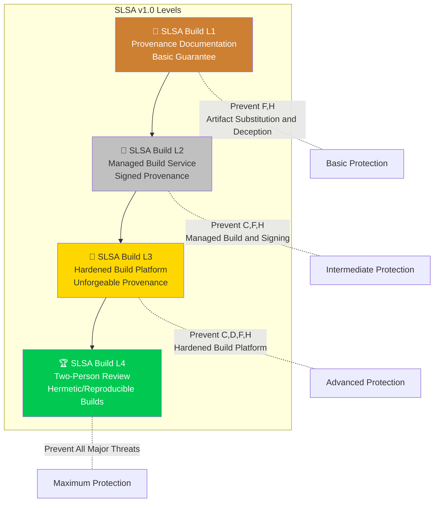
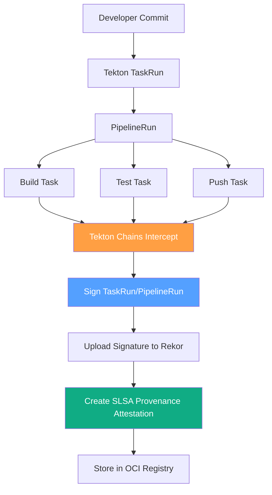

> **Production Environment Security Tips**
>
> This document contains directly executable operations commands. Before executing, confirm: whether the target cluster and Namespace are correct; whether you have sufficient RBAC permissions; whether you have verified in a non-production environment. Command risk levels are marked: 🔴 High risk (may cause data loss or service interruption), 🟡 Medium risk (modifies cluster state, but usually reversible), 🟢 Low risk/read-only (information collection, no side effects).


# SLSA Levels and Implementation

> SLSA (Supply chain Levels for Software Artifacts) is an industry framework for systematically protecting software supply chains, helping organizations defend against build process tampering and artifact integrity attacks through progressive level requirements.

---

<!-- chunk: Table of Contents -->## Table of Contents

1. [SLSA Framework Overview](#1-slsa-framework-overview)
2. [SLSA Levels Explained L1-L4](#2-slsa-levels-explained-l1-l4)
3. [Build Provenance](#3-build-provenance)
4. [Source Integrity](#4-source-integrity)
5. [Hermetic Builds](#5-hermetic-builds)
6. [Reproducible Builds](#6-reproducible-builds)
7. [GitHub Actions Implementation Guide](#7-github-actions-implementation-guide)
8. [Tekton Chains Implementation Guide](#8-tekton-chains-implementation-guide)
9. [SLSA Provenance Verification](#9-slsa-provenance-verification)
10. [SLSA Policy Enforcement](#10-slsa-policy-enforcement)
11. [Organization-level SLSA Implementation Path](#11-organization-level-slsa-implementation-path)
12. [SLSA v1.0 New Features](#12-slsa-v10-new-features)

---

<!-- chunk: 1. SLSA Framework Overview -->## 1. SLSA Framework Overview

## 1.1 SLSA Design Philosophy

SLSA (pronounced "salsa") is a supply chain security framework proposed by Google in 2021 and open-sourced to OpenSSF for maintenance. Its core philosophy is:

```
SLSA Core Question:
"How can I be confident that this software artifact really comes from
the declared source code and that the build process was not tampered with?"

Answer Approach:
Through verifiable, machine-readable provenance proof
```

```mermaid
graph LR
    Source[Source Code\n(Commit Hash)] --> Build[Build System\n(Verified Builder)]
    Build --> Artifact[Artifact\n(Signed + Provenance)]
    
    User[User/Consumer] --> Verify{Verify Provenance}
    Verify --> |"Proof: Artifact comes from\nspecified source and builder"| Trust[Trust Artifact]
    Verify --> |"Cannot prove"| Reject[Reject Artifact]
    
    Artifact --> Verify
    Source --> Verify
    Build --> Verify
```

## 1.2 Threats Defended by SLSA

```
SLSA Defense Matrix (SLSA v1.0):

Threat Type                            L1   L2   L3   L4
─────────────────────────────────────────────────────────
A: Commit malicious code               ❌   ❌   ~    ✅
B: Modify source code (outside repo)   ❌   ❌   ~    ✅
C: Inject malicious content in build   ❌   ✅   ✅   ✅
D: Use malicious build platform        ❌   ❌   ✅   ✅
E: Use malicious dependencies          ❌   ❌   ~    ~
F: Upload non-build artifacts          ❌   ✅   ✅   ✅
G: Corrupt artifacts in storage        ❌   ❌   ❌   ✅
H: Deceive consumers to use malicious  ❌   ✅   ✅   ✅

✅ = Complete defense  ~ = Partial defense  ❌ = No defense
```

## 1.3 SLSA v1.0 Architecture

```
SLSA v1.0 Core Concepts:

Build Definition:
  ─ External Parameters (externalParameters): User-specified build inputs
  ─ Resolved Dependencies (resolvedDependencies): Actual dependencies used and their versions

Run Details:
  ─ Builder (builder): Identifier of system executing the build
  ─ Metadata (metadata): Build invocation ID, time, etc.
  ─ Byproducts (byproducts): Build byproducts (logs, etc.)

Provenance Statement:
  ─ Subject (subject): Artifact produced by build
  ─ Predicate (predicate): Build information (BuildDefinition + RunDetails)
```

---

<!-- chunk: 2. SLSA Levels Explained L1-L4 -->## 2. SLSA Levels Explained L1-L4

## 2.1 Overview



## 2.2 SLSA Build L1 Explained

**Requirements Overview:** Provide basic build provenance proving artifact originates from specific source code.

```
SLSA L1 Requirements:

Build:
  ✅ Scripted Build - Build process must be entirely scripted, no manual steps
  ✅ Provenance Documentation - Provide machine-readable provenance document

Provenance Quality Requirements:
  ✅ Format: Comply with SLSA provenance format (v0.1 or v1.0)
  ✅ Content: Include builder identification and source code reference
  ❌ Signature: Not required (required from L2 onwards)
  ❌ Unforgeable: Not required

Defense Capabilities:
  ─ Prevent unintended artifact substitution (verifiable through provenance)
  ─ Basic build transparency

Applicable Scenarios:
  ─ Internal tools and projects
  ─ Compliance baseline requirements
  ─ Organizations beginning their supply chain security journey
```

**L1 Implementation Example:**

```yaml
# L1: Minimal provenance generation
name: SLSA L1 Build

on:
  push:
    tags: ['v*']

jobs:
  build:
    runs-on: ubuntu-latest
    steps:
      - uses: actions/checkout@v4
      
      - name: Build
        id: build
        run: |
          make build
          sha256sum ./dist/myapp > ./dist/myapp.sha256
      
      - name: Generate L1 Provenance
        run: |
          cat > provenance.json << EOF
          {
            "_type": "https://in-toto.io/Statement/v0.1",
            "predicateType": "https://slsa.dev/provenance/v1",
            "subject": [{
              "name": "myapp",
              "digest": {
                "sha256": "$(sha256sum ./dist/myapp | awk '{print $1}')"
              }
            }],
            "predicate": {
              "buildDefinition": {
                "buildType": "https://github.com/actions/runner@v2",
                "externalParameters": {
                  "workflow": "${{ github.workflow }}",
                  "ref": "${{ github.ref }}"
                }
              },
              "runDetails": {
                "builder": {
                  "id": "https://github.com/actions/runner"
                },
                "metadata": {
                  "invocationID": "${{ github.run_id }}/${{ github.run_attempt }}",
                  "startedOn": "$(date -u +%Y-%m-%dT%H:%M:%SZ)"
                }
              }
            }
          }
          EOF
      
      - name: Upload artifacts
        uses: actions/upload-artifact@v4
        with:
          name: myapp-${{ github.ref_name }}
          path: |
            ./dist/myapp
            ./dist/myapp.sha256
            ./provenance.json
```

## 2.3 SLSA Build L2 Explained

**Requirements Overview:** Use managed build services where provenance is generated and signed by the build service, preventing tampering.

```
SLSA L2 Additional Requirements (on top of L1):

Build:
  ✅ Managed Build Service - Must use GitHub Actions/GitLab CI/CircleCI, etc.
  ✅ Provenance Generated by Build Service - Cannot be generated by user code

Provenance Quality Requirements:
  ✅ Non-forgeable - Builder cannot forge its own provenance
  ✅ Signed - Provenance must be signed
  ✅ From Managed Platform - Proof of using managed build service

Key Difference (vs L1):
  L1: User generates and may forge provenance
  L2: Managed platform generates and user cannot forge

Defense Threat C: Prevent injecting malicious content in build
```

**L2 Using SLSA GitHub Generator:**

```yaml
# L2: Using official SLSA GitHub Generator
name: SLSA L2 Build

on:
  push:
    tags: ['v*']

permissions:
  contents: read
  id-token: write  # For OIDC token

jobs:
  # 1. Build binaries
  build:
    runs-on: ubuntu-latest
    outputs:
      hashes: ${{ steps.hash.outputs.hashes }}
    steps:
      - uses: actions/checkout@b4ffde65f46336ab88eb53be808477a3936bae11
      
      - name: Build binary
        run: |
          make build
          # Create dist directory
          mkdir -p dist
          cp ./bin/myapp dist/
      
      - name: Calculate hashes
        id: hash
        run: |
          cd dist
          sha256sum myapp > SHA256SUMS
          echo "hashes=$(cat SHA256SUMS | base64 -w0)" >> $GITHUB_OUTPUT
      
      - uses: actions/upload-artifact@c7d193f32edcb7bfad88892161225aeda64e9392
        with:
          name: binary
          path: dist/

  # 2. SLSA provenance generation (generated by SLSA Generator, unforgeable)
  provenance:
    needs: [build]
    permissions:
      actions: read
      id-token: write
      contents: write
    uses: slsa-framework/slsa-github-generator/.github/workflows/generator_generic_slsa3.yml@v2.0.0
    with:
      base64-subjects: "${{ needs.build.outputs.hashes }}"
      upload-assets: true  # Upload to GitHub Release

  # 3. Publish to GitHub Release
  release:
    needs: [build, provenance]
    runs-on: ubuntu-latest
    permissions:
      contents: write
    steps:
      - uses: actions/download-artifact@7a1cd3216ca9260cd8022db641d960b1db4d1be4
        with:
          name: binary
      
      - name: Release
        uses: softprops/action-gh-release@9d7c94cfd0a1f3ed45544c887983e9fa900f0564
        with:
          files: |
            myapp
            SHA256SUMS
```

## 2.4 SLSA Build L3 Explained

**Requirements Overview:** Hardened build platform providing unforgeable provenance even platform admins cannot forge.

```
SLSA L3 Additional Requirements (on top of L2):

Build:
  ✅ Hardened Build Platform - Build platform itself is security-hardened
  ✅ Unforgeable Provenance - Even platform administrators cannot forge
  ✅ Builder Cannot Access Signing Keys - Keys managed by Sigstore/OIDC

Provenance Quality Requirements:
  ✅ All Dependencies Fixed - Use commit hash instead of tags
  ✅ Complete Build Parameters - All parameters affecting build are recorded
  ✅ Immutable Provenance - Recorded in transparency log (Rekor)

Key Difference (vs L2):
  L2: Managed service generates but platform can be compromised
  L3: Hardened platform, cannot forge provenance even if attacked

Defense Threat D: Prevent using malicious build platform
```

**L3 Container Image Build:**

```yaml
# L3: Container image SLSA provenance generation
name: SLSA L3 Container Build

on:
  push:
    tags: ['v*']

permissions:
  contents: read
  packages: write
  id-token: write  # Required for OIDC keyless signing

env:
  REGISTRY: ghcr.io
  IMAGE_NAME: ${{ github.repository }}

jobs:
  # Container image SLSA L3 provenance
  build-and-provenance:
    permissions:
      contents: read
      packages: write
      id-token: write
    uses: slsa-framework/slsa-github-generator/.github/workflows/generator_container_slsa3.yml@v2.0.0
    with:
      image: ghcr.io/${{ github.repository }}
      digest: ${{ needs.build.outputs.digest }}
      registry-username: ${{ github.actor }}
    secrets:
      registry-password: ${{ secrets.GITHUB_TOKEN }}

  # Separate build step (before uses workflow call)
  build:
    runs-on: ubuntu-latest
    permissions:
      contents: read
      packages: write
    outputs:
      image: ${{ steps.image.outputs.image }}
      digest: ${{ steps.build.outputs.digest }}
    steps:
      - uses: actions/checkout@b4ffde65f46336ab88eb53be808477a3936bae11
      
      - name: Setup Docker Buildx
        uses: docker/setup-buildx-action@f95db51fddba0c2d1ec667646a06c2ce06100226
      
      - name: Login to GHCR
        uses: docker/login-action@343f7c4344506bcbf9b4de18042ae17996df046d
        with:
          registry: ${{ env.REGISTRY }}
          username: ${{ github.actor }}
          password: ${{ secrets.GITHUB_TOKEN }}
      
      - name: Extract metadata
        id: meta
        uses: docker/metadata-action@96383f45573cb7f253c731d3b3ab81c87ef81934
        with:
          images: ${{ env.REGISTRY }}/${{ env.IMAGE_NAME }}
          tags: |
            type=semver,pattern={{version}}
            type=sha
      
      - name: Build and push
        id: build
        uses: docker/build-push-action@0565240e2d4ab88bba5387d719585280857ece09
        with:
          context: .
          push: true
          tags: ${{ steps.meta.outputs.tags }}
          labels: ${{ steps.meta.outputs.labels }}
          # Important: Fix all base images to SHA
          # Use FROM ubuntu@sha256:xxx in Dockerfile
          provenance: mode=max  # Generate maximum provenance info
          sbom: true           # Include SBOM
      
      - name: Set image output
        id: image
        run: |
          echo "image=${{ env.REGISTRY }}/${{ env.IMAGE_NAME }}" >> $GITHUB_OUTPUT
```

## 2.5 SLSA Build L4 Explained

**Requirements Overview:** Highest level guarantee requiring hermetic builds, reproducible builds, and two-person review.

```
SLSA L4 Additional Requirements (on top of L3):

Source Requirements:
  ✅ Two-Person Review - All code changes must be reviewed by at least 2 people
  ✅ Retain History - Cannot modify commit history

Build Requirements:
  ✅ Hermetic Build - Build process disallows network access
  ✅ Reproducible Build - Same input produces exactly same output
  ✅ Build Provenance Must Meet All Above Requirements

Verification Requirements:
  ✅ Consumers Must Verify Provenance

Challenges Reaching L4:
  ─ Hermetic builds require pre-fetching all dependencies
  ─ Reproducible builds need to eliminate timestamps, randomness, etc.
  ─ Requires specialized build system support (e.g., Bazel)

Build Systems Currently Supporting L4:
  ─ Google Cloud Build (partial)
  ─ Bazel Remote Execution
  ─ Custom build systems
```

---

<!-- chunk: 3. Build Provenance -->## 3. Build Provenance

## 3.1 Provenance Format Specification

```json
// SLSA v1.0 provenance format complete example
{
  "_type": "https://in-toto.io/Statement/v1",
  "subject": [
    {
      "name": "pkg:docker/myorg/myapp@v1.2.3",
      "digest": {
        "sha256": "9f86d081884c7d659a2feaa0c55ad015a3bf4f1b2b0b822cd15d6c15b0f00a08"
      }
    },
    {
      "name": "myapp-linux-amd64",
      "digest": {
        "sha256": "abc123def456789012345678901234567890123456789012345678901234567890"
      }
    }
  ],
  "predicateType": "https://slsa.dev/provenance/v1",
  "predicate": {
    "buildDefinition": {
      "buildType": "https://github.com/slsa-framework/slsa-github-generator/container@v1",
      "externalParameters": {
        "workflow": {
          "ref": "refs/tags/v1.2.3",
          "repository": "https://github.com/myorg/myapp",
          "path": ".github/workflows/release.yml"
        }
      },
      "internalParameters": {
        "github": {
          "event_name": "push",
          "repository_id": "12345678",
          "repository_owner_id": "87654321"
        }
      },
      "resolvedDependencies": [
        {
          "uri": "git+https://github.com/myorg/myapp@refs/tags/v1.2.3",
          "digest": {
            "gitCommit": "abc123def456789012345678901234567890123456"
          }
        },
        {
          "uri": "https://github.com/actions/checkout@v4",
          "digest": {
            "gitCommit": "b4ffde65f46336ab88eb53be808477a3936bae11"
          }
        }
      ]
    },
    "runDetails": {
      "builder": {
        "id": "https://github.com/slsa-framework/slsa-github-generator/.github/workflows/generator_container_slsa3.yml@refs/tags/v2.0.0",
        "version": {
          "slsa-github-generator": "2.0.0"
        },
        "builderDependencies": [
          {
            "uri": "https://github.com/sigstore/cosign",
            "digest": {
              "sha256": "..."
            }
          }
        ]
      },
      "metadata": {
        "invocationID": "https://github.com/myorg/myapp/actions/runs/12345678/attempts/1",
        "startedOn": "2024-01-15T10:00:00Z",
        "finishedOn": "2024-01-15T10:05:30Z"
      },
      "byproducts": [
        {
          "name": "build-log",
          "uri": "https://github.com/myorg/myapp/actions/runs/12345678"
        }
      ]
    }
  }
}
```

## 3.2 in-toto Attestation Framework

in-toto is the underlying framework for SLSA provenance, providing universal supply chain integrity attestation mechanisms.

```python
#!/usr/bin/env python3
"""in-toto provenance generation example"""

# pip install in-toto

import json
from datetime import datetime, timezone

def generate_slsa_provenance(
    artifact_name: str,
    artifact_sha256: str,
    source_repo: str,
    source_commit: str,
    workflow_path: str,
    run_id: str,
    builder_id: str
) -> dict:
    """Generate SLSA v1.0 compliant provenance document"""
    
    now = datetime.now(timezone.utc).isoformat()
    
    provenance = {
        "_type": "https://in-toto.io/Statement/v1",
        "subject": [
            {
                "name": artifact_name,
                "digest": {
                    "sha256": artifact_sha256
                }
            }
        ],
        "predicateType": "https://slsa.dev/provenance/v1",
        "predicate": {
            "buildDefinition": {
                "buildType": "https://github.com/actions/runner@v2",
                "externalParameters": {
                    "workflow": {
                        "ref": f"refs/heads/main",
                        "repository": source_repo,
                        "path": workflow_path
                    }
                },
                "resolvedDependencies": [
                    {
                        "uri": f"git+{source_repo}@refs/heads/main",
                        "digest": {
                            "gitCommit": source_commit
                        }
                    }
                ]
            },
            "runDetails": {
                "builder": {
                    "id": builder_id
                },
                "metadata": {
                    "invocationID": run_id,
                    "startedOn": now,
                    "finishedOn": now
                }
            }
        }
    }
    
    return provenance


# Verify SLSA provenance
def verify_provenance_fields(provenance: dict) -> list:
    """Verify required fields in provenance document"""
    issues = []
    
    # Check subject
    subjects = provenance.get("subject", [])
    if not subjects:
        issues.append("Missing 'subject' field")
    else:
        for s in subjects:
            if not s.get("name"):
                issues.append("Subject missing 'name' field")
            if not s.get("digest"):
                issues.append("Subject missing 'digest' field")
            else:
                if not any(k in s["digest"] for k in ["sha256", "sha512", "gitCommit"]):
                    issues.append("Subject digest must have sha256, sha512, or gitCommit")
    
    # Check predicateType
    if provenance.get("predicateType") not in [
        "https://slsa.dev/provenance/v0.1",
        "https://slsa.dev/provenance/v0.2",
        "https://slsa.dev/provenance/v1"
    ]:
        issues.append("Invalid or missing predicateType")
    
    # Check predicate
    predicate = provenance.get("predicate", {})
    build_def = predicate.get("buildDefinition", {})
    
    if not build_def.get("buildType"):
        issues.append("Missing buildDefinition.buildType")
    
    run_details = predicate.get("runDetails", {})
    builder = run_details.get("builder", {})
    
    if not builder.get("id"):
        issues.append("Missing runDetails.builder.id")
    
    metadata = run_details.get("metadata", {})
    if not metadata.get("invocationID"):
        issues.append("Missing runDetails.metadata.invocationID")
    
    return issues
```

## 3.3 Build Parameter Completeness

```bash
#!/bin/bash
# provenance-capture.sh
# Completely capture build parameters for provenance recording

set -euo pipefail

# Capture all parameters affecting build
capture_build_context() {
  local OUTPUT_FILE="${1:-build-context.json}"
  
  # 1. Source information
  GIT_COMMIT=$(git rev-parse HEAD)
  GIT_REF=$(git symbolic-ref HEAD 2>/dev/null || echo "detached")
  GIT_REPO=$(git remote get-url origin 2>/dev/null || echo "local")
  GIT_DIRTY=$(git diff --quiet && echo "false" || echo "true")
  
  # 2. Build environment information
  BUILD_DATE=$(date -u +%Y-%m-%dT%H:%M:%SZ)
  GO_VERSION=$(go version 2>/dev/null | awk '{print $3}' || echo "unknown")
  NODE_VERSION=$(node --version 2>/dev/null || echo "unknown")
  PYTHON_VERSION=$(python3 --version 2>/dev/null | awk '{print $2}' || echo "unknown")
  OS_INFO=$(uname -a)
  
  # 3. Dependency lock information
  GO_SUM_HASH=""
  if [ -f "go.sum" ]; then
    GO_SUM_HASH=$(sha256sum go.sum | awk '{print $1}')
  fi
  
  NPM_LOCK_HASH=""
  if [ -f "package-lock.json" ]; then
    NPM_LOCK_HASH=$(sha256sum package-lock.json | awk '{print $1}')
  fi
  
  # 4. Generate context document
  cat > "$OUTPUT_FILE" << EOF
{
  "source": {
    "repository": "${GIT_REPO}",
    "commit": "${GIT_COMMIT}",
    "ref": "${GIT_REF}",
    "isDirty": ${GIT_DIRTY}
  },
  "build": {
    "timestamp": "${BUILD_DATE}",
    "hostname": "$(hostname -f 2>/dev/null || hostname)",
    "tools": {
      "go": "${GO_VERSION}",
      "node": "${NODE_VERSION}",
      "python": "${PYTHON_VERSION}"
    },
    "os": "${OS_INFO}"
  },
  "dependencies": {
    "goSumHash": "${GO_SUM_HASH}",
    "npmLockHash": "${NPM_LOCK_HASH}"
  }
}
EOF

  echo "Build context captured: $OUTPUT_FILE"
  cat "$OUTPUT_FILE"
}

capture_build_context "build-context.json"
```

---

<!-- chunk: 4. Source Integrity -->## 4. Source Integrity

## 4.1 Git Commit Integrity Protection

``` bash
# 🟢 Low risk: read-only/information collection, usually no side effects
# Source integrity protection measures

# ============ 1. Enforce GPG Signing ============

# Generate GPG key
gpg --full-generate-key
# Recommended: RSA 4096-bit, 1-year validity

# Configure Git signing
GPG_KEY_ID=$(gpg --list-secret-keys --keyid-format LONG | \
  grep "sec" | awk '{print $2}' | cut -d/ -f2 | head -1)

git config --global user.signingkey "${GPG_KEY_ID}"
git config --global commit.gpgsign true
git config --global tag.gpgsign true

# Verify commit signatures
git log --show-signature --format="%H %GK %GS" HEAD~5..HEAD

# Verify specific commit
git verify-commit abc123def456

# ============ 2. GitHub Enforce Signed Commits ============

# Configure branch protection via GitHub CLI
gh api -X PUT repos/{owner}/{repo}/branches/main/protection \
  -H "Accept: application/vnd.github+json" \
  --input - << 'EOF'
{
  "required_status_checks": null,
  "enforce_admins": true,
  "required_pull_request_reviews": {
    "required_approving_review_count": 2,
    "dismiss_stale_reviews": true,
    "require_code_owner_reviews": true,
    "require_last_push_approval": true
  },
  "restrictions": null,
  "required_linear_history": true,
  "allow_force_pushes": false,
  "allow_deletions": false,
  "block_creations": false,
  "required_conversation_resolution": true,
  "required_signatures": true
}
EOF

# ============ 3. Code Owners CODEOWNERS ============

cat > .github/CODEOWNERS << 'EOF'
# Global owners
* @security-team

# Critical files require security team review
.github/workflows/ @security-team @devops-team
Dockerfile @security-team @platform-team
go.mod @security-team
go.sum @security-team
package.json @security-team
package-lock.json @security-team

# Infrastructure code
terraform/ @security-team @platform-team
kubernetes/ @security-team @platform-team
EOF
```
## 4.2 Source Audit Trail

```python
#!/usr/bin/env python3
"""Source code commit security analysis"""

import subprocess
import json
import re
from typing import List, Dict

def analyze_git_security(repo_path: str = ".") -> Dict:
    """Analyze Git repository security status"""
    results = {
        "unsigned_commits": [],
        "force_push_history": [],
        "large_commits": [],
        "suspicious_patterns": []
    }
    
    # 1. Check for unsigned commits (last 100)
    cmd = ["git", "log", "--format=%H %GK %G?", "-100"]
    output = subprocess.check_output(cmd, cwd=repo_path).decode()
    
    for line in output.strip().split('\n'):
        parts = line.split()
        if len(parts) >= 3:
            commit_hash = parts[0]
            key_id = parts[1] if len(parts) > 1 else ""
            sign_status = parts[2] if len(parts) > 2 else ""
            
            # G = Good, B = Bad, U = Unknown, X = Expired, Y = Good untrusted, N = No sig
            if sign_status in ["N", "U", ""]:
                results["unsigned_commits"].append({
                    "hash": commit_hash[:12],
                    "status": "unsigned" if sign_status == "N" else "unknown_key"
                })
    
    # 2. Check for large commits (possible binary file injection)
    cmd = ["git", "log", "--format=%H", "--diff-filter=A", "-100"]
    output = subprocess.check_output(cmd, cwd=repo_path).decode()
    
    for commit_hash in output.strip().split('\n')[:20]:
        if not commit_hash:
            continue
        cmd = ["git", "diff-tree", "--no-commit-id", "-r", 
               "--name-only", "--diff-filter=A", commit_hash]
        files = subprocess.check_output(cmd, cwd=repo_path).decode().strip().split('\n')
        
        for f in files:
            if f.endswith(('.exe', '.dll', '.so', '.dylib', '.jar', '.war', '.bin')):
                results["large_commits"].append({
                    "commit": commit_hash[:12],
                    "file": f,
                    "concern": "Binary file added"
                })
    
    # 3. Check for suspicious patterns (keys, credentials)
    secret_patterns = [
        (r'(?i)(password|passwd|pwd)\s*=\s*["\'][^"\']+["\']', "Password pattern"),
        (r'(?i)(api[_-]?key|apikey)\s*=\s*["\'][^"\']+["\']', "API key pattern"),
        (r'AKIA[0-9A-Z]{16}', "AWS access key"),
        (r'-----BEGIN (RSA |EC )?PRIVATE KEY-----', "Private key"),
    ]
    
    for pattern, description in secret_patterns:
        cmd = ["git", "log", "-p", "--all", "--format=", "-100", "--", "*.yaml", "*.yml", "*.json", "*.env"]
        try:
            output = subprocess.check_output(cmd, cwd=repo_path, stderr=subprocess.DEVNULL).decode(errors='replace')
            
            if re.search(pattern, output):
                results["suspicious_patterns"].append({
                    "pattern": description,
                    "action_required": "Review history for potential credential exposure"
                })
        except subprocess.CalledProcessError:
            pass
    
    return results


def print_security_report(results: Dict) -> None:
    """Print security analysis report"""
    print("\n=== Source Integrity Analysis Report ===\n")
    
    unsigned = results["unsigned_commits"]
    print(f"Unsigned commits: {len(unsigned)}")
    if unsigned[:5]:
        for c in unsigned[:5]:
            print(f"  - {c['hash']} ({c['status']})")
    
    binaries = results["large_commits"]
    if binaries:
        print(f"\n⚠️  Binary file commits: {len(binaries)}")
        for b in binaries:
            print(f"  - {b['commit']}: {b['file']} ({b['concern']})")
    
    secrets = results["suspicious_patterns"]
    if secrets:
        print(f"\n🚨 Suspicious patterns: {len(secrets)}")
        for s in secrets:
            print(f"  - {s['pattern']}: {s['action_required']}")
    
    if not unsigned and not binaries and not secrets:
        print("✅ Source integrity checks passed")


if __name__ == "__main__":
    results = analyze_git_security()
    print_security_report(results)
```

---

<!-- chunk: 5. Hermetic Builds -->## 5. Hermetic Builds

## 5.1 Hermetic Build Principles

```
Hermetic Builds Principles:

Definition: Build process disallows access to external network or any
           external resources in the filesystem
Goal: Build results depend only on explicitly declared inputs

Prohibited Operations:
  ❌ Dynamically download dependencies at build time (npm install, go get, pip install)
  ❌ Fetch build scripts or tools from the internet
  ❌ Access external APIs or services
  ❌ Use current time as part of version number

Required Preparation:
  ✅ All dependencies pre-downloaded and fixed to specific hash
  ✅ Build tool versions fixed
  ✅ Network isolation
  ✅ Filesystem read-only (except output directory)
```

## 5.2 Implementing Hermetic Go Build

```dockerfile
# Hermetic Go Build Dockerfile

# ====== Stage 1: Dependency Pre-fetching (Network Access Stage) ======
FROM golang:1.21.6-alpine3.19@sha256:2523a6f68a0f515fe251aad40b18545155101053da6ae8a1db05b51c7f37e42 AS deps

WORKDIR /build

# Only copy dependency files
COPY go.mod go.sum ./

# Download and verify all dependencies (with network access)
RUN go mod download -x && go mod verify

# ====== Stage 2: Hermetic Build (No Network Access) ======
FROM golang:1.21.6-alpine3.19@sha256:2523a6f68a0f515fe251aad40b18545155101053da6ae8a1db05b51c7f37e42 AS builder

WORKDIR /build

# Copy downloaded dependencies from deps stage (offline)
COPY --from=deps /root/go/pkg/mod /root/go/pkg/mod
COPY --from=deps /build/go.sum /build/go.sum

# Copy source code
COPY . .

# Hermetic build: disallow network access
# -mod=readonly ensures go.sum is not modified
# GOFLAGS=-mod=readonly prevents any downloads
RUN CGO_ENABLED=0 \
    GOOS=linux \
    GOARCH=amd64 \
    GOFLAGS="-mod=readonly -trimpath" \
    GONOSUMDB="*" \
    GOPROXY="off" \  # Completely disable proxy (hermetic build)
    go build \
    -ldflags="-s -w \
      -X main.version=$(cat VERSION) \
      -X main.commit=$(git rev-parse --short HEAD 2>/dev/null || echo 'unknown')" \
    -o /build/app \
    ./cmd/server

# Verify build result
RUN file /build/app && \
    /build/app --version

# ====== Stage 3: Minimize Runtime Image ======
FROM scratch

COPY --from=builder /etc/ssl/certs/ca-certificates.crt /etc/ssl/certs/
COPY --from=builder /etc/passwd /etc/passwd
COPY --from=builder /build/app /app

USER 65534:65534
EXPOSE 8080
ENTRYPOINT ["/app"]
```

## 5.3 Bazel Hermetic Build

```python
# BUILD.bazel - Bazel hermetic build configuration
# Bazel natively supports hermetic and reproducible builds

load("@io_bazel_rules_go//go:def.bzl", "go_binary", "go_library")
load("@rules_oci//oci:defs.bzl", "oci_image", "oci_push")

# Define Go binary target
go_binary(
    name = "myapp",
    embed = [":myapp_lib"],
    gc_linkopts = ["-s", "-w"],  # Strip debug symbols
    pure = "on",  # CGO disabled (hermetic build requirement)
    static = "on",  # Static linking
)

# Define OCI image (use fixed base image digest)
oci_image(
    name = "myapp_image",
    base = "@distroless_base",  # Fixed to SHA in WORKSPACE
    entrypoint = ["/myapp"],
    tars = [":myapp_layer"],
)

# Hermetic dependency declaration in WORKSPACE
# go_deps use fixed versions
```

```starlark
# WORKSPACE.bazel
load("@bazel_tools//tools/build_defs/repo:http.bzl", "http_archive")

# Fixed to specific SHA (hermetic requirement)
http_archive(
    name = "io_bazel_rules_go",
    sha256 = "6b65cb7917b4d1709f9410ffe00ecf3e160edf674b78c54a894471320862184f",
    urls = [
        "https://mirror.bazel.build/github.com/bazelbuild/rules_go/releases/download/v0.39.1/rules_go-v0.39.1.zip",
        "https://github.com/bazelbuild/rules_go/releases/download/v0.39.1/rules_go-v0.39.1.zip",
    ],
)

# Base image fixed to SHA (not using tag)
http_file(
    name = "distroless_base",
    url = "https://gcr.io/distroless/base@sha256:73deaaf6a207c1a33850257ba74e0f196bc418636abb89986a1af35e7dc90c4b",
    sha256 = "73deaaf6a207c1a33850257ba74e0f196bc418636abb89986a1af35e7dc90c4b",
)
```

## 5.4 Network-Isolated Build Configuration

```yaml
# Kubernetes Job - Hermetic Build (No Network Access)
apiVersion: batch/v1
kind: Job
metadata:
  name: hermetic-build-$(date +%s)
  labels:
    app: builder
    build-type: hermetic
spec:
  template:
    metadata:
      annotations:
        # Record build metadata for provenance
        build.slsa.dev/hermetic: "true"
    spec:
      # Disable service account token mounting (reduce network access)
      automountServiceAccountToken: false
      
      # Security context
      securityContext:
        runAsNonRoot: true
        runAsUser: 65534
        seccompProfile:
          type: RuntimeDefault
      
      # Use pre-pulled images (not pulled from network)
      imagePullPolicy: Never
      
      initContainers:
        # Pre-load dependencies from cache
        - name: load-deps
          image: "internal.registry.io/build-cache:latest"
          command: ["cp", "-r", "/cache/go", "/workspace/go-cache"]
          volumeMounts:
            - name: workspace
              mountPath: /workspace
      
      containers:
        - name: builder
          image: "internal.registry.io/go-builder:1.21.6"
          
          # Complete network isolation
          # Further restricted in NetworkPolicy
          
          securityContext:
            allowPrivilegeEscalation: false
            readOnlyRootFilesystem: true
            capabilities:
              drop: [ALL]
          
          env:
            # Disable Go proxy (hermetic build)
            - name: GOPROXY
              value: "off"
            - name: GONOSUMDB
              value: "*"
            - name: GOFLAGS
              value: "-mod=readonly"
            # Use cached dependencies
            - name: GOPATH
              value: "/workspace/gopath"
            - name: GOCACHE
              value: "/workspace/gocache"
          
          command:
            - /bin/sh
            - -c
            - |
              set -euo pipefail
              cd /workspace/source
              go build -o /workspace/output/myapp ./cmd/server
              sha256sum /workspace/output/myapp > /workspace/output/myapp.sha256
          
          volumeMounts:
            - name: workspace
              mountPath: /workspace
            - name: source
              mountPath: /workspace/source
              readOnly: true
            - name: output
              mountPath: /workspace/output
      
      volumes:
        - name: workspace
          emptyDir: {}
        - name: source
          persistentVolumeClaim:
            claimName: build-source-pvc
        - name: output
          persistentVolumeClaim:
            claimName: build-output-pvc
      
      restartPolicy: Never
  
  backoffLimit: 1
```

---

<!-- chunk: 6. Reproducible Builds -->## 6. Reproducible Builds

## 6.1 Reproducible Build Basics

```
Reproducible Builds (Reproducible Builds):

Definition: Given same input, anyone building anywhere produces exactly same output
           (byte-level identical, sha256 hash completely identical)

Challenge Factors (Need to Eliminate):
  1. Timestamps - Build system embeds current time
  2. Randomness - Some tools use random numbers
  3. Path Information - Compiler embeds path in binary
  4. File Ordering - File system traversal order is non-deterministic
  5. Concurrency - Parallel build results may differ
  6. Environment Variables - Environment variables affect build results
  7. Versions - Build tool version differences

Go Reproducible Build Best Practices:
  ─ Use -trimpath to remove absolute paths
  ─ Set CGO_ENABLED=0
  ─ Fix GOOS, GOARCH
  ─ Use -mod=readonly
  ─ Fix Go version
```

## 6.2 Go Reproducible Build Implementation

```bash
#!/bin/bash
# reproducible-build.sh - Go reproducible build script

set -euo pipefail

VERSION="${VERSION:-$(cat VERSION 2>/dev/null || echo 'dev')}"
GIT_COMMIT="${GIT_COMMIT:-$(git rev-parse --short HEAD 2>/dev/null || echo 'unknown')}"

# Eliminate timestamp impact - use git commit time
GIT_DATE=$(git log -1 --format=%ct HEAD 2>/dev/null || echo "0")
SOURCE_DATE_EPOCH="${GIT_DATE}"

export SOURCE_DATE_EPOCH

# Reproducible build flags
LDFLAGS="-s -w"
LDFLAGS+=" -X main.version=${VERSION}"
LDFLAGS+=" -X main.commit=${GIT_COMMIT}"
# Note: Cannot embed build time, as this breaks reproducibility
# LDFLAGS+=" -X main.buildDate=$(date ...)" # Wrong!

BUILD_FLAGS=(
  "-trimpath"         # Remove absolute paths
  "-mod=readonly"     # Don't modify dependencies
  "-ldflags=${LDFLAGS}"
)

# Build
CGO_ENABLED=0 \
GOOS=linux \
GOARCH=amd64 \
GOVERSION="$(go version | awk '{print $3}')" \
go build "${BUILD_FLAGS[@]}" \
  -o "./dist/myapp-linux-amd64" \
  "./cmd/server"

# Calculate hash
sha256sum "./dist/myapp-linux-amd64" > "./dist/myapp-linux-amd64.sha256"

echo "Build complete!"
echo "Hash: $(cat ./dist/myapp-linux-amd64.sha256)"

# Verify reproducibility (rebuild and compare)
echo ""
echo "Verifying reproducibility..."

# Second build
CGO_ENABLED=0 \
GOOS=linux \
GOARCH=amd64 \
go build "${BUILD_FLAGS[@]}" \
  -o "./dist/myapp-linux-amd64-verify" \
  "./cmd/server"

# Compare
HASH1=$(sha256sum "./dist/myapp-linux-amd64" | awk '{print $1}')
HASH2=$(sha256sum "./dist/myapp-linux-amd64-verify" | awk '{print $1}')

if [ "${HASH1}" = "${HASH2}" ]; then
  echo "✅ Build is reproducible!"
  echo "  Hash: ${HASH1}"
else
  echo "❌ Build is not reproducible!"
  echo "  Build 1: ${HASH1}"
  echo "  Build 2: ${HASH2}"
  exit 1
fi
```

## 6.3 Docker Image Reproducible Build

```dockerfile
# Reproducible container image build

# Use SHA256 digest to fix base image (not tag)
FROM golang:1.21.6-alpine3.19@sha256:2523a6f68a0f515fe251aad40b18545155101053da6ae8a1db05b51c7f37e42 AS builder

# Use SOURCE_DATE_EPOCH to set file timestamps
ARG SOURCE_DATE_EPOCH=0

WORKDIR /build

# Fix APK package versions (if needed)
RUN apk add --no-cache \
  ca-certificates=20230506-r0 \
  tzdata=2023c-r1

COPY go.mod go.sum ./
RUN GOPROXY=off go mod download

COPY . .

# Reproducible build
RUN CGO_ENABLED=0 \
    GOOS=linux \
    GOARCH=amd64 \
    go build \
    -trimpath \
    -mod=readonly \
    -ldflags="-s -w" \
    -o /build/app \
    ./cmd/server

# Final image
FROM scratch

# Fix file timestamps for reproducibility
ARG SOURCE_DATE_EPOCH=0

COPY --from=builder /etc/ssl/certs/ca-certificates.crt /etc/ssl/certs/
COPY --from=builder /build/app /app

USER 65534:65534
ENTRYPOINT ["/app"]
```

``` bash
# 🟢 Low risk: read-only/information collection, usually no side effects
# Build reproducible image
SOURCE_DATE_EPOCH=$(git log -1 --format=%ct HEAD)

docker build \
  --build-arg "SOURCE_DATE_EPOCH=${SOURCE_DATE_EPOCH}" \
  --no-cache \  # Don't use cache for reproducibility
  --tag "myapp:v1.0.0" \
  .

# Get image digest
DIGEST=$(docker inspect --format='{{index .RepoDigests 0}}' myapp:v1.0.0 2>/dev/null || \
  docker images --no-trunc --format "{{.ID}}" myapp:v1.0.0 | head -1)

echo "Image digest: ${DIGEST}"

# Verify reproducibility
docker build \
  --build-arg "SOURCE_DATE_EPOCH=${SOURCE_DATE_EPOCH}" \
  --no-cache \
  --tag "myapp:v1.0.0-verify" \
  .

DIGEST2=$(docker images --no-trunc --format "{{.ID}}" myapp:v1.0.0-verify | head -1)

if [ "${DIGEST}" = "${DIGEST2}" ]; then
  echo "✅ Docker image build is reproducible!"
else
  echo "❌ Docker image is not reproducible"
  # Debug differences
  docker image inspect myapp:v1.0.0 --format '{{.RootFS.Layers}}' | tr ' ' '\n'
  docker image inspect myapp:v1.0.0-verify --format '{{.RootFS.Layers}}' | tr ' ' '\n'
fi
```
---

<!-- chunk: 7. GitHub Actions Implementation Guide -->## 7. GitHub Actions Implementation Guide

## 7.1 Complete SLSA L3 Workflow

```yaml
# .github/workflows/slsa-l3-release.yml
name: SLSA L3 Release Build

on:
  push:
    tags:
      - 'v[0-9]+.[0-9]+.[0-9]+'

permissions:
  contents: read

jobs:
  # ==========================================
  # 1. Pre-flight Security Checks
  # ==========================================
  pre-checks:
    runs-on: ubuntu-latest
    steps:
      - uses: actions/checkout@b4ffde65f46336ab88eb53be808477a3936bae11
        with:
          fetch-depth: 0
      
      # Verify tag is created from reviewed commit
      - name: Verify tag commit
        run: |
          TAG_COMMIT=$(git rev-list -n 1 ${{ github.ref_name }})
          echo "Building tag: ${{ github.ref_name }}"
          echo "Commit: ${TAG_COMMIT}"
          
          # Check commit is on main branch
          git branch -r --contains "${TAG_COMMIT}" | grep "origin/main" || {
            echo "ERROR: Tag commit is not on main branch!"
            exit 1
          }
      
      # Verify all Actions are pinned to SHA
      - name: Verify pinned actions
        run: |
          UNPINNED=$(grep -r "uses:" .github/workflows/ | \
            grep -v "@[a-f0-9]\{40\}" | \
            grep -v "^#" || true)
          
          if [ -n "$UNPINNED" ]; then
            echo "ERROR: Unpinned actions found:"
            echo "$UNPINNED"
            exit 1
          fi
          echo "✅ All actions pinned to commit SHAs"
  
  # ==========================================
  # 2. Build Multi-platform Binaries
  # ==========================================
  build:
    needs: pre-checks
    runs-on: ubuntu-latest
    permissions:
      contents: read
    outputs:
      hashes: ${{ steps.hash.outputs.hashes }}
      release-artifacts: ${{ steps.artifacts.outputs.paths }}
    
    steps:
      - uses: actions/checkout@b4ffde65f46336ab88eb53be808477a3936bae11
        with:
          # Ensure not checking out shallow clone (affects version info)
          fetch-depth: 0
      
      - name: Setup Go
        uses: actions/setup-go@0c52d547c9bc32b1aa3301fd7a9cb496313a4491
        with:
          go-version-file: 'go.mod'
          cache: true
      
      - name: Verify dependencies
        run: |
          go mod verify
          echo "✅ Go module checksums verified"
      
      - name: Build binaries
        env:
          VERSION: ${{ github.ref_name }}
          COMMIT: ${{ github.sha }}
        run: |
          mkdir -p dist
          
          PLATFORMS=(
            "linux/amd64"
            "linux/arm64"
            "darwin/amd64"
            "darwin/arm64"
            "windows/amd64"
          )
          
          for PLATFORM in "${PLATFORMS[@]}"; do
            OS="${PLATFORM%/*}"
            ARCH="${PLATFORM#*/}"
            OUTPUT="dist/myapp-${OS}-${ARCH}"
            [ "${OS}" = "windows" ] && OUTPUT="${OUTPUT}.exe"
            
            CGO_ENABLED=0 \
            GOOS="${OS}" \
            GOARCH="${ARCH}" \
            go build \
              -trimpath \
              -mod=readonly \
              -ldflags="-s -w -X main.version=${VERSION} -X main.commit=${COMMIT}" \
              -o "${OUTPUT}" \
              ./cmd/server
            
            echo "Built: ${OUTPUT}"
          done
          
          # Generate SHA256 checksums
          cd dist && sha256sum * > SHA256SUMS
      
      - name: Calculate hashes for SLSA
        id: hash
        run: |
          cd dist
          echo "hashes=$(sha256sum * | base64 -w0)" >> $GITHUB_OUTPUT
      
      - name: Store artifact paths
        id: artifacts
        run: |
          echo "paths=$(ls dist/ | tr '\n' ' ')" >> $GITHUB_OUTPUT
      
      - name: Upload build artifacts
        uses: actions/upload-artifact@c7d193f32edcb7bfad88892161225aeda64e9392
        with:
          name: build-artifacts-${{ github.sha }}
          path: dist/
          if-no-files-found: error
          retention-days: 5
  
  # ==========================================
  # 3. SLSA L3 Provenance Generation (Unforgeable)
  # ==========================================
  provenance:
    needs: [build]
    permissions:
      actions: read
      id-token: write
      contents: write
    # Use SLSA Generator - this workflow is controlled by SLSA Generator, unforgeable
    uses: slsa-framework/slsa-github-generator/.github/workflows/generator_generic_slsa3.yml@v2.0.0
    with:
      base64-subjects: "${{ needs.build.outputs.hashes }}"
      upload-assets: true
      compile-generator: true  # Compile generator from source (higher security)
  
  # ==========================================
  # 4. Container Image Build and SLSA Provenance
  # ==========================================
  container-build:
    needs: pre-checks
    runs-on: ubuntu-latest
    permissions:
      contents: read
      packages: write
      id-token: write
    outputs:
      image: ${{ steps.meta.outputs.tags }}
      digest: ${{ steps.build.outputs.digest }}
    
    steps:
      - uses: actions/checkout@b4ffde65f46336ab88eb53be808477a3936bae11
      
      - name: Setup Docker Buildx
        uses: docker/setup-buildx-action@f95db51fddba0c2d1ec667646a06c2ce06100226
      
      - name: Login to GHCR
        uses: docker/login-action@343f7c4344506bcbf9b4de18042ae17996df046d
        with:
          registry: ghcr.io
          username: ${{ github.actor }}
          password: ${{ secrets.GITHUB_TOKEN }}
      
      - name: Docker metadata
        id: meta
        uses: docker/metadata-action@96383f45573cb7f253c731d3b3ab81c87ef81934
        with:
          images: ghcr.io/${{ github.repository }}
          tags: |
            type=semver,pattern={{version}}
            type=semver,pattern={{major}}.{{minor}}
          labels: |
            org.opencontainers.image.vendor=MyCompany
            org.opencontainers.image.licenses=Apache-2.0
      
      - name: Build and push container
        id: build
        uses: docker/build-push-action@0565240e2d4ab88bba5387d719585280857ece09
        with:
          context: .
          push: true
          tags: ${{ steps.meta.outputs.tags }}
          labels: ${{ steps.meta.outputs.labels }}
          sbom: true
          provenance: mode=max
          cache-from: type=gha
          cache-to: type=gha,mode=max
          platforms: linux/amd64,linux/arm64
  
  container-provenance:
    needs: [container-build]
    permissions:
      actions: read
      id-token: write
      packages: write
    uses: slsa-framework/slsa-github-generator/.github/workflows/generator_container_slsa3.yml@v2.0.0
    with:
      image: ghcr.io/${{ github.repository }}
      digest: ${{ needs.container-build.outputs.digest }}
      registry-username: ${{ github.actor }}
    secrets:
      registry-password: ${{ secrets.GITHUB_TOKEN }}
  
  # ==========================================
  # 5. Final Release
  # ==========================================
  release:
    needs: [build, provenance, container-provenance]
    runs-on: ubuntu-latest
    permissions:
      contents: write
    
    steps:
      - name: Download artifacts
        uses: actions/download-artifact@7a1cd3216ca9260cd8022db641d960b1db4d1be4
        with:
          name: build-artifacts-${{ github.sha }}
          path: dist/
      
      - name: Create GitHub Release
        uses: softprops/action-gh-release@9d7c94cfd0a1f3ed45544c887983e9fa900f0564
        with:
          files: dist/*
          generate_release_notes: true
          body: |
            <!-- chunk: Release ${{ github.ref_name }} -->## Release ${{ github.ref_name }}
            
            #<!-- chunk: Supply Chain Security -->## Supply Chain Security
            - ✅ SLSA L3 Provenance available
            - ✅ Container image signed with Sigstore/Cosign
            - ✅ SBOM generated (CycloneDX format)
            
            #<!-- chunk: Verification -->## Verification
            ```bash
            # Verify binary provenance
            slsa-verifier verify-artifact myapp-linux-amd64 \
              --provenance-path myapp-linux-amd64.intoto.jsonl \
              --source-uri github.com/${{ github.repository }} \
              --source-tag ${{ github.ref_name }}
            
            # Verify container image
            cosign verify \
              --certificate-identity "https://github.com/${{ github.repository }}/.github/workflows/slsa-l3-release.yml@${{ github.ref }}" \
              --certificate-oidc-issuer "https://token.actions.githubusercontent.com" \
              ghcr.io/${{ github.repository }}:${{ github.ref_name }}
            ```
```

---

<!-- chunk: 8. Tekton Chains Implementation Guide -->## 8. Tekton Chains Implementation Guide

## 8.1 Tekton Chains Architecture



## 8.2 Tekton Chains Installation Configuration

> ⚠️ **🟡 Medium-risk Change** — Modifies cluster resource state, recommend --dry-run or diff first
> - `kubectl apply/create/replace`: Create/modify cluster resources
> - `kubectl edit/patch`: Modify running resources

``` bash
# 🟡 Medium risk: modifies cluster/resource state, confirm target, scope, and authorization before executing
# Install Tekton Pipelines
kubectl apply -f https://storage.googleapis.com/tekton-releases/pipeline/latest/release.yaml

# Install Tekton Chains
kubectl apply -f https://storage.googleapis.com/tekton-releases/chains/latest/release.yaml

# Configure Tekton Chains (signing and provenance)
kubectl patch configmap chains-config \
  -n tekton-chains \
  --type merge \
  -p '{
    "data": {
      "artifacts.taskrun.format": "slsa/v1",
      "artifacts.taskrun.storage": "oci",
      "artifacts.pipelinerun.format": "slsa/v1",
      "artifacts.pipelinerun.storage": "oci",
      "artifacts.oci.storage": "oci",
      "signers.x509.fulcio.address": "https://fulcio.sigstore.dev",
      "signers.x509.rekor.address": "https://rekor.sigstore.dev",
      "transparency.enabled": "true",
      "transparency.url": "https://rekor.sigstore.dev"
    }
  }'

# Configure Cosign key pair (or use OIDC keyless)
cosign generate-key-pair k8s://tekton-chains/signing-secrets

# Verify Chains installation
kubectl get pods -n tekton-chains
kubectl get configmap chains-config -n tekton-chains -o yaml
```
## 8.3 Tekton Pipeline Configuration

```yaml
# tekton-slsa-pipeline.yaml
apiVersion: tekton.dev/v1
kind: Pipeline
metadata:
  name: slsa-build-pipeline
  annotations:
    tekton.dev/displayName: "SLSA L2+ Build Pipeline"
spec:
  description: |
    Build pipeline that produces SLSA L2 provenance
    using Tekton Chains.
  
  params:
    - name: git-url
      type: string
      description: Git repository URL
    - name: git-revision
      type: string
      description: Git revision (commit/tag/branch)
    - name: image-name
      type: string
      description: Output container image name
    - name: image-tag
      type: string
      description: Output container image tag
  
  workspaces:
    - name: source
    - name: dockerconfig
      optional: true
  
  results:
    - name: IMAGE_URL
      value: $(tasks.build-image.results.IMAGE_URL)
    - name: IMAGE_DIGEST
      value: $(tasks.build-image.results.IMAGE_DIGEST)
    - name: CHAINS-GIT_COMMIT
      value: $(tasks.git-clone.results.commit)
    - name: CHAINS-GIT_URL
      value: $(tasks.git-clone.results.url)
  
  tasks:
    # Clone source code
    - name: git-clone
      taskRef:
        resolver: bundles
        params:
          - name: bundle
            value: gcr.io/tekton-releases/catalog/upstream/git-clone:0.9
          - name: name
            value: git-clone
          - name: kind
            value: task
      params:
        - name: url
          value: $(params.git-url)
        - name: revision
          value: $(params.git-revision)
      workspaces:
        - name: output
          workspace: source
    
    # Run tests
    - name: run-tests
      runAfter: [git-clone]
      taskRef:
        name: run-go-tests
      workspaces:
        - name: source
          workspace: source
    
    # Vulnerability scan (before build)
    - name: scan-deps
      runAfter: [git-clone]
      taskRef:
        name: trivy-scan
      params:
        - name: image
          value: aquasec/trivy:latest
        - name: scan-type
          value: fs
        - name: fail-on-severity
          value: "CRITICAL"
      workspaces:
        - name: source
          workspace: source
    
    # Build container image
    - name: build-image
      runAfter: [run-tests, scan-deps]
      taskRef:
        resolver: bundles
        params:
          - name: bundle
            value: gcr.io/tekton-releases/catalog/upstream/kaniko:0.6
          - name: name
            value: kaniko
          - name: kind
            value: task
      params:
        - name: IMAGE
          value: "$(params.image-name):$(params.image-tag)"
        - name: CONTEXT
          value: .
        - name: EXTRA_ARGS
          value:
            - "--cache=true"
            - "--cache-repo=$(params.image-name)/cache"
            - "--snapshot-mode=redo"
            - "--label=org.opencontainers.image.revision=$(tasks.git-clone.results.commit)"
      workspaces:
        - name: source
          workspace: source
        - name: dockerconfig
          workspace: dockerconfig
    
    # Sign image
    - name: sign-image
      runAfter: [build-image]
      taskRef:
        name: cosign-sign
      params:
        - name: image
          value: "$(params.image-name)@$(tasks.build-image.results.IMAGE_DIGEST)"
```

---

<!-- chunk: 9. SLSA Provenance Verification -->## 9. SLSA Provenance Verification

## 9.1 slsa-verifier Tool

```bash
# Install slsa-verifier
go install github.com/slsa-framework/slsa-verifier/v2/cli/slsa-verifier@latest

# Verify binary artifact provenance
slsa-verifier verify-artifact ./myapp-linux-amd64 \
  --provenance-path ./myapp-linux-amd64.intoto.jsonl \
  --source-uri "github.com/myorg/myapp" \
  --source-tag "v1.2.3"

# Success output example:
# Verified signature against tlog entry index 12345678 at URL:
# https://rekor.sigstore.dev/api/v1/log/entries/...
# Verified build using builder https://github.com/slsa-framework/slsa-github-generator/
# .github/workflows/generator_generic_slsa3.yml@refs/tags/v2.0.0
# Verifying artifact myapp-linux-amd64: PASSED

# Verify container image provenance
slsa-verifier verify-image \
  "ghcr.io/myorg/myapp:v1.2.3@sha256:abc123..." \
  --source-uri "github.com/myorg/myapp" \
  --source-tag "v1.2.3"

# Verify and extract provenance information
slsa-verifier verify-artifact ./myapp-linux-amd64 \
  --provenance-path ./myapp-linux-amd64.intoto.jsonl \
  --source-uri "github.com/myorg/myapp" \
  --print-provenance | jq .
```

## 9.2 Cosign Verification

```bash
# Use Cosign to verify SLSA provenance attestation

# Install Cosign
brew install cosign

# Verify image signature
cosign verify \
  --certificate-identity="https://github.com/myorg/myapp/.github/workflows/slsa-l3-release.yml@refs/tags/v1.2.3" \
  --certificate-oidc-issuer="https://token.actions.githubusercontent.com" \
  "ghcr.io/myorg/myapp:v1.2.3"

# Verify and show signature details
cosign verify \
  --certificate-identity-regexp="^https://github.com/myorg/myapp/.*" \
  --certificate-oidc-issuer="https://token.actions.githubusercontent.com" \
  --output-file signature-details.json \
  "ghcr.io/myorg/myapp:v1.2.3"

cat signature-details.json | jq '.[] | {
  subject: .optional.subject,
  issuer: .optional.Issuer,
  workflow: .optional.workflow,
  ref: .optional.ref
}'

# Verify SLSA provenance attestation (attached attestation)
cosign verify-attestation \
  --type slsaprovenance \
  --certificate-identity="https://github.com/slsa-framework/slsa-github-generator/.github/workflows/generator_container_slsa3.yml@refs/tags/v2.0.0" \
  --certificate-oidc-issuer="https://token.actions.githubusercontent.com" \
  "ghcr.io/myorg/myapp:v1.2.3" | \
  jq '.payload | @base64d | fromjson | .predicate'

# Verify SBOM attestation
cosign verify-attestation \
  --type cyclonedx \
  --certificate-identity-regexp="^https://github.com/myorg/myapp/.*" \
  --certificate-oidc-issuer="https://token.actions.githubusercontent.com" \
  "ghcr.io/myorg/myapp:v1.2.3" | \
  jq '.payload | @base64d | fromjson'
```

## 9.3 Automated Provenance Verification Script

```python
#!/usr/bin/env python3
"""SLSA Provenance Automated Verification"""

import subprocess
import json
import sys
from typing import Optional

def verify_slsa_provenance(
    image: str,
    expected_source: str,
    expected_workflow: Optional[str] = None,
    min_slsa_level: int = 2
) -> dict:
    """Verify SLSA provenance of container image"""
    
    result = {
        "image": image,
        "verified": False,
        "slsa_level": 0,
        "source": None,
        "builder": None,
        "errors": []
    }
    
    # 1. Use cosign to verify signature
    try:
        cmd = [
            "cosign", "verify-attestation",
            "--type", "slsaprovenance",
            "--certificate-identity-regexp", 
            f"^https://github.com/{expected_source}/.*",
            "--certificate-oidc-issuer",
            "https://token.actions.githubusercontent.com",
            image
        ]
        
        output = subprocess.check_output(
            cmd, 
            stderr=subprocess.DEVNULL
        ).decode()
        
        # Parse provenance
        for line in output.strip().split('\n'):
            try:
                attestation = json.loads(line)
                payload = json.loads(
                    __import__('base64').b64decode(attestation["payload"] + "==").decode()
                )
                
                predicate = payload.get("predicate", {})
                run_details = predicate.get("runDetails", {})
                builder = run_details.get("builder", {})
                build_def = predicate.get("buildDefinition", {})
                
                result["source"] = build_def.get("externalParameters", {}).get("workflow", {}).get("repository")
                result["builder"] = builder.get("id", "")
                
                # Determine SLSA level
                if "slsa-github-generator" in result["builder"]:
                    if "generator_container_slsa3" in result["builder"] or \
                       "generator_generic_slsa3" in result["builder"]:
                        result["slsa_level"] = 3
                    else:
                        result["slsa_level"] = 2
                else:
                    result["slsa_level"] = 1
                
                break
            except (json.JSONDecodeError, KeyError):
                continue
        
        # Verify results
        if result["slsa_level"] < min_slsa_level:
            result["errors"].append(f"SLSA level {result['slsa_level']} < required {min_slsa_level}")
        
        if result["source"] and expected_source not in result["source"]:
            result["errors"].append(f"Source mismatch: expected {expected_source}, got {result['source']}")
        
        if not result["errors"]:
            result["verified"] = True
            
    except subprocess.CalledProcessError as e:
        result["errors"].append(f"Cosign verification failed: {e}")
    except FileNotFoundError:
        result["errors"].append("cosign not found - please install cosign")
    
    return result


def main():
    images_to_verify = [
        {
            "image": "ghcr.io/myorg/myapp:v1.2.3",
            "source": "myorg/myapp",
            "min_slsa_level": 3
        },
        {
            "image": "ghcr.io/myorg/mylib:v2.0.0", 
            "source": "myorg/mylib",
            "min_slsa_level": 2
        }
    ]
    
    all_passed = True
    
    for item in images_to_verify:
        result = verify_slsa_provenance(
            item["image"],
            item["source"],
            min_slsa_level=item.get("min_slsa_level", 2)
        )
        
        status = "✅ PASSED" if result["verified"] else "❌ FAILED"
        print(f"\n{status}: {result['image']}")
        print(f"  SLSA Level: {result['slsa_level']}")
        print(f"  Source: {result['source'] or 'unknown'}")
        print(f"  Builder: {result['builder'] or 'unknown'}")
        
        if result["errors"]:
            print(f"  Errors:")
            for err in result["errors"]:
                print(f"    - {err}")
            all_passed = False
    
    sys.exit(0 if all_passed else 1)


if __name__ == "__main__":
    main()
```

---

<!-- chunk: 10. SLSA Policy Enforcement -->## 10. SLSA Policy Enforcement

## 10.1 Kyverno SLSA Policy

```yaml
# Kyverno Policy: Require SLSA L2+ Provenance
apiVersion: kyverno.io/v1
kind: ClusterPolicy
metadata:
  name: require-slsa-provenance
  annotations:
    policies.kyverno.io/title: Require SLSA Provenance
    policies.kyverno.io/category: Supply Chain Security
    policies.kyverno.io/severity: high
    policies.kyverno.io/description: >-
      Requires all container images in production namespace
      to have valid SLSA L2+ provenance verified by Cosign.
spec:
  validationFailureAction: enforce
  background: true
  webhookTimeoutSeconds: 30
  
  rules:
    # Rule 1: Verify SLSA Provenance
    - name: verify-slsa-provenance
      match:
        any:
          - resources:
              kinds: [Pod]
              namespaces:
                - production
                - staging
      verifyImages:
        - imageReferences:
            - "ghcr.io/myorg/*"
          attestations:
            - predicateType: "https://slsa.dev/provenance/v1"
              conditions:
                - all:
                    # Verify builder is SLSA GitHub Generator
                    - key: "{{ predicate.runDetails.builder.id }}"
                      operator: AnyIn
                      value:
                        - "https://github.com/slsa-framework/slsa-github-generator/.github/workflows/generator_container_slsa3.yml@refs/tags/v2.0.0"
                    # Verify source is from trusted repository
                    - key: "{{ predicate.buildDefinition.externalParameters.workflow.repository }}"
                      operator: AnyIn
                      value:
                        - "https://github.com/myorg/myapp"
                        - "https://github.com/myorg/mylib"
          attestors:
            - count: 1
              entries:
                - keyless:
                    subject: "https://github.com/slsa-framework/slsa-github-generator/.github/workflows/generator_container_slsa3.yml@refs/tags/v2.0.0"
                    issuer: "https://token.actions.githubusercontent.com"
                    rekor:
                      url: https://rekor.sigstore.dev
    
    # Rule 2: Disallow latest tag
    - name: disallow-latest-tag
      match:
        any:
          - resources:
              kinds: [Pod]
              namespaces: [production]
      validate:
        message: "Production images must use specific version tags, not 'latest'"
        foreach:
          - list: "request.object.spec.containers"
            deny:
              conditions:
                any:
                  - key: "{{element.image}}"
                    operator: Contains
                    value: ":latest"
```

## 10.2 OPA Gatekeeper SLSA Policy

```rego
# rego/slsa-policy.rego
package kubernetes.slsa

import future.keywords.if
import future.keywords.in

# Namespaces requiring SLSA L2+
required_slsa_namespaces := {"production", "staging"}

# Trusted SLSA Generators
trusted_builders := {
  "https://github.com/slsa-framework/slsa-github-generator/.github/workflows/generator_container_slsa3.yml@refs/tags/v2.0.0",
  "https://github.com/slsa-framework/slsa-github-generator/.github/workflows/generator_container_slsa3.yml@refs/tags/v1.10.0"
}

# Trusted image registries
trusted_registries := {
  "ghcr.io/myorg/",
  "us-central1-docker.pkg.dev/myproject/",
  "internal.registry.company.com/"
}

# Deny Pods without verified SLSA provenance
deny[msg] if {
  input.review.kind.kind == "Pod"
  namespace := input.review.object.metadata.namespace
  namespace in required_slsa_namespaces
  
  container := input.review.object.spec.containers[_]
  
  # Check if image is from trusted registry
  not image_from_trusted_registry(container.image)
  
  msg := sprintf(
    "Container '%v' uses image '%v' from untrusted registry. Use images from: %v",
    [container.name, container.image, trusted_registries]
  )
}

# Check if image has SLSA annotation
deny[msg] if {
  input.review.kind.kind == "Pod"
  namespace := input.review.object.metadata.namespace
  namespace in required_slsa_namespaces
  
  container := input.review.object.spec.containers[_]
  annotations := input.review.object.metadata.annotations
  
  slsa_key := sprintf("slsa.dev/provenance/%v", [container.name])
  not annotations[slsa_key]
  
  msg := sprintf(
    "Container '%v' missing SLSA provenance annotation '%v'",
    [container.name, slsa_key]
  )
}

# Helper functions
image_from_trusted_registry(image) if {
  registry := trusted_registries[_]
  startswith(image, registry)
}
```

---

<!-- chunk: 11. Organization-level SLSA Implementation Path -->## 11. Organization-level SLSA Implementation Path

## 11.1 Progressive Implementation Plan

```yaml
# Organization-level SLSA Implementation Roadmap

phase_1_foundation (Month 1-2, Goal L1):
  
  week_1_2:
    Goal: "All projects use scripted builds"
    Tasks:
      - Audit current build processes
      - Identify manual build steps
      - Migrate all builds to GitHub Actions/GitLab CI
    Success Criteria: "100% projects use CI/CD builds"
    
  week_3_4:
    Goal: "Basic provenance generation"
    Tasks:
      - Add basic provenance recording in CI
      - Pin all GitHub Actions to commit SHA
      - Enable OIDC token permissions
    Success Criteria: "All released artifacts include provenance"

phase_2_managed (Month 3-4, Goal L2):
  
  month_3:
    Goal: "Use SLSA GitHub Generator"
    Tasks:
      - Migrate binary releases to slsa-github-generator
      - Verify provenance signature to Rekor
      - Verify provenance integrity
    Success Criteria: "Critical projects pass slsa-verifier verification"
    
  month_4:
    Goal: "Container image SLSA L2"
    Tasks:
      - Integrate generator_container_slsa3 workflow
      - Enable image Cosign signing
      - Deploy basic Kyverno policy (audit mode)
    Success Criteria: "100% container images have SLSA provenance"

phase_3_hardened (Month 5-8, Goal L3):
  
  month_5_6:
    Goal: "Harden build platform"
    Tasks:
      - Fully use SLSA GitHub Generator (unforgeable provenance)
      - Pin all dependencies to commit SHA
      - Implement CODEOWNERS and enforce review
    Success Criteria: "SLSA L3 assessment passes (pilot projects)"
    
  month_7_8:
    Goal: "Policy enforcement"
    Tasks:
      - Switch Kyverno policy from audit to enforcement
      - All production deployments require SLSA L3 provenance
      - Establish provenance monitoring and alerting
    Success Criteria: "Production environment 100% SLSA L3 compliant"

phase_4_optimize (Month 9-12, Moving to L4):
  
  tasks:
    - Assess reproducible build feasibility
    - Research hermetic build solutions (Bazel/Nix)
    - Implement two-person code review policy
    - Establish SLSA compliance metrics
```

## 11.2 Organization SLSA Assessment Tool

```python
#!/usr/bin/env python3
"""Organization SLSA Maturity Assessment Tool"""

import subprocess
import json
import os
from typing import Dict, List
from github import Github  # pip install PyGithub

class OrganizationSLSAAssessment:
    """Assess GitHub organization's SLSA implementation status"""
    
    def __init__(self, org_name: str, github_token: str):
        self.org_name = org_name
        self.gh = Github(github_token)
        self.org = self.gh.get_organization(org_name)
    
    def assess_repository(self, repo_name: str) -> Dict:
        """Assess individual repository's SLSA implementation status"""
        repo = self.org.get_repo(repo_name)
        
        result = {
            "name": repo_name,
            "slsa_level": 0,
            "checks": {}
        }
        
        # 1. Check if CI/CD exists
        has_workflows = False
        try:
            workflows = repo.get_workflows()
            has_workflows = workflows.totalCount > 0
        except:
            pass
        result["checks"]["has_ci_cd"] = has_workflows
        
        # 2. Check if Actions are pinned to SHA
        pinned_actions = True
        try:
            contents = repo.get_contents(".github/workflows")
            for content in contents:
                workflow = content.decoded_content.decode()
                import re
                unpinned = re.findall(r'uses:\s+[^\s@]+@(?!v?\d+\.\d+)(?![a-f0-9]{40})[^\s]+', workflow)
                if unpinned:
                    pinned_actions = False
                    break
        except:
            pinned_actions = None
        result["checks"]["pinned_actions"] = pinned_actions
        
        # 3. Check if using SLSA Generator
        uses_slsa_generator = False
        try:
            contents = repo.get_contents(".github/workflows")
            for content in contents:
                workflow = content.decoded_content.decode()
                if "slsa-github-generator" in workflow:
                    uses_slsa_generator = True
                    break
        except:
            pass
        result["checks"]["uses_slsa_generator"] = uses_slsa_generator
        
        # 4. Check branch protection
        branch_protected = False
        try:
            protection = repo.get_branch("main").get_protection()
            branch_protected = True
        except:
            try:
                protection = repo.get_branch("master").get_protection()
                branch_protected = True
            except:
                pass
        result["checks"]["branch_protected"] = branch_protected
        
        # 5. Check if using Cosign signing
        uses_cosign = False
        try:
            contents = repo.get_contents(".github/workflows")
            for content in contents:
                workflow = content.decoded_content.decode()
                if "cosign" in workflow.lower():
                    uses_cosign = True
                    break
        except:
            pass
        result["checks"]["uses_cosign"] = uses_cosign
        
        # Calculate SLSA level
        if has_workflows:
            result["slsa_level"] = 0
            
            if has_workflows:
                result["slsa_level"] = 1
            
            if result["slsa_level"] >= 1 and uses_slsa_generator:
                result["slsa_level"] = 2
            
            if result["slsa_level"] >= 2 and pinned_actions and branch_protected:
                result["slsa_level"] = 3
        
        return result
    
    def assess_organization(self, max_repos: int = 50) -> List[Dict]:
        """Assess entire organization"""
        results = []
        
        for repo in list(self.org.get_repos())[:max_repos]:
            if repo.archived:
                continue
            
            print(f"Assessing {repo.name}...")
            assessment = self.assess_repository(repo.name)
            results.append(assessment)
        
        return results
    
    def generate_org_report(self, assessments: List[Dict]) -> None:
        """Generate organization-level report"""
        level_dist = {}
        for a in assessments:
            level = a["slsa_level"]
            level_dist[level] = level_dist.get(level, 0) + 1
        
        print(f"\n{'='*60}")
        print(f"Organization SLSA Maturity Report: {self.org_name}")
        print(f"{'='*60}")
        print(f"Assessed repositories: {len(assessments)}")
        
        print(f"\nSLSA Level Distribution:")
        for level in sorted(level_dist.keys()):
            count = level_dist[level]
            bar = "█" * count
            pct = count / len(assessments) * 100
            print(f"  L{level}: {count:3d} ({pct:5.1f}%) {bar}")
        
        avg_level = sum(a["slsa_level"] for a in assessments) / len(assessments)
        print(f"\nAverage SLSA Level: {avg_level:.2f}")
        
        print(f"\nRepositories Needing Improvement (SLSA < L2):")
        for a in sorted(assessments, key=lambda x: x["slsa_level"]):
            if a["slsa_level"] < 2:
                issues = [k for k, v in a["checks"].items() if not v]
                print(f"  {a['name']:40s} L{a['slsa_level']} | Missing: {', '.join(issues)}")
```

---

<!-- chunk: 12. SLSA v1.0 New Features -->## 12. SLSA v1.0 New Features

## 12.1 SLSA v0.1 → v1.0 Major Changes

```
SLSA v1.0 Major Updates (Released April 2023):

Architecture Changes:
─ Introduced "Build Track" and "Source Track" (separated)
─ Build L1-L3 replaces previous L1-L4
─ Source Track independent from Build Track
─ Clearer definition of "build platform" vs "builder"

Provenance Format Changes:
v0.1 provenance: buildType, recipe, invocation, materials
v1.0 provenance: buildDefinition, runDetails (clearer semantics)

Most Important Changes:
─ v0.1 L4 → v1.0 L3 (lowered highest requirement, easier to implement)
─ v1.0 added "Source Track" to address source code integrity
─ v1.0 provenance format aligned with in-toto Statement v1

Backward Compatibility:
─ v0.2 provenance still supported by slsa-verifier
─ Recommended for new projects to use v1.0
─ Existing v0.1/v0.2 projects can migrate gradually
```

## 12.2 SLSA Source Track (Experimental)

```yaml
# SLSA Source Track L2+ Requirements
# (Still in specification, following are current draft requirements)

SLSA_Source_L1:
  Requirements:
    - Hosted in version control system
    - Each change has unique immutable identifier
    - History preserved (cannot modify)
  Defense:
    - Prevent build using untracked source code

SLSA_Source_L2:
  On top of L1:
    - Changes require review process
    - Reviewer must be different from committer (two-person rule)
  Defense:
    - Prevent internal malicious code injection

SLSA_Source_L3:
  On top of L2:
    - Change history completely immutable
    - Every change must have traceable identity
    - Branch protection ensures review cannot be bypassed
  Defense:
    - Prevent high-privilege users bypassing review
```

## 12.3 Future Outlook

```
SLSA Future Development Directions:

1. Source Track Formalization
   ─ Will be included in SLSA v2.0
   ─ Requires OIDC/workload identity integration with Git platform

2. Dependency Tracking
   ─ SLSA Dependencies Track (planned)
   ─ Track SLSA level of each dependency used in build
   ─ Transitive SLSA requirements

3. Cross-platform Support
   ─ Native SLSA support for Tekton, Jenkins, CircleCI
   ─ Hybrid cloud build environments
   ─ Provenance generation for local builds

4. Deep SBOM Integration
   ─ Include SBOM references in SLSA provenance
   ─ Automated vulnerability tracing to specific build
   ─ Joint verification of SBOM + provenance
```

---

<!-- chunk: References and Tools -->## References and Tools

## Official Resources

| Resource | Link |
|----------|------|
| SLSA Official Website | https://slsa.dev |
| SLSA v1.0 Specification | https://slsa.dev/spec/v1.0 |
| SLSA GitHub Generator | https://github.com/slsa-framework/slsa-github-generator |
| slsa-verifier | https://github.com/slsa-framework/slsa-verifier |
| in-toto | https://in-toto.io |
| Tekton Chains | https://tekton.dev/docs/chains/ |
| Sigstore | https://sigstore.dev |
| Rekor | https://rekor.sigstore.dev |

## Implementation Tools

```bash
# Complete installation script for SLSA and supply chain security tools
#!/bin/bash

echo "Installing SLSA and supply chain security tools..."

# 1. Cosign - Artifact signing
brew install cosign || \
  go install github.com/sigstore/cosign/v2/cmd/cosign@latest

# 2. slsa-verifier - SLSA provenance verification
go install github.com/slsa-framework/slsa-verifier/v2/cli/slsa-verifier@latest

# 3. Syft - SBOM generation
curl -sSfL https://raw.githubusercontent.com/anchore/syft/main/install.sh | \
  sh -s -- -b /usr/local/bin

# 4. Grype - Vulnerability scanning
curl -sSfL https://raw.githubusercontent.com/anchore/grype/main/install.sh | \
  sh -s -- -b /usr/local/bin

# 5. vexctl - VEX management
go install github.com/openvex/vexctl/cmd/vexctl@latest

# 6. Trivy - Comprehensive security scanning
brew install aquasecurity/trivy/trivy || \
  curl -sfL https://raw.githubusercontent.com/aquasecurity/trivy/main/contrib/install.sh | \
    sh -s -- -b /usr/local/bin

# 7. OpenSSF Scorecard - Project security assessment
go install github.com/ossf/scorecard/v4/cmd/scorecard@latest

echo "✅ All tools installed successfully!"

# Verify installation
echo ""
echo "Tool Versions:"
cosign version 2>/dev/null | head -1
slsa-verifier version 2>/dev/null | head -1
syft version 2>/dev/null | head -1
grype version 2>/dev/null | head -1
trivy --version 2>/dev/null | head -1
```

---

*This document comprehensively covers SLSA framework from theory to practice, helping organizations systematically improve supply chain security levels.*
*Version: 1.0 | Last Updated: 2024*

---

<!-- chunk: Related Documentation -->## Related Documentation

- domain-05-security-compliance KUDIG Database — Global MOC
- [[domain-05-security-compliance/README.md|[[Domain 39: Supply Chain Security|Domain 39: Supply Chain Security]]]]
- [[domain-05-security-compliance/00-open-source-projects-index.md|Domain 39 Supply Chain Security — Open Source Projects Index]]
- Supply Chain Security Overview
- Supply Chain Security Maturity Model
- SBOM Generation and Management
- SBOM Vulnerability Analysis and Governance
- GitHub Actions SLSA Build
- Sigstore and Cosign Signing
- Fulcio and Rekor Transparency Logs
- Policy Controller Image Verification
- Compliance Automation and Audit

## See Also

- 03-sbom-generation-management
- 04-sbom-vulnerability-analysis
- 06-github-actions-slsa-build
- 07-sigstore-cosign-signing

- [[domain-05-security-compliance/README.md|Back to Table of Contents]]

## Related

- [[domain-19-landscape-references/topic-index/security-index.md|Security Knowledge Graph Index]]


<!-- risk-assessed -->
