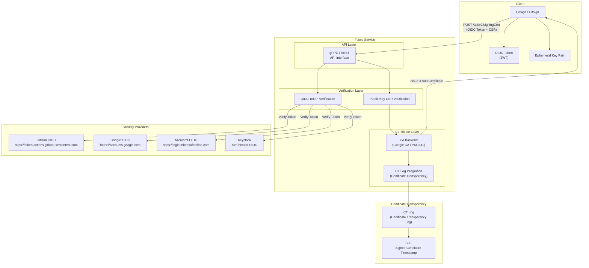
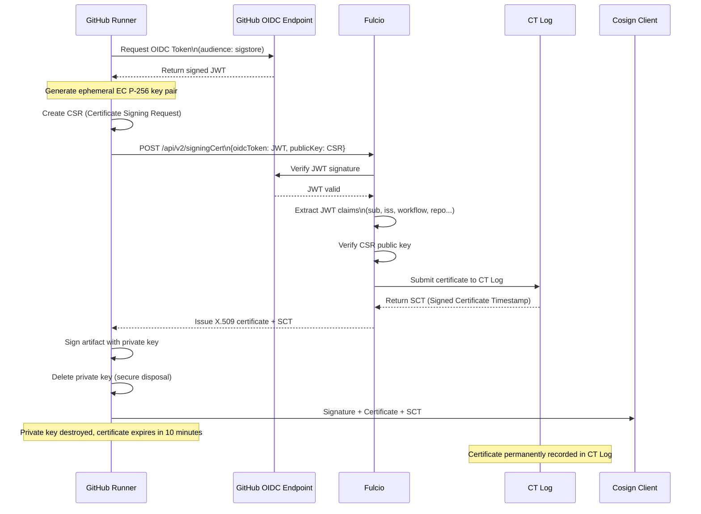
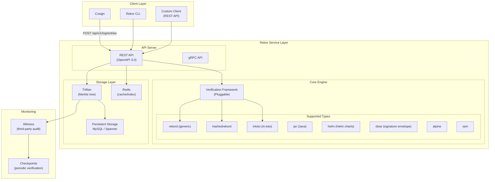
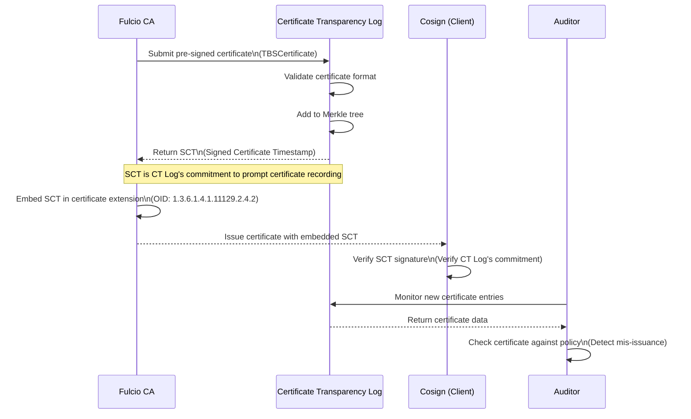
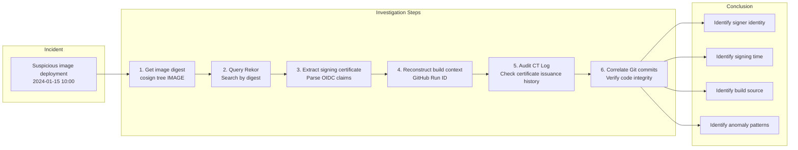
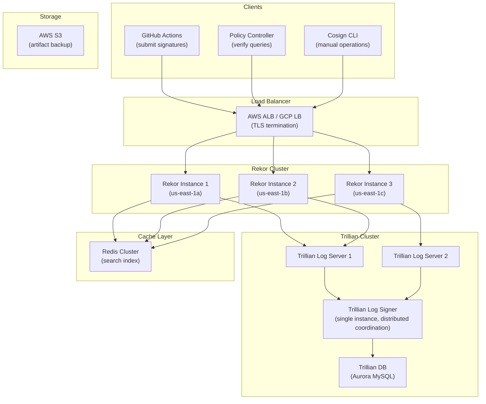

> **Production Environment Security Notice**
>
> This document contains directly executable operations commands. Before execution, please verify: whether the target cluster and namespace are correct; whether you have sufficient RBAC permissions; whether you have validated in non-production environments. Command risk levels are marked: 🔴 High risk (may cause data loss or service interruption), 🟡 Medium risk (modifies cluster state, but usually reversible), 🟢 Low risk/read-only (information gathering, no side effects).


# Fulcio and Rekor Transparency Logs

<!-- chunk: Overview -->## Overview

**Fulcio** is the Certificate Authority (CA) in the Sigstore ecosystem, responsible for converting OIDC identities into short-lived X.509 code signing certificates. **Rekor** is an immutable transparency log system that records all cryptographic evidence related to software supply chain operations. Together, they form the trust foundation for Sigstore's keyless signing.

This document provides an in-depth analysis of Fulcio certificate issuance processes, Rekor transparency log mechanisms, certificate transparency implementation, and applications in security audits and incident investigation.

---

<!-- chunk: 1. Fulcio Certificate Authority -->## 1. Fulcio Certificate Authority

## 1.1 Fulcio System Architecture



## 1.2 Fulcio Certificate Structure

Fulcio-issued certificates are standard X.509 v3 certificates with special OID extensions:

```bash
# View Fulcio-issued certificates
# First sign to get the certificate
COSIGN_EXPERIMENTAL=1 cosign sign \
  --yes \
  --output-certificate /tmp/signing.pem \
  ghcr.io/your-org/your-app:v1.0.0

# Parse certificate contents
openssl x509 -in /tmp/signing.pem -text -noout

# Example output:
# Certificate:
#     Data:
#         Version: 3 (0x2)
#         Serial Number: ...
#         Signature Algorithm: ecdsa-with-SHA384
#         Issuer: O=sigstore.dev, CN=sigstore-intermediate
#         Validity
#             Not Before: Jan 15 10:00:00 2024 GMT
#             Not After : Jan 15 10:10:00 2024 GMT   ← Only 10 minutes validity!
#         Subject: (empty - using SAN instead)
#         Subject Public Key Info:
#             Public Key Algorithm: id-ecPublicKey
#                 Public-Key: (256 bit)
#         X509v3 extensions:
#             X509v3 Key Usage: critical
#                 Digital Signature
#             X509v3 Extended Key Usage:
#                 Code Signing
#             X509v3 Subject Key Identifier:
#                 ...
#             X509v3 Authority Key Identifier:
#                 ...
#             X509v3 Subject Alternative Name: critical
#                 URI:https://github.com/your-org/your-repo/.github/workflows/release.yml@refs/tags/v1.0.0
#
#             # Fulcio custom OID extensions
#             1.3.6.1.4.1.57264.1.1:
#                 https://token.actions.githubusercontent.com  ← OIDC Issuer
#             1.3.6.1.4.1.57264.1.2:
#                 push                                         ← GitHub Event
#             1.3.6.1.4.1.57264.1.3:
#                 refs/tags/v1.0.0                             ← Ref
#             1.3.6.1.4.1.57264.1.4:
#                 Release with SLSA Level 3                    ← Workflow Name
#             1.3.6.1.4.1.57264.1.5:
#                 your-org/your-repo                           ← Repository
#             1.3.6.1.4.1.57264.1.6:
#                 refs/tags/v1.0.0                             ← Ref
#             1.3.6.1.4.1.57264.1.7:
#                 12345678                                     ← Run ID
```

## 1.3 Fulcio OID Extension Reference

| OID | Name | Description |
|-----|------|------|
| `1.3.6.1.4.1.57264.1.1` | OIDC Issuer | OIDC token issuer URL |
| `1.3.6.1.4.1.57264.1.2` | GitHub Event | Event type that triggered the workflow |
| `1.3.6.1.4.1.57264.1.3` | GitHub Ref | Git reference (branch/tag) |
| `1.3.6.1.4.1.57264.1.4` | GitHub Workflow | Workflow name |
| `1.3.6.1.4.1.57264.1.5` | GitHub Repository | Repository name |
| `1.3.6.1.4.1.57264.1.6` | GitHub Ref (v2) | Git reference |
| `1.3.6.1.4.1.57264.1.7` | GitHub Workflow Ref | Complete workflow reference |
| `1.3.6.1.4.1.57264.1.8` | GitHub SHA | Commit SHA |
| `1.3.6.1.4.1.57264.1.9` | GitHub Runner Environment | Runner environment |
| `1.3.6.1.4.1.57264.1.10` | GitHub Source Repository Digest | Source repository digest |

---

<!-- chunk: 2. OIDC Identity Verification Flow -->## 2. OIDC Identity Verification Flow

## 2.1 GitHub Actions OIDC Token Exchange



## 2.2 Supported OIDC Providers

```go
// Default OIDC provider configuration supported by Fulcio
// Source: https://github.com/sigstore/fulcio/blob/main/config/config.go

OIDCIssuers: map[string]OIDCIssuer{
    "https://token.actions.githubusercontent.com": {
        IssuerURL:   "https://token.actions.githubusercontent.com",
        ClientID:    "sigstore",
        Type:        IssuerTypeGitHubWorkflow,
        // Extract from JWT sub field:
        // "repo:org/repo:ref:refs/tags/v1.0.0"
    },
    "https://accounts.google.com": {
        IssuerURL: "https://accounts.google.com",
        ClientID:  "sigstore",
        Type:      IssuerTypeEmail,
        // Use email field as SAN
    },
    "https://oauth2.sigstore.dev/auth": {
        IssuerURL:             "https://oauth2.sigstore.dev/auth",
        ClientID:              "sigstore",
        Type:                  IssuerTypeEmail,
    },
    "https://gitlab.com": {
        IssuerURL: "https://gitlab.com",
        ClientID:  "sigstore",
        Type:      IssuerTypeGitLabPipeline,
    },
    "https://oidc.circleci.com/org/ORGANIZATION_ID": {
        IssuerURL: "https://oidc.circleci.com/org/ORGANIZATION_ID",
        ClientID:  "sigstore",
        Type:      IssuerTypeCircleCI,
    },
}
```

## 2.3 Verifying JWT Content of OIDC Token

```bash
# Decode OIDC token (no key required, decode payload only)
# Note: In production, do not log or print OIDC tokens
decode_jwt() {
    local TOKEN=$1
    # Extract payload (second part)
    echo $TOKEN | cut -d. -f2 | base64 -d 2>/dev/null | jq .
}

# Debug OIDC token in GitHub Actions (DEBUG ONLY)
# Note: Do not use the following steps in production
- name: Debug OIDC token (DEBUG ONLY)
  if: ${{ github.event_name == 'workflow_dispatch' }}
  run: |
    TOKEN=$(curl -s -H "Authorization: bearer $ACTIONS_ID_TOKEN_REQUEST_TOKEN" \
      "$ACTIONS_ID_TOKEN_REQUEST_URL&audience=sigstore" | jq -r .value)

    # Decode payload (do not print full token)
    echo $TOKEN | cut -d. -f2 | \
      python3 -c "import sys, base64, json; \
        data = sys.stdin.read().strip(); \
        # Pad base64
        data += '=' * (4 - len(data) % 4); \
        print(json.dumps(json.loads(base64.b64decode(data)), indent=2))"

# Verify Fulcio root CA certificate
curl -s https://fulcio.sigstore.dev/api/v2/trustBundle | \
  jq -r '.chains[].certificates[]' | \
  while read -r CERT; do
    echo "$CERT" | openssl x509 -text -noout 2>/dev/null | \
      grep -E "Subject:|Not Before:|Not After:|Serial Number"
    echo "---"
  done
```

---

<!-- chunk: 3. Rekor Transparency Log Deep Dive -->## 3. Rekor Transparency Log Deep Dive

## 3.1 Rekor Architecture



## 3.2 Rekor Log Entry Format

```bash
# Query specific entry
rekor-cli get --log-index 12345678

# Example output:
# LogID: c0d23d6ad406973f9559f3ba2d1ca01f84147d8ffc5b8445c224f98b9591801d
# Attestation: {"body":"...","integratedTime":1705315200,"logID":"c0d23d6a...","logIndex":12345678,"verification":{"inclusionProof":{"checkpoint":"rekor.sigstore.dev - 2605736670972794880\n150000000\nabc123...","hashes":["..."],"logIndex":12345678,"rootHash":"def456...","treeSize":150000000},"signedEntryTimestamp":"..."}}
# Index: 12345678
# IntegratedTime: 2024-01-15T10:00:00Z  ← Immutable integration timestamp
# UUID: abc123def456...
# Body: {
#   "apiVersion": "0.0.2",
#   "kind": "hashedrekord",
#   "spec": {
#     "data": {
#       "hash": {
#         "algorithm": "sha256",
#         "value": "..."
#       }
#     },
#     "signature": {
#       "content": "...",  ← Base64-encoded signature
#       "publicKey": {
#         "content": "..."  ← Base64-encoded public key/certificate
#       }
#     }
#   }
# }
```

## 3.3 Rekor Log Entry Types Explained

```bash
# hashedrekord - Most commonly used entry type (used by Cosign)
cat > hashedrekord-entry.json << 'EOF'
{
  "apiVersion": "0.0.2",
  "kind": "hashedrekord",
  "spec": {
    "data": {
      "hash": {
        "algorithm": "sha256",
        "value": "abc123def456..."
      }
    },
    "signature": {
      "content": "MEQCIHxxxxxxxx...",
      "publicKey": {
        "content": "LS0tLS1CRUdJTi..."
      }
    }
  }
}
EOF

# Submit entry
rekor-cli upload \
  --rekor-server https://rekor.sigstore.dev \
  --type hashedrekord \
  --artifact /path/to/artifact \
  --signature artifact.sig \
  --public-key cosign.pub

# in-toto entry (used for SLSA provenance evidence)
cat > intoto-entry.json << 'EOF'
{
  "apiVersion": "0.0.2",
  "kind": "intoto",
  "spec": {
    "content": {
      "envelope": {
        "payload": "eyJfdHlwZSI6...",  ← Base64 in-toto claim
        "payloadType": "application/vnd.in-toto+json",
        "signatures": [
          {
            "keyid": "",
            "sig": "MEYCIQCxxx..."
          }
        ]
      }
    },
    "publicKey": "LS0tLS1CRUdJTi..."
  }
}
EOF
```

---

<!-- chunk: 4. Rekor CLI Complete Operations Guide -->## 4. Rekor CLI Complete Operations Guide

## 4.1 Installing Rekor CLI

```bash
# Install rekor-cli
go install github.com/sigstore/rekor/cmd/rekor-cli@latest

# Or download from Release
REKOR_VERSION="v1.3.5"
curl -sSfL "https://github.com/sigstore/rekor/releases/download/${REKOR_VERSION}/rekor-cli-linux-amd64" \
  -o /usr/local/bin/rekor-cli
chmod +x /usr/local/bin/rekor-cli

# Verify installation
rekor-cli version
```

## 4.2 Query Operations

```bash
# Query log information (tree size, hash, etc.)
rekor-cli loginfo

# Example output:
# Tree Size: 150000000
# Root Hash: abc123...
# Timestamp: 2024-01-15T10:00:00Z
# TreeID: 1234567890

# Search by artifact hash
rekor-cli search \
  --sha "sha256:abc123def456..." \
  --rekor-server https://rekor.sigstore.dev

# Search by public key (find all artifacts signed with that key)
rekor-cli search \
  --public-key cosign.pub \
  --pki-format "x509" \
  --rekor-server https://rekor.sigstore.dev

# Search by email
rekor-cli search \
  --email "user@example.com" \
  --rekor-server https://rekor.sigstore.dev

# Get entry by specific UUID
rekor-cli get \
  --uuid "abc123def456..." \
  --rekor-server https://rekor.sigstore.dev

# Get entry by specific log index
rekor-cli get \
  --log-index 12345678 \
  --rekor-server https://rekor.sigstore.dev \
  --format json | jq .

# Batch get entry range
for INDEX in $(seq 12345678 12345688); do
  echo "=== Index: $INDEX ==="
  rekor-cli get --log-index $INDEX --format json | \
    jq '{index: .logIndex, time: .integratedTime, kind: (.body | @base64d | fromjson | .kind)}'
done
```

## 4.3 Inclusion Proof Verification

```bash
# Verify Merkle tree inclusion proof for entry
rekor-cli verify \
  --uuid "abc123def456..." \
  --rekor-server https://rekor.sigstore.dev

# Example output:
# Current Root Hash: def789...
# Entry Hash: abc123...
# Entry Index: 12345678
# Current Tree Size: 150000000
#
# Inclusion Proof:
# SHA256(0x01 | SHA256(leaf_hash) | SHA256(sibling_hash)) = root_hash
# Verified!

# Verify consistency proof (proof that log is append-only, never deletes)
rekor-cli verify \
  --tree-id 1234567890 \
  --tree-size 150000000 \
  --root-hash "def789..." \
  --rekor-server https://rekor.sigstore.dev
```

## 4.4 Rekor REST API Usage

```bash
# Get log information
curl -s "https://rekor.sigstore.dev/api/v1/log" | jq .

# Search entries (by artifact hash)
curl -s -X POST "https://rekor.sigstore.dev/api/v1/index/retrieve" \
  -H "Content-Type: application/json" \
  -d '{"hash": "sha256:abc123def456..."}' | jq .

# Get entry
curl -s "https://rekor.sigstore.dev/api/v1/log/entries/abc123..." | jq .

# Batch get entries
curl -s "https://rekor.sigstore.dev/api/v1/log/entries?logIndex=12345678&lastIndex=12345688" | jq .

# Get inclusion proof
curl -s "https://rekor.sigstore.dev/api/v1/log/proof/consistency" \
  -H "Content-Type: application/json" \
  -d '{"firstTreeSize": 100000000, "lastTreeSize": 150000000}' | jq .

# Get tree latest signed checkpoint
curl -s "https://rekor.sigstore.dev/api/v1/log" | \
  jq '.signedTreeHead'
```

---

<!-- chunk: 5. Certificate Transparency -->## 5. Certificate Transparency

## 5.1 CT Log and SCT Mechanism



## 5.2 SCT Verification

```bash
# Extract SCT information from certificate
openssl x509 -in cert.pem -text -noout | \
  grep -A 10 "Signed Certificate Timestamp"

# Verify SCT with cosign
cosign verify \
  --certificate cert.pem \
  --signature sig.sig \
  --certificate-oidc-issuer "https://token.actions.githubusercontent.com" \
  --certificate-identity-regexp ".*" \
  --check-claims=false \
  artifact.tar.gz

# Manually verify SCT signature
# 1. Download CT Log public key
curl -s "https://fulcio.sigstore.dev/api/v1/rootCert" | \
  openssl x509 -text -noout

# 2. Verify SCT signature with Go tool
go run github.com/google/certificate-transparency-go/cmd/ct_hammer@latest verify-sct \
  --cert cert.pem \
  --ct-log-url https://ctfe.sigstore.dev/test
```

## 5.3 CT Log Monitoring

```python
# ct_monitor.py - Monitor CT Log for new certificates
import requests
import base64
import json
from cryptography import x509
from cryptography.hazmat.backends import default_backend
import time

CT_LOG_URL = "https://ctfe.sigstore.dev/test"
MONITORED_DOMAINS = ["github.com/your-org"]

def get_sth():
    """Get Signed Tree Head"""
    response = requests.get(f"{CT_LOG_URL}/ct/v1/get-sth")
    return response.json()

def get_entries(start, end):
    """Get certificate entries for a specific range"""
    response = requests.get(
        f"{CT_LOG_URL}/ct/v1/get-entries",
        params={"start": start, "end": end}
    )
    return response.json().get("entries", [])

def parse_cert_entry(entry):
    """Parse certificate entry"""
    leaf_input = base64.b64decode(entry["leaf_input"])
    # Parse MerkleTreeLeaf structure
    # Skip version (1 byte) + type (1 byte) + timestamp (8 bytes) + type (2 bytes) + length (3 bytes)
    cert_data = leaf_input[15:]
    try:
        cert = x509.load_der_x509_certificate(cert_data, default_backend())
        return cert
    except Exception:
        return None

def monitor_certificates():
    """Monitor new certificates"""
    sth = get_sth()
    tree_size = sth["tree_size"]

    print(f"Current tree size: {tree_size}")

    # Scan last 100 entries
    start = max(0, tree_size - 100)
    entries = get_entries(start, tree_size - 1)

    suspicious_certs = []

    for i, entry in enumerate(entries):
        cert = parse_cert_entry(entry)
        if cert is None:
            continue

        # Check SAN (Subject Alternative Name)
        try:
            san_ext = cert.extensions.get_extension_for_class(x509.SubjectAlternativeName)
            for uri in san_ext.value.get_values_for_type(x509.UniformResourceIdentifier):
                for domain in MONITORED_DOMAINS:
                    if domain in uri:
                        print(f"Found cert for {domain}:")
                        print(f"  URI: {uri}")
                        print(f"  Valid from: {cert.not_valid_before}")
                        print(f"  Valid until: {cert.not_valid_after}")
                        print(f"  Log index: {start + i}")
        except x509.extensions.ExtensionNotFound:
            pass

    return suspicious_certs

if __name__ == "__main__":
    while True:
        monitor_certificates()
        time.sleep(300)  # Check every 5 minutes
```

---

<!-- chunk: 6. Audit Trail Practices -->## 6. Audit Trail Practices

## 6.1 Supply Chain Incident Timeline Reconstruction



## 6.2 Complete Incident Investigation Script

```bash
#!/bin/bash
# investigate_image.sh - Investigate container image supply chain integrity

set -euo pipefail

IMAGE_REF="${1:?Usage: $0 <image-ref>}"
REKOR_URL="${REKOR_URL:-https://rekor.sigstore.dev}"
OUTPUT_DIR="${OUTPUT_DIR:-./investigation-$(date +%Y%m%d-%H%M%S)}"

mkdir -p "$OUTPUT_DIR"

echo "=== Supply Chain Integrity Investigation ==="
echo "Image: $IMAGE_REF"
echo "Output directory: $OUTPUT_DIR"
echo "Time: $(date -u +%Y-%m-%dT%H:%M:%SZ)"
echo ""

# Step 1: Get image digest
echo ">>> Step 1: Get image digest"
DIGEST=$(crane digest "$IMAGE_REF" 2>/dev/null || echo "UNKNOWN")
echo "Digest: $DIGEST"
echo "$DIGEST" > "$OUTPUT_DIR/digest.txt"

# Step 2: View signature tree
echo ""
echo ">>> Step 2: View signature tree"
cosign tree "$IMAGE_REF" 2>&1 | tee "$OUTPUT_DIR/signature-tree.txt"

# Step 3: Verify signature and extract certificate
echo ""
echo ">>> Step 3: Verify signature and extract certificate"
cosign verify \
  --certificate-oidc-issuer "https://token.actions.githubusercontent.com" \
  --certificate-identity-regexp ".*" \
  --output-file "$OUTPUT_DIR/signatures.json" \
  "$IMAGE_REF" 2>&1 | tee "$OUTPUT_DIR/verify-output.txt" || true

# Step 4: Analyze signing certificate
echo ""
echo ">>> Step 4: Analyze signing certificate"
if [ -f "$OUTPUT_DIR/signatures.json" ]; then
  python3 << PYTHON
import json, base64, sys
from cryptography import x509
from cryptography.hazmat.backends import default_backend
from cryptography.x509.oid import NameOID

with open('$OUTPUT_DIR/signatures.json') as f:
    try:
        sigs = json.load(f)
    except json.JSONDecodeError:
        sigs = []

for i, sig in enumerate(sigs):
    print(f"\n=== Signature #{i+1} ===")

    # Extract certificate
    cert_b64 = sig.get('Cert', '') or sig.get('cert', '')
    if not cert_b64:
        print("  No certificate information")
        continue

    try:
        cert_pem = base64.b64decode(cert_b64)
        cert = x509.load_pem_x509_certificate(cert_pem, default_backend())

        print(f"  Valid from: {cert.not_valid_before} - {cert.not_valid_after}")

        # Extract SAN
        try:
            san = cert.extensions.get_extension_for_class(x509.SubjectAlternativeName)
            for uri in san.value.get_values_for_type(x509.UniformResourceIdentifier):
                print(f"  Workflow: {uri}")
        except Exception:
            pass

        # Extract Fulcio extensions
        FULCIO_OIDS = {
            "1.3.6.1.4.1.57264.1.1": "OIDC Issuer",
            "1.3.6.1.4.1.57264.1.2": "GitHub Event",
            "1.3.6.1.4.1.57264.1.3": "GitHub Ref",
            "1.3.6.1.4.1.57264.1.4": "GitHub Workflow",
            "1.3.6.1.4.1.57264.1.5": "GitHub Repository",
            "1.3.6.1.4.1.57264.1.8": "GitHub SHA",
        }

        for ext in cert.extensions:
            oid_str = ext.oid.dotted_string
            if oid_str in FULCIO_OIDS:
                try:
                    value = ext.value.value.decode('utf-8')
                    print(f"  {FULCIO_OIDS[oid_str]}: {value}")
                except Exception as e:
                    print(f"  {FULCIO_OIDS[oid_str]}: <decode failed: {e}>")
    except Exception as e:
        print(f"  Certificate parsing failed: {e}")

PYTHON
fi

# Step 5: Query Rekor
echo ""
echo ">>> Step 5: Query Rekor transparency log"
if [ "$DIGEST" != "UNKNOWN" ]; then
  HASH=$(echo "$DIGEST" | sed 's/sha256://')

  ENTRIES=$(curl -s -X POST "$REKOR_URL/api/v1/index/retrieve" \
    -H "Content-Type: application/json" \
    -d "{\"hash\": \"sha256:${HASH}\"}" 2>/dev/null)

  echo "Found Rekor entries:"
  echo "$ENTRIES" | jq -r '.[]' | while read UUID; do
    echo "  UUID: $UUID"
    curl -s "$REKOR_URL/api/v1/log/entries/${UUID}" | \
      jq -r '.[].integratedTime' | \
      xargs -I{} date -d @{} +"%Y-%m-%dT%H:%M:%SZ" 2>/dev/null | \
      while read TIME; do echo "  Integrated time: $TIME"; done
  done

  echo "$ENTRIES" > "$OUTPUT_DIR/rekor-entries.json"
fi

# Step 6: Verify SBOM attestation
echo ""
echo ">>> Step 6: Check SBOM attestation"
cosign verify-attestation \
  --type spdxjson \
  --certificate-oidc-issuer "https://token.actions.githubusercontent.com" \
  --certificate-identity-regexp ".*" \
  "$IMAGE_REF" > "$OUTPUT_DIR/sbom-attestation.json" 2>/dev/null && \
  echo "✅ SBOM attestation exists and is valid" || \
  echo "⚠️ SBOM attestation not found"

# Step 7: Check vulnerability attestation
echo ""
echo ">>> Step 7: Check vulnerability scanning attestation"
cosign verify-attestation \
  --type vuln \
  --certificate-oidc-issuer "https://token.actions.githubusercontent.com" \
  --certificate-identity-regexp ".*" \
  "$IMAGE_REF" > "$OUTPUT_DIR/vuln-attestation.json" 2>/dev/null && \
  echo "✅ Vulnerability attestation exists and is valid" || \
  echo "⚠️ Vulnerability scanning attestation not found"

# Generate report
echo ""
echo ">>> Generate investigation report"
cat > "$OUTPUT_DIR/investigation-report.md" << REPORT
# Supply Chain Integrity Investigation Report

**Investigation Time**: $(date -u +%Y-%m-%dT%H:%M:%SZ)
**Image**: $IMAGE_REF
**Digest**: $DIGEST

<!-- chunk: Findings Summary -->## Findings Summary

- Signature Status: $([ -f "$OUTPUT_DIR/signatures.json" ] && echo "✅ Exists" || echo "❌ Not found")
- SBOM Attestation: $([ -f "$OUTPUT_DIR/sbom-attestation.json" ] && echo "✅ Exists" || echo "⚠️ Not found")
- Vulnerability Attestation: $([ -f "$OUTPUT_DIR/vuln-attestation.json" ] && echo "✅ Exists" || echo "⚠️ Not found")

<!-- chunk: Detailed Information -->## Detailed Information

See the following files for detailed information:
- \`signature-tree.txt\`: Complete signature tree
- \`signatures.json\`: Signature and certificate details
- \`rekor-entries.json\`: Rekor transparency log entries
- \`sbom-attestation.json\`: SBOM attestation content
- \`vuln-attestation.json\`: Vulnerability scanning attestation
REPORT

echo ""
echo "=== Investigation Complete ==="
echo "Report saved to: $OUTPUT_DIR/"
ls -la "$OUTPUT_DIR/"
```

---

<!-- chunk: 7. Self-Hosted Rekor Deployment -->## 7. Self-Hosted Rekor Deployment

## 7.1 Kubernetes Deployment Configuration

```yaml
# rekor-deployment.yaml
apiVersion: apps/v1
kind: Deployment
metadata:
  name: rekor-server
  namespace: sigstore-system
  labels:
    app: rekor-server
spec:
  replicas: 3
  selector:
    matchLabels:
      app: rekor-server
  strategy:
    type: RollingUpdate
    rollingUpdate:
      maxSurge: 1
      maxUnavailable: 0
  template:
    metadata:
      labels:
        app: rekor-server
    spec:
      serviceAccountName: rekor-server

      initContainers:
        - name: wait-for-trillian
          image: busybox:1.35
          command:
            - sh
            - -c
            - |
              until nc -z trillian-log-server 8091; do
                echo "Waiting for Trillian..."; sleep 5
              done

      containers:
        - name: rekor-server
          image: gcr.io/projectsigstore/rekor-server:v1.3.5
          ports:
            - name: http
              containerPort: 3000
            - name: metrics
              containerPort: 2112

          args:
            - "serve"
            - "--trillian_log_server.address=trillian-log-server.sigstore-system.svc:8091"
            - "--trillian_log_server.tlog_id=$(TREE_ID)"
            - "--redis_server.address=redis.sigstore-system.svc:6379"
            - "--rekor_server.hostname=rekor.your-company.com"
            - "--rekor_server.address=0.0.0.0"
            - "--rekor_server.port=3000"
            - "--enable_retrieve_api=true"
            - "--log_type=prod"
            - "--search_index.storage_provider=redis"

          env:
            - name: TREE_ID
              valueFrom:
                secretKeyRef:
                  name: rekor-config
                  key: tree-id

          volumeMounts:
            - name: rekor-key
              mountPath: /var/run/rekor
              readOnly: true

          resources:
            requests:
              cpu: 500m
              memory: 512Mi
            limits:
              cpu: 2000m
              memory: 2Gi

          livenessProbe:
            httpGet:
              path: /healthz
              port: 3000
            initialDelaySeconds: 30
            periodSeconds: 10

          readinessProbe:
            httpGet:
              path: /api/v1/log
              port: 3000
            initialDelaySeconds: 10
            periodSeconds: 5

      volumes:
        - name: rekor-key
          secret:
            secretName: rekor-signing-key

---
# rekor-service.yaml
apiVersion: v1
kind: Service
metadata:
  name: rekor-server
  namespace: sigstore-system
spec:
  selector:
    app: rekor-server
  ports:
    - name: http
      port: 80
      targetPort: 3000
    - name: metrics
      port: 2112
      targetPort: 2112
  type: ClusterIP

---
# rekor-ingress.yaml
apiVersion: networking.k8s.io/v1
kind: Ingress
metadata:
  name: rekor-server
  namespace: sigstore-system
  annotations:
    cert-manager.io/cluster-issuer: "letsencrypt-prod"
    nginx.ingress.kubernetes.io/proxy-body-size: "50m"
spec:
  tls:
    - hosts:
        - rekor.your-company.com
      secretName: rekor-tls
  rules:
    - host: rekor.your-company.com
      http:
        paths:
          - path: /
            pathType: Prefix
            backend:
              service:
                name: rekor-server
                port:
                  number: 80
```

## 7.2 Trillian Log Tree Initialization

> ⚠️ **🟡 Medium Risk Change** — Modifies cluster resource state, recommend --dry-run or diff before confirming
> - `kubectl apply/create/replace`: Creates/modifies cluster resources

``` bash
# 🟡 Medium risk: Modifies cluster/resource state, verify target, scope and authorization before execution
# Create Trillian log tree
kubectl run trillian-admin \
  --image gcr.io/projectsigstore/trillian_log_server:v1.5.3 \
  --rm -it \
  --restart=Never \
  --namespace sigstore-system \
  -- /usr/local/bin/createtree \
    --admin_server trillian-log-server.sigstore-system.svc:8091 \
    --display_name "Rekor Production Log" \
    --log_type preordered

# Record the returned Tree ID
# Example: Tree ID: 9876543210

# Store in Kubernetes Secret
kubectl create secret generic rekor-config \
  --namespace sigstore-system \
  --from-literal=tree-id=9876543210

# Verify tree creation was successful
kubectl run trillian-verify \
  --image gcr.io/projectsigstore/trillian_log_server:v1.5.3 \
  --rm -it \
  --restart=Never \
  --namespace sigstore-system \
  -- /usr/local/bin/log_client \
    --log_server trillian-log-server.sigstore-system.svc:8091 \
    --log_id 9876543210 \
    get_latest_signed_log_root
```

## 7.3 Rekor Signing Key Management

> ⚠️ **🟡 Medium Risk Change** — Modifies cluster resource state, recommend --dry-run or diff before confirming
> - `kubectl apply/create/replace`: Creates/modifies cluster resources

``` bash
# 🟡 Medium risk: Modifies cluster/resource state, verify target, scope and authorization before execution
# Generate Rekor signing key (for signing tree root hash)
# Method 1: Direct generation (dev/test)
openssl ecparam -name prime256v1 -genkey -noout -out rekor-key.pem
openssl ec -in rekor-key.pem -pubout -out rekor-public-key.pem

# Store private key in Kubernetes Secret
kubectl create secret generic rekor-signing-key \
  --namespace sigstore-system \
  --from-file=private=rekor-key.pem \
  --from-file=public=rekor-public-key.pem

# Method 2: Use KMS (recommended for production)
# GCP KMS
gcloud kms keys create rekor-signing-key \
  --location global \
  --keyring sigstore \
  --purpose asymmetric-signing \
  --default-algorithm ec-sign-p256-sha256

# Export public key
gcloud kms keys versions get-public-key 1 \
  --location global \
  --keyring sigstore \
  --key rekor-signing-key \
  --output-file rekor-public-key.pem

# Publish public key for verification use
cat rekor-public-key.pem
```

---

<!-- chunk: 8. Transparency Log Monitoring and Alerting -->## 8. Transparency Log Monitoring and Alerting

## 8.1 Rekor Monitoring Configuration

```yaml
# prometheus-rekor-rules.yaml
apiVersion: monitoring.coreos.com/v1
kind: PrometheusRule
metadata:
  name: rekor-alerts
  namespace: sigstore-system

spec:
  groups:
    - name: rekor.rules
      interval: 30s
      rules:
        # Tree size growth rate
        - record: rekor:log_entries_rate5m
          expr: rate(rekor_log_entries_total[5m])

        # Alert: Log growth stopped
        - alert: RekorLogNotGrowing
          expr: rate(rekor_log_entries_total[1h]) == 0
          for: 2h
          labels:
            severity: warning
          annotations:
            summary: "Rekor transparency log stopped growing"
            description: "Rekor log has had no new entries in the past 2 hours"

        # Alert: Rekor service unavailable
        - alert: RekorServiceDown
          expr: up{job="rekor"} == 0
          for: 5m
          labels:
            severity: critical
          annotations:
            summary: "Rekor service unavailable"
            description: "Rekor transparency log service has stopped responding for more than 5 minutes"

        # Alert: API latency too high
        - alert: RekorHighLatency
          expr: histogram_quantile(0.99, rekor_api_request_duration_seconds_bucket) > 5
          for: 10m
          labels:
            severity: warning
          annotations:
            summary: "Rekor API latency too high"
            description: "99th percentile latency exceeds 5 seconds"

        # Alert: Error rate too high
        - alert: RekorHighErrorRate
          expr: rate(rekor_api_requests_total{status=~"5.."}[5m]) / rate(rekor_api_requests_total[5m]) > 0.05
          for: 5m
          labels:
            severity: critical
          annotations:
            summary: "Rekor API error rate too high"
            description: "API error rate exceeds 5%"
```

## 8.2 Transparency Log Consistency Monitoring

```python
#!/usr/bin/env python3
# rekor_consistency_monitor.py
# Monitor Rekor log consistency to ensure log is append-only without deletions

import requests
import json
import time
import hashlib
import hmac
import base64
from datetime import datetime

REKOR_URL = "https://rekor.sigstore.dev"
CHECKPOINT_FILE = "/var/lib/rekor-monitor/checkpoint.json"

def get_signed_tree_head():
    """Get current signed tree head"""
    response = requests.get(f"{REKOR_URL}/api/v1/log")
    response.raise_for_status()
    return response.json()

def get_consistency_proof(first_size, last_size):
    """Get consistency proof between two tree sizes"""
    response = requests.get(
        f"{REKOR_URL}/api/v1/log/proof/consistency",
        params={
            "firstTreeSize": first_size,
            "lastTreeSize": last_size
        }
    )
    response.raise_for_status()
    return response.json()

def verify_consistency_proof(old_root, old_size, new_root, new_size, proof_hashes):
    """
    Verify Merkle tree consistency proof
    Ensures that transition from old_size to new_size is pure append operation
    """
    # Simplified proof verification
    # Production should use complete Merkle tree verification library

    if old_size > new_size:
        return False, "New tree size smaller than old tree size, possible deletion detected!"

    if old_size == new_size and old_root == new_root:
        return True, "Tree unchanged"

    # Verify hash chain
    current_hash = old_root
    for hash_b64 in proof_hashes:
        hash_bytes = base64.b64decode(hash_b64)
        # Combine hashes (simplified)
        combined = current_hash.encode() + hash_bytes.hex().encode()
        current_hash = hashlib.sha256(combined).hexdigest()

    # Note: Complete verification requires implementing RFC 6962 consistency proof verification algorithm
    return True, "Consistency proof verified (simplified)"

def load_checkpoint():
    """Load last checked checkpoint"""
    try:
        with open(CHECKPOINT_FILE) as f:
            return json.load(f)
    except FileNotFoundError:
        return None

def save_checkpoint(sth):
    """Save current checkpoint"""
    import os
    os.makedirs(os.path.dirname(CHECKPOINT_FILE), exist_ok=True)
    checkpoint = {
        "tree_size": sth["treeSize"],
        "root_hash": sth["rootHash"],
        "timestamp": datetime.utcnow().isoformat(),
        "tree_id": sth.get("treeID")
    }
    with open(CHECKPOINT_FILE, 'w') as f:
        json.dump(checkpoint, f, indent=2)
    return checkpoint

def monitor():
    """Main monitoring loop"""
    print(f"[{datetime.utcnow().isoformat()}] Start Rekor consistency monitoring")

    # Get current tree head
    current_sth = get_signed_tree_head()
    current_size = current_sth["treeSize"]
    current_root = current_sth["rootHash"]

    print(f"Current tree size: {current_size}")
    print(f"Current root hash: {current_root[:16]}...")

    # Load last checkpoint
    old_checkpoint = load_checkpoint()

    if old_checkpoint is None:
        print("First run, saving checkpoint")
        save_checkpoint(current_sth)
        return True

    old_size = old_checkpoint["tree_size"]
    old_root = old_checkpoint["root_hash"]

    print(f"Last check: tree size {old_size}, root hash {old_root[:16]}...")

    if current_size == old_size and current_root == old_root:
        print("✅ Log unchanged, consistent")
        return True

    if current_size < old_size:
        print(f"❌ Critical alert! Tree size decreased: {old_size} -> {current_size}")
        print("This may indicate log deletion operation!")
        return False

    # Get consistency proof
    print(f"Get consistency proof ({old_size} -> {current_size})...")

    try:
        proof = get_consistency_proof(old_size, current_size)
        hashes = proof.get("hashes", [])

        valid, message = verify_consistency_proof(
            old_root, old_size,
            current_root, current_size,
            hashes
        )

        if valid:
            print(f"✅ Consistency verification passed: {message}")
            new_entries = current_size - old_size
            print(f"   New entries: {new_entries}")
            save_checkpoint(current_sth)
            return True
        else:
            print(f"❌ Consistency verification failed: {message}")
            return False

    except Exception as e:
        print(f"❌ Error during verification: {e}")
        return False

def main():
    while True:
        try:
            result = monitor()
            if not result:
                # Send alert
                print("🚨 Send security alert!")
                # Integrate with alerting system (PagerDuty/Slack/etc)
        except Exception as e:
            print(f"Monitoring error: {e}")

        # Check every 10 minutes
        time.sleep(600)

if __name__ == "__main__":
    main()
```

---

<!-- chunk: 9. Advanced Log Entry Type Applications -->## 9. Advanced Log Entry Type Applications

## 9.1 DSSE Signature Envelope

```bash
# DSSE is the recommended signature envelope format for in-toto
# Used for SLSA provenance evidence and custom attestations

# View Rekor entry in DSSE format
rekor-cli get \
  --log-index 12345678 \
  --format json | \
  jq '.body | @base64d | fromjson |
    select(.kind == "dsse") |
    .spec.proposedContent.envelope |
    {
      payloadType: .payloadType,
      payload: (.payload | @base64d | fromjson),
      sigCount: (.signatures | length)
    }'

# Submit DSSE entry
cat > dsse-payload.json << 'EOF'
{
  "payloadType": "application/vnd.in-toto+json",
  "payload": "eyJfdHlwZSI6Imh0dHBzOi8vaW4tdG90by5pby9TdGF0ZW1lbnQvdjAuMSIsInN1YmplY3QiOlt7Im5hbWUiOiJteS1hcHAiLCJkaWdlc3QiOnsic2hhMjU2IjoiYWJjMTIzIn19XSwicHJlZGljYXRlVHlwZSI6Imh0dHBzOi8vc2xzYS5kZXYvcHJvdmVuYW5jZS92MC4yIiwicHJlZGljYXRlIjp7fX0=",
  "signatures": [
    {
      "keyid": "",
      "sig": "MEYCIQCxxx..."
    }
  ]
}
EOF

rekor-cli upload \
  --rekor-server https://rekor.sigstore.dev \
  --type dsse \
  --artifact dsse-payload.json \
  --signature dsse-payload.json \
  --public-key signing-cert.pem \
  --pki-format x509
```

## 9.2 Helm Chart Signing

> ⚠️ **🟡 Medium Risk Change** — Modifies cluster resource state, recommend --dry-run or diff before confirming
> - `helm upgrade/install`: Deploys/upgrades release

``` bash
# 🟡 Medium risk: Modifies cluster/resource state, verify target, scope and authorization before execution
# Sign Helm Chart (with Rekor recording)
# First, sign Helm Chart with cosign

# Package Chart
helm package ./my-chart

# Generate signature for Chart file
cosign sign-blob \
  --yes \
  --bundle my-chart-1.0.0.tgz.bundle \
  my-chart-1.0.0.tgz

# Verify Chart signature
cosign verify-blob \
  --bundle my-chart-1.0.0.tgz.bundle \
  --certificate-oidc-issuer "https://token.actions.githubusercontent.com" \
  --certificate-identity-regexp ".*" \
  my-chart-1.0.0.tgz

# Push signed Chart to OCI registry
helm push my-chart-1.0.0.tgz oci://ghcr.io/your-org/helm-charts

# Sign Helm Chart in OCI registry
cosign sign \
  --yes \
  ghcr.io/your-org/helm-charts/my-chart:1.0.0

# Verify before Helm install
cosign verify \
  --certificate-oidc-issuer "https://token.actions.githubusercontent.com" \
  --certificate-identity-regexp ".*" \
  ghcr.io/your-org/helm-charts/my-chart:1.0.0 && \
  helm install my-release oci://ghcr.io/your-org/helm-charts/my-chart --version 1.0.0
```

---

<!-- chunk: 10. Enterprise Transparency Log Architecture -->## 10. Enterprise Transparency Log Architecture

## 10.1 High-Availability Rekor Deployment



## 10.2 Cross-Region Rekor Federation

```yaml
# rekor-federation-config.yaml
# Configure federation trust for multiple Rekor instances

apiVersion: v1
kind: ConfigMap
metadata:
  name: rekor-federation
  namespace: sigstore-system

data:
  # Configuration for each regional Rekor instance
  federation.yaml: |
    rekor_instances:
      - name: "us-east-1"
        url: "https://rekor-us-east.your-company.com"
        public_key: |
          -----BEGIN PUBLIC KEY-----
          MFkwEwYHKoZIzj0CAQYIKoZIzj0DAQcDQgAE...
          -----END PUBLIC KEY-----

      - name: "eu-west-1"
        url: "https://rekor-eu-west.your-company.com"
        public_key: |
          -----BEGIN PUBLIC KEY-----
          MFkwEwYHKoZIzj0CAQYIKoZIzj0DAQcDQgAF...
          -----END PUBLIC KEY-----

      - name: "ap-northeast-1"
        url: "https://rekor-ap-northeast.your-company.com"
        public_key: |
          -----BEGIN PUBLIC KEY-----
          MFkwEwYHKoZIzj0CAQYIKoZIzj0DAQcDQgAG...
          -----END PUBLIC KEY-----

    # Write policy: write to nearest Rekor instance
    write_policy: "nearest"

    # Read policy: read from any instance
    read_policy: "any"

    # Cross-validation: ensure critical signatures recorded on multiple instances
    cross_validation:
      enabled: true
      min_instances: 2
```

---

<!-- chunk: 11. Security Incident Response -->## 11. Security Incident Response

## 11.1 Signing Key Compromise Response

> ⚠️ **🟡 Medium Risk Change** — Modifies cluster resource state, recommend --dry-run or diff before confirming
> - `kubectl edit/patch`: Modifies running resources

``` bash
# 🟡 Medium risk: Modifies cluster/resource state, verify target, scope and authorization before execution
#!/bin/bash
# key_compromise_response.sh - Emergency response to signing key compromise

set -euo pipefail

COMPROMISED_KEY="${1:?Usage: $0 <compromised-key-path-or-kms-id>}"
INCIDENT_ID="${2:-$(date +%Y%m%d-%H%M%S)}"

echo "=== Signing Key Compromise Emergency Response ==="
echo "Incident ID: $INCIDENT_ID"
echo "Compromised Key: $COMPROMISED_KEY"
echo "Start time: $(date -u)"
echo ""

# Step 1: Immediately search all signatures using the key
echo ">>> Step 1: Search all signatures using the compromised key"
rekor-cli search \
  --public-key "$COMPROMISED_KEY" \
  --pki-format "x509" \
  --rekor-server https://rekor.sigstore.dev \
  > "/tmp/compromised-signatures-${INCIDENT_ID}.txt" 2>&1

SIGNATURE_COUNT=$(wc -l < "/tmp/compromised-signatures-${INCIDENT_ID}.txt")
echo "Found ${SIGNATURE_COUNT} signatures using the compromised key"

# Step 2: Revoke compromised key (for KMS keys)
echo ""
echo ">>> Step 2: Disable compromised key"
# AWS KMS
if echo "$COMPROMISED_KEY" | grep -q "awskms://"; then
  KEY_ID=$(echo "$COMPROMISED_KEY" | sed 's/awskms:\/\/\///')
  aws kms disable-key --key-id "$KEY_ID"
  echo "✅ AWS KMS key disabled"
fi

# GCP KMS
if echo "$COMPROMISED_KEY" | grep -q "gcpkms://"; then
  KEY_VERSION=$(echo "$COMPROMISED_KEY" | sed 's/gcpkms:\/\///')
  gcloud kms keys versions disable 1 \
    --location=global \
    --keyring=cosign \
    --key="$COMPROMISED_KEY"
  echo "✅ GCP KMS key disabled"
fi

# Step 3: Generate affected artifact inventory
echo ""
echo ">>> Step 3: Generate affected artifact inventory"
cat "/tmp/compromised-signatures-${INCIDENT_ID}.txt" | \
  while read UUID; do
    if [ -n "$UUID" ]; then
      rekor-cli get --uuid "$UUID" --format json 2>/dev/null | \
        jq '{
          uuid: .uuid,
          time: .integratedTime,
          type: (.body | @base64d | fromjson | .kind),
          hash: (.body | @base64d | fromjson | .spec.data.hash.value // "N/A")
        }'
    fi
  done > "/tmp/affected-artifacts-${INCIDENT_ID}.json"

echo "Affected artifact inventory saved"

# Step 4: Re-sign legitimate artifacts
echo ""
echo ">>> Step 4: Re-sign with new key (requires manual confirmation)"
echo "Please review affected artifact inventory and re-sign legitimate artifacts:"
cat "/tmp/affected-artifacts-${INCIDENT_ID}.json" | jq .

# Step 5: Update policy enforcement rules
echo ""
echo ">>> Step 5: Update Policy Controller rules"
echo "Please update ClusterImagePolicy to reject signatures using compromised key"
echo "Example:"
cat << 'EOF'
# Update ClusterImagePolicy to reject compromised key
kubectl patch clusterimagepolicy my-policy --type=json -p='[
  {
    "op": "replace",
    "path": "/spec/authorities/0/key/data",
    "value": "NEW_PUBLIC_KEY_DATA"
  }
]'
EOF

echo ""
echo "=== Emergency Response Complete ==="
echo "Incident ID: $INCIDENT_ID"
echo "Compromised Key: $COMPROMISED_KEY"
echo "Affected Signatures: ${SIGNATURE_COUNT}"
echo "Next step: Notify security team and complete compliance report"
```

---

<!-- chunk: 12. References -->## 12. References

## 12.1 Key Specification Documents

| Document | URL |
|----------|-----|
| Rekor Design Document | https://docs.sigstore.dev/logging/overview/ |
| Fulcio Design Document | https://docs.sigstore.dev/certificate_authority/overview/ |
| RFC 6962 - CT | https://tools.ietf.org/html/rfc6962 |
| in-toto Specification | https://github.com/in-toto/in-toto |
| Trillian Design | https://github.com/google/trillian |

## 12.2 Related Tools

```bash
# Install complete tool suite
# Rekor CLI
go install github.com/sigstore/rekor/cmd/rekor-cli@latest

# Cosign
go install github.com/sigstore/cosign/v2/cmd/cosign@latest

# Gitsign
go install github.com/sigstore/gitsign@latest

# Crane (OCI tools)
go install github.com/google/go-containerregistry/cmd/crane@latest

# verify-attestations
go install github.com/slsa-framework/slsa-verifier/v2/cli/slsa-verifier@latest
```

---

<!-- chunk: Summary -->## Summary

Fulcio and Rekor together form the trust foundation for Sigstore's keyless signing:

1. **Fulcio Certificate Issuance**: Convert short-lived OIDC identity to 10-minute code signing certificate
2. **OID Extensions**: Certificate embeds complete context from GitHub Actions workflow
3. **CT Log Integration**: Every certificate recorded in Certificate Transparency log preventing mis-issuance
4. **Rekor Transparency Log**: Immutable log records timestamp of all signing operations
5. **Inclusion Proof**: Merkle tree structure guarantees log integrity
6. **Audit Trail**: Complete event timeline reconstruction capability
7. **Self-Hosted Deployment**: Enterprise can deploy private instances with Kubernetes + Trillian
8. **Consistency Monitoring**: Automated detection of log tampering attempts
9. **Incident Response**: Quick response process for key compromise
10. **High-Availability Architecture**: Production-grade multi-instance, multi-region deployment

Through the combination of Fulcio and Rekor, Sigstore achieves:
- **No Key Management**: OIDC identity directly mapped to signatures
- **Non-repudiation**: Transparency log provides permanent signature record
- **Auditability**: Complete supply chain evidence chain
- **Open Standards**: Based on mature standards like in-toto, CT, TLS

---

<!-- chunk: Obsidian Related Documents -->## Obsidian Related Documents

- domain-05-security-compliance MOC
- [[domain-05-security-compliance/README.md|Domain 05: Supply Chain Security]]
- [[domain-05-security-compliance/00-open-source-projects-index.md|Domain 05 Supply Chain Security — Open Source Projects Index]]
- Supply Chain Security Overview
- Supply Chain Security Maturity Model
- SBOM Generation and Management
- SBOM Vulnerability Analysis and Governance
- SLSA Levels and Implementation
- GitHub Actions SLSA Build
- Sigstore and Cosign Signing
- Policy Controller Image Verification
- Compliance Automation and Audit

## See Also

- 06-github-actions-slsa-build
- 07-sigstore-cosign-signing
- 09-policy-controller-verification
- 10-compliance-automation-audit

- [[domain-05-security-compliance/README.md|Return to Table of Contents]]

<!-- risk-assessed -->
