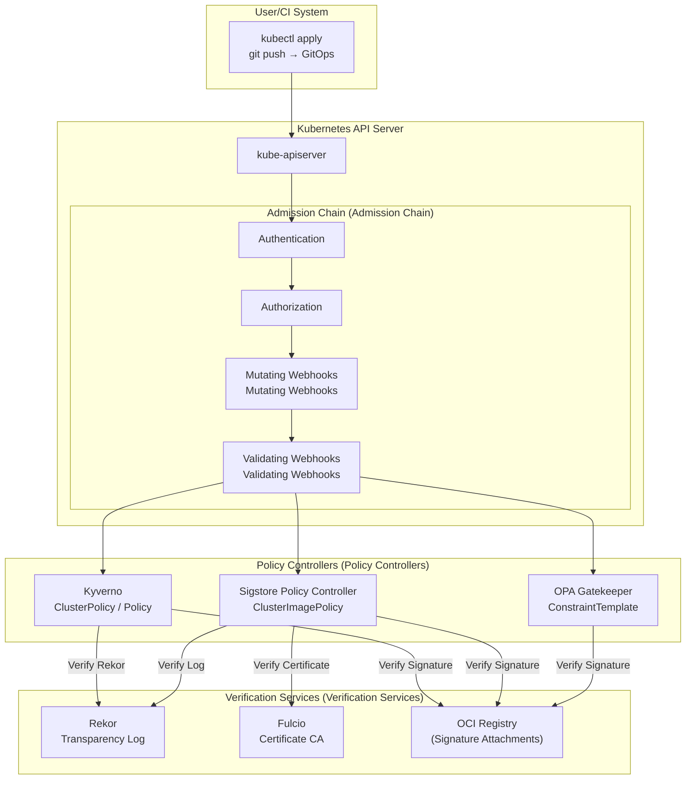
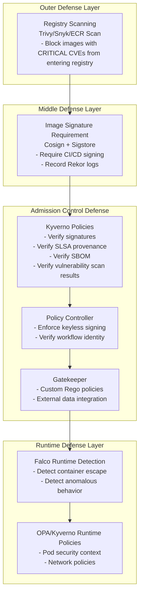

---title: Policy Controller Image Verification
description: '- Policy Controller Image Verification best practices'
summary: '- Policy Controller Image Verification best practices'
category: general
tags:
- k8s
- apiserver
- prometheus
- grafana
- helm
- argocd
- docker
- opa
- falco
- job
tier: supporting
created: '2026-05-23'
last_updated: 2026-05
difficulty: intermediate
reading_level: intermediate
audience:
- All engineers
estimated_read_time: 45min
intent_queries:
- What is Policy Controller Image Verification
- How to implement Policy Controller Image Verification
- Kubernetes 05 security compliance best practices
trigger_keywords:
- Policy
- Controller
- Image
- Verification
- Policy
- Controller
- Image
- Verification
- security
prerequisites:
- kubectl-basics
- rbac-basics
- helm-basics
- prometheus-basics
- monitoring-basics
- gitops-basics
- policy-basics
original_language: Chinese
authors:
- name: Dillan Teagle
  role: contributor
source_path: /Users/teaglebuilt/workspace/kudig-database/domain-05-security-compliance/05-supply-chain/09-policy-controller-verification.md
---

> **Production Environment Security Notice**
>
> This document contains directly executable operations commands. Before executing, please confirm: whether the current target cluster and namespace are correct; whether you have sufficient RBAC permissions; whether testing has been completed in a non-production environment. Command risk levels are marked as: 🔴 High risk (may cause data loss or service interruption), 🟡 Medium risk (modifies cluster state but usually reversible), 🟢 Low risk/read-only (information gathering, no side effects).


---
tags:
- security
- supply-chain
intent_queries:
- What is policy-controller-verification?
- How to use policy-controller-verification
- Best practices for policy-controller-verification

tier: peripheral---
title: Policy Controller Image Verification
description: '<!-- chunk: Overview (Overview)' -->## Overview (Overview)'
category: supply-chain-security
tags:
- k8s
- supply-chain
- security
- sbom
- slsa
- apiserver
- [[Prometheus|prometheus]]
- grafana
- [[Helm|helm]]
- [[ArgoCD|argocd]]
last_updated: 2026-05
difficulty: advanced
reading_level: advanced
audience:
- Security engineers
- SRE
- Architects
estimated_read_time: 5min
intent_queries:
- What is Policy Controller Image Verification
- How to implement Policy Controller Image Verification
- [[Kubernetes|Kubernetes]] 39 supply chain security best practices
trigger_keywords:
- Policy
- Controller
- Image
- Verification
- Policy
- Controller
- Image
- Verification
- supply
authors:
- name: Dillan Teagle
  role: contributor
k8s_versions:
- '1.28'
- '1.29'
- '1.30'
- '1.31'
- '1.32'
---

# Policy Controller Image Verification

<!-- chunk: Overview (Overview) -->## Overview

Policy Controller is a core component of the Kubernetes admission control layer that intercepts Pod creation requests to verify container image signatures, attestations, and security policies. This document covers multiple implementation options including Kyverno image verification, Sigstore Policy Controller, OPA Gatekeeper signature verification, and multi-cluster policy best practices.

---

<!-- chunk: 1. Image Verification Architecture Overview (Image Verification Architecture Overview) -->## 1. Image Verification Architecture Overview

## 1.1 Admission Control Flow



## 1.2 Policy Decision Matrix

| Scenario | Kyverno | Sigstore Policy Controller | OPA Gatekeeper |
|------|---------|--------------------------|----------------|
| Image signature verification | ✅ Native support | ✅ Core function | ✅ Via external data |
| SBOM verification | ✅ Supported | ✅ Supported | ⚠️ Requires customization |
| SLSA source verification | ✅ Supported | ✅ Supported | ⚠️ Requires customization |
| Policy exception management | ✅ PolicyException | ✅ Via namespace selector | ✅ ConstraintExclusion |
| Multi-cluster policies | ✅ KyvCLI + GitOps | ✅ Supported | ✅ Supported |
| Audit mode | ✅ Audit | ✅ Warn/Enforce | ✅ DryRun |
| Policy testing | ✅ kyverno test | ⚠️ Limited support | ✅ Rego test |
| Learning curve | Medium (YAML) | Low (YAML) | High (Rego) |

---

<!-- chunk: 2. Kyverno Image Verification (Kyverno Image Verification) -->## 2. Kyverno Image Verification

## 2.1 Installing Kyverno

> ⚠️ **🟡 Medium Risk Change** — Modifies cluster resource state, recommend --dry-run or diff confirmation first
> - `helm upgrade/install`: Deploy/upgrade release

``` bash
# 🟡 Medium risk: Modifies cluster/resource state, please confirm target, scope, and authorization before execution
# Install Kyverno using Helm
helm repo add kyverno https://kyverno.github.io/kyverno/
helm repo update

# Install Kyverno (production configuration)
helm install kyverno kyverno/kyverno \
  --namespace kyverno \
  --create-namespace \
  --version 3.1.4 \
  --set admissionController.replicas=3 \
  --set backgroundController.replicas=2 \
  --set cleanupController.replicas=1 \
  --set reportsController.replicas=1 \
  --set admissionController.resources.requests.cpu=500m \
  --set admissionController.resources.requests.memory=512Mi \
  --set admissionController.resources.limits.cpu=2000m \
  --set admissionController.resources.limits.memory=2Gi \
  --set features.policyExceptions.enabled=true \
  --set features.policyExceptions.namespace=kyverno \
  --set config.webhookMatchConditions=true

# Verify installation
kubectl get pods -n kyverno
kubectl get crd | grep kyverno
```
## 2.2 Basic Image Signature Verification Policy

```yaml
# kyverno-verify-image-basic.yaml
apiVersion: kyverno.io/v1
kind: ClusterPolicy
metadata:
  name: verify-image-signatures
  annotations:
    policies.kyverno.io/title: Verify image signatures
    policies.kyverno.io/category: Software Supply Chain Security
    policies.kyverno.io/severity: high
    policies.kyverno.io/description: >-
      Verify that all container images must be signed by GitHub Actions CI/CD pipeline,
      using Sigstore keyless signing mechanism.

spec:
  validationFailureAction: Enforce   # Enforce (Audit for audit mode)
  background: true                    # Scan existing resources

  rules:
    # Rule 1: Verify production image signatures
    - name: verify-production-images
      match:
        any:
          - resources:
              kinds: [Pod]
              namespaces:
                - production
                - staging
      
      verifyImages:
        # Main container
        - imageReferences:
            - "ghcr.io/your-org/*"
          
          # Keyless verification configuration
          attestors:
            - count: 1
              entries:
                - keyless:
                    url: https://fulcio.sigstore.dev
                    issuer: https://token.actions.githubusercontent.com
                    subject: >-
                      https://github.com/your-org/*/github/workflows/release.yml@refs/tags/*
                    # Optional: Use regular expressions
                    # subjectRegExp: "^https://github.com/your-org/.*/.github/workflows/.*@refs/tags/v[0-9]+\\.[0-9]+\\.[0-9]+$"
                    rekor:
                      url: https://rekor.sigstore.dev
                      ignoreTlog: false
                    ctlog:
                      ignoreSCT: false

          # After verification, mutate image reference to digest (prevent tag mutation)
          mutateDigest: true
          # Verify digest must exist
          required: true
          # Only verify signature, do not modify Image
          verifyDigest: true
```

## 2.3 Advanced Image Verification Policy

```yaml
# kyverno-verify-image-advanced.yaml
apiVersion: kyverno.io/v1
kind: ClusterPolicy
metadata:
  name: verify-image-supply-chain
  annotations:
    policies.kyverno.io/title: Complete supply chain verification
    policies.kyverno.io/category: Software Supply Chain Security
    policies.kyverno.io/severity: critical

spec:
  validationFailureAction: Enforce
  background: true

  rules:
    # ============================================================
    # Rule 1: Verify container image signatures
    # ============================================================
    - name: verify-image-signature
      match:
        any:
          - resources:
              kinds: [Pod]
              namespaces:
                - production
      
      exclude:
        any:
          - resources:
              namespaces:
                - kube-system
                - kyverno
      
      verifyImages:
        - imageReferences:
            - "ghcr.io/your-org/*"
          
          attestors:
            - count: 1
              entries:
                - keyless:
                    url: https://fulcio.sigstore.dev
                    issuer: https://token.actions.githubusercontent.com
                    subjectRegExp: "^https://github.com/your-org/[^/]+/.github/workflows/[^@]+@refs/tags/v[0-9]+\\.[0-9]+\\.[0-9]+$"
                    rekor:
                      url: https://rekor.sigstore.dev
          
          # Annotation verification (ensure image built by production pipeline)
          attestations:
            - predicateType: https://cosign.sigstore.dev/attestation/v1
              conditions:
                - all:
                    - key: "{{ environment }}"
                      operator: Equals
                      value: "production"

          mutateDigest: true
          required: true

    # ============================================================
    # Rule 2: Verify SLSA Level 3 provenance
    # ============================================================
    - name: verify-slsa-provenance
      match:
        any:
          - resources:
              kinds: [Pod]
              namespaces:
                - production
      
      verifyImages:
        - imageReferences:
            - "ghcr.io/your-org/*"
          
          attestors:
            - count: 1
              entries:
                - keyless:
                    url: https://fulcio.sigstore.dev
                    issuer: https://token.actions.githubusercontent.com
                    subjectRegExp: "^https://github.com/slsa-framework/slsa-github-generator/.github/workflows/generator_container_slsa3.yml@refs/tags/v[0-9]+\\.[0-9]+\\.[0-9]+$"
                    rekor:
                      url: https://rekor.sigstore.dev
          
          attestations:
            - predicateType: https://slsa.dev/provenance/v0.2
              conditions:
                - all:
                    # Verify builder ID
                    - key: "{{ predicate.builder.id }}"
                      operator: Equals
                      value: "https://github.com/slsa-framework/slsa-github-generator/.github/workflows/generator_container_slsa3.yml@refs/tags/v1.10.0"
                    
                    # Verify source repository
                    - key: "{{ predicate.invocation.configSource.uri }}"
                      operator: AnyIn
                      value:
                        - "git+https://github.com/your-org/app-one@refs/tags/v*"
                        - "git+https://github.com/your-org/app-two@refs/tags/v*"
                    
                    # Ensure built from tag (not branch)
                    - key: "{{ predicate.invocation.environment.github_ref_type }}"
                      operator: Equals
                      value: "tag"

    # ============================================================
    # Rule 3: Verify SBOM attestation exists
    # ============================================================
    - name: verify-sbom-attestation
      match:
        any:
          - resources:
              kinds: [Pod]
              namespaces:
                - production
      
      verifyImages:
        - imageReferences:
            - "ghcr.io/your-org/*"
          
          attestors:
            - count: 1
              entries:
                - keyless:
                    url: https://fulcio.sigstore.dev
                    issuer: https://token.actions.githubusercontent.com
                    subjectRegExp: "^https://github.com/your-org/.*"
                    rekor:
                      url: https://rekor.sigstore.dev
          
          attestations:
            - predicateType: https://spdx.dev/Document
              # Only verify existence, no content checks
              conditions: []

    # ============================================================
    # Rule 4: Verify vulnerability scan attestation (no CRITICAL vulnerabilities)
    # ============================================================
    - name: verify-no-critical-vulnerabilities
      match:
        any:
          - resources:
              kinds: [Pod]
              namespaces:
                - production
      
      verifyImages:
        - imageReferences:
            - "ghcr.io/your-org/*"
          
          attestors:
            - count: 1
              entries:
                - keyless:
                    url: https://fulcio.sigstore.dev
                    issuer: https://token.actions.githubusercontent.com
                    subjectRegExp: "^https://github.com/your-org/.*"
                    rekor:
                      url: https://rekor.sigstore.dev
          
          attestations:
            - predicateType: https://cosign.sigstore.dev/attestation/vuln/v1
              conditions:
                - all:
                    # Vulnerability scan results cannot have CRITICAL vulnerabilities
                    - key: "{{ predicate.scanner.result.Results[].Vulnerabilities[].Severity }}"
                      operator: NotIn
                      value: ["CRITICAL"]
```

## 2.4 Key-Based Verification Policy

```yaml
# kyverno-verify-image-key.yaml
apiVersion: kyverno.io/v1
kind: ClusterPolicy
metadata:
  name: verify-image-with-key
  annotations:
    policies.kyverno.io/title: Verify image signatures using public key
    policies.kyverno.io/severity: high

spec:
  validationFailureAction: Enforce
  background: true

  rules:
    - name: verify-with-cosign-key
      match:
        any:
          - resources:
              kinds: [Pod]
      
      verifyImages:
        - imageReferences:
            - "docker.io/your-org/*"
          
          attestors:
            - count: 1
              entries:
                # Use static public key for verification
                - keys:
                    publicKeys: |-
                      -----BEGIN PUBLIC KEY-----
                      MFkwEwYHKoZIzj0CAQYIKoZIzj0DAQcDQgAExxxxxxxxxxxxxxxxxxxxxxxxxx
                      xxxxxxxxxxxxxxxxxxxxxxxxxxxxxxxxxxxxxxxxxxxxxxxxxxxxxxxxxx
                      -----END PUBLIC KEY-----
                    
                    # Use KMS key (AWS KMS)
                    # kms: "awskms:///arn:aws:kms:us-east-1:123456789:key/abc-def"
                    
                    # Signature algorithm
                    signatureAlgorithm: "sha256"
                    
                    # Rekor configuration
                    rekor:
                      url: https://rekor.sigstore.dev
                      pubkey: |-
                        -----BEGIN PUBLIC KEY-----
                        MFkwEwYHKoZIzj0CAQYIKoZIzj0DAQcDQgAE...
                        -----END PUBLIC KEY-----

          mutateDigest: true
          required: true

    # Certificate verification (suitable for enterprise PKI)
    - name: verify-with-certificate
      match:
        any:
          - resources:
              kinds: [Pod]
              namespaces:
                - internal
      
      verifyImages:
        - imageReferences:
            - "registry.your-company.com/*"
          
          attestors:
            - count: 1
              entries:
                - certificates:
                    cert: |-
                      -----BEGIN CERTIFICATE-----
                      MIIBxxxxxxxxxxxxxxxxxxxxxxxxxxxxxxxxxxxxxxxxxxxxxx
                      -----END CERTIFICATE-----
                    
                    certChain: |-
                      -----BEGIN CERTIFICATE-----
                      MIIBxxxxxxxxxxxxxxxxxxxxxxxxxxxxxxxxxxxxxxxxxxxxxx
                      -----END CERTIFICATE-----
                    
                    rekor:
                      url: https://rekor.your-company.com
          
          mutateDigest: true
          required: true
```

## 2.5 Kyverno Policy Exceptions

```yaml
# kyverno-policy-exception.yaml
apiVersion: kyverno.io/v2alpha1
kind: PolicyException
metadata:
  name: allow-legacy-app
  namespace: kyverno

spec:
  exceptions:
    - policyName: verify-image-signatures
      ruleNames:
        - verify-production-images
        - verify-slsa-provenance
  
  match:
    any:
      - resources:
          kinds: [Pod]
          namespaces:
            - legacy-namespace
          selector:
            matchLabels:
              app.kubernetes.io/name: legacy-app
  
  # Required: Exception reason and approval information
  description: >-
    Legacy app in migration process to SLSA-compliant build.
    Exception valid until 2024-12-31.
    Approved by: security-team@company.com
    Ticket: SECURITY-1234

---
# Namespace-level exception
apiVersion: kyverno.io/v2alpha1
kind: PolicyException
metadata:
  name: allow-dev-namespace
  namespace: kyverno

spec:
  exceptions:
    - policyName: verify-image-signatures
      ruleNames: ["*"]
  
  match:
    any:
      - resources:
          kinds: [Pod]
          namespaces:
            - development
            - dev-*
  
  conditions:
    any:
      # Only allow in development namespace during business hours
      - key: "{{ request.userInfo.username }}"
        operator: AnyIn
        value:
          - developer1
          - developer2
  
  description: "Development namespace exemption for developer testing"
```

---

<!-- chunk: 3. Sigstore Policy Controller (Sigstore Policy Controller) -->## 3. Sigstore Policy Controller

## 3.1 Installing Policy Controller

> ⚠️ **🟡 Medium Risk Change** — Modifies cluster resource state, recommend --dry-run or diff confirmation first
> - `helm upgrade/install`: Deploy/upgrade release

``` bash
# 🟡 Medium risk: Modifies cluster/resource state, please confirm target, scope, and authorization before execution
# Install using Helm
helm repo add sigstore https://sigstore.github.io/helm-charts
helm repo update

helm install policy-controller sigstore/policy-controller \
  --namespace cosign-system \
  --create-namespace \
  --version 0.9.0 \
  --set webhook.replicaCount=3 \
  --set webhook.resources.requests.cpu=100m \
  --set webhook.resources.requests.memory=128Mi \
  --set webhook.resources.limits.cpu=1000m \
  --set webhook.resources.limits.memory=512Mi \
  --set cosign.timeout=10s

# Verify installation
kubectl get pods -n cosign-system
kubectl get clusterimagepolicy
kubectl get validatingwebhookconfiguration | grep cosign

# Check webhook configuration
kubectl describe validatingwebhookconfiguration policy.sigstore.dev
```
## 3.2 ClusterImagePolicy Basic Configuration

```yaml
# cluster-image-policy-basic.yaml
apiVersion: policy.sigstore.dev/v1beta1
kind: ClusterImagePolicy
metadata:
  name: require-signed-images

spec:
  # Matching image patterns
  images:
    - glob: "ghcr.io/your-org/**"
    - glob: "registry.your-company.com/**"
  
  # At least one authority must be satisfied
  policy:
    # Can set fetchConfigFile: true when matching all patterns
    fetchConfigFile: false
  
  # List of verification authorities
  authorities:
    # Authority 1: GitHub Actions keyless signing
    - name: github-actions-keyless
      keyless:
        url: https://fulcio.sigstore.dev
        identities:
          - issuer: https://token.actions.githubusercontent.com
            subject: "https://github.com/your-org/your-app/.github/workflows/release.yml@refs/tags/v1.0.0"
          - issuer: https://token.actions.githubusercontent.com
            subjectRegExp: "^https://github.com/your-org/[^/]+/.github/workflows/release\\.yml@refs/tags/v[0-9]+\\.[0-9]+\\.[0-9]+$"
      
      ctlog:
        url: https://rekor.sigstore.dev
        insecureIgnoreSCT: false

---
# cluster-image-policy-with-policy.yaml
apiVersion: policy.sigstore.dev/v1beta1
kind: ClusterImagePolicy
metadata:
  name: require-signed-with-attestation

spec:
  images:
    - glob: "ghcr.io/your-org/**"
  
  authorities:
    - name: keyless-with-attestation
      keyless:
        url: https://fulcio.sigstore.dev
        identities:
          - issuer: https://token.actions.githubusercontent.com
            subjectRegExp: "^https://github.com/your-org/.*"
      
      ctlog:
        url: https://rekor.sigstore.dev
      
      # Inline policy: Use CUE language to verify attestation content
      attestations:
        - name: must-have-sbom
          predicateType: https://spdx.dev/Document
          policy:
            type: cue
            data: |
              import "time"
              
              # Verify SBOM contains specific fields
              payload: {
                predicateType: "https://spdx.dev/Document"
                predicate: {
                  SPDXID: _
                  spdxVersion: =~"SPDX-[0-9]+\.[0-9]+"
                }
              }
        
        - name: must-have-slsa-provenance
          predicateType: https://slsa.dev/provenance/v0.2
          policy:
            type: cue
            data: |
              # Verify SLSA provenance
              payload: {
                predicate: {
                  builder: {
                    id: =~"^https://github.com/slsa-framework/slsa-github-generator/.*@refs/tags/v[0-9]+\\.[0-9]+\\.[0-9]+"
                  }
                  invocation: {
                    environment: {
                      github_ref_type: "tag"
                    }
                  }
                }
              }
        
        - name: no-critical-vulns
          predicateType: https://cosign.sigstore.dev/attestation/vuln/v1
          policy:
            type: cue
            data: |
              # Verify no CRITICAL vulnerabilities
              payload: {
                predicate: {
                  scanner: {
                    result: {
                      Results: [...{
                        Vulnerabilities: [...{
                          Severity: != "CRITICAL"
                        }]
                      }]
                    }
                  }
                }
              }
```

## 3.3 Namespace-Level Policy Control

```yaml
# namespace-policy-opt-out.yaml
# Namespace can opt out from specific policies (requires permission)

apiVersion: v1
kind: Namespace
metadata:
  name: development
  labels:
    # Disable Policy Controller validation
    policy.sigstore.dev/include: "false"

---
# Or use annotations to select specific policies
apiVersion: v1
kind: Namespace
metadata:
  name: staging
  annotations:
    # Enable warning mode only in staging (do not block deployments)
    policy.sigstore.dev/warn: "require-signed-images"

---
# Selective enablement: Only namespaces with specific labels are verified
apiVersion: policy.sigstore.dev/v1beta1
kind: ClusterImagePolicy
metadata:
  name: production-only-policy

spec:
  images:
    - glob: "ghcr.io/your-org/**"
  
  # Only execute in namespaces with env=production label
  match:
    namespaceSelector:
      matchLabels:
        environment: production
  
  authorities:
    - name: keyless
      keyless:
        url: https://fulcio.sigstore.dev
        identities:
          - issuer: https://token.actions.githubusercontent.com
            subjectRegExp: ".*"
      ctlog:
        url: https://rekor.sigstore.dev
```

---

<!-- chunk: 4. OPA Gatekeeper Signature Verification (OPA Gatekeeper Signature Verification) -->## 4. OPA Gatekeeper Signature Verification

## 4.1 Installing Gatekeeper

> ⚠️ **🟡 Medium Risk Change** — Modifies cluster resource state, recommend --dry-run or diff confirmation first
> - `helm upgrade/install`: Deploy/upgrade release

``` bash
# 🟡 Medium risk: Modifies cluster/resource state, please confirm target, scope, and authorization before execution
# Install OPA Gatekeeper using Helm
helm repo add gatekeeper https://open-policy-agent.github.io/gatekeeper/charts
helm repo update

helm install gatekeeper gatekeeper/gatekeeper \
  --namespace gatekeeper-system \
  --create-namespace \
  --version 3.15.0 \
  --set replicas=3 \
  --set auditInterval=60 \
  --set constraintViolationsLimit=20 \
  --set enableExternalData=true \
  --set externaldata.enabled=true

# Verify installation
kubectl get pods -n gatekeeper-system
kubectl get constrainttemplate
```
## 4.2 External Data Provider Configuration

```yaml
# gatekeeper-external-data-provider.yaml
# Deploy custom external data provider for cosign verification

---
# ExternalData provider definition
apiVersion: externaldata.gatekeeper.sh/v1beta1
kind: Provider
metadata:
  name: cosign-verification-provider

spec:
  url: https://cosign-provider.gatekeeper-system.svc:8090/verify
  timeout: 30
  caBundle: <BASE64_CA_CERT>

---
# Deploy cosign verification service
apiVersion: apps/v1
kind: Deployment
metadata:
  name: cosign-provider
  namespace: gatekeeper-system

spec:
  replicas: 2
  selector:
    matchLabels:
      app: cosign-provider
  
  template:
    metadata:
      labels:
        app: cosign-provider
    spec:
      serviceAccountName: cosign-provider
      
      containers:
        - name: cosign-provider
          image: your-org/cosign-gatekeeper-provider:v1.0.0
          ports:
            - containerPort: 8090
          
          env:
            - name: COSIGN_OIDC_ISSUER
              value: "https://token.actions.githubusercontent.com"
            - name: COSIGN_SUBJECT_REGEXP
              value: "^https://github.com/your-org/.*"
            - name: REKOR_URL
              value: "https://rekor.sigstore.dev"
          
          volumeMounts:
            - name: tls
              mountPath: /tls
              readOnly: true
      
      volumes:
        - name: tls
          secret:
            secretName: cosign-provider-tls
```

## 4.3 Gatekeeper ConstraintTemplate

```yaml
# gatekeeper-constraint-template.yaml
apiVersion: templates.gatekeeper.sh/v1
kind: ConstraintTemplate
metadata:
  name: requiresignedimages

spec:
  crd:
    spec:
      names:
        kind: RequireSignedImages
      
      validation:
        openAPIV3Schema:
          type: object
          properties:
            allowedRegistries:
              type: array
              items:
                type: string
            exemptImages:
              type: array
              items:
                type: string
            signingAuthority:
              type: string

  targets:
    - target: admission.k8s.gatekeeper.sh
      rego: |
        package requiresignedimages
        
        import future.keywords.in
        import future.keywords.if
        
        # Violation message
        violation[{"msg": msg, "details": {"image": image}}] {
          container := input.review.object.spec.containers[_]
          image := container.image
          
          # Check if in exemption list
          not is_exempt(image)
          
          # Check if image is from allowed registry
          not is_allowed_registry(image)
          
          msg := sprintf("Image '%v' is not from an allowed registry", [image])
        }
        
        violation[{"msg": msg, "details": {"image": image}}] {
          container := input.review.object.spec.containers[_]
          image := container.image
          
          # Check if in exemption list
          not is_exempt(image)
          
          # Check if image is verified signed
          not is_signed(image)
          
          msg := sprintf("Image '%v' is not signed or signature verification failed", [image])
        }
        
        # Check if image is signed (via external data provider)
        is_signed(image) {
          response := external_data({
            "provider": "cosign-verification-provider",
            "keys": [image]
          })
          response.responses[image].verified == true
        }
        
        # Check if in exemption list
        is_exempt(image) {
          image in input.parameters.exemptImages
        }
        
        # Check if registry is allowed
        is_allowed_registry(image) {
          registry := input.parameters.allowedRegistries[_]
          startswith(image, registry)
        }
        
        # Check init containers
        violation[{"msg": msg}] {
          container := input.review.object.spec.initContainers[_]
          image := container.image
          not is_exempt(image)
          not is_signed(image)
          msg := sprintf("Init container image '%v' is not signed", [image])
        }
        
        # Check ephemeral containers
        violation[{"msg": msg}] {
          container := input.review.object.spec.ephemeralContainers[_]
          image := container.image
          not is_exempt(image)
          not is_signed(image)
          msg := sprintf("Ephemeral container image '%v' is not signed", [image])
        }

---
# Apply constraint
apiVersion: constraints.gatekeeper.sh/v1beta1
kind: RequireSignedImages
metadata:
  name: require-signed-images-production

spec:
  enforcementAction: deny  # deny / warn / dryrun
  
  match:
    kinds:
      - apiGroups: [""]
        kinds: ["Pod"]
    namespaces:
      - production
      - staging
    excludedNamespaces:
      - kube-system
      - gatekeeper-system
  
  parameters:
    allowedRegistries:
      - "ghcr.io/your-org/"
      - "registry.your-company.com/"
    
    exemptImages:
      - "gcr.io/distroless/static-debian12:nonroot"
    
    signingAuthority: "github-actions-keyless"
```

---

<!-- chunk: 5. Multi-Cluster Policy Management (Multi-Cluster Policy Management) -->## 5. Multi-Cluster Policy Management

## 5.1 Centralized Policy Repository Structure

```
policy-repo/
├── base/
│   ├── kyverno/
│   │   ├── cluster-policies/
│   │   │   ├── verify-signatures.yaml
│   │   │   ├── verify-slsa.yaml
│   │   │   └── verify-sbom.yaml
│   │   └── policy-exceptions/
│   │       └── legacy-apps.yaml
│   └── sigstore/
│       └── cluster-image-policies/
│           ├── production-policy.yaml
│           └── staging-policy.yaml
│
├── overlays/
│   ├── prod-us-east/
│   │   ├── kustomization.yaml
│   │   └── patches/
│   │       └── stricter-enforcement.yaml
│   ├── prod-eu-west/
│   │   ├── kustomization.yaml
│   │   └── patches/
│   │       └── eu-compliance.yaml
│   └── staging/
│       ├── kustomization.yaml
│       └── patches/
│           └── audit-mode.yaml
│
└── fleet/
    └── fleet.yaml  # Fleet multi-cluster configuration
```

## 5.2 Kustomize Policy Overlays

```yaml
# overlays/prod-us-east/kustomization.yaml
apiVersion: kustomize.config.k8s.io/v1beta1
kind: Kustomization

namespace: kyverno

resources:
  - ../../base/kyverno/cluster-policies/
  - ../../base/kyverno/policy-exceptions/

patches:
  # Enhance verification requirements for production
  - path: patches/stricter-enforcement.yaml
    target:
      kind: ClusterPolicy
      name: verify-image-signatures

  # US-East specific image registry
  - patch: |-
      - op: add
        path: /spec/rules/0/verifyImages/0/imageReferences/-
        value: "us-east1-docker.pkg.dev/your-project/**"
    target:
      kind: ClusterPolicy
      name: verify-image-signatures

configMapGenerator:
  - name: policy-config
    literals:
      - region=us-east-1
      - environment=production
      - strictMode=true

---
# overlays/prod-us-east/patches/stricter-enforcement.yaml
apiVersion: kyverno.io/v1
kind: ClusterPolicy
metadata:
  name: verify-image-signatures
spec:
  # Strict mode: All rules must pass
  validationFailureAction: Enforce
  failurePolicy: Fail
```

## 5.3 Argo CD Multi-Cluster Policy Sync

```yaml
# argocd-policy-app.yaml
apiVersion: argoproj.io/v1alpha1
kind: ApplicationSet
metadata:
  name: security-policies
  namespace: argocd

spec:
  generators:
    # Generate applications from cluster list
    - clusters:
        selector:
          matchLabels:
            security-policies: enabled
  
  template:
    metadata:
      name: "security-policies-{{name}}"
      namespace: argocd
      annotations:
        notifications.argoproj.io/subscribe.on-sync-succeeded.slack: security-channel
        notifications.argoproj.io/subscribe.on-sync-failed.pagerduty: security-oncall
    
    spec:
      project: security
      
      source:
        repoURL: https://github.com/your-org/policy-repo
        targetRevision: main
        path: "overlays/{{metadata.labels.environment}}"
        kustomize:
          version: v5.3.0
      
      destination:
        server: "{{server}}"
        namespace: kyverno
      
      syncPolicy:
        automated:
          prune: false    # Do not auto delete policies
          selfHeal: true  # Auto repair policy drift
        
        syncOptions:
          - CreateNamespace=true
          - ApplyOutOfSyncOnly=true
          - RespectIgnoreDifferences=true
        
        retry:
          limit: 5
          backoff:
            duration: 5s
            factor: 2
            maxDuration: 3m
      
      # Ignore runtime status differences
      ignoreDifferences:
        - group: kyverno.io
          kind: ClusterPolicy
          jqPathExpressions:
            - .status
        - group: policy.sigstore.dev
          kind: ClusterImagePolicy
          jqPathExpressions:
            - .status

---
# RBAC configuration: Allow Argo CD to manage policies
apiVersion: rbac.authorization.k8s.io/v1
kind: ClusterRole
metadata:
  name: argocd-policy-manager

rules:
  - apiGroups: ["kyverno.io"]
    resources: ["clusterpolicies", "policies", "policyexceptions"]
    verbs: ["get", "list", "watch", "create", "update", "patch", "delete"]
  
  - apiGroups: ["policy.sigstore.dev"]
    resources: ["clusterimagepolicies"]
    verbs: ["get", "list", "watch", "create", "update", "patch", "delete"]
  
  - apiGroups: ["constraints.gatekeeper.sh", "templates.gatekeeper.sh"]
    resources: ["*"]
    verbs: ["get", "list", "watch", "create", "update", "patch", "delete"]
```

---

<!-- chunk: 6. Policy Testing and Validation (Policy Testing and Validation) -->## 6. Policy Testing and Validation

## 6.1 Kyverno CLI Testing

``` bash
# 🟢 Low risk: Read-only/information gathering, usually no side effects
# Install Kyverno CLI
kubectl kyverno version  # If installed as kubectl plugin
# Or
kyverno version

# Test policy (no cluster required)
kyverno test . --test-case-selector "scenario=pass"

# Test specific policy file
kyverno apply verify-image-signatures.yaml \
  --resource test-pod.yaml \
  --verbose
```
```yaml
# test/kyverno-test.yaml - Kyverno CLI test configuration
name: verify-image-signatures-test

policies:
  - ../../base/kyverno/cluster-policies/verify-signatures.yaml

resources:
  - test-pods/

results:
  # Test 1: Signed images from trusted registry should pass
  - policy: verify-image-signatures
    rule: verify-production-images
    resource: signed-image-pod
    namespace: production
    result: pass
  
  # Test 2: Unsigned images should be rejected
  - policy: verify-image-signatures
    rule: verify-production-images
    resource: unsigned-image-pod
    namespace: production
    result: fail
  
  # Test 3: Development namespace should pass (exemption)
  - policy: verify-image-signatures
    rule: verify-production-images
    resource: unsigned-image-pod
    namespace: development
    result: pass  # Because development namespace is excluded

---
# test/test-pods/signed-image-pod.yaml
apiVersion: v1
kind: Pod
metadata:
  name: signed-image-pod
  namespace: production
spec:
  containers:
    - name: app
      image: ghcr.io/your-org/your-app:v1.0.0

---
# test/test-pods/unsigned-image-pod.yaml
apiVersion: v1
kind: Pod
metadata:
  name: unsigned-image-pod
  namespace: production
spec:
  containers:
    - name: app
      image: docker.io/library/nginx:latest  # Unsigned
```

## 6.2 Policy Evaluation Tools

> ⚠️ **🟡 Medium Risk Change** — Modifies cluster resource state, recommend --dry-run or diff confirmation first
> - `kubectl apply/create/replace`: Create/modify cluster resources

``` bash
# 🟡 Medium risk: Modifies cluster/resource state, please confirm target, scope, and authorization before execution
# Use kubectl dry-run to test policy effects
kubectl apply \
  --dry-run=server \
  --validate=true \
  -f test-deployment.yaml

# View Kyverno policy reports
kubectl get policyreport --all-namespaces
kubectl get clusterpolicyreport
kubectl describe policyreport -n production

# View violation details
kubectl get policyreport -n production -o json | \
  jq '.items[].results[] | select(.result == "fail") | {
    policy: .policy,
    rule: .rule,
    resource: .resources[].name,
    message: .message
  }'

# Check Policy Controller status
kubectl get clusterimagepolicy -o wide
kubectl describe clusterimagepolicy require-signed-images

# Test Policy Controller (requires actual cluster)
# Try deploying unsigned image
kubectl run test-unsigned \
  --image=docker.io/library/nginx:latest \
  --namespace=production \
  --dry-run=server

# Should receive error like:
# Error from server: admission webhook "policy.sigstore.dev" denied the request:
# image docker.io/library/nginx:latest not signed
```
---

<!-- chunk: 7. Admission Controller Debugging and Troubleshooting (Admission Controller Debugging and Troubleshooting) -->## 7. Admission Controller Debugging and Troubleshooting

## 7.1 Kyverno Troubleshooting

> ⚠️ **🟡 Medium Risk Change** — Modifies cluster resource state, recommend --dry-run or diff confirmation first
> - `kubectl label/annotate`: Metadata changes may affect selectors/controllers

``` bash
# 🟡 Medium risk: Modifies cluster/resource state, please confirm target, scope, and authorization before execution
# View Kyverno admission controller logs
kubectl logs -n kyverno \
  -l app.kubernetes.io/component=admission-controller \
  --tail=100 \
  -f

# View background controller logs
kubectl logs -n kyverno \
  -l app.kubernetes.io/component=background-controller \
  --tail=100

# View policy reports
kubectl get policyreport -A
kubectl get clusterpolicyreport

# View violation details
kubectl get policyreport -n default -o yaml | \
  yq '.results[] | select(.result == "fail")'

# Check webhook configuration
kubectl get validatingwebhookconfiguration \
  kyverno-resource-validating-webhook-cfg \
  -o yaml

# Debug policy evaluation for specific Pod
kubectl kyverno apply policy.yaml \
  --resource pod.yaml \
  --detailed-results

# View policy condition evaluation
kubectl annotate pods my-pod \
  policies.kyverno.io/debug=true \
  -n production

# Force re-evaluate all resources
kubectl annotate ns production \
  policies.kyverno.io/resync=true

# Check Kyverno configuration
kubectl get cm kyverno -n kyverno -o yaml
```
## 7.2 Policy Controller Troubleshooting

> ⚠️ **🟡 Medium Risk Change** — Modifies cluster resource state, recommend --dry-run or diff confirmation first
> - `kubectl edit/patch`: Modify running resources
> - `kubectl exec`: Enter container to execute commands, may change container state

``` bash
# 🟡 Medium risk: Modifies cluster/resource state, please confirm target, scope, and authorization before execution
# View Policy Controller logs
kubectl logs -n cosign-system \
  -l app=policy-controller-webhook \
  --tail=200 \
  -f

# Check if certificate is valid
kubectl get secret policy-controller-webhook-cert \
  -n cosign-system \
  -o jsonpath='{.data.tls\.crt}' | \
  base64 -d | \
  openssl x509 -text -noout | \
  grep -E "Not Before|Not After"

# Manually test image verification
# Run cosign in Policy Controller container
kubectl exec -n cosign-system \
  -it $(kubectl get pods -n cosign-system -l app=policy-controller-webhook -o name | head -1) \
  -- cosign verify \
    --certificate-oidc-issuer "https://token.actions.githubusercontent.com" \
    --certificate-identity-regexp ".*" \
    ghcr.io/your-org/your-app:v1.0.0

# View ClusterImagePolicy status
kubectl get clusterimagepolicy -o wide
kubectl describe clusterimagepolicy require-signed-images

# Check if webhook is working
kubectl get events --field-selector reason=PolicyViolation -n production

# Temporarily disable webhook (emergency)
kubectl patch validatingwebhookconfiguration \
  policy.sigstore.dev \
  --type='json' \
  -p='[{"op": "replace", "path": "/webhooks/0/failurePolicy", "value": "Ignore"}]'

# Restore webhook policy
kubectl patch validatingwebhookconfiguration \
  policy.sigstore.dev \
  --type='json' \
  -p='[{"op": "replace", "path": "/webhooks/0/failurePolicy", "value": "Fail"}]'
```
## 7.3 Common Issue Solutions

> ⚠️ **🟡 Medium Risk Change** — Modifies cluster resource state, recommend --dry-run or diff confirmation first
> - `helm upgrade/install`: Deploy/upgrade release
> - `kubectl apply/create/replace`: Create/modify cluster resources
> - `kubectl edit/patch`: Modify running resources
> - `kubectl rollout undo/restart`: Trigger rolling update, affects replicas

``` bash
# 🟡 Medium risk: Modifies cluster/resource state, please confirm target, scope, and authorization before execution
# Issue 1: webhook timeout
# Symptoms: Pod creation timeout
# Solution:
helm upgrade policy-controller sigstore/policy-controller \
  --namespace cosign-system \
  --set webhook.failurePolicy=Ignore  # Temporarily set to Ignore
  
# Optimization: Increase webhook timeout
kubectl patch validatingwebhookconfiguration policy.sigstore.dev \
  --type='json' \
  -p='[{"op": "replace", "path": "/webhooks/0/timeoutSeconds", "value": 30}]'

# Issue 2: Signature verification fails in private registry
# Symptoms: Error pulling signature from registry
# Solution: Configure registry authentication
cat > registry-secret.yaml << 'EOF'
apiVersion: v1
kind: Secret
metadata:
  name: registry-credentials
  namespace: cosign-system
type: kubernetes.io/dockerconfigjson
data:
  .dockerconfigjson: <BASE64_DOCKER_CONFIG>
EOF

kubectl apply -f registry-secret.yaml

# Add secret to Policy Controller serviceaccount
kubectl patch serviceaccount policy-controller \
  -n cosign-system \
  --patch '{"imagePullSecrets": [{"name": "registry-credentials"}]}'

# Issue 3: Kyverno policy rule conflicts
# Symptoms: Pod creation fails, but error message is unclear
# Solution: Enable detailed logging
kubectl patch cm kyverno -n kyverno \
  --type merge \
  --patch '{"data":{"log.level":"5"}}'

# Restart Kyverno
kubectl rollout restart deploy -n kyverno

# View detailed logs
kubectl logs -n kyverno -l app.kubernetes.io/component=admission-controller \
  --tail=50 | grep -E "DENIED|ERROR|verifyImage"
```
---

<!-- chunk: 8. Policy Monitoring and Reporting (Policy Monitoring and Reporting) -->## 8. Policy Monitoring and Reporting

## 8.1 Prometheus Policy Metrics

```yaml
# prometheus-kyverno-rules.yaml
apiVersion: monitoring.coreos.com/v1
kind: PrometheusRule
metadata:
  name: kyverno-policy-alerts
  namespace: monitoring

spec:
  groups:
    - name: kyverno.rules
      interval: 30s
      rules:
        # Record violation counts
        - record: kyverno:policy_violations:count
          expr: sum(kyverno_policy_results_total{policy_result="fail"}) by (policy_name, rule_name, namespace)

        # Alert: Spike in violations
        - alert: KyvernoPolicyViolationSpike
          expr: |
            rate(kyverno_policy_results_total{policy_result="fail"}[5m]) > 10
          for: 5m
          labels:
            severity: warning
          annotations:
            summary: "Kyverno policy violations increased"
            description: "Policy {{ $labels.policy_name }} had more than 10 violations in the last 5 minutes"

        # Alert: Critical policy violation (supply chain signature)
        - alert: SignatureVerificationFailure
          expr: |
            sum(kyverno_policy_results_total{
              policy_result="fail",
              policy_name=~"verify-image.*"
            }) > 0
          for: 1m
          labels:
            severity: critical
          annotations:
            summary: "Image signature verification failed"
            description: "Detected attempt to deploy unsigned or invalid signature image"
            runbook: "https://wiki.your-company.com/security/unsigned-image-runbook"

        # Alert: Kyverno webhook unavailable
        - alert: KyvernoWebhookDown
          expr: up{job="kyverno"} == 0
          for: 5m
          labels:
            severity: critical
          annotations:
            summary: "Kyverno webhook unavailable"
            description: "Policy enforcement webhook has stopped responding, security controls may be ineffective"
```

## 8.2 Policy Compliance Dashboard

```yaml
# grafana-dashboard-kyverno.yaml
apiVersion: v1
kind: ConfigMap
metadata:
  name: grafana-kyverno-dashboard
  namespace: monitoring
  labels:
    grafana_dashboard: "1"

data:
  kyverno-compliance.json: |
    {
      "title": "Kyverno Policy Compliance",
      "panels": [
        {
          "title": "Overall Compliance Rate",
          "type": "stat",
          "targets": [
            {
              "expr": "sum(kyverno_policy_results_total{policy_result='pass'}) / sum(kyverno_policy_results_total) * 100",
              "legendFormat": "Compliance Rate %"
            }
          ]
        },
        {
          "title": "Image Signature Verification Failures (by namespace)",
          "type": "bargauge",
          "targets": [
            {
              "expr": "sum(kyverno_policy_results_total{policy_result='fail', policy_name=~'verify-image.*'}) by (namespace)",
              "legendFormat": "{{namespace}}"
            }
          ]
        },
        {
          "title": "Policy Violations Timeline",
          "type": "graph",
          "targets": [
            {
              "expr": "rate(kyverno_policy_results_total{policy_result='fail'}[5m])",
              "legendFormat": "{{policy_name}} - {{rule_name}}"
            }
          ]
        }
      ]
    }
```

---

<!-- chunk: 9. Zero Trust Image Admission Architecture (Zero Trust Image Admission Architecture) -->## 9. Zero Trust Image Admission Architecture

## 9.1 Defense-in-Depth Model



## 9.2 Complete Admission Control Configuration Example

```yaml
# zero-trust-admission.yaml
# Zero trust complete policy suite

---
# Policy 1: Only allow images from trusted registries
apiVersion: kyverno.io/v1
kind: ClusterPolicy
metadata:
  name: allowed-image-registries
spec:
  validationFailureAction: Enforce
  background: true
  rules:
    - name: check-image-registry
      match:
        any:
          - resources:
              kinds: [Pod]
      exclude:
        any:
          - resources:
              namespaces: [kube-system, kyverno, cosign-system]
      validate:
        message: "Image must be from an approved registry"
        deny:
          conditions:
            any:
              - key: "{{ images.containers.*.registry }}"
                operator: AnyNotIn
                value:
                  - "ghcr.io/your-org"
                  - "registry.your-company.com"
                  - "gcr.io/distroless"
                  - "gcr.io/google-containers"

---
# Policy 2: Disallow use of latest tag
apiVersion: kyverno.io/v1
kind: ClusterPolicy
metadata:
  name: disallow-latest-tag
spec:
  validationFailureAction: Enforce
  background: true
  rules:
    - name: check-image-tag
      match:
        any:
          - resources:
              kinds: [Pod]
              namespaces: [production, staging]
      validate:
        message: "Using 'latest' tag is not allowed in production/staging"
        deny:
          conditions:
            any:
              - key: "{{ images.containers.*.tag }}"
                operator: AnyIn
                value: ["latest", ""]

---
# Policy 3: Require image digest (prevent tag mutation attacks)
apiVersion: kyverno.io/v1
kind: ClusterPolicy
metadata:
  name: require-image-digest
spec:
  validationFailureAction: Enforce
  background: true
  rules:
    - name: check-image-digest
      match:
        any:
          - resources:
              kinds: [Pod]
              namespaces: [production]
      validate:
        message: "Image must be referenced by digest in production"
        deny:
          conditions:
            any:
              - key: "{{ images.containers.*.digest }}"
                operator: AnyNotIn
                value:
                  - "?*"  # Must be non-empty

---
# Policy 4: Enforce Pod security context
apiVersion: kyverno.io/v1
kind: ClusterPolicy
metadata:
  name: require-pod-security-context
spec:
  validationFailureAction: Enforce
  background: true
  rules:
    - name: require-non-root
      match:
        any:
          - resources:
              kinds: [Pod]
              namespaces: [production]
      validate:
        message: "Containers must run as non-root user"
        deny:
          conditions:
            any:
              - key: "{{ request.object.spec.containers[].securityContext.runAsRoot || false }}"
                operator: AnyIn
                value: [true]
              - key: "{{ request.object.spec.securityContext.runAsNonRoot || true }}"
                operator: AnyIn
                value: [false]
```

---

<!-- chunk: 10. Policy-as-Code Best Practices (Policy-as-Code Best Practices) -->## 10. Policy-as-Code Best Practices

## 10.1 Policy Version Management

> ⚠️ **🟡 Medium Risk Change** — Modifies cluster resource state, recommend --dry-run or diff confirmation first
> - `kubectl apply/create/replace`: Create/modify cluster resources

``` bash
# 🟡 Medium risk: Modifies cluster/resource state, please confirm target, scope, and authorization before execution
# Git workflow for policy changes

# 1. Create policy branch
git checkout -b feature/add-sbom-verification

# 2. Write policy
# ... edit policy.yaml ...

# 3. Test locally
kyverno test . --detailed-results

# 4. Test in audit mode
# Set to Audit first, observe violations
sed 's/Enforce/Audit/' policy.yaml | \
  kubectl apply -f - --dry-run=server

# 5. Code review (PR)
git push origin feature/add-sbom-verification
gh pr create --title "Add SBOM verification policy" \
  --body "Required approvals from security-team"

# 6. Staging environment testing
# GitOps auto-deploy to staging cluster

# 7. Production deployment
# After PR merge, GitOps auto-deploy to production cluster

# 8. Policy change log
git log --follow -p -- policies/verify-sbom.yaml
```
## 10.2 Policy Gating Pipeline

```yaml
# .github/workflows/policy-validation.yml
name: Policy Validation Pipeline

on:
  pull_request:
    paths:
      - 'policies/**'
      - 'test/**'

jobs:
  validate-policies:
    runs-on: ubuntu-latest
    steps:
      - uses: actions/checkout@v4

      - name: Install Kyverno CLI
        run: |
          curl -sSfL https://github.com/kyverno/kyverno/releases/latest/download/kyverno-cli_linux_x86_64.tar.gz | \
            tar xz && mv kyverno /usr/local/bin/

      - name: Lint policies
        run: |
          # Check YAML syntax
          find policies/ -name "*.yaml" -exec \
            kyverno apply {} --dry-run \;

      - name: Run policy tests
        run: |
          kyverno test ./test/ --detailed-results --fail-fast

      - name: Check policy coverage
        run: |
          # Ensure each policy has corresponding test
          for POLICY in policies/*.yaml; do
            NAME=$(grep "name:" $POLICY | head -1 | awk '{print $2}')
            if ! ls test/cases/${NAME}* 2>/dev/null; then
              echo "❌ Missing test case for policy: $NAME"
              exit 1
            fi
          done
          echo "✅ All policies have test cases"

      - name: Validate against production resources
        run: |
          # Optional: Get resources from production cluster and validate (read-only)
          kubectl get pods --all-namespaces -o yaml | \
            kyverno apply policies/ --resource - \
              --detailed-results \
              --audit-warn
```

---

<!-- chunk: 11. References and Further Reading (References and Further Reading) -->## 11. References and Further Reading

## 11.1 Official Documentation

| Resource | URL |
|------|-----|
| Kyverno Documentation | https://kyverno.io/docs/ |
| Kyverno Image Verification | https://kyverno.io/docs/writing-policies/verify-images/ |
| Sigstore Policy Controller | https://docs.sigstore.dev/policy-controller/overview/ |
| OPA Gatekeeper | https://open-policy-agent.github.io/gatekeeper/website/ |
| Kubernetes Admission Control | https://kubernetes.io/docs/reference/access-authn-authz/admission-controllers/ |

## 11.2 Security Standards References

- **NIST SP 800-204D**: DevSecOps Toolchain Security Guidelines
- **CIS Kubernetes Benchmark**: Includes image source verification requirements
- **SLSA Framework**: Supply chain security level specification
- **OpenSSF Secure Supply Chain Consumption Framework (S2C2F)**

---

<!-- chunk: Summary (Summary) -->## Summary

Policy Controller image verification is the last line of defense in Kubernetes supply chain security:

1. **Kyverno Image Verification**: Flexible YAML policies supporting keyless/key/certificate verification
2. **SLSA Provenance Verification**: Ensure images come from SLSA Level 3 builders
3. **SBOM Attestation Verification**: Verify software bill of materials existence
4. **Vulnerability Scan Attestation**: Block deployment of images with known vulnerabilities
5. **Sigstore Policy Controller**: Policy enforcement focused on Sigstore ecosystem
6. **OPA Gatekeeper**: Flexible Rego policy language for complex scenarios
7. **Multi-Cluster Management**: Unified multi-cluster policy management via GitOps (Argo CD)
8. **Policy Exceptions**: Flexible exemption mechanism balancing security and business flexibility
9. **Policy Testing**: kyverno test ensures policy accuracy
10. **Monitoring and Alerting**: Prometheus + Grafana enables real-time monitoring of policy violations

Through layered defense and policy-as-code, organizations can:
- Prevent deployment of unsigned or malicious images to production
- Establish auditable records of image admission control
- Automate execution of supply chain security policies
- Apply differentiated policies across environments (dev/test/prod)

---

<!-- chunk: Obsidian Related Documentation -->## Obsidian Related Documentation

- domain-05-security-compliance MOC
- [[domain-05-security-compliance/README.md|Domain 05: Supply Chain Security]]
- [[domain-05-security-compliance/00-open-source-projects-index.md|Domain-39 Supply Chain Security — Open Source Projects Index]]
- Supply Chain Security Overview
- Supply Chain Security Maturity Model
- SBOM Generation and Management
- SBOM Vulnerability Analysis and Governance
- SLSA Levels and Implementation
- GitHub Actions SLSA Build
- Sigstore and Cosign Signing
- Fulcio and Rekor Transparency Logs
- Compliance Automation and Audit

## See Also

- 07-sigstore-cosign-signing
- 08-fulcio-rekor-transparency
- 10-compliance-automation-audit
- 99-slsa-supply-chain-security-guide

- [[domain-05-security-compliance/README.md|Return to index]]

<!-- risk-assessed -->
