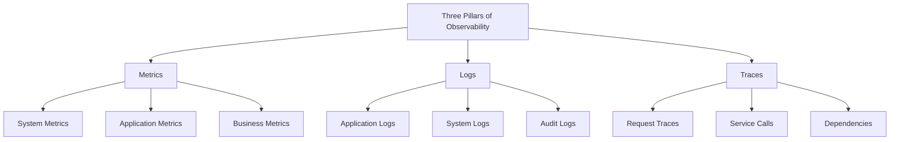

> **Production Environment Security Notice**
>
> This document contains directly executable operations commands. Before execution, please confirm: whether the current target cluster and namespace are correct; whether you have sufficient RBAC permissions; whether you have verified in non-production environments. Command risk levels: 🔴 High risk (may cause data loss or service interruption), 🟡 Medium risk (modifies cluster state, but usually reversible), 🟢 Low risk/read-only (information collection, no side effects).


# 01 - Kubernetes Observability Architecture System (Observability Architecture)

> **Applicable versions**: v1.25 - v1.32 | **Last updated**: 2026-01 | **Reference**: [kubernetes.io/docs/concepts/cluster-administration/monitoring](https://kubernetes.io/docs/concepts/cluster-administration/monitoring/)

<!-- chunk: Overview -->
## Overview

From a chief architect perspective, this document comprehensively explains the design philosophy, technical components, and implementation strategy of Kubernetes observability architecture, covering key areas such as metrics monitoring, log collection, distributed tracing, and alert management. Combined with Google SRE methodology and enterprise-grade production environment practices, it provides strategic guidance for enterprises to build a complete, reliable, and intelligent observability platform.

---

<!-- chunk: 1. Observability Architecture Design Principles -->
## 1. Observability Architecture Design Principles

### 1.1 Three Pillars Theory

#### Core Elements of Observability


#### Observability Data Characteristics Comparison
```yaml
observability_data_characteristics:
  metrics:
    data_structure: time_series
    sampling_rate: high_frequency
    storage_efficiency: high
    query_complexity: low
    use_cases:
      - system_monitoring
      - capacity_planning
      - performance_benchmarking
      
  logs:
    data_structure: text_unstructured
    sampling_rate: event_driven
    storage_efficiency: medium
    query_complexity: high
    use_cases:
      - troubleshooting
      - security_auditing
      - compliance_reporting
      
  traces:
    data_structure: distributed_spans
    sampling_rate: selective_sampling
    storage_efficiency: low
    query_complexity: medium
    use_cases:
      - performance_analysis
      - dependency_mapping
      - error_diagnosis
```

### 1.2 Architecture Design Principles

#### Unified Data Plane
```yaml
unified_observability_plane:
  data_ingestion:
    standardized_formats: 
      - opentelemetry_protocol
      - prometheus_exposition
      - fluent_bit_forward
      
  data_processing:
    stream_processing: true
    batch_processing: true
    real_time_analytics: true
    
  data_storage:
    hot_storage: in_memory_timeseries
    warm_storage: columnar_database
    cold_storage: object_storage
    
  data_access:
    unified_query_interface: true
    multi_tenancy_support: true
    rbac_integration: true
```

---

<!-- chunk: 2. Metrics Monitoring System Architecture -->
## 2. Metrics Monitoring System Architecture

### 2.1 Prometheus Ecosystem

#### Monitoring Architecture Topology
```yaml
prometheus_monitoring_stack:
  data_collection:
    node_exporter:
      metrics: system_resources
      scrape_interval: 15s
      
    kube_state_metrics:
      metrics: kubernetes_objects
      scrape_interval: 30s
      
    cadvisor:
      metrics: container_resources
      scrape_interval: 15s
      
  data_storage:
    prometheus_server:
      retention: 15d
      storage_tsdb_retention: 15d
      wal_compression: true
      
  data_query:
    prometheus_ui: native_interface
    grafana: visualization_layer
    alertmanager: alert_routing
    
  federation:
    thanos_sidecar: long_term_storage
    thanos_querier: global_query
    thanos_store: object_storage_integration
```

### 2.2 Key Monitoring Metrics Classification

#### Core Component Metrics
| Component Category | Key Metrics | Alert Threshold | Operations Value |
|---------|---------|---------|---------|
| **API Server** | Request latency, error rate, QPS | P99>1s, 5xx>1% | API health |
| **etcd** | Leader switchover, disk latency, database size | >3 times/hour, P99>10ms | Data storage stability |
| **Scheduler** | Scheduling latency, pending pod count | P99>5s, >100 pods | Scheduling performance |
| **Controller** | Queue depth, processing latency | >100 items, P99>30s | Controller health |
| **Kubelet** | PLEG latency, pod startup time | P99>3s, >60s | Node stability |

---

<!-- chunk: 3. Log Collection Architecture -->
## 3. Log Collection Architecture

### 3.1 Log Architecture Patterns

#### Three-Layer Logging Architecture
```
Application Layer Logs
    ├─ Business logs (stdout/stderr)
    ├─ Access logs (access.log)
    └─ Error logs (error.log)
          ↓
Container Runtime Layer
    ├─ Docker/Containerd log drivers
    └─ Log files (/var/log/containers/*.log)
          ↓
Infrastructure Layer
    ├─ Node-level collectors (DaemonSet)
    ├─ Sidecar collectors
    └─ Application direct push
```

### 3.2 Log Component Selection

#### Production-Grade Logging Stack
| Component | Type | Features | Version Requirement | ACK Alternative |
|-----|------|------|---------|---------|
| **Fluent Bit** | Collector | Lightweight, high performance | v2.2+ | Logtail |
| **Loki** | Storage/Query | Label-based indexing, low cost | v2.9+ | SLS |
| **Grafana** | Visualization | Unified log query interface | v9.0+ | Native |
| **Promtail** | Collector | Loki-specific collector | v2.9+ | Logtail |

### 3.3 Structured Logging Best Practices

#### Recommended Log Format
```json
{
  "timestamp": "2026-01-18T10:30:00.123Z",
  "level": "ERROR",
  "service": "user-api",
  "trace_id": "abc123def456",
  "span_id": "span789",
  "user_id": "12345",
  "method": "POST",
  "path": "/api/users",
  "status": 500,
  "duration_ms": 234,
  "error": "Database connection timeout",
  "stack_trace": "...",
  "kubernetes": {
    "namespace": "production",
    "pod": "user-api-7d4f5b8c9-xk2p4",
    "container": "app",
    "node": "node-1"
  }
}
```

---

<!-- chunk: 4. Distributed Tracing System -->
## 4. Distributed Tracing System

### 4.1 OpenTelemetry Standard

#### Unified Observability Framework
```yaml
opentelemetry_components:
  instrumentation:
    auto_instrumentation: true
    manual_instrumentation: true
    language_support:
      - java
      - go
      - python
      - nodejs
      
  collector:
    receivers: [otlp, jaeger, zipkin]
    processors: [batch, memory_limiter, attributes]
    exporters: [jaeger, prometheus, loki]
    
  backend:
    traces: jaeger/tempo
    metrics: prometheus/victoria_metrics
    logs: loki/elasticsearch
```

### 4.2 Distributed Tracing Best Practices

#### Trace Design Principles
| Principle | Description | Implementation Key Points |
|-----|------|---------|
| **Trace Granularity** | Reasonable Span splitting | One Span per important business operation |
| **Context Propagation** | TraceID propagation across services | HTTP Header: traceparent |
| **Sampling Strategy** | Balance between cost and coverage | 10% sampling rate in production |
| **Attribute Annotation** | Key business information | User ID, order number, etc. |
| **Error Marking** | Explicitly mark exceptions | StatusCode: ERROR |

---

<!-- chunk: 5. Alert Management System -->
## 5. Alert Management System

### 5.1 Alert Strategy Design

#### SLO-Driven Alert Hierarchy
```yaml
alert_hierarchy:
  tier_1_critical:
    response_time: 15 minutes
    channels: [phone, sms]
    examples:
      - KubeAPIServerDown
      - EtcdNoLeader
      - NodeNotReady
      
  tier_2_warning:
    response_time: 1 hour
    channels: [email, slack]
    examples:
      - HighErrorRate
      - DiskPressure
      - MemoryPressure
      
  tier_3_info:
    response_time: 4 hours
    channels: [slack]
    examples:
      - DeploymentRollout
      - HPAScaling
      - CertificateExpiring
```

### 5.2 Alert Rule Best Practices

#### Prometheus Alert Template
```yaml
groups:
- name: kubernetes.system
  rules:
  # Critical Alerts
  - alert: KubeAPIServerDown
    expr: absent(up{job="kubernetes-apiservers"} == 1)
    for: 5m
    labels:
      severity: critical
      tier: 1
    annotations:
      summary: "Kubernetes API Server is down"
      description: "API Server has been unreachable for more than 5 minutes"
      
  # Warning Alerts
  - alert: NodeMemoryPressure
    expr: (1 - node_memory_MemAvailable_bytes / node_memory_MemTotal_bytes) > 0.9
    for: 10m
    labels:
      severity: warning
      tier: 2
    annotations:
      summary: "Node {{ $labels.instance }} memory pressure"
      description: "Memory usage is above 90%"
```

---

<!-- chunk: 6. Visualization Dashboards -->
## 6. Visualization Dashboards

### 6.1 Grafana Dashboard Design

#### Core Monitoring Panels
| Dashboard Category | Key Metrics | Update Frequency | Purpose |
|-----------|---------|---------|------|
| **Cluster Overview** | Node status, pod distribution, resource usage | 30 seconds | Global health monitoring |
| **Node Details** | CPU/Memory/Disk usage | 15 seconds | Node performance analysis |
| **Pod Monitoring** | Restart count, resource usage, status changes | 30 seconds | Application stability |
| **Network Monitoring** | Traffic, connection count, error rate | 15 seconds | Network performance |
| **Storage Monitoring** | PVC usage, IOPS, latency | 30 seconds | Storage health |

### 6.2 Variables and Templates

#### Recommended Dashboard Variables
```json
{
  "templating": {
    "list": [
      {
        "name": "datasource",
        "type": "datasource",
        "query": "prometheus"
      },
      {
        "name": "cluster",
        "type": "query",
        "query": "label_values(up, cluster)",
        "multi": true
      },
      {
        "name": "namespace",
        "type": "query",
        "query": "label_values(kube_pod_info{cluster=\"$cluster\"}, namespace)",
        "multi": true
      },
      {
        "name": "pod",
        "type": "query",
        "query": "label_values(kube_pod_info{cluster=\"$cluster\", namespace=~\"$namespace\"}, pod)",
        "multi": true
      }
    ]
  }
}
```

---

<!-- chunk: 7. Cost Optimization Strategy -->
## 7. Cost Optimization Strategy

### 7.1 Data Storage Optimization

#### Tiered Storage Architecture
| Storage Tier | Data Type | Retention Period | Storage Medium | Cost Optimization |
|---------|---------|---------|---------|---------|
| **Hot Data** | Real-time metrics, recent logs | 7 days | SSD | High-frequency access |
| **Warm Data** | Historical metrics, monthly logs | 90 days | SATA | Periodic queries |
| **Cold Data** | Annual statistics, audit logs | 3 years | Object Storage | Archive backup |

### 7.2 Sampling and Filtering Strategy

#### Data Downsampling Strategy
```yaml
sampling_strategies:
  metrics_sampling:
    high_priority: 15s intervals
    medium_priority: 60s intervals
    low_priority: 300s intervals
    
  trace_sampling:
    production: 10%
    staging: 50%
    development: 100%
    
  log_filtering:
    debug_level: discard_after_24h
    info_level: retain_7days
    error_level: retain_90days
    audit_logs: retain_1year
```

---

<!-- chunk: 8. Production Implementation Roadmap -->
## 8. Production Implementation Roadmap

### 8.1 Deployment Phase Planning

#### Phased Implementation Strategy
```
Phase 1: Basic Monitoring (Weeks 1-2)
├─ Deploy Prometheus + Grafana
├─ Configure core component monitoring
└─ Establish basic alert rules

Phase 2: Logging System (Weeks 3-4)
├─ Deploy EFK/Loki stack
├─ Configure application log collection
└─ Establish log analysis workflow

Phase 3: Distributed Tracing (Weeks 5-6)
├─ Integrate OpenTelemetry
├─ Deploy Jaeger/Tempo
└─ Implement application instrumentation

Phase 4: Optimization and Enhancement (Weeks 7-8)
├─ Alert tuning
├─ Dashboard optimization
└─ Cost control implementation
```

### 8.2 Operations Best Practices

#### Production Operations Checklist
| Practice Area | Specific Measures | Check Frequency |
|---------|---------|---------|
| **Monitoring Coverage** | 100% core component monitoring | Weekly |
| **Alert Effectiveness** | Alert exercises and optimization | Monthly |
| **Data Backup** | Regular monitoring data backup | Daily |
| **Capacity Planning** | Storage capacity trend analysis | Quarterly |
| **Security Compliance** | Access control and audit logs | Continuous |

---

<!-- chunk: 9. ACK Observability Integration -->
## 9. ACK Observability Integration

### 9.1 Alibaba Cloud Product Integration

#### One-Stop Observability
| Function | ACK Product | Configuration Method | Advantages |
|-----|---------|---------|------|
| **Metrics Monitoring** | ARMS Prometheus | One-click console activation | Maintenance-free, automatic discovery |
| **Log Collection** | SLS | Logtail DaemonSet | High performance, storage management-free |
| **Application Monitoring** | ARMS APM | Agent auto-injection | Non-invasive code |
| **Distributed Tracing** | ARMS Tracing | SDK integration | Full-chain visualization |
| **Alert Notification** | Cloud Monitor | Console configuration | Multi-channel notifications |

### 9.2 Hybrid Deployment Strategy

#### Local + Cloud Services Hybrid Architecture
```yaml
hybrid_observability:
  metrics:
    primary: arms_prometheus
    fallback: local_prometheus
    
  logs:
    primary: sls
    backup: local_loki
    
  traces:
    primary: arms_tracing
    secondary: local_jaeger
    
  alerting:
    primary: arms_alerting
    notification: aliyun_sms_email
```

---

**Core Principles**: SLO-driven, three pillars equally important, phased implementation, continuous optimization

---

**Architecture Evolution**: From passive monitoring to active alerting, from single metrics to full-stack observability, from business black box to transparent insights

---
<!-- chunk: Related Document References -->
## Related Document References

- [02-Monitoring Metrics System Details](02-monitoring-metrics-system.md) - Deep dive into metrics monitoring implementation details
- [03-Logging Architecture Design and Implementation](03-logging-architecture.md) - Master enterprise-grade log collection solutions
- [04-Distributed Tracing System](04-distributed-tracing.md) - Learn full-chain tracing technical practices
- [16-Large-Scale Cluster Monitoring Best Practices](16-enterprise-scale-monitoring.md) - Understand enterprise-grade monitoring architecture
- [22-SLO/SLI System Development and Management](22-slo-sli-system.md) - Master service quality management methodology

---

<!-- chunk: Obsidian Related Documents -->
## Obsidian Related Documents

- domain-06-observability MOC
- [[domain-06-observability/README.md|Observability Domain]]
- [[domain-06-observability/00-open-source-projects-index.md|Domain-6 Observability — Open Source Projects Index]]
- Metrics Monitoring System Details
- 03 - Log Collection Architecture Details (Logging Architecture)
- Distributed Tracing System
- 05 - Alert Management Strategy (Alerting Management)
- 06 - Monitoring Alert Practice and Best Practices (Monitoring Alerting Practice)
- 04 - Monitoring Dashboard Design and Best Practices (Monitoring Dashboards)
- 08 - Logging Auditing and Compliance Management (Logging Auditing & Compliance)
- 05 - Events and Audit Log Management (Events & Audit Logs)
- 07 - Monitoring and Metrics Table

## Related

- [[MOC]]
- [[concepts/Operator Pattern × Observability.md|Operator Pattern × Observability]]
- 77-fusion-energy-monitoring

- Metrics Monitoring System
- Distributed Tracing System
- [[domain-17-system-foundation/topic-cheat-sheet/promql.md|PromQL Cheatsheet]]
- Related knowledge domain: domain-01-cluster-fundamentals
- Related knowledge domain: domain-02-workloads-applications
- Related knowledge domain: domain-03-networking-traffic
- Related knowledge domain: domain-07-platform-engineering
- [[domain-17-system-foundation/topic-cheat-sheet/promql.md|Cheatsheet: promql]]

- [[domain-06-observability/README.md|Back to index]]- [[domain-19-landscape-references/topic-index/observability-index.md|Observability Knowledge Graph Index]]

## See Also

- QUALITY-REPORT
- UPDATED-QUALITY-REPORT
- 02-monitoring-metrics-system
- 03-logging-architecture


<!-- risk-assessed -->
