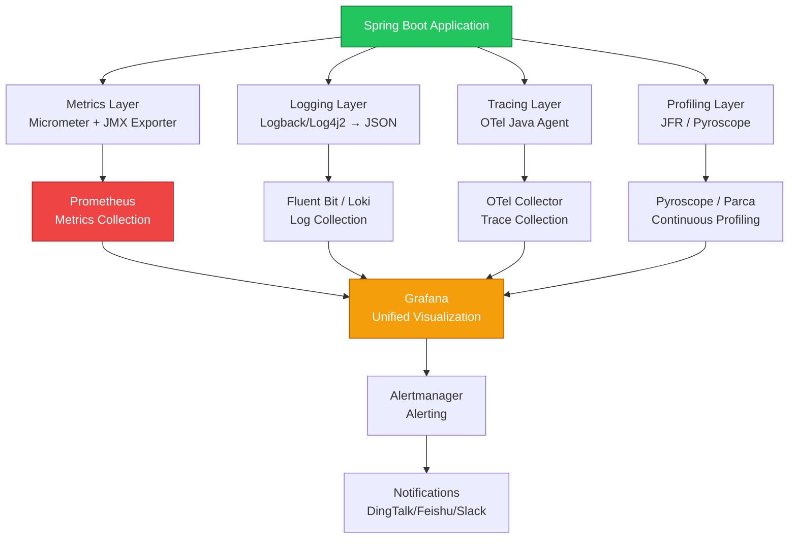

---title: Java Application Kubernetes Observability Integration Guide
description: 'title: Java Application Kubernetes Observability Integration Guide'
summary: 'title: Java Application Kubernetes Observability Integration Guide'
category: general
tags:
- k8s
- observability
- prometheus
- monitoring
- guide
- grafana
- jaeger
- opa
- job
- operator
tier: supporting
created: '2026-05-23'
last_updated: 2026-05
difficulty: intermediate
reading_level: intermediate
audience:
- All Engineers
estimated_read_time: 25min
intent_queries:
- What is Kubernetes?
- How to use Kubernetes?
- What are the best practices for Kubernetes?
trigger_keywords:
- Java
- Application
- Kubernetes
- Observability Integration Guide
- observability
prerequisites:
- kubectl-basics
- observability-basics
- prometheus-basics
- monitoring-basics
- policy-basics
- logging-basics
- tracing-basics
original_language: Chinese
authors:
- name: Dillan Teagle
  role: contributor
source_path: /Users/teaglebuilt/workspace/kudig-database/domain-06-observability/01-overview/99-java-observability-kubernetes-guide.md
---

> **Production Environment Security Tips**
>
> This document contains directly executable operational commands. Before execution, please confirm: whether the target cluster and Namespace are correct; whether you have sufficient RBAC permissions; whether it has been verified in a non-production environment. Command risk levels are marked as: 🔴 High risk (may cause data loss or service interruption), 🟡 Medium risk (modifies cluster state but usually reversible), 🟢 Low risk/read-only (information collection, no side effects).


title: Java Application [[Kubernetes|Kubernetes]] Observability Integration Guide
description: '# Java Application Kubernetes Observability Integration Guide'
category: observability
tags:
- k8s
- observability
- monitoring
- logging
- tracing
- prometheus
- grafana
- jaeger
- opa
- job
last_updated: 2026-05
difficulty: intermediate
reading_level: intermediate
audience:
- SRE
- DevOps Engineers
- Monitoring Engineers
estimated_read_time: 5min
intent_queries:
- What is Java Application Kubernetes Observability Integration Guide
- How to implement Java Application Kubernetes Observability Integration Guide
- Kubernetes observability best practices
trigger_keywords:
- Java
- Application
- Kubernetes
- Observability Integration Guide
- observability
cross_refs:
- type: domain
  path: ../domain-01-cluster-fundamentals/
  label: 'Related knowledge domain: domain-01-cluster-fundamentals'
- type: domain
  path: ../domain-02-workloads-applications/
  label: 'Related knowledge domain: domain-02-workloads-applications'
- type: domain
  path: ../domain-03-networking-traffic/
  label: 'Related knowledge domain: domain-03-networking-traffic'
- type: domain
  path: ../domain-07-platform-engineering/
  label: 'Related knowledge domain: domain-07-platform-engineering'
- type: cheatsheet
  path: ../domain-17-system-foundation/topic-cheat-sheet/promql.md
  label: 'Quick Reference: promql'
authors:
- name: Dillan Teagle
  role: contributor
k8s_versions:
- '1.28'
- '1.29'
- '1.30'
- '1.31'
- '1.32'
---

# Java Application Kubernetes Observability Integration Guide

> **Applicable Versions**: Spring Boot 3.4+ / Micrometer 1.14+ / OpenTelemetry Java Agent 2.x / Prometheus 2.50+  
> **Last Updated**: 2026-04-30  
> **Difficulty**: Advanced

---

<!-- chunk: 📋 Table of Contents -->
## 📋 Table of Contents

- [1. Java Observability Architecture Overview](#1-java-observability-architecture-overview)
- [2. Micrometer + Prometheus Metrics System](#2-micrometer--prometheus-metrics-system)
- [3. JMX Exporter JVM Deep Monitoring](#3-jmx-exporter-jvm-deep-monitoring)
- [4. OpenTelemetry Java Agent Configuration](#4-opentelemetry-java-agent-configuration)
- [5. Structured Logging Output](#5-structured-logging-output)
- [6. Grafana Dashboard Template](#6-grafana-dashboard-template)
- [7. Alert Rule System](#7-alert-rule-system)
- [8. Distributed Tracing Integration](#8-distributed-tracing-integration)
- [9. Profiling Integration](#9-profiling-integration)
- [10. Observability Checklist](#10-observability-checklist)

---

<!-- chunk: 1. Java Observability Architecture Overview -->
## 1. Java Observability Architecture Overview



---

<!-- chunk: 2. Micrometer + Prometheus Metrics System -->
## 2. Micrometer + Prometheus Metrics System

### 2.1 Spring Boot Micrometer Configuration

```yaml
# application.yml
management:
  endpoints:
    web:
      exposure:
        include: health,info,prometheus,metrics
  endpoint:
    health:
      show-details: when-authorized
      probes:
        enabled: true
  prometheus:
    metrics:
      export:
        enabled: true
  metrics:
    tags:
      application: ${spring.application.name}
      namespace: ${KUBERNETES_NAMESPACE:default}
      pod: ${HOSTNAME:unknown}
      version: ${APP_VERSION:unknown}
    distribution:
      percentiles-histogram:
        http.server.requests: true
        http.client.requests: true
        spring.data.repository.invocations: true
      slo:
        http.server.requests: 50ms,100ms,200ms,500ms,1000ms
    enable:
      jvm: true
      process: true
      system: true
      tomcat: true
      logback: true
      hikaricp: true
      spring: true
  server:
    port: 8081
```

### 2.2 Custom Business Metrics

```java
@Configuration
public class MetricsConfig {

    @Bean
    public MeterRegistryCustomizer<MeterRegistry> commonTags() {
        return registry -> registry.config()
            .commonTags(
                "application", registry.getClass().getName()
            );
    }
}

@Service
public class OrderService {
    private final Counter orderCounter;
    private final Timer orderTimer;
    private final Gauge orderQueueGauge;

    public OrderService(MeterRegistry registry, OrderQueue queue) {
        this.orderCounter = Counter.builder("orders.created.total")
            .description("Total orders created")
            .tag("type", "online")
            .register(registry);

        this.orderTimer = Timer.builder("orders.processing.duration")
            .description("Order processing duration")
            .publishPercentiles(0.5, 0.95, 0.99)
            .publishPercentileHistogram()
            .register(registry);

        this.orderQueueGauge = Gauge.builder("orders.queue.size", queue, OrderQueue::size)
            .description("Current order queue size")
            .register(registry);
    }

    public Order createOrder(OrderRequest request) {
        return orderTimer.record(() -> {
            Order order = doCreateOrder(request);
            orderCounter.increment();
            return order;
        });
    }
}
```

### 2.3 HikariCP Connection Pool Metrics

```yaml
# application.yml
spring:
  datasource:
    hikari:
      metrics-tracker: true
      register-mbeans: true
      pool-name: spring-app-hikari

# Micrometer automatically collects HikariCP metrics:
# - hikaricp_connections_active
# - hikaricp_connections_idle
# - hikaricp_connections_pending
# - hikaricp_connections_max
# - hikaricp_connections_min
# - hikaricp_connections_timeout_total
# - hikaricp_connections_creation_seconds
# - hikaricp_connections_usage_seconds
```

### 2.4 K8s ServiceMonitor

```yaml
apiVersion: monitoring.coreos.com/v1
kind: ServiceMonitor
metadata:
  name: spring-app-metrics
  namespace: production
  labels:
    release: prometheus
spec:
  selector:
    matchLabels:
      app-type: spring-boot
  namespaceSelector:
    matchNames:
      - production
      - staging
  endpoints:
    - port: management
      path: /actuator/prometheus
      interval: 15s
      scrapeTimeout: 10s
      honorLabels: true
```

---

<!-- chunk: 3. JMX Exporter JVM Deep Monitoring -->
## 3. JMX Exporter JVM Deep Monitoring

### 3.1 JMX Exporter Agent Deployment

```yaml
apiVersion: apps/v1
kind: Deployment
metadata:
  name: spring-app
spec:
  template:
    spec:
      initContainers:
        - name: download-jmx-exporter
          image: busybox:1.36
          command:
            - sh
            - -c
            - |
              wget -q -O /agent/jmx_prometheus_javaagent.jar \
                https://repo1.maven.org/maven2/io/prometheus/jmx/jmx_prometheus_javaagent/0.20.0/jmx_prometheus_javaagent-0.20.0.jar
          volumeMounts:
            - name: jmx-agent
              mountPath: /agent
      containers:
        - name: app
          image: registry.example.com/spring-app:v1.0.0
          env:
            - name: JAVA_TOOL_OPTIONS
              value: "-javaagent:/agent/jmx_prometheus_javaagent.jar=9404:/config/jmx-config.yaml"
          ports:
            - name: http
              containerPort: 8080
            - name: management
              containerPort: 8081
            - name: jmx-metrics
              containerPort: 9404
          volumeMounts:
            - name: jmx-agent
              mountPath: /agent
            - name: jmx-config
              mountPath: /config
      volumes:
        - name: jmx-agent
          emptyDir: {}
        - name: jmx-config
          configMap:
            name: jmx-exporter-config
```

### 3.2 JMX Exporter Configuration

```yaml
# jmx-exporter-config.yaml (K8s ConfigMap)
apiVersion: v1
kind: ConfigMap
metadata:
  name: jmx-exporter-config
data:
  jmx-config.yaml: |
    lowercaseOutputName: true
    lowercaseOutputLabelNames: true
    rules:
      - pattern: "java.lang<type=Memory><HeapMemoryUsage>(used|max|committed)"
        name: jvm_memory_heap_$1_bytes
        type: GAUGE
      - pattern: "java.lang<type=Memory><NonHeapMemoryUsage>(used|max|committed)"
        name: jvm_memory_nonheap_$1_bytes
        type: GAUGE
      - pattern: "java.lang<type=GarbageCollector, name=(.+)><>CollectionTime"
        name: jvm_gc_collection_seconds_sum
        type: COUNTER
        labels:
          gc: "$1"
      - pattern: "java.lang<type=GarbageCollector, name=(.+)><>CollectionCount"
        name: jvm_gc_collection_seconds_count
        type: COUNTER
        labels:
          gc: "$1"
      - pattern: "java.lang<type=Threading><>(ThreadCount|PeakThreadCount|DaemonThreadCount)"
        name: jvm_threads_$1
        type: GAUGE
      - pattern: "java.lang<type=MemoryPool, name=(.+)><Usage>used"
        name: jvm_memory_pool_used_bytes
        type: GAUGE
        labels:
          pool: "$1"
      - pattern: "java.lang<type=Runtime><>Uptime"
        name: jvm_uptime_seconds
        type: GAUGE
        value: "$1 / 1000"
      - pattern: "java.nio<type=BufferPool, name=(.+)><>(Count|MemoryUsed|TotalCapacity)"
        name: jvm_buffer_pool_$2
        type: GAUGE
        labels:
          pool: "$1"
```

---

<!-- chunk: 4. OpenTelemetry Java Agent Configuration -->
## 4. OpenTelemetry Java Agent Configuration

### 4.1 OTel Agent Deployment

```yaml
apiVersion: apps/v1
kind: Deployment
metadata:
  name: spring-app
spec:
  template:
    spec:
      initContainers:
        - name: download-otel-agent
          image: busybox:1.36
          command:
            - sh
            - -c
            - |
              wget -q -O /otel/opentelemetry-javaagent.jar \
                https://github.com/open-telemetry/opentelemetry-java-instrumentation/releases/download/v2.10.0/opentelemetry-javaagent.jar
          volumeMounts:
            - name: otel-agent
              mountPath: /otel
      containers:
        - name: app
          image: registry.example.com/spring-app:v1.0.0
          env:
            - name: JAVA_TOOL_OPTIONS
              value: "-javaagent:/otel/opentelemetry-javaagent.jar"
            - name: OTEL_SERVICE_NAME
              value: "spring-app"
            - name: OTEL_EXPORTER_OTLP_ENDPOINT
              value: "http://otel-collector.observability:4317"
            - name: OTEL_EXPORTER_OTLP_PROTOCOL
              value: "grpc"
            - name: OTEL_RESOURCE_ATTRIBUTES
              value: "service.namespace=production,service.version=v1.0.0"
            - name: OTEL_TRACES_SAMPLER
              value: "parentbased_traceidratio"
            - name: OTEL_TRACES_SAMPLER_ARG
              value: "0.1"
            - name: OTEL_METRICS_EXPORTER
              value: "prometheus,otlp"
            - name: OTEL_LOGS_EXPORTER
              value: "otlp"
            - name: OTEL_PROPAGATORS
              value: "tracecontext,baggage"
          volumeMounts:
            - name: otel-agent
              mountPath: /otel
      volumes:
        - name: otel-agent
          emptyDir: {}
```

### 4.2 OTel Collector Configuration

```yaml
apiVersion: opentelemetry.io/v1beta1
kind: OpenTelemetryCollector
metadata:
  name: otel
  namespace: observability
spec:
  config:
    receivers:
      otlp:
        protocols:
          grpc:
            endpoint: 0.0.0.0:4317
          http:
            endpoint: 0.0.0.0:4318
    processors:
      batch:
        send_batch_size: 1024
        timeout: 5s
      memory_limiter:
        check_interval: 1s
        limit_mib: 512
      resource:
        attributes:
          - key: collector.source
            value: "k8s"
            action: upsert
    exporters:
      otlp/jaeger:
        endpoint: jaeger-collector.observability:4317
        tls:
          insecure: true
      prometheus:
        endpoint: 0.0.0.0:8889
      otlp/loki:
        endpoint: loki.observability:4317
        tls:
          insecure: true
    service:
      pipelines:
        traces:
          receivers: [otlp]
          processors: [memory_limiter, batch]
          exporters: [otlp/jaeger]
        metrics:
          receivers: [otlp]
          processors: [memory_limiter, batch]
          exporters: [prometheus]
        logs:
          receivers: [otlp]
          processors: [memory_limiter, batch]
          exporters: [otlp/loki]
```

### 4.3 OTel Operator Auto-Injection

```yaml
apiVersion: opentelemetry.io/v1alpha1
kind: Instrumentation
metadata:
  name: java-instrumentation
  namespace: observability
spec:
  exporter:
    endpoint: http://otel-collector.observability:4317
  propagators:
    - tracecontext
    - baggage
  sampler:
    type: parentbased_traceidratio
    argument: "0.1"
  java:
    image: ghcr.io/open-telemetry/opentelemetry-operator/autoinstrumentation-java:latest
    env:
      - name: OTEL_EXPORTER_OTLP_PROTOCOL
        value: grpc
---
# Simply add annotations for auto-injection
apiVersion: apps/v1
kind: Deployment
metadata:
  name: spring-app
  annotations:
    instrumentation.opentelemetry.io/inject-java: "observability/java-instrumentation"
spec:
  template:
    metadata:
      annotations:
        instrumentation.opentelemetry.io/inject-java: "observability/java-instrumentation"
```

---

<!-- chunk: 5. Structured Logging Output -->
## 5. Structured Logging Output

### 5.1 Logback JSON Configuration

```xml
<!-- logback-spring.xml -->
<configuration>
    <springProfile name="!development">
        <appender name="JSON" class="ch.qos.logback.core.ConsoleTarget">
            <encoder class="net.logstash.logback.encoder.LogstashEncoder">
                <includeContext>true</includeContext>
                <includeMdc>true</includeMdc>
                <includeStructuredArguments>true</includeStructuredArguments>
                <includeNonStructuredArguments>false</includeNonStructuredArguments>
                <includeTags>true</includeTags>
                <includeCallerData>false</includeCallerData>
                <customFields>{
                    "service.name": "${spring.application.name}",
                    "service.namespace": "${KUBERNETES_NAMESPACE:-default}",
                    "service.version": "${APP_VERSION:-unknown}"
                }</customFields>
                <fieldNames>
                    <timestamp>timestamp</timestamp>
                    <version>[ignore]</version>
                    <levelValue>[ignore]</levelValue>
                    <level>level</level>
                    <logger>logger</logger>
                    <thread>thread</thread>
                    <message>message</message>
                    <stackTrace>stack_trace</stackTrace>
                    <context>context</context>
                </fieldNames>
            </encoder>
        </appender>
        <root level="INFO">
            <appender-ref ref="JSON"/>
        </root>
    </springProfile>

    <springProfile name="development">
        <appender name="CONSOLE" class="ch.qos.logback.core.ConsoleTarget">
            <encoder>
                <pattern>%d{yyyy-MM-dd HH:mm:ss.SSS} [%thread] %-5level %logger{36} - %msg%n</pattern>
            </encoder>
        </appender>
        <root level="DEBUG">
            <appender-ref ref="CONSOLE"/>
        </root>
    </springProfile>
</configuration>
```

### 5.2 MDC Trace ID Injection

```java
@Component
public class TraceIdFilter implements Filter {
    @Override
    public void doFilter(ServletRequest request, ServletResponse response, FilterChain chain)
            throws IOException, ServletException {
        MDC.put("trace_id", getCurrentTraceId());
        MDC.put("span_id", getCurrentSpanId());
        try {
            chain.doFilter(request, response);
        } finally {
            MDC.remove("trace_id");
            MDC.remove("span_id");
        }
    }

    private String getCurrentTraceId() {
        Span currentSpan = Span.current();
        if (currentSpan.getSpanContext().isValid()) {
            return currentSpan.getSpanContext().getTraceId();
        }
        return "";
    }
}
```

### 5.3 Fluent Bit Multi-line Log Parsing

```yaml
# Fluent Bit ConfigMap - Java Stacktrace Merging
apiVersion: v1
kind: ConfigMap
metadata:
  name: fluent-bit-parser
data:
  parsers.conf: |
    [MULTILINE_PARSER]
        Name          multiline-java
        Type          regex
        Flush_Timeout 1000
        Rule      "start_state"  "/^\d{4}-\d{2}-\d{2}/"  "cont"
        Rule      "cont"         "/^\s+at\s/"             "cont"
        Rule      "cont"         "/^\s+.../"              "cont"
        Rule      "cont"         "/^\s*Caused by:/"       "cont"
        Rule      "cont"         "/^\s*\.\.\.\s+\d+ more/" "cont"
        Rule      "cont"         "/^[^\s]/"               "start_state"
```

---

<!-- chunk: 6. Grafana Dashboard Template -->
## 6. Grafana Dashboard Template

### 6.1 Key Metrics Dashboard

| Panel | PromQL | Description |
|------|--------|------|
| **QPS** | `rate(http_server_requests_seconds_count{uri!~".*actuator.*"}[5m])` | Request rate |
| **P50/P95/P99 Latency** | `histogram_quantile(0.99, rate(http_server_requests_seconds_bucket[5m]))` | Latency distribution |
| **Error Rate** | `rate(http_server_requests_seconds_count{status=~"5.."}[5m]) / rate(http_server_requests_seconds_count[5m])` | 5xx ratio |
| **JVM Heap Usage** | `jvm_memory_used_bytes{area="heap"} / jvm_memory_max_bytes{area="heap"}` | Heap utilization |
| **GC Pause** | `rate(jvm_gc_pause_seconds_sum[5m])` | GC pause time |
| **GC Frequency** | `rate(jvm_gc_pause_seconds_count[5m])` | GC frequency |
| **Active Threads** | `jvm_threads_live_threads` | Active thread count |
| **Connection Pool Usage** | `hikaricp_connections_active / hikaricp_connections_max` | Connection pool utilization |
| **CPU Usage** | `process_cpu_usage` | JVM CPU utilization |
| **Pod Memory** | `container_memory_working_set_bytes{container="app"}` | Container memory |

### 6.2 Dashboard JSON Import

Recommended Grafana Dashboards to import:
- **JVM (Micrometer)**: Dashboard ID `4701`
- **Spring Boot Statistics**: Dashboard ID `12900`
- **Spring Boot 3**: Dashboard ID `19004`
- **Kubernetes Pod**: Dashboard ID `6417`

---

<!-- chunk: 7. Alert Rule System -->
## 7. Alert Rule System

### 7.1 Java Application Alert Rules

```yaml
apiVersion: monitoring.coreos.com/v1
kind: PrometheusRule
metadata:
  name: java-app-alerts
  namespace: production
spec:
  groups:
    - name: java.application
      rules:
        - alert: SpringBootApplicationDown
          expr: up{job=~"spring-app.*"} == 0
          for: 1m
          labels:
            severity: critical
          annotations:
            summary: "Spring Boot application down ({{ $labels.instance }})"

        - alert: HighErrorRate
          expr: |
            sum(rate(http_server_requests_seconds_count{status=~"5.."}[5m])) by (service)
            / sum(rate(http_server_requests_seconds_count[5m])) by (service)
            > 0.05
          for: 5m
          labels:
            severity: warning
          annotations:
            summary: "High error rate ({{ $labels.service }})"
            description: "5xx error rate {{ $value | humanizePercentage }}"

        - alert: HighLatencyP99
          expr: |
            histogram_quantile(0.99,
              sum(rate(http_server_requests_seconds_bucket{uri!~".*actuator.*"}[5m])) by (le, service)
            ) > 2
          for: 5m
          labels:
            severity: warning
          annotations:
            summary: "High P99 latency ({{ $labels.service }})"

        - alert: JVMHeapUsageHigh
          expr: |
            sum(jvm_memory_used_bytes{area="heap"}) by (pod)
            / sum(jvm_memory_max_bytes{area="heap"}) by (pod)
            > 0.85
          for: 10m
          labels:
            severity: warning

        - alert: JVMGCFrequentFullGC
          expr: |
            rate(jvm_gc_pause_seconds_count{action="end of major GC"}[5m]) > 0.03
          for: 5m
          labels:
            severity: warning

        - alert: HikariCPConnectionsExhausted
          expr: |
            hikaricp_connections_active / hikaricp_connections_max > 0.9
          for: 5m
          labels:
            severity: warning

        - alert: HighThreadCount
          expr: jvm_threads_live_threads > 500
          for: 10m
          labels:
            severity: warning
```

---

<!-- chunk: 8. Distributed Tracing Integration -->
## 8. Distributed Tracing Integration

### 8.1 Spring Boot 3 + Micrometer Tracing

```xml
<dependency>
    <groupId>io.micrometer</groupId>
    <artifactId>micrometer-tracing-bridge-otel</artifactId>
</dependency>
<dependency>
    <groupId>io.opentelemetry</groupId>
    <artifactId>opentelemetry-exporter-otlp</artifactId>
</dependency>
```

### 8.2 RestTemplate Propagate Trace Context

```java
@Configuration
public class RestClientConfig {

    @Bean
    public RestTemplate restTemplate(RestTemplateBuilder builder) {
        return builder
            .setConnectTimeout(Duration.ofSeconds(5))
            .setReadTimeout(Duration.ofSeconds(10))
            .build();
    }
}
```

---

<!-- chunk: 9. Profiling Integration -->
## 9. Profiling Integration

### 9.1 Pyroscope Java Agent

```yaml
env:
  - name: JAVA_TOOL_OPTIONS
    value: >-
      -javaagent:/pyroscope/pyroscope.jar
      -Dpyroscope.application.name=spring-app
      -Dpyroscope.profiler.event=itimer
      -Dpyroscope.server.address=http://pyroscope.observability:4040
      -Dpyroscope.format=jfr
```

### 9.2 JFR Continuous Recording

> ⚠️ **🟡 Medium Risk Change** — Modifies cluster resource state, recommend --dry-run or diff confirmation first
> - `kubectl exec`: Enter container to execute commands, may modify container state

``` bash
# 🟡 Medium risk: modifies cluster/resource state, confirm target, impact scope and authorization before execution
# Start JFR recording in K8s
kubectl exec deployment/spring-app -- \
  jcmd 1 JFR.start \
    name=continuous \
    settings=profile \
    maxage=1h \
    maxsize=100m

# Export JFR recording
kubectl exec deployment/spring-app -- \
  jcmd 1 JFR.dump \
    name=continuous \
    filename=/tmp/recording.jfr

# Download to local for analysis
kubectl cp deployment/spring-app:/tmp/recording.jfr ./recording.jfr
```
---

<!-- chunk: 10. Observability Checklist -->
## 10. Observability Checklist

| Layer | Checklist Item | Configuration | Priority |
|------|--------|------|--------|
| **Metrics** | Prometheus endpoint exposed | `/actuator/prometheus` | P0 |
| **Metrics** | JVM metrics collection | Micrometer + JMX Exporter | P0 |
| **Metrics** | Business metrics registration | `Counter/Timer/Gauge` | P1 |
| **Metrics** | Connection pool metrics | HikariCP metrics | P1 |
| **Logging** | JSON format output | `LogstashEncoder` | P0 |
| **Logging** | Trace ID correlation | MDC + OTel Bridge | P1 |
| **Logging** | Multi-line log merging | Fluent Bit multiline parser | P1 |
| **Tracing** | OTel Agent injection | Init Container / OTel Operator | P1 |
| **Tracing** | Trace context propagation | `tracecontext,baggage` | P1 |
| **Dashboard** | JVM Dashboard | Grafana 4701 | P1 |
| **Dashboard** | Spring Boot Dashboard | Grafana 19004 | P1 |
| **Alert** | Error rate alert | `> 5%` for 5m | P0 |
| **Alert** | Frequent GC alert | Full GC > 3/min | P0 |
| **Alert** | Heap memory alert | `> 85%` for 10m | P1 |
| **Profiling** | Continuous Profiling | Pyroscope / JFR | P2 |

---

<!-- chunk: 🔗 Related Documentation -->
## 🔗 Related Documentation

- [Spring Boot on K8s](../domain-02-workloads-applications/99-spring-boot-kubernetes-guide.md) — Spring Boot deployment
- [JVM GC Container Tuning](../domain-10-troubleshooting-diagnostics/99-jvm-gc-container-tuning-guide.md) — GC monitoring and tuning
- [Distributed Tracing Guide](../domain-06-observability/99-distributed-tracing-guide.md) — OTel deep practice
- [Prometheus Enterprise Monitoring](../domain-06-observability/99-prometheus-enterprise-guide.md) — Prometheus configuration
- [Performance Profiling Tools](../domain-06-observability/27-performance-profiling-tools.md) — Profiling toolchain

---

<!-- chunk: Obsidian Related Documentation -->
## Obsidian Related Documentation

- domain-06-observability MOC
- [[domain-06-observability/README.md|Observability Domain (Observability Domain)]]
- [[domain-06-observability/00-open-source-projects-index.md|Domain-8 Observability — Open Source Projects Index]]
- Kubernetes observability architecture system
- Metrics monitoring system details
- 03 - Logging collection architecture details (Logging Architecture)
- Distributed tracing system
- 05 - Alert management strategy (Alerting Management)
- 06 - Monitoring and alerting practice and best practices (Monitoring Alerting Practice)
- 04 - Monitoring dashboard design and best practices (Monitoring Dashboards)
- 08 - Logging audit and compliance management (Logging Auditing & Compliance)
- 05 - Event and audit log management (Events & Audit Logs)

## Related

- 12-demo-env-guide
- 21-platform-selection-guide

- [[domain-06-observability/README.md|Back to index]]- [[domain-19-landscape-references/topic-index/observability-index.md|Observability Knowledge Graph Index]]

## See Also

- 26-troubleshooting-tools
- 27-performance-profiling-tools
- 99-kubernetes-v1.33-observability-guide
- FINAL-QUALITY-ASSESSMENT


<!-- risk-assessed -->
