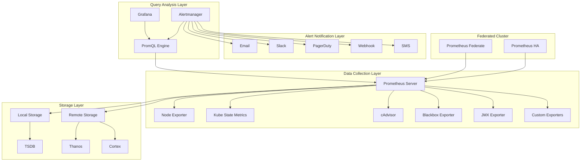

> **Production Environment Security Note**
>
> This document contains operational commands that can be executed directly. Before execution, please confirm: whether the current target cluster and namespace are correct; whether you have sufficient RBAC permissions; whether you have verified in a non-production environment first. Command risk levels are marked: 🔴 High risk (may cause data loss or service interruption), 🟡 Medium risk (modifies cluster state, but usually reversible), 🟢 Low risk/read-only (information collection, no side effects).


# Prometheus Enterprise Monitoring System In-Depth Practice

> **Author**: Monitoring System Architecture Expert | **Version**: v1.0 | **Updated**: 2026-02-07
> **Applicable Scenario**: Enterprise-grade monitoring platform architecture | **Complexity**: ⭐⭐⭐⭐⭐

<!-- chunk: 🎯 Summary -->## 🎯 Summary

This document provides an in-depth exploration of Prometheus enterprise-grade monitoring system architecture design, deployment practices, and operations management. Based on large-scale production environment experience, it offers a comprehensive technical guide from basic monitoring to advanced alerting, helping enterprises build efficient and reliable monitoring systems.

<!-- chunk: 1. Prometheus Architecture In-Depth Analysis -->## 1. Prometheus Architecture In-Depth Analysis

## 1.1 Core Component Architecture



## 1.2 TSDB Storage Engine Details

```yaml
TSDB Storage Features:
  Data Model:
    - Time Series Identifier: metric_name{label1=value1,label2=value2}
    - Sample Data: timestamp + value
    - Compressed Storage: Gorilla compression algorithm
    - Chunked Storage: 2 hours per block
  
  Performance Optimization:
    - Memory-mapped files (MMap)
    - Inverted index accelerates queries
    - Write-ahead log (WAL) ensures data durability
    - Block-level compression reduces storage space
  
  Storage Strategy:
    retention_time: 15d          # Data retention time
    block_duration: 2h           # Block duration
    compaction_strategy: "size"  # Compaction strategy
```

<!-- chunk: 2. Enterprise-Grade Deployment Architecture -->## 2. Enterprise-Grade Deployment Architecture

## 2.1 High Availability Deployment Solution

```yaml
# Prometheus HA Cluster Deployment
apiVersion: apps/v1
kind: StatefulSet
metadata:
  name: prometheus-server
  namespace: monitoring
spec:
  serviceName: prometheus-headless
  replicas: 2
  selector:
    matchLabels:
      app: prometheus
  template:
    metadata:
      labels:
        app: prometheus
    spec:
      affinity:
        podAntiAffinity:
          requiredDuringSchedulingIgnoredDuringExecution:
          - labelSelector:
              matchExpressions:
              - key: app
                operator: In
                values:
                - prometheus
            topologyKey: kubernetes.io/hostname
      containers:
      - name: prometheus
        image: prom/prometheus:v3.2.1
        args:
        - --config.file=/etc/prometheus/prometheus.yml
        - --storage.tsdb.path=/prometheus
        - --web.console.libraries=/etc/prometheus/console_libraries
        - --web.console.templates=/etc/prometheus/consoles
        - --storage.tsdb.retention.time=30d
        - --storage.tsdb.retention.size=50GB
        - --web.enable-lifecycle
        - --web.enable-admin-api
        - --web.external-url=http://prometheus.example.com
        - --web.route-prefix=/
        ports:
        - containerPort: 9090
          name: web
        resources:
          requests:
            memory: "2Gi"
            cpu: "1"
          limits:
            memory: "8Gi"
            cpu: "4"
        volumeMounts:
        - name: config-volume
          mountPath: /etc/prometheus
        - name: prometheus-storage
          mountPath: /prometheus
        livenessProbe:
          httpGet:
            path: /-/healthy
            port: web
          initialDelaySeconds: 30
          timeoutSeconds: 10
        readinessProbe:
          httpGet:
            path: /-/ready
            port: web
          initialDelaySeconds: 30
          timeoutSeconds: 10
      volumes:
      - name: config-volume
        configMap:
          name: prometheus-config
  volumeClaimTemplates:
  - metadata:
      name: prometheus-storage
    spec:
      accessModes: [ "ReadWriteOnce" ]
      storageClassName: "fast-ssd"
      resources:
        requests:
          storage: 100Gi
---
# Prometheus Configuration File
apiVersion: v1
kind: ConfigMap
metadata:
  name: prometheus-config
  namespace: monitoring
data:
  prometheus.yml: |
    global:
      scrape_interval: 15s
      evaluation_interval: 15s
      external_labels:
        cluster: production
        replica: $(POD_NAME)
    
    rule_files:
      - "/etc/prometheus/rules/*.yml"
    
    scrape_configs:
      - job_name: 'prometheus'
        static_configs:
        - targets: ['localhost:9090']
      
      - job_name: 'kubernetes-nodes'
        kubernetes_sd_configs:
        - role: node
        relabel_configs:
        - source_labels: [__address__]
          regex: '(.*):10250'
          target_label: __address__
          replacement: '${1}:9100'
        - action: labelmap
          regex: __meta_kubernetes_node_label_(.+)
      
      - job_name: 'kubernetes-pods'
        kubernetes_sd_configs:
        - role: pod
        relabel_configs:
        - source_labels: [__meta_kubernetes_pod_annotation_prometheus_io_scrape]
          action: keep
          regex: true
        - source_labels: [__meta_kubernetes_pod_annotation_prometheus_io_path]
          action: replace
          target_label: __metrics_path__
          regex: (.+)
        - source_labels: [__address__, __meta_kubernetes_pod_annotation_prometheus_io_port]
          action: replace
          regex: ([^:]+)(?::\d+)?;(\d+)
          replacement: $1:$2
          target_label: __address__
        - action: labelmap
          regex: __meta_kubernetes_pod_label_(.+)
        - source_labels: [__meta_kubernetes_namespace]
          action: replace
          target_label: kubernetes_namespace
        - source_labels: [__meta_kubernetes_pod_name]
          action: replace
          target_label: kubernetes_pod_name
```

## 2.2 Thanos Global View Architecture

```yaml
# Thanos Sidecar Configuration
apiVersion: apps/v1
kind: Deployment
metadata:
  name: thanos-sidecar
  namespace: monitoring
spec:
  replicas: 2
  selector:
    matchLabels:
      app: thanos-sidecar
  template:
    metadata:
      labels:
        app: thanos-sidecar
    spec:
      containers:
      - name: thanos-sidecar
        image: quay.io/thanos/thanos:v0.37.0
        args:
        - sidecar
        - --prometheus.url=http://localhost:9090
        - --grpc-address=0.0.0.0:10901
        - --http-address=0.0.0.0:10902
        - --objstore.config-file=/etc/thanos/objstore.yml
        - --tsdb.path=/prometheus
        - --reloader.config-file=/etc/prometheus/prometheus.yml
        - --reloader.rule-dir=/etc/prometheus/rules
        ports:
        - name: grpc
          containerPort: 10901
        - name: http
          containerPort: 10902
        volumeMounts:
        - name: prometheus-config
          mountPath: /etc/prometheus
        - name: objstore-config
          mountPath: /etc/thanos
        - name: prometheus-storage
          mountPath: /prometheus
      volumes:
      - name: prometheus-config
        configMap:
          name: prometheus-config
      - name: objstore-config
        configMap:
          name: thanos-objstore-config
      - name: prometheus-storage
        persistentVolumeClaim:
          claimName: prometheus-storage
---
# Thanos Query Frontend Configuration
apiVersion: apps/v1
kind: Deployment
metadata:
  name: thanos-query
  namespace: monitoring
spec:
  replicas: 2
  selector:
    matchLabels:
      app: thanos-query
  template:
    metadata:
      labels:
        app: thanos-query
    spec:
      containers:
      - name: thanos-query
        image: quay.io/thanos/thanos:v0.37.0
        args:
        - query
        - --grpc-address=0.0.0.0:10901
        - --http-address=0.0.0.0:10902
        - --query.replica-label=replica
        - --store=dnssrv+_grpc._tcp.thanos-sidecar.monitoring.svc.cluster.local
        - --store=dnssrv+_grpc._tcp.thanos-store.monitoring.svc.cluster.local
        - --store=dnssrv+_grpc._tcp.thanos-rule.monitoring.svc.cluster.local
        ports:
        - name: grpc
          containerPort: 10901
        - name: http
          containerPort: 10902
```

<!-- chunk: 3. Monitoring Metrics System Design -->## 3. Monitoring Metrics System Design

## 3.1 Golden Signals Monitoring

```yaml
# Core Business Metrics Monitoring
golden_signals:
  latency:
    description: "Request latency distribution"
    metrics:
      - histogram_quantile(0.5, rate(http_request_duration_seconds_bucket[5m]))
      - histogram_quantile(0.9, rate(http_request_duration_seconds_bucket[5m]))
      - histogram_quantile(0.99, rate(http_request_duration_seconds_bucket[5m]))
  
  traffic:
    description: "Request volume and throughput"
    metrics:
      - rate(http_requests_total[5m])
      - rate(http_requests_total{status=~"5.."}[5m])
  
  errors:
    description: "Error rate and success rate"
    metrics:
      - rate(http_requests_total{status=~"5.."}[5m]) / rate(http_requests_total[5m])
      - 1 - (sum(rate(http_requests_total{status!~"5.."}[5m])) / sum(rate(http_requests_total[5m])))
  
  saturation:
    description: "Resource utilization"
    metrics:
      - 100 - (avg(rate(node_cpu_seconds_total{mode="idle"}[5m])) * 100)
      - 100 * (1 - avg(node_memory_MemAvailable_bytes) / avg(node_memory_MemTotal_bytes))
      - 100 * avg(node_filesystem_avail_bytes{mountpoint="/"} / node_filesystem_size_bytes{mountpoint="/"})

# Application-Level Metrics
application_metrics:
  business_indicators:
    - orders_per_second
    - conversion_rate
    - user_sessions_active
    - payment_success_rate
  
  system_indicators:
    - goroutines_count
    - gc_duration_seconds
    - heap_alloc_bytes
    - response_size_bytes
```

## 3.2 Kubernetes Monitoring Metrics

```yaml
# Kubernetes Core Component Monitoring
kubernetes_monitoring:
  control_plane:
    apiserver:
      - apiserver_request_total
      - apiserver_request_duration_seconds
      - apiserver_current_inflight_requests
      - etcd_request_duration_seconds
    
    etcd:
      - etcd_mvcc_db_total_size_in_bytes
      - etcd_disk_wal_fsync_duration_seconds
      - etcd_network_client_grpc_received_bytes_total
      - etcd_server_has_leader
    
    controller_manager:
      - workqueue_depth
      - workqueue_queue_duration_seconds
      - node_collector_evictions_number
    
    scheduler:
      - scheduler_e2e_scheduling_duration_seconds
      - scheduler_pending_pods
      - scheduling_algorithm_duration_seconds
  
  workloads:
    pods:
      - kube_pod_status_ready
      - kube_pod_status_phase
      - container_cpu_usage_seconds_total
      - container_memory_working_set_bytes
      - container_network_receive_bytes_total
      - container_network_transmit_bytes_total
    
    deployments:
      - kube_deployment_status_replicas_available
      - kube_deployment_status_replicas_unavailable
      - kube_deployment_spec_replicas
      - kube_deployment_status_observed_generation
    
    services:
      - kube_service_info
      - kube_endpoint_address_available
      - kube_endpoint_address_not_ready
```

<!-- chunk: 4. Alert Rules Design -->## 4. Alert Rules Design

## 4.1 Infrastructure Alerts

```yaml
# Infrastructure Alert Rules
apiVersion: monitoring.coreos.com/v1
kind: PrometheusRule
metadata:
  name: infrastructure-alerts
  namespace: monitoring
spec:
  groups:
  - name: node.rules
    rules:
    # Node CPU usage alert
    - alert: NodeCPUHigh
      expr: 100 - (avg(rate(node_cpu_seconds_total{mode="idle"}[5m])) * 100) > 85
      for: 5m
      labels:
        severity: warning
      annotations:
        summary: "Node CPU usage is high (instance {{ $labels.instance }})"
        description: "CPU usage exceeds 85%, current value is {{ $value }}%"
    
    # Node memory usage alert
    - alert: NodeMemoryHigh
      expr: (1 - (node_memory_MemAvailable_bytes / node_memory_MemTotal_bytes)) * 100 > 90
      for: 5m
      labels:
        severity: critical
      annotations:
        summary: "Node memory usage is high (instance {{ $labels.instance }})"
        description: "Memory usage exceeds 90%, current value is {{ $value }}%"
    
    # Node disk space alert
    - alert: NodeDiskSpaceLow
      expr: (1 - (node_filesystem_free_bytes{fstype!="tmpfs"} / node_filesystem_size_bytes{fstype!="tmpfs"})) * 100 > 85
      for: 10m
      labels:
        severity: warning
      annotations:
        summary: "Node disk space is low (instance {{ $labels.instance }}, mountpoint {{ $labels.mountpoint }})"
        description: "Disk usage exceeds 85%, current value is {{ $value }}%"
    
    # Node network packet loss alert
    - alert: NodeNetworkPacketLoss
      expr: rate(node_network_receive_drop_total[5m]) > 10
      for: 5m
      labels:
        severity: warning
      annotations:
        summary: "Node network packet loss (instance {{ $labels.instance }})"
        description: "Network receive drop rate is high, current value is {{ $value }}pps"
```

## 4.2 Application-Level Alerts

```yaml
# Application-Level Alert Rules
  - name: application.rules
    rules:
    # HTTP error rate alert
    - alert: HighHttpErrorRate
      expr: rate(http_requests_total{status=~"5.."}[5m]) / rate(http_requests_total[5m]) > 0.05
      for: 2m
      labels:
        severity: critical
      annotations:
        summary: "HTTP error rate is high (service {{ $labels.service }})"
        description: "5xx error rate exceeds 5%, current value is {{ $value | humanizePercentage }}"
    
    # HTTP latency alert
    - alert: HighHttpLatency
      expr: histogram_quantile(0.99, rate(http_request_duration_seconds_bucket[5m])) > 2
      for: 2m
      labels:
        severity: warning
      annotations:
        summary: "HTTP latency is high (service {{ $labels.service }})"
        description: "99th percentile latency exceeds 2 seconds, current value is {{ $value }} seconds"
    
    # Application instance down alert
    - alert: ApplicationInstanceDown
      expr: up{job=~"application.*"} == 0
      for: 1m
      labels:
        severity: critical
      annotations:
        summary: "Application instance is down (instance {{ $labels.instance }})"
        description: "Application instance is unreachable, may have stopped or network issue"
    
    # Database connection pool alert
    - alert: DatabaseConnectionPoolFull
      expr: db_connections_used / db_connections_max > 0.9
      for: 3m
      labels:
        severity: warning
      annotations:
        summary: "Database connection pool is nearly full (database {{ $labels.database }})"
        description: "Connection pool usage exceeds 90%, current value is {{ $value | humanizePercentage }}"
```

<!-- chunk: 5. Alertmanager Configuration Management -->## 5. Alertmanager Configuration Management

## 5.1 Alert Routing Configuration

```yaml
# Alertmanager Configuration
global:
  resolve_timeout: 5m
  smtp_smarthost: 'smtp.example.com:587'
  smtp_from: 'alertmanager@example.com'
  smtp_auth_username: 'alertmanager'
  smtp_auth_password: 'password'
  smtp_require_tls: true

route:
  group_by: ['alertname', 'cluster', 'service']
  group_wait: 30s
  group_interval: 5m
  repeat_interval: 3h
  receiver: 'default-receiver'
  
  routes:
  # Critical business alerts
  - matchers:
    - severity="critical"
    receiver: pagerduty
    group_wait: 10s
    group_interval: 1m
    repeat_interval: 30m
  # Infrastructure alerts
  - matchers:
    - severity="warning"
    receiver: slack-warning
    group_wait: 1m
    group_interval: 10m
    repeat_interval: 2h
  # Alert suppression rules
  - matchers:
    - service=~"^(mysql|redis|elasticsearch)$"
    receiver: dba-team
    continue: true
receivers:
- name: 'default-receiver'
  email_configs:
  - to: 'team@example.com'
    send_resolved: true

- name: 'pagerduty'
  pagerduty_configs:
  - routing_key: 'YOUR_PAGERDUTY_SERVICE_KEY'
    send_resolved: true

- name: 'slack-warning'
  slack_configs:
  - api_url: 'https://hooks.slack.com/services/YOUR/SLACK/WEBHOOK'
    channel: '#monitoring-alerts'
    send_resolved: true
    title: '{{ template "slack.title" . }}'
    text: '{{ template "slack.text" . }}'

- name: 'dba-team'
  email_configs:
  - to: 'dba-team@example.com'
    send_resolved: true

# Suppression Rules
inhibit_rules:
- source_matchers:
  - severity="critical"
  - target_match=""
  - severity="warning"
  - equal="['alertname', 'cluster', 'service']"
templates:
- '/etc/alertmanager/template/*.tmpl'
```

<!-- chunk: 6. Monitoring Dashboard Design -->## 6. Monitoring Dashboard Design

## 6.1 Grafana Dashboard Configuration

```json
{
  "dashboard": {
    "id": null,
    "title": "Kubernetes Cluster Overview",
    "timezone": "browser",
    "schemaVersion": 16,
    "version": 0,
    "refresh": "30s",
    "panels": [
      {
        "type": "graph",
        "title": "Cluster CPU Usage",
        "gridPos": {
          "h": 8,
          "w": 12,
          "x": 0,
          "y": 0
        },
        "targets": [
          {
            "expr": "100 - (avg(rate(node_cpu_seconds_total{mode=\"idle\"}[5m])) * 100)",
            "legendFormat": "CPU Usage %"
          }
        ],
        "alert": {
          "conditions": [
            {
              "evaluator": {
                "params": [85],
                "type": "gt"
              },
              "operator": {
                "type": "and"
              },
              "query": {
                "params": ["A", "5m", "now"]
              },
              "reducer": {
                "params": [],
                "type": "avg"
              },
              "type": "query"
            }
          ],
          "executionErrorState": "alerting",
          "frequency": "60s",
          "handler": 1,
          "name": "High CPU Usage alert",
          "noDataState": "no_data",
          "notifications": []
        }
      },
      {
        "type": "stat",
        "title": "Running Pods",
        "gridPos": {
          "h": 4,
          "w": 6,
          "x": 12,
          "y": 0
        },
        "targets": [
          {
            "expr": "sum(kube_pod_status_ready{condition=\"true\"})"
          }
        ]
      },
      {
        "type": "gauge",
        "title": "Memory Usage",
        "gridPos": {
          "h": 4,
          "w": 6,
          "x": 18,
          "y": 0
        },
        "targets": [
          {
            "expr": "(1 - avg(node_memory_MemAvailable_bytes) / avg(node_memory_MemTotal_bytes)) * 100"
          }
        ]
      }
    ]
  }
}
```

<!-- chunk: 7. Performance Optimization and Tuning -->## 7. Performance Optimization and Tuning

## 7.1 Prometheus Performance Tuning

```yaml
# Prometheus Performance Optimization Configuration
performance_optimization:
  storage:
    # Increase storage retention time
    retention_time: "90d"
    retention_size: "200GB"
    
    # Adjust block size
    block_duration: "2h"
    
    # Enable WAL compression
    wal_compression: true
  
  scraping:
    # Adjust scrape interval (global parameter at top level, not scraping subsection)
    scrape_interval: "30s"
    scrape_timeout: "10s"

    # Note: Prometheus does not have scrape.parallelism / scrape.compression config items;
    # scrape concurrency is determined by target count and service discovery, compression is implemented on the receiving side.
  
  querying:
    # Query timeout setting
    query.timeout: "2m"
    query.max-concurrency: 20
    
    # Enable query logging
    query.log-enabled: true
    
    # Query cache setting
    query.lookback-delta: "5m"
  
  resources:
    # Memory settings
    memory_limit: "16Gi"
    memory_request: "8Gi"
    
    # CPU settings
    cpu_limit: "8"
    cpu_request: "4"
```

## 7.2 Query Optimization Tips

```sql
-- PromQL Query Optimization Examples

# 1. Use rate instead of increase for rate calculation
# Good practice
rate(http_requests_total[5m])

# Avoid
increase(http_requests_total[5m]) / 300

# 2. Use aggregation functions properly
# Good practice - pre-aggregation
sum by (instance) (rate(http_requests_total[5m]))

# Avoid - post-aggregation
sum(rate(http_requests_total[5m]))

# 3. Optimize label matching using regex
# Good practice
{job=~"application.*"}

# Avoid
{job="application-frontend"} or {job="application-backend"} or {job="application-api"}

# 4. Avoid Cartesian product queries
# Good practice
sum(http_requests_total) by (job, instance)

# Avoid
http_requests_total * on(job) group_left(instance) kube_pod_info
```

<!-- chunk: 8. Monitoring Best Practices -->## 8. Monitoring Best Practices

## 8.1 Monitoring Design Principles

```markdown
<!-- chunk: 📊 Monitoring Design Best Practices -->## 📊 Monitoring Design Best Practices

## 1. Four Golden Signals
- **Latency**: Request response time distribution
- **Traffic**: Request volume and throughput
- **Errors**: Error rate and success rate
- **Saturation**: Resource utilization

## 2. RED Methodology
- **Rate**: Requests per second
- **Errors**: Errors per second
- **Duration**: Request duration

## 3. USE Methodology (Utilization Saturation Errors)
- **Utilization**: Resource utilization
- **Saturation**: Resource queue depth
- **Errors**: Number of error events

## 4. Monitoring Layering Strategy
- Infrastructure layer monitoring
- Platform layer monitoring
- Application layer monitoring
- Business layer monitoring
```

## 8.2 Alert Management Standards

```yaml
Alert Management Standards:
  Alert Levels:
    critical: "Critical - Requires immediate response"
    warning: "Warning - Needs attention"
    info: "Info - Notification only"
  
  Alert Lifecycle:
    firing: "Alert triggered"
    resolved: "Alert resolved"
    silenced: "Alert silenced"
    inhibited: "Alert inhibited"
  
  Alert Quality Requirements:
    actionable: "Alert must be actionable"
    specific: "Alert information must be specific and clear"
    timely: "Alert must be timely and accurate"
    deduplicated: "Avoid duplicate alerts"
```

<!-- chunk: 9. Troubleshooting and Diagnostics -->## 9. Troubleshooting and Diagnostics

## 9.1 Common Problem Diagnosis

```bash
# Prometheus Troubleshooting Commands

# 1. Check Prometheus status
curl http://prometheus:9090/status

# 2. View target scraping status
curl http://prometheus:9090/targets

# 3. Check TSDB status
curl http://prometheus:9090/tsdb-status

# 4. View alert status
curl http://prometheus:9090/alerts

# 5. Check rule evaluation status
curl http://prometheus:9090/rules

# 6. Analyze query performance
curl -G http://prometheus:9090/api/v1/query \
  --data-urlencode 'query=up' \
  --data-urlencode 'time=$(date +%s)' \
  | jq '.stats'

# 7. Check storage usage
du -sh /prometheus/*
```

## 9.2 Performance Bottleneck Analysis

```python
#!/usr/bin/env python3
# prometheus_performance_analyzer.py

import requests
import json
import time
from datetime import datetime, timedelta

class PrometheusAnalyzer:
    def __init__(self, prometheus_url):
        self.prometheus_url = prometheus_url
        self.session = requests.Session()
    
    def get_tsdb_stats(self):
        """Get TSDB statistics"""
        response = self.session.get(f"{self.prometheus_url}/api/v1/status/tsdb")
        return response.json()['data']
    
    def get_targets_stats(self):
        """Get target scraping statistics"""
        response = self.session.get(f"{self.prometheus_url}/api/v1/targets")
        targets = response.json()['data']['activeTargets']
        
        stats = {
            'total_targets': len(targets),
            'healthy_targets': 0,
            'unhealthy_targets': 0,
            'by_job': {}
        }
        
        for target in targets:
            job = target['labels']['job']
            if job not in stats['by_job']:
                stats['by_job'][job] = {'healthy': 0, 'unhealthy': 0}
            
            if target['health'] == 'up':
                stats['healthy_targets'] += 1
                stats['by_job'][job]['healthy'] += 1
            else:
                stats['unhealthy_targets'] += 1
                stats['by_job'][job]['unhealthy'] += 1
        
        return stats
    
    def get_series_cardinality(self):
        """Get time series cardinality"""
        query = "count(count by (__name__)({__name__=~'.+'}))"
        response = self.session.get(
            f"{self.prometheus_url}/api/v1/query",
            params={'query': query}
        )
        result = response.json()
        return int(result['data']['result'][0]['value'][1])
    
    def analyze_performance(self):
        """Comprehensive performance analysis"""
        print("=== Prometheus Performance Analysis Report ===")
        print(f"Analysis Time: {datetime.now()}")
        print()
        
        # TSDB analysis
        tsdb_stats = self.get_tsdb_stats()
        print("📊 TSDB Statistics:")
        print(f"  Series Count: {tsdb_stats.get('seriesCount', 'N/A')}")
        print(f"  Label Value Count: {tsdb_stats.get('labelValueCount', 'N/A')}")
        print(f"  Index Size: {tsdb_stats.get('indexPostingStats', {}).get('postingsSizeSum', 'N/A')}")
        print()
        
        # Target analysis
        target_stats = self.get_targets_stats()
        print("🎯 Scrape Target Analysis:")
        print(f"  Total Targets: {target_stats['total_targets']}")
        print(f"  Healthy Targets: {target_stats['healthy_targets']}")
        print(f"  Unhealthy Targets: {target_stats['unhealthy_targets']}")
        print("  Distribution by Job:")
        for job, counts in target_stats['by_job'].items():
            print(f"    {job}: {counts['healthy']} healthy, {counts['unhealthy']} unhealthy")
        print()
        
        # Cardinality analysis
        cardinality = self.get_series_cardinality()
        print("📈 Time Series Cardinality:")
        print(f"  Current Cardinality: {cardinality}")
        if cardinality > 1000000:
            print("  ⚠️  Cardinality is too high, possible label explosion issue")
        elif cardinality > 500000:
            print("  ℹ️  Cardinality is high, recommend optimizing label usage")
        else:
            print("  ✅  Cardinality is normal")

if __name__ == "__main__":
    analyzer = PrometheusAnalyzer("http://localhost:9090")
    analyzer.analyze_performance()
```

<!-- chunk: 10. Future Development and Trends -->## 10. Future Development and Trends

## 10.1 Monitoring Technology Evolution

```yaml
Monitoring Technology Development Trends:
  1. Intelligent Monitoring:
     - AIOps Integration
     - Automated Anomaly Detection
     - Intelligent Root Cause Analysis
     - Predictive Maintenance
  
  2. Cloud-Native Monitoring:
     - Service Mesh Monitoring
     - Serverless Monitoring
     - Multi-Cloud Unified Monitoring
     - Edge Computing Monitoring
  
  3. Observability Enhancement:
     - Distributed Tracing Integration
     - Log and Metrics Correlation
     - Business Metrics Drilling
     - User Experience Monitoring
```

---
*This document is written based on enterprise-grade monitoring system implementation experience and continuously updates the latest technologies and best practices.*

---

<!-- chunk: Obsidian Related Documents -->## Obsidian Related Documents

- observability/MOC.md|domain-20-enterprise-monitoring-alerting MOC]]
- [[domain-06-observability/README.md|[[Domain 20: Enterprise Monitoring & Alerting|Domain 20: Enterprise Monitoring & Alerting]]]]
- index.md|Domain-20 Enterprise Monitoring & Alerting — Open Source Project Index]]
- [[domain-06-observability/07-tools/02-grafana-enterprise-observability.md|02 grafana enterprise observability]]
- OpenTelemetry Distributed Tracing and Observability In-Depth Practice
- Thanos Enterprise Metrics Federation and Long-term Storage
- Datadog Enterprise APM In-Depth Practice
- Datadog Enterprise Monitoring Platform In-Depth Practice
- Elastic Stack Enterprise Log Analysis In-Depth Practice
- Elastic Stack Enterprise Observability Platform In-Depth Practice
- Zabbix Enterprise Monitoring Platform In-Depth Practice
- New Relic Enterprise APM Platform In-Depth Practice

## See Also

- 99-distributed-tracing-guide
- 99-prometheus-enterprise-guide
- 02-grafana-enterprise-observability
- 03-opentelemetry-distributed-tracing

- [[domain-06-observability/README.md|Back to index]]

## Related

- [[domain-06-observability/README.md|Observability Knowledge Graph Index]]


<!-- risk-assessed -->
