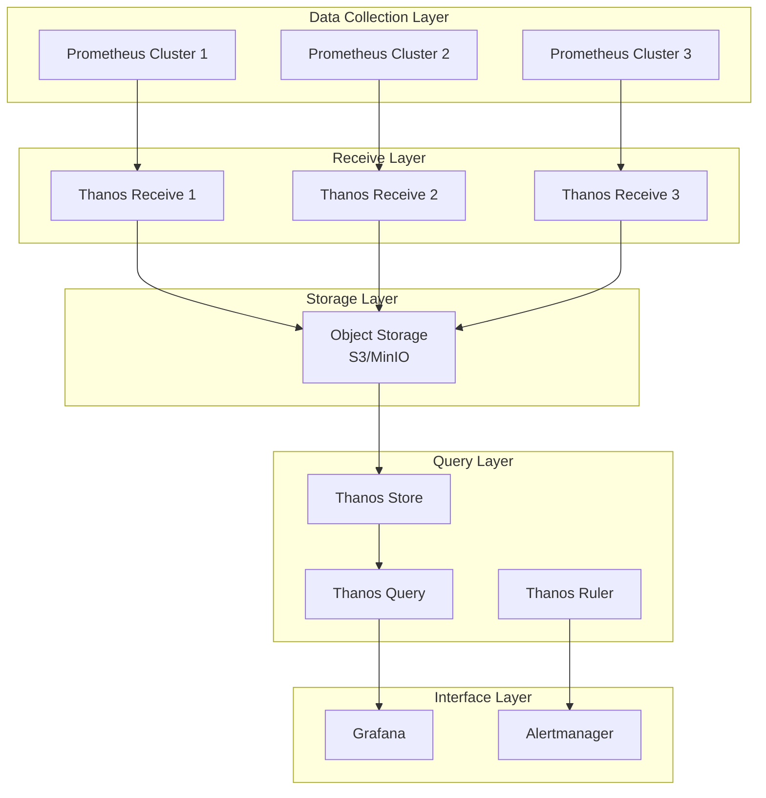

---title: Thanos Enterprise Metrics Federation and Long-term Storage
description: Best practices for Thanos Enterprise Metrics Federation
summary: Best practices for Thanos Enterprise Metrics Federation
category: general
tags:
- k8s
- prometheus
- grafana
- minio
- statefulset
- job
- cronjob
- rbac
- rag
tier: supporting
created: '2026-05-23'
last_updated: 2026-05
difficulty: intermediate
reading_level: intermediate
audience:
- All engineers
estimated_read_time: 15min
intent_queries:
- What is Thanos Enterprise Metrics Federation and Long-term Storage
- How to use Thanos Enterprise Metrics Federation and Long-term Storage
- Kubernetes 06 observability best practices
trigger_keywords:
- Thanos
- Enterprise
- Metrics
- Federation
- and
- Long-term
- Storage
- observability
prerequisites:
- kubectl-basics
- observability-basics
- prometheus-basics
- monitoring-basics
original_language: Chinese
authors:
- name: Dillan Teagle
  role: contributor
source_path: /Users/teaglebuilt/workspace/kudig-database/domain-06-observability/02-metrics/04-thanos-enterprise-metrics-federation.md
---

> **Production Environment Security Notice**
>
> This document contains directly executable operations commands. Before execution, please confirm: whether the target cluster and namespace are correct; whether you have sufficient RBAC permissions; whether you have verified in a non-production environment. Command risk levels are marked as: 🔴 High risk (may cause data loss or service interruption), 🟡 Medium risk (modifies cluster state, but usually reversible), 🟢 Low risk/read-only (information collection, no side effects).


---
tags:
- observability
- monitoring
- alerting
intent_queries:
- What is Thanos Enterprise Metrics Federation?
- How to use Thanos Enterprise Metrics Federation
- Best practices for Thanos Enterprise Metrics Federation

tier: peripheral---
title: [[Thanos|Thanos]] Enterprise Metrics Federation and Long-term Storage
description: <!-- chunk: Overview
 -->## Overview
category: enterprise-monitoring-alerting
tags:
- k8s
- monitoring
- alerting
- prometheus
- grafana
- minio
- statefulset
- job
- cronjob
- rbac
last_updated: 2026-05
difficulty: intermediate
reading_level: intermediate
audience:
- SRE
- Monitoring engineers
- Operations engineers
estimated_read_time: 5min
intent_queries:
- What is Thanos Enterprise Metrics Federation and Long-term Storage
- How to use Thanos Enterprise Metrics Federation and Long-term Storage
- Kubernetes 20 enterprise monitoring alerting best practices
trigger_keywords:
- Thanos
- Enterprise
- Metrics
- Federation
- and
- Long-term
- Storage
- enterprise
cross_refs:
- type: cheatsheet
  path: ../domain-17-system-foundation/topic-cheat-sheet/promql.md
  label: 'Quick reference: promql'
authors:
- name: Dillan Teagle
  role: contributor
k8s_versions:
- '1.28'
- '1.29'
- '1.30'
- '1.31'
- '1.32'
---

# Thanos Enterprise Metrics Federation and Long-term Storage

<!-- chunk: Overview -->## Overview

Thanos is an open-source Prometheus high availability solution that provides global query views, long-term storage, and cross-cluster federation capabilities. This document details Thanos enterprise deployment architecture, federation strategies, and long-term storage management.

Thanos is an open-source Prometheus high availability solution that provides global query views, long-term storage, and cross-cluster federation capabilities. This document details Thanos enterprise deployment architecture, federation strategies, and long-term storage management.

<!-- chunk: Architecture Design -->## Architecture Design

## Core Components

```yaml
# Thanos architecture components
apiVersion: v1
kind: Namespace
metadata:
  name: thanos-system
---
apiVersion: apps/v1
kind: StatefulSet
metadata:
  name: thanos-receive
  namespace: thanos-system
spec:
  replicas: 3
  selector:
    matchLabels:
      app: thanos-receive
  template:
    metadata:
      labels:
        app: thanos-receive
    spec:
      containers:
      - name: thanos-receive
        image: quay.io/thanos/thanos:v0.34.0
        args:
        - "receive"
        - "--grpc-address=0.0.0.0:10901"
        - "--http-address=0.0.0.0:10902"
        - "--remote-write.address=0.0.0.0:19291"
        - "--objstore.config-file=/etc/thanos/objstore.yml"
        - "--tsdb.path=/var/thanos/receive"
        - "--tsdb.retention=15d"
        - "--label=receive_cluster=\"primary\""
        - "--hashrings-file=/etc/thanos/hashrings.json"
        ports:
        - containerPort: 10901
          name: grpc
        - containerPort: 10902
          name: http
        - containerPort: 19291
          name: remote-write
        volumeMounts:
        - name: data
          mountPath: /var/thanos/receive
        - name: config
          mountPath: /etc/thanos
  volumeClaimTemplates:
  - metadata:
      name: data
    spec:
      accessModes: ["ReadWriteOnce"]
      resources:
        requests:
          storage: 200Gi
```

## Federation Architecture



<!-- chunk: Deployment Configuration -->## Deployment Configuration

## Object Storage Configuration

```yaml
# objstore.yml - Object storage configuration
type: S3
config:
  bucket: "thanos-metrics"
  endpoint: "s3.amazonaws.com"
  region: "us-west-2"
  access_key: "ACCESS_KEY"
  secret_key: "SECRET_KEY"
  insecure: false
  http_config:
    idle_conn_timeout: 90s
    response_header_timeout: 2m
    insecure_skip_verify: false
  signature_version2: false
  put_user_metadata: {}
  part_size: 134217728
```

## Hash Ring Configuration

```json
[
  {
    "hashring": "softmint-1",
    "endpoints": [
      "thanos-receive-0.thanos-receive.thanos-system.svc.cluster.local:10901",
      "thanos-receive-1.thanos-receive.thanos-system.svc.cluster.local:10901",
      "thanos-receive-2.thanos-receive.thanos-system.svc.cluster.local:10901"
    ]
  }
]
```

## Query Component Deployment

```yaml
apiVersion: apps/v1
kind: Deployment
metadata:
  name: thanos-query
  namespace: thanos-system
spec:
  replicas: 2
  selector:
    matchLabels:
      app: thanos-query
  template:
    metadata:
      labels:
        app: thanos-query
    spec:
      containers:
      - name: thanos-query
        image: quay.io/thanos/thanos:v0.34.0
        args:
        - "query"
        - "--grpc-address=0.0.0.0:10901"
        - "--http-address=0.0.0.0:9090"
        - "--query.replica-label=receive_cluster"
        - "--store=dnssrv+_grpc._tcp.thanos-store.thanos-system.svc.cluster.local"
        - "--store=dnssrv+_grpc._tcp.thanos-receive.thanos-system.svc.cluster.local"
        - "--query.auto-downsampling"
        ports:
        - containerPort: 10901
          name: grpc
        - containerPort: 9090
          name: http
        livenessProbe:
          httpGet:
            path: /-/healthy
            port: 9090
          initialDelaySeconds: 30
          periodSeconds: 30
```

<!-- chunk: Federation Strategy -->## Federation Strategy

## Data Sharding Strategy

```yaml
# Federation configuration example
global:
  scrape_interval: 15s
  evaluation_interval: 15s

# Global metrics collection
scrape_configs:
  # Kubernetes service discovery
  - job_name: 'kubernetes-nodes'
    kubernetes_sd_configs:
    - role: node
    relabel_configs:
    - source_labels: [__address__]
      regex: '(.*):10250'
      target_label: __address__
      replacement: '${1}:9100'
    metric_relabel_configs:
    - source_labels: [__name__]
      regex: '(node_cpu|node_memory|node_disk)'
      action: keep

  # Application metrics collection
  - job_name: 'application-metrics'
    kubernetes_sd_configs:
    - role: pod
    relabel_configs:
    - source_labels: [__meta_kubernetes_pod_annotation_prometheus_io_scrape]
      action: keep
      regex: true
    - source_labels: [__meta_kubernetes_pod_annotation_prometheus_io_path]
      action: replace
      target_label: __metrics_path__
      regex: (.+)
    - source_labels: [__address__, __meta_kubernetes_pod_annotation_prometheus_io_port]
      action: replace
      regex: ([^:]+)(?::\d+)?;(\d+)
      replacement: $1:$2
      target_label: __address__
```

## Cross-cluster Federation

```yaml
# Cross-cluster federation configuration
- job_name: 'federate'
  scrape_interval: 15s
  honor_labels: true
  metrics_path: '/federate'
  params:
    'match[]':
      - '{job=~"kubernetes-.*"}'
      - '{__name__=~"job:.*"}'
  static_configs:
  - targets:
    - 'prometheus-cluster1.example.com:9090'
    - 'prometheus-cluster2.example.com:9090'
    - 'prometheus-cluster3.example.com:9090'
  relabel_configs:
  - source_labels: [__address__]
    target_label: cluster
    replacement: '$1'
```

<!-- chunk: Long-term Storage Management -->## Long-term Storage Management

## Data Retention Policy

```yaml
# Data retention configuration
apiVersion: batch/v1
kind: CronJob
metadata:
  name: thanos-compact
  namespace: thanos-system
spec:
  schedule: "0 2 * * *"  # Execute daily at 2am
  jobTemplate:
    spec:
      template:
        spec:
          containers:
          - name: thanos-compact
            image: quay.io/thanos/thanos:v0.34.0
            args:
            - "compact"
            - "--data-dir=/var/thanos/compact"
            - "--objstore.config-file=/etc/thanos/objstore.yml"
            - "--retention.resolution-raw=30d"
            - "--retention.resolution-5m=90d"
            - "--retention.resolution-1h=365d"
            - "--wait"
            volumeMounts:
            - name: data
              mountPath: /var/thanos/compact
            - name: config
              mountPath: /etc/thanos
          volumes:
          - name: data
            emptyDir: {}
          - name: config
            configMap:
              name: thanos-config
          restartPolicy: OnFailure
```

## Storage Cost Optimization

> ⚠️ **🟡 Medium risk change** — Modifies cluster resource state, recommend using --dry-run or diff to confirm first
> - `kubectl edit/patch`: Modify running resources
> - `kubectl exec`: Execute commands in container, may change container state

``` bash
# 🟡 Medium risk: Modifies cluster/resource state, please confirm target, impact scope and authorization before execution
#!/bin/bash
# Storage cost optimization script

# Calculate storage usage
calculate_storage_usage() {
    echo "=== Storage Usage Analysis ==="
    
    # Get object storage usage
    aws s3 ls s3://thanos-metrics --recursive --human-readable --summarize | \
    grep "Total Size:"
    
    # Analyze cost per time series
    kubectl exec -n thanos-system deploy/thanos-query -- \
    curl -s "http://localhost:9090/api/v1/query?query=count({__name__=~'.+'})" | \
    jq '.data.result[].value[1]' | \
    sort -nr | \
    head -10
}

# Optimize storage configuration
optimize_storage() {
    echo "=== Storage Optimization ==="
    
    # Adjust compression level
    kubectl patch cm thanos-config -n thanos-system -p '{
        "data": {
            "compaction.level": "3",
            "block-duration": "2h"
        }
    }'
    
    # Clean up expired data
    kubectl exec -n thanos-system sts/thanos-store -- \
    thanos tools bucket retention \
    --objstore.config-file=/etc/thanos/objstore.yml \
    --resolution-raw=30d \
    --resolution-5m=90d \
    --resolution-1h=365d
}
```

<!-- chunk: Query Optimization -->## Query Optimization

## Query Performance Tuning

```yaml
# Query Frontend configuration
apiVersion: apps/v1
kind: Deployment
metadata:
  name: thanos-query-frontend
  namespace: thanos-system
spec:
  replicas: 2
  selector:
    matchLabels:
      app: thanos-query-frontend
  template:
    metadata:
      labels:
        app: thanos-query-frontend
    spec:
      containers:
      - name: thanos-query-frontend
        image: quay.io/thanos/thanos:v0.34.0
        args:
        - "query-frontend"
        - "--http-address=0.0.0.0:9090"
        - "--query-frontend.compress-responses"
        - "--query-frontend.log-queries-longer-than=5s"
        - "--query-frontend.downstream-url=http://thanos-query:9090"
        - "--query-range.split-interval=24h"
        - "--query-range.max-retries-per-request=5"
        - "--cache-compression-type=snappy"
        ports:
        - containerPort: 9090
          name: http
        resources:
          requests:
            cpu: "1"
            memory: "2Gi"
          limits:
            cpu: "2"
            memory: "4Gi"
```

## Cache Strategy

```yaml
# Query cache configuration
query_frontend:
  cache:
    type: memcached
    config:
      addresses: ["memcached.thanos-system.svc.cluster.local:11211"]
      timeout: 500ms
      max_idle_conns: 100
      max_async_buffer_size: 10000
      max_async_concurrency: 20
      
  query_range:
    split_interval: 24h
    max_retries: 5
    max_query_length: 168h
    max_query_parallelism: 14
    response_cache_max_freshness: 1m
```

<!-- chunk: Monitoring and Alerting -->## Monitoring and Alerting

## Key Metrics Monitoring

```yaml
# Thanos monitoring rules
groups:
- name: thanos.rules
  rules:
  # Receive component monitoring
  - alert: ThanosReceiveDown
    expr: up{job="thanos-receive"} == 0
    for: 5m
    labels:
      severity: critical
    annotations:
      summary: "Thanos Receive component is down"
      description: "{{ $labels.instance }} of job {{ $labels.job }} has been down for more than 5 minutes."

  - alert: ThanosReceiveHighIngestionLatency
    expr: histogram_quantile(0.99, rate(thanos_receive_write_latency_seconds_bucket[5m])) > 5
    for: 10m
    labels:
      severity: warning
    annotations:
      summary: "High ingestion latency in Thanos Receive"
      description: "99th percentile of write latency is above 5 seconds for more than 10 minutes."

  # Query component monitoring
  - alert: ThanosQueryHighLatency
    expr: histogram_quantile(0.99, rate(http_request_duration_seconds_bucket{job="thanos-query"}[5m])) > 10
    for: 5m
    labels:
      severity: warning
    annotations:
      summary: "High query latency in Thanos Query"
      description: "99th percentile of query latency is above 10 seconds."

  # Storage component monitoring
  - alert: ThanosStoreSlowQueries
    expr: thanos_store_queries_dropped_total > 0
    for: 5m
    labels:
      severity: warning
    annotations:
      summary: "Thanos Store dropping queries"
      description: "Thanos Store is dropping queries due to slow performance."

  # Disk space monitoring
  - alert: ThanosDiskSpaceLow
    expr: (node_filesystem_avail_bytes{mountpoint="/var/thanos"} / node_filesystem_size_bytes{mountpoint="/var/thanos"}) * 100 < 10
    for: 5m
    labels:
      severity: critical
    annotations:
      summary: "Low disk space for Thanos"
      description: "Available disk space is below 10% on {{ $labels.instance }}."
```

## Visualization Dashboard

```json
{
  "dashboard": {
    "title": "Thanos Enterprise Monitoring",
    "panels": [
      {
        "title": "Receive Ingestion Rate",
        "type": "graph",
        "targets": [
          {
            "expr": "rate(thanos_receive_write_requests_total[5m])",
            "legendFormat": "{{instance}}"
          }
        ]
      },
      {
        "title": "Query Latency",
        "type": "heatmap",
        "targets": [
          {
            "expr": "histogram_quantile(0.99, rate(http_request_duration_seconds_bucket{job=\"thanos-query\"}[5m]))",
            "legendFormat": "99th percentile"
          }
        ]
      },
      {
        "title": "Storage Utilization",
        "type": "gauge",
        "targets": [
          {
            "expr": "(sum(node_filesystem_size_bytes{mountpoint=\"/var/thanos\"}) - sum(node_filesystem_free_bytes{mountpoint=\"/var/thanos\"})) / sum(node_filesystem_size_bytes{mountpoint=\"/var/thanos\"}) * 100",
            "legendFormat": "Storage Used %"
          }
        ]
      }
    ]
  }
}
```

<!-- chunk: Troubleshooting -->## Troubleshooting

## Common Issue Diagnosis

> ⚠️ **🟡 Medium risk change** — Modifies cluster resource state, recommend using --dry-run or diff to confirm first
> - `kubectl exec`: Execute commands in container, may change container state

``` bash
# 🟡 Medium risk: Modifies cluster/resource state, please confirm target, impact scope and authorization before execution
#!/bin/bash
# Thanos troubleshooting tool

# Check component status
check_component_status() {
    echo "=== Component Status Check ==="
    
    kubectl get pods -n thanos-system -o wide
    echo ""
    
    # Check service endpoints
    kubectl get endpoints -n thanos-system
    echo ""
    
    # Check configuration
    kubectl get configmaps -n thanos-system
}

# Performance analysis
performance_analysis() {
    echo "=== Performance Analysis ==="
    
    # Check memory usage
    kubectl top pods -n thanos-system
    echo ""
    
    # Check network connections
    kubectl exec -n thanos-system deploy/thanos-query -- \
    netstat -an | grep ESTABLISHED | wc -l
    echo ""
    
    # Check query latency
    kubectl exec -n thanos-system deploy/thanos-query -- \
    curl -s "http://localhost:9090/api/v1/query?query=histogram_quantile(0.99, rate(http_request_duration_seconds_bucket[5m]))" | \
    jq '.data.result[].value[1]'
}

# Data consistency check
data_consistency_check() {
    echo "=== Data Consistency Check ==="
    
    # Check block integrity
    kubectl exec -n thanos-system sts/thanos-store -- \
    thanos tools bucket verify \
    --objstore.config-file=/etc/thanos/objstore.yml
    
    # Check for duplicate data
    kubectl exec -n thanos-system sts/thanos-store -- \
    thanos tools bucket inspect \
    --objstore.config-file=/etc/thanos/objstore.yml | \
    grep -E "(overlap|duplicate)"
}
```

<!-- chunk: Best Practices -->## Best Practices

## Deployment Best Practices

1. **High Availability Deployment**
   - Minimum 3 replicas for Receive component
   - Horizontal scaling for Query component
   - Use Pod Anti-Affinity to avoid single points of failure

2. **Resource Configuration**
   ```yaml
   resources:
     requests:
       cpu: "2"
       memory: "8Gi"
     limits:
       cpu: "4"
       memory: "16Gi"
   ```

3. **Network Security**
   - Enable TLS encryption for communication
   - Configure network policies to restrict access
   - Use ServiceAccount and RBAC

## Operations Best Practices

1. **Monitoring Coverage**
   - End-to-end latency monitoring
   - Storage capacity alerts
   - Component health checks

2. **Backup Strategy**
   - Regular configuration backups
   - Object storage versioning
   - Disaster recovery drills

3. **Upgrade and Maintenance**
   - Rolling upgrade strategy
   - Data migration planning
   - Rollback mechanism preparation

---

**Document Version**: v1.0  
**Last Updated**: 2024  
**Applicable Version**: Thanos v0.34+

---

<!-- chunk: Obsidian related documentation -->## Obsidian Related Documentation

- domain-20-enterprise-monitoring-alerting MOC
- [[domain-06-observability/README.md|Domain 06: Enterprise Monitoring and Alerting]]
- [[domain-06-observability/00-open-source-projects-index.md|Domain-20 Enterprise Monitoring and Alerting — Open Source Projects Index]]
- Prometheus Enterprise Monitoring System Deep Practice
- Grafana Enterprise Observability Platform Deep Practice
- OpenTelemetry Distributed Tracing and Observability Deep Practice
- Datadog Enterprise APM Deep Practice
- Datadog Enterprise Monitoring Platform Deep Practice
- Elastic Stack Enterprise Log Analysis Deep Practice
- Elastic Stack Enterprise Observability Platform Deep Practice
- Zabbix Enterprise Monitoring Platform Deep Practice
- New Relic Enterprise APM Platform Deep Practice

## See Also

- 02-grafana-enterprise-observability
- 03-opentelemetry-distributed-tracing
- 05-datadog-enterprise-apm
- 05-datadog-enterprise-monitoring

- [[domain-06-observability/README.md|Back to index]]

## Related

- [[domain-19-landscape-references/topic-index/observability-index.md|Observability Knowledge Graph Index]]


<!-- risk-assessed -->
