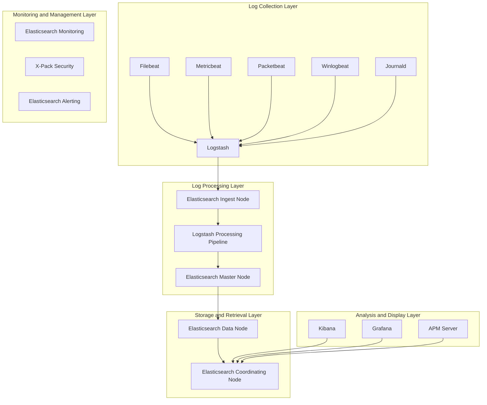

> **Production Environment Security Notice**
>
> This documentation contains directly executable operations commands. Before execution, please confirm: whether the current target cluster and namespace are correct; whether you have sufficient RBAC permissions; whether the commands have been validated in a non-production environment. Command risk levels: 🔴 High risk (may cause data loss or service interruption), 🟡 Medium risk (modifies cluster state but usually reversible), 🟢 Low risk/Read-only (information gathering, no side effects).


title: ELK Stack Enterprise-Level Log Management System - In-Depth Practice
description: '# ELK Stack Enterprise-Level Log Management System - In-Depth Practice'
category: logging-management-analytics
tags:
- k8s
- logging
- efk
- loki
- grafana
- docker
- kafka
- elasticsearch
- [[StatefulSet|statefulset]]
- webhook
last_updated: 2026-05
difficulty: intermediate
reading_level: intermediate
audience:
- SRE
- Operations Engineers
- Data Engineers
estimated_read_time: 5min
intent_queries:
- What is ELK Stack Enterprise-Level Log Management System
- How to use ELK Stack Enterprise-Level Log Management System
- [[Kubernetes|Kubernetes]] 21 logging management analytics best practices
trigger_keywords:
- ELK
- Stack Enterprise-Level Log Management System
- logging
- management
- analytics
authors:
- name: KUDIG Team
  role: contributor
k8s_versions:
- '1.28'
- '1.29'
- '1.30'
- '1.31'
- '1.32'
---

# ELK Stack Enterprise-Level Log Management System - In-Depth Practice

> **Author**: Logging System Architecture Expert | **Version**: v1.0 | **Updated**: 2026-02-07
> **Applicable Scenarios**: Enterprise-level logging platform architecture | **Complexity**: ⭐⭐⭐⭐⭐

<!-- chunk: 🎯 Summary -->## 🎯 Summary

This document provides an in-depth exploration of ELK Stack enterprise-level log management system architecture design, deployment practices, and operational management. Based on practical experience from large-scale production environments, it offers a complete technical guide from log collection to analysis and visualization, helping enterprises build efficient and reliable log management systems.

<!-- chunk: 1. ELK Architecture In-Depth Analysis -->## 1. ELK Architecture In-Depth Analysis

## 1.1 Core Component Architecture



## 1.2 Component Functions Detailed Explanation

```yaml
ELK Stack Component Description:
  Elasticsearch:
    Function: Distributed search engine and analytics engine
    Characteristics: 
      - Full-text search and structured search
      - Real-time analytics capabilities
      - Horizontal scalability
      - High availability
    Version: 8.11.0+
  
  Logstash:
    Function: Data processing pipeline
    Characteristics:
      - Rich input plugins
      - Powerful filter processing
      - Diverse output plugins
      - High programmability
    Version: 8.11.0+
  
  Kibana:
    Function: Data visualization and management interface
    Characteristics:
      - Rich chart types
      - Customizable dashboards
      - Developer tools
      - Machine learning integration
    Version: 8.11.0+
  
  Beats:
    Function: Lightweight data collectors
    Characteristics:
      - Low resource consumption
      - Simple deployment
      - Strong real-time capabilities
      - Plugin-based architecture
    Version: 8.11.0+
```

<!-- chunk: 2. Enterprise-Level Deployment Architecture -->## 2. Enterprise-Level Deployment Architecture

## 2.1 High-Availability Cluster Deployment

```yaml
# Elasticsearch Cluster Deployment
apiVersion: apps/v1
kind: StatefulSet
metadata:
  name: elasticsearch-master
  namespace: logging
spec:
  serviceName: elasticsearch-master
  replicas: 3
  selector:
    matchLabels:
      app: elasticsearch
      role: master
  template:
    metadata:
      labels:
        app: elasticsearch
        role: master
    spec:
      initContainers:
      - name: sysctl
        image: busybox:1.27.2
        command:
        - sysctl
        - -w
        - vm.max_map_count=262144
        securityContext:
          privileged: true
      containers:
      - name: elasticsearch
        image: docker.elastic.co/elasticsearch/elasticsearch:8.11.0
        env:
        - name: cluster.name
          value: "elk-cluster"
        - name: node.name
          valueFrom:
            fieldRef:
              fieldPath: metadata.name
        - name: discovery.seed_hosts
          value: "elasticsearch-master-0.elasticsearch-master,elasticsearch-master-1.elasticsearch-master,elasticsearch-master-2.elasticsearch-master"
        - name: cluster.initial_master_nodes
          value: "elasticsearch-master-0,elasticsearch-master-1,elasticsearch-master-2"
        - name: ES_JAVA_OPTS
          value: "-Xms2g -Xmx2g"
        - name: xpack.security.enabled
          value: "true"
        - name: xpack.security.transport.ssl.enabled
          value: "true"
        ports:
        - containerPort: 9200
          name: http
        - containerPort: 9300
          name: transport
        volumeMounts:
        - name: elasticsearch-data
          mountPath: /usr/share/elasticsearch/data
        resources:
          requests:
            memory: "2Gi"
            cpu: "1"
          limits:
            memory: "4Gi"
            cpu: "2"
  volumeClaimTemplates:
  - metadata:
      name: elasticsearch-data
    spec:
      accessModes: [ "ReadWriteOnce" ]
      storageClassName: "fast-ssd"
      resources:
        requests:
          storage: 100Gi
---
# Elasticsearch Data Node Deployment
apiVersion: apps/v1
kind: StatefulSet
metadata:
  name: elasticsearch-data
  namespace: logging
spec:
  serviceName: elasticsearch-data
  replicas: 3
  selector:
    matchLabels:
      app: elasticsearch
      role: data
  template:
    metadata:
      labels:
        app: elasticsearch
        role: data
    spec:
      initContainers:
      - name: sysctl
        image: busybox:1.27.2
        command:
        - sysctl
        - -w
        - vm.max_map_count=262144
        securityContext:
          privileged: true
      containers:
      - name: elasticsearch
        image: docker.elastic.co/elasticsearch/elasticsearch:8.11.0
        env:
        - name: cluster.name
          value: "elk-cluster"
        - name: node.name
          valueFrom:
            fieldRef:
              fieldPath: metadata.name
        - name: node.roles
          value: "data,content,transform"
        - name: discovery.seed_hosts
          value: "elasticsearch-master-0.elasticsearch-master,elasticsearch-master-1.elasticsearch-master,elasticsearch-master-2.elasticsearch-master"
        - name: ES_JAVA_OPTS
          value: "-Xms4g -Xmx4g"
        - name: xpack.security.enabled
          value: "true"
        ports:
        - containerPort: 9200
          name: http
        - containerPort: 9300
          name: transport
        volumeMounts:
        - name: elasticsearch-data
          mountPath: /usr/share/elasticsearch/data
        resources:
          requests:
            memory: "4Gi"
            cpu: "2"
          limits:
            memory: "8Gi"
            cpu: "4"
  volumeClaimTemplates:
  - metadata:
      name: elasticsearch-data
    spec:
      accessModes: [ "ReadWriteOnce" ]
      storageClassName: "fast-ssd"
      resources:
        requests:
          storage: 500Gi
```

## 2.2 Filebeat Log Collection Configuration

```yaml
# Filebeat Configuration File
filebeat.inputs:
- type: log
  enabled: true
  paths:
    - /var/log/*.log
    - /var/log/application/*.log
    - /var/log/nginx/*.log
  fields:
    service: application
    environment: production
  fields_under_root: true
  multiline.pattern: '^\d{4}-\d{2}-\d{2}'
  multiline.negate: true
  multiline.match: after
  ignore_older: 72h
  close_inactive: 2h
  scan_frequency: 10s

- type: container
  enabled: true
  paths:
    - /var/lib/docker/containers/*/*.log
  stream: all
  processors:
    - add_docker_metadata: ~
    - add_kubernetes_metadata:
        host: ${NODE_NAME}
        matchers:
        - logs_path:
            logs_path: "/var/lib/docker/containers/"

processors:
- add_host_metadata: ~
- add_cloud_metadata: ~
- add_fields:
    target: ''
    fields:
      index_prefix: "application-logs"
      log_type: "application"

output.elasticsearch:
  hosts: ["elasticsearch-data-0.elasticsearch-data:9200"]
  username: "${ELASTIC_USERNAME}"
  password: "${ELASTIC_PASSWORD}"
  index: "%{[index_prefix]}-%{+yyyy.MM.dd}"
  bulk_max_size: 2048
  worker: 2

setup.template.enabled: false
setup.ilm.enabled: false

logging.level: info
logging.to_files: true
logging.files:
  path: /var/log/filebeat
  name: filebeat
  keepfiles: 7
  permissions: 0644
```

<!-- chunk: 3. Log Processing Pipeline Design -->## 3. Log Processing Pipeline Design

## 3.1 Logstash Configuration Pipeline

```ruby
# Logstash Main Configuration File
input {
  beats {
    port => 5044
    ssl => true
    ssl_certificate => "/etc/logstash/certs/logstash.crt"
    ssl_key => "/etc/logstash/certs/logstash.key"
  }
  
  kafka {
    bootstrap_servers => "kafka-0:9092,kafka-1:9092,kafka-2:9092"
    topics => ["application-logs", "system-logs", "security-logs"]
    group_id => "logstash-consumer"
    codec => "json"
  }
}

filter {
  # Generic field processing
  mutate {
    add_field => {
      "[@metadata][received_at]" => "%{@timestamp}"
      "[@metadata][pipeline]" => "main"
    }
    rename => {
      "message" => "raw_message"
    }
  }
  
  # Timestamp standardization
  date {
    match => [ "timestamp", "ISO8601", "yyyy-MM-dd HH:mm:ss", "UNIX_MS" ]
    target => "@timestamp"
    remove_field => [ "timestamp" ]
  }
  
  # JSON message parsing
  json {
    source => "raw_message"
    skip_on_invalid_json => true
    target => "parsed_json"
  }
  
  # Application log processing
  if [fields][service] == "application" {
    grok {
      match => {
        "raw_message" => [
          "%{TIMESTAMP_ISO8601:timestamp} \[%{LOGLEVEL:level}\] %{JAVACLASS:class} - %{GREEDYDATA:message}",
          "%{TIMESTAMP_ISO8601:timestamp} %{LOGLEVEL:level} %{GREEDYDATA:message}"
        ]
      }
      tag_on_failure => ["_grokparsefailure_application"]
    }
    
    # Application-specific field extraction
    if [parsed_json] {
      mutate {
        add_field => {
          "user_id" => "%{[parsed_json][userId]}"
          "request_id" => "%{[parsed_json][requestId]}"
          "response_time" => "%{[parsed_json][responseTime]}"
        }
      }
    }
  }
  
  # Nginx access log processing
  if [fields][service] == "nginx" {
    grok {
      match => {
        "raw_message" => '%{IPORHOST:clientip} %{USER:ident} %{USER:auth} \[%{HTTPDATE:timestamp}\] "%{WORD:verb} %{DATA:request} HTTP/%{NUMBER:httpversion}" %{NUMBER:response:int} (?:%{NUMBER:bytes:int}|-) (?:"(?:%{URI:referrer}|-)"|%{QS:referrer}) %{QS:agent}'
      }
      tag_on_failure => ["_grokparsefailure_nginx"]
    }
    
    # User agent parsing
    useragent {
      source => "agent"
      target => "user_agent"
    }
    
    # Geolocation parsing
    geoip {
      source => "clientip"
      target => "geoip"
    }
  }
  
  # System log processing
  if [fields][service] == "system" {
    syslog_pri { }
    
    grok {
      match => {
        "raw_message" => "<%{POSINT:priority}>%{SYSLOGTIMESTAMP:timestamp} %{SYSLOGHOST:logsource} %{PROG:program}(?:\[%{POSINT:pid}\])?: %{GREEDYDATA:message}"
      }
      tag_on_failure => ["_grokparsefailure_syslog"]
    }
  }
  
  # Field type conversion
  mutate {
    convert => {
      "response_time" => "float"
      "bytes" => "integer"
      "response" => "integer"
    }
  }
  
  # Add index routing information
  mutate {
    add_field => {
      "[@metadata][index]" => "%{[fields][service]}-%{+YYYY.MM.dd}"
      "[@metadata][routing]" => "%{[fields][environment]}"
    }
  }
}

output {
  # Primary output to Elasticsearch
  elasticsearch {
    hosts => ["elasticsearch-data-0.elasticsearch-data:9200"]
    index => "%{[@metadata][index]}"
    routing => "%{[@metadata][routing]}"
    user => "${ELASTIC_USERNAME}"
    password => "${ELASTIC_PASSWORD}"
    ssl => true
    ssl_certificate_verification => false
    ilm_enabled => true
    ilm_rollover_alias => "%{[fields][service]}-logs"
    ilm_pattern => "{now/d}-000001"
    ilm_policy => "log-lifecycle-policy"
    template_name => "%{[fields][service]}-template"
    template => "/etc/logstash/templates/%{[fields][service]}-template.json"
    template_overwrite => true
  }
  
  # Backup output to Kafka
  kafka {
    bootstrap_servers => "kafka-0:9092,kafka-1:9092,kafka-2:9092"
    topic_id => "%{[fields][service]}-backup"
    codec => json
  }
  
  # Monitoring output
  if "_grokparsefailure" in [tags] {
    elasticsearch {
      hosts => ["elasticsearch-data-0.elasticsearch-data:9200"]
      index => "failed-parses-%{+YYYY.MM.dd}"
      user => "${ELASTIC_USERNAME}"
      password => "${ELASTIC_PASSWORD}"
    }
  }
}
```

<!-- chunk: 4. Index Lifecycle Management -->## 4. Index Lifecycle Management

## 4.1 ILM Policy Configuration

```json
{
  "policy": {
    "phases": {
      "hot": {
        "min_age": "0ms",
        "actions": {
          "rollover": {
            "max_age": "7d",
            "max_size": "50gb",
            "max_docs": 10000000
          },
          "set_priority": {
            "priority": 100
          }
        }
      },
      "warm": {
        "min_age": "7d",
        "actions": {
          "allocate": {
            "number_of_replicas": 1
          },
          "readonly": {},
          "set_priority": {
            "priority": 50
          }
        }
      },
      "cold": {
        "min_age": "30d",
        "actions": {
          "allocate": {
            "require": {
              "box_type": "cold"
            }
          },
          "freeze": {},
          "set_priority": {
            "priority": 0
          }
        }
      },
      "delete": {
        "min_age": "90d",
        "actions": {
          "delete": {}
        }
      }
    }
  }
}
```

## 4.2 Index Template Configuration

```json
{
  "index_patterns": ["application-logs-*"],
  "template": {
    "settings": {
      "number_of_shards": 3,
      "number_of_replicas": 1,
      "refresh_interval": "30s",
      "blocks": {
        "read_only_allow_delete": "false"
      },
      "codec": "best_compression",
      "translog": {
        "durability": "async",
        "sync_interval": "5s"
      }
    },
    "mappings": {
      "properties": {
        "@timestamp": {
          "type": "date"
        },
        "level": {
          "type": "keyword"
        },
        "message": {
          "type": "text",
          "analyzer": "standard"
        },
        "raw_message": {
          "type": "text",
          "index": false
        },
        "service": {
          "type": "keyword"
        },
        "environment": {
          "type": "keyword"
        },
        "host": {
          "properties": {
            "name": { "type": "keyword" },
            "ip": { "type": "ip" }
          }
        },
        "container": {
          "properties": {
            "id": { "type": "keyword" },
            "name": { "type": "keyword" },
            "image": { "type": "keyword" }
          }
        },
        "kubernetes": {
          "properties": {
            "pod": {
              "properties": {
                "name": { "type": "keyword" },
                "uid": { "type": "keyword" }
              }
            },
            "namespace": { "type": "keyword" },
            "node": { "type": "keyword" }
          }
        },
        "geoip": {
          "properties": {
            "location": { "type": "geo_point" },
            "country_name": { "type": "keyword" },
            "city_name": { "type": "keyword" }
          }
        }
      }
    }
  },
  "composed_of": ["logs-mappings", "logs-settings"],
  "priority": 500,
  "version": 3,
  "_meta": {
    "description": "Application logs template"
  }
}
```

<!-- chunk: 5. Kibana Visualization Configuration -->## 5. Kibana Visualization Configuration

## 5.1 Dashboard Configuration

```json
{
  "dashboard": {
    "title": "Application Logs Overview",
    "description": "Comprehensive application log monitoring dashboard",
    "panelsJSON": "[{\"id\":\"application-logs-metrics\",\"type\":\"visualization\",\"panelIndex\":1,\"gridData\":{\"x\":0,\"y\":0,\"w\":24,\"h\":12}}, {\"id\":\"error-rate-trend\",\"type\":\"visualization\",\"panelIndex\":2,\"gridData\":{\"x\":0,\"y\":12,\"w\":12,\"h\":12}}, {\"id\":\"top-error-sources\",\"type\":\"visualization\",\"panelIndex\":3,\"gridData\":{\"x\":12,\"y\":12,\"w\":12,\"h\":12}}]",
    "optionsJSON": "{\"darkTheme\":false,\"hidePanelTitles\":false,\"useMargins\":true}",
    "version": 1,
    "timeRestore": true,
    "timeTo": "now",
    "timeFrom": "now-24h",
    "refreshInterval": {
      "display": "30 seconds",
      "pause": false,
      "value": 30000
    }
  }
}
```

## 5.2 Visualization Query Configuration

```json
{
  "visualization": {
    "title": "Error Rate Trend",
    "visState": "{\"title\":\"Error Rate Trend\",\"type\":\"line\",\"params\":{\"addTooltip\":true,\"addLegend\":true,\"legendPosition\":\"right\",\"scale\":\"linear\",\"mode\":\"normal\",\"times\":[],\"addTimeMarker\":false,\"defaultYExtents\":false,\"setYExtents\":false,\"yAxis\":{}},\"aggs\":[{\"id\":\"1\",\"enabled\":true,\"type\":\"cardinality\",\"schema\":\"metric\",\"params\":{\"field\":\"request_id\"}},{\"id\":\"2\",\"enabled\":true,\"type\":\"date_histogram\",\"schema\":\"segment\",\"params\":{\"field\":\"@timestamp\",\"interval\":\"auto\",\"customInterval\":\"2h\",\"min_doc_count\":1,\"extended_bounds\":{}}},{\"id\":\"3\",\"enabled\":true,\"type\":\"terms\",\"schema\":\"group\",\"params\":{\"field\":\"level\",\"size\":5,\"order\":\"desc\",\"orderBy\":\"1\"}}],\"listeners\":{}}",
    "uiStateJSON": "{}",
    "description": "",
    "version": 1,
    "kibanaSavedObjectMeta": {
      "searchSourceJSON": "{\"index\":\"application-logs-*\",\"filter\":[],\"query\":{\"query\":\"level:ERROR OR level:CRITICAL\",\"language\":\"kuery\"}}"
    }
  }
}
```

<!-- chunk: 6. Security and Permission Management -->## 6. Security and Permission Management

## 6.1 Elasticsearch Security Configuration

```yaml
# Elasticsearch Security Configuration
xpack.security.enabled: true
xpack.security.transport.ssl.enabled: true
xpack.security.transport.ssl.verification_mode: certificate
xpack.security.transport.ssl.key: certs/elastic-certificates.key
xpack.security.transport.ssl.certificate: certs/elastic-certificates.crt
xpack.security.transport.ssl.certificate_authorities: certs/elastic-stack-ca.crt
xpack.security.http.ssl.enabled: true
xpack.security.http.ssl.truststore.path: certs/elastic-certificates.p12
xpack.security.http.ssl.keystore.path: certs/elastic-certificates.p12

# User role configuration
xpack.security.authc.realms:
  native.native1:
    order: 0
  ldap.ldap1:
    order: 1
    url: "ldaps://ldap.example.com:636"
    bind_dn: "cn=admin,dc=example,dc=com"
    user_search:
      base_dn: "dc=example,dc=com"
      filter: "(cn={0})"
    group_search:
      base_dn: "dc=example,dc=com"
    files:
      role_mapping: "/usr/share/elasticsearch/config/roles_mapping.yml"
```

## 6.2 Role and Permission Configuration

```yaml
# Elasticsearch Role Definitions
roles:
  log_admin:
    cluster: 
      - all
    indices:
      - names: '*'
        privileges: 
          - all
    
  log_viewer:
    cluster:
      - monitor
    indices:
      - names: 'application-logs-*'
        privileges:
          - read
          - view_index_metadata
      - names: 'system-logs-*'
        privileges:
          - read
          - view_index_metadata
    
  developer:
    cluster:
      - monitor
    indices:
      - names: 'application-logs-*'
        privileges:
          - read
          - view_index_metadata
        field_security:
          grant: ['message', 'level', 'timestamp', 'service']
    
  auditor:
    cluster:
      - monitor
    indices:
      - names: '*'
        privileges:
          - read
          - view_index_metadata
        query: '{"term": {"environment": "production"}}'
```

<!-- chunk: 7. Performance Optimization and Tuning -->## 7. Performance Optimization and Tuning

## 7.1 Elasticsearch Performance Tuning

```yaml
# Elasticsearch Performance Optimization Configuration
performance_tuning:
  jvm:
    heap_size: "31g"  # 50% of total memory, not exceeding 32GB
    gc_settings:
      - "-XX:+UseG1GC"
      - "-XX:MaxGCPauseMillis=200"
      - "-XX:G1HeapRegionSize=32m"
  
  indexing:
    refresh_interval: "30s"
    translog:
      durability: "async"
      sync_interval: "5s"
    merge:
      policy:
        max_merge_at_once: 10
        segments_per_tier: 10
  
  search:
    request_cache: true
    query_cache: true
    field_data_cache: true
    indices:
      queries:
        cache:
          size: "20%"
  
  networking:
    tcp:
      no_delay: true
      keep_alive: true
    http:
      compression: true
      max_content_length: "200mb"
  
  thread_pools:
    search:
      size: 20
      queue_size: 1000
    write:
      size: 10
      queue_size: 1000
    get:
      size: 10
      queue_size: 1000
```

## 7.2 Logstash Performance Optimization

```ruby
# Logstash Performance Optimization Configuration
pipeline:
  batch_size: 125
  batch_delay: 50
  workers: 4
  
input {
  beats {
    port => 5044
    codec => "json"
    # Enable compression
    client_inactivity_timeout => 3600
  }
}

filter {
  # Parallel processing
  if [type] == "application" {
    # Application-specific processing
  } else if [type] == "nginx" {
    # Nginx-specific processing
  }
  
  # Avoid unnecessary field processing
  mutate {
    remove_field => ["@version", "tags", "_id"]
  }
}

output {
  elasticsearch {
    hosts => ["elasticsearch-host:9200"]
    # Bulk submission optimization
    flush_size => 5000
    idle_flush_time => 5
    # Connection pool optimization
    pool_max => 20
    pool_max_per_route => 10
  }
}
```

<!-- chunk: 8. Monitoring and Alerting -->## 8. Monitoring and Alerting

## 8.1 System Monitoring Configuration

```yaml
# Elasticsearch Monitoring Configuration
monitoring:
  collection:
    enabled: true
    exporters:
      local:
        type: local
      http:
        type: http
        host: ["monitoring-elasticsearch:9200"]
        auth:
          username: monitoring_user
          password: monitoring_password

# Logstash Monitoring Configuration
monitoring.enabled: true
monitoring.elasticsearch.hosts: ["elasticsearch:9200"]
monitoring.elasticsearch.username: "logstash_monitoring"
monitoring.elasticsearch.password: "password"
```

## 8.2 Alert Rule Configuration

```yaml
# Elastic Stack Alert Rules
alerts:
  - name: "High Error Rate"
    type: "metric"
    condition: "avg(error_rate) > 0.05"
    timeframe: "5m"
    actions:
      - type: "email"
        recipients: ["ops-team@example.com"]
      - type: "slack"
        channel: "#alerts"
  
  - name: "Elasticsearch Cluster Health"
    type: "cluster_health"
    condition: "cluster_status != 'green'"
    timeframe: "1m"
    actions:
      - type: "pagerduty"
        routing_key: "your-pagerduty-key"
  
  - name: "Log Ingestion Lag"
    type: "ingestion_lag"
    condition: "lag_seconds > 300"
    timeframe: "10m"
    actions:
      - type: "webhook"
        url: "https://internal-api.example.com/alerts"
```

<!-- chunk: 9. Troubleshooting and Maintenance -->## 9. Troubleshooting and Maintenance

## 9.1 Common Problem Diagnosis

```bash
# ELK Stack Troubleshooting Commands

# 1. Check Elasticsearch cluster status
curl -u elastic:password -X GET "localhost:9200/_cluster/health?pretty"

# 2. View node statistics
curl -u elastic:password -X GET "localhost:9200/_nodes/stats?pretty"

# 3. Check index status
curl -u elastic:password -X GET "localhost:9200/_cat/indices?v"

# 4. View unallocated shards
curl -u elastic:password -X GET "localhost:9200/_cat/shards?v&h=index,shard,prirep,state,unassigned.reason"

# 5. Check Logstash processing status
curl -X GET "localhost:9600/_node/stats/pipeline?pretty"

# 6. Filebeat status check
filebeat test config
filebeat test output

# 7. Performance analysis
curl -u elastic:password -X GET "localhost:9200/_cluster/allocation/explain?pretty"
```

## 9.2 Maintenance Scripts

```python
#!/usr/bin/env python3
# elk_maintenance.py

import requests
import json
import logging
from datetime import datetime, timedelta

class ELKMaintenance:
    def __init__(self, es_host, username, password):
        self.es_host = es_host
        self.auth = (username, password)
        self.session = requests.Session()
        self.session.auth = self.auth
        self.logger = logging.getLogger(__name__)
    
    def check_cluster_health(self):
        """Check cluster health status"""
        try:
            response = self.session.get(f"{self.es_host}/_cluster/health")
            health = response.json()
            
            self.logger.info(f"Cluster Status: {health['status']}")
            self.logger.info(f"Active Shards: {health['active_shards']}/{health['active_shards'] + health['unassigned_shards']}")
            
            if health['status'] != 'green':
                self.logger.warning(f"Cluster health is {health['status']}")
                return False
            return True
        except Exception as e:
            self.logger.error(f"Failed to check cluster health: {e}")
            return False
    
    def clean_old_indices(self, days_to_keep=30):
        """Clean old indices"""
        try:
            # Get all indices
            response = self.session.get(f"{self.es_host}/_cat/indices?format=json")
            indices = response.json()
            
            cutoff_date = datetime.now() - timedelta(days=days_to_keep)
            
            for index in indices:
                index_name = index['index']
                # Parse date
                if '-' in index_name:
                    try:
                        date_part = index_name.split('-')[-1]
                        index_date = datetime.strptime(date_part, '%Y.%m.%d')
                        
                        if index_date < cutoff_date:
                            self.logger.info(f"Deleting old index: {index_name}")
                            delete_response = self.session.delete(f"{self.es_host}/{index_name}")
                            if delete_response.status_code == 200:
                                self.logger.info(f"Successfully deleted {index_name}")
                    except ValueError:
                        continue
                        
        except Exception as e:
            self.logger.error(f"Failed to clean old indices: {e}")
    
    def optimize_indices(self):
        """Optimize index performance"""
        try:
            # Force merge small segments
            response = self.session.post(f"{self.es_host}/_forcemerge?max_num_segments=1")
            if response.status_code == 200:
                self.logger.info("Index optimization completed")
        except Exception as e:
            self.logger.error(f"Failed to optimize indices: {e}")

if __name__ == "__main__":
    maintenance = ELKMaintenance(
        "http://localhost:9200",
        "elastic",
        "password"
    )
    
    maintenance.check_cluster_health()
    maintenance.clean_old_indices(30)
    maintenance.optimize_indices()
```

<!-- chunk: 10. Best Practices and Future Development -->## 10. Best Practices and Future Development

## 10.1 Log Management Best Practices

```markdown
<!-- chunk: 📝 Log Management Best Practices -->## 📝 Log Management Best Practices

## 1. Log Format Standardization
- Use JSON format for structured logging
- Standardize timestamp format (ISO8601)
- Include necessary context information
- Avoid sensitive information leakage

## 2. Index Strategy Optimization
- Split indices by service and time
- Set appropriate shard and replica counts
- Implement lifecycle management
- Regularly clean up expired data

## 3. Performance Optimization Key Points
- Appropriately adjust JVM heap size
- Optimize batch processing parameters
- Enable appropriate caching mechanisms
- Monitor and tune resource usage

## 4. Security and Compliance Requirements
- Enable transport layer encryption
- Implement fine-grained access control
- Regularly audit log access
- Comply with data protection regulations
```

## 10.2 Technology Development Trends

```yaml
Log Technology Development Trends:
  1. Cloud-Native Logging:
     - Serverless log collection
     - Multi-cloud unified logging platform
     - Edge computing log processing
     - Serverless architecture integration
  
  2. Intelligent Analytics:
     - AI-driven anomaly detection
     - Natural language processing for logs
     - Automatic root cause analysis
     - Predictive maintenance
  
  3. Real-Time Processing Enhancement:
     - Improved stream processing capabilities
     - Complex event processing
     - Real-time alert response
     - Interactive query optimization
```

---
*This documentation is written based on practical experience from enterprise-level log management systems and is continuously updated with the latest technology and best practices.*

---

<!-- chunk: Obsidian Related Documentation -->## Obsidian Related Documentation

- domain-21-logging-management-analytics MOC
- [[domain-06-observability/README.md|Domain 06: Log Management and Analytics]]
- [[domain-06-observability/00-open-source-projects-index.md|Domain-21 Log Management and Analytics — Open Source Projects Index]]
- Fluentd Enterprise-Level Log Collection and Processing In-Depth Practice
- Loki Enterprise Log Aggregation and Analytics Platform
- Enterprise-Level Log Governance and Compliance Audit In-Depth Practice
- Graylog Enterprise-Level Log Management Platform In-Depth Practice
- Splunk Enterprise-Level Log Analysis and Security Intelligence Platform In-Depth Practice
- Enterprise-Level Real-Time Log Analysis and Business Insights In-Depth Practice
- Splunk Enterprise Log Analytics Platform In-Depth Practice
- Loggly Cloud Log Management Platform In-Depth Practice

## See Also

- 05-splunk-enterprise-log-analytics
- 06-loggly-cloud-log-management
- 02-fluentd-enterprise-log-processing
- 03-loki-enterprise-log-aggregation

- [[domain-06-observability/README.md|Back to index]]

## Related

- [[domain-19-landscape-references/topic-index/observability-index.md|Observability Knowledge Graph Index]]


<!-- risk-assessed -->
