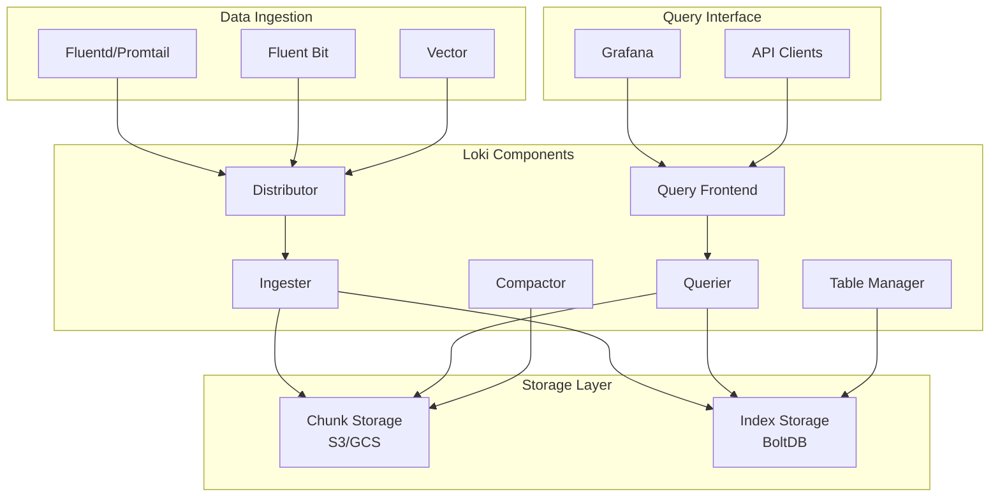

---original_language: Chinese
authors:
- name: Dillan Teagle
  role: contributor
source_path: /Users/teaglebuilt/workspace/kudig-database/domain-06-observability/03-logging/03-loki-enterprise-log-aggregation.md
title: Loki Enterprise Log Aggregation and Analytics Platform
description: Best practices for Loki enterprise log aggregation
summary: Best practices for Loki enterprise log aggregation
category: general
tags:
- k8s
- grafana
- istio
- docker
- statefulset
- job
- ingress
- gateway
- rbac
- networkpolicy
tier: supporting
created: '2026-05-23'
last_updated: 2026-05
difficulty: intermediate
reading_level: intermediate
audience:
- All engineers
estimated_read_time: 25min
intent_queries:
- What is Loki Enterprise Log Aggregation and Analytics Platform
- How to use Loki Enterprise Log Aggregation and Analytics Platform
- Kubernetes 06 observability best practices
trigger_keywords:
- Loki
- Enterprise
- Log
- Aggregation
- and
- Analytics
- Platform
- observability
prerequisites:
- kubectl-basics
- observability-basics
- service-mesh-basics
- monitoring-basics
- logging-basics
---

> **Production Environment Security Notice**
>
> This document contains directly executable DevOps commands. Before execution, please confirm: whether the current target cluster and namespace are correct; whether you have sufficient RBAC permissions; whether it has been verified in a non-production environment. Command risk levels are marked as: 🔴 High Risk (may cause data loss or service interruption), 🟡 Medium Risk (modifies cluster state but usually reversible), 🟢 Low Risk/Read-only (information gathering, no side effects).


---
tags:
- observability
- logging
intent_queries:
- What is loki-enterprise-log-aggregation?
- How to use loki-enterprise-log-aggregation
- Best practices for loki-enterprise-log-aggregation

tier: peripheral
---
title: Loki Enterprise Log Aggregation and Analytics Platform
description: '<!-- chunk: Overview'
category: logging-management-analytics
tags:
- k8s
- logging
- efk
- loki
- grafana
- [[Istio|istio]]
- docker
- statefulset
- job
- ingress
last_updated: 2026-05
difficulty: intermediate
reading_level: intermediate
audience:
- SRE
- Operations engineers
- Data engineers
estimated_read_time: 5min
intent_queries:
- What is Loki Enterprise Log Aggregation and Analytics Platform
- How to use Loki Enterprise Log Aggregation and Analytics Platform
- Kubernetes 21 logging management analytics best practices
trigger_keywords:
- Loki
- Enterprise
- Log
- Aggregation
- and
- Analytics
- Platform
- logging
authors:
- name: Dillan Teagle
  role: contributor
k8s_versions:
- '1.28'
- '1.29'
- '1.30'
- '1.31'
- '1.32'
---

# Loki Enterprise Log Aggregation and Analytics Platform

<!-- chunk: Overview -->
## Overview

Loki is a horizontally scalable, highly available log aggregation system developed by Grafana Labs, designed specifically for cloud-native environments. This document details Loki enterprise deployment architecture, log processing pipelines, and analytics capabilities.

Loki is a horizontally scalable, highly available log aggregation system developed by Grafana Labs, designed specifically for cloud-native environments. This document details Loki enterprise deployment architecture, log processing pipelines, and analytics capabilities.

<!-- chunk: Architecture Design -->
## Architecture Design

## Core Component Architecture

```yaml
# Loki enterprise architecture
apiVersion: v1
kind: Namespace
metadata:
  name: loki-system
---
apiVersion: v1
kind: ConfigMap
metadata:
  name: loki-config
  namespace: loki-system
data:
  loki.yml: |
    auth_enabled: false
    
    server:
      http_listen_port: 3100
      grpc_listen_port: 9096
      
    common:
      path_prefix: /loki
      storage:
        filesystem:
          chunks_directory: /loki/chunks
          rules_directory: /loki/rules
      replication_factor: 1
      ring:
        kvstore:
          store: inmemory
      
    schema_config:
      configs:
        - from: 2020-10-24
          store: boltdb-shipper
          object_store: filesystem
          schema: v11
          index:
            prefix: index_
            period: 24h
            
    storage_config:
      boltdb_shipper:
        active_index_directory: /loki/boltdb-shipper-active
        cache_location: /loki/boltdb-shipper-cache
        cache_ttl: 24h
        shared_store: filesystem
      filesystem:
        directory: /loki/chunks
        
    chunk_store_config:
      max_look_back_period: 0s
      
    table_manager:
      retention_deletes_enabled: false
      retention_period: 0s
      
    compactor:
      working_directory: /loki/retention
      shared_store: filesystem
      compaction_interval: 10m
      retention_enabled: true
      retention_delete_delay: 2h
```

## Microservices Architecture



<!-- chunk: Deployment Configuration -->
## Deployment Configuration

## Distributed Deployment

```yaml
# Loki Distributor deployment
apiVersion: apps/v1
kind: Deployment
metadata:
  name: loki-distributor
  namespace: loki-system
spec:
  replicas: 3
  selector:
    matchLabels:
      app: loki-distributor
  template:
    metadata:
      labels:
        app: loki-distributor
    spec:
      containers:
      - name: loki
        image: grafana/loki:2.9.3
        args:
        - "-config.file=/etc/loki/config/loki.yml"
        - "-target=distributor"
        ports:
        - containerPort: 3100
          name: http
        - containerPort: 9096
          name: grpc
        volumeMounts:
        - name: config
          mountPath: /etc/loki/config
        - name: storage
          mountPath: /loki
        resources:
          requests:
            cpu: "1"
            memory: "2Gi"
          limits:
            cpu: "2"
            memory: "4Gi"
      volumes:
      - name: config
        configMap:
          name: loki-config
      - name: storage
        emptyDir: {}
---
# Loki Ingester deployment
apiVersion: apps/v1
kind: StatefulSet
metadata:
  name: loki-ingester
  namespace: loki-system
spec:
  serviceName: loki-ingester
  replicas: 3
  selector:
    matchLabels:
      app: loki-ingester
  template:
    metadata:
      labels:
        app: loki-ingester
    spec:
      containers:
      - name: loki
        image: grafana/loki:2.9.3
        args:
        - "-config.file=/etc/loki/config/loki.yml"
        - "-target=ingester"
        ports:
        - containerPort: 3100
          name: http
        - containerPort: 9096
          name: grpc
        volumeMounts:
        - name: config
          mountPath: /etc/loki/config
        - name: data
          mountPath: /loki
        env:
        - name: POD_NAME
          valueFrom:
            fieldRef:
              fieldPath: metadata.name
        readinessProbe:
          httpGet:
            path: /ready
            port: 3100
          initialDelaySeconds: 15
          periodSeconds: 30
      volumes:
      - name: config
        configMap:
          name: loki-config
  volumeClaimTemplates:
  - metadata:
      name: data
    spec:
      accessModes: ["ReadWriteOnce"]
      resources:
        requests:
          storage: 100Gi
```

## Object Storage Integration

```yaml
# AWS S3 configuration
storage_config:
  aws:
    s3: s3://access_key:secret_access_key@loki-logs-bucket
    s3forcepathstyle: false
    insecure: false
  boltdb_shipper:
    active_index_directory: /loki/boltdb-shipper-active
    cache_location: /loki/boltdb-shipper-cache
    shared_store: s3

# Google Cloud Storage configuration
storage_config:
  gcs:
    bucket_name: loki-logs-bucket
    service_account: /etc/gcs/service-account.json
  boltdb_shipper:
    active_index_directory: /loki/boltdb-shipper-active
    cache_location: /loki/boltdb-shipper-cache
    shared_store: gcs
```

<!-- chunk: Log Collection Agents -->
## Log Collection Agents

## Promtail Configuration

```yaml
# Promtail main configuration
server:
  http_listen_port: 9080
  grpc_listen_port: 0

positions:
  filename: /tmp/positions.yaml

clients:
  - url: http://loki-gateway.loki-system.svc.cluster.local/loki/api/v1/push

scrape_configs:
  # Kubernetes Pods log collection
  - job_name: kubernetes-pods
    kubernetes_sd_configs:
      - role: pod
    pipeline_stages:
      - cri: {}
      - labeldrop:
          - filename
    relabel_configs:
      - source_labels:
          - __meta_kubernetes_pod_node_name
        target_label: node_name
      - source_labels:
          - __meta_kubernetes_namespace
        target_label: namespace
      - source_labels:
          - __meta_kubernetes_pod_name
        target_label: pod
      - source_labels:
          - __meta_kubernetes_pod_container_name
        target_label: container
      - source_labels:
          - __meta_kubernetes_pod_uid
        target_label: pod_uid
      - replacement: /var/log/pods/*$1/*.log
        separator: /
        source_labels:
          - __meta_kubernetes_pod_uid
          - __meta_kubernetes_pod_container_name
        target_label: __path__

  # System logs collection
  - job_name: system-logs
    static_configs:
      - targets:
          - localhost
        labels:
          job: varlogs
          __path__: /var/log/*log
    pipeline_stages:
      - regex:
          expression: '^(?P<timestamp>\d{4}-\d{2}-\d{2} \d{2}:\d{2}:\d{2}) (?P<message>.*)$'
      - timestamp:
          source: timestamp
          format: RFC3339
      - output:
          source: message
```

## Fluent Bit Integration

```yaml
# Fluent Bit Loki output plugin configuration
[SERVICE]
    Flush         1
    Log_Level     info
    Daemon        off
    Parsers_File  parsers.conf

[INPUT]
    Name              tail
    Path              /var/log/containers/*.log
    Parser            docker
    Tag               kube.*
    Mem_Buf_Limit     5MB
    Skip_Long_Lines   On

[FILTER]
    Name                kubernetes
    Match               kube.*
    Merge_Log           On
    Keep_Log            Off
    K8S-Logging.Parser  On
    K8S-Logging.Exclude On

[OUTPUT]
    Name            loki
    Match           *
    Host            loki-gateway.loki-system.svc.cluster.local
    Port            80
    Labels          job=fluentbit, namespace=$kubernetes['namespace_name'], pod=$kubernetes['pod_name']
    BatchWait       1s
    BatchSize       1001024
    LineFormat      json
    LogLevel        warn
```

<!-- chunk: Log Processing Pipelines -->
## Log Processing Pipelines

## Advanced Log Parsing

```yaml
# Complex log processing pipeline
pipeline_stages:
  # JSON parsing stage
  - json:
      expressions:
        level: level
        timestamp: timestamp
        message: msg
        error_code: error.code
        user_id: user.id
  
  # Timestamp processing
  - timestamp:
      source: timestamp
      format: RFC3339
  
  # Label extraction
  - labels:
      level:
      error_code:
      user_id:
  
  # Structured field extraction
  - output:
      source: message
  
  # Conditional filtering
  - matchers:
    - selector="{level="ERROR"}"
    - stages=""
    - - static_labels=""
    - severity="high"
    - - drop=""
    - source="error_code"
    - expression="^4\\d{2}$"
  # Regular expression parsing
  - regex:
      expression: '^(?P<ip>\d+\.\d+\.\d+\.\d+) - (?P<user>\S+) \[(?P<timestamp>[^]]+)\] "(?P<method>\S+) (?P<path>\S+) (?P<protocol>\S+)" (?P<status>\d+) (?P<size>\d+)'
  
  # Numeric conversion
  - unpack:
      source: size
      type: int
  
  # String operations
  - template:
      source: path
      template: '{{ TrimPrefix "/" .Value }}'
```

## Dynamic Label Management

```yaml
# Dynamic label configuration
scrape_configs:
  - job_name: application-logs
    kubernetes_sd_configs:
      - role: pod
    pipeline_stages:
      - cri: {}
      # Dynamic label extraction
      - static_labels:
          cluster: production
          region: us-west-2
      # Content-based labels
      - matchers:
        - selector="{container="nginx"}"
        - stages=""
        - - regex=""
        - expression="GET|POST|PUT|DELETE"
        - source="msg"
        - - labels=""
        - method=""
      # Label rewriting
      - labeldrop:
          - pod_template_hash
          - controller_revision_hash
      - labelkeep:
          - namespace
          - pod
          - container
          - level
```

<!-- chunk: Query and Analytics -->
## Query and Analytics

## LogQL Query Language

```logql
# Basic log query
{namespace="production", container="api-server"} |= "error" | json | level="ERROR"

# Aggregation queries
count_over_time({namespace="production"}[1h])
rate({job="nginx"} |= "404" [5m])
topk(10, sum(rate({namespace="frontend"}[10m])) by (pod))

# Complex filtering
{container="payment-service"} 
|~ `failed to process payment` 
| json 
| error_code >= 500 
| line_format "{{.timestamp}} {{.message}}"

# Time series transformation
sum(count_over_time({namespace="backend"} |~ "database connection" [1h])) 
by (pod) > 10

# Label filter combination
{namespace=~"prod.*", container!="istio-proxy"} 
|= "timeout" 
!= "retry" 
| pattern "<_> - - <ip> <_> \"<method> <path> <_>\" <status> <size>"
```

## Visualization Analytics

```json
{
  "dashboard": {
    "title": "Loki Enterprise Log Analytics",
    "panels": [
      {
        "title": "Error Rate by Service",
        "type": "graph",
        "targets": [
          {
            "expr": "sum(rate({namespace=\"production\"} |= \"ERROR\" [5m])) by (service)",
            "legendFormat": "{{service}}"
          }
        ]
      },
      {
        "title": "Log Volume Trend",
        "type": "heatmap",
        "targets": [
          {
            "expr": "sum(count_over_time({job=\"application-logs\"} [1h]))",
            "legendFormat": "Log Volume"
          }
        ]
      },
      {
        "title": "Top Error Messages",
        "type": "table",
        "targets": [
          {
            "expr": "topk(10, count_over_time({namespace=\"production\"} |= \"ERROR\" [1h]))",
            "legendFormat": "{{msg}}"
          }
        ]
      }
    ]
  }
}
```

<!-- chunk: Performance Optimization -->
## Performance Optimization

## Storage Optimization

```yaml
# Performance optimization configuration
chunk_store_config:
  chunk_cache_config:
    memcached:
      expiration: 1h
      batch_size: 100
      parallelism: 50
  write_dedupe_cache_config:
    memcached_client:
      consistent_hash: true
      host: memcached.loki-system.svc.cluster.local
      service: memcached-client

limits_config:
  ingestion_rate_mb: 100
  ingestion_burst_size_mb: 200
  max_entries_limit_per_query: 10000
  max_streams_per_user: 10000
  max_global_streams_per_user: 50000
  unordered_writes: true

query_range:
  split_queries_by_interval: 24h
  parallelise_shardable_queries: true
  cache_results: true
  results_cache:
    cache:
      memcached_client:
        consistent_hash: true
        host: memcached-query.loki-system.svc.cluster.local
        service: memcached-client
```

## Query Optimization

> ⚠️ **🟡 Medium Risk Change** — Modifies cluster resource state, recommend first doing --dry-run or diff to verify
> - `kubectl exec`: Enter container to execute commands, may modify container state

``` bash
# 🟡 Medium Risk: Modifies cluster/resource state, please verify target, impact scope and authorization before execution
#!/bin/bash
# Loki query performance optimization script

# Query optimization function
optimize_queries() {
    echo "=== Query Optimization ==="
    
    # Analyze slow queries
    kubectl exec -n loki-system deploy/loki-query-frontend -- \
    curl -s "http://localhost:3100/loki/api/v1/query?query=count_over_time({namespace=~\".*\"}[1h])&limit=1000" | \
    jq '.data.result | length'
    
    # Optimize indexes
    kubectl exec -n loki-system sts/loki-compactor -- \
    loki -config.file=/etc/loki/config/loki.yml \
    -target=compactor \
    -boltdb.shipper.compact=true
}

# Storage cleanup
cleanup_storage() {
    echo "=== Storage Cleanup ==="
    
    # Delete expired data
    kubectl exec -n loki-system sts/loki-table-manager -- \
    loki -config.file=/etc/loki/config/loki.yml \
    -table-manager.retention-period=30d \
    -table-manager.retention-deletes-enabled=true
    
    # Clean up orphaned chunks
    kubectl exec -n loki-system sts/loki-compactor -- \
    loki -config.file=/etc/loki/config/loki.yml \
    -compactor.cleanup-interval=1h
}
```
<!-- chunk: Monitoring and Alerting -->
## Monitoring and Alerting

## Key Metrics Monitoring

```yaml
# Loki monitoring rules
groups:
- name: loki.rules
  rules:
  # Receiver monitoring
  - alert: LokiRequestErrors
    expr: 100 * sum(rate(loki_request_duration_seconds_count{status_code=~"5.."}[1m])) by (job, route) / sum(rate(loki_request_duration_seconds_count[1m])) by (job, route) > 10
    for: 15m
    labels:
      severity: critical
    annotations:
      summary: "High error rate in Loki requests"
      description: "{{ $labels.job }} {{ $labels.route }} is experiencing high error rates."

  # Write performance monitoring
  - alert: LokiIngestionRateHigh
    expr: sum(rate(loki_distributor_ingestion_line_count_total[5m])) > 100000
    for: 10m
    labels:
      severity: warning
    annotations:
      summary: "High log ingestion rate"
      description: "Loki ingestion rate is above 100,000 lines per second."

  # Storage monitoring
  - alert: LokiStorageUtilizationHigh
    expr: (sum(loki_ingester_memory_chunks) / sum(loki_ingester_memory_chunks_max)) * 100 > 80
    for: 10m
    labels:
      severity: warning
    annotations:
      summary: "High storage utilization"
      description: "Loki storage utilization is above 80%."

  # Query performance monitoring
  - alert: LokiQueryLatencyHigh
    expr: histogram_quantile(0.99, rate(loki_request_duration_seconds_bucket{route="/api/prom/query"}[5m])) > 10
    for: 10m
    labels:
      severity: warning
    annotations:
      summary: "High query latency"
      description: "99th percentile query latency is above 10 seconds."

  # Component health monitoring
  - alert: LokiComponentDown
    expr: up{job="loki"} == 0
    for: 5m
    labels:
      severity: critical
    annotations:
      summary: "Loki component is down"
      description: "{{ $labels.instance }} of job {{ $labels.job }} is down."
```

<!-- chunk: Security Configuration -->
## Security Configuration

## Authentication and Authorization

```yaml
# Auth configuration
auth_enabled: true

server:
  grpc_tls_config:
    cert_file: /etc/loki/certs/tls.crt
    key_file: /etc/loki/certs/tls.key
    client_auth_type: RequireAndVerifyClientCert
    client_ca_file: /etc/loki/certs/ca.crt

http_tls_config:
  cert_file: /etc/loki/certs/tls.crt
  key_file: /etc/loki/certs/tls.key
  client_auth_type: RequireAndVerifyClientCert
  client_ca_file: /etc/loki/certs/ca.crt

# RBAC configuration
rbac:
  namespaces:
    production:
      users:
        - admin-user
        - ops-team
      permissions:
        - read
        - write
    staging:
      users:
        - dev-team
      permissions:
        - read
```

## Network Security

```yaml
# Network Policies
apiVersion: networking.k8s.io/v1
kind: NetworkPolicy
metadata:
  name: loki-network-policy
  namespace: loki-system
spec:
  podSelector:
    matchLabels:
      app: loki
  policyTypes:
  - Ingress
  - Egress
  ingress:
  - from:
    - namespaceSelector:
        matchLabels:
          name: monitoring
    ports:
    - protocol: TCP
      port: 3100
  egress:
  - to:
    - namespaceSelector:
        matchLabels:
          name: storage
    ports:
    - protocol: TCP
      port: 443
```

<!-- chunk: Troubleshooting -->
## Troubleshooting

## Common Issue Diagnosis

> ⚠️ **🟡 Medium Risk Change** — Modifies cluster resource state, recommend first doing --dry-run or diff to verify
> - `kubectl exec`: Enter container to execute commands, may modify container state

``` bash
# 🟡 Medium Risk: Modifies cluster/resource state, please verify target, impact scope and authorization before execution
#!/bin/bash
# Loki troubleshooting tool

# Component status check
check_loki_status() {
    echo "=== Loki Component Status ==="
    
    kubectl get pods -n loki-system -o wide
    echo ""
    
    # Check service status
    kubectl get services -n loki-system
    echo ""
    
    # Check configuration
    kubectl get configmaps -n loki-system
}

# Performance diagnostics
performance_diagnostics() {
    echo "=== Performance Diagnostics ==="
    
    # Check memory usage
    kubectl top pods -n loki-system
    echo ""
    
    # Check ingester status
    kubectl exec -n loki-system sts/loki-ingester-0 -- \
    curl -s http://localhost:3100/ready | jq .
    echo ""
    
    # Check distributor status
    kubectl exec -n loki-system deploy/loki-distributor -- \
    curl -s http://localhost:3100/metrics | \
    grep -E "(loki_ingester_flush|loki_distributor_ingestion)"
}

# Log stream diagnostics
log_stream_diagnostics() {
    echo "=== Log Stream Diagnostics ==="
    
    # Check log receiving
    kubectl exec -n loki-system deploy/loki-distributor -- \
    curl -s "http://localhost:3100/api/prom/label/__name__/values" | \
    jq .
    echo ""
    
    # Check log volume for specific labels
    kubectl exec -n loki-system deploy/loki-query-frontend -- \
    curl -s "http://localhost:3100/loki/api/v1/query?query=count_over_time({namespace=\"production\"}[1h])" | \
    jq '.data.result[].value[1]'
}
```
<!-- chunk: Best Practices -->
## Best Practices

## Deployment Best Practices

1. **Resource Planning**
   ```yaml
   resources:
     requests:
       cpu: "2"
       memory: "8Gi"
     limits:
       cpu: "4"
       memory: "16Gi"
   ```

2. **High Availability Configuration**
   - Minimum 3 Ingester replicas
   - Distributor horizontal scaling
   - Use persistent storage

3. **Network Optimization**
   - Enable gRPC compression
   - Configure connection pooling
   - Optimize timeout settings

## Operations Best Practices

1. **Monitoring Coverage**
   - End-to-end latency monitoring
   - Storage capacity alerting
   - Component health checks

2. **Data Management**
   - Set reasonable retention policies
   - Regularly clean up expired data
   - Monitor storage costs

3. **Security Hardening**
   - Enable TLS encryption
   - Configure RBAC permissions
   - Regular security audits

---

**Document Version**: v1.0  
**Last Updated**: 2024  
**Applicable Versions**: Loki v2.9+

---

<!-- chunk: Obsidian Related Documents -->
## Obsidian Related Documents

- domain-21-logging-management-analytics MOC
- [[domain-06-observability/README.md|Domain 06: Logging Management and Analytics]]
- [[domain-06-observability/00-open-source-projects-index.md|Domain-21 Logging Management and Analytics — Open Source Projects Index]]
- ELK Stack Enterprise-Grade Log Management System In-Depth Practice
- Fluentd Enterprise-Grade Log Collection and Processing In-Depth Practice
- Enterprise-Grade Log Governance and Compliance Audit In-Depth Practice
- Graylog Enterprise-Grade Log Management Platform In-Depth Practice
- Splunk Enterprise-Grade Log Analysis and Security Intelligence Platform In-Depth Practice
- Enterprise-Grade Real-Time Log Analysis and Business Insights In-Depth Practice
- Splunk Enterprise Log Analytics Platform In-Depth Practice
- Loggly Cloud Log Management Platform In-Depth Practice

## See Also

- 01-elk-stack-enterprise-logging
- 02-fluentd-enterprise-log-processing
- 04-enterprise-log-governance-compliance
- 04-graylog-enterprise-logging

- [[domain-06-observability/README.md|Back to index]]

## Related

- [[domain-19-landscape-references/topic-index/observability-index.md|Observability Knowledge Graph Index]]


<!-- risk-assessed -->
