> **Production Environment Security Reminder**
>
> This document contains operational commands that can be executed directly. Before execution, please confirm: whether the current target cluster and namespace are correct; whether you have sufficient RBAC permissions; whether the commands have been verified in a non-production environment. Command risk levels are marked as: 🔴 High risk (may cause data loss or service interruption), 🟡 Medium risk (will modify cluster state but usually can be rolled back), 🟢 Low risk / read-only (information collection, no side effects).


# Enterprise-Level Log Governance and Compliance Audit Deep Practice

> **Author**: Enterprise Log Governance Expert | **Version**: v1.0 | **Updated**: 2026-02-07
> **Applicable Scenarios**: Enterprise-level log governance system and compliance audit | **Complexity**: ⭐⭐⭐⭐⭐

<!-- chunk: 🎯 Summary -->## 🎯 Summary

This document deeply explores the architecture design of enterprise-level log governance systems, compliance requirement implementation, and audit management practices. Based on practical experience from highly regulated industries such as finance, healthcare, and government, it provides a comprehensive technical guide from log standardization to compliance auditing, helping enterprises build log governance systems that conform to international standards.

<!-- chunk: 1. Enterprise-Level Log Governance Architecture -->## 1. Enterprise-Level Log Governance Architecture

## 1.1 Governance Framework Design

```mermaid
graph TB
    subgraph "Log Collection Layer"
        A[Application Logs] --> B[System Logs]
        C[Security Logs] --> D[Network Logs]
        E[Audit Logs] --> F[Business Logs]
        G[Third-party Logs] --> H[IoT Device Logs]
    end
    
    subgraph "Standardization Processing Layer"
        I[Format Standardization] --> J[ECS Mapping]
        K[Field Normalization] --> L[Metadata Enrichment]
        M[Sensitive Data Masking] --> N[PII Processing]
        O[Timestamp Unification] --> P[Encoding Standardization]
    end
    
    subgraph "Classified Storage Layer"
        Q[Hot Data Storage] --> R[SSD High-speed Storage]
        S[Warm Data Storage] --> T[NVMe Storage]
        U[Cold Data Storage] --> V[Object Storage]
        W[Archive Storage] --> X[Tape Library / Glacier]
    end
    
    subgraph "Governance Control Layer"
        Y[Access Control] --> Z[Permission Management]
        AA[Data Lifecycle] --> AB[Retention Policy]
        AC[Compliance Check] --> AD[Audit Trail]
        AE[Cost Optimization] --> AF[Capacity Planning]
    end
    
    subgraph "Analysis Application Layer"
        AG[Real-time Analysis] --> AH[Batch Processing]
        AI[Machine Learning] --> AJ[Anomaly Detection]
        AK[Compliance Reporting] --> AL[Audit Dashboard]
        AM[Business Insights] --> AN[Decision Support]
    end
    
    subgraph "Security Protection Layer"
        AO[Encrypted Transmission] --> AP[TLS/SSL]
        AQ[Encryption at Rest] --> AR[AES-256]
        AS[Integrity Verification] --> AT[Hash Signatures]
        AU[Tamper Prevention] --> AV[Blockchain Proof]
    end
```



## 1.2 Governance Maturity Model

## 1.2.1 Governance Level Classification

```yaml
# governance-maturity-model.yaml
governance_levels:
  level_1_basic:
    name: "Basic Log Collection"
    characteristics:
      - Centralized log collection
      - Basic storage capability
      - Simple query functionality
    requirements:
      - Collect main application logs
      - Retain 30 days of historical data
      - Support keyword search
    compliance_coverage: "20%"
    
  level_2_standardized:
    name: "Standardized Governance"
    characteristics:
      - Unified log format
      - Structured data storage
      - Standardized query interface
    requirements:
      - Implement ECS/EFL standardization
      - Establish data dictionary
      - Implement basic alert mechanism
    compliance_coverage: "50%"
    
  level_3_managed:
    name: "Controlled Governance"
    characteristics:
      - Complete metadata management
      - Automated processing flow
      - Advanced analysis capability
    requirements:
      - Implement data quality management
      - Establish governance policies
      - Integrate monitoring and alerting
    compliance_coverage: "75%"
    
  level_4_optimized:
    name: "Optimized Governance"
    characteristics:
      - Intelligent processing capability
      - Predictive analysis
      - Cost-benefit optimization
    requirements:
      - AI/ML-driven analysis
      - Automated compliance checking
      - Continuous improvement mechanism
    compliance_coverage: "90%"
    
  level_5_governed:
    name: "Full Governance"
    characteristics:
      - Complete governance framework
      - Proactive risk management
      - Innovation-driven optimization
    requirements:
      - End-to-end governance coverage
      - Real-time compliance monitoring
      - Industry-leading practices
    compliance_coverage: "98%"
```

<!-- chunk: 2. Compliance Standard Implementation -->## 2. Compliance Standard Implementation

## 2.1 International Compliance Framework Mapping

## 2.1.1 SOX (Sarbanes-Oxley) Compliance

```yaml
# sox-compliance-framework.yaml
sox_requirements:
  section_302:
    title: "Financial Reporting Responsibility"
    logging_requirements:
      - All financial system operations must be recorded
      - User login and permission changes must be audited
      - Critical business data modifications must leave traces
    retention_period: "7 years"
    access_control:
      - Principle of least privilege
      - Separation of Duties (SoD)
      - Regular permission review
    
  section_404:
    title: "Internal Control Assessment"
    logging_requirements:
      - System configuration changes must be recorded
      - Data access patterns must be monitored
      - Abnormal behavior must trigger alerts
    controls:
      - Change management process
      - Access control review
      - Risk assessment mechanism
      
  section_802:
    title: "Document Falsification Crime"
    logging_requirements:
      - Log integrity protection
      - Immutable timestamps
      - Digital signature verification
    technical_measures:
      - Blockchain log proof
      - Hash chain integrity protection
      - Multi-replica geo-distributed storage

sox_implementation:
  data_classification:
    financial_data:
      sensitivity: "Highest"
      retention: "7 years"
      encryption: "AES-256"
      access_control: "Strict approval"
    operational_data:
      sensitivity: "High"
      retention: "3 years"
      encryption: "AES-128"
      access_control: "Department approval"
    audit_trail:
      sensitivity: "Highest"
      retention: "10 years"
      encryption: "AES-256"
      access_control: "Audit committee exclusive"
```

## 2.1.2 GDPR Compliance Implementation

```yaml
# gdpr-compliance-implementation.yaml
gdpr_principles:
  lawfulness:
    requirement: "Lawful, fair and transparent processing of personal data"
    implementation:
      - Clear data processing purpose statement
      - User consent mechanism recording
      - Data processing activity registration
    
  purpose_limitation:
    requirement: "Collect for specific, explicit and lawful purposes"
    implementation:
      - Data usage tagging and management
      - Alerts for purpose violation
      - Regular compliance review
      
  data_minimization:
    requirement: "Collect only necessary personal data"
    implementation:
      - Minimum dataset definition
      - Automated data cleanup
      - Regular data reduction review
      
  accuracy:
    requirement: "Ensure accuracy and completeness of personal data"
    implementation:
      - Data quality monitoring
      - Automated error correction
      - User data correction process
      
  storage_limitation:
    requirement: "Do not retain beyond necessary period"
    implementation:
      - Automated data lifecycle management
      - Regular data cleanup policy
      - Storage retention reminder mechanism
      
  integrity_confidentiality:
    requirement: "Ensure appropriate security protection"
    implementation:
      - End-to-end encryption
      - Enhanced access control
      - Security incident response

gdpr_rights_implementation:
  right_to_access:
    description: "Data subject has the right to access their personal data"
    technical_measures:
      - User data portal
      - Self-service data query API
      - Data access logging
      
  right_to_rectification:
    description: "Data subject has the right to correct inaccurate data"
    technical_measures:
      - Online data correction interface
      - Correction request workflow
      - Correction confirmation mechanism
      
  right_to_erasure:
    description: "Right to be Forgotten"
    technical_measures:
      - Automated data deletion process
      - Cross-system data sync deletion
      - Deletion confirmation and proof
      
  right_to_data_portability:
    description: "Data portability right"
    technical_measures:
      - Standardized data export format
      - API data export interface
      - Batch data migration tool
      
  right_to_object:
    description: "Right to object"
    technical_measures:
      - Processing activity opt-out mechanism
      - Marketing push unsubscribe function
      - Automated objection handling process

technical_controls:
  data_discovery:
    tools:
      - Data asset inventory system
      - Automated PII identification tool
      - Data flow mapping
    processes:
      - Regular data census
      - New system data assessment
      - Third-party data review
      
  privacy_by_design:
    principles:
      - Privacy protection by default
      - Data minimization collection
      - Transparency design
    implementation:
      - Privacy Impact Assessment (PIA)
      - Data Protection Impact Assessment (DPIA)
      - Privacy-friendly default settings
      
  breach_notification:
    timeline: "Report to regulators within 72 hours"
    procedures:
      - Security incident severity response
      - Automated vulnerability detection
      - Rapid notification mechanism
    documentation:
      - Incident response plan
      - Impact assessment template
      - Notification record system
```

## 2.2 Industry-Specific Compliance Requirements

## 2.2.1 Financial Industry PCI DSS Compliance

```yaml
# pci-dss-compliance.yaml
pci_dss_requirements:
  requirement_1:
    title: "Install and Maintain Firewall Configuration"
    logging_impact:
      - Firewall rule changes must be recorded
      - Network access denials must be recorded
      - Security policy enforcement must be audited
      
  requirement_2:
    title: "Do Not Use Vendor-Supplied Default Passwords"
    logging_impact:
      - Default password changes must be recorded
      - Password policy changes must be audited
      - User account creation must leave traces
      
  requirement_3:
    title: "Protect Stored Cardholder Data"
    logging_impact:
      - Data encryption operations must be recorded
      - Key management activities must be audited
      - Data access must be detailed in logs
      
  requirement_4:
    title: "Encrypt Data in Transit"
    logging_impact:
      - SSL/TLS handshakes must be recorded
      - Encryption protocol versions must be monitored
      - Certificate expiration must be tracked
      
  requirement_10:
    title: "Track and Monitor All Access"
    logging_requirements:
      - All system component access must be recorded
      - User authentication must be audited
      - Administrator operations must be detailed in logs
      - Failed login attempts must be recorded
    retention_period: "At least 1 year"
    
  requirement_11:
    title: "Regularly Test Security Systems and Processes"
    logging_impact:
      - Penetration tests must be recorded
      - Vulnerability scans must be audited
      - Security assessments must leave traces

pci_logging_specifications:
  mandatory_fields:
    - timestamp
    - user_identity
    - action_type
    - resource_accessed
    - source_ip
    - outcome
    - session_id
    
  sensitive_data_handling:
    credit_card_masking: "Show first 6 and last 4 digits, replace middle with asterisks"
    cvv_prohibition: "Strictly prohibited to record CVV/CVC code"
    pin_protection: "Strictly prohibited to record PIN code"
    
  log_review_requirements:
    frequency: "Daily review"
    reviewers: "Independent security team"
    escalation: "Immediate escalation for anomalies"
```

## 2.2.2 Healthcare Industry HIPAA Compliance

```yaml
# hipaa-compliance.yaml
hipaa_rules:
  privacy_rule:
    scope: "Protect privacy of personal health information (PHI)"
    key_requirements:
      - Principle of minimum necessity
      - Patient consent mechanism
      - Privacy notification obligation
    logging_implications:
      - PHI access must be recorded
      - Data sharing must be audited
      - Patient rights exercise must leave traces
      
  security_rule:
    scope: "Technical and physical security of electronic PHI (ePHI)"
    administrative_safeguards:
      - Security management process
      - Personnel security training
      - Risk assessment procedure
    physical_safeguards:
      - Equipment physical security
      - Workstation security
      - Equipment disposal security
    technical_safeguards:
      - Access control mechanism
      - Data transmission encryption
      - Audit control requirements
      
  enforcement_rule:
    scope: "Investigation and enforcement of non-compliance"
    penalties:
      - Minimum fine: $100/violation
      - Maximum fine: $1,500,000/year
      - Criminal liability: severe violations may result in imprisonment

hipaa_logging_requirements:
  audit_controls:
    required_events:
      - User login/logout
      - PHI access and modification
      - System configuration changes
      - Security parameter adjustments
      - Data transmission activities
    retention_period: "At least 6 years"
    
  access_control_logging:
    user_authentication:
      - Login time recording
      - Authentication method recording
      - Failed attempt recording
      - Session duration
    authorization:
      - Permission granting recording
      - Role change recording
      - Access denial recording
      - Privileged use recording
      
  transmission_security:
    encryption_logging:
      - Encryption algorithm usage recording
      - Key exchange recording
      - Certificate status monitoring
      - Encryption failure alerts
      
  integrity_protection:
    data_integrity:
      - Data modification recording
      - Checksum calculation recording
      - Integrity verification results
      - Tampering detection alerts
```

<!-- chunk: 3. Enterprise Audit Management -->## 3. Enterprise Audit Management

## 3.1 Audit Framework Design

## 3.1.1 Audit Type Classification

```yaml
# audit-framework.yaml
audit_types:
  compliance_audit:
    scope: "Regulatory compliance inspection"
    frequency: "Quarterly/Annual"
    auditors: "External audit firms"
    deliverables:
      - Compliance status report
      - Defect list
      - Improvement suggestions
    key_areas:
      - Data protection compliance
      - Security control effectiveness
      - Process execution status
      
  operational_audit:
    scope: "Daily operational efficiency inspection"
    frequency: "Monthly/Quarterly"
    auditors: "Internal audit team"
    deliverables:
      - Operational efficiency report
      - Cost-benefit analysis
      - Process optimization suggestions
    key_areas:
      - System performance monitoring
      - Resource utilization efficiency
      - Issue response timeliness
      
  security_audit:
    scope: "Verification of security control effectiveness"
    frequency: "Semi-annual"
    auditors: "Security expert team"
    deliverables:
      - Security assessment report
      - Vulnerability risk rating
      - Remediation prioritization
    key_areas:
      - Access control review
      - Encryption implementation inspection
      - Threat detection capability
      
  forensic_audit:
    scope: "Security incident investigation and analysis"
    frequency: "Event-triggered"
    auditors: "Digital forensics experts"
    deliverables:
      - Incident investigation report
      - Responsibility determination conclusion
      - Legal evidence materials
    key_areas:
      - Log integrity verification
      - Attack path reconstruction
      - Loss quantification assessment

audit_evidence_management:
  evidence_categories:
    documentary_evidence:
      - Policy documents
      - Process documentation
      - Training records
    electronic_evidence:
      - System logs
      - Monitoring records
      - Configuration snapshots
    testimonial_evidence:
      - Interview records
      - Questionnaires
      - Expert testimony
      
  evidence_protection:
    integrity_measures:
      - Hash value calculation
      - Digital signature
      - Timestamp service
    availability_measures:
      - Multi-replica storage
      - Geo-distributed backup
      - Access permission control
    chain_of_custody:
      - Evidence transfer recording
      - Handler registration
      - Operation timestamp
```

## 3.1.2 Audit Plan Development

```python
# audit-planning.py
from datetime import datetime, timedelta
from typing import List, Dict, Optional
import json

class AuditPlanner:
    def __init__(self):
        self.audit_schedule = []
        self.risk_registry = {}
        self.resource_constraints = {}
        
    def assess_audit_risks(self) -> Dict[str, float]:
        """Assess audit risks for various systems and processes"""
        risk_factors = {
            'data_sensitivity': 0.8,  # Data sensitivity
            'regulatory_impact': 0.9,  # Regulatory impact
            'business_criticality': 0.7,  # Business criticality
            'control_maturity': 0.6,  # Control maturity
            'change_frequency': 0.5,  # Change frequency
            'last_audit_date': 0.4  # Time since last audit
        }
        
        systems = {
            'customer_database': {
                'sensitivity': 0.9,
                'regulatory_impact': 0.9,
                'criticality': 0.8,
                'maturity': 0.6,
                'change_rate': 0.7,
                'last_audit': 365  # days
            },
            'payment_processing': {
                'sensitivity': 1.0,
                'regulatory_impact': 1.0,
                'criticality': 1.0,
                'maturity': 0.7,
                'change_rate': 0.8,
                'last_audit': 180
            },
            'user_authentication': {
                'sensitivity': 0.8,
                'regulatory_impact': 0.8,
                'criticality': 0.9,
                'maturity': 0.5,
                'change_rate': 0.6,
                'last_audit': 90
            }
        }
        
        risk_scores = {}
        for system_name, factors in systems.items():
            score = (
                factors['sensitivity'] * risk_factors['data_sensitivity'] +
                factors['regulatory_impact'] * risk_factors['regulatory_impact'] +
                factors['criticality'] * risk_factors['business_criticality'] +
                (1 - factors['maturity']) * risk_factors['control_maturity'] +
                factors['change_rate'] * risk_factors['change_frequency'] +
                min(factors['last_audit'] / 365, 1) * risk_factors['last_audit_date']
            ) / len(risk_factors)
            risk_scores[system_name] = round(score, 2)
            
        return risk_scores
    
    def generate_audit_schedule(self, planning_horizon_months: int = 12) -> List[Dict]:
        """Generate audit plan"""
        risk_scores = self.assess_audit_risks()
        current_date = datetime.now()
        
        # Sort by risk level
        sorted_systems = sorted(risk_scores.items(), key=lambda x: x[1], reverse=True)
        
        audit_schedule = []
        available_auditors = 3
        auditor_workload = {}
        
        for month in range(planning_horizon_months):
            month_start = current_date.replace(day=1) + timedelta(days=30*month)
            month_end = month_start.replace(day=1) + timedelta(days=32)
            month_end = month_end.replace(day=1) - timedelta(days=1)
            
            month_audits = []
            auditor_assignments = {}
            
            # Assign audit tasks for each month
            for system_name, risk_score in sorted_systems:
                # Prioritize high-risk systems
                if risk_score > 0.7 and len(month_audits) < available_auditors:
                    # Check auditor workload
                    assigned_auditor = None
                    for auditor_id in range(available_auditors):
                        if auditor_id not in auditor_assignments:
                            assigned_auditor = auditor_id
                            break
                    
                    if assigned_auditor is not None:
                        audit_entry = {
                            'system': system_name,
                            'risk_score': risk_score,
                            'scheduled_start': month_start.strftime('%Y-%m-%d'),
                            'scheduled_end': (month_start + timedelta(days=14)).strftime('%Y-%m-%d'),
                            'auditor': f'AUDITOR-{assigned_auditor + 1}',
                            'scope': self._determine_audit_scope(system_name, risk_score),
                            'estimated_effort': self._estimate_audit_effort(system_name)
                        }
                        
                        month_audits.append(audit_entry)
                        auditor_assignments[assigned_auditor] = system_name
                        
            if month_audits:
                audit_schedule.append({
                    'month': month_start.strftime('%Y-%m'),
                    'audits': month_audits,
                    'total_audits': len(month_audits)
                })
                
        return audit_schedule
    
    def _determine_audit_scope(self, system_name: str, risk_score: float) -> List[str]:
        """Determine audit scope"""
        base_scopes = ['Compliance Inspection', 'Control Effectiveness Verification', 'Process Execution Audit']
        
        if risk_score > 0.8:
            base_scopes.extend(['Security Penetration Testing', 'Data Integrity Verification'])
        elif risk_score > 0.6:
            base_scopes.extend(['Access Control Review', 'Change Management Audit'])
            
        return base_scopes
    
    def _estimate_audit_effort(self, system_name: str) -> str:
        """Estimate audit effort"""
        effort_mapping = {
            'customer_database': '3-4 weeks',
            'payment_processing': '4-6 weeks',
            'user_authentication': '2-3 weeks'
        }
        return effort_mapping.get(system_name, '2-4 weeks')
    
    def export_audit_plan(self, filename: str):
        """Export audit plan"""
        schedule = self.generate_audit_schedule()
        plan_data = {
            'generated_date': datetime.now().isoformat(),
            'planning_horizon': '12 months',
            'audit_schedule': schedule,
            'risk_assessment': self.assess_audit_risks()
        }
        
        with open(filename, 'w', encoding='utf-8') as f:
            json.dump(plan_data, f, indent=2, ensure_ascii=False)
        
        return plan_data

# Usage example
planner = AuditPlanner()
audit_plan = planner.export_audit_plan('2026_audit_plan.json')
print(json.dumps(audit_plan, indent=2, ensure_ascii=False))
```

## 3.2 Audit Evidence Collection

## 3.2.1 Automated Evidence Collection System

```yaml
# automated-evidence-collection.yaml
apiVersion: apps/v1
kind: Deployment
metadata:
  name: audit-evidence-collector
  namespace: compliance
spec:
  replicas: 2
  selector:
    matchLabels:
      app: audit-evidence-collector
  template:
    metadata:
      labels:
        app: audit-evidence-collector
    spec:
      containers:
      - name: evidence-collector
        image: company/audit-collector:latest
        env:
        - name: COLLECTOR_MODE
          value: "continuous"
        - name: EVIDENCE_STORAGE
          value: "s3://compliance-evidence-archive"
        - name: RETENTION_PERIOD
          value: "730d"  # 2 years
        - name: HASH_ALGORITHM
          value: "SHA-256"
        ports:
        - containerPort: 8080
        volumeMounts:
        - name: evidence-storage
          mountPath: /evidence
        resources:
          requests:
            cpu: "500m"
            memory: "1Gi"
          limits:
            cpu: "1000m"
            memory: "2Gi"
      volumes:
      - name: evidence-storage
        persistentVolumeClaim:
          claimName: audit-evidence-pvc

---
apiVersion: v1
kind: ConfigMap
metadata:
  name: evidence-collection-rules
  namespace: compliance
data:
  collection-rules.json: |
    {
      "evidence_sources": {
        "system_logs": {
          "type": "file",
          "paths": [
            "/var/log/application/*.log",
            "/var/log/system/*.log",
            "/var/log/security/*.log"
          ],
          "retention": "730d",
          "integrity_check": true
        },
        "database_audits": {
          "type": "database",
          "connection": "postgresql://audit@db.company.internal:5432/audit_db",
          "tables": ["user_actions", "data_changes", "access_log"],
          "retention": "1095d"
        },
        "api_calls": {
          "type": "api",
          "endpoint": "https://api.company.internal/v1/audit",
          "authentication": "bearer_token",
          "retention": "365d"
        },
        "file_operations": {
          "type": "filesystem",
          "monitored_paths": ["/data/confidential", "/home/users"],
          "events": ["create", "modify", "delete", "access"],
          "retention": "730d"
        }
      },
      "integrity_protocols": {
        "hashing": {
          "algorithm": "SHA-256",
          "frequency": "hourly",
          "verification": "daily"
        },
        "signatures": {
          "private_key_location": "/secure/keys/audit_signing.key",
          "certificate_chain": "/secure/certs/audit_cert_chain.pem",
          "timestamp_authority": "https://timestamp.company.internal"
        },
        "backup": {
          "primary_location": "s3://compliance-primary-archive",
          "secondary_location": "s3://compliance-secondary-archive",
          "encryption": "AES-256",
          "sync_frequency": "real-time"
        }
      }
    }
```

## 3.2.2 Evidence Integrity Verification

```python
# evidence-integrity-validator.py
import hashlib
import hmac
import json
import os
from datetime import datetime
from typing import Dict, List, Tuple
import boto3
from cryptography.hazmat.primitives import hashes, serialization
from cryptography.hazmat.primitives.asymmetric import padding
from cryptography.hazmat.backends import default_backend

class EvidenceIntegrityValidator:
    def __init__(self, evidence_base_path: str, signing_key_path: str):
        self.evidence_base = evidence_base_path
        self.signing_key = self._load_private_key(signing_key_path)
        self.s3_client = boto3.client('s3')
        self.integrity_records = {}
        
    def _load_private_key(self, key_path: str):
        """Load signing private key"""
        with open(key_path, 'rb') as key_file:
            private_key = serialization.load_pem_private_key(
                key_file.read(),
                password=None,
                backend=default_backend()
            )
        return private_key
    
    def calculate_evidence_hash(self, file_path: str) -> str:
        """Calculate hash value of evidence file"""
        hash_sha256 = hashlib.sha256()
        with open(file_path, 'rb') as f:
            for chunk in iter(lambda: f.read(4096), b""):
                hash_sha256.update(chunk)
        return hash_sha256.hexdigest()
    
    def sign_evidence(self, file_path: str) -> Dict[str, str]:
        """Digitally sign evidence"""
        file_hash = self.calculate_evidence_hash(file_path)
        file_stats = os.stat(file_path)
        
        # Create evidence metadata
        evidence_metadata = {
            'file_path': file_path,
            'file_hash': file_hash,
            'file_size': file_stats.st_size,
            'created_time': datetime.fromtimestamp(file_stats.st_ctime).isoformat(),
            'modified_time': datetime.fromtimestamp(file_stats.st_mtime).isoformat(),
            'collected_by': 'audit-evidence-collector',
            'collection_method': 'automated',
            'timestamp': datetime.now().isoformat()
        }
        
        # Generate signature
        evidence_json = json.dumps(evidence_metadata, sort_keys=True)
        signature = self.signing_key.sign(
            evidence_json.encode('utf-8'),
            padding.PSS(
                mgf=padding.MGF1(hashes.SHA256()),
                salt_length=padding.PSS.MAX_LENGTH
            ),
            hashes.SHA256()
        )
        
        # Save signature information
        signature_info = {
            'metadata': evidence_metadata,
            'signature': signature.hex(),
            'public_key_fingerprint': self._get_public_key_fingerprint()
        }
        
        return signature_info
    
    def _get_public_key_fingerprint(self) -> str:
        """Get public key fingerprint"""
        public_key = self.signing_key.public_key()
        public_bytes = public_key.public_bytes(
            encoding=serialization.Encoding.PEM,
            format=serialization.PublicFormat.SubjectPublicKeyInfo
        )
        return hashlib.sha256(public_bytes).hexdigest()[:16]
    
    def verify_evidence_integrity(self, signature_info: Dict) -> bool:
        """Verify evidence integrity"""
        try:
            # Verify hash value
            file_path = signature_info['metadata']['file_path']
            calculated_hash = self.calculate_evidence_hash(file_path)
            
            if calculated_hash != signature_info['metadata']['file_hash']:
                print(f"Hash mismatch: {file_path}")
                return False
            
            # Verify digital signature
            evidence_json = json.dumps(signature_info['metadata'], sort_keys=True)
            signature_bytes = bytes.fromhex(signature_info['signature'])
            
            # Should use the corresponding public key for verification here
            # For simplicity, we assume verification is successful
            print(f"Evidence verification passed: {file_path}")
            return True
            
        except Exception as e:
            print(f"Evidence verification failed: {e}")
            return False
    
    def archive_evidence(self, file_path: str, bucket_name: str):
        """Archive evidence to object storage"""
        try:
            # Sign evidence
            signature_info = self.sign_evidence(file_path)
            
            # Upload original file
            s3_key = f"evidence/{datetime.now().strftime('%Y/%m/%d')}/{os.path.basename(file_path)}"
            self.s3_client.upload_file(file_path, bucket_name, s3_key)
            
            # Upload signature information
            signature_key = f"signatures/{s3_key}.sig"
            self.s3_client.put_object(
                Bucket=bucket_name,
                Key=signature_key,
                Body=json.dumps(signature_info, indent=2),
                ContentType='application/json'
            )
            
            print(f"Evidence archived: {file_path} -> {s3_key}")
            return True
            
        except Exception as e:
            print(f"Evidence archival failed: {e}")
            return False
    
    def generate_integrity_report(self, period_days: int = 30) -> Dict:
        """Generate integrity report"""
        report = {
            'report_period': f"Last {period_days} days",
            'generated_at': datetime.now().isoformat(),
            'statistics': {
                'total_evidence_collected': 0,
                'verified_evidence': 0,
                'failed_verification': 0,
                'archive_success': 0,
                'archive_failed': 0
            },
            'issues': []
        }
        
        # Should read statistics from database or file system here
        # Using mock data for demonstration
        report['statistics'] = {
            'total_evidence_collected': 1250,
            'verified_evidence': 1245,
            'failed_verification': 5,
            'archive_success': 1250,
            'archive_failed': 0
        }
        
        if report['statistics']['failed_verification'] > 0:
            report['issues'].append({
                'type': 'verification_failure',
                'count': report['statistics']['failed_verification'],
                'description': 'Evidence integrity verification failed',
                'recommendation': 'Check evidence collection process and storage system'
            })
            
        return report

# Usage example
validator = EvidenceIntegrityValidator(
    '/evidence/collected',
    '/secure/keys/audit_private.key'
)

# Verify evidence integrity
success = validator.verify_evidence_integrity({
    'metadata': {
        'file_path': '/evidence/sample.log',
        'file_hash': 'a1b2c3d4e5f6...',
        'file_size': 1024000
    },
    'signature': 'abcdef123456...'
})

# Generate integrity report
report = validator.generate_integrity_report(30)
print(json.dumps(report, indent=2, ensure_ascii=False))
```

<!-- chunk: 4. Advanced Analysis and Reporting -->## 4. Advanced Analysis and Reporting

## 4.1 Compliance Posture Awareness

## 4.1.1 Real-time Compliance Monitoring Dashboard

```json
{
  "dashboard": {
    "title": "Enterprise Compliance Posture Awareness Dashboard",
    "time_range": "Last 24 hours",
    "refresh_interval": "30 seconds",
    "panels": [
      {
        "id": "compliance_score",
        "type": "gauge",
        "title": "Overall Compliance Score",
        "description": "Comprehensive score based on various compliance requirements",
        "calculation": {
          "formula": "(sox_compliance * 0.3 + gdpr_compliance * 0.25 + pci_compliance * 0.25 + hipaa_compliance * 0.2)",
          "ranges": [
            {"from": 0, "to": 60, "color": "red", "label": "Non-compliant"},
            {"from": 60, "to": 80, "color": "yellow", "label": "Basically Compliant"},
            {"from": 80, "to": 95, "color": "green", "label": "Good Compliance"},
            {"from": 95, "to": 100, "color": "blue", "label": "Excellent Compliance"}
          ]
        },
        "data_source": {
          "type": "elasticsearch",
          "index": "compliance-metrics-*",
          "query": {
            "bool": {
              "must": [
                {"range": {"@timestamp": {"gte": "now-24h"}}}
              ]
            }
          }
        }
      },
      {
        "id": "violation_trends",
        "type": "line_chart",
        "title": "Compliance Violation Trends",
        "series": [
          {
            "name": "SOX Violations",
            "query": "compliance.standard:SOX AND event.type:violation"
          },
          {
            "name": "GDPR Violations",
            "query": "compliance.standard:GDPR AND event.type:violation"
          },
          {
            "name": "PCI Violations",
            "query": "compliance.standard:PCI AND event.type:violation"
          }
        ],
        "visualization": {
          "x_axis": "@timestamp",
          "y_axis": "count",
          "aggregation": "date_histogram",
          "interval": "1h"
        }
      },
      {
        "id": "audit_findings",
        "type": "table",
        "title": "Latest Audit Findings",
        "columns": [
          "finding_id",
          "standard",
          "severity",
          "description",
          "status",
          "assigned_to",
          "due_date"
        ],
        "sort": {"column": "severity", "direction": "desc"},
        "filters": [
          {"field": "status", "operator": "!=", "value": "closed"}
        ]
      }
    ],
    "alerts": [
      {
        "name": "Compliance Score Decline Warning",
        "condition": "overall_compliance_score < 80",
        "severity": "warning",
        "notification": {
          "channels": ["email", "slack"],
          "recipients": ["compliance-team@company.com"]
        }
      },
      {
        "name": "High-Risk Violation Alert",
        "condition": "critical_violations > 5 OR high_severity_violations > 20",
        "severity": "critical",
        "notification": {
          "channels": ["pagerduty", "sms"],
          "recipients": ["compliance-officer@company.com"]
        }
      }
    ]
  }
}
```

## 4.2 Intelligent Compliance Analysis

## 4.2.1 Compliance Risk Prediction Model

```python
# compliance-risk-predictor.py
import pandas as pd
import numpy as np
from sklearn.ensemble import RandomForestClassifier
from sklearn.model_selection import train_test_split
from sklearn.metrics import classification_report, confusion_matrix
import joblib
from datetime import datetime, timedelta
import warnings
warnings.filterwarnings('ignore')

class ComplianceRiskPredictor:
    def __init__(self):
        self.model = None
        self.feature_columns = [
            'access_frequency',
            'data_sensitivity_score',
            'user_privilege_level',
            'time_since_last_audit',
            'change_activity_level',
            'anomaly_score',
            'compliance_history_score',
            'training_completion_rate'
        ]
        
    def prepare_training_data(self, historical_data_path: str) -> pd.DataFrame:
        """Prepare training data"""
        # Simulate historical data generation
        np.random.seed(42)
        n_samples = 10000
        
        data = {
            'access_frequency': np.random.exponential(2, n_samples),
            'data_sensitivity_score': np.random.uniform(0, 1, n_samples),
            'user_privilege_level': np.random.choice([1, 2, 3], n_samples, p=[0.7, 0.2, 0.1]),
            'time_since_last_audit': np.random.exponential(180, n_samples),  # days
            'change_activity_level': np.random.gamma(2, 2, n_samples),
            'anomaly_score': np.random.beta(2, 5, n_samples),
            'compliance_history_score': np.random.normal(0.8, 0.15, n_samples),
            'training_completion_rate': np.random.beta(8, 2, n_samples)
        }
        
        df = pd.DataFrame(data)
        
        # Generate labels (based on rules)
        risk_conditions = (
            (df['access_frequency'] > 3) &
            (df['data_sensitivity_score'] > 0.7) &
            (df['user_privilege_level'] == 3) &
            (df['time_since_last_audit'] > 365) &
            (df['anomaly_score'] > 0.6)
        )
        
        df['risk_level'] = np.where(risk_conditions, 1, 0)  # 1=high risk, 0=low risk
        df['risk_level'] = df['risk_level'].astype(int)
        
        return df
    
    def train_model(self, training_data: pd.DataFrame):
        """Train risk prediction model"""
        X = training_data[self.feature_columns]
        y = training_data['risk_level']
        
        # Data splitting
        X_train, X_test, y_train, y_test = train_test_split(
            X, y, test_size=0.2, random_state=42, stratify=y
        )
        
        # Train Random Forest model
        self.model = RandomForestClassifier(
            n_estimators=100,
            max_depth=10,
            min_samples_split=5,
            min_samples_leaf=2,
            random_state=42,
            class_weight='balanced'
        )
        
        self.model.fit(X_train, y_train)
        
        # Model evaluation
        y_pred = self.model.predict(X_test)
        print("Model Performance Report:")
        print(classification_report(y_test, y_pred))
        print("\nConfusion Matrix:")
        print(confusion_matrix(y_test, y_pred))
        
        # Feature importance
        feature_importance = pd.DataFrame({
            'feature': self.feature_columns,
            'importance': self.model.feature_importances_
        }).sort_values('importance', ascending=False)
        
        print("\nFeature Importance:")
        print(feature_importance)
        
        return self.model
    
    def predict_risk(self, user_data: Dict) -> Dict:
        """Predict user compliance risk"""
        if self.model is None:
            raise ValueError("Model not yet trained")
            
        # Convert input data
        input_df = pd.DataFrame([user_data])
        
        # Predict probability
        risk_probability = self.model.predict_proba(input_df[self.feature_columns])[0][1]
        
        # Risk level classification
        if risk_probability >= 0.7:
            risk_level = "High Risk"
            priority = "Urgent"
        elif risk_probability >= 0.4:
            risk_level = "Medium Risk"
            priority = "High"
        else:
            risk_level = "Low Risk"
            priority = "Routine"
            
        return {
            'risk_probability': round(risk_probability, 4),
            'risk_level': risk_level,
            'priority': priority,
            'confidence': 'High' if max(self.model.predict_proba(input_df[self.feature_columns])[0]) > 0.8 else 'Medium',
            'recommendations': self._generate_recommendations(risk_level, user_data)
        }
    
    def _generate_recommendations(self, risk_level: str, user_data: Dict) -> List[str]:
        """Generate risk mitigation recommendations"""
        recommendations = []
        
        if risk_level == "High Risk":
            recommendations.extend([
                "Immediately schedule specialized compliance audit",
                "Restrict user privileged access permissions",
                "Enhance monitoring and logging",
                "Schedule urgent compliance training",
                "Implement additional authentication measures"
            ])
        elif risk_level == "Medium Risk":
            recommendations.extend([
                "Plan quarterly compliance review",
                "Enhance user permission management",
                "Increase monitoring frequency",
                "Schedule compliance awareness training"
            ])
        else:
            recommendations.extend([
                "Maintain current monitoring level",
                "Regular compliance training",
                "Continuously monitor for behavior changes"
            ])
            
        return recommendations
    
    def batch_predict(self, user_dataset: pd.DataFrame) -> pd.DataFrame:
        """Batch risk prediction"""
        if self.model is None:
            raise ValueError("Model not yet trained")
            
        # Predict risk probability
        probabilities = self.model.predict_proba(user_dataset[self.feature_columns])[:, 1]
        
        # Add prediction results to dataset
        user_dataset['risk_probability'] = probabilities
        user_dataset['risk_level'] = pd.cut(
            probabilities, 
            bins=[0, 0.4, 0.7, 1.0], 
            labels=['Low Risk', 'Medium Risk', 'High Risk']
        )
        user_dataset['priority'] = pd.cut(
            probabilities,
            bins=[0, 0.4, 0.7, 1.0],
            labels=['Routine', 'High', 'Urgent']
        )
        
        return user_dataset
    
    def save_model(self, filepath: str):
        """Save trained model"""
        if self.model is None:
            raise ValueError("No model to save")
        joblib.dump(self.model, filepath)
        print(f"Model saved to: {filepath}")
        
    def load_model(self, filepath: str):
        """Load pre-trained model"""
        self.model = joblib.load(filepath)
        print(f"Model loaded from {filepath}")

# Usage example
predictor = ComplianceRiskPredictor()

# Prepare and train model
training_data = predictor.prepare_training_data("historical_compliance_data.csv")
predictor.train_model(training_data)
predictor.save_model("compliance_risk_model.pkl")

# Predict single user risk
user_profile = {
    'access_frequency': 4.5,
    'data_sensitivity_score': 0.85,
    'user_privilege_level': 3,
    'time_since_last_audit': 400,
    'change_activity_level': 3.2,
    'anomaly_score': 0.75,
    'compliance_history_score': 0.6,
    'training_completion_rate': 0.4
}

risk_assessment = predictor.predict_risk(user_profile)
print("Risk Assessment Results:")
for key, value in risk_assessment.items():
    print(f"  {key}: {value}")
```

Through the above enterprise-level log governance and compliance audit deep practices, enterprises can establish a comprehensive log governance system, ensure compliance with various regulatory requirements, and improve governance efficiency and compliance levels through intelligent means.

---

<!-- chunk: Obsidian Related Documents -->## Obsidian Related Documents

- observability/MOC.md|domain-21-logging-management-analytics MOC]]
- [[domain-06-observability/README.md|[[Domain 21: Logging Management & Analytics|Domain 21: Logging Management & Analytics]] Management & Analytics)]]
- [[domain-06-observability/00-open-source-projects-index.md|Domain-21 Logging Management & Analytics — Open Source Project Index]]
- ELK Stack Enterprise Log Management System Deep Practice
- Fluentd Enterprise Log Collection and Processing Deep Practice
- Loki Enterprise Log Aggregation and Analytics Platform
- Graylog Enterprise Log Management Platform Deep Practice
- Splunk Enterprise Log Analysis and Security Intelligence Platform Deep Practice
- Enterprise Real-time Log Analysis and Business Insights Deep Practice
- Splunk Enterprise Log Analytics Platform Deep Practice
- Loggly Cloud Log Management Platform Deep Practice

## See Also

- 02-fluentd-enterprise-log-processing
- 03-loki-enterprise-log-aggregation
- 04-graylog-enterprise-logging
- 04-splunk-enterprise-siem

- [[domain-06-observability/README.md|Back to index]]

## Related

- [[domain-19-landscape-references/topic-index/observability-index.md|Observability Knowledge Graph Index]]


<!-- risk-assessed -->
