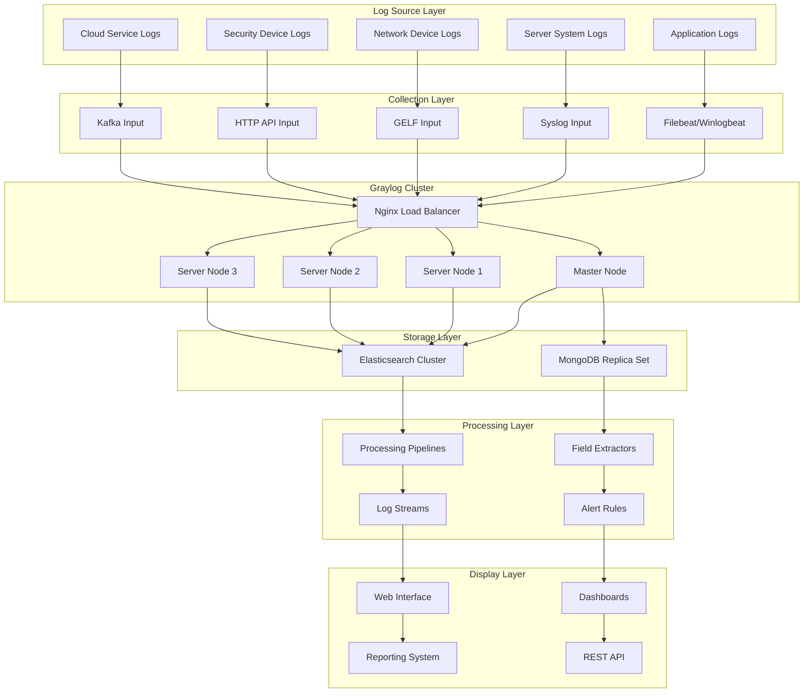

> **Production Environment Security Reminder**
>
> This document contains directly executable operations commands. Before executing, please confirm: whether the current target cluster and Namespace are correct; whether you have sufficient RBAC permissions; whether you have already verified in a non-production environment. Command risk levels are marked: 🔴 High Risk (may cause data loss or service interruption), 🟡 Medium Risk (modifies cluster state but is generally reversible), 🟢 Low Risk/Read-only (information gathering, no side effects).


# Graylog Enterprise-Grade Log Management Platform Deep Practice

<!-- chunk: Overview -->## Overview

Graylog is an open-source enterprise-grade log management platform providing powerful log collection, storage, search, and analysis capabilities. This document deeply explores Graylog architecture design, deployment strategies, log processing pipelines, and best practices from an enterprise operations expert perspective.

<!-- chunk: Architecture Design -->## Architecture Design

## Graylog Enterprise Architecture

```yaml
# Graylog Cluster Deployment Configuration
graylog_cluster:
  version: "5.1"
  deployment:
    architecture: "microservices"
    nodes:
      master_node:
        role: "master"
        heap_size: "4g"
        plugins: ["elasticsearch", "mongodb"]
        
      server_nodes:
        - node_id: "graylog-server-1"
          role: "server"
          heap_size: "8g"
          plugins: ["pipeline-processor", "archive"]
          
        - node_id: "graylog-server-2" 
          role: "server"
          heap_size: "8g"
          plugins: ["pipeline-processor", "archive"]
          
        - node_id: "graylog-server-3"
          role: "server"
          heap_size: "8g"
          plugins: ["pipeline-processor", "archive"]
          
    load_balancer:
      type: "nginx"
      ssl_termination: true
      health_checks: true
      
  # Storage Backend Configuration
  storage_backend:
    elasticsearch:
      version: "7.17"
      cluster:
        nodes:
          - "es-node-1:9200"
          - "es-node-2:9200" 
          - "es-node-3:9200"
      index_settings:
        number_of_shards: 3
        number_of_replicas: 1
        refresh_interval: "30s"
        
    mongodb:
      version: "5.0"
      replica_set: "graylog-rs"
      nodes:
        - "mongo-1:27017"
        - "mongo-2:27017"
        - "mongo-3:27017"
```

## Architecture Diagram



<!-- chunk: Core Component Configuration -->## Core Component Configuration

## Input Configuration

```yaml
# Graylog Input Configuration
inputs:
  # Syslog UDP Input
  syslog_udp:
    type: "org.graylog2.inputs.syslog.udp.SyslogUDPInput"
    title: "Syslog UDP Input"
    global: true
    configuration:
      bind_address: "0.0.0.0"
      port: 514
      recv_buffer_size: 262144
      number_worker_threads: 4
      
  # GELF HTTP Input
  gelf_http:
    type: "org.graylog2.inputs.gelf.http.GELFHttpInput"
    title: "GELF HTTP Input"
    global: true
    configuration:
      bind_address: "0.0.0.0"
      port: 12201
      enable_cors: true
      enable_gzip: true
      
  # Beats Input
  beats:
    type: "org.graylog.plugins.beats.BeatsInput"
    title: "Beats Input"
    global: true
    configuration:
      bind_address: "0.0.0.0"
      port: 5044
      tls_enable: true
      tls_cert_file: "/etc/graylog/certs/server.crt"
      tls_key_file: "/etc/graylog/certs/server.key"
      
  # Kafka Input
  kafka:
    type: "org.graylog2.inputs.kafka.KafkaInput"
    title: "Kafka Input"
    global: true
    configuration:
      bootstrap_servers: "kafka-1:9092,kafka-2:9092,kafka-3:9092"
      topic_filter: "application-logs"
      consumer_group: "graylog-consumer"
      threads: 4
```

## Processing Pipeline Configuration

```json
{
  "pipeline_rules": {
    "nginx_access_log_processing": {
      "name": "Nginx Access Log Processing",
      "description": "Process Nginx access logs",
      "source": "rule \"nginx_access_log\"\nwhen\n  has_field(\"message\") AND contains(to_string($message.message), \"nginx\")\nthen\n  let matches = regex(\"(?<remote_addr>[^ ]+) (?<remote_user>[^ ]+) (?<time_local>[^ ]+) \\\"(?<request>[^\"]+)\\\" (?<status>[^ ]+) (?<body_bytes_sent>[^ ]+) \\\"(?<http_referer>[^\"]*)\\\" \\\"(?<http_user_agent>[^\"]*)\\\"\", to_string($message.message));\n  set_field(\"remote_addr\", matches[\"remote_addr\"]);\n  set_field(\"request\", matches[\"request\"]);\n  set_field(\"status\", to_long(matches[\"status\"]));\n  set_field(\"body_bytes_sent\", to_long(matches[\"body_bytes_sent\"]));\n  set_field(\"http_user_agent\", matches[\"http_user_agent\"]);\n  set_field(\"log_type\", \"nginx_access\");\nend"
    },
    
    "application_error_detection": {
      "name": "Application Error Detection",
      "description": "Detect application error logs",
      "source": "rule \"application_errors\"\nwhen\n  has_field(\"level\") AND ($message.level == \"ERROR\" OR $message.level == \"FATAL\")\nthen\n  set_field(\"alert_severity\", \"high\");\n  set_field(\"needs_attention\", true);\n  route_to_stream(\"application-errors\");\nend"
    },
    
    "security_event_enrichment": {
      "name": "Security Event Enrichment",
      "description": "Security event enrichment processing",
      "source": "rule \"security_events\"\nwhen\n  has_field(\"event_type\") AND contains(to_string($message.event_type), \"security\")\nthen\n  // IP geolocation parsing\n  let geo_result = lookup(\"geoip\", to_string($message.source_ip));\n  set_field(\"source_geo_country\", geo_result[\"country_name\"]);\n  set_field(\"source_geo_city\", geo_result[\"city_name\"]);\n  \n  // Threat intelligence query\n  let threat_result = lookup(\"threatintel\", to_string($message.source_ip));\n  if (threat_result[\"is_malicious\"] == true) {\n    set_field(\"threat_level\", \"high\");\n    set_field(\"malicious_activity\", true);\n  }\n  \n  set_field(\"processed_timestamp\", now());\nend"
    }
  }
}
```

## Field Extractor Configuration

```yaml
# Field Extractor Configuration
field_extractors:
  # Regex Extractor - Apache Logs
  apache_log_extractor:
    title: "Apache Access Log Extractor"
    type: "regex"
    cursor_strategy: "copy"
    target_field: "message"
    source_field: "message"
    condition_type: "string"
    condition_value: "apache"
    configuration:
      regex_value: '^(?<remote_addr>\S+) (?<remote_user>\S+) (?<auth_user>\S+) \[(?<time_local>[^]]+)\] "(?<method>\S+) (?<request>\S+) (?<protocol>\S+)" (?<status>\d+) (?<bytes_sent>\d+) "(?<referer>[^"]*)" "(?<user_agent>[^"]*)"'
      regex_group_names:
        - "remote_addr"
        - "remote_user"
        - "auth_user"
        - "time_local"
        - "method"
        - "request"
        - "protocol"
        - "status"
        - "bytes_sent"
        - "referer"
        - "user_agent"

  # Grok Pattern Extractor - System Logs
  syslog_extractor:
    title: "Syslog Message Extractor"
    type: "grok"
    cursor_strategy: "copy"
    target_field: "message"
    source_field: "message"
    condition_type: "none"
    configuration:
      grok_pattern: '%{SYSLOGTIMESTAMP:timestamp} %{SYSLOGHOST:hostname} %{DATA:program}(?:\[%{POSINT:pid}\])?: %{GREEDYDATA:syslog_message}'

  # JSON Extractor - Application Logs
  json_extractor:
    title: "JSON Application Log Extractor"
    type: "json"
    cursor_strategy: "copy"
    target_field: "message"
    source_field: "message"
    condition_type: "string"
    condition_value: "{"
    configuration:
      flatten: true
      list_separator: ", "
      key_separator: "."
      kv_separator: "="
```

<!-- chunk: Storage Optimization -->## Storage Optimization

## Elasticsearch Index Strategy

```yaml
# Elasticsearch Index Lifecycle Management
index_lifecycle_management:
  # Hot-Warm-Cold Architecture Configuration
  hot_warm_cold:
    hot_phase:
      duration: "7d"
      min_replicas: 1
      codec: "best_compression"
      
    warm_phase:
      duration: "30d"
      min_replicas: 1
      codec: "best_compression"
      force_merge_max_num_segments: 1
      
    cold_phase:
      duration: "90d"
      min_replicas: 0
      codec: "best_compression"
      
    delete_phase:
      duration: "365d"
      
  # Index Template Configuration
  index_templates:
    application_logs:
      pattern: "graylog_application_*"
      settings:
        number_of_shards: 3
        number_of_replicas: 1
        refresh_interval: "30s"
        blocks:
          read_only_allow_delete: "false"
      mappings:
        properties:
          timestamp:
            type: "date"
          level:
            type: "keyword"
          message:
            type: "text"
            analyzer: "standard"
          host:
            type: "keyword"
            
    security_logs:
      pattern: "graylog_security_*"
      settings:
        number_of_shards: 5
        number_of_replicas: 2
        refresh_interval: "10s"
      mappings:
        properties:
          timestamp:
            type: "date"
          event_type:
            type: "keyword"
          source_ip:
            type: "ip"
          destination_ip:
            type: "ip"
          user_id:
            type: "keyword"
```

## Data Retention Policy

```json
{
  "retention_policies": {
    "critical_system_logs": {
      "name": "Critical System Logs",
      "streams": ["system-critical", "security-events"],
      "retention_time": "365d",
      "storage_tier": "hot_and_warm",
      "backup_required": true
    },
    
    "application_logs": {
      "name": "Application Logs",
      "streams": ["application-info", "application-warn"],
      "retention_time": "90d",
      "storage_tier": "hot_warm_cold",
      "backup_required": false
    },
    
    "debug_trace_logs": {
      "name": "Debug and Trace Logs",
      "streams": ["application-debug", "application-trace"],
      "retention_time": "7d",
      "storage_tier": "hot_only",
      "backup_required": false
    },
    
    "compliance_logs": {
      "name": "Compliance Required Logs",
      "streams": ["audit-logs", "financial-transactions"],
      "retention_time": "7 years",
      "storage_tier": "cold_archive",
      "backup_required": true,
      "immutable": true
    }
  }
}
```

<!-- chunk: Alerting and Notifications -->## Alerting and Notifications

## Alert Rule Configuration

```yaml
# Graylog Alert Rule Configuration
alert_rules:
  # High Error Rate Alert
  high_error_rate:
    title: "High Error Rate Detected"
    description: "High frequency error logs detected"
    stream: "application-errors"
    condition:
      type: "field_value"
      field: "level"
      value: "ERROR"
      threshold_type: "MORE"
      threshold: 100
      grace_period: 300
      backlog: 10
      
  # Security Threat Alert
  security_threat:
    title: "Security Threat Detected"
    description: "Security threat activity detected"
    stream: "security-events"
    condition:
      type: "field_content_value"
      field: "threat_level"
      value: "high"
      grace_period: 60
      backlog: 50
      
  # System Performance Alert
  system_performance:
    title: "System Performance Degradation"
    description: "System performance degradation alert"
    stream: "system-metrics"
    condition:
      type: "aggregation"
      query: "avg(cpu_usage) > 80"
      grace_period: 180
      backlog: 20
      
  # Business Metrics Alert
  business_metrics:
    title: "Business Metric Threshold Exceeded"
    description: "Critical business metrics exceed threshold"
    stream: "business-logs"
    condition:
      type: "field_value"
      field: "transaction_amount"
      value: 10000
      threshold_type: "MORE"
      grace_period: 0
      backlog: 5
```

## Notification Channel Configuration

```json
{
  "notification_channels": {
    "pagerduty_integration": {
      "type": "org.graylog2.plugins.pagerduty.PagerDutyAlarmCallback",
      "configuration": {
        "routing_key": "your_pagerduty_service_key",
        "incident_key_prefix": "graylog-alert",
        "client_name": "Graylog Monitoring System",
        "client_url": "https://graylog.yourcompany.com"
      }
    },
    
    "slack_notification": {
      "type": "org.graylog2.plugins.slack.callback.SlackAlarmCallback",
      "configuration": {
        "color": "#FF0000",
        "icon_url": "https://graylog.yourcompany.com/assets/icon.png",
        "graylog2_url": "https://graylog.yourcompany.com",
        "link_names": true,
        "webhook_url": "https://hooks.slack.com/services/YOUR/SLACK/WEBHOOK",
        "username": "Graylog Bot",
        "notify_channel": true,
        "channel": "#alerts",
        "custom_message": "🚨 Graylog Alert: ${alert_condition.title}\n${alert_description}\nStream: ${stream.title}\nTime: ${check_result.triggered_at}"
      }
    },
    
    "email_notification": {
      "type": "org.graylog2.alarmcallbacks.email.EmailAlarmCallback",
      "configuration": {
        "sender": "graylog@yourcompany.com",
        "subject": "Graylog Alert: ${alert_condition.title}",
        "body_template": "Alert Details:\nTitle: ${alert_condition.title}\nDescription: ${alert_description}\nStream: ${stream.title}\nTime: ${check_result.triggered_at}\n\nCheck the Graylog interface for more details.",
        "user_receivers": ["admin", "ops-team"],
        "email_receivers": ["alerts@yourcompany.com", "ops@yourcompany.com"]
      }
    },
    
    "webhook_notification": {
      "type": "org.graylog2.plugins.webhook.WebhookAlarmCallback",
      "configuration": {
        "url": "https://your-internal-system.com/webhook/graylog",
        "type": "application/json",
        "headers": {
          "Authorization": "Bearer your-token",
          "Content-Type": "application/json"
        },
        "body_template": "{\n  \"alert_title\": \"${alert_condition.title}\",\n  \"alert_description\": \"${alert_description}\",\n  \"stream_title\": \"${stream.title}\",\n  \"triggered_at\": \"${check_result.triggered_at}\",\n  \"backlog\": ${if backlog ? join(map(backlog, msg -> msg.message), \"\\n\") : \"\"}\n}"
      }
    }
  }
}
```

<!-- chunk: Dashboards and Visualization -->## Dashboards and Visualization

## Enterprise Dashboard Configuration

```json
{
  "dashboards": {
    "system_operations": {
      "title": "System Operations Overview",
      "description": "System operations overview dashboard",
      "widgets": [
        {
          "type": "STREAM_SEARCH_RESULT_COUNT",
          "config": {
            "timerange": {
              "type": "relative",
              "range": 3600
            },
            "query": "level:ERROR OR level:FATAL",
            "stream_id": "system-errors"
          },
          "col": 1,
          "row": 1,
          "height": 2,
          "width": 2
        },
        {
          "type": "QUICKVALUES",
          "config": {
            "timerange": {
              "type": "relative", 
              "range": 86400
            },
            "query": "*",
            "field": "host",
            "stream_id": "all-system-logs",
            "show_data_table": true,
            "show_pie_chart": true
          },
          "col": 3,
          "row": 1,
          "height": 2,
          "width": 2
        },
        {
          "type": "FIELD_CHART",
          "config": {
            "timerange": {
              "type": "relative",
              "range": 2592000
            },
            "query": "*",
            "field": "timestamp",
            "valuetype": "cardinality",
            "renderer": "bar",
            "interpolation": "linear"
          },
          "col": 1,
          "row": 3,
          "height": 2,
          "width": 4
        }
      ]
    },
    
    "security_monitoring": {
      "title": "Security Events Dashboard",
      "description": "Security events monitoring dashboard",
      "widgets": [
        {
          "type": "SEARCH_RESULT_CHART",
          "config": {
            "timerange": {
              "type": "relative",
              "range": 3600
            },
            "query": "event_type:security AND threat_level:high",
            "stream_id": "security-events"
          },
          "col": 1,
          "row": 1,
          "height": 2,
          "width": 4
        },
        {
          "type": "STACKED_CHART",
          "config": {
            "timerange": {
              "type": "relative",
              "range": 604800
            },
            "query": "event_type:login",
            "field": "user_id",
            "valuetype": "cardinality",
            "renderer": "area"
          },
          "col": 1,
          "row": 3,
          "height": 2,
          "width": 4
        }
      ]
    }
  }
}
```

<!-- chunk: Operational Management -->## Operational Management

## Daily Maintenance Scripts

> ⚠️ **🟠 High Risk Operations** - Affects business traffic or node state, requires change order + impact assessment + planned rollback
> - `systemctl stop/restart`: Stop/restart system services, affecting all containers on the node

``` bash
# 🟢 Low Risk: Read-only/Information gathering, usually no side effects
#!/bin/bash
# Graylog Daily Operations Maintenance Script

# Environment Variable Configuration
GRAYLOG_URL="https://graylog.yourcompany.com"
GRAYLOG_USER="admin"
GRAYLOG_PASS="your_password"
API_TOKEN="your_api_token"

# Cluster Health Check
check_cluster_health() {
    echo "=== Graylog Cluster Health Check ==="
    
    # Check node status
    nodes_status=$(curl -s -u "${GRAYLOG_USER}:${GRAYLOG_PASS}" \
        "${GRAYLOG_URL}/api/cluster/nodes")
    
    echo "Cluster Nodes Status:"
    echo "$nodes_status" | jq -r '.[] | "Node: \(.node_id) - Status: \(.transport_address) - Last Seen: \(.last_seen)"'
    
    # Check input status
    inputs_status=$(curl -s -u "${GRAYLOG_USER}:${GRAYLOG_PASS}" \
        "${GRAYLOG_URL}/api/system/inputs")
    
    echo -e "\nActive Inputs:"
    echo "$inputs_status" | jq -r '.inputs[] | "Input: \(.title) - Type: \(.type) - State: \(.state)"'
    
    # Check system metrics
    system_metrics=$(curl -s -u "${GRAYLOG_USER}:${GRAYLOG_PASS}" \
        "${GRAYLOG_URL}/api/system/metrics/multiple" \
        -H "Content-Type: application/json" \
        -d '{"metrics": ["org.graylog2.buffers.input.size", "org.graylog2.buffers.process.size", "org.graylog2.buffers.output.size"]}')
    
    echo -e "\nBuffer Sizes:"
    echo "$system_metrics" | jq -r 'to_entries[] | "Metric: \(.key) - Value: \(.value.value)"'
}

# Index Management
manage_indices() {
    echo "=== Index Management ==="
    
    # Get index list
    indices=$(curl -s -u "${GRAYLOG_USER}:${GRAYLOG_PASS}" \
        "${GRAYLOG_URL}/api/system/indexer/indices")
    
    # Check index status
    echo "Index Status:"
    echo "$indices" | jq -r '.[] | "Index: \(.index) - Size: \(.size) - Docs: \(.docs_count)"'
    
    # Close old indices
    cutoff_date=$(date -d "30 days ago" +%Y-%m-%d)
    echo -e "\nClosing indices older than ${cutoff_date}:"
    
    echo "$indices" | jq -r --arg cutoff "$cutoff_date" \
        '.[] | select(.creation_date < $cutoff) | .index' | \
        while read index; do
            echo "Closing index: $index"
            curl -s -u "${GRAYLOG_USER}:${GRAYLOG_PASS}" \
                -X DELETE "${GRAYLOG_URL}/api/system/indexer/indices/${index}"
        done
}

# Configuration Backup
backup_configuration() {
    echo "=== Configuration Backup ==="
    
    backup_dir="/backup/graylog/$(date +%Y%m%d_%H%M%S)"
    mkdir -p "$backup_dir"
    
    # Backup inputs configuration
    echo "Backing up inputs configuration..."
    curl -s -u "${GRAYLOG_USER}:${GRAYLOG_PASS}" \
        "${GRAYLOG_URL}/api/system/inputs" \
        > "${backup_dir}/inputs.json"
    
    # Backup streams configuration
    echo "Backing up streams configuration..."
    curl -s -u "${GRAYLOG_USER}:${GRAYLOG_PASS}" \
        "${GRAYLOG_URL}/api/streams" \
        > "${backup_dir}/streams.json"
    
    # Backup dashboards
    echo "Backing up dashboards..."
    curl -s -u "${GRAYLOG_USER}:${GRAYLOG_PASS}" \
        "${GRAYLOG_URL}/api/dashboards" \
        > "${backup_dir}/dashboards.json"
    
    # Backup alert conditions
    echo "Backing up alert conditions..."
    curl -s -u "${GRAYLOG_USER}:${GRAYLOG_PASS}" \
        "${GRAYLOG_URL}/api/alerts/conditions" \
        > "${backup_dir}/alert_conditions.json"
    
    echo "Backup completed: $backup_dir"
}

# Performance Optimization
optimize_performance() {
    echo "=== Performance Optimization ==="
    
    # Clean up expired data
    echo "Cleaning up expired data..."
    curl -s -u "${GRAYLOG_USER}:${GRAYLOG_PASS}" \
        -X POST "${GRAYLOG_URL}/api/system/indexer/indices/cleanup"
    
    # Optimize Elasticsearch indices
    echo "Optimizing Elasticsearch indices..."
    curl -s -u "${GRAYLOG_USER}:${GRAYLOG_PASS}" \
        -X POST "${GRAYLOG_URL}/api/system/indexer/indices/optimize"
    
    # Clean system journal
    echo "Cleaning system journal..."
    journalctl --vacuum-time=7d
    
    # Restart service to free memory
    echo "Restarting Graylog services for memory optimization..."
    systemctl restart graylog-server
}

# Security Audit Logging
security_audit() {
    echo "=== Security Audit ==="
    
    # Check login attempts
    login_attempts=$(curl -s -u "${GRAYLOG_USER}:${GRAYLOG_PASS}" \
        "${GRAYLOG_URL}/api/search/universal/relative" \
        -H "Content-Type: application/json" \
        -d '{
            "query": "event_type:login AND level:ERROR",
            "range": 86400,
            "limit": 100
        }')
    
    echo "Failed Login Attempts (Last 24h):"
    echo "$login_attempts" | jq -r '.messages[] | "Time: \(.timestamp) - User: \(.user) - IP: \(.source_ip)"'
    
    # Check permission changes
    permission_changes=$(curl -s -u "${GRAYLOG_USER}:${GRAYLOG_PASS}" \
        "${GRAYLOG_URL}/api/search/universal/relative" \
        -H "Content-Type: application/json" \
        -d '{
            "query": "event_type:permission_change",
            "range": 604800,
            "limit": 50
        }')
    
    echo -e "\nPermission Changes (Last 7 days):"
    echo "$permission_changes" | jq -r '.messages[] | "Time: \(.timestamp) - User: \(.user) - Action: \(.action)"'
}

# Main Execution Function
main() {
    echo "🚀 Starting Graylog Operations Management"
    echo "Timestamp: $(date)"
    echo "========================================"
    
    check_cluster_health
    echo
    manage_indices
    echo
    backup_configuration
    echo
    optimize_performance
    echo
    security_audit
    
    echo "========================================"
    echo "✅ Graylog Operations Management Completed"
}

# Execute main function
main
```
<!-- chunk: Best Practices -->## Best Practices

## Deployment Best Practices

1. **High Availability Deployment**
   ```yaml
   # High Availability Cluster Configuration
   high_availability:
     master_nodes: 3
     server_nodes: 3
     load_balancer: "haproxy"
     database_replication: "mongodb_replica_set"
     search_replication: "elasticsearch_cluster"
   ```

2. **Security Configuration**
   ```yaml
   # Security Hardening Configuration
   security_hardening:
     authentication:
       ldap_enabled: true
       active_directory: true
       two_factor_auth: true
       
     encryption:
       tls_termination: true
       certificate_validation: true
       api_token_expiration: "24h"
       
     access_control:
       role_based_access: true
       ip_whitelisting: true
       audit_logging: true
   ```

3. **Performance Tuning**
   ```yaml
   # Performance Optimization Configuration
   performance_tuning:
     jvm_settings:
       heap_size: "8g"
       garbage_collection: "G1GC"
       parallel_gc_threads: 8
       
     elasticsearch:
       refresh_interval: "30s"
       number_of_replicas: 1
       shard_allocation: "balanced"
       
     buffer_sizes:
       input_buffer: "100000"
       process_buffer: "10000"
       output_buffer: "10000"
   ```

## Monitoring Best Practices

1. **Key Metrics Monitoring**
   ```yaml
   # Core Monitoring Metrics
   key_metrics:
     system_health:
       - "buffer_usage"
       - "node_status"
       - "input_throughput"
       
     performance:
       - "processing_time"
       - "search_latency"
       - "indexing_rate"
       
     reliability:
       - "message_loss_rate"
       - "failed_inputs"
       - "dropped_messages"
   ```

2. **Alert Prioritization Strategy**
   ```yaml
   # Alert Priority Classification
   alert_prioritization:
     critical:
       response_time: "15 minutes"
       notification: "@pagerduty @oncall-team"
       
     high:
       response_time: "1 hour"
       notification: "@slack-alerts @team-leads"
       
     medium:
       response_time: "4 hours"
       notification: "@slack-notifications"
       
     low:
       response_time: "next_business_day"
       notification: "weekly_report"
   ```

---

**Document Version**: v1.0  
**Last Updated**: February 7, 2024  
**Applicable Version**: Graylog 5.1+

---

<!-- chunk: Obsidian Related Documents -->## Obsidian Related Documents

- domain-21-logging-management-analytics MOC
- [[domain-06-observability/README.md|Domain 06: Log Management and Analytics (Logging Management & Analytics)]]
- [[domain-06-observability/00-open-source-projects-index.md|Domain-21 Log Management and Analytics - Open Source Projects Index]]
- ELK Stack Enterprise-Grade Log Management System Deep Practice
- Fluentd Enterprise-Grade Log Collection and Processing Deep Practice
- Loki Enterprise Log Aggregation and Analytics Platform
- Enterprise-Grade Log Governance and Compliance Audit Deep Practice
- Splunk Enterprise-Grade Log Analysis and Security Intelligence Platform Deep Practice
- Enterprise Real-time Log Analysis and Business Insights Deep Practice
- Splunk Enterprise Log Analytics Platform Deep Practice
- Loggly Cloud Log Management Platform Deep Practice

## See Also

- 03-loki-enterprise-log-aggregation
- 04-enterprise-log-governance-compliance
- 04-splunk-enterprise-siem
- 05-real-time-analytics-business-insights

- [[domain-06-observability/README.md|Back to Index]]

## Related

- [[domain-19-landscape-references/topic-index/observability-index.md|Observability Knowledge Graph Index]]


<!-- risk-assessed -->
