> **Production Environment Safety Tips**
>
> This document contains directly executable operations commands. Before executing, please confirm: whether the target cluster and namespace are correct; whether you have sufficient RBAC permissions; whether the commands have been verified in a non-production environment. Command risk levels are marked as: 🔴 High risk (may cause data loss or service interruption), 🟡 Medium risk (modifies cluster state but usually can be rolled back), 🟢 Low risk/read-only (information gathering, no side effects).


# Enterprise-Grade Real-Time Log Analysis and Business Insights Deep Practice

> **Author**: Enterprise-Grade Real-Time Analysis Architecture Expert | **Version**: v1.0 | **Update Time**: 2026-02-07
> **Applicable Scenarios**: Enterprise-Grade Real-Time Log Analysis and Business Value Mining | **Complexity**: ⭐⭐⭐⭐⭐

<!-- chunk: 🎯 Summary -->## 🎯 Summary

This document deeply explores the architecture design, stream processing technology and business value mining practices of enterprise-grade real-time log analysis systems. Based on practical experience in large-scale enterprise environments, it provides a complete technical guide from real-time data processing to business intelligence, helping enterprises achieve value transformation from operations monitoring to business decision support.

<!-- chunk: 1. Real-Time Analysis Architecture Design -->## 1. Real-Time Analysis Architecture Design

## 1.1 Stream Processing Architecture Patterns

```mermaid
graph TB
    subgraph "Data Ingestion Layer"
        A[Log Sources] --> B[Message Queue]
        C[Metric Sources] --> D[Stream Processing Entry]
        E[Event Sources] --> F[Real-Time Buffer]
        G[API Calls] --> H[Data Ingestion]
    end
    
    subgraph "Stream Processing Engine Layer"
        I[Apache Flink] --> J[Window Computing]
        K[Apache Storm] --> L[Real-Time Processing]
        M[Spark Streaming] --> N[Micro-Batch Processing]
        O[Kafka Streams] --> P[Lightweight Processing]
    end
    
    subgraph "Complex Event Processing Layer"
        Q[CEP Engine] --> R[Pattern Matching]
        S[Rules Engine] --> T[Condition Evaluation]
        U[State Management] --> V[Context Tracking]
        W[Time Processing] --> X[Event Time Semantics]
    end
    
    subgraph "Storage and Query Layer"
        Y[Redis Cache] --> Z[Hot Data]
        AA[Elasticsearch] --> AB[Full-Text Search]
        AC[Druid] --> AD[OLAP Analysis]
        AE[InfluxDB] --> AF[Time Series Data]
    end
    
    subgraph "Business Application Layer"
        AG[Real-Time Dashboard] --> AH[Monitoring Alerts]
        AI[Business Metrics] --> AJ[KPI Tracking]
        AK[User Behavior] --> AL[Profile Analysis]
        AM[Anomaly Detection] --> AN[Risk Control]
    end
    
    subgraph "Value Output Layer"
        AO[Decision Support] --> AP[Business Intelligence]
        AQ[Product Optimization] --> AR[User Experience]
        AS[Cost Control] --> AT[Resource Optimization]
        AU[Market Insights] --> AV[Competitive Analysis]
    end
```



## 1.2 Lambda Architecture Implementation

## 1.2.1 Batch Processing and Stream Processing Integration

```yaml
# lambda-architecture.yaml
lambda_architecture:
  speed_layer:
    purpose: "Real-time processing, low latency"
    technologies:
      - Apache Flink
      - Apache Storm
      - Kafka Streams
    characteristics:
      - Millisecond-level latency
      - Stream processing
      - Approximate results
    use_cases:
      - Real-time monitoring and alerting
      - User behavior analysis
      - Anomaly detection response
      
  batch_layer:
    purpose: "Exact computation, high throughput"
    technologies:
      - Apache Spark
      - Hadoop MapReduce
      - Presto
    characteristics:
      - High throughput
      - Exact consistency
      - Batch processing
    use_cases:
      - Historical data analysis
      - Complex report generation
      - Data warehouse updates
      
  serving_layer:
    purpose: "Fast queries, unified view"
    technologies:
      - Elasticsearch
      - Druid
      - Redis
    characteristics:
      - Millisecond-level queries
      - Data merging
      - API services
    use_cases:
      - Interactive queries
      - Dashboard display
      - Application integration

integration_patterns:
  dual_write:
    description: "Write to both batch and stream processing systems simultaneously"
    implementation:
      - Kafka as unified data source
      - Stream processing consumes real-time data
      - Batch processing handles historical data periodically
    advantages:
      - Data consistency guarantee
      - Complementary processing capabilities
      - Strong fault tolerance
      
  materialized_views:
    description: "Pre-computed aggregate views"
    implementation:
      - Real-time aggregation results storage
      - Periodic refresh of batch views
      - Merge different sources during query
    advantages:
      - Query performance optimization
      - Reduce redundant computation
      - Support complex analysis
```

<!-- chunk: 2. Enterprise-Grade Stream Processing Platform -->## 2. Enterprise-Grade Stream Processing Platform

## 2.1 Apache Flink Deep Practice

## 2.1.1 Highly Available Flink Cluster Deployment

```yaml
# flink-cluster-deployment.yaml
apiVersion: flink.apache.org/v1beta1
kind: FlinkDeployment
metadata:
  name: enterprise-streaming
  namespace: streaming
spec:
  image: flink:1.17.1-scala_2.12-java11
  flinkVersion: v1_17
  flinkConfiguration:
    taskmanager.numberOfTaskSlots: "4"
    state.backend: rocksdb
    state.checkpoints.dir: s3://flink-checkpoints/streaming/
    state.savepoints.dir: s3://flink-savepoints/streaming/
    high-availability: zookeeper
    high-availability.storageDir: s3://flink-ha/streaming/
    high-availability.zookeeper.quorum: zk-0.zk-hs:2181,zk-1.zk-hs:2181,zk-2.zk-hs:2181
    restart-strategy: fixed-delay
    restart-strategy.fixed-delay.attempts: "10"
    restart-strategy.fixed-delay.delay: 30s
    
  serviceAccount: flink-service-account
  jobManager:
    replicas: 2
    resource:
      memory: "4096m"
      cpu: 2
    podTemplate:
      spec:
        containers:
        - name: flink-jobmanager
          env:
          - name: FLINK_PROPERTIES
            value: |
              metrics.reporter.prom.class: org.apache.flink.metrics.prometheus.PrometheusReporter
              metrics.reporter.prom.port: 9249
          volumeMounts:
          - name: flink-config-volume
            mountPath: /opt/flink/conf
        volumes:
        - name: flink-config-volume
          configMap:
            name: flink-config
          
  taskManager:
    replicas: 4
    resource:
      memory: "8192m"
      cpu: 4
    podTemplate:
      spec:
        containers:
        - name: flink-taskmanager
          env:
          - name: FLINK_PROPERTIES
            value: |
              task.cancellation.timeout: 300000
              blob.server.port: 6124
              query.server.port: 6125
          volumeMounts:
          - name: flink-config-volume
            mountPath: /opt/flink/conf
          - name: taskmanager-local-dir
            mountPath: /tmp/rocksdb
        volumes:
        - name: flink-config-volume
          configMap:
            name: flink-config
        - name: taskmanager-local-dir
          emptyDir: {}

---
apiVersion: v1
kind: ConfigMap
metadata:
  name: flink-config
  namespace: streaming
data:
  flink-conf.yaml: |
    jobmanager.rpc.address: enterprise-streaming-jobmanager
    jobmanager.rpc.port: 6123
    jobmanager.heap.size: 2048m
    taskmanager.heap.size: 2048m
    taskmanager.memory.managed.fraction: 0.4
    parallelism.default: 4
    state.backend: rocksdb
    state.checkpoints.dir: s3://flink-checkpoints/streaming/
    state.savepoints.dir: s3://flink-savepoints/streaming/
    execution.checkpointing.interval: 60000
    execution.checkpointing.mode: EXACTLY_ONCE
    execution.checkpointing.externalized-checkpoint-retention: RETAIN_ON_CANCELLATION
    rest.flamegraph.enabled: true
    metrics.latency.interval: 1000
    metrics.system-resource: true
    metrics.scope.operator: "<host>.taskmanager.<tm_id>.<job_name>"
    
  log4j-console.properties: |
    rootLogger.level = INFO
    rootLogger.appenderRef.console.ref = ConsoleAppender
    logger.flink.name = org.apache.flink
    logger.flink.level = INFO
    appender.console.name = ConsoleAppender
    appender.console.type = CONSOLE
    appender.console.layout.type = PatternLayout
    appender.console.layout.pattern = %d{yyyy-MM-dd HH:mm:ss,SSS} %-5p %-60c %x - %m%n
```

## 2.1.2 Real-Time ETL Processing Pipeline

```java
// RealTimeETLPipeline.java
import org.apache.flink.api.common.eventtime.WatermarkStrategy;
import org.apache.flink.api.common.functions.FilterFunction;
import org.apache.flink.api.common.functions.MapFunction;
import org.apache.flink.api.common.serialization.SimpleStringSchema;
import org.apache.flink.api.common.typeinfo.Types;
import org.apache.flink.api.java.tuple.Tuple2;
import org.apache.flink.connector.kafka.source.KafkaSource;
import org.apache.flink.connector.kafka.source.enumerator.initializer.OffsetsInitializer;
import org.apache.flink.streaming.api.datastream.DataStream;
import org.apache.flink.streaming.api.environment.StreamExecutionEnvironment;
import org.apache.flink.streaming.api.windowing.assigners.TumblingEventTimeWindows;
import org.apache.flink.streaming.api.windowing.time.Time;
import org.apache.flink.streaming.connectors.redis.RedisSink;
import org.apache.flink.streaming.connectors.redis.common.config.FlinkJedisPoolConfig;
import org.apache.flink.streaming.connectors.redis.common.mapper.RedisCommand;
import org.apache.flink.streaming.connectors.redis.common.mapper.RedisCommandDescription;
import org.apache.flink.streaming.connectors.redis.common.mapper.RedisMapper;

import java.time.Duration;
import java.util.Properties;

public class RealTimeETLPipeline {
    
    public static void main(String[] args) throws Exception {
        final StreamExecutionEnvironment env = StreamExecutionEnvironment.getExecutionEnvironment();
        
        // Configure checkpoints
        env.enableCheckpointing(60000); // 60-second checkpoint interval
        env.getCheckpointConfig().setCheckpointTimeout(300000);
        env.getCheckpointConfig().setMinPauseBetweenCheckpoints(30000);
        env.getCheckpointConfig().setMaxConcurrentCheckpoints(1);
        
        // Kafka source configuration
        KafkaSource<String> kafkaSource = KafkaSource.<String>builder()
            .setBootstrapServers("kafka-bootstrap:9092")
            .setTopics("application-logs", "system-metrics", "business-events")
            .setGroupId("flink-etl-consumer")
            .setStartingOffsets(OffsetsInitializer.earliest())
            .setValueOnlyDeserializer(new SimpleStringSchema())
            .build();
        
        // Read Kafka data stream
        DataStream<String> rawStream = env.fromSource(
            kafkaSource, 
            WatermarkStrategy.forBoundedOutOfOrderness(Duration.ofSeconds(10)),
            "Kafka Source"
        );
        
        // Data cleaning and transformation
        DataStream<ProcessedEvent> cleanedStream = rawStream
            .filter((FilterFunction<String>) value -> value != null && !value.trim().isEmpty())
            .map(new LogParser())
            .filter((FilterFunction<ProcessedEvent>) event -> 
                event.getTimestamp() > 0 && event.isValid());
        
        // Real-time aggregation - calculate error rate per minute
        DataStream<Tuple2<String, Double>> errorRateStream = cleanedStream
            .filter(event -> event.getLevel().equals("ERROR"))
            .map(event -> Tuple2.of(event.getService(), 1L))
            .returns(Types.TUPLE(Types.STRING, Types.LONG))
            .keyBy(tuple -> tuple.f0)
            .window(TumblingEventTimeWindows.of(Time.minutes(1)))
            .aggregate(new ErrorRateAggregateFunction());
        
        // Business metrics calculation
        DataStream<ServiceMetrics> businessMetrics = cleanedStream
            .keyBy(ProcessedEvent::getService)
            .window(TumblingEventTimeWindows.of(Time.minutes(5)))
            .aggregate(new BusinessMetricsAggregateFunction());
        
        // Real-time alert generation
        DataStream<Alert> alertStream = businessMetrics
            .filter(metrics -> metrics.getErrorRate() > 0.05 || metrics.getLatency() > 1000)
            .map(new AlertGenerator());
        
        // Output results to multiple targets
        // 1. Redis cache - for real-time queries
        businessMetrics.addSink(new RedisSink<>(
            new FlinkJedisPoolConfig.Builder()
                .setHost("redis-master.streaming.svc.cluster.local")
                .setPort(6379)
                .build(),
            new ServiceMetricsRedisMapper()
        ));
        
        // 2. Elasticsearch - for search and analysis
        businessMetrics.addSink(new ElasticsearchSink.Builder<>(
            Arrays.asList("http://elasticsearch:9200"),
            new ServiceMetricsElasticsearchSinkFunction()
        ).build());
        
        // 3. Kafka - for downstream systems consumption
        alertStream.map(Alert::toJson)
            .addSink(new FlinkKafkaProducer<>(
                "alerts-topic",
                new SimpleStringSchema(),
                kafkaProducerProperties()
            ));
        
        env.execute("Real-time ETL Pipeline");
    }
    
    // Data processing function classes
    public static class LogParser implements MapFunction<String, ProcessedEvent> {
        @Override
        public ProcessedEvent map(String value) throws Exception {
            // Parse JSON log
            ObjectMapper mapper = new ObjectMapper();
            JsonNode jsonNode = mapper.readTree(value);
            
            return new ProcessedEvent(
                jsonNode.get("timestamp").asLong(),
                jsonNode.get("service").asText(),
                jsonNode.get("level").asText(),
                jsonNode.get("message").asText(),
                jsonNode.get("duration").asLong(0)
            );
        }
    }
    
    public static class ErrorRateAggregateFunction 
        implements AggregateFunction<Tuple2<String, Long>, Tuple2<Long, Long>, Tuple2<String, Double>> {
        
        @Override
        public Tuple2<Long, Long> createAccumulator() {
            return Tuple2.of(0L, 0L); // (errorCount, totalCount)
        }
        
        @Override
        public Tuple2<Long, Long> add(Tuple2<String, Long> value, Tuple2<Long, Long> accumulator) {
            long totalCount = accumulator.f1 + 1;
            long errorCount = value.f1 == 1 ? accumulator.f0 + 1 : accumulator.f0;
            return Tuple2.of(errorCount, totalCount);
        }
        
        @Override
        public Tuple2<String, Double> getResult(Tuple2<Long, Long> accumulator) {
            double errorRate = accumulator.f1 > 0 ? 
                (double) accumulator.f0 / accumulator.f1 : 0.0;
            return Tuple2.of("global", errorRate);
        }
        
        @Override
        public Tuple2<Long, Long> merge(Tuple2<Long, Long> a, Tuple2<Long, Long> b) {
            return Tuple2.of(a.f0 + b.f0, a.f1 + b.f1);
        }
    }
    
    // Redis mapper
    public static class ServiceMetricsRedisMapper implements RedisMapper<ServiceMetrics> {
        @Override
        public RedisCommandDescription getCommandDescription() {
            return new RedisCommandDescription(RedisCommand.HSET, "service_metrics");
        }
        
        @Override
        public String getKeyFromData(ServiceMetrics metrics) {
            return metrics.getServiceName() + ":" + 
                   Instant.ofEpochMilli(metrics.getWindowEnd()).toString();
        }
        
        @Override
        public String getValueFromData(ServiceMetrics metrics) {
            ObjectMapper mapper = new ObjectMapper();
            try {
                return mapper.writeValueAsString(metrics);
            } catch (Exception e) {
                return "{}";
            }
        }
    }
}

// Data model classes
class ProcessedEvent {
    private long timestamp;
    private String service;
    private String level;
    private String message;
    private long duration;
    
    // Constructor and getter/setter...
    public boolean isValid() {
        return service != null && !service.isEmpty() && 
               level != null && !level.isEmpty();
    }
}

class ServiceMetrics {
    private String serviceName;
    private long windowStart;
    private long windowEnd;
    private long requestCount;
    private long errorCount;
    private double errorRate;
    private double avgLatency;
    private Map<String, Object> dimensions;
    
    // Constructor and getter/setter...
}

class Alert {
    private String alertType;
    private String service;
    private String message;
    private long timestamp;
    private Map<String, Object> details;
    
    public String toJson() {
        ObjectMapper mapper = new ObjectMapper();
        try {
            return mapper.writeValueAsString(this);
        } catch (Exception e) {
            return "{}";
        }
    }
}
```

## 2.2 Complex Event Processing (CEP)

## 2.2.1 Business Rules Engine Implementation

```java
// BusinessRulesEngine.java
import org.apache.flink.cep.CEP;
import org.apache.flink.cep.PatternStream;
import org.apache.flink.cep.functions.PatternProcessFunction;
import org.apache.flink.cep.pattern.Pattern;
import org.apache.flink.cep.pattern.conditions.IterativeCondition;
import org.apache.flink.streaming.api.datastream.DataStream;
import org.apache.flink.util.Collector;

import java.util.List;
import java.util.Map;

public class BusinessRulesEngine {
    
    public static DataStream<BusinessAlert> applyFraudDetection(
            DataStream<TransactionEvent> transactionStream) {
        
        // Define fraud detection pattern
        Pattern<TransactionEvent, ?> fraudPattern = Pattern.<TransactionEvent>begin("first")
            .subtype(TransactionEvent.class)
            .where(new IterativeCondition<TransactionEvent>() {
                @Override
                public boolean filter(TransactionEvent event, Context<TransactionEvent> ctx) {
                    return event.getAmount() > 10000; // Large amount transaction
                }
            })
            .next("second")
            .subtype(TransactionEvent.class)
            .where(new IterativeCondition<TransactionEvent>() {
                @Override
                public boolean filter(TransactionEvent event, Context<TransactionEvent> ctx) {
                    return event.getAmount() > 5000; // Medium amount
                }
            })
            .within(Time.minutes(5)); // Within 5 minutes
        
        // Apply pattern
        PatternStream<TransactionEvent> patternStream = CEP.pattern(transactionStream, fraudPattern);
        
        // Process matched patterns
        return patternStream.process(new PatternProcessFunction<TransactionEvent, BusinessAlert>() {
            @Override
            public void processMatch(Map<String, List<TransactionEvent>> match, 
                                   Context ctx, Collector<BusinessAlert> out) {
                
                List<TransactionEvent> firstTx = match.get("first");
                List<TransactionEvent> secondTx = match.get("second");
                
                if (!firstTx.isEmpty() && !secondTx.isEmpty()) {
                    TransactionEvent first = firstTx.get(0);
                    TransactionEvent second = secondTx.get(0);
                    
                    BusinessAlert alert = new BusinessAlert(
                        "FRAUD_SUSPICION",
                        first.getUserId(),
                        String.format("Suspicious transaction pattern detected: user %s conducted large amount (%s) and medium amount (%s) transactions within 5 minutes",
                                    first.getUserId(), first.getAmount(), second.getAmount()),
                        System.currentTimeMillis(),
                        Map.of(
                            "first_transaction", first,
                            "second_transaction", second,
                            "time_window_minutes", 5
                        )
                    );
                    
                    out.collect(alert);
                }
            }
        });
    }
    
    public static DataStream<BusinessAlert> applyUserBehaviorAnalysis(
            DataStream<UserAction> actionStream) {
        
        // Define abnormal user behavior pattern
        Pattern<UserAction, ?> abnormalPattern = Pattern.<UserAction>begin("login")
            .where(action -> action.getActionType().equals("LOGIN"))
            .next("suspicious_action")
            .where(action -> action.getActionType().equals("PASSWORD_RESET"))
            .followedBy("another_suspicious")
            .where(action -> action.getActionType().equals("PROFILE_UPDATE"))
            .within(Time.hours(1));
        
        PatternStream<UserAction> patternStream = CEP.pattern(actionStream, abnormalPattern);
        
        return patternStream.process(new PatternProcessFunction<UserAction, BusinessAlert>() {
            @Override
            public void processMatch(Map<String, List<UserAction>> match,
                                   Context ctx, Collector<BusinessAlert> out) {
                
                UserAction login = match.get("login").get(0);
                UserAction pwdReset = match.get("suspicious_action").get(0);
                UserAction profileUpdate = match.get("another_suspicious").get(0);
                
                BusinessAlert alert = new BusinessAlert(
                    "ABNORMAL_USER_BEHAVIOR",
                    login.getUserId(),
                    "Detected abnormal user behavior sequence",
                    System.currentTimeMillis(),
                    Map.of(
                        "behavior_sequence", List.of("LOGIN", "PASSWORD_RESET", "PROFILE_UPDATE"),
                        "actions", List.of(login, pwdReset, profileUpdate)
                    )
                );
                
                out.collect(alert);
            }
        });
    }
    
    public static DataStream<ServiceHealthAlert> applyServiceHealthMonitoring(
            DataStream<ServiceMetric> metricStream) {
        
        // Define service health degradation pattern
        Pattern<ServiceMetric, ?> degradationPattern = Pattern.<ServiceMetric>begin("normal")
            .where(metric -> metric.getResponseTime() < 200)
            .timesOrMore(3)
            .consecutive()
            .next("degradation")
            .where(metric -> metric.getResponseTime() > 500)
            .timesOrMore(2)
            .consecutive()
            .within(Time.minutes(10));
        
        PatternStream<ServiceMetric> patternStream = CEP.pattern(metricStream, degradationPattern);
        
        return patternStream.process(new PatternProcessFunction<ServiceMetric, ServiceHealthAlert>() {
            @Override
            public void processMatch(Map<String, List<ServiceMetric>> match,
                                   Context ctx, Collector<ServiceHealthAlert> out) {
                
                List<ServiceMetric> normalMetrics = match.get("normal");
                List<ServiceMetric> degradedMetrics = match.get("degradation");
                
                ServiceMetric lastNormal = normalMetrics.get(normalMetrics.size() - 1);
                ServiceMetric firstDegraded = degradedMetrics.get(0);
                
                ServiceHealthAlert alert = new ServiceHealthAlert(
                    lastNormal.getServiceName(),
                    "SERVICE_DEGRADATION",
                    String.format("Service %s performance significantly degraded: response time deteriorated from %dms to %dms",
                                lastNormal.getServiceName(),
                                (int) lastNormal.getResponseTime(),
                                (int) firstDegraded.getResponseTime()),
                    System.currentTimeMillis(),
                    Map.of(
                        "before_metrics", normalMetrics,
                        "after_metrics", degradedMetrics,
                        "degradation_ratio", firstDegraded.getResponseTime() / lastNormal.getResponseTime()
                    )
                );
                
                out.collect(alert);
            }
        });
    }
}
```

<!-- chunk: 3. Business Value Mining Practice -->## 3. Business Value Mining Practice

## 3.1 User Behavior Analysis

## 3.1.1 Real-Time User Profile Construction

```python
# real-time-user-profiling.py
import json
import redis
import pandas as pd
from datetime import datetime, timedelta
from typing import Dict, List, Optional
import numpy as np
from sklearn.preprocessing import StandardScaler
from sklearn.cluster import KMeans

class RealTimeUserProfiler:
    def __init__(self, redis_host: str = 'localhost', redis_port: int = 6379):
        self.redis_client = redis.Redis(host=redis_host, port=redis_port, decode_responses=True)
        self.scaler = StandardScaler()
        self.clustering_model = None
        self.profile_features = [
            'session_count',
            'avg_session_duration',
            'page_views',
            'feature_usage_count',
            'conversion_rate',
            'bounce_rate',
            'device_diversity',
            'geographic_diversity'
        ]
        
    def process_user_event(self, event: Dict) -> Dict:
        """Process user event and update profile"""
        user_id = event.get('user_id')
        if not user_id:
            return {}
            
        # Get existing user profile
        existing_profile = self.get_user_profile(user_id)
        
        # Update profile features
        updated_profile = self._update_profile_features(existing_profile, event)
        
        # Save updated profile
        self.save_user_profile(user_id, updated_profile)
        
        # Real-time clustering analysis
        cluster_label = self._assign_cluster(updated_profile)
        updated_profile['cluster'] = cluster_label
        
        return updated_profile
    
    def _update_profile_features(self, profile: Dict, event: Dict) -> Dict:
        """Update user profile features"""
        now = datetime.now()
        event_type = event.get('event_type')
        
        # Initialize profile
        if not profile:
            profile = {
                'user_id': event.get('user_id'),
                'first_seen': now.isoformat(),
                'last_seen': now.isoformat(),
                'session_count': 0,
                'total_session_time': 0,
                'page_views': 0,
                'feature_usage': {},
                'conversions': 0,
                'bounces': 0,
                'devices': set(),
                'locations': set(),
                'updated_at': now.isoformat()
            }
        else:
            profile['last_seen'] = now.isoformat()
            profile['updated_at'] = now.isoformat()
        
        # Update features based on event type
        if event_type == 'session_start':
            profile['session_count'] += 1
            profile['session_start_time'] = event.get('timestamp')
            
        elif event_type == 'session_end':
            if 'session_start_time' in profile:
                session_duration = event.get('timestamp') - profile['session_start_time']
                profile['total_session_time'] += session_duration
                del profile['session_start_time']
                
                # Record bounce rate
                if profile['page_views'] == 0:
                    profile['bounces'] += 1
                    
        elif event_type == 'page_view':
            profile['page_views'] += 1
            
        elif event_type == 'feature_use':
            feature = event.get('feature_name')
            if feature:
                profile['feature_usage'][feature] = profile['feature_usage'].get(feature, 0) + 1
                
        elif event_type == 'conversion':
            profile['conversions'] += 1
            
        elif event_type == 'device_info':
            device = event.get('device_type')
            if device:
                profile['devices'].add(device)
                
        elif event_type == 'location_info':
            location = event.get('country')
            if location:
                profile['locations'].add(location)
        
        # Calculate derived features
        profile['avg_session_duration'] = (
            profile['total_session_time'] / max(profile['session_count'], 1)
        )
        profile['conversion_rate'] = (
            profile['conversions'] / max(profile['session_count'], 1)
        )
        profile['bounce_rate'] = (
            profile['bounces'] / max(profile['session_count'], 1)
        )
        profile['feature_usage_count'] = sum(profile['feature_usage'].values())
        profile['device_diversity'] = len(profile['devices'])
        profile['geographic_diversity'] = len(profile['locations'])
        
        # Convert sets to lists for serialization
        profile['devices'] = list(profile['devices'])
        profile['locations'] = list(profile['locations'])
        
        return profile
    
    def get_user_profile(self, user_id: str) -> Dict:
        """Get user profile"""
        profile_key = f"user_profile:{user_id}"
        profile_data = self.redis_client.get(profile_key)
        
        if profile_data:
            return json.loads(profile_data)
        return {}
    
    def save_user_profile(self, user_id: str, profile: Dict):
        """Save user profile"""
        profile_key = f"user_profile:{user_id}"
        self.redis_client.setex(profile_key, 86400, json.dumps(profile))  # Expires in 24 hours
        
    def _assign_cluster(self, profile: Dict) -> str:
        """Assign cluster label to user"""
        # Extract numeric features
        feature_vector = [profile.get(feature, 0) for feature in self.profile_features]
        
        # Use simple rules if model not trained yet
        if self.clustering_model is None:
            return self._simple_segmentation(feature_vector)
        
        # Use trained model for prediction
        scaled_features = self.scaler.transform([feature_vector])
        cluster_id = self.clustering_model.predict(scaled_features)[0]
        
        cluster_names = ['New User', 'Active User', 'Loyal User', 'Churn Risk User', 'High Value User']
        return cluster_names[min(cluster_id, len(cluster_names) - 1)]
    
    def _simple_segmentation(self, features: List) -> str:
        """Simple user segmentation rules"""
        session_count, avg_duration, page_views, conversion_rate = features[:4]
        
        if session_count <= 1:
            return 'New User'
        elif session_count <= 5 and avg_duration < 60:
            return 'Potential Churn User'
        elif session_count > 10 and conversion_rate > 0.1:
            return 'High Value User'
        elif page_views > 20 and avg_duration > 180:
            return 'Loyal User'
        else:
            return 'Regular User'
    
    def batch_profile_analysis(self, user_ids: List[str]) -> pd.DataFrame:
        """Batch analysis of user profiles"""
        profiles = []
        for user_id in user_ids:
            profile = self.get_user_profile(user_id)
            if profile:
                profiles.append(profile)
        
        if not profiles:
            return pd.DataFrame()
            
        df = pd.DataFrame(profiles)
        
        # Calculate group statistics
        stats = {
            'total_users': len(df),
            'avg_sessions': df['session_count'].mean(),
            'avg_conversion_rate': df['conversion_rate'].mean(),
            'cluster_distribution': df['cluster'].value_counts().to_dict() if 'cluster' in df.columns else {}
        }
        
        return df, stats
    
    def generate_business_insights(self, time_window_hours: int = 24) -> Dict:
        """Generate business insights"""
        # Get recent active users
        recent_users = self._get_recent_users(time_window_hours)
        
        # Analyze user behavior patterns
        df, stats = self.batch_profile_analysis(recent_users)
        
        if df.empty:
            return {'error': 'Insufficient user data'}
        
        insights = {
            'time_period': f"Last {time_window_hours} hours",
            'user_statistics': stats,
            'behavior_patterns': self._analyze_behavior_patterns(df),
            'business_opportunities': self._identify_opportunities(df),
            'risk_indicators': self._detect_risks(df)
        }
        
        return insights
    
    def _get_recent_users(self, hours: int) -> List[str]:
        """Get recent active users"""
        cutoff_time = datetime.now() - timedelta(hours=hours)
        cutoff_timestamp = cutoff_time.timestamp()
        
        # Use Redis scan to get recent users
        pattern = "user_profile:*"
        user_ids = []
        
        for key in self.redis_client.scan_iter(match=pattern):
            user_id = key.decode('utf-8').split(':')[1]
            profile = self.get_user_profile(user_id)
            if profile and 'last_seen' in profile:
                last_seen = datetime.fromisoformat(profile['last_seen'])
                if last_seen > cutoff_time:
                    user_ids.append(user_id)
                    
        return user_ids
    
    def _analyze_behavior_patterns(self, df: pd.DataFrame) -> Dict:
        """Analyze behavior patterns"""
        patterns = {}
        
        # Session duration analysis
        if 'avg_session_duration' in df.columns:
            duration_segments = pd.cut(df['avg_session_duration'], 
                                     bins=[0, 60, 300, 600, float('inf')],
                                     labels=['Short(<1min)', 'Medium(1-5min)', 'Long(5-10min)', 'Very Long(>10min)'])
            patterns['session_duration_distribution'] = duration_segments.value_counts().to_dict()
        
        # Conversion rate analysis
        if 'conversion_rate' in df.columns:
            conversion_segments = pd.cut(df['conversion_rate'],
                                       bins=[0, 0.05, 0.1, 0.2, 1.0],
                                       labels=['Low(<5%)', 'Medium(5-10%)', 'High(10-20%)', 'Very High(>20%)'])
            patterns['conversion_rate_distribution'] = conversion_segments.value_counts().to_dict()
            
        return patterns
    
    def _identify_opportunities(self, df: pd.DataFrame) -> List[Dict]:
        """Identify business opportunities"""
        opportunities = []
        
        # Identify high potential but unconverted users
        high_potential = df[
            (df['session_count'] > 5) & 
            (df['avg_session_duration'] > 300) & 
            (df['conversion_rate'] < 0.05)
        ]
        
        if not high_potential.empty:
            opportunities.append({
                'opportunity': 'High Potential Unconverted Users',
                'count': len(high_potential),
                'description': 'These users show high engagement but low conversion rate, targeted marketing is recommended',
                'target_users': high_potential['user_id'].tolist()[:10]  # Top 10 examples
            })
        
        # Identify at-risk churn users
        churn_risk = df[
            (df['session_count'] > 2) & 
            (df.get('days_since_last_session', 30) > 7)
        ]
        
        if not churn_risk.empty:
            opportunities.append({
                'opportunity': 'Churn Recovery Opportunity',
                'count': len(churn_risk),
                'description': 'These users were once active but now rarely use the service, activation recall is recommended',
                'target_users': churn_risk['user_id'].tolist()[:10]
            })
            
        return opportunities
    
    def _detect_risks(self, df: pd.DataFrame) -> List[Dict]:
        """Detect business risks"""
        risks = []
        
        # Anomalous behavior detection
        if 'page_views' in df.columns:
            outlier_threshold = df['page_views'].quantile(0.95)
            outliers = df[df['page_views'] > outlier_threshold]
            
            if not outliers.empty:
                risks.append({
                    'risk_type': 'Anomalous Usage Pattern',
                    'severity': 'Medium',
                    'count': len(outliers),
                    'description': 'Detected abnormally high page view behavior, possibly bot or malicious activity'
                })
        
        # Conversion rate decline risk
        if 'conversion_rate' in df.columns:
            recent_avg = df['conversion_rate'].mean()
            if recent_avg < 0.05:  # Assume normal conversion rate is 5%
                risks.append({
                    'risk_type': 'Conversion Rate Decline',
                    'severity': 'High',
                    'description': f'Overall conversion rate ({recent_avg:.2%}) is below expected level'
                })
                
        return risks

# Usage example
profiler = RealTimeUserProfiler()

# Process user event
event = {
    'user_id': 'user_12345',
    'event_type': 'page_view',
    'timestamp': datetime.now().timestamp(),
    'page_url': '/products/widget-a'
}

updated_profile = profiler.process_user_event(event)
print("Updated user profile:", json.dumps(updated_profile, indent=2, ensure_ascii=False))

# Generate business insights
insights = profiler.generate_business_insights(24)
print("Business insights:", json.dumps(insights, indent=2, ensure_ascii=False))
```

## 3.2 Business Intelligence Dashboard

## 3.2.1 Real-Time KPI Monitoring Panel

```json
{
  "dashboard": {
    "title": "Enterprise Real-Time Business Insights Dashboard",
    "layout": "grid",
    "refresh_interval": "30s",
    "time_range": "Last 1 hour",
    "sections": [
      {
        "name": "Core Business Metrics",
        "type": "row",
        "height": "200px",
        "widgets": [
          {
            "id": "revenue_indicator",
            "type": "kpi_card",
            "title": "Real-Time Revenue",
            "metric": "sum(transaction_amount)",
            "time_window": "5m",
            "comparison": "previous_period",
            "thresholds": {
              "good": {"value": 10000, "color": "green"},
              "warning": {"value": 5000, "color": "yellow"},
              "critical": {"value": 1000, "color": "red"}
            },
            "trend": "up",
            "change_percentage": "+12.5%"
          },
          {
            "id": "active_users",
            "type": "kpi_card",
            "title": "Active Users",
            "metric": "count_distinct(user_id)",
            "time_window": "5m",
            "sparkline": true,
            "thresholds": {
              "good": {"value": 1000, "color": "green"},
              "warning": {"value": 500, "color": "yellow"},
              "critical": {"value": 100, "color": "red"}
            }
          },
          {
            "id": "conversion_rate",
            "type": "kpi_card",
            "title": "Conversion Rate",
            "metric": "conversion_rate_formula",
            "time_window": "15m",
            "format": "percentage",
            "target": "5%",
            "current": "3.2%"
          }
        ]
      },
      {
        "name": "User Behavior Analysis",
        "type": "row",
        "height": "300px",
        "widgets": [
          {
            "id": "user_journey_funnel",
            "type": "funnel_chart",
            "title": "User Conversion Funnel",
            "steps": [
              {"name": "Homepage Visit", "value": 10000},
              {"name": "Browse Products", "value": 4500},
              {"name": "Add to Cart", "value": 1200},
              {"name": "Checkout", "value": 360},
              {"name": "Complete Purchase", "value": 280}
            ],
            "conversion_rates": ["45%", "26.7%", "30%", "77.8%"]
          },
          {
            "id": "user_segments",
            "type": "pie_chart",
            "title": "User Segment Distribution",
            "dimension": "user_segment",
            "metrics": [
              {"name": "New Users", "value": 35, "color": "#FF6B6B"},
              {"name": "Returning Customers", "value": 45, "color": "#4ECDC4"},
              {"name": "VIP Users", "value": 15, "color": "#45B7D1"},
              {"name": "Churned Users", "value": 5, "color": "#96CEB4"}
            ]
          }
        ]
      },
      {
        "name": "Business Health Monitoring",
        "type": "row",
        "height": "250px",
        "widgets": [
          {
            "id": "service_health_matrix",
            "type": "heatmap",
            "title": "Service Health Matrix",
            "rows": ["Order Service", "Payment Service", "Inventory Service", "User Service"],
            "columns": ["Response Time", "Error Rate", "Throughput", "Availability"],
            "data": [
              [85, 92, 78, 96],
              [90, 88, 85, 92],
              [75, 85, 90, 88],
              [92, 95, 88, 94]
            ],
            "color_scheme": "green_to_red"
          },
          {
            "id": "real_time_alerts",
            "type": "alert_list",
            "title": "Real-Time Alerts",
            "max_items": 10,
            "alerts": [
              {
                "severity": "high",
                "title": "Payment Service Error Rate Spike",
                "description": "Error rate reached 8.5% in the past 5 minutes, exceeding threshold of 5%",
                "time": "2 minutes ago",
                "status": "active"
              },
              {
                "severity": "medium",
                "title": "User Registration Volume Decline",
                "description": "New user registrations declined 15% compared to previous period",
                "time": "15 minutes ago",
                "status": "acknowledged"
              }
            ]
          }
        ]
      }
    ],
    "export_options": {
      "pdf_report": {
        "schedule": "daily",
        "recipients": ["management@company.com", "analytics@company.com"]
      },
      "csv_export": {
        "data_retention": "30 days",
        "automatic_download": true
      }
    }
  }
}
```

<!-- chunk: 4. Enterprise-Grade Best Practices -->## 4. Enterprise-Grade Best Practices

## 4.1 Performance Optimization Strategy

## 4.1.1 Stream Processing Performance Tuning

```yaml
# stream-processing-optimization.yaml
performance_optimization:
  resource_allocation:
    parallelism_tuning:
      # Adjust parallelism based on data volume and processing complexity
      initial_parallelism: 4
      auto_scaling:
        enabled: true
        min_parallelism: 2
        max_parallelism: 32
        scaling_metrics:
          - "backpressure"
          - "processing_latency"
          - "throughput"
          
    memory_management:
      jobmanager_heap: "4096m"
      taskmanager_heap: "4096m"
      managed_memory_fraction: 0.4
      network_memory_fraction: 0.1
      
    checkpoint_optimization:
      interval: "60000ms"  # 60-second checkpoint interval
      timeout: "300000ms"  # 5-minute timeout
      min_pause: "30000ms" # 30-second minimum pause
      concurrent_checkpoints: 1
      externalized_retention: "RETAIN_ON_CANCELLATION"
      
  data_skew_handling:
    key_grouping:
      # Use salting technique to handle data skew
      salting_technique: true
      salt_bits: 4  # 16 groups
      
    load_balancing:
      adaptive_partitioning: true
      rebalancing_interval: "300000ms"  # 5-minute rebalance
      
  state_management:
    backend_selection:
      rocksdb:
        enabled: true
        local_directory: "/tmp/rocksdb"
        checkpoint_directory: "s3://flink-checkpoints/"
        
    state_ttl:
      # Set state expiration time
      session_state_ttl: "3600000ms"  # 1 hour
      user_profile_ttl: "86400000ms"  # 24 hours
      aggregation_state_ttl: "600000ms"  # 10 minutes
      
    incremental_checkpointing:
      enabled: true
      interval: "10000ms"  # 10-second incremental checkpoint

latency_optimization:
  event_time_processing:
    watermark_interval: "200ms"
    max_out_of_orderness: "10000ms"  # 10-second max out-of-order
    
  operator_chaining:
    enable_chaining: true
    chain_stop_points:
      - "keyBy operations"
      - "window operations"
      - "sink operations"
      
  async_io:
    database_lookups:
      max_concurrent_requests: 100
      timeout: "5000ms"
      
    external_service_calls:
      max_concurrent_requests: 50
      timeout: "3000ms"

monitoring_and_alerting:
  metrics_collection:
    system_metrics:
      - "taskmanager_job_task_operator_currentEmitEventTimeLag"
      - "taskmanager_job_task_backPressuredTimeMsPerSecond"
      - "taskmanager_job_task_buffers_inPoolUsage"
      
    business_metrics:
      - "processed_events_per_second"
      - "average_processing_latency"
      - "checkpoint_completion_time"
      
  alerting_rules:
    latency_alerts:
      - metric: "processing_latency_95th_percentile"
        threshold: "1000ms"
        severity: "warning"
        
      - metric: "processing_latency_99th_percentile"
        threshold: "5000ms"
        severity: "critical"
        
    throughput_alerts:
      - metric: "events_per_second"
        threshold: "1000"
        comparison: "less_than"
        severity: "warning"
        
    resource_alerts:
      - metric: "heap_memory_usage"
        threshold: "85%"
        severity: "warning"
```

Through the above enterprise-grade real-time log analysis and business insights deep practice, enterprises can build powerful real-time analysis capabilities that not only meet operations monitoring needs but also mine business value in data to provide strong support for business decision-making.

---

<!-- chunk: Obsidian Related Documentation -->## Obsidian Related Documentation

- observability/MOC.md|domain-21-logging-management-analytics MOC]]
- [[domain-06-observability/README.md|[[Domain 21: Logging Management & Analytics|Domain 21: Logging Management & Analytics]] Management & Analytics)]]
- index.md|Domain-21 Logging Management and Analytics — Open Source Project Index]]
- ELK Stack Enterprise-Grade Log Management System Deep Practice
- Fluentd Enterprise-Grade Log Collection and Processing Deep Practice
- Loki Enterprise Log Aggregation and Analytics Platform
- Enterprise-Grade Log Governance and Compliance Audit Deep Practice
- Graylog Enterprise-Grade Log Management Platform Deep Practice
- Splunk Enterprise-Grade Log Analysis and Security Intelligence Platform Deep Practice
- Splunk Enterprise Log Analytics Platform Deep Practice
- Loggly Cloud Log Management Platform Deep Practice

## See Also

- 04-graylog-enterprise-logging
- 04-splunk-enterprise-siem
- 05-splunk-enterprise-log-analytics
- 06-loggly-cloud-log-management

- [[domain-06-observability/README.md|Back to index]]

<!-- risk-assessed -->
