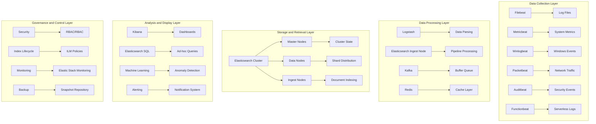

> **Production Environment Security Tips**
>
> This document contains operations commands that can be directly executed. Before execution, please confirm: whether the current target cluster and Namespace are correct; whether you have sufficient RBAC permissions; whether validation has been completed in a non-production environment. Command risk levels are marked as: 🔴 High risk (may cause data loss or service interruption), 🟡 Medium risk (modifies cluster state but is usually rollbackable), 🟢 Low risk/read-only (information gathering, no side effects).


# Deep Practice in Elastic Stack Enterprise-Grade Log Analysis

> **Author**: Enterprise-grade log analysis architecture expert | **Version**: v1.0 | **Last Updated**: 2026-02-07
> **Applicable Scenarios**: Enterprise-grade log governance and real-time analysis | **Complexity**: ⭐⭐⭐⭐⭐

<!-- chunk: 🎯 Summary -->## 🎯 Summary

This document explores the architecture design, deployment practices, and operations management of Elastic Stack enterprise-grade log analysis systems. Based on practical experience in large-scale enterprise environments, it provides a complete technical guide from log collection to intelligent analysis, helping enterprises build efficient and reliable log governance systems.

<!-- chunk: 1. Elastic Stack Architecture Deep Analysis -->## 1. Elastic Stack Architecture Deep Analysis

## 1.1 Core Component Architecture



## 1.2 Enterprise-Grade Architecture Advantages

## 1.2.1 High Availability Guarantee
- **Cluster high availability**: Multi-node cluster deployment ensures service continuity
- **Data redundancy**: Replica shard mechanism guarantees data security
- **Automatic problem recovery**: Automatic fault detection and node replacement mechanisms
- **Cross-region replication**: Geographically distributed data backup strategies

## 1.2.2 Performance Optimization Capabilities
- **Horizontal scaling**: Support for dynamically adding nodes to handle larger data volumes
- **Intelligent sharding**: Automatic optimization of shard distribution and sizing
- **Caching mechanisms**: Multi-level caching improves query performance
- **Compressed storage**: Efficient data compression algorithms save storage space

<!-- chunk: 2. Enterprise-Grade Deployment Architecture -->## 2. Enterprise-Grade Deployment Architecture

## 2.1 Multi-Layer High Availability Deployment

## 2.1.1 Elasticsearch Cluster Deployment

```yaml
# elasticsearch-cluster.yaml
apiVersion: elasticsearch.k8s.elastic.co/v1
kind: Elasticsearch
metadata:
  name: enterprise-logs
  namespace: logging
spec:
  version: 8.11.3
  nodeSets:
  # Master node set - dedicated cluster management
  - name: master-nodes
    count: 3
    config:
      node.roles: ["master"]
      cluster.routing.allocation.disk.threshold_enabled: true
      cluster.routing.allocation.disk.watermark.low: "85%"
      cluster.routing.allocation.disk.watermark.high: "90%"
      cluster.routing.allocation.disk.watermark.flood_stage: "95%"
    podTemplate:
      spec:
        containers:
        - name: elasticsearch
          resources:
            requests:
              memory: 4Gi
              cpu: 2
            limits:
              memory: 8Gi
              cpu: 4
          env:
          - name: ES_JAVA_OPTS
            value: "-Xms4g -Xmx4g"
        affinity:
          podAntiAffinity:
            requiredDuringSchedulingIgnoredDuringExecution:
            - labelSelector:
                matchLabels:
                  elasticsearch.k8s.elastic.co/cluster-name: enterprise-logs
                  elasticsearch.k8s.elastic.co/node-set-name: master-nodes
              topologyKey: kubernetes.io/hostname
    volumeClaimTemplates:
    - metadata:
        name: elasticsearch-data
      spec:
        accessModes:
        - ReadWriteOnce
        resources:
          requests:
            storage: 100Gi
        storageClassName: fast-ssd

  # Data node set - dedicated data storage and search
  - name: data-nodes
    count: 6
    config:
      node.roles: ["data", "ingest"]
      indices.breaker.total.use_real_memory: true
      indices.breaker.fielddata.limit: "40%"
      indices.breaker.request.limit: "20%"
    podTemplate:
      spec:
        containers:
        - name: elasticsearch
          resources:
            requests:
              memory: 16Gi
              cpu: 4
            limits:
              memory: 32Gi
              cpu: 8
          env:
          - name: ES_JAVA_OPTS
            value: "-Xms16g -Xmx16g"
        initContainers:
        - name: sysctl
          securityContext:
            privileged: true
          command: ['sh', '-c', 'sysctl -w vm.max_map_count=262144']
    volumeClaimTemplates:
    - metadata:
        name: elasticsearch-data
      spec:
        accessModes:
        - ReadWriteOnce
        resources:
          requests:
            storage: 1Ti
        storageClassName: standard

  # Coordinating node set - dedicated request coordination
  - name: coordinating-nodes
    count: 3
    config:
      node.roles: ["ingest"]
      search.remote.connect: false
    podTemplate:
      spec:
        containers:
        - name: elasticsearch
          resources:
            requests:
              memory: 8Gi
              cpu: 2
            limits:
              memory: 16Gi
              cpu: 4
          env:
          - name: ES_JAVA_OPTS
            value: "-Xms8g -Xmx8g"
```

## 2.1.2 Filebeat Distributed Collection

```yaml
# filebeat-deployment.yaml
apiVersion: apps/v1
kind: DaemonSet
metadata:
  name: filebeat
  namespace: logging
  labels:
    app: filebeat
spec:
  selector:
    matchLabels:
      app: filebeat
  template:
    metadata:
      labels:
        app: filebeat
    spec:
      serviceAccountName: filebeat
      terminationGracePeriodSeconds: 30
      hostNetwork: true
      dnsPolicy: ClusterFirstWithHostNet
      containers:
      - name: filebeat
        image: docker.elastic.co/beats/filebeat:8.11.3
        args: [
          "-c", "/etc/filebeat.yml",
          "-e",
        ]
        env:
        - name: ELASTICSEARCH_HOST
          value: "enterprise-logs-es-http.logging.svc.cluster.local"
        - name: ELASTICSEARCH_PORT
          value: "9200"
        - name: ELASTICSEARCH_USERNAME
          valueFrom:
            secretKeyRef:
              name: elasticsearch-credentials
              key: username
        - name: ELASTICSEARCH_PASSWORD
          valueFrom:
            secretKeyRef:
              name: elasticsearch-credentials
              key: password
        - name: NODE_NAME
          valueFrom:
            fieldRef:
              fieldPath: spec.nodeName
        securityContext:
          runAsUser: 0
        resources:
          limits:
            memory: 1Gi
            cpu: 1000m
          requests:
            cpu: 100m
            memory: 100Mi
        volumeMounts:
        - name: config
          mountPath: /etc/filebeat.yml
          readOnly: true
          subPath: filebeat.yml
        - name: data
          mountPath: /usr/share/filebeat/data
        - name: varlibdockercontainers
          mountPath: /var/lib/docker/containers
          readOnly: true
        - name: varlog
          mountPath: /var/log
          readOnly: true
        - name: timezone
          mountPath: /etc/localtime
          readOnly: true
      volumes:
      - name: config
        configMap:
          defaultMode: 0600
          name: filebeat-config
      - name: varlibdockercontainers
        hostPath:
          path: /var/lib/docker/containers
      - name: varlog
        hostPath:
          path: /var/log
      - name: timezone
        hostPath:
          path: /etc/localtime
      - name: data
        hostPath:
          path: /var/lib/filebeat-data
          type: DirectoryOrCreate
```

## 2.1.3 Filebeat Configuration Optimization

```yaml
# filebeat-config.yaml
apiVersion: v1
kind: ConfigMap
metadata:
  name: filebeat-config
  namespace: logging
  labels:
    app: filebeat
data:
  filebeat.yml: |-
    filebeat.inputs:
    # Application log collection
    - type: log
      enabled: true
      paths:
        - /var/log/containers/*_application_*.log
      processors:
        - add_kubernetes_metadata:
            host: ${NODE_NAME}
            matchers:
            - logs_path:
                logs_path: "/var/log/containers/"
        - decode_json_fields:
            fields: ["message"]
            process_array: false
            max_depth: 10
            target: ""
            overwrite_keys: true
        - drop_fields:
            fields: ["input", "agent", "ecs", "log", "stream"]
      fields:
        log_type: application
        environment: production
      
    # System log collection
    - type: log
      enabled: true
      paths:
        - /var/log/*.log
        - /var/log/*/*.log
      exclude_files: ['\.gz$']
      multiline.pattern: '^\d{4}-\d{2}-\d{2}'
      multiline.negate: true
      multiline.match: after
      processors:
        - add_locale: ~
        - add_fields:
            target: ''
            fields:
              log_type: system
              environment: production
              
    # Security log collection
    - type: log
      enabled: true
      paths:
        - /var/log/auth.log
        - /var/log/secure
      processors:
        - add_fields:
            target: ''
            fields:
              log_type: security
              environment: production

    # Output configuration
    output.elasticsearch:
      hosts: ["${ELASTICSEARCH_HOST}:${ELASTICSEARCH_PORT}"]
      username: "${ELASTICSEARCH_USERNAME}"
      password: "${ELASTICSEARCH_PASSWORD}"
      index: "filebeat-%{[agent.version]}-%{+yyyy.MM.dd}"
      bulk_max_size: 2048
      worker: 2
      compression_level: 9
      timeout: 90
      max_retries: 3
      
    # Load balancing
    output.elasticsearch.loadbalance: true
    
    # SSL configuration
    output.elasticsearch.ssl:
      enabled: true
      certificate_authorities: ["/etc/pki/root/ca.pem"]
      certificate: "/etc/pki/client/cert.pem"
      key: "/etc/pki/client/key.pem"
      verification_mode: certificate
      
    # Queue configuration
    queue.mem:
      events: 4096
      flush.min_events: 512
      flush.timeout: 5s
      
    # Logging configuration
    logging.level: info
    logging.to_files: true
    logging.files:
      path: /var/log/filebeat
      name: filebeat
      keepfiles: 7
      permissions: 0644
      
    # Monitoring configuration
    http.enabled: true
    http.host: localhost
    http.port: 5066
```

## 2.2 Security Hardening Configuration

## 2.2.1 Network Security Policies

```yaml
# elastic-network-policy.yaml
apiVersion: networking.k8s.io/v1
kind: NetworkPolicy
metadata:
  name: elasticsearch-network-policy
  namespace: logging
spec:
  podSelector:
    matchLabels:
      elasticsearch.k8s.elastic.co/cluster-name: enterprise-logs
  policyTypes:
  - Ingress
  - Egress
  ingress:
  # Allow Kibana access
  - from:
    - podSelector:
        matchLabels:
          app: kibana
    ports:
    - protocol: TCP
      port: 9200
  # Allow Beats client access
  - from:
    - namespaceSelector:
        matchLabels:
          name: application
    ports:
    - protocol: TCP
      port: 9200
  # Allow internal node communication
  - from:
    - podSelector:
        matchLabels:
          elasticsearch.k8s.elastic.co/cluster-name: enterprise-logs
    ports:
    - protocol: TCP
      port: 9300
  egress:
  # Allow access to external dependencies
  - to:
    - ipBlock:
        cidr: 0.0.0.0/0
    ports:
    - protocol: TCP
      port: 53  # DNS
    - protocol: UDP
      port: 53  # DNS
  # Allow inter-node communication
  - to:
    - podSelector:
        matchLabels:
          elasticsearch.k8s.elastic.co/cluster-name: enterprise-logs
    ports:
    - protocol: TCP
      port: 9300
```

## 2.2.2 Authentication and Authorization Configuration

```yaml
# elastic-security-config.yaml
apiVersion: elasticsearch.k8s.elastic.co/v1
kind: Elasticsearch
metadata:
  name: enterprise-logs
  namespace: logging
spec:
  auth:
    fileRealm:
    - username: admin
      password: ${ADMIN_PASSWORD}
      roles: ["superuser"]
    - username: kibana_system
      password: ${KIBANA_PASSWORD}
      roles: ["kibana_system"]
    - username: beats_system
      password: ${BEATS_PASSWORD}
      roles: ["beats_system"]
    - username: logstash_system
      password: ${LOGSTASH_PASSWORD}
      roles: ["logstash_system"]
      
  secureSettings:
  - secretName: elasticsearch-secure-settings
  
  http:
    tls:
      certificate:
        secretName: elasticsearch-http-certs
      selfSignedCertificate:
        disabled: true
        
  transport:
    tls:
      certificate:
        secretName: elasticsearch-transport-certs
      selfSignedCertificate:
        disabled: true
```

<!-- chunk: 3. Enterprise-Grade Log Governance Strategy -->## 3. Enterprise-Grade Log Governance Strategy

## 3.1 Unified Log Format Standardization

## 3.1.1 ECS (Elastic Common Schema) Implementation

```yaml
# ecs-mapping-template.yaml
apiVersion: v1
kind: ConfigMap
metadata:
  name: ecs-mapping-template
  namespace: logging
data:
  ecs-template.json: |
    {
      "index_patterns": ["filebeat-*", "metricbeat-*"],
      "settings": {
        "number_of_shards": 3,
        "number_of_replicas": 1,
        "refresh_interval": "30s",
        "blocks": {
          "read_only_allow_delete": "false"
        }
      },
      "mappings": {
        "_source": {
          "enabled": true
        },
        "properties": {
          "@timestamp": {
            "type": "date"
          },
          "labels": {
            "type": "object",
            "dynamic": true
          },
          "message": {
            "type": "text",
            "norms": false
          },
          "tags": {
            "type": "keyword"
          },
          "agent": {
            "properties": {
              "ephemeral_id": {
                "type": "keyword"
              },
              "id": {
                "type": "keyword"
              },
              "name": {
                "type": "keyword"
              },
              "type": {
                "type": "keyword"
              },
              "version": {
                "type": "keyword"
              }
            }
          },
          "container": {
            "properties": {
              "id": {
                "type": "keyword"
              },
              "image": {
                "properties": {
                  "name": {
                    "type": "keyword"
                  }
                }
              },
              "name": {
                "type": "keyword"
              },
              "runtime": {
                "type": "keyword"
              }
            }
          },
          "host": {
            "properties": {
              "architecture": {
                "type": "keyword"
              },
              "hostname": {
                "type": "keyword"
              },
              "name": {
                "type": "keyword"
              },
              "os": {
                "properties": {
                  "family": {
                    "type": "keyword"
                  },
                  "platform": {
                    "type": "keyword"
                  },
                  "version": {
                    "type": "keyword"
                  }
                }
              }
            }
          },
          "kubernetes": {
            "properties": {
              "container": {
                "properties": {
                  "name": {
                    "type": "keyword"
                  }
                }
              },
              "namespace": {
                "type": "keyword"
              },
              "node": {
                "properties": {
                  "name": {
                    "type": "keyword"
                  }
                }
              },
              "pod": {
                "properties": {
                  "name": {
                    "type": "keyword"
                  },
                  "uid": {
                    "type": "keyword"
                  }
                }
              }
            }
          },
          "log": {
            "properties": {
              "file": {
                "properties": {
                  "path": {
                    "type": "keyword"
                  }
                }
              },
              "level": {
                "type": "keyword"
              },
              "offset": {
                "type": "long"
              }
            }
          }
        }
      }
    }
```

## 3.1.2 Log Field Standardization Processors

```yaml
# log-processing-pipeline.yaml
apiVersion: v1
kind: ConfigMap
metadata:
  name: log-processing-pipeline
  namespace: logging
data:
  pipeline.conf: |
    input {
      beats {
        port => 5044
        ssl => true
        ssl_certificate => "/etc/pki/tls/certs/logstash.crt"
        ssl_key => "/etc/pki/tls/private/logstash.key"
      }
    }
    
    filter {
      # Standardize timestamps
      date {
        match => [ "timestamp", "ISO8601" ]
        target => "@timestamp"
        remove_field => [ "timestamp" ]
      }
      
      # Parse JSON message body
      json {
        source => "message"
        skip_on_invalid_json => true
      }
      
      # Standardize log level
      mutate {
        lowercase => [ "log.level" ]
        convert => {
          "http.response.status_code" => "integer"
          "http.request.duration" => "float"
        }
      }
      
      # Add environment identifier
      mutate {
        add_field => {
          "[fields][environment]" => "%{[@metadata][beat]}"
          "[fields][service]" => "%{[kubernetes][container][name]}"
        }
      }
      
      # IP geolocation parsing
      geoip {
        source => "[client][ip]"
        target => "client_geo"
        database => "/usr/share/GeoIP/GeoLite2-City.mmdb"
      }
      
      # User agent parsing
      useragent {
        source => "[http][request][headers][user-agent]"
        target => "user_agent"
        regexes => "/etc/logstash/regexes.yaml"
      }
      
      # Data masking
      if [message] =~ /password|secret|token/i {
        mutate {
          gsub => [
            "message", "(password|secret|token)[=:][^&\s]+", "\\1=***MASKED***"
          ]
        }
      }
    }
    
    output {
      elasticsearch {
        hosts => ["https://elasticsearch:9200"]
        index => "logs-%{[@metadata][beat]}-%{+YYYY.MM.dd}"
        user => "${ELASTICSEARCH_USERNAME}"
        password => "${ELASTICSEARCH_PASSWORD}"
        ssl_certificate_verification => true
        ilm_enabled => true
        ilm_rollover_alias => "logs-%{[@metadata][beat]}"
        ilm_pattern => "{now/d}-000001"
        ilm_policy => "logs-policy"
      }
    }
```

## 3.2 Lifecycle Management Strategy

## 3.2.1 ILM (Index Lifecycle Management) Policies

```yaml
# ilm-policies.yaml
apiVersion: v1
kind: ConfigMap
metadata:
  name: ilm-policies
  namespace: logging
data:
  application-logs-policy.json: |
    {
      "policy": {
        "phases": {
          "hot": {
            "actions": {
              "rollover": {
                "max_age": "7d",
                "max_size": "50gb",
                "max_docs": 10000000
              },
              "set_priority": {
                "priority": 100
              }
            }
          },
          "warm": {
            "min_age": "7d",
            "actions": {
              "allocate": {
                "number_of_replicas": 1,
                "include": {},
                "exclude": {
                  "box_type": "hot"
                }
              },
              "forcemerge": {
                "max_num_segments": 1
              },
              "set_priority": {
                "priority": 50
              }
            }
          },
          "cold": {
            "min_age": "30d",
            "actions": {
              "allocate": {
                "number_of_replicas": 0,
                "require": {
                  "box_type": "cold"
                },
                "include": {},
                "exclude": {}
              },
              "freeze": {},
              "set_priority": {
                "priority": 0
              }
            }
          },
          "delete": {
            "min_age": "365d",
            "actions": {
              "delete": {}
            }
          }
        }
      }
    }

  system-logs-policy.json: |
    {
      "policy": {
        "phases": {
          "hot": {
            "actions": {
              "rollover": {
                "max_age": "3d",
                "max_size": "20gb"
              },
              "set_priority": {
                "priority": 150
              }
            }
          },
          "warm": {
            "min_age": "3d",
            "actions": {
              "allocate": {
                "number_of_replicas": 1
              },
              "forcemerge": {
                "max_num_segments": 1
              }
            }
          },
          "delete": {
            "min_age": "90d",
            "actions": {
              "delete": {}
            }
          }
        }
      }
    }

  security-logs-policy.json: |
    {
      "policy": {
        "phases": {
          "hot": {
            "actions": {
              "rollover": {
                "max_age": "1d",
                "max_size": "10gb"
              }
            }
          },
          "warm": {
            "min_age": "1d",
            "actions": {
              "readonly": {}
            }
          },
          "cold": {
            "min_age": "7d",
            "actions": {
              "freeze": {}
            }
          },
          "delete": {
            "min_age": "180d",
            "actions": {
              "delete": {}
            }
          }
        }
      }
    }
```

<!-- chunk: 4. Intelligent Analysis and Alerting -->## 4. Intelligent Analysis and Alerting

## 4.1 Machine Learning Anomaly Detection

## 4.1.1 Anomaly Detection Job Configuration

```yaml
# ml-anomaly-detection.yaml
apiVersion: v1
kind: ConfigMap
metadata:
  name: ml-anomaly-jobs
  namespace: logging
data:
  http-response-codes.json: |
    {
      "job_id": "http_response_codes_analysis",
      "job_type": "anomaly_detector",
      "description": "HTTP response code anomaly detection",
      "analysis_config": {
        "bucket_span": "15m",
        "detectors": [
          {
            "detector_description": "Anomalous HTTP error rate",
            "function": "high_count",
            "by_field_name": "http.response.status_code",
            "partition_field_name": "kubernetes.namespace"
          }
        ],
        "influencers": [
          "kubernetes.namespace",
          "kubernetes.pod.name",
          "host.name"
        ]
      },
      "data_description": {
        "time_field": "@timestamp",
        "time_format": "epoch_ms"
      },
      "model_plot_config": {
        "enabled": true,
        "annotations_enabled": true
      },
      "analysis_limits": {
        "model_memory_limit": "1GB",
        "categorization_examples_limit": 4
      },
      "datafeed_config": {
        "datafeed_id": "datafeed-http_response_codes_analysis",
        "indices": ["filebeat-*"],
        "scroll_size": 1000,
        "delayed_data_check_config": {
          "enabled": true
        },
        "query": {
          "bool": {
            "filter": [
              {
                "exists": {
                  "field": "http.response.status_code"
                }
              },
              {
                "range": {
                  "http.response.status_code": {
                    "gte": 400
                  }
                }
              }
            ]
          }
        }
      }
    }

  log-volume-anomaly.json: |
    {
      "job_id": "log_volume_anomaly_detection",
      "job_type": "anomaly_detector",
      "description": "Log volume anomaly detection",
      "analysis_config": {
        "bucket_span": "1h",
        "detectors": [
          {
            "detector_description": "Anomalous log volume growth",
            "function": "high_count",
            "partition_field_name": "kubernetes.container.name"
          }
        ],
        "influencers": [
          "kubernetes.container.name",
          "kubernetes.namespace"
        ]
      },
      "data_description": {
        "time_field": "@timestamp"
      },
      "model_plot_config": {
        "enabled": true
      },
      "analysis_limits": {
        "model_memory_limit": "512MB"
      },
      "datafeed_config": {
        "datafeed_id": "datafeed-log_volume_anomaly_detection",
        "indices": ["filebeat-*"],
        "query_delay": "60s",
        "frequency": "150s",
        "query": {
          "match_all": {}
        }
      }
    }
```

## 4.1.2 Real-time Alerting Configuration

```yaml
# alerting-rules.yaml
apiVersion: v1
kind: ConfigMap
metadata:
  name: elasticsearch-alerts
  namespace: logging
data:
  alert-rules.json: |
    {
      "name": "Enterprise-grade log alerting rules",
      "schedule": "0 */5 * * * ?",
      "inputs": [
        {
          "search": {
            "request": {
              "search_type": "query_then_fetch",
              "indices": ["filebeat-*"],
              "rest_total_hits_as_int": true,
              "body": {
                "size": 0,
                "query": {
                  "bool": {
                    "must": [
                      {
                        "range": {
                          "@timestamp": {
                            "gte": "now-5m",
                            "lt": "now"
                          }
                        }
                      }
                    ],
                    "should": [
                      {
                        "match": {
                          "log.level": "ERROR"
                        }
                      },
                      {
                        "match": {
                          "log.level": "FATAL"
                        }
                      }
                    ],
                    "minimum_should_match": 1
                  }
                },
                "aggs": {
                  "error_counts": {
                    "terms": {
                      "field": "kubernetes.container.name.keyword",
                      "size": 10
                    }
                  }
                }
              }
            }
          }
        }
      ],
      "triggers": [
        {
          "name": "High-frequency error log alert",
          "severity": "high",
          "condition": {
            "script": {
              "source": "ctx.results[0].hits.total.value > params.threshold",
              "lang": "painless",
              "params": {
                "threshold": 100
              }
            }
          },
          "actions": [
            {
              "name": "Send alert notification",
              "destination_id": "slack_notifications",
              "message_template": {
                "source": "High-frequency error logs detected:\n- Time range: {{ctx.periodStart}} - {{ctx.periodEnd}}\n- Total errors: {{ctx.results[0].hits.total.value}}\n- For details, check the Kibana dashboard"
              },
              "throttle_enabled": true,
              "throttle": {
                "value": 10,
                "unit": "MINUTES"
              }
            }
          ]
        }
      ]
    }
```

## 4.2 Custom Analysis Dashboards

## 4.2.1 Core Business Metrics Dashboard

```json
{
  "dashboard": {
    "title": "Enterprise-grade Log Analysis Dashboard",
    "description": "Comprehensive display of application health and system performance",
    "panels": [
      {
        "id": "error_rate_panel",
        "type": "visualization",
        "title": "Error Rate Trend",
        "visState": {
          "title": "Error Rate Trend",
          "type": "line",
          "params": {
            "addTooltip": true,
            "addLegend": true,
            "legendPosition": "right",
            "times": [],
            "addTimeMarker": false,
            "dimensions": {
              "x": {
                "accessor": 0,
                "format": {
                  "id": "date",
                  "params": {
                    "pattern": "YYYY-MM-DD HH:mm"
                  }
                },
                "params": {
                  "date": true,
                  "interval": "auto",
                  "time_zone": "browser"
                },
                "aggType": "date_histogram"
              },
              "y": [
                {
                  "accessor": 2,
                  "format": {
                    "id": "percent"
                  },
                  "params": {},
                  "aggType": "avg"
                }
              ]
            }
          },
          "aggs": [
            {
              "id": "1",
              "enabled": true,
              "type": "count",
              "schema": "metric",
              "params": {}
            },
            {
              "id": "2",
              "enabled": true,
              "type": "date_histogram",
              "schema": "segment",
              "params": {
                "field": "@timestamp",
                "interval": "auto",
                "customInterval": "2h",
                "min_doc_count": 1,
                "extended_bounds": {}
              }
            },
            {
              "id": "3",
              "enabled": true,
              "type": "filters",
              "schema": "group",
              "params": {
                "filters": [
                  {
                    "input": {
                      "query": {
                        "match": {
                          "log.level": "ERROR"
                        }
                      }
                    },
                    "label": "Error logs"
                  },
                  {
                    "input": {
                      "query": {
                        "match_all": {}
                      }
                    },
                    "label": "All logs"
                  }
                ]
              }
            }
          ]
        }
      }
    ]
  }
}
```

<!-- chunk: 5. Enterprise-Grade Best Practices -->## 5. Enterprise-Grade Best Practices

## 5.1 Performance Optimization Strategy

## 5.1.1 Index Optimization Configuration

```yaml
# index-optimization.yaml
apiVersion: v1
kind: ConfigMap
metadata:
  name: index-optimization-settings
  namespace: logging
data:
  optimization-settings.json: |
    {
      "index": {
        "number_of_shards": 3,
        "number_of_replicas": 1,
        "refresh_interval": "30s",
        "translog.durability": "async",
        "translog.sync_interval": "30s",
        "blocks": {
          "read_only_allow_delete": "false"
        },
        "codec": "best_compression",
        "routing": {
          "allocation": {
            "enable": "all",
            "total_shards_per_node": 5
          }
        },
        "unassigned": {
          "node_left": {
            "delayed_timeout": "5m"
          }
        }
      },
      "index.lifecycle": {
        "name": "logs-policy",
        "rollover_alias": "logs-current"
      }
    }
```

## 5.1.2 Query Performance Optimization

```yaml
# query-optimization.yaml
apiVersion: v1
kind: ConfigMap
metadata:
  name: query-optimization-settings
  namespace: logging
data:
  query-settings.json: |
    {
      "indices.queries.cache.size": "10%",
      "indices.fielddata.cache.size": "20%",
      "indices.requests.cache.enable": true,
      "search.default_search_timeout": "30s",
      "thread_pool.search.size": 20,
      "thread_pool.search.queue_size": 1000,
      "thread_pool.index.size": 10,
      "thread_pool.index.queue_size": 200
    }
```

## 5.2 Cost Control Strategy

## 5.2.1 Storage Cost Optimization

```bash
#!/bin/bash
# storage-cost-optimization.sh

echo "=== Elasticsearch Storage Cost Optimization Analysis ==="

# 1. Analyze index size
echo "1. Current index size analysis:"
curl -s -u ${ES_USER}:${ES_PASS} \
  "${ES_HOST}:9200/_cat/indices?v&s=store.size:desc&bytes=gb" | head -20

# 2. Identify large indices
echo "2. Identify indices larger than 10GB:"
curl -s -u ${ES_USER}:${ES_PASS} \
  "${ES_HOST}:9200/_cat/indices?h=index,store.size&s=store.size:desc" | \
  awk '$2+0 > 10 {print $1, $2"GB"}'

# 3. Analyze field storage
echo "3. Field storage usage analysis:"
for index in $(curl -s -u ${ES_USER}:${ES_PASS} "${ES_HOST}:9200/_cat/indices?h=index" | grep filebeat | head -5); do
  echo "Index: $index"
  curl -s -u ${ES_USER}:${ES_PASS} "${ES_HOST}:9200/$index/_field_caps" | \
    jq -r '.fields | to_entries[] | "\(.key): \(.value.text?.metadata?.size // 0) bytes"' | \
    sort -k2 -nr | head -10
  echo "---"
done

# 4. Recommended optimization measures
echo "4. Storage optimization recommendations:"
echo "   - Enable better compression algorithms"
echo "   - Remove unnecessary fields"
echo "   - Adjust shard count"
echo "   - Implement more aggressive ILM policies"
echo "   - Consider cold/hot data separation"
```

## 5.2.2 Resource Usage Monitoring

```yaml
# resource-monitoring.yaml
apiVersion: monitoring.coreos.com/v1
kind: PrometheusRule
metadata:
  name: elasticsearch-resource-alerts
  namespace: monitoring
spec:
  groups:
  - name: elasticsearch.resource.monitoring
    rules:
    # JVM heap memory usage
    - alert: ElasticsearchHeapUsageHigh
      expr: |
        elasticsearch_jvm_memory_used_bytes{area="heap"} / 
        elasticsearch_jvm_memory_max_bytes{area="heap"} > 0.85
      for: 5m
      labels:
        severity: warning
        team: sre
      annotations:
        summary: "Elasticsearch heap memory usage is too high"
        description: "{{ $labels.node }} node heap memory usage: {{ $value }}%"
    
    # Disk usage
    - alert: ElasticsearchDiskUsageHigh
      expr: |
        elasticsearch_filesystem_data_available_bytes / 
        elasticsearch_filesystem_data_size_bytes < 0.15
      for: 10m
      labels:
        severity: critical
        team: sre
      annotations:
        summary: "Elasticsearch disk space is running low"
        description: "{{ $labels.node }} node remaining disk space: {{ $value }}%"
    
    # CPU usage
    - alert: ElasticsearchCPUUsageHigh
      expr: |
        rate(elasticsearch_process_cpu_percent[5m]) > 80
      for: 5m
      labels:
        severity: warning
        team: sre
      annotations:
        summary: "Elasticsearch CPU usage is too high"
        description: "{{ $labels.node }} node CPU usage: {{ $value }}%"
```

<!-- chunk: 6. Troubleshooting and Maintenance -->## 6. Troubleshooting and Maintenance

## 6.1 Common Issue Diagnostic Scripts

```bash
#!/bin/bash
# elasticsearch-troubleshooting.sh

echo "=== Elasticsearch Troubleshooting Tool ==="

CLUSTER_URL="https://elasticsearch:9200"
AUTH="-u admin:${ES_PASSWORD}"

# 1. Cluster health status
echo "1. Cluster health status:"
curl -s ${AUTH} "${CLUSTER_URL}/_cluster/health?pretty"

# 2. Node status
echo "2. Node status:"
curl -s ${AUTH} "${CLUSTER_URL}/_nodes/stats?pretty" | jq '.nodes[].name'

# 3. Unassigned shards check
echo "3. Unassigned shards check:"
curl -s ${AUTH} "${CLUSTER_URL}/_cat/shards?h=index,shard,prirep,state,unassigned.reason" | \
  grep UNASSIGNED

# 4. Index statistics
echo "4. Index statistics:"
curl -s ${AUTH} "${CLUSTER_URL}/_stats" | jq '{
  "Total documents": .indices._all.primaries.docs.count,
  "Total storage size": .indices._all.primaries.store.size_in_bytes,
  "Number of indices": .indices | keys | length
}'

# 5. Slow query log
echo "5. Slow query analysis:"
curl -s ${AUTH} "${CLUSTER_URL}/_search?pretty" -H 'Content-Type: application/json' -d'
{
  "query": {
    "range": {
      "@timestamp": {
        "gte": "now-1h"
      }
    }
  },
  "aggs": {
    "slow_queries": {
      "terms": {
        "field": "kubernetes.container.name.keyword",
        "size": 10,
        "order": {
          "_count": "desc"
        }
      }
    }
  },
  "size": 0
}'

# 6. Garbage collection activity monitoring
echo "6. Garbage collection activity:"
curl -s ${AUTH} "${CLUSTER_URL}/_nodes/stats/jvm?pretty" | \
  jq '.nodes[].jvm.gc.collectors.old.collection_count'
```

## 6.2 Maintenance Operations Automation

```python
# maintenance-automation.py
import requests
import json
import time
from datetime import datetime, timedelta

class ElasticsearchMaintenance:
    def __init__(self, es_url, username, password):
        self.es_url = es_url
        self.auth = (username, password)
        self.session = requests.Session()
        self.session.auth = self.auth
        self.session.verify = False
        
    def get_cluster_health(self):
        """Get cluster health status"""
        response = self.session.get(f"{self.es_url}/_cluster/health")
        return response.json()
    
    def optimize_indices(self):
        """Optimize index performance"""
        # Get all indices
        indices_response = self.session.get(f"{self.es_url}/_cat/indices?format=json")
        indices = [idx['index'] for idx in indices_response.json() 
                  if not idx['index'].startswith('.')]
        
        for index in indices:
            print(f"Optimizing index: {index}")
            
            # Force merge segments
            merge_response = self.session.post(
                f"{self.es_url}/{index}/_forcemerge?max_num_segments=1"
            )
            print(f"Force merge result: {merge_response.status_code}")
            
            # Refresh index
            refresh_response = self.session.post(f"{self.es_url}/{index}/_refresh")
            print(f"Refresh result: {refresh_response.status_code}")
            
            time.sleep(1)
    
    def cleanup_old_indices(self, days_to_keep=30):
        """Clean up old indices"""
        cutoff_date = datetime.now() - timedelta(days=days_to_keep)
        cutoff_str = cutoff_date.strftime("%Y.%m.%d")
        
        # Get all indices
        indices_response = self.session.get(f"{self.es_url}/_cat/indices?format=json")
        indices = [idx['index'] for idx in indices_response.json()]
        
        # Identify indices to delete
        indices_to_delete = []
        for index in indices:
            if index.startswith('filebeat-') or index.startswith('metricbeat-'):
                # Extract date part
                try:
                    date_part = index.split('-')[-1]
                    index_date = datetime.strptime(date_part, "%Y.%m.%d")
                    if index_date < cutoff_date:
                        indices_to_delete.append(index)
                except ValueError:
                    continue
        
        # Delete old indices
        for index in indices_to_delete:
            print(f"Deleting old index: {index}")
            delete_response = self.session.delete(f"{self.es_url}/{index}")
            print(f"Delete result: {delete_response.status_code}")
    
    def rebalance_cluster(self):
        """Rebalance cluster"""
        # Enable shard allocation
        allocation_response = self.session.put(
            f"{self.es_url}/_cluster/settings",
            json={
                "persistent": {
                    "cluster.routing.allocation.enable": "all"
                }
            }
        )
        print(f"Enable shard allocation: {allocation_response.status_code}")
        
        # Wait for rebalance to complete
        print("Waiting for cluster rebalance...")
        while True:
            health = self.get_cluster_health()
            if health['status'] == 'green' and health['relocating_shards'] == 0:
                print("Cluster rebalance complete")
                break
            time.sleep(30)
    
    def run_daily_maintenance(self):
        """Execute daily maintenance tasks"""
        print(f"Starting daily maintenance - {datetime.now()}")
        
        # 1. Check cluster health
        health = self.get_cluster_health()
        print(f"Cluster status: {health['status']}")
        
        if health['status'] != 'green':
            print("Warning: cluster is not green, skipping maintenance operations")
            return
            
        # 2. Optimize indices
        self.optimize_indices()
        
        # 3. Clean up old indices
        self.cleanup_old_indices(days_to_keep=45)
        
        # 4. Rebalance cluster
        self.rebalance_cluster()
        
        print(f"Daily maintenance complete - {datetime.now()}")

# Usage example
maintenance = ElasticsearchMaintenance(
    "https://elasticsearch:9200",
    "admin",
    "your_password"
)
maintenance.run_daily_maintenance()
```

Through the above enterprise-grade Elastic Stack deep practice, enterprises can build a complete log governance system, realizing end-to-end automation management from log collection, storage, and analysis to alerting, significantly improving operations efficiency and system reliability.

---

<!-- chunk: Obsidian Related Documents -->## Obsidian Related Documents

- observability/MOC.md|domain-20-enterprise-monitoring-alerting MOC
- Domain 20: Enterprise Monitoring & Alerting
- Domain-20 Enterprise Monitoring & Alerting — Open Source Projects Index
- prometheus
- Grafana Enterprise Observability Platform Deep Practice
- OpenTelemetry Distributed Tracing and Observability Deep Practice
- Thanos Enterprise Metrics Federation and Long-term Storage
- Datadog Enterprise APM Deep Practice
- Datadog Enterprise Monitoring Platform Deep Practice
- Elastic Stack Enterprise Observability Platform Deep Practice
- Zabbix Enterprise Monitoring Platform Deep Practice
- New Relic Enterprise APM Platform Deep Practice

## See Also

- 05-datadog-enterprise-apm
- 05-datadog-enterprise-monitoring
- 06-elastic-stack-enterprise-observability
- 07-zabbix-enterprise-monitoring

- Back to index

<!-- risk-assessed -->
